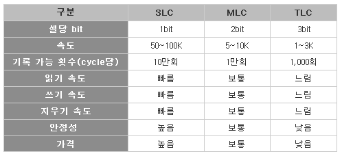
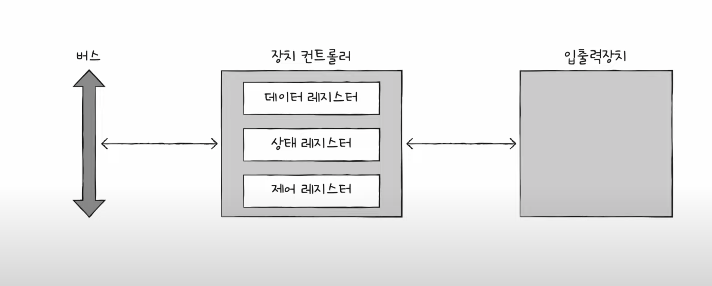
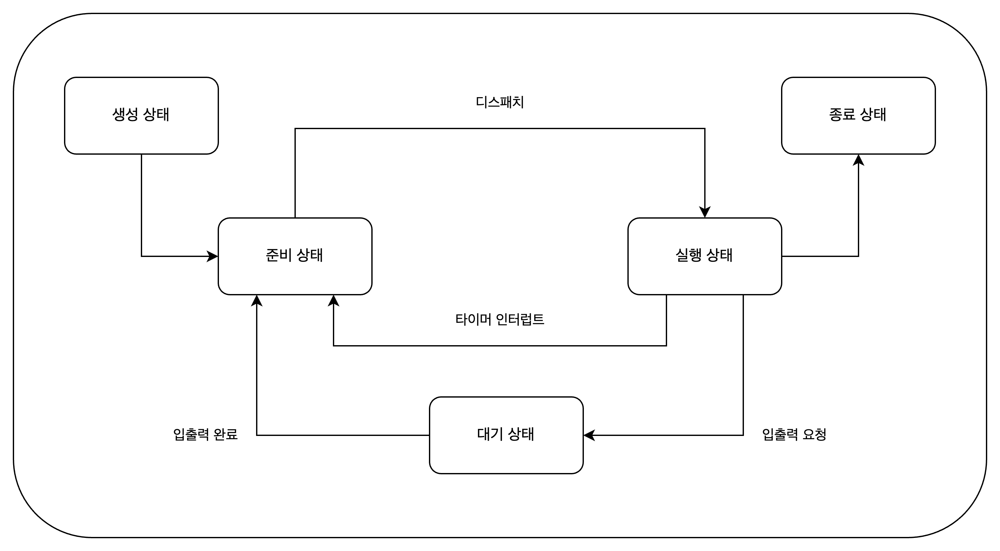

# 혼자 공부하는 컴퓨터 구조 + 운영체제

혼자 공부하는 컴퓨터 구조 + 운영체제 서적을 읽고 정리한 글입니다.

<!-- truncate -->

# Ch.01 컴퓨터 구조 시작하기

## 1.1 컴퓨터 구조를 알아야 하는 이유

### 문제 해결

코드상의 문제가 아닌 컴퓨터 구조의 문제일 때 해결 할 수 있다.

### 성능, 용량, 비용

문법만으로는 알기 어려운 성능, 용량, 비용을 고려하며 개발할 수 있다.

## 1.2 컴퓨터 구조의 큰 그림

컴퓨터의 구조 지식은 `컴퓨터가 이해하는 정보`와 `컴퓨터의 네 가지 핵심 부품`으로 구성되어 있다.

### 컴퓨터가 이해하는 정보

데이터는 숫자, 문자, 이미지, 동영상과 같은 정적인 정보를 의미한다.

명령어는 컴퓨터를 실질적으로 움직이는 정보이고 이 때 데이터는 명령어를 위한 일종의 재료이다.

### 컴퓨터의 4가지 핵심 부품

중앙처리장치(CPU, Central Processing Unit), 주기억장치(메모리, main memory), 보조기억장치(secondary storage), 입출력장치(input/output(I/O)
device)이다.

메모리는 현재 실행되는 프로그램의 명령어와 데이터를 저장한다.

CPU는 메모리에 저장된 명령어를 읽어 들이고, 읽어 들인 명령어를 해석하고 실행하는 부품이다. 산술논리연산장치(ALU, Arithmetic Logic Unit), 레지스터(register), 제어장치(CU,
Control Unit)로 이루어져있다.

> ALU는 계산을, 레지스터는 CPU 내부의 작은 저장 장치 역할을, 제어장치는 제어 신호(메모리 읽기, 쓰기 등)를 내보내고 명령어를 해석하는 역할을 한다.

보조기억장치는 전원이 꺼져도 저장된 내용을 잃지 않는 메모리를 의미한다.

입출력장치는 컴퓨터 외부에 연결되어 컴퓨터 내부와 정보를 교환할 수 있는 부품이다.

### 메인보드와 시스템 버스

위의 핵심 부품들이 메인보드에 연결된다. 메인보드의 여러 버스를 통해 부품끼리 정보를 주고 받는다. 시스템 버스는 핵심 부품을 연결한 버스이고, 주소 버스, 데이터 버스, 제어 버스로 이루어져있다.

## 마무리

1. 프로그램이 실행되려면 반드시 메모리에 저장되어 있어야 합니다.

# Ch.02 데이터

## 2.1 0과 1로 숫자를 표현하는 방법

### 정보 단위

비트(bit): 0과 1을 표현하는 가장 작은 정보 단위
워드(word): CPU가 한 번에 처리할 수 있느 정보의 크기 단위

### 이진법

이진법(binary): 0과 1로 수를 표현하는 방법

2의 보수를 이용하여 음수 만들기: 모든 0과 1을 뒤집고 1을 더한다. 플래그(flag)를 통하여 양수와 음수를 구분한다.

### 십육진법

이진수는 수의 길이가 너무 길어지기 때문에, 10부터 15까지 A~F를 할당한 16진법을 사용한다.

## 2.2 0과 1로 문자를 표현하는 방법

### 문자 집합과 인코딩

문자집합(character set): 컴퓨터가 이해할 수 있는 문자의 모음
인코딩(encoding): 코드화하는 과정, 문자를 0과 1로 이루어진 문자 코드로 변환하는 과정
디코딩(decoding): 코드를 해석하는 과정, 0과 1로 표현된 문자 코드를 문자로 변환하는 과정

### 아스키 코드

아스키 코드(ASCII code): 0과 1로 이루어진 문자 코드를 7비트로 표현한 것, 1비트는 오류 검출을 위해 사용되는 패리티 비트(parity bit)로 사용한다.

한글을 포함한 다른 언어 문자, 다양한 특수 문자를 표현할 수 없다. 따라서 언어별 인코딩 방식이 등장하였다.

### 유니코드와 UTF-8

유니코드(Unicode): 통일된 문자 집합, 여러 인코딩 방식이 존재한다.

UTF-8인코딩: 유니코드를 8비트로 표현하는 인코딩 방식, 1바이트에서 4바이트까지 사용할 수 있다.

## 확인 문제

3. 1101(2)의 음수를 2의 보수 표현법으로 구해 보세요.

```text
1101
// 1. 모든 비트를 뒤집는다.
0010
// 2. 1을 더한다.
0011
```

# Ch.03 명령어

## 3.1 소스 코드와 명령어

### 고급언어와 저급언어

고급 언어(high-level programming language): 사람이 이해하기 쉬운 언어이다.

저급 언어(low-level programming language): 컴퓨터가 이해하고 실행하는 언어이다.

저급 언어에는 기계어와 어셈블리어가 있다.

기계어(machine code): 0과 1로 이루어진 이진수로 이루어진 언어이다.

어셈블리어(assembly language): 기계어와 1:1 대응되는 기호로 이루어진 언어이다.

### 컴파일 언어와 인터프리터 언어

컴파일 언어(compile language): 컴파일러에 의해 저급 언어로 변환되는 언어이다. 소스코드가 컴파일러에 의해 목적 코드가 생성된다.

인터프리터 언어(interpreter language): 소스코드가 인터프리터에 의해 한 줄씩 실행된다.

## 3.2 명령어의 구조

### 연산 코드와 오퍼랜드

명령어는 연산 코드와 오퍼랜드로 구성된다.

연산 코드(operation code): 명령어의 기능을 나타내는 코드이다. 명령어가 수행할 연산을 나타낸다.

오퍼랜드(operand): 연산에 사용할 데이터 또는 연산에 사용할 데이터가 저장된 메모리 주소이다.

오퍼랜드 필드를 주소 필드라고도 한다. 오퍼랜드는 0개 또는 1개 이상일 수 있다.

연산 코드는 CPU의 종류에 따라 다르다. 대표적으로는 데이터 전송, 산술/논리 연산, 제어 연산, 입출력 연산이 있다.

### 주소 지정 방식

유효 주소(effective address): 명령어가 오퍼랜드를 참조하는 주소이다.

주소 지정 방식(addressing mode): 명령어가 오퍼랜드를 참조하는 방법이다.

- 즉시 주소 지정 방식(immediate addressing mode): 명령어에 직접 오퍼랜드를 기술하는 방법이다.
- 직접 주소 지정 방식(direct addressing mode): 오퍼랜드가 메모리 주소인 경우, 메모리 주소를 직접 기술하는 방법이다.
- 간접 주소 지정 방식(indirect addressing mode): 오퍼랜드가 메모리 주소인 경우, 메모리 주소가 저장된 메모리 주소를 기술하는 방법이다.
- 레지스터 주소 지정 방식(register addressing mode): 오퍼랜드가 레지스터인 경우, 레지스터 번호를 기술하는 방법이다.
- 레지스터 간접 주소 지정 방식(register indirect addressing mode): 오퍼랜드가 레지스터인 경우, 레지스터 번호가 저장된 메모리 주소를 기술하는 방법이다.

## 스택과 큐

### 스택

스택(stack): 후입선출(LIFO, Last In First Out) 구조이다. 데이터를 넣는 것을 푸시(push), 데이터를 꺼내는 것을 팝(pop)이라고 한다.

### 큐

큐(queue): 선입선출(FIFO, First In First Out) 구조이다. 데이터를 넣는 것을 인큐(enqueue), 데이터를 꺼내는 것을 디큐(dequeue)라고 한다.

# Ch.04 CPU의 작동 원리

## 4.1 ALU와 제어장치

### ALU

ALU는 레지스터로부터 피연산자를, 제어장치로부터 제어 신호를 받아 연산을 수행한다.

받아들인 정보를 바탕으로, 레지스터에 결괏값 또는 플래그를 내보낸다.

플래그는 연산 결과에 대한 추가적인 상태 정보를 담고 있다.

### 제어장치

제어장치가 받아들이는 정보

- 클럭 신호
- 명령어: 명령어 레지스터로부터 받아들인 명령어
- 플래그: 플래그 레지스터로부터 받아들인 플래그
- 제어 신호: 시스템 버스의 제어 버스로부터 받아들인 제어 신호

제어장치가 제어 신호를 내보내는 목적지

- CPU 내부의 레지스터
- CPU 내부의 ALU
- CPU 외부의 메모리 또는 입출력 장치(제어 버스)

## 4.2 레지스터

레지스터는 CPU 내부의 작은 임시저장장치로, 프로그램 속 명령어를 저장하거나 연산에 사용되는 데이터를 저장한다.

### 반드시 알아야 할 레지스터

CPU 마다 레지스터의 종류가 다르다.

공통적인 레지스터는 8개이다.

- 프로그램 카운터(PC, Program Counter): 다음에 실행할 명령어의 주소를 저장한다.
- 명령어 레지스터(IR, Instruction Register): 현재 실행 중인 명령어를 저장한다.
- 메모리 주소 레지스터(MAR, Memory Address Register): 메모리에 접근할 때 사용하는 주소를 저장한다.
- 메모리 버퍼 레지스터(MBR, Memory Buffer Register): 메모리에 접근할 때 사용하는 데이터를 저장한다.
- 플래그 레지스터(FR, Flag Register): 연산 결과에 대한 상태 정보를 저장한다.
- 범용 레지스터(AX, BX, CX, DX): 연산에 사용되는 데이터를 저장한다.
- 스택 포인터(SP, Stack Pointer): 스택의 최상위 주소를 저장한다.
- 베이스 포인터(BP, Base Pointer): 스택의 최하위 주소를 저장한다.(기준 주소)

### 특정 레지스터를 이용한 주소 지정 방식(1): 스택 주소 지정 방식

스택 주소 지정 방식은 스택 포인터(SP) 레지스터를 이용하여 스택의 주소를 지정하는 방식이다.

### 특정 레지스터 이용한 주소 지정 방식(2): 변위 주소 지정 방식

오퍼랜드 필드 값(변위)을 이용하여 유효 주소를 계산하는 방식이다.

- 변위 주소 지정 방식은 오퍼랜드 필드값(변위)과 특정 레지스터를 이용하여 유효 주소를 지정한다.
- 상대 주소 지정 방식은 오퍼랜드 필드값(변위)과 프로그램 카운터(PC) 레지스터를 이용하여 유효 주소를 지정한다
- 베이스 레지스터 주소 지정 방식은 오퍼랜드 필드값(변위)과 베이스 레지스터(BP) 레지스터를 이용하여 유효 주소를 지정한다.

### 확인 문제

2. 설명에 맞는 레지스터를 보기에서 찾아 빈칸을 채워보세요.

> `플래그 레지스터`: 연산 결과 혹은 CPU 상태에 대한 부가 정보를 저장하는 레지스터
> `프로그램 카운터`: 메모리에서 가져올 명령어의 주소를 저장하는 레지스터
> `범용 레지스터`: 데이터와 주소를 모두 저장할 수 있는 레지스터
> `명령어 레지스터`: 해석할 명령어를 저장하는 레지스터

## 4.3 명령어 사이클과 인터럽트

### 명령어 사이클

하나의 명령어를 처리하는 과정을 명령어 사이클이라고 한다.

인출 사이클(Fetch Cycle): 명령어를 메모리에서 가져오는 과정
실행 사이클(Execute Cycle): 명령어를 실행하는 과정
간접 사이클(Indirect Cycle): 간접 주소 지정 방식을 사용하는 명령어를 처리하는 과정

### 인터럽트

인터럽트는 CPU의 작업을 방해하는 신호를 말한다.

동기 인터럽트(Synchronous Interrupt): CPU에 의해 발생하는 인터럽트. 예외라고도 한다. 폴트, 트랩, 중단, 소프트웨어 인터럽트 등이 있다.

비동기 인터럽트(Asynchronous Interrupt): 외부 장치에 의해 발생하는 인터럽트. 하드웨어 인터럽트라고도 한다.

하드웨어 인터럽트: 알림과 같은 역할을 하는 인터럽트. 예를 들어, 타이머 인터럽트, 키보드 인터럽트 등이 있다.

하드웨어 인터럽트의 처리 순서

- 입출력 장치는 CPU에 인터럽트 요청 신호를 보낸다.
- CPU는 실행 사이클이 끝나고 명령어를 인출하기 전 항상 인터럽트 요청 신호를 확인한다.
- CPU는 인터럽트 요청을 확인하고 인터럽트 플래그를 통해 현재 인터럽트를 받아들일 수 있는지 여부를 확인한다.
- 인터럽트를 받아들일 수 있다면 CPU는 지금까지의 작업을 백업한다.
- CPU는 인터럽트 벡터를 참조하여 인터럽트 서비스 루틴을 실행한다.
- 인터럽트 서비스 루틴 실행이 끝나면 CPU는 백업한 작업을 복원한다.

인터럽트 요청 신호: 인터럽트 요청을 CPU에 알리는 신호. 플래그 레지스터의 인터럽트 플래그를 통해 인터럽트 요청을 확인한다.

하드웨어 인터럽트에는 인터럽트 플래그로 막을 수 있는 인터럽트(maskable interrupt)와 막을 수 없는 인터럽트(non-maskable interrupt)가 있다.

인터럽트 서비스 루틴: 인터럽트가 발생했을 때 실행되는 루틴으로 메모리에 저장된다. 인터럽트 벡터를 참조하여 실행된다.

인터럽트 벡터: 인터럽트 서비스 루틴의 주소를 저장한 테이블. 각각의 인터럽트를 구분하기 위한 정보를 가지고 있다.

인터럽트 벡터 테이블: 인터럽트 벡터를 모아놓은 테이블. 인터럽트 벡터 테이블은 메모리에 저장된다.

# Ch.05 CPU 성능 향상 기법

## 5.1 빠른 CPU를 위한 설계 기법

### 클럭

클럭 속도: 헤르츠(Hz) 단위로 측정한다. 1초에 몇 번 클럭 신호가 발생하는지를 나타낸다.

### 코어와 멀티코어

코어(Core): CPU 내부에 존재하는 연산장치.

멀티코어(Multi-Core): 하나의 CPU에 여러 개의 코어가 존재하는 것.

### 스레드와 멀티스레드

스레드(Thread): 프로세스 내에서 실행되는 흐름의 단위.

하드웨어적 스레드(Hardware Thread): 하나의 코어가 동시에 처리하는 명령어 단위. 하나의 코어로 여러 명령어를 동시에 처리하는 CPU를 멀티스레드 CPU라고 한다. 논리 프로세서(Logical
Processor)라고도 한다.

소프트웨어적 스레드(Software Thread): 하나의 프로그램에서 독립적으로 실행되는 단위. 하나의 프로그램을 여러 개의 스레드로 분할하여 동시에 실행하는 것을 멀티스레드 프로그래밍이라고 한다.

멀티코어 프로세서(Multi-Core Processor): 하나의 CPU에 여러 개의 코어가 존재하는 CPU.

멀티스레드 프로세서(Multi-Thread Processor): 하나의 프로세서가 여러 개의 스레드를 동시에 처리하는 CPU.

### 확인문제

4. 코어

## 5.2 명령어 병렬 처리 기법

### 명령어 파이프라인

명령어가 처리되는 과정을 비슷한 시간 간격으로 나누면 다음과 같다.

1. 명령어 인출(Instruction Fetch): 명령어를 메모리에서 가져오는 과정
2. 명령어 해석(Instruction Decode): 명령어를 해석하는 과정
3. 명령어 실행(Instruction Execute): 명령어를 실행하는 과정
4. 결과 저장(Write Back): 명령어의 실행 결과를 저장하는 과정

CPU는 같은 단계가 겹치지만 않으면 명령어를 동시에 처리할 수 있다. 이를 명령어 파이프라인이라고 한다.

명령어 파이프라인(Pipeline): 명령어가 처리되는 과정을 나누어서 동시에 처리하는 기법.

하지만, 파이프라인 위험이 따른다.

데이터 위험(Data Hazard): 명령어의 실행 결과가 다음 명령어의 실행에 영향을 미치는 경우. 명령어 간의 의존성에 의해 발생한다.
제어 위험(Control Hazard): 프로그램 카운터의 갑작스러운 변화에 의해 발생한다. 분기 예측(Branch Prediction)으로 해결한다.
구조적 위험(Structural Hazard): 서로 다른 명령어가 같은 CPU 부품(ALU, 레지스터 등)을 사용하는 경우.

### 슈퍼스칼라

명령어 파이프라인을 여러 개 사용하는 기법. 명령어를 여러 개의 파이프라인으로 나누어서 동시에 처리한다.(멀티 스레드 프로세서와 유사)

### 비순차적 명령어 처리(OoOE, Out-of-Order Execution)

명령어를 순차적으로 처리하는 것이 아니라, 명령어의 실행 결과가 필요한 명령어를 먼저 처리하는 기법.

## 5.3 CISR와 RISC

### 명령어 집합

명령어 집합(Instruction Set): CPU가 처리할 수 있는 명령어의 집합. 명령어 집합 구조(Instruction Set Architecture, ISA)라고도 한다.

현대 CPU의 명령어 집합은 크게 CISC와 RISC로 나뉜다.

### CISC

CISC(Complex Instruction Set Computer): 복잡한 명령어 집합. 다양하고 강력한 명령어를 활용한다. 상대적으로 적은 수의 명령어로 복잡한 작업을 처리할 수 있다.

명령어 파이프라이닝이 불리한 단점이 있다.

### RISC

RISC(Reduced Instruction Set Computer): 간단한 명령어 집합. 명령어의 수가 적고, 각 명령어의 기능이 단순하다. 명령어 파이프라이닝이 용이하다.

load-store 구조를 사용한다. 메모리 접근을 최소화 하고 레지스터를 많이 사용한다.

# Ch.06 메모리와 캐시 메모리

## 6.1 RAM의 특징과 종류

### RAM의 특징

RAM에는 실행할 대상이 저장된다. 하지만 휘발성 저장 장치로 전원을 끄게 되면 저장된 내용이 사라진다.

### RAM의 용량과 성능

RAM의 용량이 작다면, 보조기억장치 에서 실행할 프로그램을 가져오는 일이 잦아 실행시간이 길어진다.

### RAM의 종류

- DRAM(Dynamic RAM): 저장된 데이터가 동적으로 사라지는 RAM으로 데이터 소멸을 막기 위해 주기적으로 재활성화가 필요하다.
- SRAM(Static RAM): 저장된 데이터가 정적인 RAM으로 입출력 속도가 일반적으로 DRAM보다 빠르다. 캐시 메모리로 사용된다.
- SDRAM(Synchronous RAM): 클럭 신호와 동기화된 DRAM이다.
- DDR SDRAM(Double Data Rate SDRAM): 가장 대중적으로 사용하는 RAM이다. 대역폭을 넓혀 속도를 빠르게 만든 SDRAM으로,
    - DDR2 SDRAM은 SDR SDRAM의 두 배의 대역폭,
    - DDR4 SDRAM의 경우 16배의 대역폭을 갖는다.

## 6.2 메모리의 주소 공간

### 물리 주소와 논리 주소

메모리에 저장된 정보의 위치를 나타내는 주소에는 물리 주소와 논리 주소가 있다.

물리 주소는 메모리 하드웨어가 사용하는 주소로 정보가 실제로 저장된 하드웨어상의 주소이다.

논리 주소는 CPU와 실행 중인 프로그램이 사용하는 주소로 실행 중인 프로그램 각각에게 부여된 0부터 시작되는 주소를 의미한다.

CPU가 메모리와 상호작용하려면 논리 주소를 물리 주소로 변환하는 과정이 필요하다.

이 과정은 메모리 관리 장치(MMU,Memory Management Unit)라는 하드웨어에 의해 수행된다.

MMU는 논리 주소와 베이스 레지스터(프로그램의 기준 주소)값을 더하여 물리 주소로 변환한다.

### 메모리 보호 기법

한계 레지스터(limit register)는 다른 프로그램의 영역을 침범할 수 있는 명령어의 실행을 막는다.

`베이스 레지스터 값 <= 프로그램의 물리 주소 범위 < 베이스 레지스터 값 + 한계 레지스터 값`

이 됨을 알 수 있다.

CPU가 한계 레지스터보다 높은 논리 주소에 접근하려고 하면 인터럽트(트랩)를 발생시켜 실행을 중단한다.

## 6.3 캐시 메모리

CPU가 메모리에 접근 하는 시간은 CPU의 연산 속도보다 느리기 때문에 완충이 필요하다 라는 접근으로 시작한다.

### 저장 장치 계층 구조(Memory Hierarchy)

일반적으로 아래와 같은 명제를 따른다.

CPU와 가까운 저장 장치는 빠르고, 멀리 있는 저장 장치는 느리다.
속도가 빠른 저장 장치는 저장 용량이 작고 가격이 비싸다.

### 캐시 메모리

CPU와 메모리 사이에 위치한 SRAM 기반의 저장 장치이다.

메모리에서 CPU가 사용할 일부 데이터를 미리 캐시 메모리로 가져와 쓴다.

일반적으로, 계층적 캐시 메모리(L1-L2-L3 캐시)의 경우 L1과 L2의 경우 코어 내부에, L3 캐시는 코어 외부에 위치한다. 멀티 코어의 경우 L3는 공유하여 사용하기도 한다.

### 참조 지역성의 원리(locality of reference)

먼저 기반이 되는 내용에 대해 알아보자.

캐시 메모리는 메모리보다 용량이 작기 때문에, 메모리의 일부 정보를 저장하게 된다. 주로, CPU가 자주 사용할 법한 대상을 예측하여 저장한다.

예측한 데이터가 실제로 들어맞아 캐시 메모리 내 데이터가 CPU에서 활용될 경우를 캐시 히트(cache hit)라고 하고, 틀렸을 경우를 캐시 미스(cache miss)라고 한다.

### 캐시 적중률(cache hit ratio)

캐시 히트 횟수 / (캐시 히트 횟수 + 캐시 미스 횟수)

캐시 메모리가 메모리로부터 가져올 데이터를 결정하는 방법이 참조 지역성의 원리이다. 주된 경향은 다음과 같다.

CPU는 최근에 접근했던 메모리 공간에 다시 접근하려는 경향이 있다.
다음과 같이 구구단 2단을 출력하는 코드를 보자.

```java
public static void main(String[] args) {  
  int num = 2;  
  for (int i = 1; i <= 9; i++) {  
    System.out.printf("%d X %d = %d\n", num, i, num * i);  
  }  
}  
/** 실행 결과

* 2 X 1 = 2
* 2 X 2 = 4
* ...
* 2 X 8 = 16
* 2 X 9 = 18
**/
```

CPU는 접근한 메모리 공간 근처를 접근하려는 경향이 있다.(공간 지역성)CPU가 실행하려는 프로그램은 보통 관련 데이터들끼리 한데 모여있다.

프로그램 내부의 각 기능들 또한 서로 모여있다.

## 확인 문제(185p)

다음 설명을 읽고 SRAM에 대한 설명인지 DRAM에 대한 설명인지 쓰세요.
보기: SRAM, DRAM
책 깃허브에 올라온 이슈에 따라서 문항내용을 수정했다.

1) SRAM
2) DRAM
3) DRAM
4) SRAM

# Ch.07 보조 기억 장치

## 7.1 다양한 보조기억장치

### 하드 디스크

자기장의 원리로 데이터를 저장한다.

여러겹의 플래터와 스핀들로 구성되어 있다.

플래터는 자기 물질로 덮여 있어 0과 1의 역할을 하는 N극과 S극을 저장 한다.

스핀들은 플래터를 회전시킨다.

플래터의 데이터를 읽고 쓰는 구성 요소는 헤드로, 디스크 암에 부착되어 있다.

플래터는 트랙과 섹터 단위로 데이터를 저장한다. 여러 겹의 플래터 상의 같은 트랙이 위치한 곳을 모아 연결한 논리적 단위를 실린더라고 한다.

### 하드 디스크의 데이터 접근 과정

하드 디스크가 저장된 데이터에 접근 하는 시간은 탐색 시간, 회전 지연, 전송 시간으로 나뉜다.

탐색 시간(seek time)은 접근하려는 데이터가 저장된 트랙까지 헤드를 이동시키는 시간을 의미한다.

회전 지연(rotational latency)은 헤드가 있는 곳으로 플래터를 회전시키는 시간을 의미한다.

전송 시간(transfer time)은 하드 디스크와 컴퓨터 간에 데이터를 전송하는 시간을 의미한다.

### 플래시 메모리

전기적으로 데이터를 읽고 쓸 수 있는 반도체 기반 저장 장치이다.

플래시 메모리의 종류에는 NAND 플래시 메모리와 NOR 플래시 메모리가 있지만 주로 NAND 플래시 메모리가 사용된다.

플래시 메모리에는 셀이라는 단위가 있다.

한 셀에 저장할 수 있는 비트에 따라 1비트(SLC), 2비트(MLC), 3비트(TLC), 4비트(QLC)가 있다.

QLC는 주로 사용 되지 않고, 나머지 세개의 차이점은 다음과 같다.



이건 표 하나로 정리할 수 있겠다.

셀보다 더 큰 단위들에 대해 알아보자.

플래시 메모리의 저장단위인 셀들이 모여 페이지, 페이지가 모여 블록, 블록이 모여 플레인, 플레인이 모여 다이가 된다.

플래시 메모리에서 읽기와 쓰기는 페이지 단위로 이루어 진다. 하지만 삭제는 더 큰 단위인 블록 단위로 이루어진다.

이 때, 페이지는 세 개의 상태를 가질 수 있다. Free, Valid, Invalid 상태이다.

Free 상태는 어떠한 데이터도 저장하고 있지 않아 새로운 데이터를 저장할 수 있는 상태이다.

Valid 상태는 이미 유요한 데이터를 저장하고 있는 상태이다.

Invalid 상태는 쓰레기 값이라 부르는 유요하지 않은 데이터를 저장하고 있는 상태이다.

플래시 메모리에는 덮어 쓰기가 불가능 하기 때문에, 수정하고 싶은 값이 있다면 이를 Invalid 상태로 바꾸고 수정한 값을 남은 페이지에 저장한다. 플래시 메모리는 이러한 Invalid 값들을 정리하는 카비지
컬렉션 기능을 제공한다.

## 7.2 RAID의 정의와 종류

같은 용량이라면, 작은 단위의 하드 디스크로 RAID를 구성하는 것이 큰 단위의 하드 디스크 를 이용하는 것 보다 성능과 안정성 면에서 더 뛰어나다.

### RAID의 정의

RAID(Redundant Array of Independent Disks)는 주로 하드 디스크와 SSD를 사용하는 기술로 데이터의 안전성 혹은 높은 성능을 위해 여러 개의 물리적 보조기억장치를 마치 하나의 논리적
보조기억장치처럼 사용하는 기술을 말한다.

### RAID의 종류

RAID의 구성 방법을 RAID 레벨이라 표현하는데 대표적으로 RAID 0 ~ RAID6이 있다.

이중 0, 1, 4, 5, 6에 대해 알아보자

RAID 0은 데이터를 단순히 나누어 저장하는 방식이다.

분산되어 저장된 데이터를 스트라입(stripe, 줄무늬)이라고 하고 이런 방식으로 저장하는 것을 스트라이핑이라고 한다.

입출력 속도를 향상 시킬 수 있지만 저장된 정보가 안전하지 않을 수 있다.

RAID 1은 복사본을 만드는 방식으로 미러링이라고도 부른다. 원본과 복사본을 만들게 되므로 쓰기 속도가 RAID 0보다 느리다.

백업과 복구가 쉽지만 필요한 용량이 증가하는 단점이 있다.

RAID 4는 완전한 복사본을 만드는 대신 패리티 비트를 이용하여 오류를 검출하고 복구 하기 위한 정보를 저장한다.

RAID 1보다 적은 용량을 필요로 하지만, 쓰기 작업에서 패리티 디스크의 병목 현상이 발생한다.

RAID 5는 패리티를 분산하여 저장하는 방식이다.

RAID 6는 두 종류의 패리티를 저장하는 방식이다. RAID5 보다 안전하지만 쓰기 속도는 느리다.

각 RAID의 장단점에 대해 알아두는 것이 중요하다.

## 확인문제(p.205)

다음 보기에 있는 저장 장치들로 저장 장치 계층 구조 도식도를 채우세요.
보기: 메모리, 보조기억장치, 캐시 메모리, 레지스터

위 부터 1) 레지스터, 2) 캐시메모리, 3) 메모리, 4) 보조저장장치

RAID의 정의와 종류를 간단히 정리해보자
RAID(Redundant Array of Independent Disks)는 다수의 하드 디스크나 SSD를 하나의 저장장치 처럼 사용하는 기술로, 데이터의 안정성이나 성능을 향상 시킬 수 있다.

- RAID 0: 데이터를 단순히 병렬로 분산하여 저장한다.
- RAID 1: 데이터의 복사본을 만들어 저장한다.
- RAID 4: 패리티를 따로 저장하는 방식이다.
- RAID 5: 패리티를 분산하여 저장하는 방식이다.
- RAID 6: 두 종류의 패리티를 저장하는 방식이다.

# Ch.08 입출력 장치

## 8.1 장치 컨트롤러와 장치 드라이버

스피커, 모니터, 키보드, 마우스 등과 같은 입출력장치와 외장 하드 디스크나 USB 메모리 등 보조 기억장치가 어떻게 컴퓨터 내부와 정보를 주고받는 지 알아보자.

### 장치 컨트롤러(device controller)

입출력 장치는 종류가 다양해 규격화하기 어렵고, 데이터 전송률이 낮기 때문에 CPU, 메모리보다 다루기가 까다롭다.

이와 같은 이유로, 입출력장치는 입출력 제어기(I/O controller), 입출력 모듈(I/O module) 등으로 불리는 장치 컨트롤러를 통하여 컴퓨터 내부와 연결된다.

장치 컨트롤러는 CPU와 입출력장치 간의 통신 중개, 오류 검출, 데이터 버퍼링등의 역할을 한다.

데이터 버퍼링은 전송률이 높은 장치와 낮은 장치 사이에 주고받는 데이터를 버퍼라는 임시 저장 공간에 저장하여 전송률을 비슷하게 맞추는 방법이다.

### 장치 컨트롤러의 구조



데이터 레지스터는 CPU와 입출력장치 사이에 주고받을 데이터가 담기는 레지스터이다. 앞서 말한 버퍼 역할을 한다. 데이터가 많은 입출력장치에서는 레지스터 대신 RAM을 사용하기도 한다.

상태 레지스터는 입출력장치가 입출력 작업을 한 준비가 되었는지, 입출력 작업이 완료되었는지, 입출력장치에 오류는 없는지 등의 상태 정보가 저장된다.

제어 레지스터는 입출력장치가 수행할 내용에 대한 제어 정보와 명령을 저장한다.

### 장치 드라이버(device driver)

장치 컨트롤러의 동작을 감지하고 제어하는 프로그램이다. 운영체제가 장치 드라이버를 인식하고 실행한다.

장치 컨트롤러는 하드웨어, 장치 드라이버는 소프트웨어

장치 컨트롤러를 통해 연결된 입출력 장치의 사용법을 메모리(장치 드라이버)가 알려준다.

## 8.2 다양한 입출력 방법

3가지 입출력 방법에 대해 알아보자.

프로그램 입출력, 인터럽트 기반 입출력, DMA 입출력이 있다.

### 프로그램 입출력(programmed I/O)

프로그램 속 명령어로 입출력 장치를 제어하는 방법이다. 입출력 명령어로써 장치 컨트롤러와 상호작용한다.

메모리에 저장된 정보를 하드 디스크에 백업 하는 과정을 살펴보자.

CPU는 하드디스크 컨트롤러의 제어 레지스터에 쓰기 명령을 보낸다.
하드 디스크 컨트롤러는 하드 디스크 상태를 확인하고, 준비된 상태라면 상태 레지스터에 준비되었다고 표시한다.
CPU는 상태 레지스터를 주기적으로 읽으며 하드 디스크의 준비여부를 확인하는데, 하드 디스크가 준비가 됐음을 알게 되면 백업할 메모리의 정보를 데이터 레지스터에 쓴다.
백업 작업이 완료 될 때 까지 1~3을 반복한다.

정리하자면, CPU가 장치 컨트롤러의 레지스터 값을 읽고 쓰는 것이다.

그렇다면 CPU는 여러 장치 컨트롤러 내부의 레지스터들과 어떻게 소통할 수 있는 것일까?

프로그램 입출력 방식에는 메모리 맵 입출력과 고립형 입출력 방식이 있다.

메모리 맵 입출력(memory-mapped I/O)은 메모리에 접근하기 위한 주소 공간과 입출력장치에 접근하기 위한 주소 공간을 하나의 주소 공간으로 간주하는 방법이다. 통일된 메모리에 접근하는 명령어와 입출력장치에
접근하는 명령어를 사용하게 된다.

고립형 입출력(isolated I/O)은 메모리를 위한 주소 공간과 입출력장치를 위한 주소 공간을 분리하는 방법이다. 서로 다른 버스를 이용하기 때문에, 독립된 명령어를 사용하게 된다.

### 인터럽트 기반 입출력

장치 컨트롤러가 CPU에 인터럽트가 요청 신호를 보내면 CPU는 하던 일을 잠시 백업하고 인터럽스 서비스 루틴을 실행한다.

동시다발적인 인터럽트가 발생했을 때 어떻게 처리하는지 알아보자.

순차적으로 처리하는 방법, 우선순위를 반영한 처리 방법이 있다.

현실적으로 순차적으로 처리하는 방법은 불가능하기 때문에, 플래그 레지스터 속 인터럽트 비트가 활성화 되어있거나 인터럽트 비트를 비활성화해도 무시할 수 없는 인터럽트인 NMI(Non-Maskalbe Interrupt)
가 발생한 경우 CPU는 우선순위가 높은 인터럽트부터 처리한다.

우선순위를 반영한 처리방법은 주로 PIC(Programmable Interrupt Controller, 프로그래머블 인터럽트 컨트롤러)라는 하드웨어를 사용한다.

PIC는 여러 장치 컨트롤러에 연결되어 장치 컨트롤러에서 보낸 하드웨어 인터럽트 요청들의 우선순위를 판별한 뒤 CPU에 지금 처리해야 할 하드웨어 인터럽트를 알려준다.

### DMA 입출력(Direct Memory Access I/O)

위의 두 방식은 입출력장치와 메모리 간의 데이터 이동은 CPU가 주도하고, 이동하는 데이터도 반드시 CPU를 거친다는 공통점을 갖는다.

입출력장치를 위한 연산을 CPU가 처리하게 되므로 CPU 부담이 커진다. 이를 개선한 입출력 장치의 메모리가 CPU를 거치지 않고도 상호작용 할 수 있는 DMA방식이 등장했다.

이름 그대로 장치 컨트롤러가 메모리에 직접 접근할 수 있는 입출력 기능이다. 시스템 버스에 연결된 DMA 컨트롤러라는 하드웨어가 필요하다.

CPU는 DMA컨트롤러에 입출력 작업을 명령하면, DMA 컨트롤러는 CPU를 대신하여 장치 컨트롤러와 상호작용한다. 작업이 끝나게 되면 DMA 컨트롤러는 CPU에 인터럽트를 걸어 작업이 끝났음을 알리게 된다.

결국 CPU는 입출력 작업과 끝만 관여하게 된다.

하지만 시스템 버스는 공용자원이기 때문에, CPU와 DMA 컨트롤러가 동시에 접근이 불가능하다. DMA의 시스템 버스 이용을 사이클 스틸링(cycle stealing)이라고 한다.

마지막으로 DMA 컨트롤러와 장치 컨트롤러의 연결 방식과 입출력 버스에 대해 알아보자.

장치 컨트롤러가 시스템 버스에 직접 연결되면, DMA 과정에서 시스템 버스를 2번 이용하게 된다. 즉 CPU가 시스템 버스를 이용하지 못하는 상황이 자주 발생한다는 뜻이다.

DMA 컨트롤러와 장치 컨트롤러들을 입출력 버스(input/output bus)라는 별도의 버스에 연결하여 이를 해결 할 수 있다.

입출력 버스의 종류에는 PCI(Peripheral Component Interconnect)버스, PCI Express(PCIe) 버스가 있다.

현재는 입출력 전용 프로세서 (입출력 채널)를 탑재하기도 한다.

# Ch.09 운영체제 시작하기

## 9.1 운영체제를 알아야 하는 이유

### 운영체제

모든 프로그램은 실행을 위해 시스템 자원을 필요로 한다.

운영체제는 시스템 자원을 관리하고, 프로그램이 필요로 하는 자원을 할당해주는 역할을 하는 프로그램이다.

운영체제 또한 프로그램이기 때문에, 메모리에 적재 되지만 그 중에서 커널 영역에 적재되어 실행된다.

운영체제는 응용 프로그램들을 메모리의 어느 위치에 적재할지, 어느 시점에 실행할지, 어느 시점에 종료할지를 관리한다.

또한 운영체제는 CPU도 관리한다. CPU는 한 번에 하나의 프로그램만 실행할 수 있기 때문에, CPU를 어떤 프로그램에 할당할지를 관리한다.

### 운영체제를 알아야 하는 이유

운영체제는 개발자를 위한 프로그램이 아닌 프로그램을 위한 프로그램이다.

운영체제는 개발자가 프로그램을 개발할 때, 개발자가 신경쓰지 않아도 되는 부분을 대신 처리해준다.

## 9.2 운영체제의 큰 그림

### 운영체제의 심장, 커널

자원에 접근하고 조작하는 기능, 프로그램이 올바르고 안전하게 실행되게 하는 이러한 운영체제의 핵심 서비스를 담당하는 부분이 커널이다.

### 이중모드와 시스템 호출

응용 프로그램은 자원에 직접 접근할 수 없다.

운영체제는 응용 프로그램이 자원에 접근할 수 있도록 시스템 호출을 제공한다.

시스템 호출은 운영체제의 커널 영역에 있는 함수를 호출하는 것이다.

이중모드란 CPU가 명령어를 실행하는 모드를 크게 사용자 모드와 커널 모드로 나누는 것이다.

사용자 모드로 실행되는 프로그램이 자원에 접근하는 운영체제 서비스를 제공 받으려면 시스템 호출을 통해 커널 모드로 변경되어야 한다.

시스템 호출은 소프트웨어 인터럽트를 발생시켜 커널 모드로 변경한다.

### 운영체제의 핵심 서비스

실행중인 프로그램을 프로세스라고 한다.

일반적으로 CPU는 한 번에 하나의 프로세스만 실행할 수 있기 때문에 번갈아가며 실행한다.

운영체제는 CPU를 어떤 프로세스에 할당할지를 관리하는데, 이 내용은 10장에서 다룬다.

모든 프로세스는 실행을 위해 자원을 필요로 한다.

운영체제는 프로세스가 필요로 하는 자원을 할당하고, 프로세스가 자원을 사용하는 것을 관리한다.

CPU 스케줄링, 메모리 관리, 파일 관리, 입출력 관리 등이 이러한 자원 관리에 해당한다.

이후의 내용에서 다룬다.

# Ch.10 프로세스와 스레드

## 10.1 프로세스 개요

### 프로세스 직접 확인하기

포그라운드 프로세스(foreground process)는 사용자가 볼 수 있는 공간에서 실행되는 프로세스이다.

백그라운드 프로세스(background process)는 사용자가 볼 수 없는 공간에서 실행되는 프로세스이다.

백그라운드 프로세스에는 두 가지 종류가 있는데, 하나는 사용자와 직접 상호작용할 수 있는 프로세스이고, 다른 하나는 사용자와 직접 상호작용할 수 없는 프로세스이다.

사용자와 상호작용하지 않고 백그라운드에서 실행되는 프로세스를 데몬(daemon), 서비스라고 한다.

### 프로세스 제어 블록

모든 프로세스는 실행을 위해 CPU를 필요로 한다.

운영체제는 프로세스 제어 블록(Process Control Block, PCB)이라는 자료구조를 사용하여 프로세스를 관리한다.

타이머 인터럽트를 통하여 프로세스를 스위칭한다.

프로세스 제어 블록에는 프로세스의 상태, 프로그램 카운터, 레지스터, 스택 포인터, 스택, 프로세스 번호, 프로세스 우선순위, 프로세스가 사용하는 자원 등이 포함되어 있다.

프로세스 ID(Process ID, PID): 프로세스를 구분하기 위한 고유한 번호이다.
레지스터 값: 프로세스가 실행되는 동안 변경되는 값이다. 프로그램 카운터를 비롯한 레지스터 값들이 담긴다.
프로세스 상태: 현재 프로세스가 어떤 상태인지를 나타낸다.
CPU 스케쥴링 정보: 프로세스의 우선순위, 스케쥴 큐에 대한 포인터 등이 포함된다.
메모리 관리 정보: 프로세스가 사용하는 메모리의 주소 범위, 페이지 테이블에 대한 포인터 등이 포함된다.
사용한 파일과 입출력장치목록: 프로세스가 사용하는 입출력 장치에 대한 포인터 등이 포함된다.

### 문맥 교환

문맥: 프로세스 수행을 재개하기 위해 기억해야할 중간 정보를 말한다.

문맥 교환(context switch)은 프로세스가 CPU를 사용하다가 다른 프로세스가 CPU를 사용하도록 하는 것을 말한다.

### 프로세스의 메모리 영역

프로세스는 사용자 영역에 코드 영역, 데이터 영역, 힙 영역, 스택 영역으로 나뉘어 저장된다.

코드 영역(텍스트 영역): 기계어로 이루어진 명령어가 저장된다. 쓰기가 금지되어 있는 읽기 전용(read-only) 영역이다.
데이터 영역: 전역 변수와 정적 변수가 저장된다. 초기화된 데이터는 데이터 영역에 저장되고, 초기화되지 않은 데이터는 BSS 영역에 저장된다.
힙 영역: 프로그래머가 직접 할당할 수 있는 영역이다. 메모리 누수가 발생할 수 있으므로 주의해야 한다.
스택 영역: 함수의 호출과 관계되는 지역 변수와 매개변수가 저장된다. 함수의 호출이 끝나면 스택 영역에서 제거된다.

## 10.2 프로세스 상태와 계층 구조

### 프로세스 상태

프로세스 상태는 프로세스가 현재 어떤 작업을 하고 있는지를 나타낸다.

생성 상태: 프로세스를 생성 중인 상태이다. 메모리에 적재되어 PCB를 할당받은 상태이다.
준비 상태: 프로세스가 메모리에 적재되어 CPU를 기다리는 상태이다. 준비 상태인 프로세스가 실행 상태로 전환되는 것을 디스패치(dispatch)라고 한다.
실행 상태: 프로세스가 CPU를 점유하고 명령어를 실행하는 상태이다.
대기 상태: 프로세스가 입출력을 기다리는 상태이다. 입출력이 완료되면 준비 상태로 전환된다.
종료 상태: 프로세스가 실행을 마치고 종료된 상태이다. 운영체제는 PCB와 메모리를 해제한다.

### 프로세스 계층 구조

프로세스는 계층 구조로 관리된다. 부모 프로세스는 자식 프로세스를 생성할 수 있고, 자식 프로세스는 부모 프로세스의 자원을 공유할 수 있다.

부모 프로세스와 자식 프로세스는 별개의 프로세스이므로 각각의 PCB를 가진다.

### 프로세스 생성 기법

부모 프로세스는 fork와 exec를 통해 자식 프로세스를 생성할 수 있다.

부모 프로세스는 fork 시스템 호출을 통해 자신의 복사본을 자식 프로세스로 생성한다.

자식 프로세스는 exec 시스템 호출을 통해 자신의 메모리 공간을 다른 프로그램으로 덮어쓴다.

### 확인 문제

1. 다음은 프로세스 상태를 보여주는 프로세스 상태 다이어그램입니다.



## 10.3 스레드

여기서 다루는 스레드는 소프트웨어적인 스레드이다.

### 프로세스와 스레드

스레드(thread)는 프로세스를 구성하는 실행 흐름의 단위이다. 프로세스는 하나 이상의 스레드를 가질 수 있다.

많은 프로그램은 하나의 프로세스에서 여러 개의 스레드를 생성하여 병렬 처리를 수행한다. 이러한 프로그램을 멀티스레드 프로그램이라고 한다.

스레드는 스레드 ID, 프로그램 카운터, 레지스터 집합, 스택으로 구성된다. 실행에 필요한 죄소한의 정보를 갖고 있다.

스레드는 프로세스의 자원을 공유한다.

### 멀티프로세스와 멀티스레드

여러 프로세스를 동시에 실행하는 것을 멀티프로세싱, 여러 스레드로 프로세스를 동시에 실행하는 것을 멀티스레딩이라고 한다.

프로세스 끼리는 자원을 공유할 수 없지만, 스레드는 프로세스의 자원을 공유할 수 있다.

# Ch.11 CPU 스케줄링

CPU 스케줄링이란 운영체제가 프로세스들에게 CPU 자원을 할당하는 것이다.

## 11.1 CPU 스케줄링 개요

### 프로세스 우선순위

프로세스들은 우선순위를 가지고 있다. 우선순위가 높은 프로세스가 우선적으로 CPU를 할당받는다.

보통 입출력 작업이 많은 입출력 집중 프로세스(Interactive Process)의 우선순위가 CPU 집중 프로세스(CPU-Bound Process)보다 높다.

프로세스의 우선순위는 프로세스의 PCB(Process Control Block)에 저장된다.

### 스케줄링 큐

PCB에 우선순위가 저장되어 있지만, CPU를 사용할 다음 프로세스를 찾기 위해 운영체제가 모든 프로세스를 검색하는 것은 비효율적이다.

이를 해결하기 위해 운영체제는 스케줄링 큐(Scheduling Queue)를 사용한다. 반드시 FIFO 방식이지는 않다.

준비 큐는 프로세스가 CPU를 사용할 준비가 되었을 때, 대기 큐는 프로세스가 입출력을 기다리고 있을 때, 완료 큐는 프로세스가 종료되었을 때 사용된다.

대기큐는 같은 장치를 요구한 프로세스들은 같은 큐에 저장된다.

### 선점형 스케줄링과 비선점형 스케줄링

선점형 스케줄링(Preemptive Scheduling)은 프로세스가 CPU를 사용하고 있을 때, 운영체제가 강제로 프로세스를 중단시키고 다른 프로세스를 실행시키는 것이다.

비선점형 스케줄링(Non-Preemptive Scheduling)은 프로세스가 CPU를 사용하고 있을 때, 운영체제가 강제로 프로세스를 중단시키지 않는 것이다.

각각의 장단점이 있다.

## 11.2 CPU 스케줄링 알고리즘

### 선입 선처리 스케줄링(FCFS, First-Come First-Served Scheduling)

준비 큐에 있는 프로세스들을 도착한 순서대로 CPU를 할당하는 비선점형 스케줄링이다.

호위 효과(convoy effect)가 발생할 수 있다.

### 최단 작업 우선 스케줄링(SJF, Shortest-Job-First Scheduling)

CPU 사용이 가장 짧은 프로세스를 우선적으로 CPU를 할당하는 비선점형 스케줄링이다. 선점형으로도 구현 가능하다.

### 라운드 로빈 스케줄링(RR, Round-Robin Scheduling)

선입 선처리 스케줄링 + 타임 슬라이스(Time Slice)를 사용하는 선점형 스케줄링이다.

타임 슬라이스는 프로세스가 CPU를 사용할 수 있는 시간을 의미한다.

타임 슬라이스가 끝나면 프로세스는 준비 큐의 맨 뒤로 이동한다.

### 최소 잔여 시간 우선 스케줄링(SRT, Shortest-Remaining-Time Scheduling)

라운드 로빈 스케줄링 + 최단 작업 우선 스케줄링을 사용하는 선점형 스케줄링이다.

### 우선순위 스케줄링(Priority Scheduling)

프로세스마다 우선순위를 부여하고, 우선순위가 높은 프로세스를 우선적으로 CPU를 할당하는 비선점형 스케줄링이다.

기아 현상(starvation)이 발생할 수 있다. 이를 해결하기 위한 방법으로 에이징 기법(Aging)이 있다.

이는 오랫동안 CPU를 사용하지 못한 프로세스의 우선순위를 높여주는 방법이다.

### 다단계 큐 스케줄링(Multi-Level Queue Scheduling)

우선순위 스케줄링의 발전된 형태이다.

우선순위별로 준비 큐를 여러 개 만들고, 우선순위가 높은 큐에 있는 프로세스를 우선적으로 CPU를 할당한다.

### 다단계 피드백 큐 스케줄링(Multi-Level Feedback Queue Scheduling)

다단계 큐 스케줄링의 발전된 형태이다.

새로 준비 상태가 된 프로세스가 있다면 우선순위가 가장 높은 큐에 넣고, 타임 슬라이스동안 실행한다.

타임 슬라이스 동안 실행이 끝나지 않으면 우선순위를 낮추고, 다음 우선순위 큐에 넣는다.

CPU를 오래 사용해야 하는 프로세스는 점차 우선순위가 낮아진다.

에이징 기법을 사용하여 우선순위가 낮아진 프로세스의 우선순위를 높여서 기아 현상을 방지할 수 있다.

### 확인 문제

1. 준비 큐에 프로세스 A,B,C,D 순으로 삽입되었다고 가정했을 때, 선입 선처리 스케줄링 알고리즘을 적용하면 어떤 프로세스 순서대로 CPU를 할당받게 될까?

`A-B-C-D`

# Ch.12 프로세스 동기화

## 12.1 동기화란

동시다발적으로 실행되는 프로세스들은 서로 협력하며 작업을 수행한다.

이 과정에서 자원의 일관성을 보장해야 한다.

### 동기화의 의미

동기화는 프로세스들이 서로 협력하여 작업을 수행하는 것을 의미한다.

동기화에는 실행 순서 제어를 위한 동기화와 상호 배제를 위한 동기화가 있다.

- 실행 순서 제어를 위한 동기화: reader writer 문제

Writer: 파일에 값을 저장하는 프로세스
Reader: 파일에서 값을 읽어오는 프로세스

둘은 실행의 순서가 있다. Reader 프로세스는 Writer 프로세스가 파일에 값을 저장할 때까지 기다려야 한다.

- 상호 배제를 위한 동기화: Bank Account 문제, Producer Consumer 문제

공유가 불가능한 자원의 동시 사용을 막는 것이다.

### 공유 자원과 임계 구역

공유 자원: 여러 프로세스 혹은 스레드가 공유하고 있는 자원

전역 변수, 파일, 입출력장치, 메모리 등이 있다.

임계 구역: 동시에 실행하면 문제가 발생하는 자원에 접근하는 코드

진입한 프로세스가 임계 구역을 빠져나가기 전까지 다른 프로세스는 임계 구역에 진입할 수 없다.

임계 구역에 동시에 접근하면 자원의 일관성이 깨질 수 있고, 이를 레이스 컨디션(race condition)이라고 한다.

상호 배제를 위한 동기화를 위한 세 가지 원칙

- 상호 배제: 임계 구역에 진입한 프로세스는 다른 프로세스가 진입할 수 없다.
- 진행: 임계 구역에 어떤 프로세스도 진입하지 않았다면, 임계 구역에 진입하고자 하는 프로세스는 진입할 수 있어야 한다.
- 유한 대기: 한 프로세스가 임계 구역에 진입하고 싶다면 그 프로세스는 언젠가는 임계 구역에 진입할 수 있어야 한다.

## 12.2 동기화 기법

뮤텍스 락, 세마포, 모니터를 학습한다.

### 뮤텍스 락

상호 배제를 위한 동기화 기법이다.

뮤텍스 락은 전역 변수 하나와 함수 두 개로 구성된다.

- lock: 프로세스들이 공유하는 전역 변수
- acquire: 임계 구역을 잠그는 역할
- release: 임계 구역의 잠금을 해제하는 역할

뮤텍스 락은 임계 구역에 진입하기 전에 acquire 함수를 호출하여 잠금을 걸고, 임계 구역을 빠져나올 때 release 함수를 호출하여 잠금을 해제한다.

### 세마포

세마포는 뮤텍스 락과 비슷하지만, 조금 더 일반화 된 방식의 동기화 도구이다.

공유 자원이 여러 개인 경우에도 사용할 수 있다.

세마포는 전역 변수 하나와 함수 두 개로 구성된다.

- semaphore: 임계 구역에 진입할 수 있는 프로세스의 개수를 나타내는 전역 변수
- wait: 임계구역에 들어가도 좋은지 기다려야 할지를 알려주는 역할
- signal: 임계구역에 들어가도 좋다는 신호를 보내는 역할

wait 함수는 사용할 수 있는 자원이 없을 경우 해당 프로세스를 대기 상태로 만들고, 해당 프로세스의 PCB를 세마로를 위한 대기 큐에 넣는다.

세마포는 실행 순서 동기화에도 사용이 가능하다.

세마포 변수 S를 0으로 두고, 먼저 실행할 프로세스 뒤에 signal 함수를 호출하고, 나중에 실행할 프로세스 뒤에 wait 함수를 호출한다.

### 모니터

자바가 이용하는 동기화 기법이다.

모니터는 공유 자원과 공유 자원에 접근하기 위한 인터페이스를 묶어서 관리한다. 공유 자원에 접근하기 위해서는 반드시 인터페이스를 통해 접근해야 한다.

상호 배제를 위한 동기화는 인터페이스를 위한 큐를 이용한다.

실행 순서 제어를 위한 동기화는 조건 변수를 이용한다. 조건 변수에 대한 큐를 이용한다.

### 확인 문제

1. 뮤텍스 락과 세마포에 대한 설명으로 옳지 않은 것

4) 세마포를 이용하면 반드시 바쁜 대기를 해야 한다.

# Ch.13 교착 상태

## 13.1 교착 상태란

### 식사하는 철학자 문제

서로가 점거하고 있는 자원을 서로가 기다리고 있을 때 발생한다.

### 자원 할당 그래프

교착 상태가 발생했을 때의 상황을 그래프로 표현한 것이다.

프로세스는 원으로, 자원은 사각형으로 표현한다.

자원의 개수는 자원 사각형 내에 점으로 표현한다.

프로세스가 어떤 자원을 할당받아 사용 중이라면 자원에서 프로세스를 향해 화살표를 그린다.

프로세스가 어떤 자원을 기다리고 있다면 프로세스에서 자원을 향해 화살표를 그린다.

교착 상태가 발생한 자원 할당 그래프는 원의 형태를 띈다.

### 교착 상태 발생 조건

교착 상태가 발생하기 위해서는 다음 네 가지 조건이 모두 충족되어야 한다.

1. 상호 배제(Mutual exclusion): 자원은 한 번에 한 프로세스만 사용할 수 있다.
2. 점유 대기(Hold and wait): 프로세스가 할당된 자원을 가진 상태에서 다른 자원을 기다린다.
3. 비선점(No preemption): 프로세스가 어떤 자원을 점유하고 있으면 다른 프로세스가 강제로 뺏을 수 없다.
4. 순환 대기(Circular wait): 각 프로세스는 순환적으로 다음 프로세스가 요구하는 자원을 가지고 있다.

## 13.2 교착 상태 해결 방법

교착 상태 해결 방법에는 크게 세 가지가 있다.

### 교착 상태 예방

1. 상호 배제 조건을 제거한다. 모든 자원을 공유하게 만드는 것이다. 현실적이지 않다.
2. 점유 대기 조건을 제거한다. 자원을 할당받은 후에 다른 자원을 요구하지 않도록 한다. 자원의 활용률을 낮춘다.
3. 비선점 조건을 제거한다. 자원을 점유하고 있는 프로세스가 다른 자원을 요구할 때 자원을 뺏을 수 있도록 한다. 선점이 가능한 자원에 한해 효과적이지만 선점이 불가능한 자원에 대해서는 효과가 없다.
4. 순환 대기 조건을 제거한다. 자원을 요구하는 순서를 정해 순환을 없앤다. 자원의 활용률을 낮춘다.

### 교착 상태 회피

교착 상태가 무분별한 자원 할당으로 인해 발생했다고 간주한다. 따라서 자원을 할당하기 전에 교착 상태가 발생하지 않을 것이라고 예상되는 경우에만 자원을 할당한다.

안전 순서열: 시스템의 자원을 할당해도 교착 상태가 발생하지 않는 순서열
안전 상태: 안전 순서열이 있는 상태.
불안전 상태: 안전 순서열이 없는 상태.

### 교착 상태 검출 후 회복

사후에 조치하는 방식이다.

선점을 통한 회복: 교착 상태가 해결될 때까지 한 프로세스씩 자원을 몰아주는 방식.
프로세스 강제 종료를 통한 회복: 교착 상태가 해결될 때까지 교착 상태에 있는 프로세스를 강제로 종료시키는 방식.


# Ch.14 가상 메모리

## 14.1 연속 메모리 할당

연속 메모리 할당은 프로세스 내에 연속적인 메모리 공간을 할당하는 방식이라고 한다.

### 스와핑

현재 사용되지 않는 프로세스들을 보조기억장치의 스왑 영역으로 옮기고, 새로 생긴 빈 공간에 실행할 프로세스를 적재하는 것을 말한다.

스와핑을 하게 되면, 프로세스들이 요구하는 메모리 공간의 크기가 실제 메모리 크기보다 크더라도 동시에 실행할 수 있다.

### 메모리 할당

프로세스가 실행되기 위해서는 메모리 내의 빈 공간에 적재되어야 한다. 최초 적합, 최적 적합, 최악 적합의 세 가지 적재 방식이 있다.

최초 적합(first-fit)은 운영체제가 메모리 내의 빈 공간을 탐색할 때, 가장 먼저 발견되는 공간에 프로세스를 적재하는 방식이다. 검색을 최소화할 수 있고 할당이 빠르다.
최적 적합(best-fit)은 운영체제가 매모리 내의 빈 공간을 모두 탐색한 후, 적재 가능한 가장 작은 공간에 할당하는 방식이다
최악 적합(worst-fit)은 운영체제가 매모리 내의 빈 공간을 모두 탐색한 후, 적재 가능한 가장 큰 공간에 할당하는 방식이다.

### 외부 단편화

프로세스를 메모리에 연속적으로 배치하는 연속 메모리 할당은 메모리를 효율적으로 사용하는 방법이 아니다.
외부 단편화(external fragmentation)라는 메모리 내에 여러 개의 작은 빈 공간이 존재하는 상황이 발생하기 때문이다.

외부 단편화는 빈 공간보다 큰 프로세스를 적재하기 어려운 상황을 초래하고 메모리의 효율성을 떨어뜨린다.

메모리 압축을 통하여 외부 단편화를 해결할 수 있다. 메모리 압축은 프로세스들을 메모리의 시작 주소부터 차례대로 배치하는 방식이다.

### 확인 문제

> 1. 메모리 할당 방식에 대한 설명으로 올바른 것을 다음 보기에서 찾아 써 보세요.
     > 최초 적합: 최초로 발견한 적재 가능한 빈 공간에 프로세스를 배치하는 방식
     > 최악 적합: 프로세스가 적재될 수 있는 가장 큰 공간에 프로세스를 배치하는 방식
     > 최적 적합: 프로세스가 적재될 수 있는 가장 작은 공간에 프로세스를 배치하는 방식

## 14.2 페이징을 통한 가상 메모리 관리

페이징은 가상 메모리 관리 기법 중 하나이다.

### 페이징이란

프로세스를 일정한 크기로 나누고, 불연속적으로 메모리에 적재하는 방식이다. 프로세스의 논리 주소 공간을 페이지라는 일정 단위로 자르고, 메모리의 물리 주소 공간을 프레임이라는
일정한 단위로 나눈 뒤 페이지를 프레임에 매핑하는 방식이다.

페이징에서의 스왑은 페이지 인, 페이지 아웃이라고 한다.

### 페이지 테이블

프로세스를 이루는 페이지가 어떤 프레임에 적재되어 있는지를 나타내는 테이블이다. 페이지 번호와 프레임 번호를 매핑하는 테이블이다.

하나의 페이지 크기보다 작은 메모리 공간을 요구하는 프로세스로 인해 내부 단편화가 발생할 수 있다. 프로세스마다 페이지 테이블이 있고, 각 페이지 테이블은 CPU 내의 프로세스
테이블 베이스 레지스터(PTBR)에 저장된다.

페이지 테이블을 메모리에 두게 되면, 메모리 접근 시간이 두 배로 늘어나게 된다. 이를 위해서 TLB(Translation Lookaside Buffer)를 사용한다.

TLB는 페이지 테이블의 캐시로, 페이지 테이블의 일부 내용을 저장한다. TLB에는 최근에 사용된 페이지 위주로 저장하게 된다.

CPU가 접근하려는 논리 주소가 TLB에 있을 경우 이를 TLB 히트, 없을 경우 TLB 미스라고 한다.

### 페이징에서의 주소 변환

특정 주소에 접근하기 위해서는 어떤 페이지 혹은 프레임에 접근하고 싶은지, 접근하려는 주소가 그 페이지 혹은 프레임에서 얼마나 떨어져 있는지를 알아야 한다.

페이징 시스템에서의 논리 주소는 페이지 번호(page number)와 변위(offset)로 구성된다. 이는 페이지 테이블을 통해 물리 주소(프레임 번호, 변위)로 변환된다.

### 페이지 테이블 엔트리

페이지 테이블 엔트리는 페이지 테이블의 각 행을 의미한다. 페이지 번호와 프레임 번호 외의 정보도 포함한다.

유효 비트: 현재 해당 페이지에 접근 가능한지 여부를 알려준다. 유효비트가 0이면 해당 페이지는 메모리에 적재되어 있지 않다. 이를 페이지 폴트라고 한다.

보호 비트: 페이지 보호를 위한 비트이다. 보호 비트가 0이면 읽기 전용, 1이면 읽기/쓰기가 가능하다.

참조 비트: CPU가 해당 페이지에 접근했는지 여부를 알려준다. 참조 비트가 0이면 해당 페이지에 접근하지 않았다.

수정 비트: CPU가 해당 페이지에 쓰기 접근했는지 여부를 알려준다. 수정 비트가 0이면 해당 페이지에 쓰기 접근하지 않았다.

## 추가 강의

### 페이징의 이점 - 쓰기 시 복사

프로세스는 기본적으로 자원을 공유하지 않는다. 이론적인 fork()는 부모 프로세스의 메모리를 그대로 복사하게 되고, 이는 프로세스 생성 시간 지연과 메모리 낭비등의 문제를
낳는다.

쓰기 시 복사는 자식 프로세스가 부모 프로세스와 동일한 프레임을 가리키고 있다가, 쓰기 작업 수행시 해당 페이지를 별도의 공간으로 복제한다.

### 계층적 페이징

페이지 테이블을 페이징하여 여러 단계의 페이지를 두는 방식이다.

바깥 페이지 번호, 안쪽 페이지 번호, 변위 세 가지로 이루어진 논리 주소를 사용한다.

페이지 폴트가 발생했을 경우, 메모리 참조 횟수가 증가하여 성능 저하가 발생할 수 있다.

## 14.3 페이지 교체와 프레임 할당

### 요구 페이징

요구 페이징(demand paging)은 요구되는 페이지만 적재하는 기법이다. 페이지 교체와 프레임 할당이 필요하다.

### 페이지 교체 알고리즘

좋은 페이지 교체 알고리즘은 일반적으로 페이지 폴트가 적은 알고리즘을 의미한다.

FIFO 페이지 교체 알고리즘(First In First Out)은 가장 오래 전에 적재된 페이지를 교체하는 알고리즘이다.

2차 기회 페이지 교체 알고리즘은 FIFO 알고리즘의 단점을 보완하기 위해 만들어졌다. 2차 기회 알고리즘은 참조 비트를 추가하여, 참조 비트가 0인 페이지를 교체한다.

최적 페이지 교체 알고리즘은 CPU에 의해 참조되는 횟수를 고려한 알고리즘이다. 메모리에 오래 남아야 할 페이지는 참조 횟수가 많을 것이고, 이를 고려하여 페이지를 교체한다.

LRU 페이지 교체 알고리즘(Least Recently Used)은 가장 오랫동안 참조되지 않은 페이지를 교체하는 알고리즘이다.

### 스래싱과 프레임 할당

페이지 폴트가 자주 발생하는 상황은 나쁜 페이지 교체 알고리즘을 사용해서만이 아닌 프로세스가 사용할 수 있는 프레임 자체가 적어서 일수도 있다.

프로세스가 실제 실행되는 시간보다 페이징에 더 많은 시간을 소요하여 성능이 저해되는 문제를 스래싱(thrashing)이라고 한다.

스래싱은 각 프로세스가 필요로 하는 최소한의 프레임 수를 파악하고, 프로세스들에게 적절한 프레임을 할당하는 것으로 해결할 수 있다.

프레임 할당 방식에 대해 알아보자. 정적 할당 방식은 다음과 같다.

균등 할당(equal allocation)은 각 프로세스에게 동일한 프레임 수를 할당하는 방식이다. 비합리적인 느낌이다.

비례 할당(proportional allocation)은 각 프로세스에게 프레임 수를 프로세스 크기에 비례하여 할당하는 방식이다.

동적 할당 방식은 다음과 같다.

작업 집합 모델(workset model)은 CPU가 특정 시간동안 주로 참조한 페이지 개수만큼만을 프레임으로 할당하는 방식이다.

프로세스가 참조한 페이지와 시간 간격을 통해 작업 집합을 구할 수 있다.

페이지 폴트 빈도 모델(page fault frequency model)은 페이지 폴트가 발생한 횟수를 기준으로 프레임을 할당하는 방식이다.

페이지 폴트율이 너무 높으면 그 프로세스는 너무 적은 프레임을 갖고 있다, 페이지 폴트율이 너무 낮으면 그 프로세스는 너무 많은 프레임을 갖고 있다의 가정에서 시작한다.

상한선과 하한선을 설정하여, 그 범위 내에서 프레임을 할당한다.

### 선택 미션

> 프로세스가 사용할 수 있는 프레임이 3개 있고, 페이지 참조열이 '2414523423' 일 때 FIFO, 최적 페이지, LRU 페이지 교체 알고리즘으로 이 페이지를 참조한다면
> 몇 번의 페이지 폴트가 발생하는지 풀어보기
>
> FIFO: 2414*5234*23 -> 4번
> 최적: 2414*5*2*3*423 -> 2번
> LRU: 2414*5234*23 -> 4번

# Ch.15 파일 시스템

## 15.1 파일과 디렉터리

파일 시스템(file system)은 파일과 디렉터리를 관리하는 운영체제 내의 프로그램이다.

### 파일

하드 디스크나 SSD와 같은 보조기억장치에 저장된 관련 정보의 집합을 의미한다.

파일을 이루는 정보에는 파일을 실행하기 위한 정보와 부가 정보가 있다. 확장자를 통해 파일의 유형을 알 수 있다.

### 디렉터리

요새는 거의 트리 구조 디렉터리를 사용한다. 트리 구조 디렉터리는 파일과 디렉터리를 계층적으로 관리한다.

최상위 디렉터리를 루트 디렉터리라고 한다. 자연스럽게, 디렉터리를 이용해 파일/디렉터리의 위치, 즉 경로(path)를 표현할 수 있다.

절대 경로: 루트 디렉터리부터 시작하는 경로
상대 경로: 현재 디렉터리부터 시작하는 경로

디렉터리 엔트리(directory entry)는 디렉터리에 포함된 파일/디렉터리의 이름과 위치를 저장한다.

## 15.2 파일 시스템

### 파티셔닝과 포매팅

파티셔닝(partitioning)은 저장 장치의 논리적인 영역을 구획하는 작업을 의미한다.

포매팅(formatting)은 파일 시스템을 설정하는 작업으로 어떤 방식으로 파일을 관리할지 결정, 새로운 데이터를 쓸 준비를 하는 작업이다.

### 파일 할당 방법

운영체제는 파일/디렉터리를 블록 단위로 읽고 쓴다.

보조기억장치에 할당하는 방법에는 크게 두 가지가 있다. 연속 할당과 불연속 할당이다.

연속할당(Contiguous allocation): 파일을 연속된 블록에 저장하는 방법, 디렉터리 엔트리에는 파일 이름, 첫 번째 블록 주소, 블록 단위 길이 명시가 들어간다.

외부 단편화를 야기한다는 단점이 있다.

불연속 할당에는 두가지가 있는데, 연결 할당과 색인 할당이 있다.

연결 할당(Linked allocation): 파일을 불연속된 블록에 저장하는 방법이다. 각 블록의 일부에 다음 블록의 주소를 저장한다.

반드시 첫 번째 블록부터 하나씩 차례대로 읽어야 하고, 하드웨어 고장이나 오류 발생 시 해당 블록 이후 블록은 접근이 불가능한 단점이 있다.

색인 할당(Indexed allocation): 파일의 모든 블록 주소를 색인 블록이라는 하나의 블록에 모아 관리하는 방식이다. 파일 내 임의의 위치에 접근하기 용이하다.

디렉터리 엔트리에는 파일이름과 색인 블록 주소를 저장한다.

### 파일 시스템 살펴보기

FAT 파일 시스템: 불연속 할당 기법의 연결 할당 기법을 이용한 파일 시스템이다. 파일 할당 테이블(FAT)이라는 특수한 블록에 파일의 블록 주소를 저장한다.

FAT 파일 시스템의 디렉터리 엔트리에는 파일 이름, 확장자, 속성, 예약 영역, 생성 시간, 마지막 접근 시간, 마지막 수정 시간, 첫 번째 블록 주소, 파일 크기 등이 들어간다.

유닉스 파일 시스템: 색인 할당 기법을 이용한 파일 시스템이다. 색인 블록(i-node)이라는 특수한 블록에 파일의 블록 주소를 저장한다.

유닉스 파일 시스템의 디렉터리 엔트리에는 i-node 번호와 파일 이름이 들어간다.

파일 속성 정보와 15개의 블록 주소를 저장할 수 있다. 블록 주소 중 12개에는 직접 블록 주소를 저장하고, 13번째에는 단일 간접 블록 주소를 저장하고, 14번째에는 이중 간접 블록 주소를 저장한다.

15번째에는 삼중 간접 블록 주소를 저장한다.


