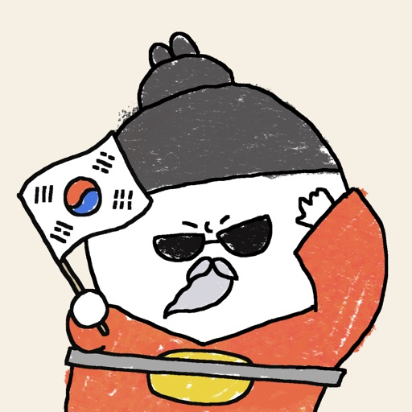

2024년 2월부터 10월까지 우쑤한국사 앱을 개발하면서 겪었던 경험과 배운 점, 그리고 앞으로의 계획에 대해 회고한 글입니다.

<!-- truncate -->

## 회고를 하는 이유

제가 처음으로 출시하고 운영을 하게 된 프로젝트인 '우쑤한국사 앱'에서 하차하게 되었습니다.

이 회고를 통해 프로젝트를 돌아보고, 어떤 점이 잘되었고 어떤 점이 아쉬웠는지 정리하고, 앞으로의 프로젝트나 업무에 대한
방향성을 잡고자 합니다.

다른 프로젝트에서 회고를 작성했을 때는 프로젝트가 끝나고 팀원들끼리 모여 각자 KPT를 작성하고 이를 공유하는 방식으로 진행했습니다.

- [프로젝트 회고를 합시다](https://brunch.co.kr/@boi/11)
- [KPT 회고하는 법, 회고에 대한 생각](https://zzsza.github.io/diary/2023/06/05/how-to-retrospect/)

위 두 글외에도 회고에 대한 다양한 글을 참고하였고 그 때 당시의 KPT는 다음과 같습니다.

몇 가지 아쉬운 점이 있었습니다.

1. 긍정적 요소 부재: Keep 섹션에서 언급된 긍정적인 부분들을 어떻게 더 강화하고 발전시킬 수 있을지에 대한 고민이 부족한 점.
2. 액션 아이템 부재: Try 섹션에서 언급된 개선점들이 다소 추상적인 점.
3. 성과 측정 부재: 프로젝트의 성공 여부나 목표 달성 정도에 대한 객관적인 평가가 없는 점.

이번에는 위의 부분들을 어떻게 보완할 수 있을지에 대해 고민하며 준비했습니다.

정량적인 성과 측정을 통해 목표 달성 정도를 파악하고, 액션 아이템을 구체적으로 정리하고자 노력했습니다.

## 무엇을 회고할 것인가

프로젝트를 돌아보며 겪었던 주요 이벤트들을 정리하는 시간을 가졌습니다. 이를 통해 무엇을 회고해야 할지에 대한 방향성을 잡았습니다.

팀에서는 노션을 사용하여 프로젝트 트래킹을 하고 있었습니다. 프로젝트 주요 이벤트, 이슈, 회의 및 결정 사항들을 확인할 수 있었습니다.

또한 개발자라면 소스 코드를 통해 프로젝트의 흐름을 파악할 수 있을 거라는 생각이 들었습니다.

`git log --pretty=format:"%h - %an, %ar : %s%n%b"` 명령어를 통해 프로젝트의 커밋 로그를 확인하고, 프로젝트의 주요 이벤트를 정리했습니다.

이 외에 메신저들에서 주고 받은 대화들과 파편화된 메모들을 정리하며 타임라인을 작성해보면서 프로젝트의 전체적인 흐름을 파악할 수 있었습니다.

## 회고

### 전체적인 개발 프로세스 경험

**좋았던 점(Liked)**

아이디어 제시부터 출시 및 운영까지 전체적인 개발 프로세스를 경험할 수 있었습니다. 특히 한 페이지짜리 아이디어를 구체화하고 살을 붙이며 서비스를 만드는 과정에서 많은 것을 배웠습니다. 또한 다양한 문제 상황에 대한
여러 해결 방법을 고민하고 적용해볼 수 있었습니다.

**배운 점 (Learned)**

운영을 하게 되면서는 사용자 피드백의 중요성과 이를 바탕으로 한 서비스 개선 프로세스를 경험 할 수 있었습니다. 커뮤니케이션 단계에서 구두로 진행했다면 항상 문서화를 하고 공유하는 것이 중요한 것을 알게 되었습니다.

**부족했던 점 (Lacked)**

기획자와 프로젝트 매니저의 부재로 인해 요구사항이 명확하게 정리되지 않았습니다. 커뮤니케이션 이슈와 일정 관리 문제가 발생했습니다. 같은 단어를 사용하더라도 서로가 이해하는 바가 달라 생겼던 혼란들을 계속
반복했습니다.

**앞으로의 행동 (Longed-for)**

향후 프로젝트에서는 역할 분담을 명확히 하는 것이 좋을 것 같습니다. 요구사항 정의와 일정 계획 수립 프로세스를 미리 정해서 프로젝트 관리를 관리하는 오버헤드를 줄이는 것이 중요할 것 같습니다.

### 여러 기술적 도전

**좋았던 점 (Liked)**

이벤트 기반 아키텍처, IaC 도입, GitOps 도입, 클라우드 서비스 도입 등 다양한 기술적 도전을 시도할 수 있었습니다. 도전적으로 새로운 기술을 실제 프로젝트에 적용해보며 추가적인 학습을 할 수 있었습니다.

**배운 점 (Learned)**

실제 서비스에서의 기술적 도전은 더욱 신중하게 준비해야 함을 깨달았습니다. 출시를 하고 난 이후에는 기술적 도전이 점차 어려워지는 것을 경험했습니다. 새로운 기술 도입 시 기술의 트레이드 오프(러닝 커브, 프로젝트
일정 등 포함)를 고려해야 한다는 것을 배웠습니다.

**부족했던 점 (Lacked)**

사전 학습과 PoC(Proof of Concept)가 부족했습니다.

### 안락함과 무기력함

프로젝트를 경험하면서 느꼈던 감정입니다. 이 회고를 작성하게 된 계기 중 하나가 바로 이 감정을 기록하기 위함이기도 합니다.

유튜버 노마드 코더의 영상인 [내가 6일 만에 앱 런칭한 비법?!](https://youtu.be/DnLTGBo5KM8) 에서 언급된 "미완성 프로젝트의 안락함"이라는 표현이 와닿았습니다.

미완성이라는 상태가 실패에 대한 평가를 미룰 수 있게 해주어 일종의 안도감을 느끼게 만들어주었습니다. 또한 여기에 완벽주의자 성향이 더해져서 "완벽한 결과물을 만들기 위해 더 많은 시간을 투자해야 한다"는 생각은
프로젝트의 진행을 더욱 더디게 만들었습니다.

프로젝트를 진행해야 한다는 압박감과 진행하지 못하고 있다는 자책감이 공존하면서, 프로젝트에 손을 대는 것 자체가 어려워지는 상태가 유지되었습니다. 이러한 상태에서 번아웃에 빠지게 되고, 무기력함을 느끼게 되었습니다.

이러한 감정을 경험하면서, 프로젝트를 진행하면서 느끼는 감정을 더욱 세심하게 관찰하고, 이를 극복하는 방법을 찾아야 한다는 생각이 들었습니다.

## 결론

우쑤한국사 앱을 개발하면서 아이디어 구상부터 출시, 운영까지 전체 개발 프로세스를 경험할 수 있었습니다.

이번 기회를 통해 프로젝트를 진행하며 겪었던 감정과 경험에 대해 돌아볼 수 있는 시간을 가졌습니다.
