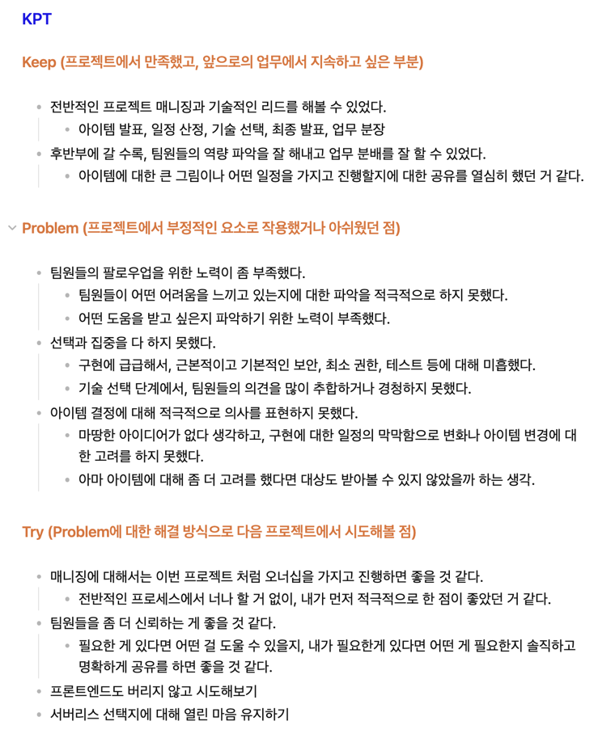
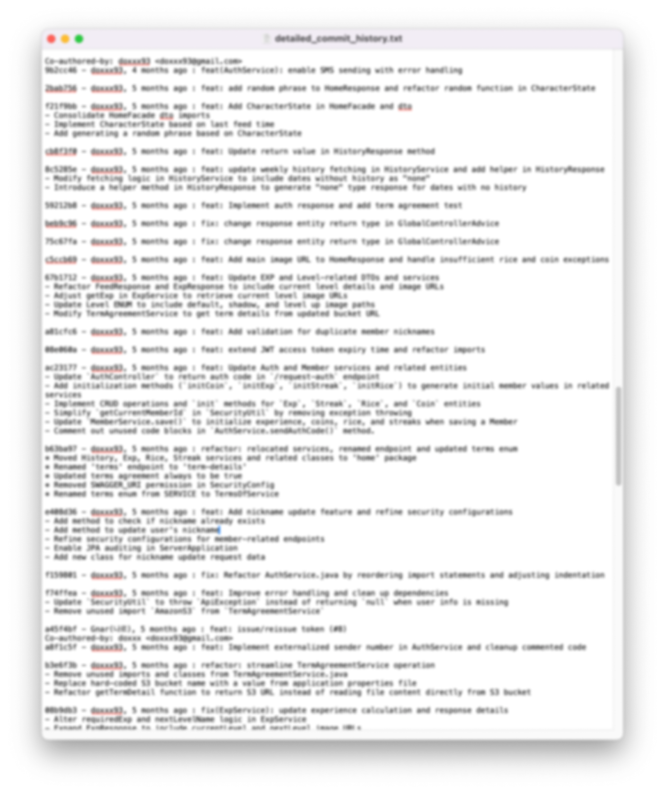
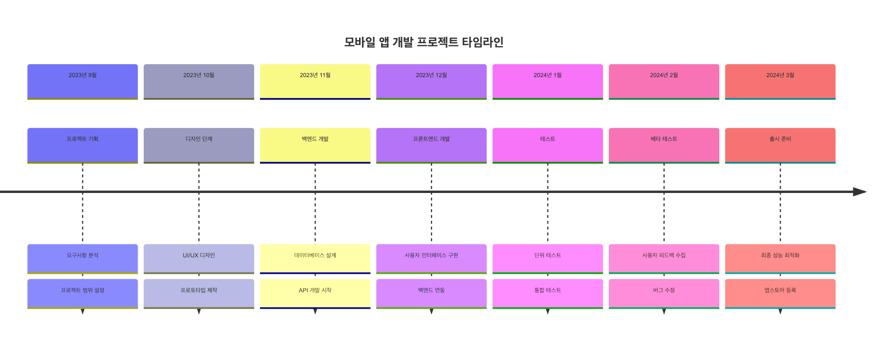

# 우쑤 한국사 앱 회고

2024년 2월부터 10월까지 진행한 `우쑤한국사` 앱 프로젝트를 회고한 글입니다.

<!-- truncate -->

## 1. 회고를 하는 이유

제가 처음으로 출시하고 운영을 하게 된 프로젝트를 마무리하면서 회고를 작성하게 되었습니다.

이 회고를 통해 프로젝트를 돌아보고, 어떤 점이 잘되었고 어떤 점이 아쉬웠는지 정리하고, 앞으로의 프로젝트나 업무에 대한
방향성을 잡고자 합니다.

과거, 다른 프로젝트에서 회고를 작성했을 때는 프로젝트가 끝나고 팀원들끼리 모여 각자 KPT를 작성하고 이를 공유하는 방식으로 진행했습니다.

- [프로젝트 회고를 합시다](https://brunch.co.kr/@boi/11)
- [KPT 회고하는 법, 회고에 대한 생각](https://zzsza.github.io/diary/2023/06/05/how-to-retrospect/)

위 두 글외에도 회고에 대한 다양한 글을 참고하였고 그 때 당시의 KPT는 다음과 같습니다.

몇 가지 아쉬운 점이 있었습니다.

1. 단기 피드백 부재: 프로젝트가 3주라는 짧은 기간이었고 회고를 한 번만 진행했다는 점.
2. 액션 아이템 부재: Try 섹션에서 언급된 개선점들이 다소 추상적인 점.
3. 성과 측정 부재: 프로젝트의 성공 여부나 목표 달성 정도에 대한 객관적인 평가가 없는 점.
4. 긍정적 요소 부재: Keep 섹션에서 언급된 긍정적인 부분들을 어떻게 더 강화하고 발전시킬 수 있을지에 대한 고민이 부족한 점.

이번에는 위의 부분들을 어떻게 보완할 수 있을지에 대해 고민하며 회고를 작성하였습니다.

이번 프로젝트 또한 회고를 이번 한번만 진행하게 되었지만, 정량적인 성과 측정을 통해 목표 달성 정도를 파악하고, 액션 아이템을 구체적으로 정리하고자 노력했습니다.

## 2. 프로젝트 타임라인

> 프로젝트를 돌아보며 프로젝트를 진행하면서 겪었던 주요 이벤트들을 정리하는 시간을 가졌습니다. 이를 통해 무엇을 회고해야 할지에 대한 방향성을 잡았습니다.

`git log --pretty=format:"%h - %an, %ar : %s%n%b"` 명령어를 통해 프로젝트의 커밋 로그를 확인하고, 프로젝트의 주요 이벤트를 정리했습니다.

위 로그를 기반으로, `mermaid`와 같은 툴을 이용해 프로젝트 타임라인을 만들 수 있었습니다.

다음은 가상의 프로젝트 타임라인 예시입니다.

위와 같이 타임라인을 작성해보면서 프로젝트의 전체적인 흐름을 파악할 수 있었습니다.

- 시작 ~ 출시
    - 2024년 1월: 프로젝트 참여 제안 및 수락. 백엔드, 인프라, 관리자 페이지 담당. MVP 범위 논의 및 초기 기획.
    - 2024년 2월: 서비스 플로우, 브랜딩, 와이어프레임 작업. MVP 1.0.0 윤곽 확정. 세부 기능 및 시스템 정책 논의.
    - 2024년 3월: 관리자 페이지 설계. 엔티티 설계. 디자인 A/B 테스트 진행. 코어 개발 시작.
    - 2024년 4월: 공유를 위해 API 명세 작업. 회원 관련과 주요 기능 구현.
    - 2024년 5월: 서버 배포 및 인프라 구축
    - 2024년 6월: Google Play와 App Store에 앱 출시

- 출시 후
    - 사용자 피드백 기반 VOC 반영 및 추가 기능 개발
    - 사용자 관리
    - 콘텐츠 관리 시스템 개선

## 3. 주요 성과와 배운 점

### 3.1 기술적 측면

1. 이벤트 기반 아키텍처 구현:
    - Spring 이벤트 시스템을 활용하여 모듈 간 결합도를 낮추고 확장성을 향상시켰습니다.
    - 히스토리 로깅 서비스를 분리하여 시스템의 유연성을 높였습니다.

2. 다층 캐싱 전략 도입:
    - Caffeine을 이용한 로컬 캐싱과 Redis를 활용한 분산 캐싱을 구현하여 시스템 성능을 크게 개선했습니다.

3. 코드형 인프라(IaC) 구현:
    - Terraform을 사용하여 AWS 리소스를 관리하고, GitHub Actions를 통해 CI/CD 파이프라인을 구축했습니다.

### 3.2 프로젝트 관리 측면

### 3.3 팀워크 측면

1. 효과적인 커뮤니케이션:
    - 디자이너, 기획자와의 협업을 통해 기술적 제약사항과 사용자 경험 사이의 균형을 맞출 수 있었습니다.

2. 지식 공유:
    - 정기적인 기술 세션을 통해 팀 내 역량을 강화하고 문제 해결 능력을 향상시켰습니다.

## 4. 도전과제와 극복 방법

### 4.1 겪었던 어려움들

1. 초기 성능 이슈:
    - 사용자 증가에 따른 데이터베이스 부하 증가
    - 퀴즈 로딩 시간 지연 문제

2. 콘텐츠 관리의 비효율성:
    - Google Drive를 CDN으로 사용한 초기 방식의 한계

3. 스케일링 문제:
    - 사용자 수 증가에 따른 인프라 확장의 필요성

### 4.2 문제 해결 과정과 교훈

1. 성능 최적화:
    - 다층 캐싱 전략 도입으로 데이터베이스 부하 감소 및 응답 시간 개선
    - 스트릭 기능 최적화를 통한 쿼리 성능 향상

2. 효율적인 콘텐츠 관리 시스템 구축:
    - AWS S3와 CloudFront를 활용한 맞춤형 CMS 개발

3. 확장 가능한 아키텍처 설계:
    - 이벤트 기반 아키텍처 도입으로 시스템 유연성 확보
    - Terraform을 이용한 IaC 구현으로 인프라 관리 효율화

## 5. KPT 분석

### 5.1 Keep: 잘한 점, 유지해야 할 점

- 사용자 피드백에 빠르게 대응하는 문화
- 지속적인 성능 모니터링 및 최적화 노력
- 팀 내 지식 공유 세션 운영

### 5.2 Problem: 문제점, 개선이 필요한 부분

- 초기 아키텍처 설계 시 확장성 고려 부족
- 테스트 커버리지 부족으로 인한 예기치 못한 버그 발생
- 문서화 부족으로 인한 지식 전달의 어려움

### 5.3 Try: 향후 시도해 볼 개선 방안

- 마이크로서비스 아키텍처 도입 검토
- TDD(테스트 주도 개발) 방식 적용
- 자동화된 문서화 도구 도입 및 문서 작성 프로세스 개선

## 6. 개인적 성장

### 6.1 새롭게 습득한 기술이나 지식

- AWS 서비스 (EC2, RDS, ElastiCache, S3, CloudFront) 활용 능력 향상
- Terraform을 이용한 IaC 구현 경험
- Spring의 이벤트 시스템 및 캐싱 전략에 대한 심도 있는 이해

### 6.2 역할 수행을 통해 발전한 부분

- 전체 시스템 아키텍처 설계 및 구현 능력 향상
- 대규모 사용자를 대상으로 한 서비스 운영 경험 획득
- 비즈니스 요구사항을 기술적 솔루션으로 전환하는 능력 개선

## 7. 향후 계획 및 비전

개인적인 발전 방향

## 9. 마무리

이 프로젝트를 통해 전체 시스템의 설계부터 구현, 운영까지 모든 과정을 경험할 수 있었습니다. 기술적 도전과 함께 사용자의 니즈를 충족시키는 제품을 만드는 과정에서 많은 것을 배웠습니다. 앞으로도 이 경험을 바탕으로
더 나은 서비스를 만들어 나가는 데 기여하고 싶습니다.
