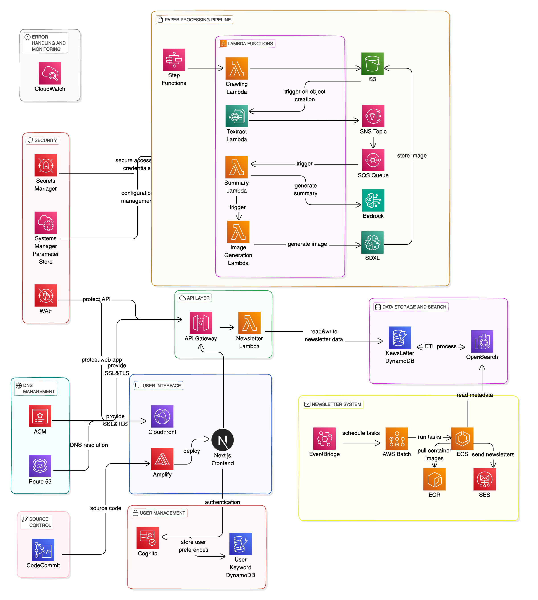
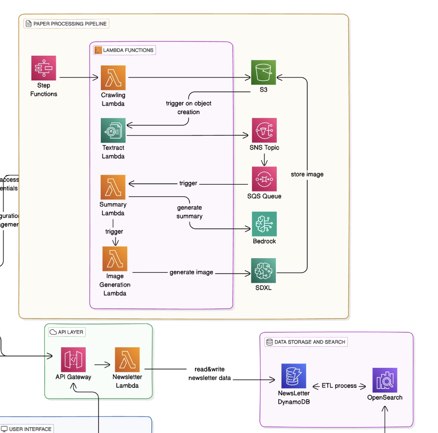
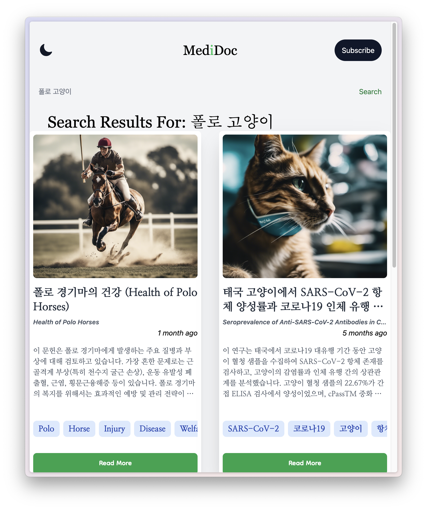
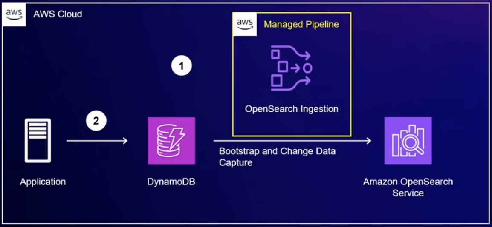
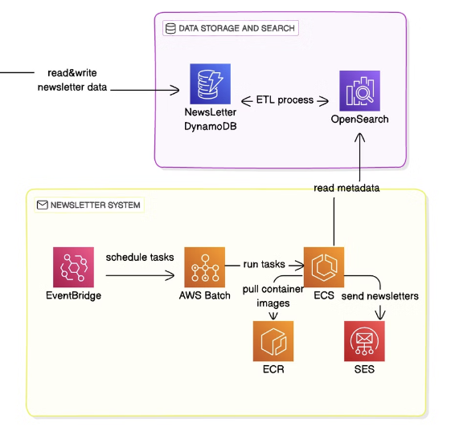
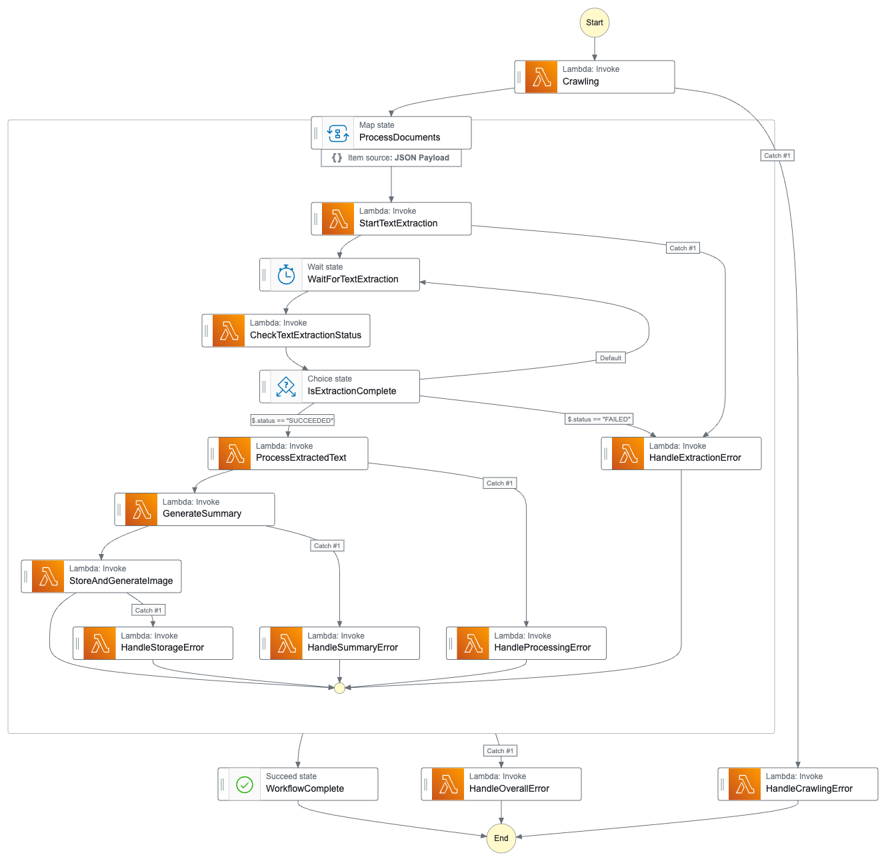

NIPA AWS Developer 부트캠프에서 진행한 3주간의 협력 프로젝트를 통해 의학 논문 요약 서비스를 개발했습니다.

이 글에서는 서비스 구현 과정에서의 기술적 결정들과 개선 가능한 부분들을 실제 사례를 바탕으로 공유하고자 합니다.

<!-- truncate -->

## 들어가며

연구자들은 매일 쏟아지는 엄청난 양의 논문 속에서 중요한 연구 동향을 놓치지 않고 따라가야 합니다. 특히 임상과 연구를 병행하는 의료 전문가들의 경우, 시간적 제약으로 인해 최신 연구 동향을 따라가기가 더욱
어렵습니다.

이러한 문제를 해결하기 위해 AWS Serverless 아키텍처를 활용한 논문 요약 서비스를 개발했습니다. 이 글에서는 서버리스 아키텍처를 선택한 이유와 구현 과정에서의 기술적 결정들을 공유하고자 합니다.

## 시스템 아키텍처 개요

전체 아키텍처입니다.



주요 컴포넌트들은 다음과 같이 구성되어 있습니다:

- 논문 수집 파이프라인 (Crawling Pipeline)
- 텍스트 추출 및 요약 파이프라인 (Extraction & Summary Pipeline)
- 검색 및 구독 시스템 (Search & Subscription System)
- 알림 발송 시스템 (Notification System)

3주라는 짧은 프로젝트 기간 동안 기능 구현에 집중하기 위해 서버리스 아키텍처를 선택했습니다. 컨테이너 기반 아키텍처도 검토했으나, 다음과 같은 이유로 서버리스가 더 적합했습니다:

1. 신속한 프로토타이핑: 인프라 구성 없이 즉시 기능 개발 착수
2. 운영 복잡도 최소화: 인프라 관리 부담 없이 비즈니스 로직에 집중
3. 비용 효율성: MVP 단계에서 예측 가능한 비용 구조

## 주요 기능 구현



### 1. 논문 수집 파이프라인

논문 수집 파이프라인은 크롬 헤드리스 브라우저를 Lambda 레이어로 패키징하여 구현했습니다. Lambda의 일시적 스토리지(/tmp) 한계를 고려하여 수집된 PDF는 즉시 S3에 업로드되도록 설계했습니다.

### 2. 텍스트 추출 및 요약 파이프라인

텍스트 추출과 요약은 전체 서비스의 핵심 기능입니다. 초기에는 여러 접근 방식을 검토했으나, Amazon Textract와 Bedrock의 조합이 가장 효과적임을 확인했습니다. 특히 다음과 같은 장단점을
고려했습니다:

1. Textract 선택 이유

- 2단 레이아웃 논문도 정확한 텍스트 추출
- 표, 그래프 등 복잡한 요소 처리 가능
- 관리형 서비스로 안정적인 운영

2. Bedrock 활용 배경

- 다국어 요약 지원 (영어 논문 → 한글 요약)
- 구조화된 출력 포맷 (JSON)
- 컨텍스트 이해 기반의 키워드 추출

> 관련 내용:
> Textract 작업 완료 후, Amazon Bedrock을 활용하여 텍스트 요약, 키워드 추출, 관련 이미지 생성 작업을 수행합니다. Textract는 문서에서 텍스트를 정확하게 추출하는데 특화되어 있으며,
> Bedrock의 LLM은 추출된 텍스트의 의미 분석과 요약에 뛰어난 성능을 보입니다.
>
> [Bedrock versus Textract for document text/meaning extraction | AWS re:Post](https://repost.aws/questions/QU87TzW4U5R5y11MUBgJ36JQ/bedrock-versus-textract-for-document-text-meaning-extraction)

#### PDF 텍스트 추출 - Textract 활용

초기에는 PyPDF2나 pdf2image 같은 오픈소스 라이브러리 사용을 고려했습니다. 하지만 학술 논문 특유의 2단 레이아웃, 그래프, 표 등 복잡한 요소들을 정확하게 처리하기 어려웠습니다. Amazon
Textract를 선택한 주요 이유는 다음과 같습니다:

- OCR 기반의 정확한 텍스트 인식
- 복잡한 레이아웃 처리 능력
- 관리형 서비스로서의 안정성

하지만 Textract 활용 시 몇 가지 고려할 점이 있었습니다:

```python
response = textract.start_document_text_detection(
    DocumentLocation={'S3Object': {'Bucket': bucket, 'Name': key}},
    NotificationChannel={
        'SNSTopicArn': sns_topic_arn,
        'RoleArn': sns_role_arn,
    }
)
```

Textract는 비동기 작업 방식을 사용하기 때문에, SNS와 SQS를 활용한 이벤트 기반 처리가 필요했습니다. 작업이 완료되면 SNS를 통해 다음 단계로 신호를 보내는 방식으로
구현했습니다.

#### 텍스트 요약 - Bedrock Claude 활용

텍스트 요약에는 Bedrock의 Claude 모델을 사용했습니다. 요약의 일관성과 품질을 위해 다음과 같은 프롬프트 템플릿을 사용했습니다:

```python
def get_prompt_template(extracted_text):
    prompt = f"""
    다음 내용을 기술 뉴스레터 형식으로 한글로 요약해주세요:
    
    원문:
    {extracted_text}
    
    응답은 다음 JSON 형식을 정확히 따라야 합니다:
    {{
        "title": "제목",
        "summary": "4-5문장 요약",
        "key_findings": ["주요 포인트들"],
        "keywords": ["키워드들"],
        "sdxl_prompt": "이미지 생성 프롬프트"
    }}
    """
    return prompt
```

#### 개선 가능한 부분

현재 파이프라인에서 개선이 필요한 부분들은 다음과 같습니다:

1. **토큰 제한 처리**: 긴 논문의 경우 Claude의 토큰 제한에 걸릴 수 있습니다. 섹션별 분할 처리나 중요 섹션 우선순위화가 필요할 수 있습니다.
2. **비용 최적화**: Textract와 Bedrock 사용량이 늘어날수록 비용도 증가합니다. 캐싱이나 배치 처리 도입을 고려해볼 수 있습니다.
3. **오류 처리**: PDF 형식이나 품질에 따라 추출 품질이 달라질 수 있어, 더 강건한 오류 처리와 품질 검증이 필요합니다.

### 3. 검색 및 구독 시스템

검색과 구독 기능은 사용자들이 관심 있는 논문을 쉽게 찾고 유저 리텐션을 위한 핵심 기능입니다. 이를 위해 DynamoDB와 OpenSearch Service의 조합을 선택했습니다.



#### 검색 시스템 구현

처음에는 DynamoDB의 기본 쿼리 기능만으로 검색을 구현했지만, 전문 검색(Full-text search)과 유사도 기반 검색의 한계가 있었습니다. 이를 해결하기 위해 OpenSearch Service를
도입했고, 특히 최근 출시된
DynamoDB와의 [Zero-ETL 통합기능](https://docs.aws.amazon.com/opensearch-service/latest/developerguide/configure-client-ddb.html)
을 활용했습니다.

1. OpenSearch 도입을 통해

- 전문 검색 지원
- 유사도 기반 검색
- 한글 형태소 분석

2. Zero-ETL 통합 활용으로

- 실시간 데이터 동기화
- 운영 복잡도 감소
- 비용 효율성 향상

와 같은 이점을 얻을 수 있었습니다.



> 관련 영상:
> [AWS re:Invent 2023 - Amazon DynamoDB zero-ETL integration with Amazon OpenSearch Service (DAT339) - YouTube |](https://lilys.ai/digest/2350334)

OpenSearch 쿼리 검색 로직:

```python
search_query = {
    "query": {
        "bool": {
            "should": [
                { "wildcard": { "title": f"*{query}*" }},
                { "wildcard": { "summary": f"*{query}*" }},
                { "wildcard": { "keywords": f"*{query}*" }},
                { "wildcard": { "key_findings": f"*{query}*" }}
            ]
        }
    },
    "from": from_index,
    "size": size
}
```

이 구현의 장점은 다음과 같습니다:

1. 실시간 데이터 동기화: 별도의 ETL 파이프라인 없이 DynamoDB의 데이터가 자동으로 OpenSearch에 동기화
2. 강력한 검색 기능: 형태소 분석, 유사도 검색 등 OpenSearch의 기능 활용
3. 운영 부담 감소: ETL 파이프라인 관리나 동기화 이슈 처리 불필요

#### 구독 시스템 구현

구독 시스템은 사용자가 관심 있는 키워드를 등록하고 관리할 수 있는 API를 제공합니다. DynamoDB를 사용하여 사용자의 구독 정보를 저장하고, API Gateway를 통해 RESTful 엔드포인트를 제공합니다.

```python
def lambda_handler(event, context):
    method = event['httpMethod']
    path = event['path']

    # 사용자의 모든 구독 조회
    if method == 'GET' and path.startswith('/subscriptions/'):
        email = event['pathParameters']['email']
        return get_subscriptions(email)

    # 새로운 구독 추가
    elif method == 'POST' and path == '/subscriptions':
        body = json.loads(event['body'])
        email = body['email']
        keyword = body['keyword']
        return add_subscription(email, keyword)

    # 특정 구독 삭제
    elif method == 'DELETE' and path.startswith('/subscriptions/'):
        parts = path.split('/')
        email = parts[2]
        keyword = parts[3]
        return delete_subscription(email, keyword)
```

구독 정보는 DynamoDB에 저장되며, Cognito와 연동하여 사용자 인증을 처리합니다

```python
def add_subscription(email, keyword):
    try:
        user_sub = get_user_sub(email)
        if user_sub:
            table = dynamodb.Table(table_name)
            item = {
                'email': email,
                'keyword': keyword
            }
            table.put_item(Item=item)

            return {
                'statusCode': 201,
                'body': json.dumps('Subscription added successfully')
            }
        else:
            return {
                'statusCode': 400,
                'body': json.dumps({'message': 'User not found'})
            }
    except Exception as e:
        return {
            'statusCode': 500,
            'body': json.dumps({'error_message': str(e)})
        }
```

현재는 간단한 키워드 매칭만 수행하지만, 다음과 같은 마일스톤을 가지고 있었습니다:

1. 정기 뉴스레터 기능: 주간/월간 단위로 관심 분야의 논문을 모아서 발송
2. 개인화된 추천: 사용자의 조회 이력과 키워드를 기반으로 한 맞춤형 추천
3. 알림 빈도 조절: 사용자가 원하는 주기로 알림 수신 가능

#### 성능 최적화

검색 성능 향상을 위해 다음과 같은 최적화를 적용했습니다:

1. 결과 캐싱: 자주 검색되는 키워드의 결과를 ElastiCache에 캐싱
2. 페이지네이션: 스크롤 방식의 무한 페이지네이션 구현
3. 인덱스 최적화: 자주 검색되는 필드에 대한 인덱스 구성

```python
def get_newsletters(query_params):
    limit = int(query_params.get('limit', 10))
    last_key = query_params.get('last_key')
    
    scan_params = {
        'Limit': limit,
        'ExclusiveStartKey': last_key if last_key else None
    }
```

#### 현재의 한계와 향후 개선점

- **검색 정확도**: 현재는 단순 와일드카드 검색을 사용하고 있어, 좀 더 정교한 검색 로직이 필요합니다. 예를 들어 의학 용어 시소러스를 활용한 유의어 검색 등을 고려할 수 있습니다.
- **성능 이슈**: 검색 결과가 많을 경우 응답 시간이 느려지는 문제가 있습니다. 검색 결과 캐싱과 인덱스 최적화가 필요합니다.
- **구독 시스템 확장**: 현재는 단순 키워드 매칭만 지원하지만, 향후 ML 기반의 컨텐츠 추천 시스템 도입을 고려할 수 있습니다.

### 4. 알림 발송 시스템

알림 발송 시스템은 구독자들에게 관심 키워드와 관련된 새로운 논문을 알려주는 기능입니다. MVP 단계에서는 기본적인 이메일 알림 기능을 구현했습니다.

#### 현재 구현 상태

알림 시스템은 DynamoDB Streams를 시작점으로 하는 이벤트 체인으로 구현되어 있습니다:



```python
def lambda_handler(event, context):
    for record in event['Records']:
        if record['eventName'] == 'INSERT':
            new_item = record['dynamodb']['NewImage']
            
            # 구독자 키워드 매칭 및 알림 처리
            process_notification(new_item)
```

이벤트 흐름은 다음과 같습니다:

1. 새 논문 등록 → DynamoDB Stream 발생
2. Lambda 트리거 → 구독자 키워드 매칭
3. SQS 메시지 큐잉 → 알림 발송 Lambda
4. Amazon SES를 통한 이메일 발송

```python
def lambda_handler(event, context):
    ses = boto3.client('ses')

    for record in event['Records']:
        body = json.loads(record['body'])
        email = body['email']
        keyword = body['keyword']
        newsletter_info = body['newsletter_info']

        # 이메일 발송
        ses.send_email(
            Source='your-email@example.com',
            Destination={'ToAddresses': [email]},
            Message={
                'Subject': {'Data': '새로운 뉴스레터 알림'},
                'Body': {
                    'Html': {
                        'Data': f"""
                            <h1>키워드 '{keyword}'가 포함된 새 뉴스레터가 있습니다.</h1>
                            <p>제목: {newsletter_info['title']}</p>
                            <p>발행일: {newsletter_info['publication_date']}</p>
                            
                            <a href="https://your-website.com/newsletter/{newsletter_info['uuid']}">뉴스레터 보기</a>
                        """
                    }
                }
            }
        )
```

이 구조로도 기본적인 알림 발송은 잘 동작하지만, 예상 가능한 몇 가지 한계점이 드러났습니다.

#### 현재의 한계점

- **알림 처리의 단순성**
    - 모든 알림이 동일한 우선순위로 처리됨
    - 사용자별 알림 설정 커스터마이징 불가
    - 단일 실패 지점 존재
- **확장성 문제**
    - 알림 유형 추가가 어려움
    - 대량 알림 발송 시 병목 현상 가능성
- **운영상의 어려움**
    - 알림 발송 현황 모니터링의 제한
    - 실패한 알림의 재처리 메커니즘 부재

여기서는 아키텍처 개선에 초점을 맞추겠습니다.

#### 알림 발송 시스템 개선안

단순한 이벤트 체인에서 더 견고한 아키텍처로 개선하고자 한다면 다음과 같은 구조를 고려할 수 있을 것 같습니다.

`DynamoDB Stream → EventBridge → SNS → Multiple SQS → Lambda → SES`

이 아키텍처의 주요 장점은 세 가지 측면으로,

첫째, 알림을 유형별로 분리해 처리할 수 있습니다. 예를 들어 즉시 발송이 필요한 알림은 즉시 알림 큐로, 여러 소식을 모아서 보내는 주간 다이제스트는 별도의 큐로 라우팅할 수 있습니다. 각 유형별로 최적화된 처리가
가능해집니다.

둘째, 장애 격리가 가능합니다. 주간 다이제스트 처리에 문제가 생기더라도 즉시 알림은 정상적으로 발송됩니다. SQS의 DLQ(Dead Letter Queue)를 활용하면 실패한 메시지들을 별도로 모아서 관리할 수
있어 안정성이 높아집니다.

셋째, 시스템 확장이 용이합니다. 새로운 알림 유형을 추가할 때 SNS에 SQS를 하나 더 연결하기만 하면 됩니다. 각 큐는 독립적으로 처리량을 조절할 수 있어, 특정 알림의 부하 증가에도 유연하게 대응할 수
있습니다.

## 추가 구현 사항

### Step Functions 도입 검토와 한계



서버리스 컴포넌트들이 늘어나면서 전체 워크플로우 관리의 필요성을 느꼈고, 이를 위해 Step Functions를 도입을 검토했습니다.

1. **워크플로우 시각화**

- 복잡한 PDF 처리 파이프라인의 상태 추적
- 각 단계별 진행 상황 모니터링
- 실패 지점 빠른 파악

2. **오류 처리 자동화**

- Textract, Bedrock 등 비동기 작업의 재시도 로직
- 타임아웃 상황 처리
- DLQ와의 통합

하지만 실제 구현 과정에서 다음과 같은 문제점들을 발견했습니다:

1. **비용 효율성 문제**

- Step Functions의 상태 전환당 비용 발생
- 처리해야 할 문서량 대비 과도한 운영 비용 예상
- 각 Lambda 함수의 실행 비용 + Step Functions 비용의 이중 부담

2. **개발 복잡도 증가**

- Step Functions 정의를 위한 추가적인 학습 곡선
- 상태 머신 정의의 버전 관리 부담
- 로컬 테스트의 어려움

3. **유연성 제한**

- 정해진 워크플로우 외 예외 처리의 어려움
- 동적인 분기 처리의 복잡성
- 기존 이벤트 기반 아키텍처와의 통합 부담

결과적으로 이벤트 기반의 더 단순한 아키텍처를 선택했습니다:

- SNS/SQS를 활용한 느슨한 결합
- CloudWatch Logs를 통한 모니터링

### 보안 및 인증 구현

서버리스 아키텍처에서도 보안은 여전히 중요한 고려사항입니다. 프로젝트에서는 다음과 같은 보안 계층을 구현했습니다.

1. 기본적인 웹 공격 방어를 위한 WAF

- SQL Injection 방지
- XSS 차단
- 비정상 트래픽 패턴 감지
- 지역 기반 접근 제어

2. ACM으로 SSL/TLS 인증서 관리
3. Route 53을 통한 DNS 보안
4. API Gateway와 Cognito 통합

API Gateway에서 다음과 같이 인증을 처리하고 있습니다:

```python
const auth = {
    authorize: async function(event) {
        const token = event.headers.Authorization;
        try {
            const claims = await cognito.verifyToken(token);
            return {
                isAuthorized: true,
                context: { userId: claims.sub }
            };
        } catch (error) {
            return { isAuthorized: false };
        }
    }
};
```

몇 가지 개선이 필요한 상황입니다.

Cognito의 도입을 고려한다면,

1. **세분화된 권한 제어**

- 현재는 인증된 사용자에게 모든 API 접근 허용
- 구독 상태나 사용자 역할 기반의 접근 제어 필요

2. **토큰 관리**

- 리프레시 토큰 처리 로직 미흡
- 토큰 만료 시 사용자 경험 개선 필요

와 같은 점들을 놓치지 않는 것이 중요할 것 같습니다.

### 프론트엔드 구현

프론트엔드는 Next.js와 TypeScript를 기반으로 구현했으며, AWS 서비스들과의 효율적인 통합에 중점을 두었습니다. 특히 AWS Amplify를 활용한 구성이 빠른 프로토타이핑과 배포에 매우
효과적이었습니다.

### 운영 및 모니터링 - 향후 개선점

기본적인 CloudWatch 모니터링만 구현된 상태입니다. 안정적인 서비스 운영을 위해서는 다음과 같은 요소들을 고려해야 할 것 같습니다:

- **종합적인 모니터링 체계**
    - Error Reporting 시스템 구축
    - API 성능 모니터링
- **알림 시스템**
    - 주요 지표 임계값 알림 설정
    - 일일/주간 리포트 자동화
- **로깅 전략**
    - 구조화된 로그 포맷 정의
    - 로그 레벨별 처리 정책

### 비용 관리 - 개선 필요 사항

MVP 단계에서는 비용 최적화보다 기능 구현에 집중했습니다. 향후에는 다음과 같은 비용 관리 전략이 필요할 것 같습니다:

- **서비스별 비용 분석**
    - Lambda 함수의 실행 시간과 메모리 최적화
    - DynamoDB의 읽기/쓰기 용량 조정
    - S3 스토리지 계층화
- **캐싱 전략**
    - API 응답 캐싱
    - 자주 접근되는 데이터의 메모리 캐싱
    - 정적 자원의 CDN 활용
- **리소스 정리**
    - 미사용 리소스 자동 정리
    - 테스트 환경 리소스 관리
    - 백업 데이터 보관 정책

## 마치며

이번 프로젝트를 통해 AWS의 다양한 서버리스 서비스들을 실제 프로덕션 환경에서 활용해볼 수 있었습니다. 특히 Step Functions, SNS/SQS 조합, Zero-ETL 통합 등의 기술들이 실제 서비스 구축에
매우 효과적이었음을 경험했습니다.

이 글이 AWS를 활용한 서버리스 아키텍처 설계에 도움이 되길 바랍니다. 더 자세한 내용이나 질문이 있으시다면 댓글로 남겨주세요.

## Ref.

- [AWS What's New 한국어 요약](https://aws-whats-new-korean.netlify.app/)
- [저는 비빔AI 입니다. 그런데 서버리스를 곁들인 - 김선우](https://youtu.be/R_1seCDxv0E?list=PLX2fs3661XpPCc9wfHkc16TSs4DsNWL6R)
- [AWS re:Invent 2023 - Amazon DynamoDB zero-ETL integration with Amazon OpenSearch Service (DAT339) - YouTube |](https://lilys.ai/digest/2350334)
