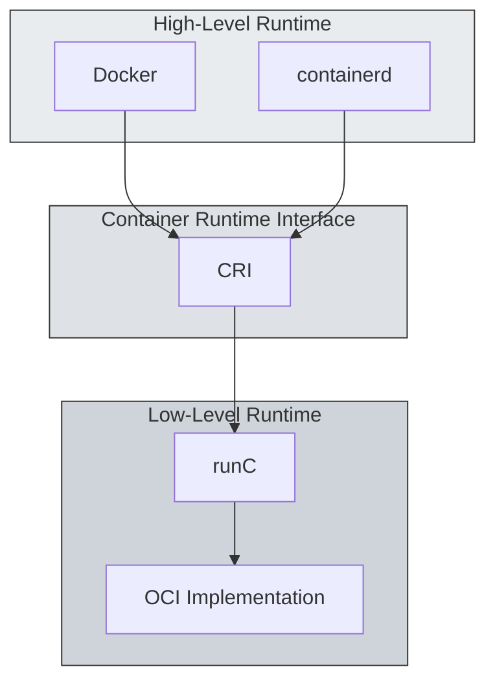
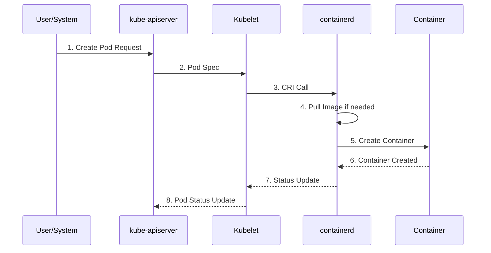
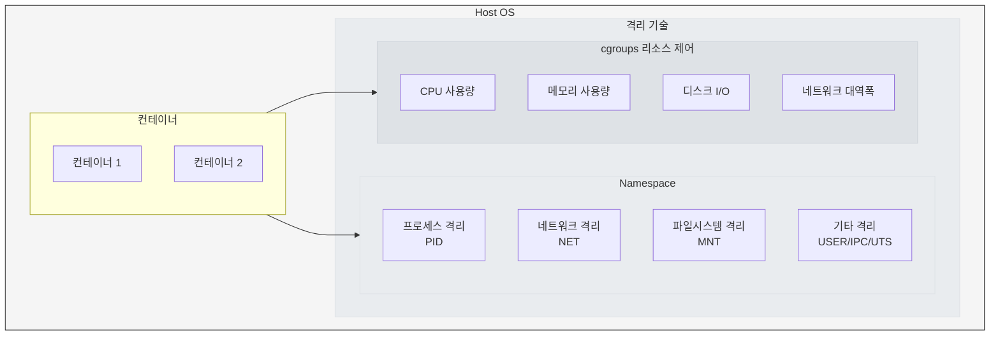
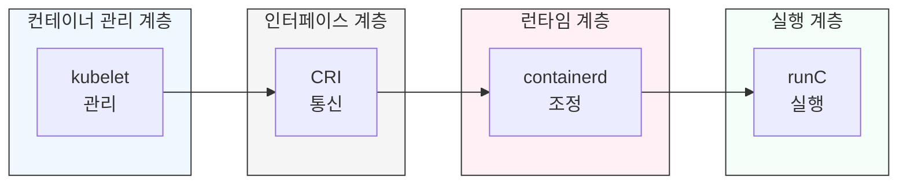

컨테이너 기술은 클라우드 네이티브 환경에서 필수적인 요소입니다. 본 글에서는 리눅스 커널 기반 기술부터 Kubernetes에서의 관리 방식까지 다룹니다.

<!-- truncate -->

## 1. 리눅스와 컨테이너 기술의 역사

컨테이너는 클라우드 네이티브 환경에서 필수적인 역할을 합니다. 이 기술을 제대로 이해하기 위해서는 리눅스의 기본 기술부터 쿠버네티스의 컨테이너 관리 방식까지 살펴볼 필요가 있습니다.

### 1.1 Linux의 발전

Linux는 1991년 UNIX를 기반으로 시작되어 컨테이너 기술의 근간이 되었습니다. UNIX에서 시작된 운영체제는 RedHat Enterprise Linux(RHEL)와 같은 상용 배포판과 CentOS 같은 무료
배포판으로 발전했습니다. 최근에는 컨테이너 워크로드에 최적화된 경량 운영체제가 등장하면서, 기존의 범용 운영체제와는 다른 방향으로 발전하고 있습니다.

최근 CentOS 서비스 종료로 Rocky Linux가 대체재로 등장했습니다.

### 1.2. 컨테이너 기술의 등장

컨테이너는 리눅스 커널의 핵심 3가지 기술들을 기반으로 합니다. 먼저 `chroot`는 프로세스별로 독립된 디렉토리 환경을 제공합니다. `namespace`는 프로세스별로 시스템 자원을 분리하여 독립된 공간을
만들어주는데, 여기에는 마운트(mnt), 프로세스 ID(pid), 네트워크(net), 사용자(user), IPC, UTS 등의 분리가 포함됩니다. 마지막으로 `cgroup`은 프로세스별로 메모리, CPU, 네트워크,
디스크 I/O 등의 시스템 리소스 사용을 제어합니다.

위 기술들을 활용하여 컨테이너 기술이 발전하게 되었습니다.

## 2. 컨테이너 런타임 아키텍처

### 2.1 컨테이너 런타임의 계층 구조

컨테이너 런타임은 크게 두 가지 수준으로 나눌 수 있습니다.

- 고수준(High Level) 런타임인 `Docker`나 `containerd`는 이미지 관리, 네트워크 설정 등 사용자 친화적인
  추가 기능을 제공합니다.

- 저수준(Low Level) 런타임은 `runC`와 같이 기계와 직접 상호작용하는 컴포넌트입니다. 이는 OCI(Open Container
  Initiative) 표준을 따르며, 실제 컨테이너의 생성과 실행을 담당합니다.

### 2.2 Docker와 containerd: 전환 배경과 결과

Docker는 초기 컨테이너 기술의 대중화를 이끌며, 개발 환경에서는 유용한 도구로 자리 잡았습니다. 그러나 Kubernetes와 같은 대규모 오케스트레이션 환경에서는 다음과 같은 문제가 있었습니다:

- 복잡한 계층 구조: `kubelet` → `dockershim` → `Docker Engine` → `containerd` → `runC`로 이어지는 경로는 불필요한 중간 계층을 포함해 성능 저하를 초래했습니다.
- 비효율성: `Docker`의 이미지 빌드, `CLI` 등은 `Kubernetes` 운영 환경에서 사용되지 않아 리소스 낭비로 이어졌습니다.

이를 해결하기 위해 Kubernetes는 1.24 버전부터 `dockershim`을 제거하고, 더 경량화된 `containerd`를 기본 런타임으로 채택했습니다. 이 전환은 다음과 같은 결과를 가져왔습니다:

- 단순화된 경로: kubelet → CRI → containerd → runC
- 성능 향상: 불필요한 계층 제거로 리소스 효율성 증가
- 표준화된 인터페이스: OCI 표준 준수를 통해 다양한 런타임 간 호환성을 확보

### 2.3 현대적 컨테이너 런타임 아키텍처

현대적인 컨테이너 런타임 아키텍처는 Kubernetes 환경에서 효율성과 표준화를 목표로 설계되었습니다. Kubernetes는 CRI(Container Runtime Interface)를 통해 다양한 런타임과
호환성을 유지하며, `containerd`와 같은 경량화된 런타임을 선호합니다. 이 구조는 다음과 같은 장점을 제공합니다:

- 불필요한 계층 제거로 성능 최적화
- OCI 표준 준수를 통한 호환성 보장
- 유연성 강화로 다양한 환경에서의 활용 가능

### 2.4 Docker의 역할 변화

Docker는 여전히 로컬 개발 환경에서 중요한 도구로 사용됩니다. 특히 이미지 빌드 및 테스트와 같은 작업에 적합하며, 개발자 친화적인 CLI 도구를 제공합니다. 하지만 운영 환경에서는 containerd와 같은
경량화된 런타임이 선호됩니다. 이는 Kubernetes의 확장성과 효율성을 높이는 데 기여하며, Docker는 주로 개발 중심 작업에 집중하는 역할로 변화하고 있습니다.

## 3. 쿠버네티스의 컨테이너 관리

### 3.1. 쿠버네티스에서의 Pod 생성 과정

Kubernetes에서 Pod는 가장 기본적인 배포 단위입니다. Pod 생성 요청은 kubelet → CRI → containerd → runC라는 경로를 거쳐 실행됩니다. 이 과정에서 Kubernetes는 gRPC
기반의 CRI(Container Runtime Interface)를 통해 컨테이너 런타임과 효율적으로 통신합니다. gRPC는 표준화된 프로토콜로 다양한 런타임(containerd, cri-o 등)을 지원하며, 일관된
인터페이스를 제공합니다.

- Pod 생성 요청 단계
    - 사용자가 kube-apiserver에 Pod 생성을 요청합니다.
    - kube-apiserver는 요청을 받아 kubelet에 전달합니다.

- 컨테이너 생성 단계
    - kubelet은 CRI(Container Runtime Interface)를 통해 containerd에 명령을 전달합니다.
    - containerd는 필요한 이미지를 다운로드하고 runC를 통해 실제 컨테이너를 생성 및 실행합니다.

### 3.2 CRI 구현체들의 역할

CRI는 다양한 런타임을 지원할 수 있도록 설계되었습니다. 현재 주요 구현체로는 다음 두 가지가 있습니다:

1. **CRI-Containerd**는 `containerd`의 공식 CRI 구현체로, 안정성과 성능을 인정받아 가장 널리 사용되고 있습니다. OCI 표준 준수를 통해 다양한 환경에서 호환성을 제공합니다.

2. **cri-dockerd**는 기존 `Docker` 기반 환경의 마이그레이션을 위한 브릿지 역할을 합니다. `dockershim`이 쿠버네티스에서 제거된 후, `Docker`를 계속 사용해야 하는 환경을 위해
   제공되는 솔루션입니다.

## 4. 컨테이너 격리와 리소스 관리

### 4.1 리소스 격리와 제어 기술

컨테이너는 호스트 시스템의 리소스를 공유하면서도 서로 격리된 환경에서 실행됩니다. 이는 다음과 같은 리눅스 커널 기능들을 통해 구현됩니다:

이러한 격리 기술들이 적절히 조합되어 컨테이너라는 하나의 논리적 단위를 형성합니다. 각 컨테이너는 자신만의 격리된 환경에서 실행되면서도, 필요한 만큼의 시스템 리소스만을 사용하도록 제어됩니다.

### 4.2 네트워킹과 CNI(Container Network Interface)

컨테이너 네트워킹은 CNI(Container Network Interface)를 통해 구현됩니다. CNI는 컨테이너의 네트워크 설정을 담당하는 표준 인터페이스로, 다음과 같은 기능을 제공합니다:

- Pod 간 통신
- 서비스 디스커버리
- 네트워크 정책 적용
- 로드 밸런싱

## 5. 컨테이너의 표준화와 OCI(Open Container Initiative)

### 5.1. OCI 표준의 필요성과 영향

컨테이너 기술이 급속도로 발전하면서, 서로 다른 구현체들 간의 호환성 문제가 대두되었습니다. 이러한 문제를 해결하기 위해 2015년 Docker를 주축으로 OCI가 설립되었습니다. OCI는 두 가지 핵심 표준을
정의했습니다:

#### Runtime Specification

- 컨테이너 실행 환경에 대한 표준
- 컨테이너의 라이프사이클 관리 방법 정의
- 리소스 격리와 제어 방식 표준화

#### Image Specification

- 컨테이너 이미지 포맷 표준화
- 이미지 생성 및 배포 방식 정의
- 이미지 레이어 관리 방식 표준화

### 5.2. runC: OCI 표준의 참조 구현체

runC는 OCI 표준의 대표적인 구현체로, 저수준 컨테이너 런타임의 기준이 되었습니다. 다음과 같은 특징을 가집니다:

- 경량화된 구조
- 리눅스 커널 기능 직접 활용
- 높은 보안성과 안정성
- 다양한 고수준 런타임에서 활용

### 5.3. containerd의 역할

containerd는 Docker에서 분리되어 나온 고수준 컨테이너 런타임으로, 다음과 같은 기능을 제공합니다:

- 컨테이너 실행 및 관리
- 이미지 풀/푸시
- 스토리지 관리
- 네트워크 인터페이스 제공

특히 쿠버네티스 환경에서 containerd는 다음과 같은 장점을 제공합니다:

이러한 단순화된 구조는 성능 향상과 안정성 개선에 큰 도움이 되었습니다.

컨테이너 기술은 리소스 격리와 효율성을 제공하며, 현대 IT 환경에서 필수적인 요소로 자리 잡았습니다. 특히 OCI 표준화와 쿠버네티스와 같은 도구들의 발전은 이 기술을 더욱 강력하고 유연하게 만들었습니다.

## 6. 결론

지금까지 살펴본 컨테이너 기술은 리눅스 커널의 기본 기능에서 시작하여 현대적인 클라우드 네이티브 환경의 핵심 요소로 발전해왔습니다. 주요 발전 과정을 정리해보면 다음과 같습니다

1. 기술적 진화
    - 리눅스 커널의 namespace, cgroups, chroot에서 시작
    - Docker를 통한 컨테이너 기술의 대중화
    - OCI 표준화를 통한 생태계 확장
    - 쿠버네티스를 통한 오케스트레이션 표준화
2. 아키텍처 최적화
    - 복잡한 Docker 기반 구조에서 경량화된 containerd 중심으로 전환
    - CRI를 통한 표준 인터페이스 확립
    - 효율적인 리소스 관리와 격리 구현

## Appendix

### 주요 용어 설명:

- CRI (Container Runtime Interface): 쿠버네티스와 컨테이너 런타임 간의 표준 통신 인터페이스
- OCI (Open Container Initiative): 컨테이너 포맷과 런타임에 대한 산업 표준을 정의하는 단체
- namespace: 프로세스 격리를 위한 리눅스 커널 기능
- cgroups: 리소스 사용을 제어하는 리눅스 커널 기능
- containerd: OCI 표준을 구현한 산업 표준 컨테이너 런타임
- runC: 저수준 컨테이너 런타임의 참조 구현체

### 참고 자료
- [인프런 쿠버네티스 어나더 클래스 (지상편) - Sprint 1, 2 강의 섹션3 컨테이너 한방 정리](https://inf.run/NzKy)

**Sprint1**

#1.컨테이너 한방정리 [컨테이너 기술의 이해, 커널부터 쿠버네티스까지(현재 글)](https://doxxx.dev/blog/2025/02/01/from-linux-kernel-to-kubernetes)

시리즈 글로 이어집니다. 다음 글에서는 쿠버네티스 설치와 환경 구성에 대해 다루게 됩니다.
