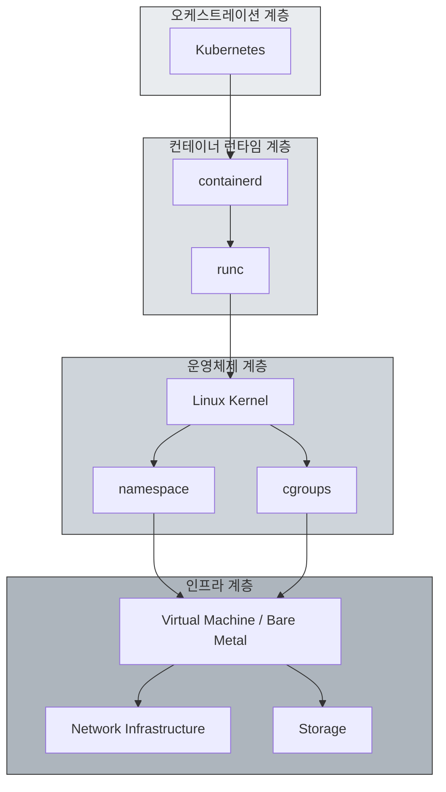
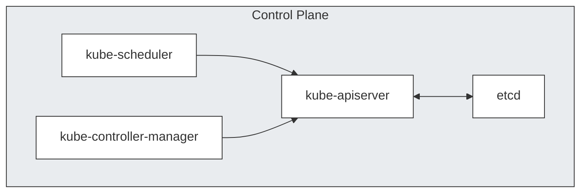
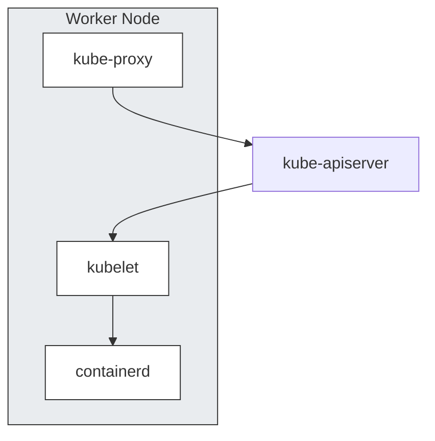
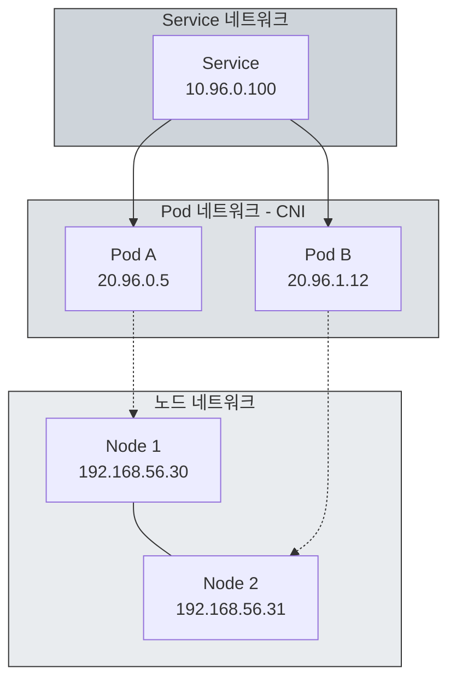
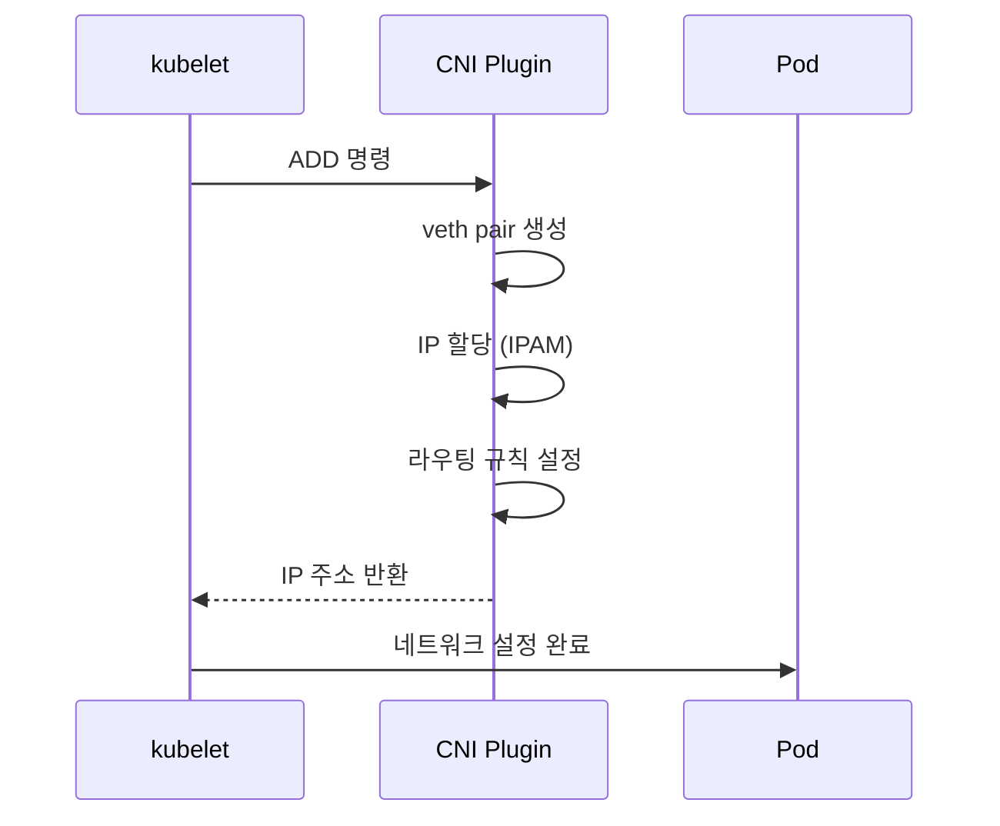
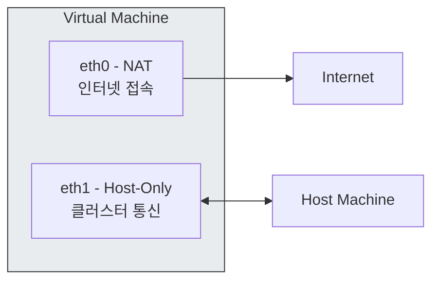
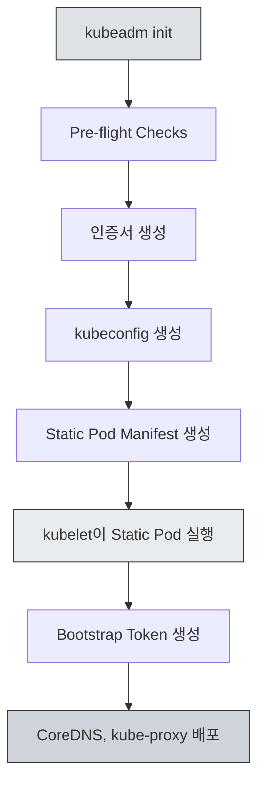
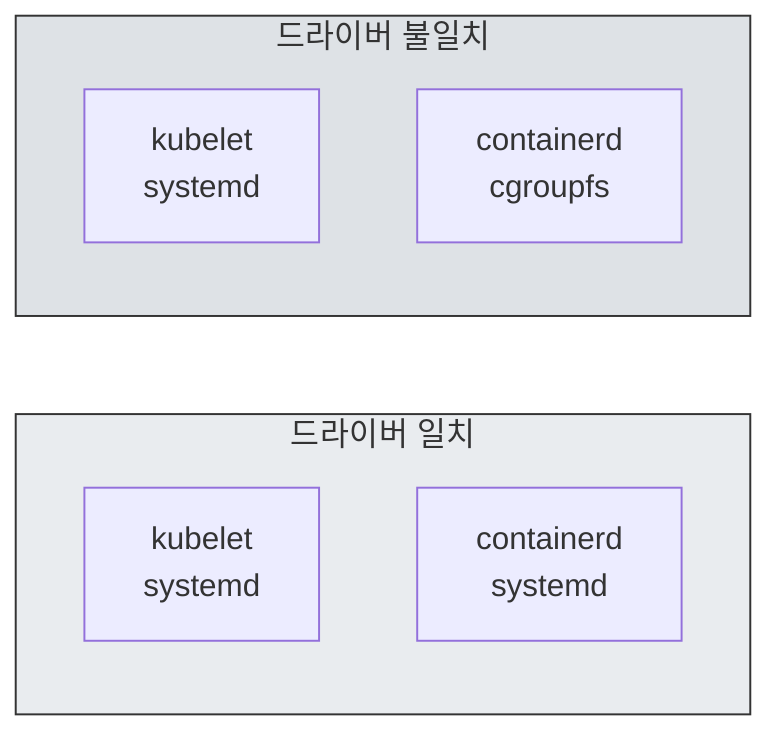
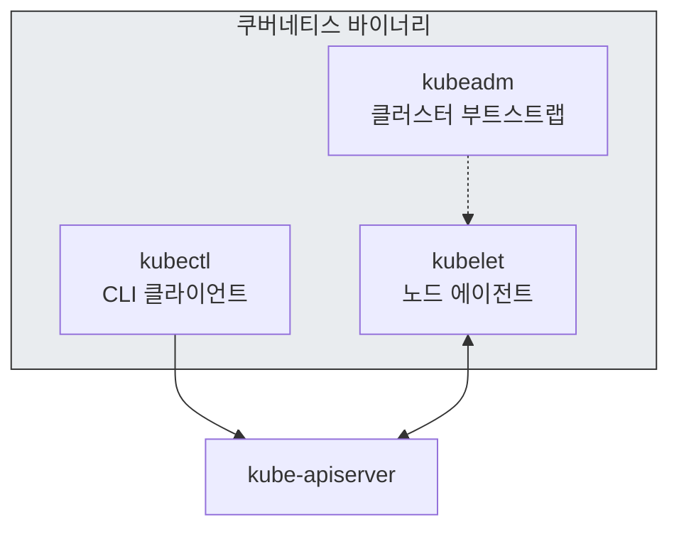

kubeadm으로 쿠버네티스를 직접 설치해보면 클러스터 내부 동작 방식을 깊이 이해할 수 있습니다. 이 글에서는 설치 과정에서 마주치는 핵심 아키텍처와 네트워크 구성을 다룹니다.

<!-- truncate -->

## 1. 쿠버네티스와 인프라 스택

쿠버네티스는 독립적으로 동작하지 않습니다. 여러 계층의 인프라 위에서 실행되기 때문에, 각 계층의 역할을 이해하면 문제 발생 시 적절한 레이어에서 디버깅할 수 있습니다.

### 1.1 전체 스택 구조



### 1.2 Control Plane 컴포넌트

마스터 노드의 Control Plane은 다음 컴포넌트로 구성됩니다.



각 컴포넌트는 고유한 역할을 담당합니다.

- **kube-apiserver**: 모든 API 요청의 진입점입니다. 인증/인가를 처리하며 etcd와 유일하게 통신합니다.
- **etcd**: 분산 키-값 저장소로 클러스터의 모든 상태 정보를 저장합니다.
- **kube-scheduler**: Pod를 적절한 노드에 배치하는 스케줄링을 담당합니다.
- **kube-controller-manager**: Deployment, ReplicaSet 등 다양한 컨트롤러를 실행합니다.

### 1.3 Worker Node 컴포넌트



- **kubelet**: 각 노드의 에이전트로 Pod 라이프사이클을 관리하고 CRI를 통해 컨테이너 런타임과 통신합니다.
- **kube-proxy**: Service와 Pod 간의 네트워크 라우팅을 담당하며 iptables 또는 IPVS 규칙을 관리합니다.
- **containerd**: CRI 구현체로 실제 컨테이너의 실행을 담당합니다.

## 2. 네트워크 구성

쿠버네티스 설치에서 가장 복잡한 부분은 네트워크입니다. 세 가지 계층의 네트워크가 유기적으로 동작해야 클러스터가 정상적으로 작동합니다.

### 2.1 네트워크 계층 구조



| 네트워크 계층 | CIDR 예시 | 담당 컴포넌트 | 역할 |
|--------------|-----------|--------------|------|
| Node Network | 192.168.56.0/24 | OS/Hypervisor | 물리/가상 노드 간 통신 |
| Pod Network | 20.96.0.0/12 | CNI (Calico) | Pod 간 통신, IP 할당 |
| Service Network | 10.96.0.0/12 | kube-proxy | 서비스 디스커버리, 로드밸런싱 |

### 2.2 CNI 동작 방식

`kubeadm init` 직후 CoreDNS Pod가 Pending 상태로 남아있는 경우가 있습니다. CNI 플러그인이 설치되지 않아 Pod Network가 구성되지 않았기 때문입니다.



Calico를 설치하면 다음 작업들이 수행됩니다.

1. 각 노드에 `calico-node` DaemonSet 배포
2. BGP를 통한 노드 간 라우팅 정보 교환
3. 각 Pod에 고유 IP 할당 및 라우팅 테이블 구성

### 2.3 VM 환경의 네트워크 구성

VirtualBox 같은 가상화 환경에서는 두 가지 네트워크 인터페이스를 설정합니다.



- **NAT**: 인터넷 접속용입니다. 패키지 다운로드, 이미지 pull에 사용됩니다.
- **Host-Only**: 노드 간 통신과 호스트에서의 클러스터 접근에 사용됩니다.

`kubeadm init` 실행 시 `--apiserver-advertise-address`를 Host-Only 인터페이스의 IP로 지정해야 합니다. NAT 인터페이스 IP를 사용하면 노드 간 통신에 실패합니다.

## 3. 필수 사전 작업

kubeadm을 사용한 설치 전에 수행해야 하는 사전 작업들이 있습니다. 각 작업이 필요한 기술적 이유를 이해하면 클러스터 운영 시 발생하는 문제를 진단하는 데 도움이 됩니다.

### 3.1 kubeadm init 프로세스



Pre-flight Checks에서 확인하는 항목은 다음과 같습니다.
- 루트 권한 확인
- 스왑 비활성화 여부
- 필수 포트 가용성
- 컨테이너 런타임 상태
- cgroup 드라이버 일치 여부

### 3.2 스왑 비활성화

```bash
swapoff -a
sed -i '/ swap / s/^\(.*\)$/#\1/g' /etc/fstab
```

스왑 비활성화가 필요한 이유는 kubelet의 메모리 관리 방식과 관련됩니다.

- kubelet은 cgroups를 통해 각 Pod의 메모리 요청/제한을 관리합니다.
- 스왑이 활성화되면 실제 메모리 사용량을 정확히 계산할 수 없습니다.
- Pod eviction 정책이 정상적으로 동작하지 않을 수 있습니다.
- OOM Killer의 동작이 예측 불가능해집니다.

### 3.3 cgroup 드라이버 통일

kubelet과 컨테이너 런타임의 cgroup 드라이버가 일치해야 합니다.



systemd를 init 시스템으로 사용하는 리눅스에서는 systemd가 이미 cgroup 계층을 관리합니다. cgroupfs와 systemd가 동시에 cgroup을 관리하면 리소스 경합이 발생할 수 있습니다.

containerd 설정 파일(`/etc/containerd/config.toml`)에서 다음과 같이 설정합니다:

```toml
[plugins."io.containerd.grpc.v1.cri".containerd.runtimes.runc.options]
  SystemdCgroup = true
```

### 3.4 핵심 바이너리

쿠버네티스 설치에는 세 가지 바이너리가 필요합니다:



- **kubeadm**: 클러스터 생성 및 관리 도구로 init, join, upgrade 등의 작업을 수행합니다.
- **kubelet**: 각 노드에서 실행되는 데몬으로 Pod 라이프사이클을 관리합니다.
- **kubectl**: 클러스터와 상호작용하는 CLI 도구입니다.

### 3.5 마스터 노드 Taint 해제

기본적으로 마스터 노드에는 다음 Taint가 설정되어 일반 워크로드가 스케줄링되지 않습니다:

```
node-role.kubernetes.io/control-plane:NoSchedule
```

단일 노드 클러스터나 학습 환경에서는 이 Taint를 해제해야 합니다:

```bash
kubectl taint nodes --all node-role.kubernetes.io/control-plane-
```

## 4. 결론

지금까지 kubeadm을 통한 쿠버네티스 클러스터 구축 과정을 살펴보았습니다. 주요 내용을 정리해보면 다음과 같습니다.

1. 아키텍처 이해
    - Control Plane과 Worker Node의 컴포넌트 구성
    - 각 컴포넌트 간의 상호작용 방식
2. 네트워크 구조
    - Node, Pod, Service 세 계층 네트워크의 역할
    - CNI의 동작 원리와 Calico 설치 과정
3. 운영 기반
    - 스왑 비활성화, cgroup 드라이버 통일 등 사전 작업의 기술적 배경
    - 각 설정값이 클러스터 동작에 미치는 영향

이러한 이해는 GKE, EKS와 같은 매니지드 서비스를 사용할 때도 클러스터의 동작 방식을 파악하고 문제를 진단하는 데 도움이 됩니다.

## 참고 자료

- [인프런 - 쿠버네티스 어나더 클래스 (지상편)](https://inf.run/NzKy)
- [Kubernetes 공식 문서 - kubeadm](https://kubernetes.io/docs/setup/production-environment/tools/kubeadm/)
- [Calico 공식 문서](https://docs.tigera.io/calico/latest/about/)

**Sprint1**

#1.컨테이너 한방정리 [컨테이너 기술의 이해, 커널부터 쿠버네티스까지](/2025/02/01/from-linux-kernel-to-kubernetes)

#2.쿠버네티스 설치 [쿠버네티스 클러스터 구축, 아키텍처부터 네트워크까지(현재 글)](/2026/01/05/the-weight-of-kubernetes-installation)

#3.쿠버네티스가 편한 이유 [실무자가 말하는 쿠버네티스, '복잡함' 너머의 '편리함' 4가지](/2026/01/06/kubernetes-practical-benefits)