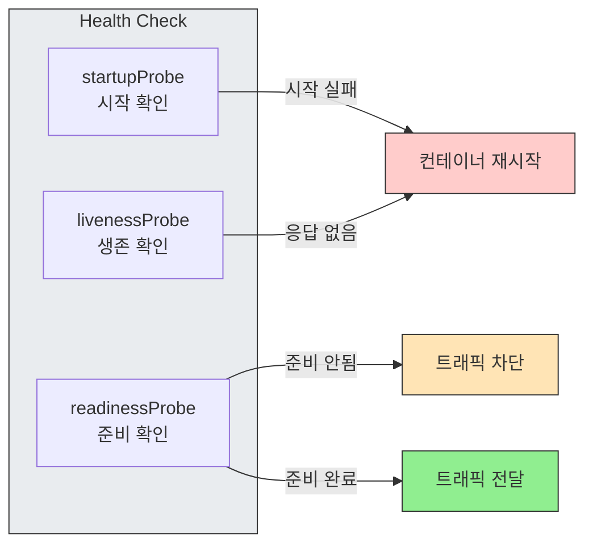
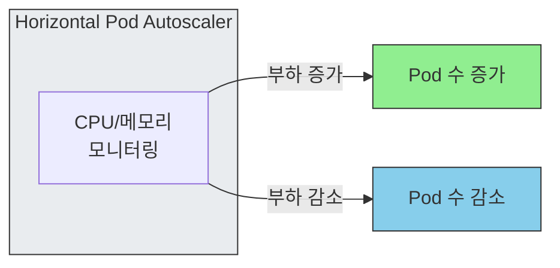
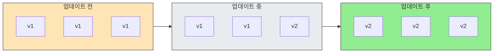
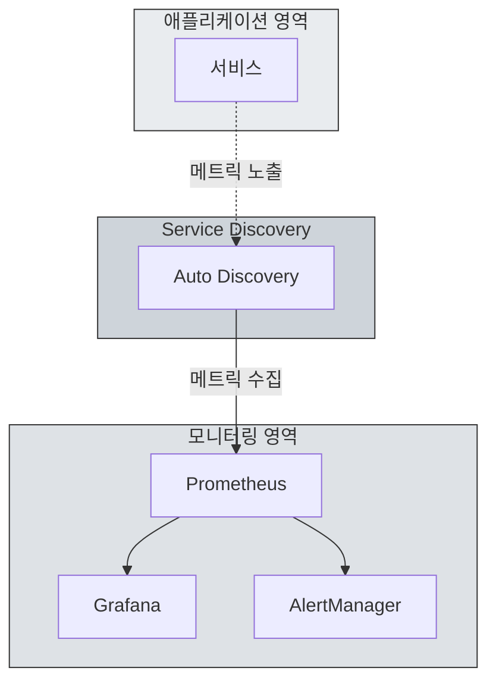
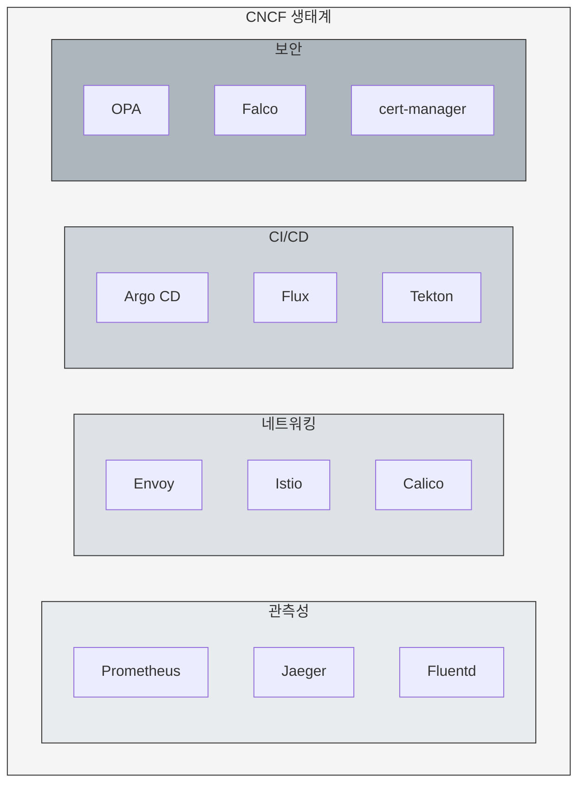

쿠버네티스를 처음 접하면 복잡성과 가파른 학습 곡선에 막막함을 느끼기 쉽습니다. 하지만 이 초기 장벽을 넘어 실무에 적용하기 시작하면, 그 복잡함 속에 숨겨진 강력한 편리함들을 체감하게 됩니다.

이 글에서는 복잡하다는 첫인상에 가려지기 쉬운, 하지만 실무자에게는 더 크게 와닿는 쿠버네티스의 핵심적인 편리함 4가지를 소개합니다.

<!-- truncate -->

## 1. 코드 기반 인프라 관리

쿠버네티스 환경에서는 개발, QA, 운영 등 모든 인프라 환경을 YAML 매니페스트로 관리합니다. 수동으로 서버를 설정하면 환경 간의 미세한 차이(configuration drift)가 발생하기 쉽고, 이는 예측
불가능한 장애의 원인이 됩니다. 쿠버네티스는 선언적 구성을 통해 이 문제를 해결합니다.

### 변경 이력 관리

모든 인프라 변경 사항이 코드의 커밋 기록으로 남습니다. 마치 애플리케이션 코드를 관리하듯, 인프라의 모든 변경 이력을 추적하고 특정 시점으로 되돌리는 작업이 쉬워집니다.

### 변경 추적

인프라가 코드로 관리되기 때문에 누가, 언제, 왜 변경했는지 명확하게 추적할 수 있습니다. 이는 팀의 책임 소재를 분명히 하고, 문제 발생 시 원인을 찾는 과정을 단순화합니다.

### 효율성과 품질 향상

Deployment, Service, ConfigMap 같은 YAML 매니페스트를 Git에 저장하고, Kustomize나 Helm으로 환경별 차이만 적용하면 됩니다. 새로운 환경 구축은
`kubectl apply -k overlays/staging` 한 줄로 끝납니다.

여기에 ArgoCD 같은 GitOps 도구를 연결하면 Git push만으로 배포가 완료되고, 클러스터 상태가 Git과 다르면 자동으로 동기화됩니다. 이를 통해 인프라 코드와 실제 상태의 일치가 보장됩니다.

엔지니어는 반복 작업에서 벗어나 과거의 경험과 노하우를 코드에 녹여내며 인프라의 전체적인 품질을 높이는 데 집중할 수 있습니다.

## 2. 자동화된 서비스 안정화

기존의 가상머신(VM) 환경에서는 IP 설정, 각종 구성, 모니터링 시스템 연동 등 많은 부분을 수동으로 처리해야 했습니다. 쿠버네티스는 서비스 안정성을 위한 핵심 기능들을 자동화하여 제공합니다.

### 셀프 힐링 (Self-Healing)

쿠버네티스는 세 가지 프로브를 통해 애플리케이션 상태를 확인합니다. `startupProbe`는 초기화가 느린 애플리케이션의 시작 완료를 확인하고, `livenessProbe`는 컨테이너가 살아있는지 확인하여 응답이
없으면 재시작합니다. `readinessProbe`는 트래픽을 받을 준비가 됐는지 확인하여, 준비되지 않은 Pod에는 요청을 보내지 않습니다.

### 오토 스케일링 (Auto-Scaling)

CPU나 메모리 사용량 같은 부하 지표를 기준으로 애플리케이션 Pod의 수를 자동으로 늘리거나 줄일 수 있습니다. 트래픽이 급증할 때 자동으로 확장하여 안정적인 서비스를 유지하고, 트래픽이 줄어들면 다시 축소하여
자원을 효율적으로 사용합니다.

기본 메트릭 외에도 Prometheus 커스텀 메트릭이나 외부 메트릭을 기준으로 스케일링할 수 있어, 비즈니스 요구사항에 맞는 세밀한 조정이 가능합니다.

### 롤링 업데이트 (Rolling Update)

애플리케이션을 새로운 버전으로 업데이트할 때 서비스 중단 없이 배포할 수 있습니다. 기존 버전의 파드를 한 번에 내리는 대신, 새로운 버전의 파드를 하나씩 띄우고 기존 파드를 순차적으로 내리는 방식으로 업데이트를
진행합니다.

이러한 자동화 기능들 덕분에 엔지니어는 장애 대응보다 시스템 설계에 집중할 수 있습니다.

## 3. 모니터링 구조 분리

많은 프로젝트에서 모니터링과 로깅 시스템을 구축할 때 구조적인 문제에 직면합니다. 쿠버네티스는 이러한 문제들을 구조적으로 해결합니다.

과거에는 개발 시스템과 모니터링 시스템이 복잡하게 결합되어 있었습니다. 쿠버네티스 생태계의 모니터링 도구는 애플리케이션과 독립된 표준 컴포넌트로 작동합니다. 이를 통해 프로젝트 초기부터 일관된 모니터링 환경을 구축할
수 있습니다.

애플리케이션의 범위와 모니터링 범위가 일치하지 않던 문제 역시 서비스 디스커버리를 통해 해결됩니다. 새로운 Pod가 생성되면 자동으로 모니터링 대상에 추가되어, 개발에 영향을 주지 않으면서도 모든 환경에서 일관된
가시성을 확보할 수 있습니다.

## 4. 표준화된 CNCF 생태계

CNCF(Cloud Native Computing Foundation)의 생태계 지도를 보면 수많은 도구들이 나열되어 있어 압도감을 느끼기 쉽습니다. 하지만 이는 오히려 쿠버네티스의 가장 큰 장점 중 하나입니다.

이 거대한 생태계는 IT 인프라를 구축하는 '표준' 그 자체를 의미합니다. 과거에는 스토리지, 네트워킹, CI/CD, 보안, 모니터링 등 인프라의 각 영역에 필요한 솔루션을 직접 찾거나 만들어야 했습니다.

쿠버네티스 생태계 안에서는 이미 검증된 수많은 오픈소스 도구들이 준비되어 있습니다. 우리는 각 필요에 맞는 최적의 도구를 선택하여 조합하기만 하면 됩니다. 마치 잘 만들어진 고품질 부품들로 견고한 시스템을 조립하는
것과 같습니다.

이 표준화된 생태계 덕분에 검증된 도구를 조합하여 빠르고 안정적으로 인프라를 구축할 수 있습니다.

## 결론

쿠버네티스는 분명 배움의 과정이 필요한 기술입니다. 하지만 그 과정을 거치고 나면 인프라 관리, 서비스 안정성, 모니터링, 그리고 강력한 생태계의 지원이라는 측면에서 비교할 수 없는 편리함과 효율성을 제공합니다.

복잡함이라는 첫인상 너머에 있는 이 이점들이 바로 수많은 기업과 개발자들이 쿠버네티스를 선택하는 이유입니다. 초기 학습 곡선이 가파른 만큼 그 이후의 생산성 향상도 큽니다.

쿠버네티스를 도입할지 고민하는 분들에게 이 글이 도움이 되길 바랍니다.

## 참고 자료

- [인프런 - 쿠버네티스 어나더 클래스 (지상편)](https://inf.run/NzKy)

**Sprint1**

#1.컨테이너 한방정리 [컨테이너 기술의 이해, 커널부터 쿠버네티스까지](/2025/02/01/from-linux-kernel-to-kubernetes)

#2.쿠버네티스 설치 [쿠버네티스 클러스터 구축, 아키텍처부터 네트워크까지](/2026/01/05/the-weight-of-kubernetes-installation)

#3.쿠버네티스가 편한 이유 [실무자가 말하는 쿠버네티스, '복잡함' 너머의 '편리함' 4가지(현재 글)](/2026/01/06/kubernetes-practical-benefits)
