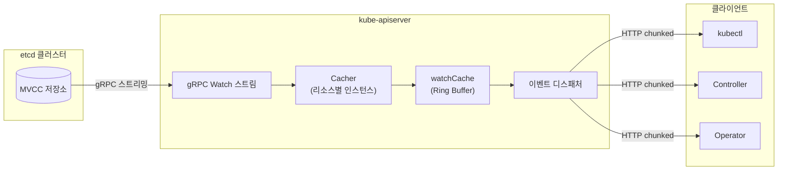
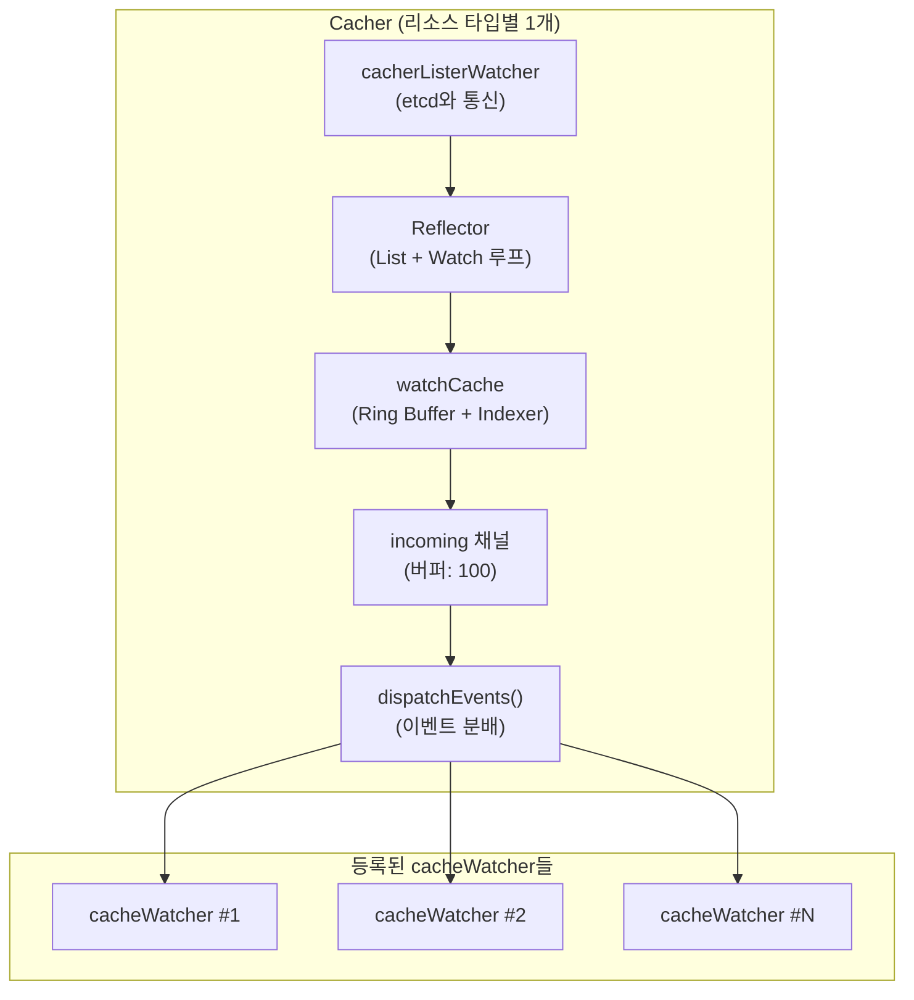
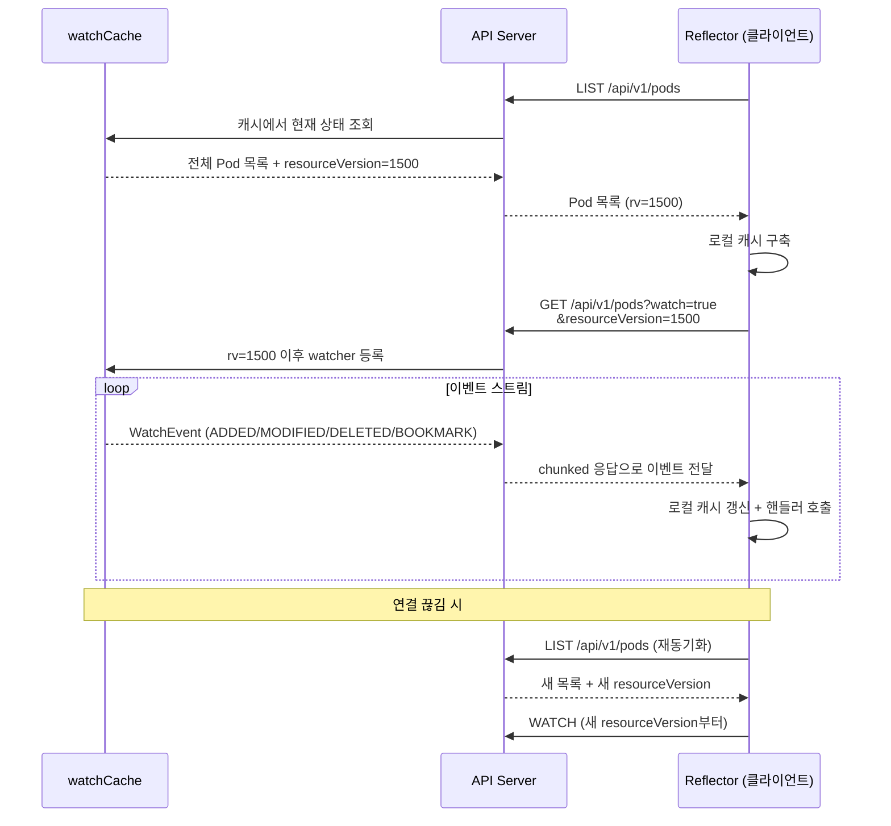
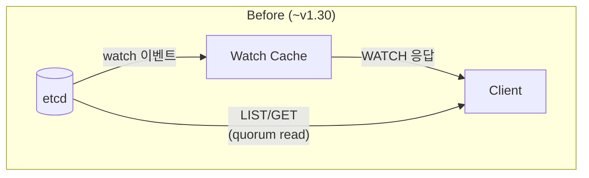
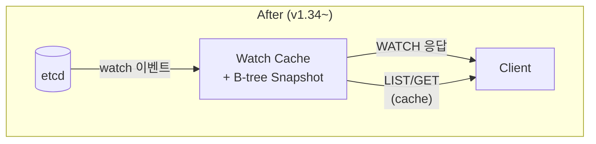
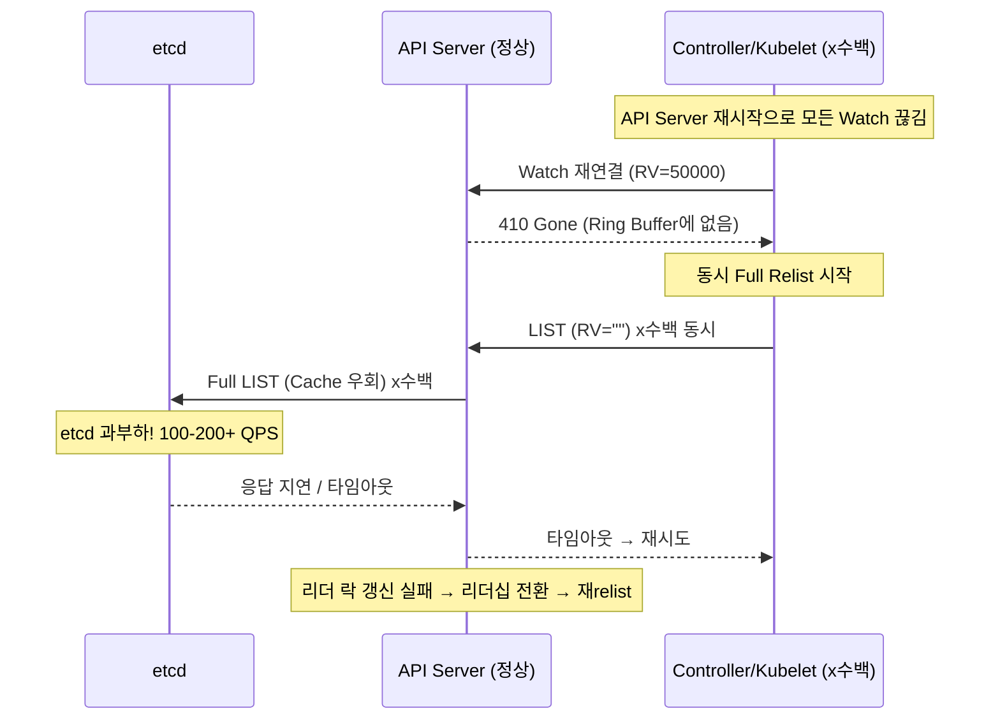
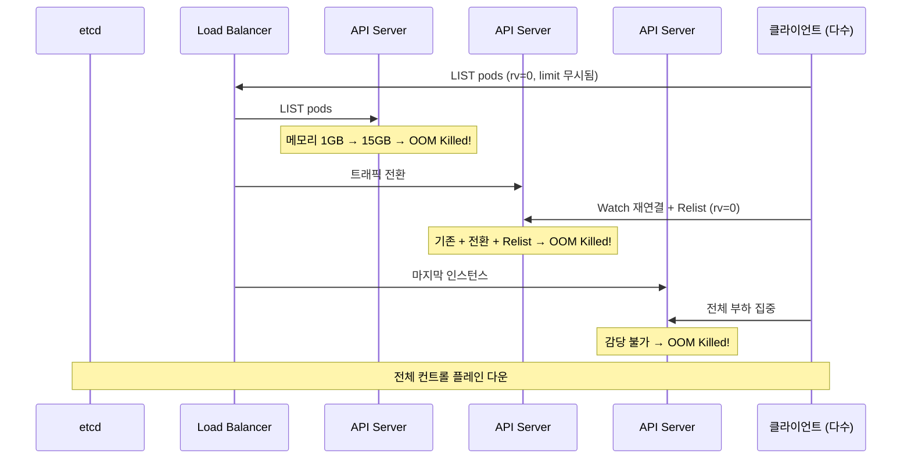

Kubernetes 컨트롤 플레인의 거의 모든 컴포넌트는 API Server와의 Watch 연결 위에서 동작합니다. Argo CD, HPA, kubelet, kube-proxy 전부 그렇습니다. Watch 연결이 끊기면 컨트롤러가 멈추고, 한꺼번에 복구되면 API Server가 죽을 수도 있습니다.

이 글에서는 Watch Cache의 내부 구조를 먼저 살펴본 뒤, 어디서 문제가 생기면 어떤 일이 벌어지는지를 정리합니다.

<!-- truncate -->

## 아키텍처

### 큰 그림

Kubernetes의 Watch 파이프라인은 세 레이어로 나뉩니다.



etcd에서 변경이 발생하면 gRPC 스트림을 통해 API Server로 전달되고, API Server 내부의 Watch Cache가 이벤트를 저장한 뒤 클라이언트들에게 분배합니다. 클라이언트는 HTTP chunked transfer encoding으로 이벤트 스트림을 받습니다.

### etcd 레이어

etcd는 MVCC(Multi-Version Concurrency Control) 모델을 사용합니다. 모든 쓰기 작업은 단조 증가하는 **revision** 번호를 부여받으며, 이전 상태가 즉시 삭제되지 않고 보존됩니다. 덕분에 "revision 1500 이후에 바뀐 것만 알려줘"라는 요청이 가능하고, 이것이 Watch의 기반입니다. Kubernetes의 `resourceVersion`은 이 etcd revision을 그대로 노출한 것입니다.

다만 이전 상태가 영원히 남는 건 아닙니다. **Compaction**이 주기적으로 오래된 revision을 정리합니다 (kubeadm 기본값 5분). compaction 없이는 디스크와 메모리가 무한히 증가하지만, 정리된 revision은 더 이상 조회할 수 없습니다.

이 제약이 뒤에서 다룰 `410 Gone`의 원인 중 하나가 됩니다.

### API Server Watch Cache



Watch Cache가 존재하는 이유는 단순합니다. 클라이언트 1,000개가 각각 etcd에 watch를 걸면 etcd가 죽기 때문입니다. Watch Cache는 etcd에는 **리소스 타입당 단 1개의 watch만** 열고, 수천 클라이언트에 대한 이벤트 분배를 인메모리에서 처리합니다. 클라이언트가 아무리 늘어도 etcd 부하는 거의 변하지 않습니다.

이 역할을 수행하는 핵심 구조가 **Cacher**입니다. Pod용, Service용, Secret용 등 리소스 타입별로 독립적인 인스턴스가 존재합니다. 위 다이어그램의 흐름을 따라가면: etcd로부터 이벤트를 받아(cacherListerWatcher → Reflector) Ring Buffer에 저장하고(watchCache), incoming 채널을 거쳐 등록된 모든 cacheWatcher에게 분배합니다(dispatchEvents).

Cacher 내부의 **Ring Buffer**는 현재 상태 전체가 아니라 변경 이벤트(delta)만 저장합니다. "Pod A 생성됨", "Pod B status 변경" 같은 이벤트가 쌓이는 구조입니다. 덕분에 새 watcher가 중간에 합류해도 최근 변경분만 전달받을 수 있지만, 버퍼를 벗어난 과거 이벤트는 복구할 수 없습니다. 이것이 `410 Gone`의 직접적인 원인입니다. 크기는 동적으로 조절되며 대략 75초 분량의 히스토리를 유지합니다.

각 Cacher는 리소스별로 독립적인 resourceVersion을 추적합니다. Pod처럼 변경이 많은 리소스는 RV가 빠르게 전진하지만, RuntimeClass처럼 한번 설정하고 거의 안 바뀌는 리소스는 RV가 오랫동안 정체됩니다. 글로벌 RV는 50000인데 특정 리소스의 RV는 45000에 머물러 있는 식입니다. 이 격차가 뒤에서 다룰 Quiet Resource Timeout의 원인이 됩니다.

### 클라이언트: List-Watch 패턴



클라이언트 쪽에서는 **Reflector**가 List-Watch 루프를 실행합니다. 처음 시작할 때는 현재 상태를 전혀 모르기 때문에 LIST로 전체 스냅샷을 가져옵니다. 이후에는 그 시점의 resourceVersion부터 WATCH를 걸어서 변경분만 수신합니다. 전체를 매번 가져오는 polling과 달리, 한 번만 전체를 받고 나머지는 delta만 받는 구조입니다.

연결이 끊기면 마지막으로 알고 있는 resourceVersion으로 자동 재연결합니다. 이 재연결이 실패하면 — Ring Buffer에 해당 RV가 남아있지 않으면 — `410 Gone`이 발생합니다. 아래에서 다루겠습니다.

**SharedInformer**는 동일 리소스에 대해 여러 핸들러가 하나의 watch 연결을 공유하게 해서 API Server 부하를 줄여줍니다.

### Watch Cache의 진화

Watch Cache는 단순 버퍼에서 시작해 지금은 거의 모든 읽기를 처리하는 레이어로 성장했습니다.





파이프라인 구조는 동일하지만, Read 경로(LIST/GET)가 etcd에서 cache로 옮겨갔습니다.

| 버전 | 개선 | 효과 |
|------|------|------|
| v1.17 | Bookmark 이벤트 ([KEP-956](https://github.com/kubernetes/enhancements/blob/master/keps/sig-api-machinery/956-watch-bookmark/README.md)) | 410 Gone 감소 |
| v1.24 | Progress Notification ([KEP-1904](https://github.com/kubernetes/enhancements/issues/1904)) | 조용한 리소스 RV 갱신 |
| v1.31 | Consistent Reads from Cache ([KEP-2340](https://github.com/kubernetes/enhancements/issues/2340)) | API Server CPU 30%↓ |
| v1.33 | [StreamingCollectionEncoding](https://kubernetes.io/blog/2024/12/17/kube-apiserver-api-streaming/) | LIST 메모리 ~20배↓ |
| v1.34 | Snapshottable Cache ([KEP-4988](https://github.com/kubernetes/enhancements/issues/4988)) | 거의 모든 읽기를 cache에서 |

## 주요 장애 시나리오

Watch 파이프라인의 각 지점에서 문제가 생길 때 발생하는 대표적인 시나리오입니다.

| 장애 지점 | 시나리오 | 대표 증상 | 확인할 것 |
|---|---|---|---|
| Ring Buffer + Compaction | **410 Gone + Thundering Herd** | `410 Gone` 급증 | watch-cache-sizes, 롤링 업그레이드 간격 |
| rv=0 + List 경로 | **연쇄 OOM** | API Server OOM 반복 | LIST 응답 크기, CRD 수, 메모리 limit |
| Watch Cache Freshness | **Quiet Resource Timeout** | `Too large resource version` | etcd progress notification |
| 다중 API Server 비대칭 | **HA Stale Cache** | 에러 없이 stale 데이터 | API Server 시작 간격 |

### 410 Gone과 Thundering Herd

> API Server 재시작 → Watch 끊김 → 410 Gone → 동시 Relist → etcd 과부하

트리거는 API Server 롤링 업그레이드 또는 재시작입니다.

**1단계** — API Server가 재시작되면 해당 서버에 연결된 수백~수천 개의 Watch가 동시에 끊깁니다.

**2단계** — 끊긴 클라이언트들은 마지막으로 알고 있는 resourceVersion으로 Watch 재개를 시도합니다. 하지만 새 서버의 Ring Buffer에는 해당 RV가 없습니다. 결과는 `410 Gone`.

**3단계** — 410을 받은 모든 클라이언트가 동시에 Full Relist를 시작합니다. `resourceVersion=""`으로 보내는 이 요청은 Watch Cache를 우회하고 etcd에 직접 전달됩니다.

**4단계** — etcd에 100~200+ QPS의 LIST 요청이 집중됩니다. etcd 과부하로 응답이 느려지면 추가 타임아웃이 발생하고, 타임아웃은 재시도를 유발하고, 재시도는 다시 etcd를 압박합니다.

리더 락 갱신까지 실패하면 리더십 전환이 일어나고, 새 리더의 Informer가 다시 relist하면서 부하가 더 쌓입니다. 수천 노드 프로덕션 클러스터에서 이 패턴으로 클러스터가 수 분간 마비된 사례가 보고되었습니다 ([#86483](https://github.com/kubernetes/kubernetes/issues/86483)).



이 문제는 여러 단계에 걸쳐 해결되었습니다.

v1.17의 Bookmark 이벤트([KEP-956](https://github.com/kubernetes/enhancements/blob/master/keps/sig-api-machinery/956-watch-bookmark/README.md))가 변경이 없어도 현재 RV를 클라이언트에 알려줘서 410 발생 자체를 줄였고,
v1.24의 Efficient Watch Resumption([KEP-1904](https://github.com/kubernetes/enhancements/issues/1904))이 API Server 재시작 후에도 Watch Cache를 빠르게 복구하도록 했습니다.

클라이언트 쪽에서는 Reflector의 고정 1초 재시도가 지수 백오프 + 랜덤 지연으로 바뀌면서([#87794](https://github.com/kubernetes/kubernetes/issues/87794)) 동시 Relist가 약 98% 감소했습니다.
v1.19의 List Semantic 변경([#86430](https://github.com/kubernetes/kubernetes/issues/86430))으로 410 이후 relist가 Watch Cache에서 응답 가능해지면서 etcd 직접 요청도 크게 줄었습니다.

운영 측면에서는 K8s 1.19+ 사용이 전제입니다. 롤링 업그레이드 간격을 2~3분 확보하고, `--watch-cache-sizes` 증가와 `--goaway-chance` 설정으로 watch 연결을 분산시키는 것이 도움이 됩니다.

`apiserver_request_total{code="410"}` 급증이나 `etcd_request_duration_seconds` p99 > 500ms가 감지되면 새 배포를 즉시 중단하고 `--default-watch-cache-size`를 늘려 재시작합니다.

### rv=0과 연쇄 OOM

> rv=0 LIST에서 limit 무시 → 전체 데이터 반환 → 메모리 증폭 → 연쇄 OOM

트리거는 클러스터 규모 성장과 컨트롤러 재시작입니다.

**1단계** — Informer가 초기화될 때 LIST 요청에 `resourceVersion=0`을 사용합니다. "최신이 아니어도 괜찮으니 Cache에서 바로 응답해줘"라는 의미입니다.

**2단계** — Watch Cache가 `rv=0`을 감지하면 `limit` 파라미터를 조용히 무시합니다. 당시 Watch Cache에 continuation token 메커니즘이 없었기 때문입니다 ([#102672](https://github.com/kubernetes/kubernetes/issues/102672)).

**3단계** — 클라이언트가 `limit=500`을 보냈지만 실제로는 전체 50,000개가 반환됩니다. API Server는 응답 전체를 메모리에 조립한 후 전송하는데, 이 과정에서 Deep Copy, 인코딩, HTTP 버퍼 등으로 데이터가 여러 번 복제됩니다. **500MB Pod 목록이 약 5GB 메모리로 증폭**됩니다.

**4단계** — OOM으로 죽은 서버의 트래픽이 다음 서버로 넘어갑니다. 그 서버도 기존 트래픽 + 전환된 트래픽 + Relist 폭주로 OOM. 마지막 인스턴스까지 쓰러지면 전체 컨트롤 플레인이 다운됩니다.



Pod가 1,000개일 때 LIST 응답은 ~20MB 수준으로 아무 문제가 없습니다. 하지만 50,000개가 되면 ~1GB에 달하고, 여러 Informer가 동시에 시작하면 메모리가 곱절로 늘어납니다.

APF(API Priority and Fairness)가 CPU는 제어하지만 메모리는 보호하지 못하기 때문에, 규모가 커지면 갑자기 터지는 시한폭탄이 됩니다. 실제로 85,000개 시크릿과 30,000개 동시 watcher 환경에서 메모리가 34GB까지 치솟은 사례가 있습니다 ([#102259](https://github.com/kubernetes/kubernetes/issues/102259)).

이 문제는 최근 버전에서 단계적으로 해결되고 있습니다.

v1.33의 Streaming Encoder([StreamingCollectionEncoding](https://kubernetes.io/blog/2024/12/17/kube-apiserver-api-streaming/))가 기존 LIST API를 유지하면서 항목별 스트리밍 인코딩을 도입해 메모리를 ~20배 줄였습니다. 기존에는 WatchList([KEP-3157](https://github.com/kubernetes/enhancements/blob/master/keps/sig-api-machinery/3157-watch-list/README.md))가 LIST + Watch를 단일 스트림으로 통합하는 접근이었지만, v1.33에서 기본 비활성화로 돌아가고 StreamingCollectionEncoding이 더 안정적인 경로로 채택되었습니다.

v1.34의 Snapshottable Cache([KEP-4988](https://github.com/kubernetes/enhancements/issues/4988))는 rv=0에서도 pagination을 지원해서 `limit=500`이 실제로 500개만 반환됩니다.

운영 측면에서는 K8s 1.33+에서 StreamingCollectionEncoding이 기본 활성화되어 있는지 확인하고, 메모리 limit을 충분히 (16GB+) 잡고, 컨트롤러 동시 재시작을 피하는 것이 도움이 됩니다.

`process_resident_memory_bytes` 급등이나 `container_oom_events_total`을 모니터링하고, 연쇄 OOM이 시작되면 부하 유발 Operator를 먼저 내립니다 (`kubectl scale --replicas=0`).

### 그 밖의 시나리오

#### Quiet Resource Timeout

> 변경이 드문 리소스의 Watch Cache RV가 뒤처져 `Too large resource version` 에러 반복

RuntimeClass, CSIDriver 같은 변경이 드문 리소스는 Watch Cache의 RV가 갱신되지 않습니다. 글로벌 RV가 50000인데 RuntimeClass Cache의 RV는 45000에 머물러 있는 식입니다. 클라이언트가 높은 RV로 요청하면 `waitUntilFreshAndBlock()`이 3초 대기 후 타임아웃되면서 `Too large resource version` 에러가 무한 반복됩니다.

```
Failed to list *v1beta1.RuntimeClass:
Timeout: Too large resource version: 50000, current: 45000
```

Progress Notification([KEP-1904](https://github.com/kubernetes/enhancements/issues/1904), v1.24 GA)이 이 문제를 해결했습니다. etcd가 변경이 없어도 주기적으로 현재 revision을 알려줘서 cache의 RV를 전진시킵니다. K8s 1.24+ 사용 시 `EfficientWatchResumption` feature gate가 활성화되어 있는지 확인하면 됩니다.

#### HA Stale Watch Cache

> API Server 시작 시점 차이로 일부 서버의 Watch Cache가 오래된 데이터를 반환

HA 클러스터에서 API Server 시작 시점이 다르면 첫 번째 서버의 Watch Cache가 stale 상태로 남을 수 있습니다. T=0에 AS-1이 시작(RV=1000)되고, T=30s에 리소스가 생성되어 RV가 5000으로 올라간 뒤, T=2m에 AS-2,3이 시작(RV=5000)되면 — AS-1의 cache는 여전히 오래된 데이터를 갖고 있습니다.

문제는 **에러가 나지 않는다**는 것입니다. `rv=0` 요청이 stale cache에서 오래된 데이터를 반환하고, 같은 명령을 반복하면 성공과 실패가 번갈아 나타납니다.

증상은 다양합니다. Webhook이 "service not found"를 반환하거나, Pod 환경변수에 Service 정보가 누락되기도 합니다.
극단적으로는 같은 Pod가 두 노드에서 동시에 실행되어 StatefulSet 데이터 손상으로 이어질 수 있습니다. 보통 5~10분 후 자연 해소됩니다.

Consistent Read from Cache([KEP-2340](https://github.com/kubernetes/enhancements/issues/2340), v1.31 Beta)가 이 문제를 해결합니다. List 시 etcd에서 현재 RV를 확인한 뒤 cache가 해당 시점까지 동기화될 때까지 대기합니다.

운영 측면에서는 API Server 시작 간격 최소화, `/readyz` 기반 health check, `--goaway-chance` 설정이 유효합니다.

Watch Cache는 v1.17의 Bookmark부터 v1.34의 Snapshottable Cache까지, 장애가 터질 때마다 한 겹씩 방어를 쌓아왔습니다. 위에서 다룬 시나리오들은 전부 이 진화 과정에서 해결되었거나 해결 중인 문제입니다.

## 참고 자료

### KEP & 공식 문서

- [KEP-956: Watch Bookmarks](https://github.com/kubernetes/enhancements/blob/master/keps/sig-api-machinery/956-watch-bookmark/README.md)
- [KEP-1904: Efficient Watch Resumption](https://github.com/kubernetes/enhancements/issues/1904)
- [KEP-2340: Consistent Reads from Cache](https://github.com/kubernetes/enhancements/issues/2340)
- [KEP-3157: Watch List](https://github.com/kubernetes/enhancements/blob/master/keps/sig-api-machinery/3157-watch-list/README.md)
- [KEP-4988: Snapshottable API Server Cache](https://github.com/kubernetes/enhancements/issues/4988)
- [Kubernetes API Concepts](https://kubernetes.io/docs/reference/using-api/api-concepts/)
- [Consistent Read from Cache Beta (K8s Blog)](https://kubernetes.io/blog/2024/08/15/consistent-read-from-cache-beta/)
- [API Streaming (K8s Blog)](https://kubernetes.io/blog/2024/12/17/kube-apiserver-api-streaming/)
- [Snapshottable API Server Cache (K8s Blog)](https://kubernetes.io/blog/2025/09/09/kubernetes-v1-34-snapshottable-api-server-cache/)

### GitHub Issues

- [#86483](https://github.com/kubernetes/kubernetes/issues/86483) — 롤링 업그레이드 시 클러스터 마비
- [#86430](https://github.com/kubernetes/kubernetes/issues/86430) — 410 Gone 후 relist의 List semantic 변경
- [#87794](https://github.com/kubernetes/kubernetes/issues/87794) — Reflector 고정 backoff → 지수 백오프
- [#102259](https://github.com/kubernetes/kubernetes/issues/102259) — 85K 시크릿 환경 메모리 34GB OOM
- [#102672](https://github.com/kubernetes/kubernetes/issues/102672) — rv=0에서 limit 무시 (의도적 설계)
- [#118394](https://github.com/kubernetes/kubernetes/issues/118394) — rv=0 pagination 미동작 확인
- [#107133](https://github.com/kubernetes/kubernetes/issues/107133) — Quiet resource reflector 무한 루프

### Deep-dive 아티클

- [The Anatomy of Kubernetes ListWatch — Michael Gasch](https://www.mgasch.com/2021/01/listwatch-prologue/)
- [Diving into Kubernetes Watch Cache — Pierre Zemb](https://pierrezemb.fr/posts/diving-into-kubernetes-watch-cache/)
- [K8s API Server: Watching and Caching — Daniel Mangum](https://danielmangum.com/posts/k8s-asa-watching-and-caching/)
- [Kubernetes Controllers at Scale — timebertt](https://medium.com/@timebertt/kubernetes-controllers-at-scale-clients-caches-conflicts-patches-explained-aa0f7a8b4332)
- [Kubernetes List API Performance — Ahmet Alp Balkan](https://ahmet.im/blog/kubernetes-list-performance/)

### KubeCon 발표

- [The Life of a Kubernetes Watch Event — KubeCon NA 2018](https://speakerdeck.com/wenjia/life-of-a-kubernetes-watch-event)
- [SIG API Machinery Deep Dive — KubeCon NA 2018](https://speakerdeck.com/sttts/sig-api-machinery-deep-dive-kubecon-na-2018)
