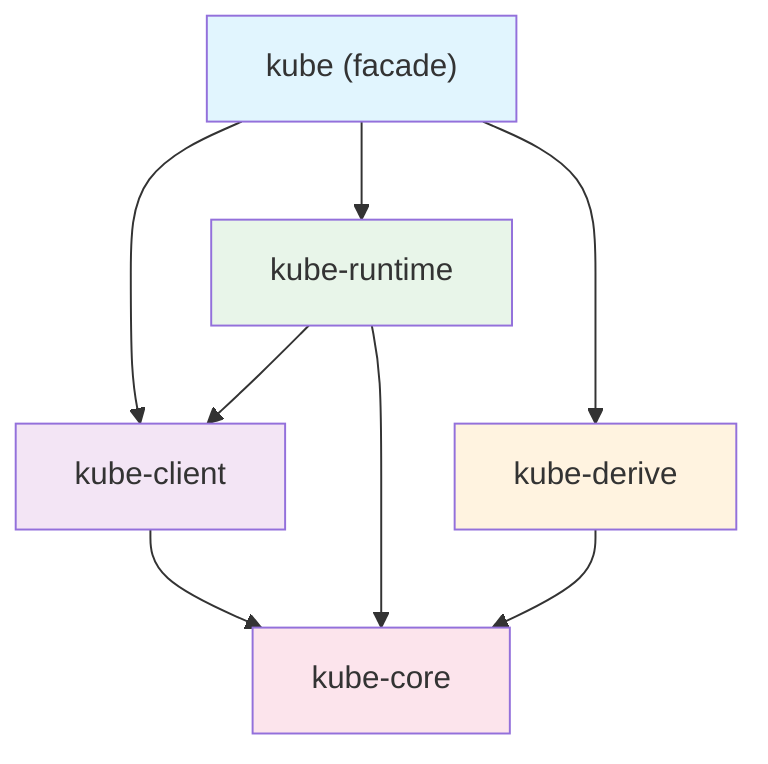

# 크레이트 구조

kube는 단일 크레이트가 아니라 역할별로 분리된 5개 크레이트의 집합입니다. 각 크레이트가 왜 분리되어 있고, 어떤 계층을 이루는지 이해하면 필요한 기능만 골라 쓸 수 있습니다.

## 왜 여러 크레이트인가

<!--
관심사 분리 원칙:
- kube-core는 HTTP 의존성 없음 → 라이브러리에서 타입만 가져다 쓸 수 있음
- kube-client는 네트워크 계층만 담당
- kube-runtime은 operator 추상화만 담당
- 이 분리 덕분에 feature flag로 필요한 것만 활성화 가능
-->

## 계층 다이어그램

## 각 크레이트의 역할

### kube-core — 순수 타입

<!--
- Resource trait, ObjectMeta, TypeMeta, ListMeta
- API 파라미터 (ListParams, PatchParams, Patch 등)
- request builder (HTTP 요청 조립, 전송 없음)
- watch 이벤트 타입 (WatchEvent)
- dynamic 타입 (DynamicObject, ApiResource)
- admission/conversion webhook 타입
- Go의 apimachinery에 대응
- HTTP 의존성 제로 → 라이브러리 크레이트에서 타입만 쓸 때 유용
-->

### kube-client — 네트워크 계층

<!--
- Client: Tower 기반 HTTP 클라이언트
- Api<K>: 타입 안전한 CRUD 핸들
- Config: kubeconfig/in-cluster 설정 로드
- Discovery: 런타임 API 리소스 탐색
- Go의 client-go에 대응
-->

### kube-runtime — Operator 추상화

<!--
- watcher: 자동 재연결 + 에러 복구 watch 스트림
- reflector: watcher + 인메모리 캐시 (Store)
- Controller: reflector + 스케줄링 + 동시성 제어
- finalizer: 삭제 전 정리 작업 헬퍼
- events: Kubernetes Event 발행
- Go의 controller-runtime에 대응
-->

### kube-derive — 코드 생성

<!--
- #[derive(CustomResource)]: CRD struct + Resource impl + CRD YAML 생성
- #[derive(Resource)]: 기존 리소스 타입 래핑
- #[derive(KubeSchema)]: CEL 검증 룰이 포함된 JsonSchema 생성
- Go의 kubebuilder 코드 생성에 대응
-->

### kube — facade

<!--
- feature flag에 따라 위 4개 크레이트를 re-export
- 사용자는 이것만 Cargo.toml에 추가
- cfg_client!, cfg_config! 매크로로 조건부 re-export
-->

## Go 생태계와 대응 관계

| kube-rs | Go | 역할 |
|---------|-----|------|
| kube-core | k8s.io/apimachinery | 타입, 메타데이터, 스키마 |
| kube-client | client-go | HTTP 클라이언트, 인증, 설정 |
| kube-runtime | controller-runtime | 컨트롤러, watcher, 캐시 |
| kube-derive | kubebuilder | 코드 생성, CRD 스캐폴딩 |

## Feature flag 가이드

<!--
기본 활성화: client, rustls-tls, ring
주요 조합:
- API 조회만: kube (기본)
- 컨트롤러: features = ["runtime", "derive"]
- Pod exec: 추가로 "ws"
- 최소 타입만: kube-core 직접 의존

전체 feature flag 테이블:
client, config, runtime, derive, ws, gzip, jsonpatch,
admission, oauth, oidc, rustls-tls, openssl-tls, ring, aws-lc-rs,
socks5, http-proxy, webpki-roots, unstable-runtime, unstable-client
-->

## k8s-openapi의 위치

<!--
- Kubernetes API 타입 정의를 제공하는 별도 크레이트
- Pod, Deployment, Service 등 모든 빌트인 리소스 타입
- version feature flag: latest, v1_30, v1_31 등 (하나만 활성화)
- kube-core가 k8s-openapi의 Resource trait에 대해 blanket impl 제공
  → k8s-openapi 타입이 자동으로 kube의 Resource trait 구현
-->
