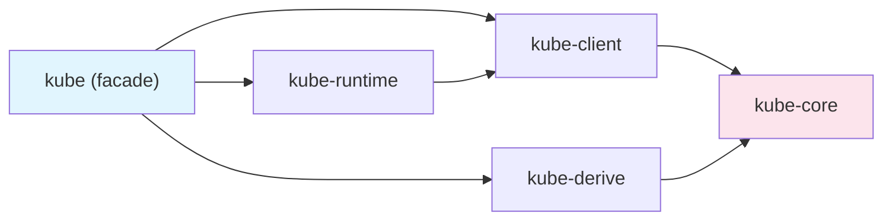

# Architecture

kube가 내부적으로 어떻게 구성되어 있는지를 다룬다. 5개 크레이트의 역할 분담, `Resource` trait 기반 타입 시스템, Tower 미들웨어로 구축된 HTTP 클라이언트, 그리고 하나의 API 호출이 거치는 전체 코드 경로를 추적한다.

## 이 섹션에서 다루는 것

| 문서 | 핵심 질문 |
|------|----------|
| [크레이트 구조](./crate-overview) | 왜 5개로 나뉘었고, 각각 뭘 하는가? |
| [Resource trait과 타입 시스템](./resource-type-system) | 컴파일 타임에 어떤 안전성을 보장하는가? |
| [Client 내부 구조](./client-and-tower-stack) | HTTP 요청이 어떤 미들웨어를 거치는가? |
| [요청의 여정](./request-lifecycle) | `pods.list()` 한 줄이 어떤 코드 경로를 타는가? |

이 섹션을 읽고 나면 kube의 설계 결정이 왜 그렇게 되었는지, 어떤 계층에서 문제를 찾아야 하는지 감이 잡힌다.
