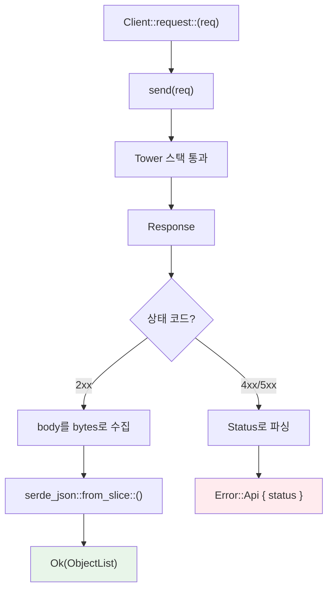

# 요청의 여정

`pods.list()` 한 줄 호출이 내부적으로 어떤 코드를 거쳐 Kubernetes API 서버에 도달하고 응답이 돌아오는지 추적합니다.

## 호출 코드

```rust
let client = Client::try_default().await?;
let pods: Api<Pod> = Api::default_namespaced(client);
let list = pods.list(&ListParams::default()).await?;
```

이 세 줄이 내부에서 거치는 전체 경로를 따라갑니다.

## 전체 흐름

```mermaid
sequenceDiagram
    participant User as 사용자 코드
    participant Api as Api&lt;Pod&gt;
    participant Req as kube-core::Request
    participant Client as Client (Tower)
    participant K8s as API Server

    User->>Api: pods.list(&lp)
    Api->>Req: request.list(&lp)
    Req-->>Api: http::Request&lt;Vec&lt;u8&gt;&gt;
    Api->>Client: client.request::&lt;ObjectList&lt;Pod&gt;&gt;(req)
    Client->>K8s: HTTP GET /api/v1/namespaces/default/pods
    K8s-->>Client: 200 OK + JSON body
    Client-->>Api: ObjectList&lt;Pod&gt;
    Api-->>User: Result&lt;ObjectList&lt;Pod&gt;&gt;
```

## Api&lt;K&gt; 내부

`Api<K>`는 kube-core의 URL 빌더와 Client를 연결하는 얇은 핸들입니다.

```rust title="kube-client/src/api/mod.rs (단순화)"
pub struct Api<K> {
    request: kube_core::Request,   // URL path builder
    client: Client,
    namespace: Option<String>,
    _phantom: std::iter::Empty<K>, // PhantomData 대신 — Send 보장
}
```

`list()` 호출 시 내부 동작:

1. `self.request.list(&lp)` — `http::Request<Vec<u8>>`를 생성합니다.
2. URL이 조립됩니다: `/api/v1/namespaces/{ns}/pods?limit=...&labelSelector=...`
3. 요청에 extension을 추가합니다 (트레이싱용으로 `"list"` 문자열).
4. `self.client.request::<ObjectList<Pod>>(req).await`로 실제 요청을 보냅니다.

## kube-core::Request — URL 빌더

`kube_core::Request`는 URL path를 들고 있는 순수한 빌더입니다.

```rust title="kube-core/src/request.rs (개념)"
pub struct Request {
    url_path: String, // e.g., "/api/v1/namespaces/default/pods"
}

impl Request {
    pub fn list(&self, lp: &ListParams) -> Result<http::Request<Vec<u8>>> {
        let url = format!("{}?{}", self.url_path, lp.as_query_string());
        http::Request::builder()
            .method("GET")
            .uri(url)
            .body(vec![])
    }
}
```

핵심은 **네트워크 전송이 전혀 없다**는 것입니다. `list()`, `get()`, `create()`, `watch()` 등 각 메서드는 적절한 HTTP 메서드와 쿼리 파라미터를 조립한 `http::Request`만 반환합니다. 이 분리 덕분에 kube-core는 네트워크 의존성 없이 테스트할 수 있습니다.

## Client를 통한 요청 실행

`Client::request::<T>(req)` 메서드가 실제 요청을 실행합니다.



1. **`send(req)`**: [Tower 미들웨어 스택](./client-and-tower-stack.md)을 통과해 HTTP 요청을 보냅니다.
2. **에러 처리 (`handle_api_errors`)**: 상태 코드를 확인합니다.
   - 4xx/5xx: 응답 body를 `Status` 구조체로 파싱하고 `Error::Api`를 반환합니다.
   - 2xx: 정상 처리를 계속합니다.
3. **역직렬화**: 응답 body를 bytes로 수집한 뒤 `serde_json::from_slice::<T>()`로 변환합니다.

### 에러 분기

| 에러 종류 | 타입 | 발생 시점 |
|-----------|------|-----------|
| 네트워크 에러 | `Error::HyperError` | TCP 연결 실패, DNS 해석 실패 등 |
| HTTP 에러 | `Error::HttpError` | HTTP 프로토콜 레벨 에러 |
| API 에러 | `Error::Api { status }` | Kubernetes가 반환한 4xx/5xx |
| 역직렬화 에러 | `Error::SerializationError` | JSON 파싱 실패 |

`Error::Api`의 `status` 필드는 Kubernetes API 서버가 보낸 구조화된 에러입니다:

```rust
let err = pods.get("nonexistent").await.unwrap_err();
if let kube::Error::Api(status) = err {
    println!("code: {}", status.code);       // 404
    println!("reason: {}", status.reason);    // "NotFound"
    println!("message: {}", status.message);  // "pods \"nonexistent\" not found"
}
```

## Watch 요청의 특수성

일반 요청은 요청-응답으로 완료되지만, watch 요청은 **끊기지 않는 스트림**을 반환합니다.

```rust
// 일반 요청: 완료되면 끝
let list = pods.list(&lp).await?;

// Watch 요청: 무한 스트림
let mut stream = pods.watch(&WatchParams::default(), "0").await?;
while let Some(event) = stream.try_next().await? {
    // WatchEvent를 하나씩 처리
}
```

### 내부 동작

`Client::request_events::<T>(req)`가 watch 스트림을 처리합니다:

1. `send(req)` → `Response<Body>` (chunked transfer encoding)
2. Body를 `AsyncBufRead`로 변환
3. 줄 단위로 분리 (각 줄이 하나의 JSON 객체)
4. 각 줄을 `WatchEvent<T>`로 역직렬화
5. `TryStream<Item = Result<WatchEvent<T>>>`를 반환

### WatchEvent

API 서버는 네 가지 이벤트를 보냅니다:

```rust
pub enum WatchEvent<K> {
    Added(K),               // 리소스가 생성됨
    Modified(K),            // 리소스가 변경됨
    Deleted(K),             // 리소스가 삭제됨
    Bookmark(Bookmark),     // 진행 마커 (resourceVersion 갱신)
}
```

`Bookmark`은 실제 리소스 변경이 아닙니다. API 서버가 주기적으로 현재 `resourceVersion`을 알려주는 마커입니다. 연결이 끊겼다가 재연결할 때 이 `resourceVersion`부터 watch를 재개할 수 있습니다.

:::tip[raw watch vs watcher()]
`Api::watch()`는 raw watch 스트림입니다. 연결이 끊기면 끝나고, `resourceVersion` 만료 대응도 없습니다. 실전에서는 이 위에 자동 재연결과 에러 복구를 올린 `kube_runtime::watcher()`를 사용합니다.

watcher의 내부 동작은 [Watcher 상태 머신](../runtime-internals/watcher.md)에서 다룹니다.
:::
