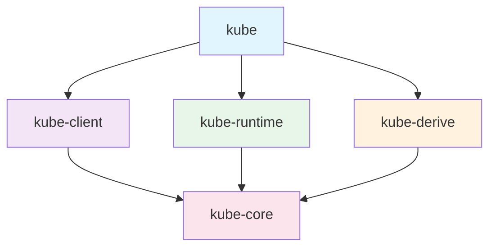
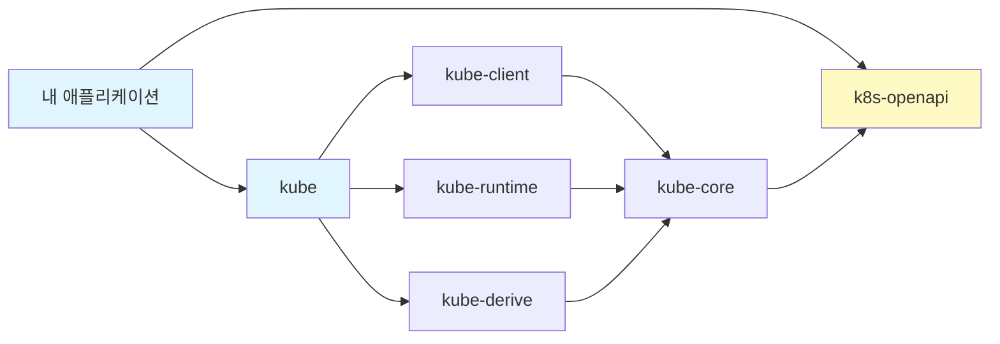

# 프로젝트 구조

kube-rs는 단일 크레이트가 아닌, 역할별로 분리된 5개 크레이트로 구성됩니다. 각 크레이트의 역할을 이해하면 필요한 기능만 선택적으로 사용할 수 있습니다.

## 크레이트 구조



| 크레이트 | 역할 | 직접 사용 여부 |
|----------|------|----------------|
| **kube** | 통합 진입점 (facade) | **주로 이것만 의존성에 추가** |
| kube-core | 핵심 타입, 트레이트 정의 | 라이브러리 개발 시 |
| kube-client | HTTP 클라이언트, API 통신 | `kube`를 통해 사용 |
| kube-runtime | Controller, watcher, reflector | `kube`를 통해 사용 |
| kube-derive | `#[derive(CustomResource)]` 매크로 | `kube`를 통해 사용 |

:::tip
일반적인 애플리케이션 개발에서는 `kube` 크레이트 하나만 `Cargo.toml`에 추가하면 됩니다. Feature flag로 필요한 하위 크레이트 기능을 선택적으로 활성화합니다.
:::

## Feature Flags

`kube` 크레이트의 feature flag로 필요한 기능만 활성화할 수 있습니다.

### 주요 Feature Flags

```toml
[dependencies]
kube = { version = "0.98", features = ["runtime", "derive"] }
```

| Feature | 활성화하는 기능 | 사용 시점 |
|---------|-----------------|-----------|
| `client` | HTTP 클라이언트 (`Client`, `Api`) | **기본 활성화** |
| `runtime` | Controller, watcher, reflector | 컨트롤러 개발 시 |
| `derive` | `#[derive(CustomResource)]` | CRD 정의 시 |
| `ws` | WebSocket (exec, attach, port-forward) | Pod exec 등 |
| `oauth` | OAuth 인증 (GKE 등) | GCP 환경에서 |
| `rustls-tls` | rustls TLS 백엔드 | OpenSSL 대신 사용 시 |
| `openssl-tls` | OpenSSL TLS 백엔드 | 기본 TLS 백엔드 |

### 일반적인 조합

```toml
# API 조회만 하는 간단한 도구
kube = { version = "0.98" }
k8s-openapi = { version = "0.24", features = ["latest"] }

# 컨트롤러 개발 (가장 일반적)
kube = { version = "0.98", features = ["runtime", "derive"] }
k8s-openapi = { version = "0.24", features = ["latest"] }

# Pod exec이 필요한 경우
kube = { version = "0.98", features = ["runtime", "derive", "ws"] }
k8s-openapi = { version = "0.24", features = ["latest"] }
```

## k8s-openapi의 역할

kube-rs는 Kubernetes API 타입 정의를 별도 크레이트인 [k8s-openapi](https://docs.rs/k8s-openapi)에서 가져옵니다.

```rust
// Pod, Deployment 등 Kubernetes 기본 리소스 타입
use k8s_openapi::api::core::v1::Pod;
use k8s_openapi::api::apps::v1::Deployment;
use k8s_openapi::api::batch::v1::Job;
```

### 버전 Feature Flag

`k8s-openapi`의 feature flag로 타겟 Kubernetes 버전을 지정합니다:

```toml
# 최신 지원 버전 (보통 이걸 사용)
k8s-openapi = { version = "0.24", features = ["latest"] }

# 특정 버전 타겟팅
k8s-openapi = { version = "0.24", features = ["v1_30"] }
```

:::warning
`k8s-openapi` feature는 **정확히 하나만** 활성화해야 합니다. 여러 버전을 동시에 활성화하면 컴파일 에러가 발생합니다.
:::

## 의존성 관계 요약



- **내 애플리케이션**은 `kube`와 `k8s-openapi` 두 크레이트만 직접 의존
- `kube`가 나머지 하위 크레이트를 feature flag에 따라 re-export
- `k8s-openapi`는 Kubernetes API 타입 정의를 제공

## 다음 단계

프로젝트 구조를 이해했으니, 다음 섹션에서는 kube-rs의 핵심 개념(watcher, reflector, Controller)을 깊이 있게 살펴봅니다.
