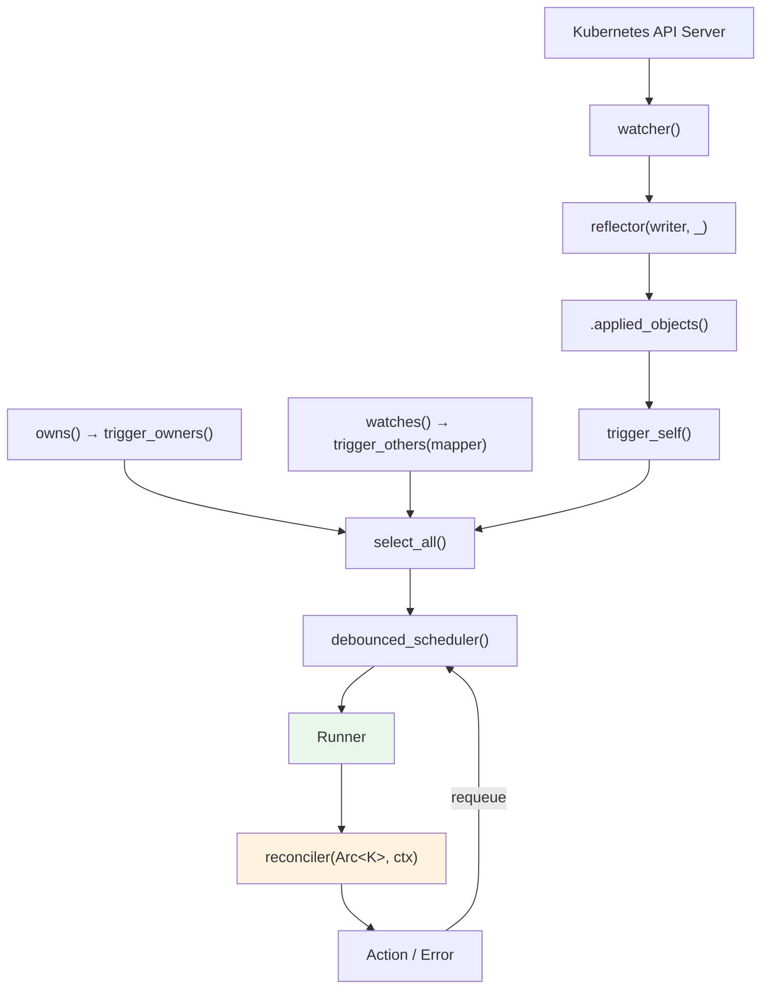

# Controller 파이프라인

Controller는 watcher, reflector, scheduler, runner를 하나로 엮은 최상위 추상화다. `Controller::new()`부터 reconciler 호출까지 데이터가 어떤 경로로 흐르는지 추적한다.

## 전체 데이터 흐름



<!--
각 단계가 하는 일:

1. watcher(): API 서버를 watch → Event<K> 스트림
2. reflector(): Event를 Store에 캐싱하면서 통과
3. .applied_objects(): Event::Apply(K)와 Event::InitApply(K)에서 K만 추출
4. trigger_self(): K → ReconcileRequest<K> (ObjectRef + 이유)
5. owns()/watches(): 관련 리소스 watcher → trigger 스트림 추가
6. select_all(): 모든 trigger 스트림을 하나로 합침
7. debounced_scheduler(): 동일 ObjectRef 중복 제거 + 지연
8. Runner: 동시성 제어, 같은 객체 동시 reconcile 방지
9. reconciler: 사용자 코드 실행
10. Action/Error → scheduler로 피드백 (requeue)
-->

## Controller 구조체

```rust
pub struct Controller<K> {
    trigger_selector: SelectAll<BoxStream<'static, Result<ReconcileRequest<K>, watcher::Error>>>,
    trigger_backoff: Box<dyn Backoff + Send>,
    reader: Store<K>,
    config: Config,
}
```

<!--
- trigger_selector: 모든 trigger 스트림을 SelectAll로 합침
- reader: reflector가 관리하는 Store의 읽기 핸들
- config: debounce duration, concurrency 제한
-->

## Trigger 시스템

### trigger_self — 주 리소스 변경

<!--
주 리소스(Controller::new에 지정한 타입) 변경 시:
watcher Event → applied_objects → trigger_self → ReconcileRequest

ReconcileRequest<K> {
    obj_ref: ObjectRef<K>,
    reason: ReconcileReason,
}

ReconcileReason: ObjectUpdated, RelatedObjectUpdated, BulkReconcile, ErroredReconcile, ReconcileRequested, Custom { ... }
-->

### trigger_owners — 자식 리소스 변경

<!--
controller.owns::<ConfigMap>(api, wc):
1. ConfigMap watcher 생성
2. ConfigMap 변경 시 → ownerReferences 확인
3. 부모(주 리소스)의 ObjectRef 추출
4. 부모에 대한 ReconcileRequest 발행

내부:
- 자식의 metadata.ownerReferences[].uid로 부모 식별
- 부모의 kind/apiVersion이 Controller의 주 리소스와 일치하는 것만
-->

### trigger_others — 관련 리소스 변경

<!--
controller.watches::<Secret>(api, wc, |secret| {
    // Secret에서 관련 주 리소스의 ObjectRef 목록 반환
    vec![ObjectRef::new("my-resource").within("ns")]
}):

1. Secret watcher 생성
2. Secret 변경 시 → 사용자 정의 mapper 함수 호출
3. mapper가 반환한 ObjectRef들에 대해 ReconcileRequest 발행

사용 사례:
- Secret 변경 → 해당 Secret을 참조하는 모든 리소스 재reconcile
- ConfigMap 변경 → 해당 CM을 마운트하는 모든 리소스 재reconcile
-->

## Scheduler — 중복 제거와 지연

<!--
debounced_scheduler() 내부:

1. DelayQueue: 시간 기반 스케줄링 (tokio_util)
2. HashMap<ObjectRef, ScheduledEntry>: 중복 제거
   - 같은 ObjectRef로 여러 trigger → 가장 이른 시간 하나만 유지
3. debounce: 설정된 기간 내 추가 trigger 무시
   → status 업데이트 → watch 이벤트 → 불필요한 재reconcile 방지

예: debounce = 1s일 때
  t=0.0 trigger(A) → 1초 후 실행 예약
  t=0.3 trigger(A) → 이미 예약됨, 무시
  t=1.0 A 실행
  t=1.2 trigger(A) → 다시 1초 후 예약
-->

## Runner — 동시성 제어

<!--
pub struct Runner<T, R, F, MkF, Ready> {
    scheduler: Scheduler,
    slots: FutureHashMap<T, F>,  // 활성 reconcile 추적
    max_concurrent_executions: u16,
    is_ready_to_execute: bool,
}

poll_next 루프:
1. 활성 작업(slots) 완료 여부 확인
2. readiness gate 확인 (Store::wait_until_ready())
3. scheduler에서 다음 항목 가져오기
   → hold_unless(!slots.contains_key(msg))
   → 이미 reconcile 중인 객체는 scheduler에 남겨둠
4. 가져온 항목에 대해 reconciler 실행 (spawn)

핵심: hold_unless
- 같은 객체에 대한 동시 reconcile 방지
- A 객체 reconcile 중 → A에 대한 새 trigger → scheduler에서 대기
- A 완료 후 → scheduler에서 A를 다시 가져와 실행

max_concurrent_executions:
- 0 = 무제한
- N > 0 = 최대 N개 동시 reconcile
-->

## Reconcile 결과 처리

<!--
RescheduleReconciliation:

성공 시:
- Action::requeue(Duration) → scheduler에 해당 시간 후 재실행 예약
- Action::await_change() → 능동적 requeue 없음, 다음 watch 이벤트 대기

실패 시:
- error_policy(Arc<K>, &Error, Arc<Context>) → Action
- error_policy가 반환한 Action에 따라 scheduler에 예약
- 보통: Action::requeue(Duration::from_secs(5)) 등

piping: reconciler 결과 → Action → scheduler_tx → scheduler → 다시 Runner
→ 자기 완결적 루프
-->

## Config

<!--
Controller::Config {
    debounce: Duration,  // 기본: 0 (debounce 없음)
    concurrency: u16,    // 기본: 0 (무제한)
}

controller.with_config(Config::default().debounce(Duration::from_secs(1)).concurrency(10))
-->

## Shutdown

<!--
graceful_shutdown_on(future):
- future가 완료되면 새 reconcile 시작 중단
- 진행 중인 reconcile은 완료 대기

shutdown_on_signal():
- SIGTERM/SIGINT에 반응
- 내부적으로 tokio::signal 사용
-->
