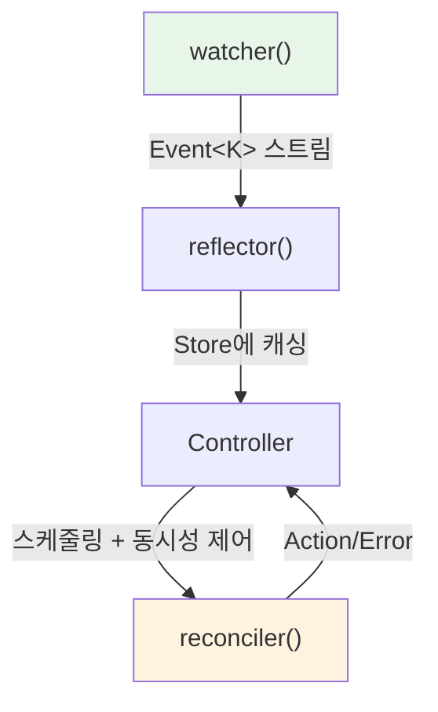

# Runtime Internals

`kube-runtime`이 내부에서 어떤 일을 하는지를 다룬다. watcher의 상태 머신, reflector의 atomic swap 캐싱, Controller의 trigger-scheduler-runner 파이프라인, 그리고 derive 매크로가 생성하는 코드까지.

## 이 섹션에서 다루는 것

| 문서 | 핵심 질문 |
|------|----------|
| [Watcher](./watcher) | 상태 머신은 어떻게 동작하고, 에러 시 어떻게 복구하는가? |
| [Reflector와 Store](./reflector-and-store) | 인메모리 캐시는 어떻게 일관성을 유지하는가? |
| [Controller 파이프라인](./controller-pipeline) | trigger에서 reconciler까지 데이터가 어떤 경로로 흐르는가? |
| [CRD와 derive 매크로](./custom-resources) | `#[derive(CustomResource)]`가 실제로 무슨 코드를 만드는가? |

[Architecture](../architecture/crate-overview) 섹션에서 kube의 정적 구조를 이해했다면, 이 섹션에서는 런타임에 실제로 벌어지는 일을 따라간다.
