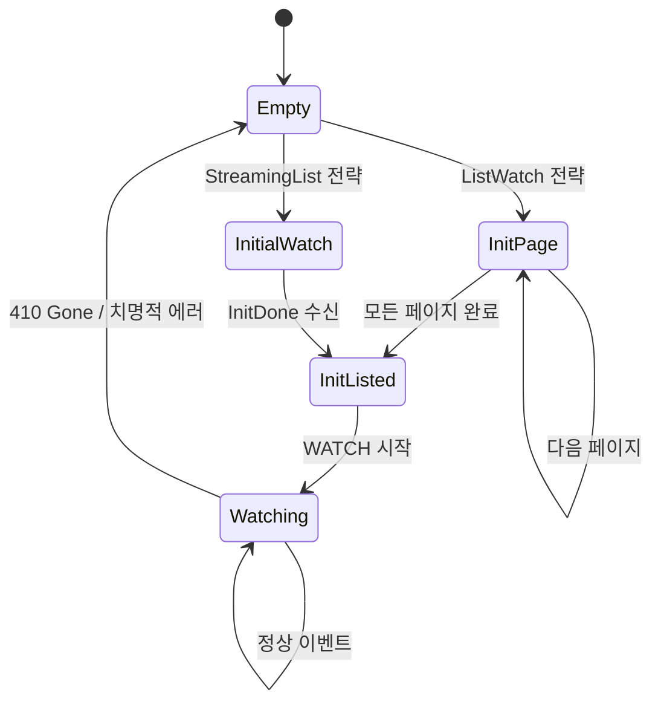

# Watcher

`Api::watch()`는 연결이 끊기면 그대로 종료되고, resourceVersion 만료에도 대응하지 않습니다. `watcher()`는 이 위에 **상태 머신**을 올려서 자동 재연결, 초기 목록 로드, 에러 복구를 제공하는 Stream입니다.

## watcher의 역할

<!--
Api::watch()의 한계:
- 연결 끊기면 스트림 종료 → 수동으로 재시작해야
- resourceVersion 만료(410 Gone) 대응 없음
- 초기 목록 로드 없음 (watch는 "지금부터"만 봄)

watcher()가 제공하는 것:
- 자동 재연결
- 초기 LIST + 이후 WATCH 패턴
- 410 Gone 시 자동 re-list
- Event 추상화 (Init/InitApply/InitDone/Apply/Delete)
-->

## 상태 머신



<!--
각 상태에서 하는 일:

Empty:
  → 초기 상태 또는 에러 후 리셋
  → 설정된 전략에 따라 InitPage 또는 InitialWatch로

InitPage (ListWatch):
  → paginated LIST 호출 (page_size=500, client-go와 동일)
  → 각 페이지에서 Event::InitApply(obj) 발행
  → continue_token으로 다음 페이지
  → 마지막 페이지에서 Event::InitDone + InitListed로

InitialWatch (StreamingList, K8s 1.27+):
  → WATCH + sendInitialEvents=true
  → 서버가 기존 객체를 Added로 보내고, BOOKMARK으로 완료 신호
  → Event::InitApply → Event::InitDone → InitListed로

InitListed:
  → 마지막 알려진 resourceVersion으로 WATCH 시작
  → Watching으로

Watching:
  → Added/Modified → Event::Apply(obj)
  → Deleted → Event::Delete(obj)
  → Bookmark → resourceVersion 갱신 (이벤트 없음)
  → 410 Gone → Empty로 리셋 (전체 re-list)
  → 연결 끊김 → Empty로 리셋
-->

## 두 가지 초기 목록 전략

### ListWatch (기본)

<!--
1. LIST 호출 (page_size=500)
2. 모든 페이지 소진
3. 마지막 resourceVersion으로 WATCH

장점: 모든 Kubernetes 버전 지원
단점: 초기 LIST 시 메모리 사용 높음 (전체 객체 + JSON + 역직렬화)
-->

### StreamingList (K8s 1.27+)

<!--
1. WATCH + sendInitialEvents=true + resourceVersionMatch=NotOlderThan
2. 서버가 기존 객체를 하나씩 Added로 전송
3. BOOKMARK으로 초기 목록 완료 신호

장점: LIST보다 메모리 효율적 (한 번에 하나씩 처리)
단점: Kubernetes 1.27+ 필요 (WatchList feature gate)

선택:
watcher::Config::default().streaming_lists()
-->

## Event 추상화

```rust
pub enum Event<K> {
    Init,          // re-list 시작
    InitApply(K),  // 초기 목록의 각 객체
    InitDone,      // 초기 목록 완료
    Apply(K),      // watch 중 Added/Modified
    Delete(K),     // watch 중 Deleted
}
```

<!--
vs Kubernetes의 WatchEvent:
- WatchEvent::Added → 초기면 InitApply, 아니면 Apply
- WatchEvent::Modified → Apply
- WatchEvent::Deleted → Delete
- WatchEvent::Bookmark → 내부 처리 (resourceVersion 갱신)

Init/InitApply/InitDone이 왜 필요한가:
→ reflector의 atomic swap을 위해
→ Init: 새 buffer 시작
→ InitApply: buffer에 적재
→ InitDone: buffer ↔ store 스왑
→ 다음 페이지(reflector-and-store.md)에서 상세 설명
-->

## 에러 복구와 backoff

<!--
모든 watcher 에러는 재시도 가능으로 간주

.default_backoff():
- ExponentialBackoff { initial: 1s, max: 60s, factor: 2 }
- 성공적인 이벤트 수신 시 backoff 리셋

⚠️ backoff 없이 쓰면:
- 첫 에러에 스트림 종료
- 컨트롤러 전체가 멈춤
- 실제 프로덕션 사고 사례: Vector 프로젝트에서 backoff 없이 운영
  → API 서버 일시 장애 시 tight-loop 재시도 → CPU/메모리 폭주

410 Gone 처리:
- Kubernetes가 resourceVersion 히스토리를 ~5분만 유지
- 그 이상 지연되면 410 Gone 응답
- watcher가 Empty 상태로 복귀 → 전체 re-list
- bookmarks 활성화하면 resourceVersion이 주기적으로 갱신되어 410 빈도 감소
-->

## watcher::Config

<!--
let wc = watcher::Config::default()
    .labels("app=myapp")           // label selector
    .fields("status.phase=Running") // field selector
    .timeout(300)                   // watch timeout (서버 측)
    .page_size(100)                 // ListWatch 페이지 크기
    .streaming_lists()              // StreamingList 전략 사용
    .any()                          // ListSemantic::Any (빠르지만 stale 가능)
    .bookmarks(true);               // bookmark 이벤트 활성화

ListSemantic:
- MostRecent (기본): 가장 최신 데이터 보장
- Any: 캐시된 데이터 허용 → 더 빠르지만 약간 stale할 수 있음
-->

## ⚠️ 알아야 할 것들

<!--
1. watch 이벤트는 전달 보장 안 됨
   - 네트워크 단절 시 DELETE 이벤트 유실 가능
   - re-list로 최종 상태는 복구되지만, 중간 이벤트는 영구 손실
   - 삭제 감지가 중요하면 → finalizer 사용

2. re-list 시 메모리 스파이크
   - 대규모 클러스터에서 전체 객체를 다시 로드
   - old state + JSON buffer + deserialized objects → 일시적 3배 메모리
   - StreamingList로 완화 가능

3. bookmarks 없으면 resourceVersion 만료가 빨라짐
   - 조용한 리소스(변경 적음)에서 특히 문제
   - bookmarks이 주기적으로 resourceVersion을 갱신해 410 방지
-->
