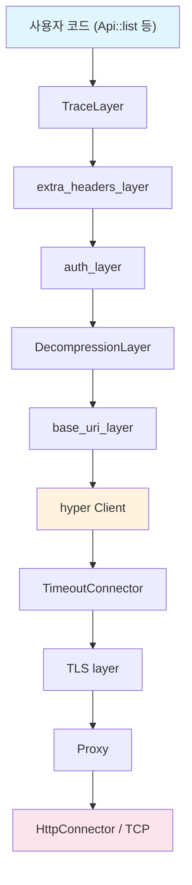
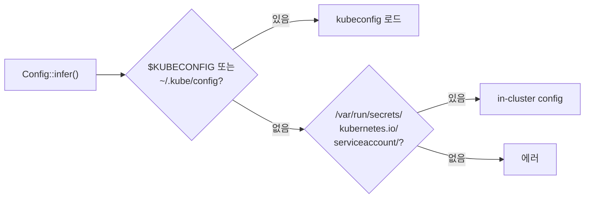

# Client 내부 구조

`Client`는 단순한 HTTP 클라이언트가 아닙니다. Tower 미들웨어 스택으로 구성된 레이어 아키텍처이며, Clone이 `Arc` 수준으로 가볍습니다. 내부 구조를 이해하면 타임아웃, 인증, 커스텀 미들웨어 같은 문제를 해결할 수 있습니다.

## Client의 실체

```rust title="kube-client/src/client/mod.rs (단순화)"
pub struct Client {
    inner: Buffer<Request<Body>, BoxFuture<'static, Result<Response<Body>, BoxError>>>,
    default_ns: String,
    valid_until: Option<Timestamp>,
}
```

- **`tower::Buffer`**: `Service`를 `Arc`로 감쌉니다. `Client::clone()`은 참조 카운트 증가에 불과하므로, 여러 `Api<K>` 핸들에서 같은 Client를 자유롭게 공유할 수 있습니다.
- **capacity 1024**: `Buffer`의 in-flight 요청 용량입니다. 동시에 1024개까지 요청을 큐에 넣을 수 있습니다.
- **`BoxFuture`**: 응답 future의 구체 타입이 지워져 있어서 내부 미들웨어 스택의 구체 타입이 외부에 노출되지 않습니다.
- **`valid_until`**: credential 만료 시간입니다. 만료 후 Client를 재생성해야 합니다.

## Tower 미들웨어 스택

요청은 위에서 아래로, 응답은 아래에서 위로 흐릅니다. 각 레이어는 `tower::Layer` trait을 구현합니다.



| 레이어 | 역할 |
|--------|------|
| **TraceLayer** | OpenTelemetry 호환 HTTP 스팬을 생성합니다. 요청/응답의 트레이싱 정보를 기록합니다. |
| **extra_headers_layer** | impersonation 등 커스텀 헤더를 추가합니다. |
| **auth_layer** | Bearer 토큰, exec 기반 인증, 토큰 자동 갱신을 처리합니다. |
| **DecompressionLayer** | gzip 응답을 해제합니다 (`gzip` feature 필요). |
| **base_uri_layer** | 모든 요청 URL에 `cluster_url` prefix를 추가합니다. |
| **hyper Client** | HTTP/1.1 + HTTP/2로 실제 전송합니다. |
| **TimeoutConnector** | connect/read/write 각각의 타임아웃을 적용합니다. |
| **TLS layer** | `rustls-tls` 또는 `openssl-tls` feature에 따라 TLS를 처리합니다. |
| **Proxy** | SOCKS5/HTTP 프록시를 통과합니다 (`socks5`/`http-proxy` feature). |
| **HttpConnector** | TCP 연결을 생성합니다. |

## Config 추론 체인

`Client::try_default()`는 내부적으로 `Config::infer()`를 호출합니다. 다음 순서로 설정을 탐색합니다.



1. **kubeconfig**: `$KUBECONFIG` 환경변수가 가리키는 파일, 또는 `~/.kube/config`
2. **in-cluster**: `/var/run/secrets/kubernetes.io/serviceaccount/`의 토큰과 CA 인증서
3. 둘 다 없으면 에러를 반환합니다.

### 기본 타임아웃

| 설정 | 기본값 | 용도 |
|------|--------|------|
| `connect_timeout` | 30초 | TCP 연결 수립 |
| `read_timeout` | 295초 | 응답 대기 |
| `write_timeout` | 295초 | 요청 전송 |

:::warning[295초 타임아웃 함정]
`read_timeout`이 295초인 이유는 watch long-polling을 지원하기 위해서입니다. 하지만 이 타임아웃은 일반 GET/PUT/PATCH 요청에도 동일하게 적용됩니다.

네트워크 장애 시 단순한 `pods.get("name")`도 5분 가까이 블로킹될 수 있습니다.

**대응 방법:**

```rust
// 방법 1: 개별 호출에 tokio timeout 적용
let pod = tokio::time::timeout(
    Duration::from_secs(10),
    pods.get("my-pod")
).await??;

// 방법 2: 용도별 Client 분리
let short_cfg = Config::infer().await?;
let short_cfg = Config {
    read_timeout: Some(Duration::from_secs(30)),
    ..short_cfg
};
let api_client = Client::try_from(short_cfg)?;
// watcher용은 기본 295초 Client 사용
```
:::

## 인증 처리

auth_layer가 모든 인증을 담당합니다.

| 방식 | 동작 |
|------|------|
| **정적 토큰** | `Authorization: Bearer <token>` 헤더를 추가합니다. |
| **클라이언트 인증서** | TLS 레이어에서 mTLS로 인증합니다. |
| **exec plugin** | 외부 프로그램을 호출해 토큰을 얻습니다 (AWS EKS의 `aws-iam-authenticator` 등). |
| **토큰 갱신** | 토큰 만료 전 자동으로 refresh합니다. |

:::warning[장시간 실행 시 credential rotation]
watcher가 장시간 실행되는 동안 credential이 rotate되고 연결이 끊기면, 재연결 시 stale credential을 사용해 영구적으로 실패할 수 있습니다.

대응: Client를 재생성하거나, exec plugin 기반 인증을 사용하면 매번 새 토큰을 발급받을 수 있습니다.
:::

## Client 커스텀

`ClientBuilder`를 사용하면 미들웨어 스택을 커스텀할 수 있습니다.

```rust
use kube::client::ClientBuilder;

let config = Config::infer().await?;
let client = ClientBuilder::try_from(config)?
    // 커스텀 Tower 레이어 추가 가능
    .build();
```

### 용도별 Client 분리 패턴

watcher용(긴 timeout)과 API 호출용(짧은 timeout)을 분리하는 것이 실전에서 흔한 패턴입니다.

```rust
// watcher용 Client — 기본 295초 타임아웃
let watcher_client = Client::try_default().await?;

// API 호출용 Client — 짧은 타임아웃
let mut api_config = Config::infer().await?;
api_config.read_timeout = Some(Duration::from_secs(30));
api_config.write_timeout = Some(Duration::from_secs(30));
let api_client = Client::try_from(api_config)?;

// reconciler에서는 api_client 사용
struct Context {
    api_client: Client,
}
```

이렇게 분리하면 watcher는 long-polling을 유지하면서도, reconciler 내부의 API 호출은 빠르게 타임아웃됩니다.
