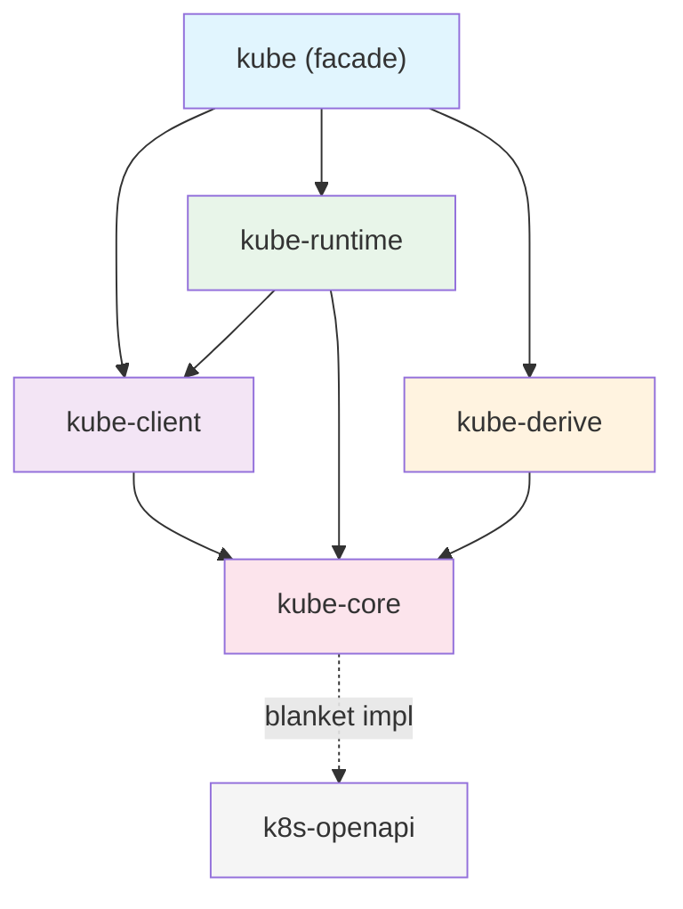

# 크레이트 구조

kube는 단일 크레이트가 아니라 역할별로 분리된 5개 크레이트의 집합입니다. 각 크레이트가 왜 분리되어 있고, 어떤 계층을 이루는지 살펴봅니다.

## 왜 여러 크레이트인가

kube의 크레이트 분리는 **최소 의존성 원칙**을 따릅니다.

- **kube-core**는 HTTP 의존성이 없습니다. 라이브러리 크레이트에서 Kubernetes 타입만 가져다 쓸 수 있습니다.
- **kube-client**는 네트워크 계층만 담당합니다. Tower 미들웨어 기반의 HTTP 클라이언트와 `Api<K>` 핸들을 제공합니다.
- **kube-runtime**은 operator 추상화만 담당합니다. watcher, reflector, Controller를 조합해 컨트롤러 루프를 구성합니다.
- **kube-derive**는 proc-macro 크레이트입니다. `#[derive(CustomResource)]` 등 코드 생성을 담당합니다.

이 분리 덕분에 feature flag로 필요한 것만 활성화할 수 있고, 컴파일 시간과 바이너리 크기를 줄일 수 있습니다.

## 계층 다이어그램



핵심은 **kube-core가 바닥**에 있다는 것입니다. HTTP 의존성 없이 타입과 trait만 정의하고, 나머지 크레이트가 이 위에 쌓입니다.

## 각 크레이트의 역할

### kube-core — 순수 타입

HTTP 의존성 없이 Kubernetes API와 상호작용하는 데 필요한 타입과 trait을 정의합니다. Go의 `k8s.io/apimachinery`에 대응합니다.

주요 모듈:

| 모듈 | 역할 | 핵심 타입 |
|------|------|-----------|
| `resource` | 리소스 추상화 | `Resource` trait, `ResourceExt` |
| `metadata` | 메타데이터 | `ObjectMeta`, `TypeMeta`, `ListMeta` |
| `object` | 객체 래퍼 | `Object<P, U>`, `ObjectList<K>` |
| `params` | API 파라미터 | `ListParams`, `PatchParams`, `Patch` enum |
| `dynamic` | 동적 타입 | `DynamicObject`, `ApiResource` |
| `gvk` | 타입 정보 | `GroupVersionKind`, `GroupVersionResource` |
| `request` | 요청 조립 | `Request` (URL path + query 생성, 전송 없음) |
| `response` | 응답 타입 | `Status`, `WatchEvent` |
| `labels` | 레이블 셀렉터 | `Selector`, `Expression` |
| `crd` | CRD 확장 | `CustomResourceExt` |
| `error_boundary` | deserialization 보호 | `DeserializeGuard` |

`request` 모듈이 핵심입니다. HTTP 요청의 URL path와 query parameter를 조립하지만, 실제로 요청을 보내지는 않습니다. 이 분리 덕분에 kube-core는 네트워크 의존성 없이 순수한 타입 크레이트로 유지됩니다.

### kube-client — 네트워크 계층

실제 Kubernetes API 서버와 통신하는 HTTP 클라이언트를 제공합니다. Go의 `client-go`에 대응합니다.

주요 구성:

- **`Client`**: [Tower](https://github.com/tower-rs/tower) 기반 HTTP 클라이언트입니다. `Buffer<BoxService<...>>`로 type-erased되어 있어 Clone이 가볍습니다. 내부 구조는 [Client 내부 구조](./client-and-tower-stack.md)에서 다룹니다.
- **`Api<K>`**: 타입 안전한 CRUD 핸들입니다. `get()`, `list()`, `patch()`, `delete()` 등 Kubernetes API 작업을 제공합니다. `K: Resource` 바운드로 컴파일 타임에 리소스 타입을 검증합니다.
- **`Config`**: kubeconfig 파일 또는 in-cluster 환경에서 설정을 로드합니다.
- **`Discovery`**: 런타임에 API 서버가 지원하는 리소스를 조회합니다.

`Api<K>`의 생성자는 리소스의 스코프에 따라 컴파일 타임 검증을 제공합니다:

```rust
// Namespace 스코프 리소스
let pods: Api<Pod> = Api::namespaced(client.clone(), "default");

// Cluster 스코프 리소스
let nodes: Api<Node> = Api::all(client.clone());

// Namespace를 Api::namespaced()로 만들면 컴파일 에러
// let ns: Api<Namespace> = Api::namespaced(client, "default"); // ← 컴파일 안 됨
```

### kube-runtime — Operator 추상화

컨트롤러 패턴을 구현하는 데 필요한 빌딩 블록을 제공합니다. Go의 `controller-runtime`에 대응합니다.

| 모듈 | 역할 |
|------|------|
| `watcher` | 자동 재연결 + 에러 복구가 포함된 watch 스트림 |
| `reflector` | watcher 스트림을 가로채 인메모리 캐시(Store)에 기록 |
| `controller` | reflector + 스케줄링 + concurrency 제어를 조합한 컨트롤러 루프 |
| `finalizer` | 삭제 전 cleanup 헬퍼 |
| `scheduler` | 스트림 항목의 지연 + 중복 제거 |
| `events` | Kubernetes Event 리소스 발행 |
| `wait` | 조건 대기 (`await_condition`) |
| `utils` | `WatchStreamExt`, `predicates` 등 스트림 유틸리티 |

이 모듈들이 어떻게 조합되는지는 [Runtime Internals](../runtime-internals/index.md) 섹션에서 자세히 다룹니다.

### kube-derive — 코드 생성

proc-macro 크레이트로, 세 가지 derive 매크로를 제공합니다.

| 매크로 | 생성 결과 |
|--------|-----------|
| `CustomResource` | CRD 루트 struct + `Resource` impl + `CustomResourceExt` impl |
| `Resource` | 기존 타입에 대한 `Resource` trait impl |
| `KubeSchema` | CEL 검증 룰이 포함된 `JsonSchema` impl |

`#[derive(CustomResource)]`가 생성하는 코드의 세부 내용은 [CRD와 derive 매크로](../runtime-internals/custom-resources.md)에서 다룹니다.

### kube — facade

사용자가 `Cargo.toml`에 추가하는 유일한 크레이트입니다. feature flag에 따라 위 4개 크레이트를 re-export합니다.

```rust
// feature = "client" (기본 활성화)
pub use kube_client::{api, client, discovery};

// feature = "config" (기본 활성화)
pub use kube_client::config;

// feature = "derive"
pub use kube_derive::{CustomResource, Resource, KubeSchema};

// feature = "runtime"
pub use kube_runtime as runtime;

// 항상 사용 가능
pub use kube_core as core;
```

## Go 생태계와 대응 관계

| kube-rs | Go | 역할 |
|---------|-----|------|
| kube-core | `k8s.io/apimachinery` | 타입, 메타데이터, API 파라미터 |
| kube-client | `client-go` | HTTP 클라이언트, 인증, 설정 |
| kube-runtime | `controller-runtime` | 컨트롤러, watcher, 캐시 |
| kube-derive | kubebuilder (코드 생성) | CRD struct 생성, 스캐폴딩 |

Go에서 `controller-runtime`을 쓰면 내부적으로 `client-go`와 `apimachinery`가 따라오는 것처럼, kube에서도 `runtime` feature를 켜면 kube-runtime이 kube-client와 kube-core를 함께 가져옵니다.

## Feature flag 가이드

kube의 기본 feature는 `client`, `rustls-tls`, `ring`입니다. 용도에 따라 필요한 feature를 조합합니다.

### 용도별 조합

```toml title="API 조회만 (기본)"
[dependencies]
kube = "3.0.1"
```

```toml title="컨트롤러 개발"
[dependencies]
kube = { version = "3.0.1", features = ["runtime", "derive"] }
```

```toml title="Pod exec/attach/portforward"
[dependencies]
kube = { version = "3.0.1", features = ["runtime", "derive", "ws"] }
```

```toml title="타입만 사용 (HTTP 의존성 없음)"
[dependencies]
kube-core = "3.0.1"
```

### 전체 feature 목록

| Feature | 기본 | 설명 |
|---------|------|------|
| `client` | ✓ | `Client`, `Api<K>` |
| `config` | ✓ | `Config` (kubeconfig / in-cluster) |
| `rustls-tls` | ✓ | Rustls TLS 백엔드 |
| `ring` | ✓ | Rustls 암호화 provider |
| `openssl-tls` | | OpenSSL TLS 백엔드 (`rustls-tls`와 동시 사용 불가) |
| `aws-lc-rs` | | AWS Libcrypto provider (Rustls와 함께) |
| `webpki-roots` | | WebPKI 인증서 루트 (시스템 인증서 대신) |
| `derive` | | `CustomResource`, `Resource`, `KubeSchema` 매크로 |
| `runtime` | | watcher, reflector, Controller |
| `ws` | | WebSocket (exec, attach, portforward) |
| `gzip` | | 응답 gzip 압축 해제 |
| `jsonpatch` | | `Patch::Json` 지원 |
| `oauth` | | OAuth 인증 |
| `oidc` | | OIDC 인증 |
| `socks5` | | SOCKS5 프록시 |
| `http-proxy` | | HTTP 프록시 |
| `admission` | | Admission webhook 타입 |
| `kubelet-debug` | | kubelet 디버그 인터페이스 |
| `unstable-runtime` | | 실험적 runtime 기능 |
| `unstable-client` | | 실험적 client 기능 |

## k8s-openapi의 위치

kube 자체는 `Pod`, `Deployment`, `Service` 같은 Kubernetes 빌트인 타입을 정의하지 않습니다. 이 타입들은 별도 크레이트인 [k8s-openapi](https://docs.rs/k8s-openapi)가 제공합니다.

kube-core는 k8s-openapi 타입에 대해 **blanket impl**을 제공합니다:

```rust title="kube-core의 blanket impl (단순화)"
impl<K, S> Resource for K
where
    K: k8s_openapi::Metadata<Ty = ObjectMeta>,
    K: k8s_openapi::Resource<Scope = S>,
{
    type DynamicType = ();
    type Scope = S;
    // kind(), group(), version() 등은 K::KIND, K::GROUP, K::VERSION에서 가져옴
}
```

이 blanket impl 덕분에 k8s-openapi의 모든 타입(`Pod`, `Service`, `Deployment` 등)이 자동으로 kube의 `Resource` trait을 구현합니다. 사용자가 별도로 impl을 작성할 필요가 없습니다.

```toml title="Cargo.toml"
[dependencies]
kube = { version = "3.0.1", features = ["runtime", "derive"] }
k8s-openapi = { version = "0.27.0", features = ["latest", "schemars"] }
```

k8s-openapi의 `latest` feature는 kube 버전에 맞는 Kubernetes API 버전을 활성화합니다. `schemars` feature는 CRD 스키마 생성에 필요합니다.

:::warning[version feature는 하나만]
k8s-openapi의 version feature (`latest`, `v1_32` 등)는 **하나만** 활성화해야 합니다. 여러 개를 동시에 켜면 컴파일 에러가 발생합니다.
:::
