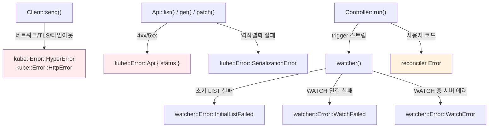

# 에러 처리와 Backoff

kube에서 에러는 여러 계층에서 발생합니다. 어디서 어떤 에러가 나오고, 각 계층에서 어떻게 처리해야 하는지 정리합니다.

## 에러 발생 지점 맵



| 계층 | 에러 타입 | 원인 |
|------|----------|------|
| Client | `HyperError`, `HttpError` | 네트워크, TLS, 타임아웃 |
| Api | `Error::Api { status }` | Kubernetes 4xx/5xx 응답 |
| Api | `SerializationError` | JSON deserialization 실패 |
| watcher | `InitialListFailed` | 초기 LIST 실패 |
| watcher | `WatchFailed` | WATCH 연결 실패 |
| watcher | `WatchError` | WATCH 중 서버 에러 (410 Gone 등) |
| Controller | reconciler Error | 사용자 코드에서 발생 |

## Watcher 에러와 backoff

:::warning[반드시 backoff을 붙여야 합니다]
```rust
// ✗ 첫 에러에 스트림 종료 → Controller 멈춤
let stream = watcher(api, wc);

// ✓ 지수 백오프로 자동 재시도
let stream = watcher(api, wc).default_backoff();
```
:::

### default_backoff

`ExponentialBackoff`를 적용합니다: 800ms → 1.6초 → 3.2초 → ... → 30초(최대). 성공적인 이벤트를 수신하면 backoff가 리셋됩니다. 120초 동안 에러가 없으면 타이머도 리셋됩니다.

### 커스텀 backoff

```rust
use backon::ExponentialBuilder;

let stream = watcher(api, wc).backoff(
    ExponentialBuilder::default()
        .with_min_delay(Duration::from_millis(500))
        .with_max_delay(Duration::from_secs(30)),
);
```

## Reconciler 에러와 error_policy

```rust
fn error_policy(obj: Arc<MyResource>, err: &Error, ctx: Arc<Context>) -> Action {
    tracing::error!(?err, "reconcile failed");

    match err {
        // 일시적 에러: 재시도
        Error::KubeApi(_) => Action::requeue(Duration::from_secs(5)),
        // 영구적 에러: 재시도하지 않음
        Error::MissingField(_) => Action::await_change(),
    }
}
```

`Controller::run(reconcile, error_policy, ctx)`:
- reconciler가 `Err`를 반환하면 `error_policy`가 호출됩니다
- `error_policy`가 반환한 `Action`에 따라 scheduler에 예약합니다

### 현재 한계

- `error_policy`는 **동기 함수**입니다. async 작업(메트릭 전송, status 업데이트 등)을 할 수 없습니다
- 성공 시 reset 콜백이 없습니다. per-key backoff를 구현하려면 reconciler를 wrapper로 감싸야 합니다 ([Per-key backoff 패턴](./reconciler.md#per-key-backoff-패턴) 참고)

## Client 레벨 재시도

kube-client에는 일반 API 호출에 대한 내장 재시도가 없습니다. `create()`, `patch()`, `get()` 등이 실패하면 그대로 에러를 반환합니다.

직접 구현하려면 Tower의 retry 미들웨어를 사용합니다:

```rust
use tower::retry::Policy;

struct RetryPolicy;

impl Policy<Request<Body>, Response<Body>, Error> for RetryPolicy {
    // 5xx, 타임아웃, 네트워크 에러만 재시도
    // 4xx는 재시도하지 않음 (요청 자체가 잘못됨)
}
```

### 재시도 가능 여부

| 에러 | 재시도 | 이유 |
|------|--------|------|
| 5xx | 가능 | 서버 일시 장애 |
| 타임아웃 | 가능 | 일시적 네트워크 문제 |
| 429 Too Many Requests | 가능 | rate limit → 대기 후 재시도 |
| 네트워크 에러 | 가능 | 일시적 연결 실패 |
| 4xx (400, 403, 404 등) | 불가 | 요청이 잘못됨 |
| 409 Conflict | 불가 | SSA 충돌 → 로직 수정 필요 |

## 타임아웃 전략

[Client 내부 구조](../architecture/client-and-tower-stack.md)에서 다룬 것처럼, 기본 `read_timeout`이 watch용으로 295초 설정되어 있어 일반 API 호출도 5분 블로킹될 수 있습니다.

### 대응 1: Client 분리

```rust
// watcher용 Client (기본 295초)
let watcher_client = Client::try_default().await?;

// API 호출용 Client (짧은 타임아웃)
let mut config = Config::infer().await?;
config.read_timeout = Some(Duration::from_secs(15));
let api_client = Client::try_from(config)?;
```

### 대응 2: 개별 호출 감싸기

```rust
let pod = tokio::time::timeout(
    Duration::from_secs(10),
    api.get("my-pod"),
).await??;
```

### 대응 3: Controller에서는 큰 문제가 아닙니다

Controller가 관리하는 watcher는 긴 timeout이 필요합니다. reconciler 내부의 API 호출만 timeout으로 감싸면 됩니다.
