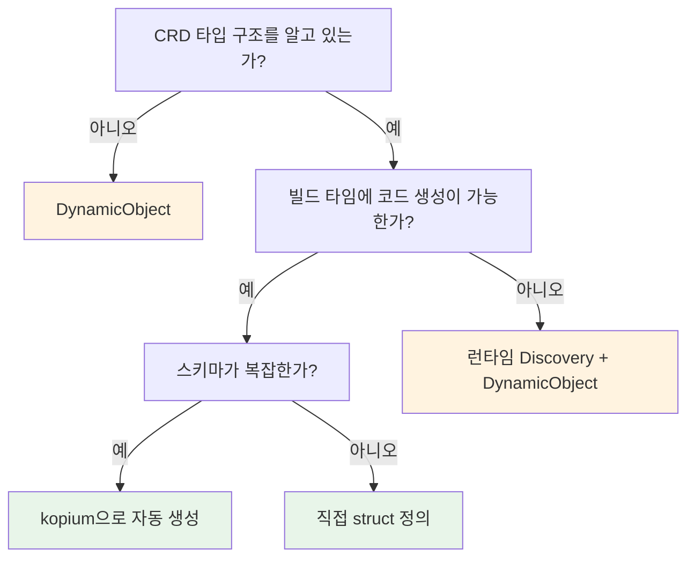

# 서드파티 CRD

Istio VirtualService, Cert-Manager Certificate 같이 직접 만들지 않은 CRD를 kube에서 다루는 방법은 여러 가지입니다. 각 방법의 트레이드오프를 이해하고 상황에 맞게 선택합니다.

## 어떤 방법을 선택해야 하는가?



아래 각 방법의 상세 설명과 [비교 정리](#비교-정리)를 참고합니다.

:::warning[흔한 혼동]
`#[derive(CustomResource)]`는 CRD를 **정의**하는 용도입니다 (CRD YAML 생성, Kubernetes에 새 리소스 타입 등록).

이미 존재하는 CRD를 **소비**할 때는 아래 방법들을 사용합니다.

"Istio VirtualService를 읽고 싶다" ≠ "새 CRD를 만들고 싶다"
:::

## 방법 1: DynamicObject

타입 정의 없이 가장 빠르게 시작하는 방법입니다.

```rust
use kube::core::{DynamicObject, ApiResource, GroupVersionKind};

let gvk = GroupVersionKind::gvk("networking.istio.io", "v1", "VirtualService");
let ar = ApiResource::from_gvk(&gvk);
let api = Api::<DynamicObject>::namespaced_with(client, "default", &ar);

let vs = api.get("my-virtualservice").await?;
let hosts = vs.data["spec"]["hosts"].as_array();
```

| 장점 | 단점 |
|------|------|
| 타입 정의 불필요 | 필드 접근이 `serde_json::Value` |
| 코드 0줄로 시작 | IDE 자동완성 없음 |
| 스키마 변경에 영향 없음 | 런타임 에러 위험 |

프로토타이핑이나 필드 몇 개만 읽을 때 적합합니다.

## 방법 2: 직접 struct 정의

타입 안전하게 사용하려면 spec/status struct를 직접 정의합니다.

```rust
use kube::core::{Object, NotUsed};

#[derive(Clone, Debug, Serialize, Deserialize)]
pub struct VirtualServiceSpec {
    pub hosts: Vec<String>,
    pub http: Option<Vec<HttpRoute>>,
}

#[derive(Clone, Debug, Serialize, Deserialize)]
pub struct HttpRoute {
    pub route: Vec<RouteDestination>,
}

// Object<Spec, Status>로 감싸기
type VirtualService = Object<VirtualServiceSpec, NotUsed>;
```

`Object<P, U>`를 사용하면 spec/status는 타입 안전하게 접근하면서, GVK는 `ApiResource`로 런타임에 지정합니다. 자세한 내용은 [DynamicType 활용](../architecture/resource-type-system.md#dynamictype-활용)을 참고합니다.

| 장점 | 단점 |
|------|------|
| 타입 안전 | 전체 스키마를 직접 정의해야 함 |
| IDE 자동완성 | 업스트림 스키마 변경에 수동 대응 |

안정적인 CRD를 장기적으로 사용할 때 적합합니다.

## 방법 3: kopium

:::warning[불안정 프로젝트]
kopium은 실험적 프로젝트로, API와 생성 결과가 변경될 수 있습니다. 프로덕션에서는 생성된 코드를 리뷰하고 버전 관리에 포함시키는 것을 권장합니다.
:::

[kopium](https://github.com/kube-rs/kopium)은 CRD YAML에서 Rust struct를 자동으로 생성하는 도구입니다.

```bash
# CRD YAML에서 Rust 코드 생성
kopium -f virtualservice-crd.yaml --schema=derived > src/virtualservice.rs
```

생성 결과:

```rust
#[derive(CustomResource, Clone, Debug, Serialize, Deserialize, JsonSchema)]
#[kube(group = "networking.istio.io", version = "v1", kind = "VirtualService")]
#[kube(namespaced)]
pub struct VirtualServiceSpec {
    pub hosts: Vec<String>,
    pub http: Option<Vec<HttpRoute>>,
    // ... CRD 스키마에서 자동 생성
}
```

| 장점 | 단점 |
|------|------|
| 수동 타입 정의 불필요 | kopium 도구 설치 필요 |
| 스키마에서 정확한 타입 생성 | 생성된 코드를 직접 관리해야 함 |

`build.rs`에서 kopium을 호출하면 빌드 시 자동으로 갱신할 수 있습니다.

## Discovery API

런타임에 클러스터에 어떤 리소스가 있는지 조회할 수 있습니다.

```rust
use kube::discovery::Discovery;

let discovery = Discovery::new(client.clone()).run().await?;

// 그룹 탐색
for group in discovery.groups() {
    for (ar, caps) in group.recommended_resources() {
        println!("{}/{} (scope: {:?})", ar.group, ar.kind, caps.scope);
    }
}

// 특정 GVK → ApiResource 변환
let (ar, caps) = discovery.resolve_gvk(&gvk)?;
let api = Api::<DynamicObject>::all_with(client, &ar);
```

사용 사례:
- 클러스터에 특정 CRD가 설치되어 있는지 확인
- GVK에서 `ApiResource`를 얻어 URL path와 scope를 결정
- `kubectl api-resources` 같은 도구 구현

## Controller::new_with — 동적 타입 Controller

`DynamicObject`로 Controller를 생성하면, 컴파일 시점에 Rust struct를 정의하지 않아도 CRD를 감시할 수 있습니다.

```rust
use kube::core::{DynamicObject, ApiResource, GroupVersionKind};
use kube::runtime::Controller;

let gvk = GroupVersionKind::gvk("example.com", "v1", "MyResource");
let ar = ApiResource::from_gvk(&gvk);
let api = Api::<DynamicObject>::all_with(client, &ar);

Controller::new_with(api, wc, ar)
    .run(reconcile, error_policy, ctx)
```

`new_with()`는 `DynamicType`을 명시적으로 받으므로, `DynamicObject`처럼 `DynamicType`이 `Default`가 아닌 타입에 사용합니다. Discovery API와 조합하면 런타임에 감시 대상을 결정할 수 있습니다.

## 비교 정리

| 방법 | 타입 안전 | 설정 비용 | 유지보수 | 적합한 상황 |
|------|----------|----------|---------|------------|
| DynamicObject | 없음 | 없음 | 없음 | 프로토타입, 필드 몇 개만 |
| 직접 struct | 있음 | 높음 | 수동 | 안정적 CRD, 장기 사용 |
| kopium | 있음 | 중간 | 재생성 | 복잡한 CRD, 자동화 가능 |
| Discovery + Dynamic | 없음 | 없음 | 없음 | 런타임에 리소스 타입 결정 |
