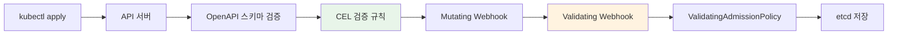
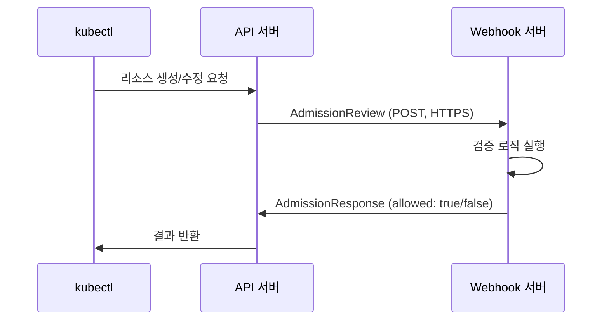
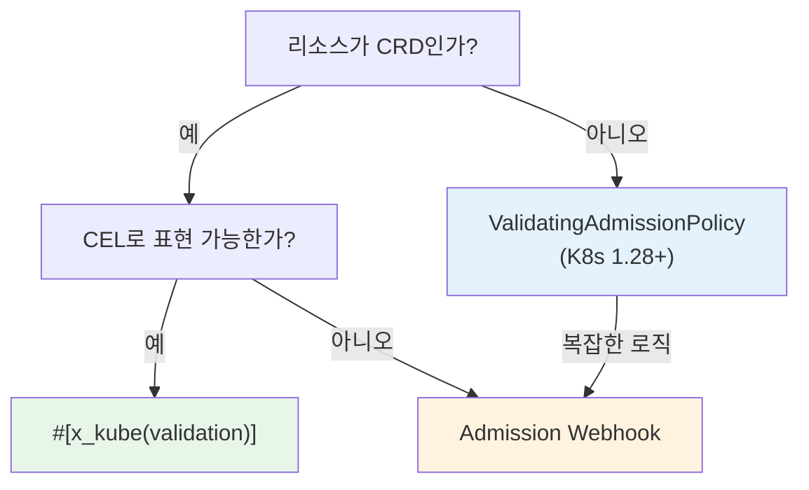

# Admission 검증

Kubernetes 리소스가 API 서버에 저장되기 전에 검증하는 계층을 다룹니다. kube-rs는 CRD 스키마 내 CEL 검증과 Admission Webhook 양쪽을 모두 지원합니다.

## 검증 계층 개요

리소스가 etcd에 저장되기까지 여러 검증 단계를 거칩니다:



| 계층 | 위치 | 장점 | 단점 |
|------|------|------|------|
| CRD 스키마 (CEL) | API 서버 내부 | 외부 서비스 불필요, 빠름 | CRD 리소스만 가능, 표현력 제한 |
| Admission Webhook | 외부 서비스 | 임의 로직 가능, 모든 리소스 | 가용성 의존성 추가 |
| ValidatingAdmissionPolicy | API 서버 내부 | 외부 서비스 불필요, 모든 리소스 | K8s 1.28+ 필요 |
| 외부 프레임워크 | 정책 엔진 | 정책 관리 UI, 감사 | 별도 인프라 |

## CEL 검증

### KubeSchema derive

`#[derive(KubeSchema)]`는 CEL 검증 규칙이 포함된 `JsonSchema` 구현을 생성합니다. [CRD와 derive 매크로](../runtime-internals/custom-resources.md)에서 다룬 기본 스키마 생성에 CEL 규칙을 추가하는 것입니다.

```rust title="kube-derive/src/lib.rs (단순화)"
#[proc_macro_derive(KubeSchema, attributes(x_kube, schemars, validate))]
pub fn derive_schema_validation(input: proc_macro::TokenStream) -> proc_macro::TokenStream {
    cel_schema::derive_validated_schema(input.into()).into()
}
```

`KubeSchema`는 `JsonSchema` derive를 대체합니다. `CustomResource`와 함께 사용합니다:

```rust
use kube::CustomResource;
use kube::core::KubeSchema;
use serde::{Serialize, Deserialize};

#[derive(CustomResource, KubeSchema, Serialize, Deserialize, Clone, Debug)]
#[kube(group = "example.com", version = "v1", kind = "Document")]
#[kube(namespaced, status = "DocumentStatus")]
pub struct DocumentSpec {
    pub title: String,
    pub content: String,
    pub replicas: i32,
}
```

### x_kube validation 규칙

`#[x_kube(validation)]` 어트리뷰트로 CEL 검증 규칙을 추가합니다. struct 수준과 필드 수준 모두에 적용할 수 있습니다.

#### Struct 수준 검증

```rust
#[derive(CustomResource, KubeSchema, Serialize, Deserialize, Clone, Debug)]
#[kube(group = "example.com", version = "v1", kind = "Document")]
#[x_kube(validation = "self.spec.replicas <= 10")]
pub struct DocumentSpec {
    pub title: String,
    pub replicas: i32,
}
```

생성되는 CRD 스키마에 다음이 추가됩니다:

```yaml
x-kubernetes-validations:
  - rule: "self.spec.replicas <= 10"
```

#### 필드 수준 검증

```rust
pub struct DocumentSpec {
    #[x_kube(validation = Rule::new("self != ''").message("title은 비어있을 수 없습니다"))]
    pub title: String,

    #[x_kube(validation = Rule::new("self >= 1 && self <= 100").reason("FieldValueInvalid"))]
    pub replicas: i32,
}
```

`Rule` 빌더는 CEL 표현식에 메시지와 사유를 첨부합니다.

#### 불변 필드 (transition rule)

`self`와 `oldSelf`를 비교하는 CEL 규칙은 **transition rule**로 동작합니다. UPDATE 요청에서만 평가됩니다:

```rust
#[derive(CustomResource, KubeSchema, Serialize, Deserialize, Clone, Debug)]
#[kube(group = "example.com", version = "v1", kind = "Document")]
#[x_kube(validation = "self.spec.storageClass == oldSelf.spec.storageClass")]
pub struct DocumentSpec {
    pub storage_class: String,
    pub content: String,
}
```

#### kube 어트리뷰트 레벨 validation

`#[kube(validation = ...)]`으로도 최상위 CEL 규칙을 지정할 수 있습니다:

```rust
#[derive(CustomResource, KubeSchema, Serialize, Deserialize, Clone, Debug)]
#[kube(
    group = "example.com",
    version = "v1",
    kind = "Singleton",
    validation = Rule::new("self.metadata.name == 'singleton'"),
)]
pub struct SingletonSpec {
    pub config: String,
}
```

### merge_strategy

`#[x_kube(merge_strategy)]`로 Server-Side Apply의 merge 동작을 제어합니다:

```rust
pub struct DocumentSpec {
    #[x_kube(merge_strategy = "merge")]
    pub tags: Vec<String>,
}
```

이는 `x-kubernetes-list-type` 등의 스키마 확장을 생성합니다.

## Admission Webhook

CEL만으로 표현할 수 없는 검증(외부 시스템 조회, 복잡한 비즈니스 로직)이 필요할 때 Admission Webhook을 사용합니다.

### AdmissionReview 흐름



### kube::core::admission 모듈

kube-core는 Admission Webhook 구현에 필요한 타입을 제공합니다:

```rust title="kube-core/src/admission.rs (핵심 타입)"
pub struct AdmissionReview<T: Resource> {
    pub types: TypeMeta,
    pub request: Option<AdmissionRequest<T>>,
    pub response: Option<AdmissionResponse>,
}

pub struct AdmissionRequest<T: Resource> {
    pub uid: String,
    pub kind: GroupVersionKind,
    pub operation: Operation,  // Create, Update, Delete, Connect
    pub name: String,
    pub namespace: Option<String>,
    pub object: Option<T>,
    pub old_object: Option<T>,
    pub dry_run: bool,
    // ...
}

pub struct AdmissionResponse {
    pub uid: String,
    pub allowed: bool,
    pub result: Status,
    pub patch: Option<Vec<u8>>,
    pub patch_type: Option<PatchType>,  // JsonPatch
    pub warnings: Option<Vec<String>>,
    // ...
}
```

### Webhook 서버 구현

kube 자체에는 HTTP 서버가 포함되어 있지 않습니다. `axum`, `actix-web`, `warp` 등으로 webhook 엔드포인트를 구현합니다:

```rust
use kube::core::admission::{AdmissionReview, AdmissionRequest, AdmissionResponse};

async fn validate_handler(
    body: axum::Json<AdmissionReview<Document>>,
) -> axum::Json<AdmissionReview<Document>> {
    let req: AdmissionRequest<Document> = body.0.request.unwrap();
    let resp = match validate(&req) {
        Ok(()) => AdmissionResponse::from(&req).allowed(true),
        Err(reason) => {
            let mut resp = AdmissionResponse::from(&req);
            resp.allowed = false;
            resp.result.message = Some(reason);
            resp
        }
    };

    axum::Json(AdmissionReview {
        types: TypeMeta::default(),
        request: None,
        response: Some(resp),
    })
}

fn validate(req: &AdmissionRequest<Document>) -> Result<(), String> {
    if let Some(doc) = &req.object {
        if doc.spec.title.is_empty() {
            return Err("title은 비어있을 수 없습니다".into());
        }
    }
    Ok(())
}
```

### End-to-End 서버 구성

위의 handler를 실제로 서비스하려면 TLS를 지원하는 HTTP 서버와 Kubernetes 매니페스트가 필요합니다.

#### axum + rustls 서버

```rust
use axum::{routing::post, Router};
use axum_server::tls_rustls::RustlsConfig;

#[tokio::main]
async fn main() -> anyhow::Result<()> {
    let tls_config = RustlsConfig::from_pem_file(
        "/certs/tls.crt",
        "/certs/tls.key",
    ).await?;

    let app = Router::new()
        .route("/validate", post(validate_handler));

    axum_server::bind_rustls("0.0.0.0:8443".parse()?, tls_config)
        .serve(app.into_make_service())
        .await?;
    Ok(())
}
```

인증서 파일은 cert-manager `Certificate` 리소스 또는 init container에서 `/certs/` 에 마운트합니다.

#### ValidatingWebhookConfiguration 매니페스트

```yaml
apiVersion: admissionregistration.k8s.io/v1
kind: ValidatingWebhookConfiguration
metadata:
  name: document-validator
  annotations:
    cert-manager.io/inject-ca-from: default/webhook-cert  # cert-manager 자동 주입
webhooks:
  - name: validate.example.com
    admissionReviewVersions: ["v1"]
    clientConfig:
      service:
        name: webhook-server
        namespace: default
        path: /validate
        port: 443
    rules:
      - apiGroups: ["example.com"]
        apiVersions: ["v1"]
        operations: ["CREATE", "UPDATE"]
        resources: ["documents"]
    failurePolicy: Fail
    sideEffects: None
    timeoutSeconds: 5
```

`clientConfig.service`는 webhook Pod를 가리키는 Service를 참조합니다. `caBundle`은 cert-manager의 CA Injector가 annotation 기반으로 자동 주입합니다.

### 인증서 관리

API 서버는 webhook에 HTTPS로만 통신합니다. TLS 인증서가 반드시 필요합니다.

| 방법 | 설명 | 복잡도 |
|------|------|--------|
| cert-manager | 자동 발급/갱신, CA Injector 지원 | 낮음 |
| 자체 서명 | init container에서 인증서 생성 | 중간 |
| kube 클라이언트 인증서 | API 서버의 CA 사용 | 높음 |

cert-manager를 사용하면 `Certificate` 리소스로 인증서를 자동 관리하고, `caBundle` 주입도 자동화됩니다.

### FailurePolicy

webhook 서버가 응답하지 않을 때의 동작을 결정합니다:

```yaml title="validatingwebhookconfiguration.yaml"
webhooks:
  - name: validate.example.com
    failurePolicy: Fail     # webhook 장애 시 요청 거부
    # failurePolicy: Ignore # webhook 장애 시 요청 허용
    timeoutSeconds: 5
    matchPolicy: Equivalent
    sideEffects: None
```

| 정책 | 동작 | 사용 시점 |
|------|------|----------|
| `Fail` | webhook 장애 시 리소스 변경 거부 | 보안 관련 검증 |
| `Ignore` | webhook 장애 시 리소스 변경 허용 | 비핵심 검증 |

:::warning[Fail 정책의 위험]
`Fail` 정책에서 webhook 서버가 다운되면 해당 리소스의 모든 변경이 차단됩니다. 컨트롤러 자체의 배포도 차단될 수 있으므로, [가용성](./availability.md) 설계를 함께 고려합니다.
:::

## ValidatingAdmissionPolicy

Kubernetes 1.28+에서 CEL 기반 검증을 CRD가 아닌 모든 리소스에 적용할 수 있습니다. 외부 webhook 서버 없이 API 서버 내부에서 실행됩니다.

```yaml title="ValidatingAdmissionPolicy 예시"
apiVersion: admissionregistration.k8s.io/v1
kind: ValidatingAdmissionPolicy
metadata:
  name: require-labels
spec:
  matchConstraints:
    resourceRules:
      - apiGroups: ["apps"]
        apiVersions: ["v1"]
        operations: ["CREATE", "UPDATE"]
        resources: ["deployments"]
  validations:
    - expression: "has(object.metadata.labels) && 'team' in object.metadata.labels"
      message: "team 라벨이 필요합니다"
```

kube-rs 컨트롤러와의 관계:

- CRD 리소스의 기본 검증은 `#[x_kube(validation)]` CEL이 더 편리합니다 (코드와 검증이 한 곳에)
- CRD 외 리소스(Deployment, Service 등)에 조직 정책을 적용할 때 ValidatingAdmissionPolicy가 유용합니다
- 두 방식 모두 API 서버 내부에서 실행되므로 외부 가용성 의존성이 없습니다

## 외부 정책 프레임워크

조직 수준의 정책 관리가 필요할 때 전용 프레임워크를 사용합니다.

| 프레임워크 | 정책 언어 | 특징 |
|-----------|----------|------|
| Kyverno | YAML (선언적) | Kubernetes 네이티브, 학습 곡선 낮음 |
| Kubewarden | Wasm (Rust, Go 등) | Rust로 정책 작성 가능, OCI 배포 |
| OPA/Gatekeeper | Rego | 범용 정책 엔진, 넓은 생태계 |

Rust 개발자에게는 **Kubewarden**이 특히 흥미롭습니다. 정책을 Rust로 작성하고 Wasm으로 컴파일하여 배포합니다.

kube-rs 컨트롤러와 함께 사용할 때:
- 컨트롤러가 생성하는 자식 리소스에도 정책이 적용됩니다
- 정책이 자식 리소스를 거부하면 reconciler에서 에러가 발생합니다
- [에러 처리](../patterns/error-handling-and-backoff.md)에서 이런 API 에러를 다루는 방법을 확인합니다

## 검증 전략 선택



| 상황 | 권장 |
|------|------|
| CRD 필드 값 범위 검증 | `#[x_kube(validation)]` CEL |
| CRD 불변 필드 | `#[x_kube(validation)]` transition rule |
| 외부 시스템 조회가 필요한 검증 | Admission Webhook |
| 조직 수준 정책 (모든 리소스) | ValidatingAdmissionPolicy 또는 외부 프레임워크 |
| 리소스 변환 (mutation) | Mutating Webhook |
