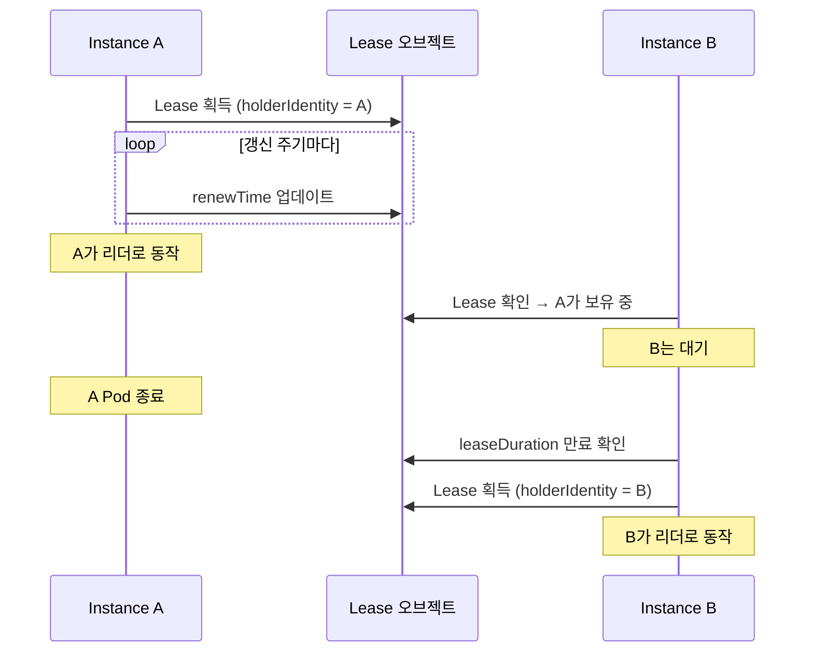

# 가용성

kube 기반 컨트롤러의 가용성을 확보하는 방법을 다룹니다. 대부분의 컨트롤러는 단일 인스턴스로 충분하며, HA가 필요할 때는 leader election으로 해결합니다.

## 단일 인스턴스로 충분한 이유

Kubernetes 컨트롤러는 일반적인 웹 서버와 다릅니다. watch + reconcile 루프는 **queue consumer** 모델입니다:

1. **idempotent reconcile**: [reconciler 패턴](../patterns/reconciler.md)에 따라 모든 reconcile은 멱등합니다. 일시 중단 후 재시작해도 원하는 상태에 수렴합니다
2. **watcher 자동 복구**: watcher가 재시작하면 `resourceVersion`부터 다시 watch하거나, 없으면 re-list로 전체 상태를 복구합니다
3. **scheduler 중복 제거**: 동일 객체에 대한 여러 이벤트가 쌓여도 [scheduler가 중복을 제거](../runtime-internals/controller-pipeline.md)합니다

Pod가 재시작되면 잠시 지연이 생기지만, 데이터 유실이나 불일치는 발생하지 않습니다.

### 복구 타임라인

```
t=0    Pod 종료 시작 (SIGTERM)
t=0~30 진행 중인 reconcile 완료 (graceful shutdown)
t=30   Pod 종료
...    Deployment가 새 Pod 스케줄링
t=45   새 Pod 시작, watcher 초기화
t=46   re-list 완료, 밀린 reconcile 처리 시작
```

`Deployment`의 기본 `terminationGracePeriodSeconds: 30`이면 대부분의 경우 충분합니다. 장시간 reconcile이 있다면 이 값을 늘립니다.

## replicas: 2는 왜 안 되는가

watch 기반 컨트롤러는 요청을 라우팅하는 로드밸런서가 없습니다. 두 인스턴스가 동시에 실행되면:

| 문제 | 설명 |
|------|------|
| 중복 reconcile | 같은 객체를 두 인스턴스가 동시에 reconcile |
| 충돌 | SSA field manager 충돌, optimistic concurrency(`resourceVersion`) 에러 |
| 리소스 낭비 | 두 인스턴스가 동일한 watch 스트림을 유지, API 서버 부하 2배 |

특히 `Server-Side Apply`에서 같은 `fieldManager`로 두 인스턴스가 patch하면 의도하지 않은 필드 소유권 문제가 발생합니다.

:::warning[Rolling update 주의]
`strategy.type: RollingUpdate`에서 `maxSurge: 1`이면 배포 중 잠시 2개가 동시 실행됩니다. 대부분의 컨트롤러는 idempotent하므로 짧은 중복 실행은 문제없지만, leader election을 사용하면 이 구간에서도 안전합니다.
:::

## Leader Election

여러 인스턴스 중 하나만 active로 동작시키는 메커니즘입니다. kube-rs에는 leader election이 내장되어 있지 않으므로 서드파티 크레이트를 사용합니다.

### Lease 기반 메커니즘

Kubernetes `Lease` 오브젝트를 이용한 leader election의 동작 원리:



핵심 파라미터:

| 파라미터 | 의미 | 일반적인 값 |
|---------|------|-----------|
| `leaseDuration` | 리더 유효 시간 | 15초 |
| `renewDeadline` | 갱신 시도 기한 | 10초 |
| `retryPeriod` | 비리더의 재시도 간격 | 2초 |

### 서드파티 크레이트

kube 생태계에서 사용할 수 있는 leader election 크레이트:

| 크레이트 | 접근 방식 | 특징 |
|---------|----------|------|
| `kube-leader-election` | Lease 기반 | 단순한 API, 갱신 루프 제공 |
| `kube-coordinate` | Lease 기반 | kube-runtime 호환 스트림 API |
| `kubert::lease` | Lease 기반 | Linkerd 프로젝트에서 사용 |

사용 패턴:

```rust
// 개념적 사용 예시 (크레이트마다 API가 다릅니다)
let lease = LeaseManager::new(client.clone(), "my-controller", "controller-ns");

// 리더 획득까지 대기
lease.wait_for_leadership().await?;

// 리더일 때만 Controller 실행
Controller::new(api, wc)
    .shutdown_on_signal()
    .run(reconcile, error_policy, ctx)
    .for_each(|res| async move { /* ... */ })
    .await;
```

### shutdown 연계

리더십을 잃었을 때 Controller를 안전하게 종료하는 것이 중요합니다:

```rust
Controller::new(api, wc)
    .graceful_shutdown_on(lease.lost_leadership())
    .run(reconcile, error_policy, ctx)
```

`graceful_shutdown_on()`에 리더십 상실 future를 전달하면, 리더십을 잃었을 때 새 reconcile 시작을 중단하고 진행 중인 reconcile을 완료한 후 종료합니다.

## Graceful Shutdown

### shutdown_on_signal

`Controller::shutdown_on_signal()`은 SIGTERM과 Ctrl+C를 처리합니다.

```rust title="kube-runtime/src/controller/mod.rs (단순화)"
pub fn shutdown_on_signal(mut self) -> Self
```

동작:
1. SIGTERM 또는 SIGINT 수신 시 새 reconcile 시작 중단
2. 진행 중인 reconcile은 완료까지 대기
3. 두 번째 시그널 수신 시 즉시 종료

```rust
Controller::new(api, wc)
    .shutdown_on_signal()
    .run(reconcile, error_policy, ctx)
    .for_each(|res| async move {
        match res {
            Ok(obj) => tracing::info!(?obj, "reconciled"),
            Err(err) => tracing::error!(%err, "reconcile failed"),
        }
    })
    .await;
```

### 커스텀 shutdown trigger

`graceful_shutdown_on()`으로 임의의 shutdown 조건을 설정할 수 있습니다:

```rust
use tokio::sync::oneshot;

let (tx, rx) = oneshot::channel::<()>();

Controller::new(api, wc)
    .graceful_shutdown_on(async move { rx.await.ok(); })
    .run(reconcile, error_policy, ctx)
```

### Deployment 설정

```yaml title="deployment.yaml"
spec:
  replicas: 1
  strategy:
    type: Recreate  # 동시 실행 방지 (leader election 미사용 시)
  template:
    spec:
      terminationGracePeriodSeconds: 60  # 충분한 종료 시간
      containers:
        - name: controller
          # ...
```

| 전략 | leader election 없음 | leader election 있음 |
|------|--------------------|--------------------|
| `Recreate` | 권장 — 중복 방지 | 불필요 |
| `RollingUpdate` | 짧은 중복 발생 | 안전 — 새 인스턴스가 대기 |

## Elected Shards — HA + 수평 확장

대규모 클러스터에서는 단일 리더로는 처리량이 부족할 수 있습니다. 이때 **리소스를 샤딩**하여 여러 리더가 각자 담당 범위를 처리합니다.

```
┌─────────────┐  ┌─────────────┐  ┌─────────────┐
│  Shard 0    │  │  Shard 1    │  │  Shard 2    │
│ ns: team-a  │  │ ns: team-b  │  │ ns: team-c  │
│ (leader)    │  │ (leader)    │  │ (leader)    │
└─────────────┘  └─────────────┘  └─────────────┘
```

각 샤드는:
1. 자체 Lease로 독립적인 leader election 실행
2. 담당 범위의 리소스만 watch (네임스페이스별 `Api::namespaced()` 또는 label selector)
3. 다른 샤드의 리소스는 무시

샤딩 전략에 대한 자세한 내용은 [최적화 — 스케일링 전략](./optimization.md#스케일링-전략)을 참고합니다.

## 가용성 체크리스트

| 항목 | 확인 |
|------|------|
| reconciler가 idempotent한가? | |
| `shutdown_on_signal()` 또는 `graceful_shutdown_on()` 설정했는가? | |
| `terminationGracePeriodSeconds`가 충분한가? | |
| leader election 없이 `replicas > 1`을 쓰고 있지 않은가? | |
| leader election 사용 시 리더십 상실 → shutdown 연계가 되어 있는가? | |
| Deployment strategy가 적절한가? (`Recreate` 또는 leader election) | |
