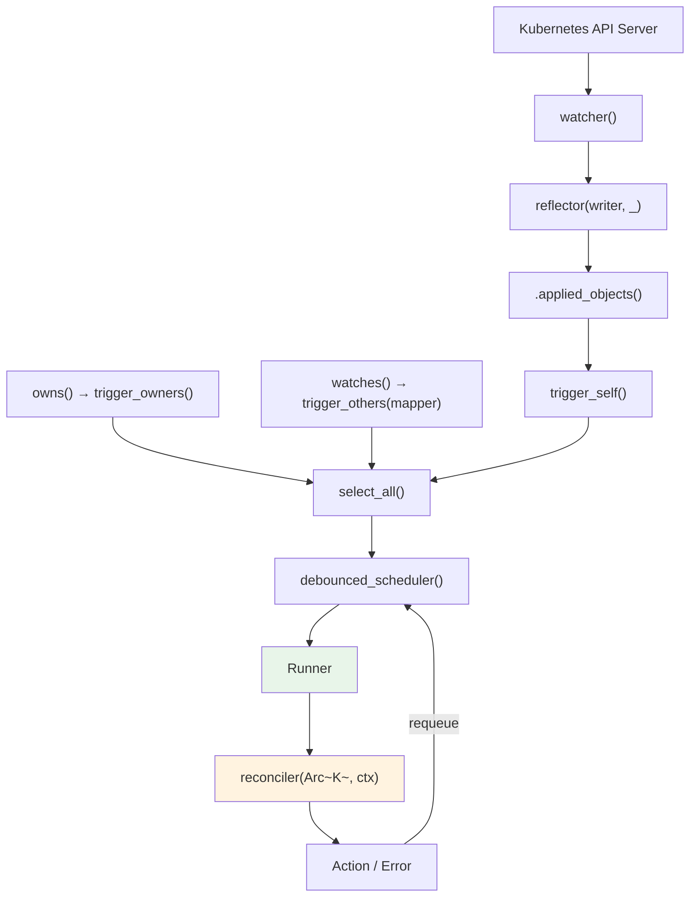
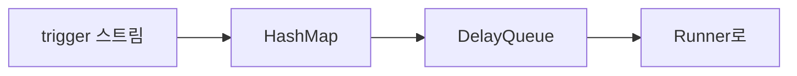
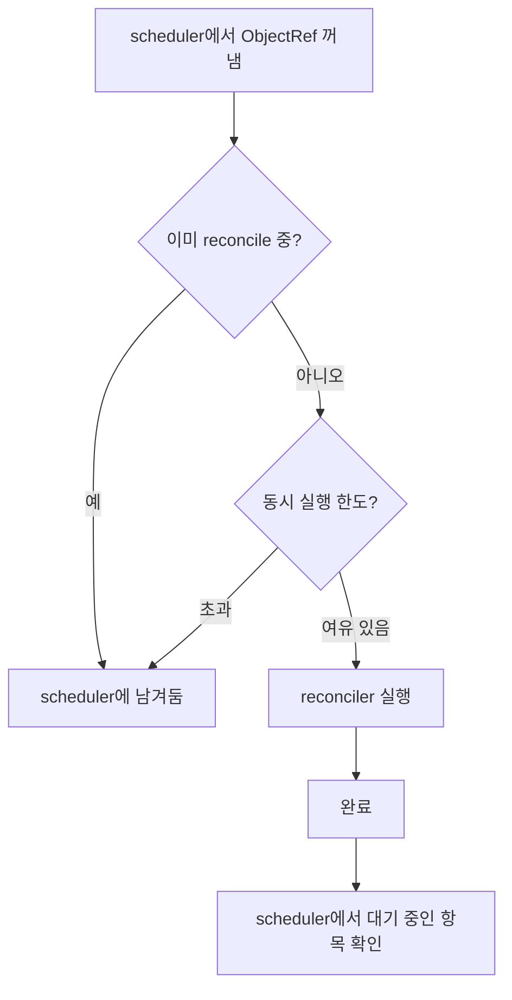

# Controller 파이프라인

Controller는 watcher, reflector, scheduler, runner를 하나로 엮은 최상위 추상화입니다. `Controller::new()`부터 reconciler 호출까지 데이터가 어떤 경로로 흐르는지 추적합니다.

## 전체 데이터 흐름



각 단계:

1. **watcher()** — API 서버에 watch 연결을 열어 `Event<K>` 스트림을 만듦
2. **reflector()** — 스트림을 통과시키면서, 각 Event를 인메모리 Store에 기록
3. **.applied_objects()** — `Event::Apply(K)`, `Event::InitApply(K)`에서 객체 `K`만 꺼냄
4. **trigger_self()** — 꺼낸 `K`를 `ReconcileRequest<K>`로 변환
5. **owns()/watches()** — 관련 리소스(자식, 참조 대상)의 변경도 trigger 스트림으로 추가
6. **select_all()** — 위 trigger 스트림들을 하나로 merge
7. **debounced_scheduler()** — 같은 `ObjectRef`가 여러 번 들어오면 하나로 합치고, debounce 지연 적용
8. **Runner** — concurrency 제한. 같은 객체는 동시에 reconcile하지 않음
9. **reconciler** — 사용자 코드 실행
10. **Action/Error** — 결과(재시도 시간, 에러)를 scheduler로 피드백

## Controller struct

```rust title="kube-runtime/src/controller/mod.rs (단순화)"
pub struct Controller<K> {
    trigger_selector: SelectAll<BoxStream<'static, Result<ReconcileRequest<K>, watcher::Error>>>,
    trigger_backoff: Box<dyn Backoff + Send>,
    reader: Store<K>,
    config: Config,
}
```

- **trigger_selector**: 모든 trigger 스트림(`trigger_self` + `owns` + `watches`)을 `SelectAll`로 합친 것입니다
- **reader**: reflector가 관리하는 Store의 읽기 핸들입니다. reconciler에서 `Arc<K>`를 꺼낼 때 사용합니다
- **config**: debounce duration, concurrency 제한 등을 설정합니다

## Trigger 시스템

### trigger_self — 주 리소스 변경

주 리소스(Controller::new에 지정한 타입)가 변경되면 해당 리소스에 대한 `ReconcileRequest`를 생성합니다.

```rust
// 내부 흐름
watcher Event → .applied_objects() → trigger_self() → ReconcileRequest<K>
```

`ReconcileRequest`는 대상 리소스의 `ObjectRef`와 trigger 이유를 담고 있습니다:

```rust title="ReconcileRequest 내부"
pub struct ReconcileRequest<K: Resource> {
    pub obj_ref: ObjectRef<K>,
    pub reason: ReconcileReason,
}
```

`ReconcileReason`에는 다음 variant가 있습니다:

| Variant | 설명 |
|---------|------|
| `Unknown` | `reconcile_on()`으로 주입된 외부 trigger |
| `ObjectUpdated` | 주 리소스가 변경됨 |
| `RelatedObjectUpdated { obj_ref }` | 관련 리소스가 변경됨 (owns/watches) |
| `ReconcilerRequestedRetry` | reconciler가 `Action::requeue()`로 재실행 요청 |
| `ErrorPolicyRequestedRetry` | `error_policy`가 재실행 요청 |
| `BulkReconcile` | `reconcile_all_on()`으로 전체 재reconcile 요청 |
| `Custom { reason }` | 사용자 정의 사유 (큐 스트림에 직접 주입 시) |

### trigger_owners — 자식 리소스 변경

```rust
controller.owns::<ConfigMap>(api, wc)
```

1. ConfigMap에 대한 별도 watcher를 생성합니다
2. ConfigMap이 변경되면 `metadata.ownerReferences`를 확인합니다
3. 부모(주 리소스)의 `ObjectRef`를 추출합니다
4. 부모에 대한 `ReconcileRequest`를 발행합니다

ownerReferences에서 부모를 식별할 때, `kind`와 `apiVersion`이 Controller의 주 리소스 타입과 일치하는 항목만 추출합니다.

### trigger_others — 관련 리소스 변경

```rust
controller.watches::<Secret>(api, wc, |secret| {
    // Secret에서 관련 주 리소스의 ObjectRef 목록 반환
    let name = secret.labels().get("app")?.clone();
    let ns = secret.namespace()?;
    Some(ObjectRef::new(&name).within(&ns))
})
```

1. Secret에 대한 별도 watcher를 생성합니다
2. Secret이 변경되면 사용자 정의 mapper 함수를 호출합니다
3. mapper가 반환한 `ObjectRef`들에 대해 `ReconcileRequest`를 발행합니다

사용 사례: Secret 변경 → 해당 Secret을 참조하는 모든 리소스를 재reconcile합니다.

## 외부 이벤트 소스 — reconcile_on

`reconcile_on()`으로 watch 이벤트 외의 외부 트리거를 Controller에 연결할 수 있습니다.

```rust
use tokio::sync::mpsc;
use futures::stream::ReceiverStream;

let (tx, rx) = mpsc::channel::<ObjectRef<MyResource>>(256);

Controller::new(api, wc)
    .reconcile_on(ReceiverStream::new(rx))
    .run(reconcile, error_policy, ctx)
```

외부 webhook, 메시지 큐, 타이머 등에서 `ObjectRef`를 보내면 해당 리소스의 reconcile이 트리거됩니다. 이때 `ReconcileReason`은 `Unknown`으로 설정됩니다.

### Stream 기반 API

기본 `Controller::new()`는 내부에서 watcher를 생성하지만, `for_stream()`을 사용하면 미리 필터링된 스트림을 직접 주입할 수 있습니다. `owns_stream()`과 `watches_stream()`도 동일한 패턴입니다.

```rust
// 외부에서 생성한 watcher 스트림을 Controller에 주입
let (reader, writer) = reflector::store();
let stream = reflector(writer, watcher(api.clone(), wc))
    .applied_objects();

Controller::for_stream(stream, reader)
    .owns_stream::<ConfigMap>(cm_stream)
    .watches_stream::<Secret, _>(secret_stream, |secret| { /* mapper */ })
    .run(reconcile, error_policy, ctx)
```

### 다중 스트림 조합

여러 관련 리소스의 이벤트를 하나의 Controller에 통합하는 고급 패턴입니다. `for_stream()`과 `watches_stream()`을 조합하면 외부에서 구성한 스트림을 Controller에 주입할 수 있습니다.

```rust
use futures::stream;
use kube::runtime::{reflector, watcher, Controller, WatchStreamExt};

// 주 리소스 스트림
let (reader, writer) = reflector::store();
let main_stream = reflector(writer, watcher(main_api, wc.clone()))
    .applied_objects()
    .default_backoff();

// 관련 리소스 스트림들
let cm_stream = watcher(cm_api, wc.clone())
    .applied_objects()
    .default_backoff();

let secret_stream = watcher(secret_api, wc.clone())
    .applied_objects()
    .default_backoff();

Controller::for_stream(main_stream, reader)
    .watches_stream(cm_stream, |cm| {
        // ConfigMap → 주 리소스 매핑
        let name = cm.labels().get("app")?.clone();
        let ns = cm.namespace()?;
        Some(ObjectRef::new(&name).within(&ns))
    })
    .watches_stream(secret_stream, |secret| {
        // Secret → 주 리소스 매핑
        let name = secret.labels().get("app")?.clone();
        let ns = secret.namespace()?;
        Some(ObjectRef::new(&name).within(&ns))
    })
    .run(reconcile, error_policy, ctx)
```

이 패턴은 `owns()`/`watches()`가 내부에서 생성하는 watcher를 외부에서 직접 구성하는 것입니다. 스트림에 `.modify()`로 필드를 제거하거나, shared reflector로 여러 Controller가 공유하는 등의 세밀한 제어가 가능합니다. [제네릭 컨트롤러](../patterns/generic-controllers.md#공유-reflector)에서 공유 패턴을 다룹니다.

:::warning[Unstable feature flags]
아래 API는 unstable feature flag를 활성화해야 사용할 수 있습니다:
- `reconcile_on()` → `unstable-runtime-reconcile-on`
- `for_stream()`, `owns_stream()`, `watches_stream()` → `unstable-runtime-stream-control`

```toml
kube = { version = "...", features = ["unstable-runtime-reconcile-on", "unstable-runtime-stream-control"] }
```
:::

## Scheduler — 중복 제거와 지연

`debounced_scheduler()`는 `DelayQueue` + `HashMap`으로 중복 제거와 시간 기반 스케줄링을 수행합니다.



동작 방식:

- 같은 `ObjectRef`에 trigger가 여러 번 들어오면, 가장 빠른 예약 시간 하나만 남기고 나머지는 버립니다
- debounce가 설정되면, 설정된 기간 내의 추가 trigger를 무시합니다

```
debounce = 1초일 때:
t=0.0  trigger(A) → 1초 후 실행 예약
t=0.3  trigger(A) → 이미 예약됨, 무시
t=1.0  A 실행
t=1.2  trigger(A) → 다시 1초 후 예약
```

debounce가 필요한 이유: reconciler가 status를 업데이트하면 → 새 `resourceVersion` 생성 → watch 이벤트 발생 → 불필요한 재reconcile이 됩니다. debounce가 이 burst를 흡수합니다. 자세한 내용은 [Reconciler 패턴](../patterns/reconciler.md)에서 다룹니다.

## Runner — concurrency 제어

Runner는 scheduler에서 나온 항목을 실제로 reconciler에 전달하면서 concurrency를 제어합니다.

핵심 동작:

1. **readiness gate**: `Store::wait_until_ready()`가 완료될 때까지 reconcile을 시작하지 않습니다
2. **hold_unless**: 이미 reconcile 중인 `ObjectRef`는 scheduler에 남겨둡니다
3. **max_concurrent_executions**: 전체 동시 reconcile 수를 제한합니다



같은 객체의 동시 reconcile을 방지하는 건 **hold_unless 패턴**입니다:

- A 객체 reconcile 중 → A에 대한 새 trigger 도착 → scheduler에서 대기
- A 완료 → scheduler에서 A를 다시 꺼내 실행

이렇게 하면 같은 리소스에 대한 reconcile이 순서대로 실행됩니다.

## Reconcile 결과 처리

reconciler의 결과에 따라 scheduler에 피드백합니다.

### 성공 시

```rust
async fn reconcile(obj: Arc<MyResource>, ctx: Arc<Context>) -> Result<Action, Error> {
    // ... reconcile 로직 ...

    // 5분 후 다시 확인
    Ok(Action::requeue(Duration::from_secs(300)))

    // 또는: 다음 watch 이벤트까지 대기
    Ok(Action::await_change())
}
```

| Action | 동작 |
|--------|------|
| `requeue(Duration)` | 지정된 시간 후 scheduler에 재실행 예약 |
| `await_change()` | 능동적 requeue 없음, 다음 watch 이벤트 대기 |

### 실패 시

```rust
fn error_policy(
    obj: Arc<MyResource>,
    error: &Error,
    ctx: Arc<Context>,
) -> Action {
    Action::requeue(Duration::from_secs(5))
}
```

`error_policy`가 반환한 `Action`에 따라 scheduler에 예약합니다.

## Config

```rust
use kube::runtime::controller::Config;

controller.with_config(
    Config::default()
        .debounce(Duration::from_secs(1))  // trigger 간 최소 간격
        .concurrency(10)                    // 최대 동시 reconcile 수
)
```

| 설정 | 기본값 | 설명 |
|------|--------|------|
| `debounce` | 0 (없음) | trigger 간 최소 간격. burst 흡수에 유용합니다 |
| `concurrency` | 0 (무제한) | 동시 reconcile 수 제한. 0은 무제한입니다 |

## Shutdown

```rust
// SIGTERM/SIGINT에 반응
controller.shutdown_on_signal()

// 커스텀 shutdown trigger
controller.graceful_shutdown_on(async {
    // 어떤 조건...
})
```

graceful shutdown 동작:
1. 새 reconcile 시작을 중단합니다
2. 진행 중인 reconcile은 완료될 때까지 대기합니다

내부적으로 `tokio::signal`을 사용합니다.
