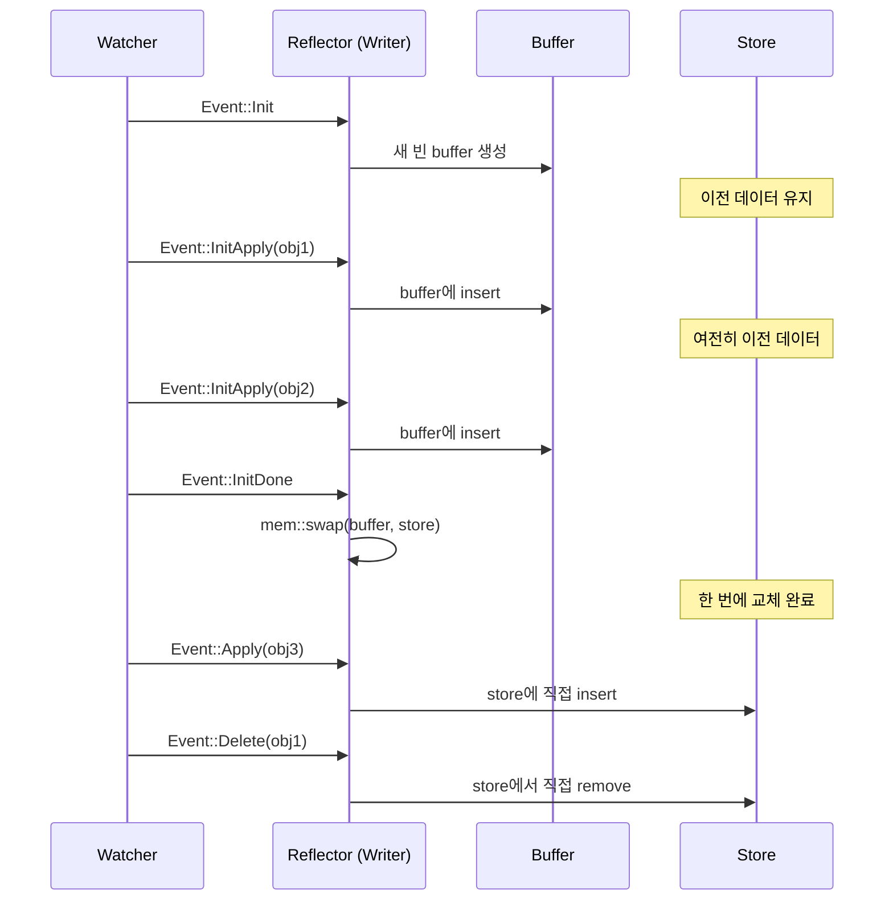

# Reflector와 Store

Reflector는 watcher 스트림을 가로채서 인메모리 캐시(Store)에 기록하는 투명한 어댑터입니다. 스트림을 그대로 통과시키면서 사이드이펙트로 캐시를 업데이트합니다.

## reflector 함수

```rust
pub fn reflector<K, W>(writer: Writer<K>, stream: W) -> impl Stream<Item = W::Item>
```

watcher 스트림의 각 `Event`를 가로채서 `Writer`에 적용(캐시 업데이트)한 뒤, 이벤트를 변경 없이 다음 스트림으로 그대로 전달합니다. 스트림 소비자는 reflector가 중간에 있는지 모릅니다.

```rust
use kube::runtime::{reflector, watcher, WatchStreamExt};

let (reader, writer) = reflector::store();
let stream = reflector(writer, watcher(api, watcher::Config::default()))
    .default_backoff()
    .applied_objects();

// reader로 캐시 조회
// stream으로 이벤트 처리
```

## Store 내부 구조

```rust title="kube-runtime/src/reflector/store.rs (단순화)"
type Cache<K> = Arc<RwLock<AHashMap<ObjectRef<K>, Arc<K>>>>;

pub struct Writer<K> {
    store: Cache<K>,
    buffer: AHashMap<ObjectRef<K>, Arc<K>>,
}

pub struct Store<K> {
    store: Cache<K>,
}
```

내부 자료구조 선택의 이유:

| 구성요소 | 선택 | 이유 |
|---------|------|------|
| `AHashMap` | `std::HashMap` 대신 | 내부 캐시라 DoS 방어가 불필요하므로 더 빠른 해시맵 사용 |
| `parking_lot::RwLock` | `std::RwLock` 대신 | 읽기 concurrency가 더 좋고, poisoning이 없음 |
| `Arc<K>` | `K` 대신 | reconciler에 `Arc<K>`로 전달해 불필요한 클론 방지 |

## Atomic swap 패턴

reflector의 핵심 메커니즘입니다. `apply_watcher_event()` 메서드가 각 이벤트 타입에 따라 다르게 동작합니다.



각 이벤트 처리:

| Event | 동작 | Store 상태 |
|-------|------|-----------|
| `Init` | 새 빈 buffer를 생성합니다 | 이전 데이터 유지 (읽기 가능) |
| `InitApply(obj)` | buffer에 insert합니다 | 이전 데이터 유지 |
| `InitDone` | `mem::swap(&mut buffer, &mut *store.write())` | **한 번에 교체** |
| `Apply(obj)` | store에 직접 insert합니다 | 즉시 반영 |
| `Delete(obj)` | store에서 직접 remove합니다 | 즉시 반영 |

이 패턴의 핵심:

- re-list 중에도 Store는 항상 **일관된 스냅샷**을 유지합니다. `Init`부터 `InitDone`까지 Store에는 이전 데이터가 그대로 남아 있습니다.
- `InitDone`에서의 swap은 포인터 교환이므로 O(1)입니다. 데이터 복사가 일어나지 않습니다.
- swap 후 이전 buffer(= 이전 Store 데이터)는 drop됩니다.

## Store의 비동기 특성

:::warning[가장 흔한 실수]
```rust
let (reader, writer) = reflector::store();
// ... reflector 설정 ...
let items = reader.state(); // ← 빈 Vec 반환!
```

Store는 생성 시 비어 있습니다. watcher 스트림이 poll되어야(= tokio 런타임이 실행해야) 채워집니다.
:::

올바른 사용법:

```rust
// 첫 InitDone까지 대기 후 조회
reader.wait_until_ready().await;
let items = reader.state(); // 이제 데이터가 있습니다
```

내부적으로 `wait_until_ready()`는 `DelayedInit`(oneshot channel 기반)을 사용합니다. Writer가 첫 `InitDone` 이벤트를 처리할 때 신호를 보내고, Store의 `wait_until_ready()`가 이 신호를 기다립니다.

Controller를 사용할 때는 이 문제를 신경 쓸 필요가 없습니다. Controller가 내부적으로 `wait_until_ready()`를 호출하므로, reconciler가 실행될 때는 Store가 이미 채워져 있습니다.

## Writer vs Store — 읽기/쓰기 분리

| 역할 | 타입 | Clone | 담당 |
|------|------|-------|------|
| 쓰기 | `Writer<K>` | 불가 | reflector가 소유, `apply_watcher_event` |
| 읽기 | `Store<K>` | 가능 | 여러 곳에서 공유 (reconciler, health check 등) |

이 분리 덕분에 하나의 Writer만 캐시를 수정하고, 여러 Store 핸들이 동시에 읽을 수 있습니다. Controller가 이 분리를 자동으로 관리합니다.

## 주요 Store 메서드

```rust
// 전체 캐시된 객체 목록
let all: Vec<Arc<K>> = reader.state();

// 특정 ObjectRef로 조회
let obj: Option<Arc<K>> = reader.get(&obj_ref);

// 준비 여부 확인
let ready: bool = reader.is_ready();

// 첫 InitDone까지 대기
reader.wait_until_ready().await;
```

`state()`가 반환하는 `Vec<Arc<K>>`는 호출 시점의 스냅샷입니다. 이후 Store가 업데이트되어도 이미 반환된 Vec에는 영향이 없습니다.

## Shared/Subscriber 모드

:::tip[unstable-runtime feature 필요]
이 기능은 `unstable-runtime-stream-control` feature flag를 활성화해야 사용할 수 있습니다.
:::

기본 모드에서는 하나의 reflector가 하나의 Consumer를 지원합니다. Shared 모드를 사용하면 하나의 reflector로 여러 Consumer에 이벤트를 팬아웃할 수 있습니다.

### store_shared와 reflect_shared

v3.x에서는 `reflector::store_shared()`로 shared store를 생성하고, 스트림에 `.reflect_shared()`를 적용합니다.

```rust
use kube::runtime::{reflector, watcher, WatchStreamExt};

// shared store 생성 (버퍼 크기 지정)
let (reader, writer) = reflector::store_shared(1024);

// 스트림에 shared reflector 적용
let stream = watcher(api, wc)
    .default_backoff()
    .reflect_shared(writer)
    .applied_objects();

// 여러 subscriber가 이벤트를 수신
let subscriber1 = reader.subscribe().unwrap();
let subscriber2 = reader.subscribe().unwrap();
```

### Controller와 조합

`Controller::for_shared_stream()`으로 shared 스트림을 Controller에 주입합니다.

```rust
// 공유 스트림으로 Controller 생성
Controller::for_shared_stream(stream, reader.clone())
    .run(reconcile, error_policy, ctx)
```

여러 Controller가 같은 리소스를 watch할 때 연결을 하나로 줄일 수 있습니다. 구체적인 다중 Controller 패턴은 [제네릭 컨트롤러 — 공유 Reflector](../patterns/generic-controllers.md#공유-reflector)를 참고합니다.

사용 사례:
- 하나의 watcher로 여러 컨트롤러에 이벤트 전달
- API 서버 watch 연결 수를 줄여야 할 때

내부적으로 `async_broadcast` 채널을 사용해 `ObjectRef` 이벤트를 여러 subscriber에 전달합니다.
