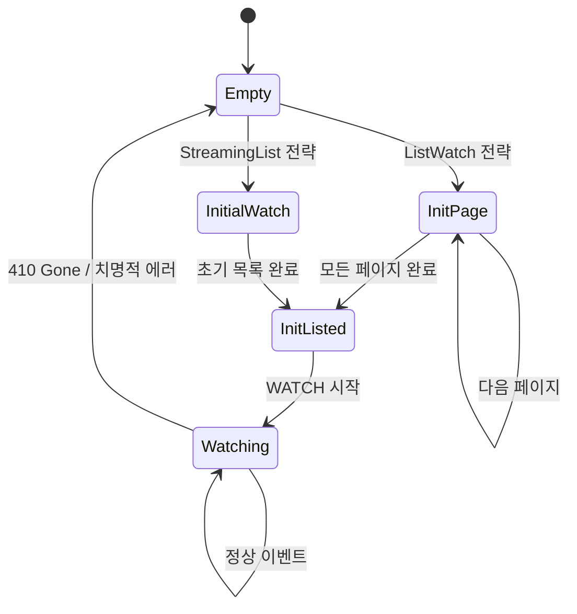

# Watcher

`Api::watch()`는 연결이 끊기면 그대로 종료되고, `resourceVersion` 만료에도 대응하지 않습니다. `watcher()`는 이 위에 **상태 머신**을 올려서 자동 재연결, 초기 목록 로드, 에러 복구를 제공하는 Stream입니다.

## watcher의 역할

`Api::watch()`의 한계를 정리하면 다음과 같습니다:

| 한계 | 설명 |
|------|------|
| 연결 끊기면 종료 | 수동으로 재시작해야 합니다 |
| `resourceVersion` 만료 대응 없음 | 410 Gone 응답을 받으면 그대로 에러 |
| 초기 목록 없음 | watch는 "지금부터"의 변경만 봅니다 |

`watcher()`는 이 모든 것을 자동으로 처리합니다:

```rust
use kube::runtime::{watcher, WatchStreamExt};

let wc = watcher::Config::default();
let stream = watcher(api, wc)
    .default_backoff()    // 에러 시 지수 백오프로 재시도
    .applied_objects();   // Event<K> → K 스트림으로 변환
```

## 상태 머신

watcher 내부는 다섯 가지 상태를 거치는 상태 머신입니다.



각 상태에서 하는 일:

| 상태 | 동작 | API 호출 |
|------|------|----------|
| **Empty** | 초기 상태 또는 에러 후 리셋. 설정된 전략에 따라 분기합니다. | — |
| **InitPage** | paginated LIST 호출 (`page_size=500`). 각 페이지마다 `Event::InitApply(obj)`를 발행합니다. `continue_token`으로 다음 페이지를 가져옵니다. | `LIST ?limit=500&continue=...` |
| **InitialWatch** | `sendInitialEvents=true`로 WATCH를 시작합니다. 서버가 기존 객체를 하나씩 보내고 Bookmark으로 완료를 알립니다. | `WATCH ?sendInitialEvents=true` |
| **InitListed** | 초기 목록 완료. `Event::InitDone`을 발행하고, 마지막 `resourceVersion`으로 WATCH를 시작합니다. | `WATCH ?resourceVersion=...` |
| **Watching** | 정상 watch 상태. Added/Modified → `Event::Apply`, Deleted → `Event::Delete`. 410 Gone이나 연결 끊김 시 Empty로 복귀합니다. | — (기존 연결 유지) |

## 두 가지 초기 목록 전략

### ListWatch (기본)

모든 Kubernetes 버전에서 동작하는 기본 전략입니다.

1. `LIST` 호출 (`page_size=500`, client-go와 동일)
2. `continue_token`으로 모든 페이지 소진
3. 마지막 `resourceVersion`으로 `WATCH` 시작

```rust
// 기본 — ListWatch 전략 사용
let wc = watcher::Config::default();
```

:::warning[초기 LIST 메모리]
대규모 클러스터에서 전체 리소스를 페이지 단위로 로드합니다. 객체 수가 많으면 초기 LIST 시 메모리 사용량이 급증할 수 있습니다.
:::

### StreamingList (K8s 1.27+)

Kubernetes 1.27부터 사용 가능한 효율적인 전략입니다.

1. `WATCH` + `sendInitialEvents=true` + `resourceVersionMatch=NotOlderThan`
2. 서버가 기존 객체를 하나씩 Added로 전송
3. Bookmark으로 초기 목록 완료 신호

```rust
// StreamingList 전략 사용
let wc = watcher::Config::default().streaming_lists();
```

LIST와 달리 한 번에 하나씩 처리하므로 메모리 효율이 좋습니다. 다만 Kubernetes 1.27+ (WatchList feature gate)가 필요합니다.

## Event 추상화

watcher는 Kubernetes의 `WatchEvent`를 더 높은 수준의 `Event`로 변환합니다.

```rust
pub enum Event<K> {
    Init,          // re-list 시작
    InitApply(K),  // 초기 목록의 각 객체
    InitDone,      // 초기 목록 완료
    Apply(K),      // watch 중 Added/Modified
    Delete(K),     // watch 중 Deleted
}
```

Kubernetes의 `WatchEvent`와 매핑:

| WatchEvent | 초기 목록 중 | watch 중 |
|-----------|-------------|---------|
| Added | `InitApply(K)` | `Apply(K)` |
| Modified | — | `Apply(K)` |
| Deleted | — | `Delete(K)` |
| Bookmark | 내부 처리 (`resourceVersion` 갱신) | 내부 처리 |

`Init`/`InitApply`/`InitDone`이 별도로 존재하는 이유는 [reflector의 atomic swap 패턴](./reflector-and-store.md) 때문입니다. `Init`에서 새 buffer를 만들고, `InitApply`로 채우고, `InitDone`에서 한 번에 교체합니다.

## 에러 복구와 backoff

watcher의 모든 에러는 재시도 가능으로 간주됩니다.

### default_backoff

```rust
let stream = watcher(api, wc)
    .default_backoff();  // 지수 백오프: 1s → 2s → 4s → ... → 60s (최대)
```

성공적인 이벤트를 수신하면 backoff가 리셋됩니다.

:::warning[backoff 없이 쓰면 안 됩니다]
backoff 없이 watcher를 사용하면 첫 에러에 스트림이 종료됩니다. Controller 전체가 멈추는 프로덕션 사고로 이어질 수 있습니다.

backoff 없는 상태에서 API 서버 일시 장애가 발생하면 tight-loop 재시도로 CPU/메모리가 폭주할 수도 있습니다.
:::

### 410 Gone 처리

Kubernetes API 서버는 `resourceVersion` 히스토리를 약 5분간만 유지합니다. 그 이상 지연되면 410 Gone 응답을 보냅니다.

watcher는 410 Gone을 받으면 Empty 상태로 복귀해 전체 re-list를 수행합니다. bookmarks를 활성화하면 `resourceVersion`이 주기적으로 갱신되어 410 빈도가 크게 줄어듭니다.

## watcher::Config

```rust
let wc = watcher::Config::default()
    .labels("app=myapp")              // label selector
    .fields("status.phase=Running")   // field selector
    .timeout(300)                     // watch timeout (서버 측)
    .page_size(100)                   // ListWatch 페이지 크기
    .streaming_lists()                // StreamingList 전략
    .any()                            // ListSemantic::Any
    .bookmarks(true);                 // bookmark 활성화 (기본 on)
```

| 옵션 | 기본값 | 설명 |
|------|--------|------|
| `labels` | 없음 | label selector로 감시 범위 축소 |
| `fields` | 없음 | field selector |
| `timeout` | 295초 | 서버 측 watch timeout |
| `page_size` | 500 | ListWatch 페이지 크기 |
| `streaming_lists()` | off | StreamingList 전략 활성화 |
| `any()` | off | `ListSemantic::Any` — 캐시된 데이터 허용 (더 빠르지만 stale 가능) |
| `bookmarks` | true | Bookmark 이벤트 수신 |

## 알아야 할 것들

### watch 이벤트는 전달 보장이 안 됩니다

네트워크 단절 시 `DELETE` 이벤트가 유실될 수 있습니다. re-list로 최종 상태는 복구되지만, 중간 이벤트는 영구 손실됩니다. 삭제 감지가 중요한 경우 [finalizer](../patterns/relations-and-finalizers.md)를 사용합니다.

### re-list 시 메모리 스파이크

대규모 클러스터에서 re-list가 발생하면 이전 데이터 + JSON buffer + 역직렬화된 객체가 동시에 메모리에 존재합니다. 일시적으로 평소의 2~3배 메모리를 사용할 수 있습니다. StreamingList를 사용하면 이를 완화할 수 있습니다.

### bookmarks 없으면 410이 빨라집니다

변경이 적은 리소스(quiet resource)에서는 `resourceVersion`이 갱신되지 않아 빠르게 만료됩니다. bookmarks가 주기적으로 `resourceVersion`을 갱신해 410 Gone을 방지합니다. 기본적으로 활성화되어 있으므로 명시적으로 끄지 않는 한 걱정하지 않아도 됩니다.
