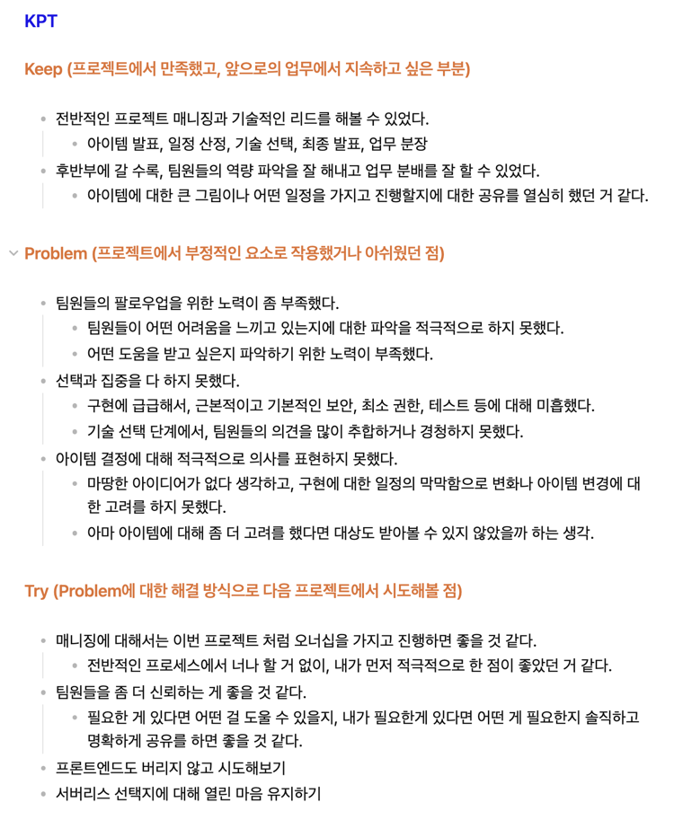

# A Look Back at the Usu Korean History App

This article reflects on the experiences and lessons learned while developing the Wusu Korean History app from February to October 2024, as well as future plans.

<!-- truncate -->

## Reasons for Reflection

I have decided to leave the 'Usu Korean History App', the first project I launched and operated.

Through this retrospective, I would like to look back on the project, summarize what went well and what was disappointing, and set a
direction for future projects and work.

When I wrote a retrospective on another project, after the project was over, the team members got together, wrote their own KPTs, and shared them.

- [Let's do a project review](https://brunch.co.kr/@boi/11)
- [How to Reflect on KPT, Thoughts on Reflection](https://zzsza.github.io/diary/2023/06/05/how-to-retrospect/)

In addition to the two articles above, I also referred to various articles on retrospectives, and the KPT at that time was as follows.

There were a few things I regret.

1. Absence of positive elements: Lack of consideration for how to further strengthen and develop the positive aspects mentioned in the Keep section.
2. Absence of Action Items: The improvements mentioned in the Try section are somewhat abstract.
3. Lack of performance measurement: There is no objective evaluation of the project's success or the extent to which its goals have been achieved.

This time, I prepared while thinking about how I could supplement the above parts.

We tried to determine the degree of goal achievement through quantitative performance measurement and to specifically organize action items.

## What to look back on

We took the time to look back on the project and summarize the major events we experienced. This gave me some direction on what to look back on.

The team was using Notion to track projects. I was able to see the project's major events, issues, meetings, and decisions.

I also thought that if you are a developer, you will be able to understand the flow of the project through the source code.

I checked the project's commit log and organized the project's major events using the `git log --pretty=format:"%h - %an, %ar : %s%n%b"` command.

In addition, I was able to grasp the overall flow of the project by organizing conversations and fragmented notes exchanged through messengers and creating a timeline.

## retrospect

### Experience with the overall development process

**Liked**

I was able to experience the entire development process from ideation to launch and operation. I learned a lot, especially in the process of taking a one-page idea, fleshing it out, and building a service. Additionally, I was able to think about and apply
various solutions to various problem situations.

**Learned**

As I began operating, I was able to experience the importance of user feedback and the service improvement process based on it. If you've been doing it verbally during the communication phase, I've found it's always important to document and share.

**Lacked**

Due to the absence of a planner and project manager, requirements were not clearly defined. There were communication issues and scheduling problems. 같은 단어를 사용하더라도 서로가 이해하는 바가 달라 생겼던 혼란들을 계속
반복했습니다.

**Longed-for**

In future projects, it would be a good idea to clearly define the division of roles. It seems important to reduce the overhead of managing project management by establishing a requirements definition and schedule planning process in advance.

### Several technical challenges

**Liked**

I was able to attempt various technical challenges, such as event-driven architecture, introduction of IaC, introduction of GitOps, and introduction of cloud services. I was able to gain additional learning by challenging myself and applying new technologies to real-world projects.

**Learned**

We realized that technical challenges in real-world services require more careful preparation. After launch, we experienced that the technical challenges became increasingly difficult. I learned that when adopting a new technology, you need to consider the tradeoffs of the technology (including the learning curve, project
schedule, etc.).

**Lacked**

There was a lack of pre-training and proof of concept (PoC).

### Comfort and lethargy

This is the feeling I had while experiencing the project. One of the reasons I wrote this memoir was to record these feelings.

The expression "the comfort of an unfinished project" mentioned in YouTuber Nomad Coder's video [My Secret Method for Launching an App in 6 Days?!] (https://youtu.be/DnLTGBo5KM8) really resonated with me.

The state of incompleteness gave me a sense of relief, as it allowed me to postpone assessing my failure. Additionally, my perfectionist tendencies, coupled with the idea that I should "invest more time to create a perfect result," further slowed down the progress of the
project.

The pressure to get the project done and the guilt of not being able to do so coexisted, making it difficult to even begin working on the project. In this state, I became burnt out and felt helpless.

Experiencing these emotions made me realize that I need to pay more attention to the emotions I feel while working on a project and find ways to overcome them.

## conclusion

While developing the Usu Korean History app, I was able to experience the entire development process, from ideation to launch and operation.

This opportunity gave me time to reflect on the emotions and experiences I had while working on the project.
