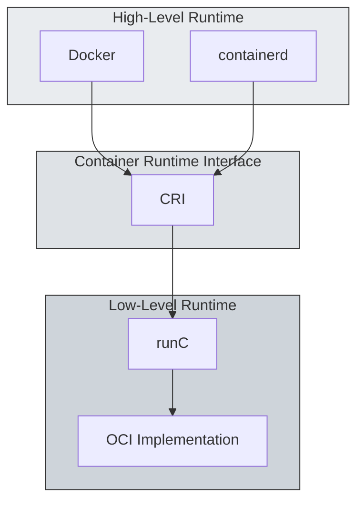
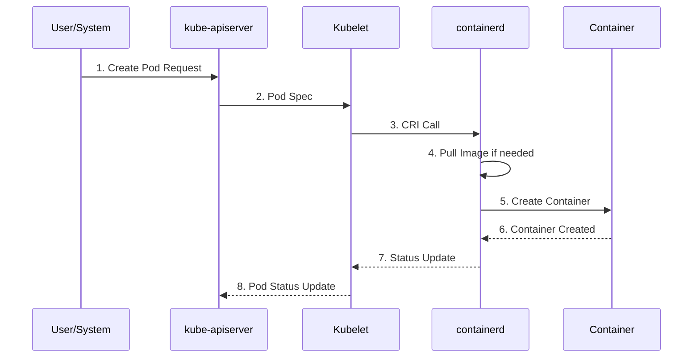
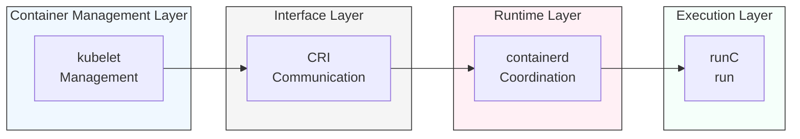

Container technology is an essential element in cloud-native environments. This article covers everything from Linux kernel-based technologies to management methods in Kubernetes.

<!-- truncate -->

## 1. A History of Linux and Container Technology

Containers play a vital role in cloud-native environments. To properly understand this technology, we need to look at everything from the basics of Linux to how Kubernetes manages containers.

### 1.1 The evolution of Linux

Linux started out as a UNIX-based system in 1991 and became the foundation of container technology. Operating systems that originated from UNIX have evolved into commercial distributions such as RedHat Enterprise Linux (RHEL) and free
distributions such as CentOS. Recently, lightweight operating systems optimized for container workloads have emerged, evolving in a different direction from existing general-purpose operating systems.

With the recent end of CentOS service, Rocky Linux has emerged as a replacement.

### 1.2. The emergence of container technology

Containers are based on three core technologies of the Linux kernel: First, `chroot` provides an isolated directory environment for each process. `namespace` creates an independent space
by separating system resources for each process, including separation of mounts (mnt), process ID (pid), networks (net), users (user), IPC, UTS, etc. Finally, `cgroup` controls the use of system resources such as memory, CPU, network, and
disk I/O on a per-process basis.

Container technology has advanced by utilizing the above technologies.

## 2. Container runtime architecture

### 2.1 Hierarchy of container runtimes



Container runtimes can be broadly divided into two levels:

- 고수준(High Level) 런타임인 `Docker`나 `containerd`는 이미지 관리, 네트워크 설정 등 사용자 친화적인
  추가 기능을 제공합니다.

- Low-level runtimes are components that interact directly with the machine, such as `runC`. It follows the OCI (Open Container
  Initiative) standard and is responsible for creating and running the actual container.

### 2.2 Docker and Containerd: Background and Results of the Transition

Docker pioneered the popularization of early container technology and has established itself as a useful tool in development environments. However, in large-scale orchestration environments like Kubernetes, the following challenges existed:

- Complex hierarchy: `kubelet` → `dockershim` → `Docker Engine` → `containerd` → `runC` path included unnecessary intermediate layers, which resulted in poor performance.
- Inefficiency: `Docker` image build, `CLI`, etc. are not used in `Kubernetes` operating environment, which leads to waste of resources.

To address this, Kubernetes removed `dockershim` starting with version 1.24 and adopted the more lightweight `containerd` as the default runtime. This transition resulted in:

- Simplified path: kubelet → CRI → containerd → runC
- Performance improvements: Increased resource efficiency by eliminating unnecessary layers.
- Standardized interface: Compliance with OCI standards ensures compatibility across different runtimes.

### 2.3 Modern Container Runtime Architecture

Modern container runtime architectures are designed for efficiency and standardization in Kubernetes environments. Kubernetes는 CRI(Container Runtime Interface)를 통해 다양한 런타임과
호환성을 유지하며, `containerd`와 같은 경량화된 런타임을 선호합니다. This structure offers the following advantages:

- Optimize performance by removing unnecessary layers
- Ensure compatibility through compliance with OCI standards
- Enhanced flexibility allows for use in a variety of environments

### 2.4 Docker's Changing Role

Docker is still an important tool in local development environments. It is particularly suited for tasks such as building and testing images, and provides developer-friendly CLI tools. However, in production environments, a
lightweight runtime such as containerd is preferred. This contributes to the scalability and efficiency of Kubernetes, while Docker is shifting its role to focus primarily on development-centric tasks.

## 4. Container Management in Kubernetes

### 3.1. Pod creation process in Kubernetes

In Kubernetes, a Pod is the most basic unit of deployment. A Pod creation request is executed through the path kubelet → CRI → containerd → runC. During this process, Kubernetes communicates efficiently with the container runtime via the Container Runtime Interface (CRI) based on gRPC
. gRPC is a standardized protocol that supports various runtimes (containerd, cri-o, etc.) and provides a consistent
interface.



- Pod creation request step
  - A user requests kube-apiserver to create a Pod.
  - kube-apiserver receives requests and passes them to the kubelet.

- Container creation steps
  - kubelet passes commands to containerd through the Container Runtime Interface (CRI).
  - containerd downloads the required images and creates and runs the actual containers via runC.

### 3.2 Role of CRI implementations

CRI is designed to support a variety of runtimes. There are currently two major implementations:

1. **CRI-Containerd** is the official CRI implementation of `containerd`, and is the most widely used due to its stability and performance. Compliance with OCI standards provides compatibility across a variety of environments.

2. **cri-dockerd** acts as a bridge for migrating existing `Docker`-based environments. This is a solution provided for environments that need to continue using `Docker` after `dockershim` is removed from Kubernetes.

## 4) 4) 컨테이너 격리와 리소스 관리

### 4.1 Resource Isolation and Control Technologies

Containers run in isolated environments while sharing the resources of the host system. This is implemented through the following Linux kernel features:

```mermaid
graph TD
    subgraph HostOS
        subgraph Containers
            C1
            C2
        end

        subgraph Isolation
            subgraph NS
                N1<br/>PID]
                N2<br/>NET]
                N3<br/>MNT]
                N4[Other Isolation<br/>USER/IPC/UTS]
            end

            subgraph CG[cgroups resource control]
                R1[CPU usage]
                R2[Memory usage]
                R3[Disk I/O]
                R4[Network bandwidth]
            end
        end
    end

    Containers --> NS
    Containers --> CG
    style HostOS fill: #f5f5f5, stroke: #333
    style Isolation fill: #e9ecef, stroke: #dee2e6
    style NS fill: #e9ecef, stroke: #dee2e6
    style CG fill: #dee2e6, stroke: #ced4da
```

These isolation technologies are appropriately combined to form a single logical unit called a container. Each container runs in its own isolated environment, while being controlled to use only as many system resources as it needs.

### 4.2 Networking and Container Network Interface (CNI)

Container networking is implemented via the Container Network Interface (CNI). CNI is a standard interface responsible for configuring the network settings of containers, providing the following features:

- Pod-to-Pod Communication
- Service Discovery
- Apply network policies
- load balancing

## 5. Container standardization and the Open Container Initiative (OCI)

### 5.1. The Need and Impact of OCI Standards

As container technology rapidly evolves, compatibility issues between different implementations have emerged. To address these issues, OCI was founded in 2015 with Docker at its core. OCI defined two core standards:

#### Runtime Specification

- Standards for container execution environments
- Defining how to manage the lifecycle of containers
- Standardizing resource isolation and control methods

#### Image Specification

- Standardizing container image formats
- Defining how images are created and distributed
- Standardizing image layer management methods

### 5.2. runC: Reference implementation of the OCI standard

runC is a representative implementation of the OCI standard and has become the standard for low-level container runtimes. It has the following characteristics:

- lightweight structure
- Direct use of Linux kernel functions
- High security and stability
- Utilized in various high-level runtimes

### 5.3. The role of containerd

Containerd is a high-level container runtime forked from Docker that provides the following features:

- Running and managing containers
- Image pull/push
- Storage Management
- Provide network interface

Specifically in a Kubernetes environment, containerd offers the following advantages:



This simplified structure has greatly helped in improving performance and stability.

Container technology provides resource isolation and efficiency, making it an essential element of modern IT environments. In particular, the standardization of OCI and the advancement of tools such as Kubernetes have made this technology more powerful and flexible.

## 6. conclusion

The container technology we've looked at so far has evolved from a fundamental feature of the Linux kernel to a core element of modern cloud-native environments. The main development processes are summarized as follows:

1. technological evolution
   - Starting with namespaces, cgroups, and chroot in the Linux kernel
   - Popularizing container technology through Docker
   - Expanding the ecosystem through OCI standardization
   - Standardizing Orchestration with Kubernetes
2. Architecture Optimization
   - Transition from a complex Docker-based architecture to a lightweight containerd-centric one.
   - Establishing a standard interface through CRI
   - Implement efficient resource management and isolation

## Appendix

### Key Terms Explained:

- CRI (Container Runtime Interface): A standard communication interface between Kubernetes and the container runtime.
- OCI (Open Container Initiative): An organization that defines industry standards for container formats and runtimes.
- namespace: Linux kernel feature for process isolation
- cgroups: A Linux kernel feature that controls resource usage.
- containerd: An industry-standard container runtime that implements the OCI standard.
- runC: A reference implementation of a low-level container runtime.

### References

- [Infraon Kubernetes Another Class (Ground Edition) - Sprint 1, 2 Lecture Section 3: Containers in One Shot] (https://inf.run/NzKy)

**Sprint1**

\#1.컨테이너 한방정리 [컨테이너 기술의 이해, 커널부터 쿠버네티스까지(현재 글)](/2025/02/01/from-linux-kernel-to-kubernetes)

\#2.쿠버네티스 설치 [쿠버네티스 클러스터 구축, 아키텍처부터 네트워크까지](/2026/01/05/the-weight-of-kubernetes-installation)

This continues in the series. In the next article, we will cover Kubernetes Pod and Service networking.
