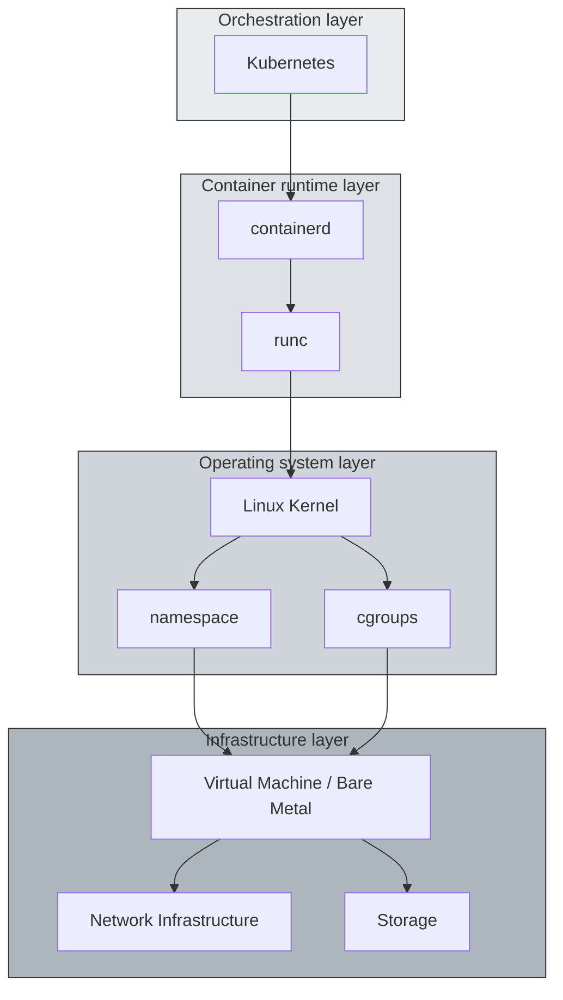
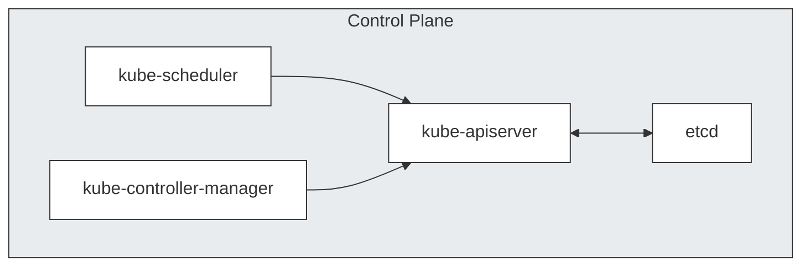
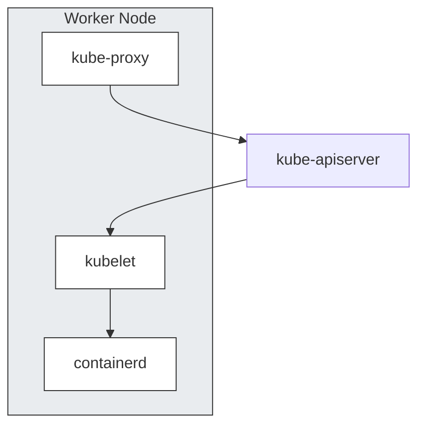
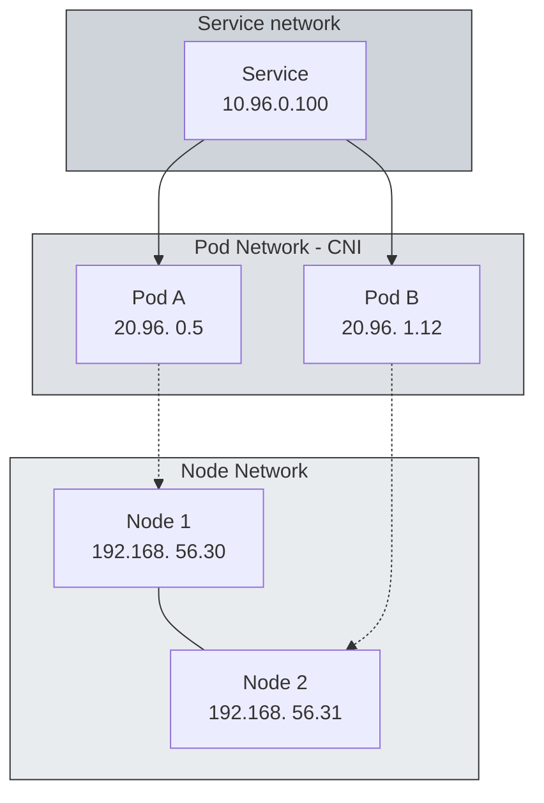
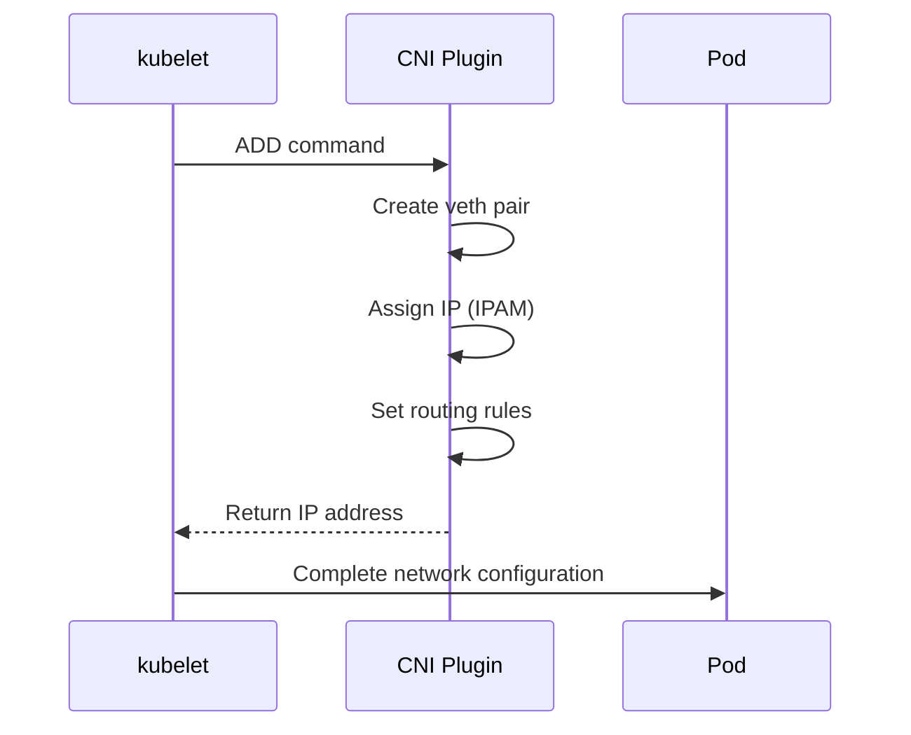
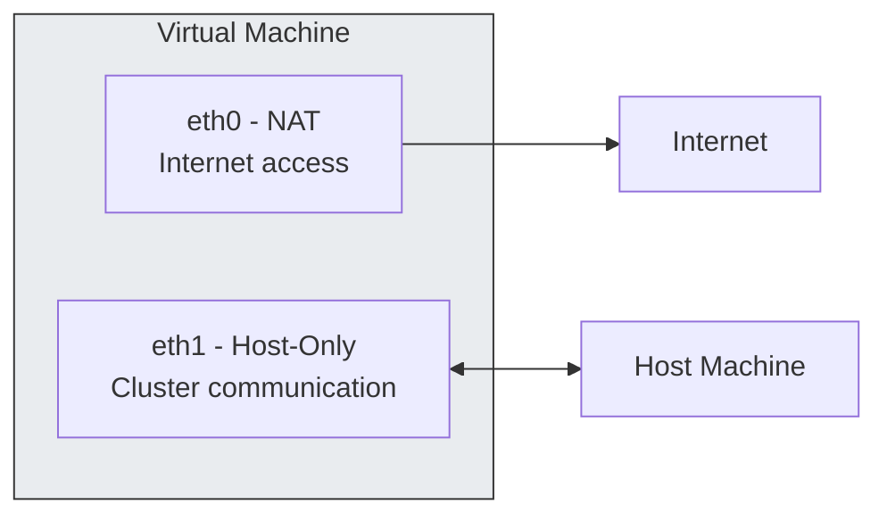
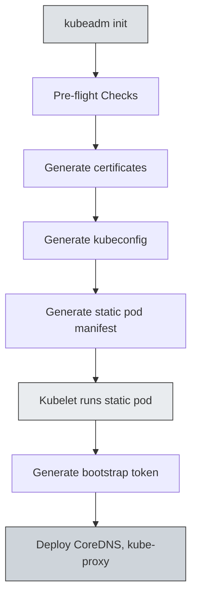
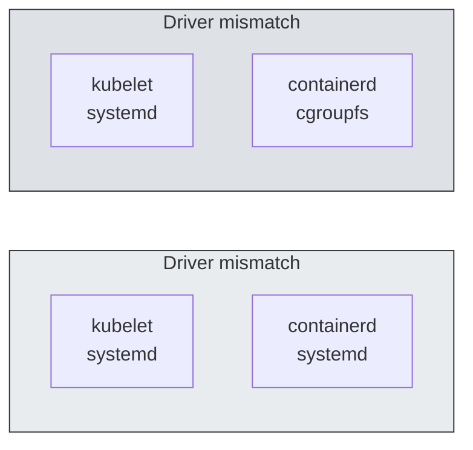
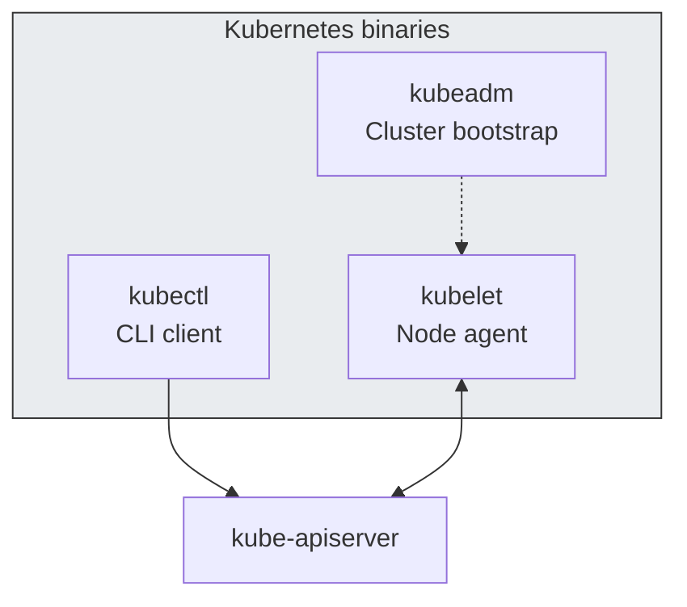

Installing Kubernetes directly with kubeadm will give you a deeper understanding of how the cluster works internally. This article covers the core architecture and network configurations encountered during the installation process.

<!-- truncate -->

## 1. Kubernetes and Infrastructure Stack

Kubernetes does not operate in isolation. Because it runs on top of a multi-layered infrastructure, understanding the role of each layer allows you to debug issues at the appropriate layer.

### 1.1 Full stack structure



### 1.2 Control Plane Components

The control plane of the master node consists of the following components:



Each component has a unique role.

- **kube-apiserver**: The entry point for all API requests. It handles authentication/authorization and communicates solely with etcd.
- **etcd**: A distributed key-value store that stores all state information for the cluster.
- **kube-scheduler**: Responsible for scheduling pods to be placed on appropriate nodes.
- **kube-controller-manager**: Runs various controllers, such as Deployments and ReplicaSets.

### 1.3 Worker Node Component



- **kubelet**: An agent on each node that manages the Pod lifecycle and communicates with the container runtime via CRI.
- **kube-proxy**: Responsible for network routing between Services and Pods and manages iptables or IPVS rules.
- **containerd**: The CRI implementation that handles the actual running of containers.

## 2. Network configuration

The most complex part of installing Kubernetes is networking. For a cluster to function properly, three layers of networks must work organically.

### 2.1 Network Hierarchy



| Network layer   | CIDR example                                                    | Responsible component           | role                                             |
| --------------- | --------------------------------------------------------------- | ------------------------------- | ------------------------------------------------ |
| Node Network    | 192.168.56.0/24 | OS/Hypervisor                   | Communication between physical and virtual nodes |
| Pod Network     | 20.96.0.0/12    | CNI (Calico) | Inter-pod communication, IP allocation           |
| Service Network | 10.96.0.0/12    | kube-proxy                      | Service discovery, load balancing                |

### 2.2 How CNI Works

Sometimes, the CoreDNS Pod remains in Pending state immediately after `kubeadm init`. This is because the Pod Network is not configured because the CNI plugin is not installed.



When you install Calico, the following tasks occur:

1. Deploy the `calico-node` DaemonSet on each node
2. Exchange of routing information between nodes via BGP
3. Assign a unique IP to each Pod and configure a routing table.

### 2.3 Network configuration in VM environment

In a virtualized environment like VirtualBox, you set up two network interfaces.



- **NAT**: For Internet access. Used for package downloading and image pull.
- **Host-Only**: Used for inter-node communication and cluster access from hosts.

When running `kubeadm init`, you must specify `--apiserver-advertise-address` as the IP of the Host-Only interface. Using NAT interface IP will cause inter-node communication to fail.

## 4. Required Pre-Work

There are some prerequisites you need to perform before installing using kubeadm. Understanding the technical reasons why each task is required will help you diagnose issues that arise when operating a cluster.

### 3.1 kubeadm init process



Pre-flight Checks check for the following items:

- Check root permissions
- Whether to disable swap
- Required port availability
- Container runtime status
- cgroup driver matching

### 3.2 Disable swap

```bash
swapoff -a
sed -i '/ swap / s/^\(.*\)$/#\1/g' /etc/fstab
```

The reason why swapping needs to be disabled has to do with how the kubelet manages memory.

- The kubelet manages the memory requests/limits of each Pod via cgroups.
- When swap is enabled, actual memory usage cannot be accurately calculated.
- Pod eviction policy may not work properly.
- OOM Killer's behavior becomes unpredictable.

### 3.3 cgroup driver unification

The cgroup drivers of the kubelet and the container runtime must match.



On Linux systems that use systemd as their init system, systemd already manages the cgroup hierarchy. Resource contention can occur when cgroupfs and systemd manage cgroups simultaneously.

In your containerd configuration file (`/etc/containerd/config.toml`), set the following:

```toml
[plugins."io.containerd.grpc.v1.cri".containerd.runtimes.runc.options]
  SystemdCgroup = true
```

### 3.4 Core Binaries

Kubernetes installation requires three binaries:



- **kubeadm**: A tool for creating and managing clusters, performing tasks such as init, join, and upgrade.
- **kubelet**: A daemon that runs on each node and manages the Pod lifecycle.
- **kubectl**: CLI tool for interacting with the cluster.

### 3.5 Masternode Taint Release

By default, the master node has the following taints set, preventing regular workloads from being scheduled:

```
node-role.kubernetes.io/control-plane:NoSchedule
```

In a single-node cluster or training environment, you should remove this taint:

```bash
kubectl taint nodes --all node-role.kubernetes.io/control-plane-
```

## 4. conclusion

So far, we have looked at the process of building a Kubernetes cluster using kubeadm. The main points are summarized as follows:

1. Understanding the architecture
   - Control Plane and Worker Node Component Configuration
   - How each component interacts with each other
2. Network structure
   - The role of the three-layer network: Node, Pod, and Service
   - How CNI works and how to install Calico
3. Operational base
   - Technical background of preliminary work such as disabling swap and unifying cgroup drivers
   - How each setting affects cluster operation

This understanding will help you understand how your cluster behaves and diagnose issues even when using managed services like GKE and EKS.

## References

- [Infraon - Kubernetes Another Class (Ground)](https://inf.run/NzKy)
- [Kubernetes Official Documentation - kubeadm](https://kubernetes.io/docs/setup/production-environment/tools/kubeadm/)
- [Calico Official Documentation](https://docs.tigera.io/calico/latest/about/)

**Sprint1**

\#1.컨테이너 한방정리 [컨테이너 기술의 이해, 커널부터 쿠버네티스까지](/2025/02/01/from-linux-kernel-to-kubernetes)

\#2.쿠버네티스 설치 [쿠버네티스 클러스터 구축, 아키텍처부터 네트워크까지(현재 글)](/2026/01/05/the-weight-of-kubernetes-installation)

This continues in the series. In the next article, we will cover Kubernetes Pod and Service networking.
