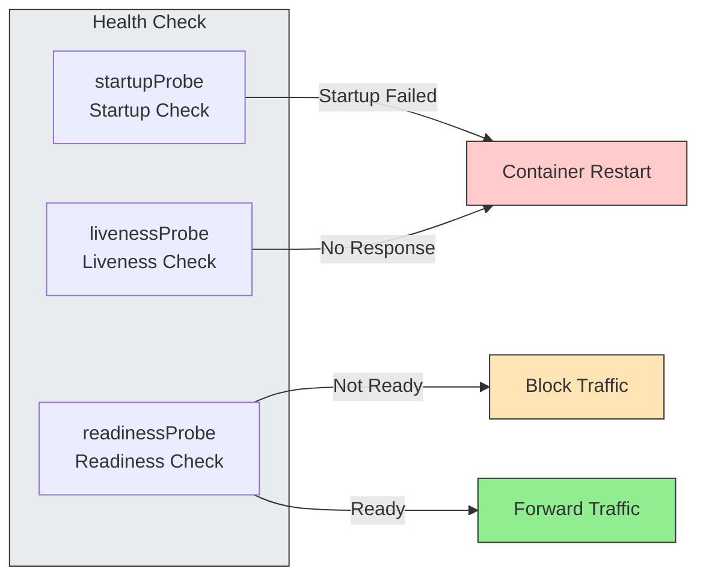
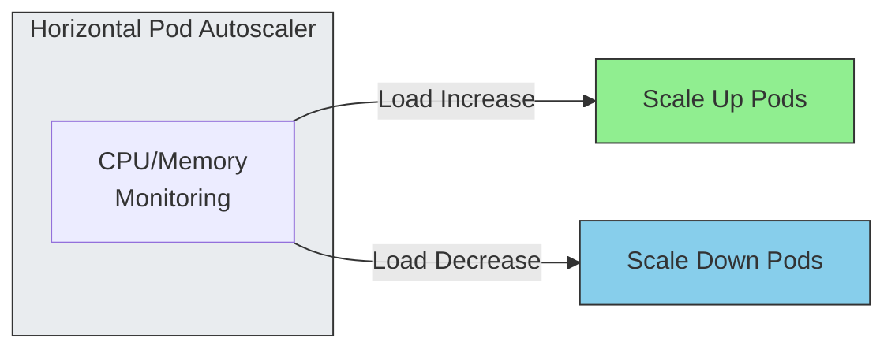
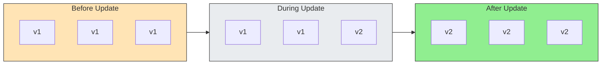
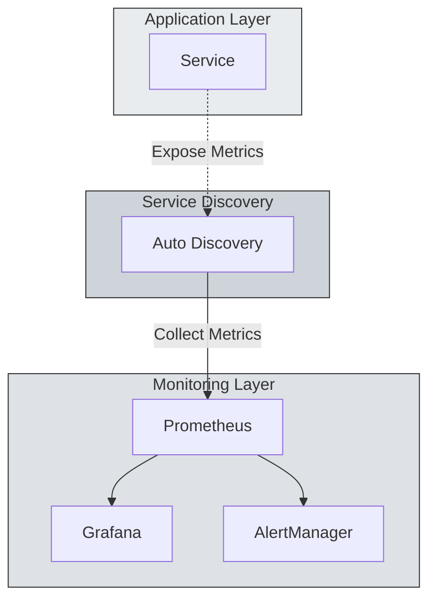
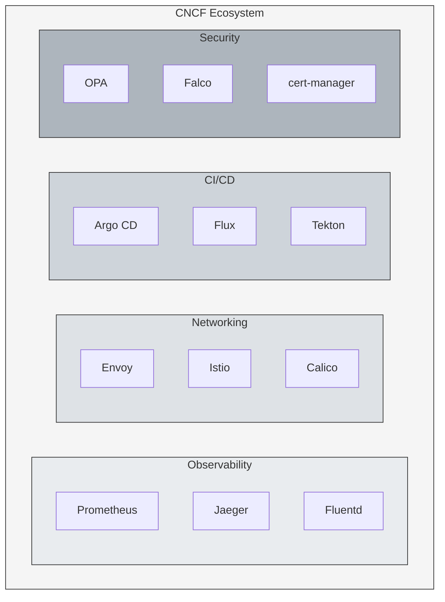

When first encountering Kubernetes, it's easy to feel overwhelmed by its complexity and steep learning curve. However, once you overcome this initial barrier and start applying it in production, you begin to experience the powerful conveniences hidden within that complexity.

<!-- truncate -->

This article introduces four key benefits of Kubernetes that are often overshadowed by the first impression of complexity, but are more apparent to practitioners.

## 1. Code-Based Infrastructure Management

In a Kubernetes environment, all infrastructure environments—development, QA, and production—are managed through YAML manifests. Manual server configuration easily leads to configuration drift between environments, which causes unpredictable failures. Kubernetes solves this problem through declarative configuration.

### Change History Management

All infrastructure changes are recorded in code commit history. Just like managing application code, you can track all infrastructure change history and easily roll back to specific points in time.

### Change Tracking

Since infrastructure is managed as code, you can clearly track who changed what, when, and why. This clarifies team accountability and simplifies the process of finding root causes when issues occur.

### Efficiency and Quality Improvement

Store YAML manifests like Deployment, Service, and ConfigMap in Git, then apply environment-specific differences with Kustomize or Helm. Setting up a new environment is as simple as running `kubectl apply -k overlays/staging`.

Connect GitOps tools like ArgoCD, and deployments complete with just a Git push. If the cluster state differs from Git, it automatically synchronizes. This ensures consistency between infrastructure code and actual state.

Engineers can focus on embedding their experience and expertise into code to improve overall infrastructure quality, rather than spending time on repetitive tasks.

## 2. Automated Service Stabilization

In traditional VM environments, many aspects like IP configuration, various settings, and monitoring system integration had to be handled manually. Kubernetes automates and provides core features for service stability.

### Self-Healing

Kubernetes checks application status through three probes. `startupProbe` confirms startup completion for slow-initializing applications, `livenessProbe` checks if the container is alive and restarts it if unresponsive, and `readinessProbe` checks if it's ready to receive traffic, preventing requests to unprepared Pods.

### Auto-Scaling

You can automatically increase or decrease application Pod count based on load metrics like CPU or memory usage. When traffic spikes, it automatically scales up to maintain stable service, and scales down when traffic decreases to use resources efficiently.

Beyond basic metrics, you can scale based on Prometheus custom metrics or external metrics, enabling fine-tuned adjustments to meet business requirements.

### Rolling Update

When updating applications to new versions, you can deploy without service interruption. Instead of taking down all old version pods at once, new version pods are brought up one by one while old pods are gradually terminated.

Thanks to these automation features, engineers can focus on system design rather than incident response.

## 3. Monitoring Architecture Separation

Many projects face structural challenges when building monitoring and logging systems. Kubernetes solves these problems architecturally.

In the past, development systems and monitoring systems were tightly coupled. Kubernetes ecosystem monitoring tools operate as independent standard components, separate from applications. This enables building consistent monitoring environments from the project's inception.

The mismatch between application scope and monitoring scope is also resolved through service discovery. When new Pods are created, they're automatically added to monitoring targets, ensuring consistent visibility across all environments without impacting development.

## 4. Standardized CNCF Ecosystem

Looking at the CNCF (Cloud Native Computing Foundation) landscape, the numerous listed tools can feel overwhelming. However, this is actually one of Kubernetes' greatest advantages.

This massive ecosystem represents the 'standard' for building IT infrastructure. In the past, you had to find or build solutions for each infrastructure area—storage, networking, CI/CD, security, monitoring.

Within the Kubernetes ecosystem, countless proven open-source tools are ready to use. You simply select and combine the optimal tools for each need. It's like assembling a robust system from well-crafted, high-quality components.

Thanks to this standardized ecosystem, you can build infrastructure quickly and reliably by combining proven tools.

## Conclusion

Kubernetes is certainly a technology that requires a learning process. However, once you get through it, it provides unparalleled convenience and efficiency in terms of infrastructure management, service stability, monitoring, and powerful ecosystem support.

These benefits beyond the first impression of complexity are why so many companies and developers choose Kubernetes. The steep initial learning curve is matched by significant productivity gains afterward.

I hope this article helps those considering adopting Kubernetes.

## References

- [Inflearn - Kubernetes Another Class (Ground Level)](https://inf.run/NzKy)

**Sprint1**

#1. Container Overview [Understanding Container Technology: From Kernel to Kubernetes](/2025/02/01/from-linux-kernel-to-kubernetes)

#2. Kubernetes Installation [Building a Kubernetes Cluster: From Architecture to Networking](/2026/01/05/the-weight-of-kubernetes-installation)

#3. Why Kubernetes is Convenient [4 Practical Benefits of Kubernetes: Beyond the Complexity (Current)](/2026/01/06/kubernetes-practical-benefits)
