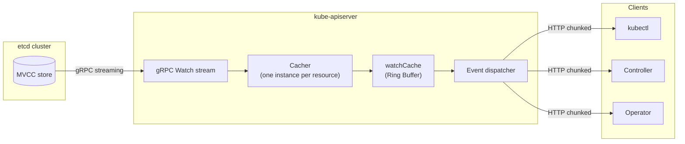
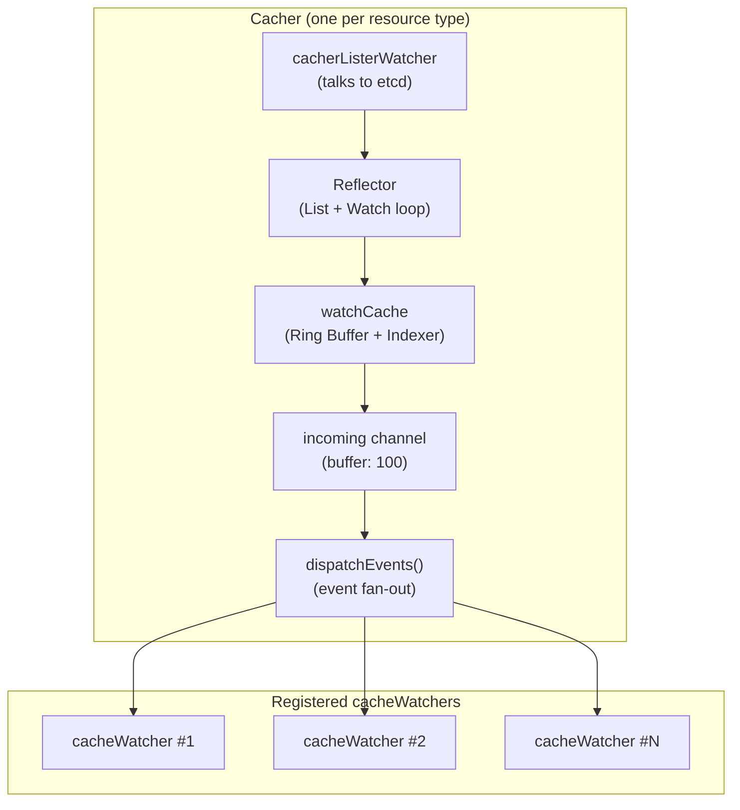
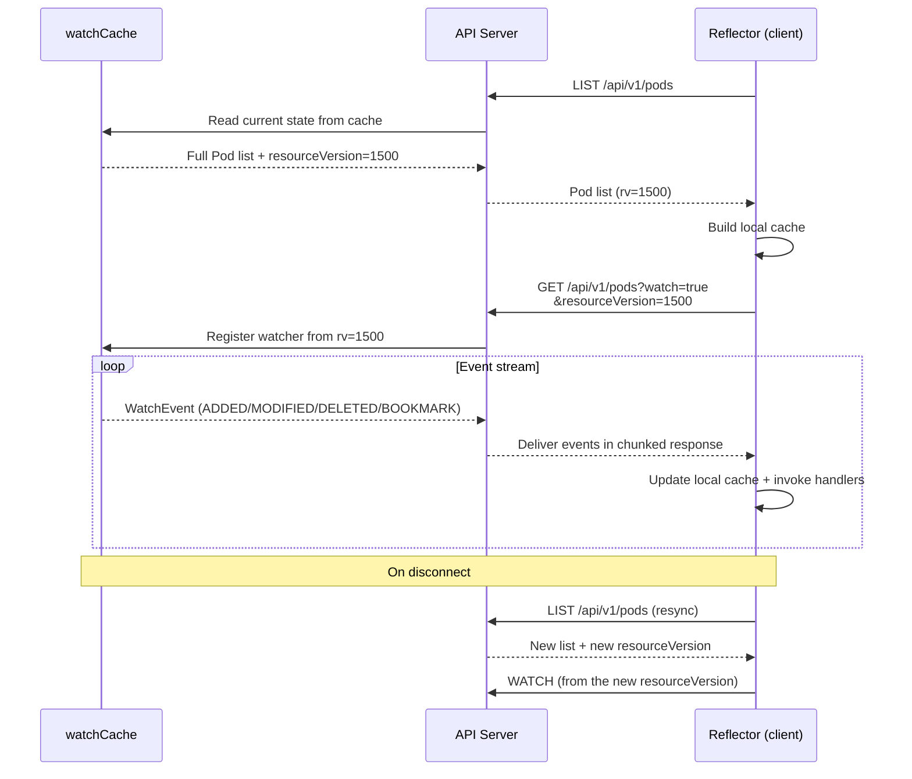
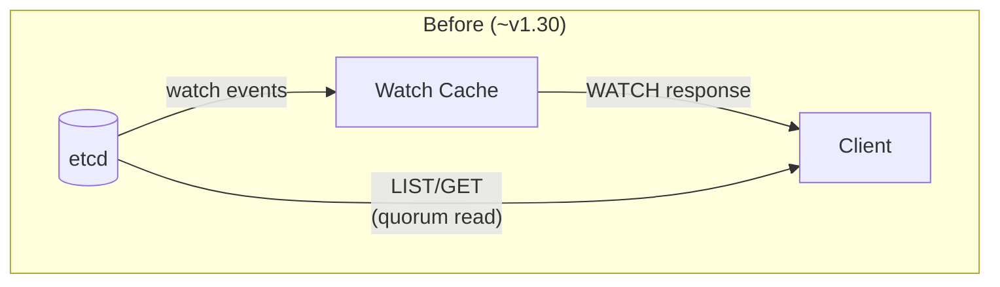
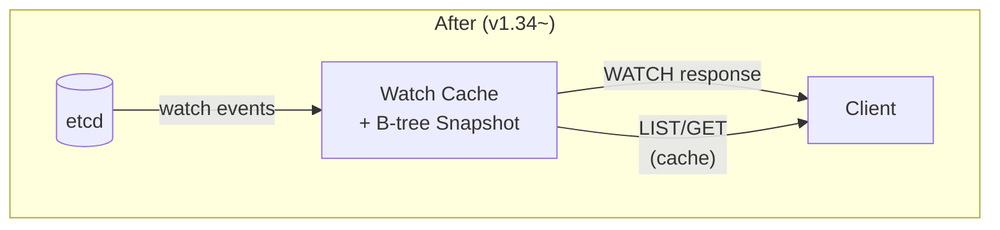
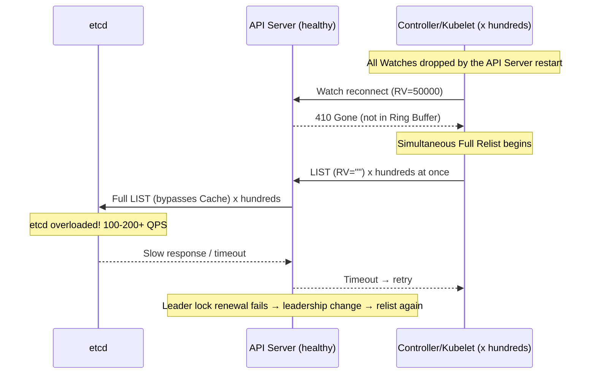
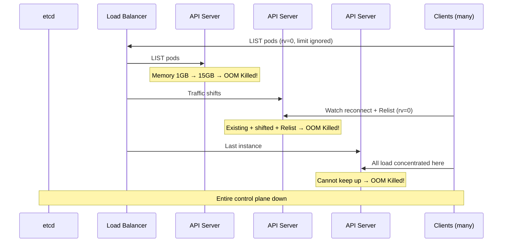

Almost every component of the Kubernetes control plane runs on top of a Watch connection to the API Server. Argo CD, HPA, kubelet, kube-proxy, all of them. When a Watch connection drops, controllers stall, and if they all recover at once, the API Server can go down with them.

This article walks through the internals of the Watch Cache first, then covers what happens when each part of the pipeline breaks.

{/* truncate */}

## Architecture

### The big picture

The Kubernetes Watch pipeline is split into three layers.



When a change happens in etcd, it is delivered to the API Server over a gRPC stream. The Watch Cache inside the API Server stores the event and then fans it out to clients. Clients receive the event stream via HTTP chunked transfer encoding.

### The etcd layer

etcd uses an MVCC (Multi-Version Concurrency Control) model. Every write is assigned a monotonically increasing **revision** number, and previous states are preserved rather than deleted immediately. That makes requests like "tell me only what changed after revision 1500" possible, and Watch works exactly this way. The Kubernetes `resourceVersion` is this etcd revision.

Previous states do not stick around forever, though. **Compaction** periodically discards old revisions (5 minutes by default with kubeadm). A discarded revision can no longer be queried, and that is one of the causes of the `410 Gone` covered later.

### The API Server Watch Cache



The reason the Watch Cache exists is simple: if 1,000 clients each opened a watch against etcd, etcd would die. The Watch Cache opens **exactly one watch per resource type** against etcd and handles event fan-out to thousands of clients in memory. No matter how many clients you add, the load on etcd barely changes.

The component that actually does this work inside the Watch Cache is the **Cacher**. Each resource type (Pod, Service, Secret, and so on) gets its own Cacher instance, and each one receives events from etcd (cacherListerWatcher → Reflector), stores them in a Ring Buffer (watchCache), and fans them out to registered watchers (dispatchEvents).

The **Ring Buffer** inside the Cacher stores only change events (deltas), not the full current state. Events like "Pod A created" or "Pod B status changed" accumulate there. Its size is adjusted dynamically and it holds roughly 75 seconds of history. A watcher that joins midstream can still pick up recent changes, but events older than 75 seconds cannot be recovered, and that is where `410 Gone` comes from.

Each Cacher tracks its own resourceVersion per resource. A high-churn resource like Pod advances its RV quickly, while a resource like RuntimeClass, which you configure once and rarely touch again, sits at the same RV for a long time. You end up with a global RV of 50000 while a specific resource is still at 45000. That gap leads to the Quiet Resource Timeout covered later.

### Clients: the List-Watch pattern



On the client side, the **Reflector** runs the List-Watch loop. At startup it knows nothing about the current state, so it fetches a full snapshot with LIST. After that it opens a WATCH from that resourceVersion and receives only the changes. When several handlers watch the same resource, a **SharedInformer** shares a single watch connection between them to reduce load on the API Server.

If the connection drops, the client automatically reconnects using the last resourceVersion it knows about. If that reconnect fails, meaning the RV is no longer in the Ring Buffer, you get a `410 Gone`.

### How the Watch Cache evolved

The Watch Cache started as a simple buffer and has grown into the layer that serves nearly every read.





The pipeline structure is the same, but the read path (LIST/GET) moved from etcd to the cache.

| Version | Improvement | Effect |
|------|------|------|
| v1.17 | Bookmark events ([KEP-956](https://github.com/kubernetes/enhancements/blob/master/keps/sig-api-machinery/956-watch-bookmark/README.md)) | Fewer 410 Gone |
| v1.24 | Progress Notification ([KEP-1904](https://github.com/kubernetes/enhancements/issues/1904)) | RV updates for quiet resources |
| v1.31 | Consistent Reads from Cache ([KEP-2340](https://github.com/kubernetes/enhancements/issues/2340)) | API Server CPU 30%↓ |
| v1.33 | [StreamingCollectionEncoding](https://kubernetes.io/blog/2024/12/17/kube-apiserver-api-streaming/) | LIST memory ~20x↓ |
| v1.34 | Snapshottable Cache ([KEP-4988](https://github.com/kubernetes/enhancements/issues/4988)) | Nearly all reads served from cache |

## Major failure scenarios

These are the representative scenarios that play out when something breaks at each point in the Watch pipeline.

| Failure point | Scenario | Typical symptom | What to check |
|---|---|---|---|
| Ring Buffer + Compaction | **410 Gone + Thundering Herd** | Spike in `410 Gone` | watch-cache-sizes, rolling upgrade interval |
| rv=0 + List path | **Cascading OOM** | Repeated API Server OOM | LIST response size, CRD count, memory limit |
| Watch Cache Freshness | **Quiet Resource Timeout** | `Too large resource version` | etcd progress notification |
| Asymmetric API Servers | **HA Stale Cache** | Stale data with no error | API Server startup interval |

### 410 Gone and the Thundering Herd

> API Server restart → Watch drops → 410 Gone → simultaneous relist → etcd overload

The trigger is an API Server rolling upgrade or restart.

**Step 1**: when the API Server restarts, the hundreds to thousands of Watches connected to that server all drop at once.

**Step 2**: the disconnected clients try to resume their Watch from the last resourceVersion they know. But the new server's Ring Buffer does not have that RV. The result is `410 Gone`.

**Step 3**: every client that received a 410 starts a Full Relist at the same time. These requests, sent with `resourceVersion=""`, bypass the Watch Cache and go straight to etcd.

**Step 4**: 100 to 200+ QPS of LIST requests pile onto etcd. When etcd gets overloaded and responses slow down, more timeouts occur, timeouts trigger retries, and retries put more pressure back on etcd.

If leader lock renewal also fails, leadership changes hands, and the new leader's Informers relist again, adding even more load. There is a documented case of a production cluster with thousands of nodes being paralyzed for several minutes ([#86483](https://github.com/kubernetes/kubernetes/issues/86483)).



Bookmark events in v1.17 ([KEP-956](https://github.com/kubernetes/enhancements/blob/master/keps/sig-api-machinery/956-watch-bookmark/README.md)) reduced how often 410 happens in the first place, by telling clients the current RV even when nothing changed. The List semantic change in v1.19 ([#86430](https://github.com/kubernetes/kubernetes/issues/86430)) then let the relist after a 410 be served from the Watch Cache, which greatly reduced direct requests to etcd.

On the client side, the Reflector's fixed one-second retry was replaced with exponential backoff plus random jitter ([#87794](https://github.com/kubernetes/kubernetes/issues/87794)), cutting simultaneous relists by about 98%. Efficient Watch Resumption in v1.24 ([KEP-1904](https://github.com/kubernetes/enhancements/issues/1904)) lets the Watch Cache recover quickly even after an API Server restart.

Operationally, you want K8s 1.19 or later. Leave 2 to 3 minutes between rolling upgrade steps, raise `--watch-cache-sizes`, and spread watch connections with `--goaway-chance`.

If you see a spike in `apiserver_request_total{code="410"}` or `etcd_request_duration_seconds` p99 above 500ms, stop the rollout immediately and restart with a larger `--default-watch-cache-size`.

### rv=0 and cascading OOM

> limit ignored on an rv=0 LIST → full dataset returned → memory amplification → cascading OOM

The trigger is cluster growth combined with controller restarts.

**Step 1**: when an Informer initializes, it uses `resourceVersion=0` on its LIST request. This means "it does not have to be the latest, just answer from the Cache."

**Step 2**: when the Watch Cache sees `rv=0`, it silently ignores the `limit` parameter, because the Watch Cache had no continuation token mechanism at the time ([#102672](https://github.com/kubernetes/kubernetes/issues/102672)).

**Step 3**: the client sent `limit=500`, but all 50,000 items come back. The API Server assembles the entire response in memory before sending it, and along the way the data gets copied several times through deep copies, encoding, and HTTP buffers. **A 500MB Pod list amplifies to roughly 5GB of memory.**

**Step 4**: traffic from the server that just got OOM-killed shifts to the next one. That server then takes its existing traffic plus the shifted traffic plus the relist storm, and it too gets OOM-killed. Once the last instance falls, the entire control plane is down.



With 1,000 Pods, a LIST response is around 20MB and causes no trouble at all. At 50,000 Pods it reaches roughly 1GB, and when several Informers start at once the memory multiplies.

APF (API Priority and Fairness) governs CPU but does not protect memory, so this becomes a time bomb that suddenly goes off as you scale. There is a real case where memory climbed to 34GB in an environment with 85,000 Secrets and 30,000 concurrent watchers ([#102259](https://github.com/kubernetes/kubernetes/issues/102259)).

The original approach was WatchList ([KEP-3157](https://github.com/kubernetes/enhancements/blob/master/keps/sig-api-machinery/3157-watch-list/README.md)), which unified LIST + Watch into a single stream, but it was reverted to disabled by default in v1.33. Instead, the Streaming Encoder ([StreamingCollectionEncoding](https://kubernetes.io/blog/2024/12/17/kube-apiserver-api-streaming/)) kept the existing LIST API and introduced per-item streaming encoding, cutting memory by about 20x.

Snapshottable Cache in v1.34 ([KEP-4988](https://github.com/kubernetes/enhancements/issues/4988)) supports pagination even at rv=0, so `limit=500` actually returns 500 items.

Operationally, check that StreamingCollectionEncoding is enabled by default on K8s 1.33+, set a generous memory limit (16GB+), and avoid restarting controllers all at once.

Monitor for spikes in `process_resident_memory_bytes` and for `container_oom_events_total`, and if a cascading OOM starts, take down the Operators driving the load first (`kubectl scale --replicas=0`).

### Quiet Resource Timeout

> The Watch Cache RV for a rarely changing resource falls behind, producing repeated `Too large resource version` errors

For rarely changing resources like RuntimeClass or CSIDriver, the Watch Cache RV never advances. The global RV is 50000 while the RuntimeClass cache RV is still 45000. When a client requests a higher RV, `waitUntilFreshAndBlock()` waits three seconds, times out, and the `Too large resource version` error repeats indefinitely.

```
Failed to list *v1beta1.RuntimeClass:
Timeout: Too large resource version: 50000, current: 45000
```

Progress Notification ([KEP-1904](https://github.com/kubernetes/enhancements/issues/1904), GA in v1.24) solved this. etcd periodically reports its current revision even when nothing has changed, which advances the cache RV. On K8s 1.24+, just check that the `EfficientWatchResumption` feature gate is enabled.

### HA Stale Watch Cache

> Differences in API Server startup time leave some servers returning stale data from their Watch Cache

In an HA cluster, if the API Servers start at different times, the first server's Watch Cache can be left stale. AS-1 starts at T=0 (RV=1000), a resource is created at T=30s pushing the RV to 5000, and AS-2 and AS-3 start at T=2m (RV=5000). At that point AS-1's cache still holds the old data.

The problem is that **no error is raised**. An `rv=0` request returns old data from the stale cache, and repeating the same command produces alternating success and failure.

Symptoms vary: a webhook returns "service not found," Service information goes missing from Pod environment variables, and so on.
It usually resolves within 5 to 10 minutes as the cache catches up, but if the same Pod comes up on two nodes during that window, StatefulSet data can be corrupted.

Consistent Read from Cache ([KEP-2340](https://github.com/kubernetes/enhancements/issues/2340), Beta in v1.31) solves this. On a List, it checks the current RV in etcd and then waits until the cache has caught up to that point.

Operationally, minimize the gap between API Server startups, use `/readyz`-based health checks, and configure `--goaway-chance`.

---

The Watch Cache started as a simple buffer in front of etcd and has become the layer that serves nearly every read. Most of the scenarios above are substantially mitigated on 1.24 and later, and on 1.31+ the read path moved into the cache as well, reducing load on etcd itself.

<details>
<summary>References</summary>

**KEPs & official docs**

- [KEP-956: Watch Bookmarks](https://github.com/kubernetes/enhancements/blob/master/keps/sig-api-machinery/956-watch-bookmark/README.md)
- [KEP-1904: Efficient Watch Resumption](https://github.com/kubernetes/enhancements/issues/1904)
- [KEP-2340: Consistent Reads from Cache](https://github.com/kubernetes/enhancements/issues/2340)
- [KEP-3157: Watch List](https://github.com/kubernetes/enhancements/blob/master/keps/sig-api-machinery/3157-watch-list/README.md)
- [KEP-4988: Snapshottable API Server Cache](https://github.com/kubernetes/enhancements/issues/4988)
- [Kubernetes API Concepts](https://kubernetes.io/docs/reference/using-api/api-concepts/)
- [Consistent Read from Cache Beta (K8s Blog)](https://kubernetes.io/blog/2024/08/15/consistent-read-from-cache-beta/)
- [API Streaming (K8s Blog)](https://kubernetes.io/blog/2024/12/17/kube-apiserver-api-streaming/)
- [Snapshottable API Server Cache (K8s Blog)](https://kubernetes.io/blog/2025/09/09/kubernetes-v1-34-snapshottable-api-server-cache/)

**GitHub Issues**

- [#86483](https://github.com/kubernetes/kubernetes/issues/86483): cluster paralyzed during a rolling upgrade
- [#86430](https://github.com/kubernetes/kubernetes/issues/86430): List semantic change for the relist after 410 Gone
- [#87794](https://github.com/kubernetes/kubernetes/issues/87794): Reflector fixed backoff → exponential backoff
- [#102259](https://github.com/kubernetes/kubernetes/issues/102259): 34GB memory OOM in an 85K Secret environment
- [#102672](https://github.com/kubernetes/kubernetes/issues/102672): limit ignored at rv=0 (intentional design)
- [#118394](https://github.com/kubernetes/kubernetes/issues/118394): confirmed rv=0 pagination does not work
- [#107133](https://github.com/kubernetes/kubernetes/issues/107133): quiet resource reflector infinite loop

**Deep-dive articles**

- [The Anatomy of Kubernetes ListWatch — Michael Gasch](https://www.mgasch.com/2021/01/listwatch-prologue/)
- [Diving into Kubernetes Watch Cache — Pierre Zemb](https://pierrezemb.fr/posts/diving-into-kubernetes-watch-cache/)
- [K8s API Server: Watching and Caching — Daniel Mangum](https://danielmangum.com/posts/k8s-asa-watching-and-caching/)
- [Kubernetes Controllers at Scale — timebertt](https://medium.com/@timebertt/kubernetes-controllers-at-scale-clients-caches-conflicts-patches-explained-aa0f7a8b4332)
- [Kubernetes List API Performance — Ahmet Alp Balkan](https://ahmet.im/blog/kubernetes-list-performance/)

**KubeCon talks**

- [The Life of a Kubernetes Watch Event — KubeCon NA 2018](https://speakerdeck.com/wenjia/life-of-a-kubernetes-watch-event)
- [SIG API Machinery Deep Dive — KubeCon NA 2018](https://speakerdeck.com/sttts/sig-api-machinery-deep-dive-kubecon-na-2018)

</details>
