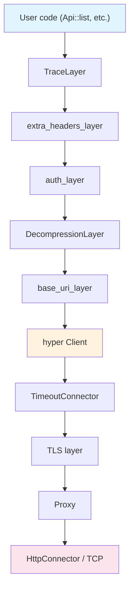
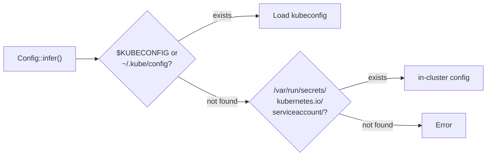

# Client Internals

`Client` is not a simple HTTP client. It is a layered architecture built from a Tower middleware stack, and cloning it is as cheap as cloning an `Arc`. Understanding its internals helps you solve issues around timeouts, authentication, and custom middleware.

## What Client Really Is

```rust title="kube-client/src/client/mod.rs (simplified)"
pub struct Client {
    inner: Buffer<Request<Body>, BoxFuture<'static, Result<Response<Body>, BoxError>>>,
    default_ns: String,
    valid_until: Option<Timestamp>,
}
```

- **`tower::Buffer`**: Wraps the `Service` in an `Arc`. `Client::clone()` is just a reference count increment, so the same Client can be freely shared across multiple `Api<K>` handles.
- **capacity 1024**: The in-flight request capacity of `Buffer`. Up to 1024 requests can be queued simultaneously.
- **`BoxFuture`**: The concrete type of the response future is erased, so the concrete types of the internal middleware stack are not exposed externally.
- **`valid_until`**: The credential expiration time. The Client must be recreated after expiration.

## Tower Middleware Stack

Requests flow from top to bottom, responses flow from bottom to top. Each layer implements the `tower::Layer` trait.



| Layer | Role |
|-------|------|
| **TraceLayer** | Creates OpenTelemetry-compatible HTTP spans. Records tracing information for requests and responses. |
| **extra_headers_layer** | Adds custom headers such as impersonation headers. |
| **auth_layer** | Handles Bearer tokens, exec-based authentication, and automatic token refresh. |
| **DecompressionLayer** | Decompresses gzip responses (requires the `gzip` feature). |
| **base_uri_layer** | Prepends the `cluster_url` prefix to all request URLs. |
| **hyper Client** | Performs the actual transport over HTTP/1.1 + HTTP/2. |
| **TimeoutConnector** | Applies separate timeouts for connect, read, and write operations. |
| **TLS layer** | Handles TLS based on the `rustls-tls` or `openssl-tls` feature. |
| **Proxy** | Routes through SOCKS5/HTTP proxies (`socks5`/`http-proxy` features). |
| **HttpConnector** | Creates TCP connections. |

## Config Inference Chain

`Client::try_default()` internally calls `Config::infer()`. It searches for configuration in the following order.



1. **kubeconfig**: The file pointed to by the `$KUBECONFIG` environment variable, or `~/.kube/config`
2. **in-cluster**: The token and CA certificate from `/var/run/secrets/kubernetes.io/serviceaccount/`
3. If neither is found, an error is returned.

### Default Timeouts

| Setting | Default | Purpose |
|---------|---------|---------|
| `connect_timeout` | 30s | TCP connection establishment |
| `read_timeout` | 295s | Waiting for a response |
| `write_timeout` | 295s | Sending a request |

:::warning[The 295-second timeout trap]
The `read_timeout` is set to 295 seconds to support watch long-polling. However, this same timeout applies to regular GET/PUT/PATCH requests as well.

During a network outage, even a simple `pods.get("name")` can block for nearly 5 minutes.

**Mitigation strategies:**

```rust
// Option 1: Apply a tokio timeout to individual calls
let pod = tokio::time::timeout(
    Duration::from_secs(10),
    pods.get("my-pod")
).await??;

// Option 2: Separate Clients by purpose
let short_cfg = Config::infer().await?;
let short_cfg = Config {
    read_timeout: Some(Duration::from_secs(30)),
    ..short_cfg
};
let api_client = Client::try_from(short_cfg)?;
// Use the default 295s Client for the watcher
```
:::

## Authentication Handling

The auth_layer handles all authentication.

| Method | Behavior |
|--------|----------|
| **Static token** | Adds an `Authorization: Bearer <token>` header. |
| **Client certificate** | Authenticates via mTLS at the TLS layer. |
| **exec plugin** | Calls an external program to obtain a token (e.g., `aws-iam-authenticator` for AWS EKS). |
| **Token refresh** | Automatically refreshes the token before it expires. |

:::warning[Credential rotation during long-running processes]
If credentials are rotated while a watcher is running for an extended period and the connection drops, the reconnection may use stale credentials and fail permanently.

Mitigation: Recreate the Client, or use exec plugin-based authentication to obtain a fresh token on every call.
:::

## Customizing Client

`ClientBuilder` allows you to customize the middleware stack.

```rust
use kube::client::ClientBuilder;

let config = Config::infer().await?;
let client = ClientBuilder::try_from(config)?
    // Custom Tower layers can be added here
    .build();
```

### Pattern: Separating Clients by Purpose

Separating a watcher Client (long timeout) from an API call Client (short timeout) is a common production pattern.

```rust
// Client for watchers — default 295s timeout
let watcher_client = Client::try_default().await?;

// Client for API calls — short timeout
let mut api_config = Config::infer().await?;
api_config.read_timeout = Some(Duration::from_secs(30));
api_config.write_timeout = Some(Duration::from_secs(30));
let api_client = Client::try_from(api_config)?;

// Use api_client in the reconciler
struct Context {
    api_client: Client,
}
```

This way, the watcher maintains its long-polling connection while API calls within the reconciler time out quickly.
