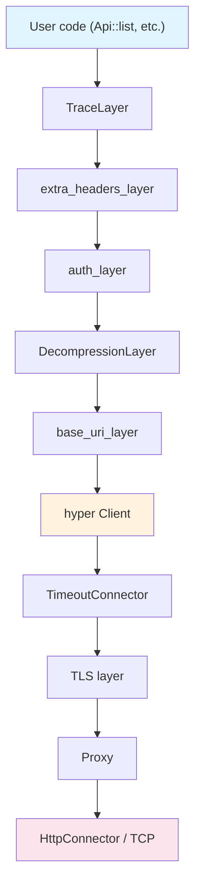
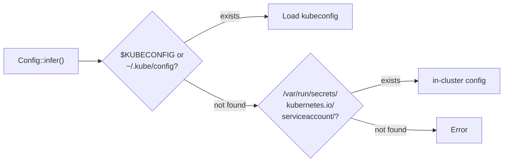

# Client Internals

`Client` is not a simple HTTP client. It is a layered architecture built from a Tower middleware stack, and cloning it is as cheap as cloning an `Arc`. Understanding its internals helps you solve issues around timeouts, authentication, and custom middleware.

## What Client Really Is

```rust title="kube-client/src/client/mod.rs (simplified)"
pub struct Client {
    inner: Buffer<Request<Body>, BoxFuture<'static, Result<Response<Body>, BoxError>>>,
    default_ns: String,
    valid_until: Option<Timestamp>,
}
```

- **`tower::Buffer`**: Wraps the `Service` in an `Arc`. `Client::clone()` is just a reference count increment, so the same Client can be freely shared across multiple `Api<K>` handles.
- **capacity 1024**: The in-flight request capacity of `Buffer`. Up to 1024 requests can be queued simultaneously.
- **`BoxFuture`**: The concrete type of the response future is erased, so the concrete types of the internal middleware stack are not exposed externally.
- **`valid_until`**: The credential expiration time. The Client must be recreated after expiration.

## Tower Middleware Stack

Requests flow from top to bottom, responses flow from bottom to top. Each layer implements the `tower::Layer` trait.



| Layer | Role |
|-------|------|
| **TraceLayer** | Creates OpenTelemetry-compatible HTTP spans. Records tracing information for requests and responses. |
| **extra_headers_layer** | Adds custom headers such as impersonation headers. |
| **auth_layer** | Handles Bearer tokens, exec-based authentication, and automatic token refresh. |
| **DecompressionLayer** | Decompresses gzip responses (requires the `gzip` feature). |
| **base_uri_layer** | Prepends the `cluster_url` prefix to all request URLs. |
| **hyper Client** | Performs the actual transport over HTTP/1.1 + HTTP/2. |
| **TimeoutConnector** | Applies separate timeouts for connect, read, and write operations. |
| **TLS layer** | Handles TLS based on the `rustls-tls` or `openssl-tls` feature. |
| **Proxy** | Routes through SOCKS5/HTTP proxies (`socks5`/`http-proxy` features). |
| **HttpConnector** | Creates TCP connections. |

## Config Inference Chain

`Client::try_default()` internally calls `Config::infer()`. It searches for configuration in the following order.



1. **kubeconfig**: The file pointed to by the `$KUBECONFIG` environment variable, or `~/.kube/config`
2. **in-cluster**: The token and CA certificate from `/var/run/secrets/kubernetes.io/serviceaccount/`
3. If neither is found, an error is returned.

### Default Timeouts

| Setting | Default | Purpose |
|---------|---------|---------|
| `connect_timeout` | 30s | TCP connection establishment |
| `read_timeout` | `None` | Waiting for a response (unlimited) |
| `write_timeout` | `None` | Sending a request (unlimited) |

:::info[Timeout design — per-layer separation]
Previously, `read_timeout` was set to 295 seconds, applying uniformly to both watch long-polling and regular API calls. This caused long-lived connections like exec, attach, and port-forward to break after 295 seconds of idle time ([kube#1798](https://github.com/kube-rs/kube/issues/1798)).

Now, matching the Go client behavior, the global `read_timeout` defaults to `None`, and each layer manages its own timeouts:

- **watcher**: Self-manages idle timeout based on server-side `timeoutSeconds` + margin. Auto-reconnects on network failure.
- **exec/attach/port-forward**: No timeout (can idle indefinitely)
- **API calls in reconciler**: Wrap with `tokio::time::timeout` as needed

```rust
// Guard against slow calls inside reconciler
let pod = tokio::time::timeout(
    Duration::from_secs(10),
    pods.get("my-pod")
).await??;
```
:::

## Authentication Handling

The auth_layer handles all authentication.

| Method | Behavior |
|--------|----------|
| **Static token** | Adds an `Authorization: Bearer <token>` header. |
| **Client certificate** | Authenticates via mTLS at the TLS layer. |
| **exec plugin** | Calls an external program to obtain a token (e.g., `aws-iam-authenticator` for AWS EKS). |
| **Token refresh** | Automatically refreshes the token before it expires. |

:::warning[Credential rotation during long-running processes]
If credentials are rotated while a watcher is running for an extended period and the connection drops, the reconnection may use stale credentials and fail permanently.

Mitigation: Recreate the Client, or use exec plugin-based authentication to obtain a fresh token on every call.
:::

## Customizing Client

`ClientBuilder` allows you to customize the middleware stack.

```rust
use kube::client::ClientBuilder;

let config = Config::infer().await?;
let client = ClientBuilder::try_from(config)?
    // Custom Tower layers can be added here
    .build();
```

### Custom Client Timeouts

Since the global `read_timeout` defaults to `None`, separating clients by purpose is no longer necessary. You can wrap individual calls with `tokio::time::timeout` as needed, or create a short-timeout client for specific use cases.

```rust
// Default Client — no timeout (works for watcher, exec, etc.)
let client = Client::try_default().await?;

// If you need a short timeout for a specific use case
let mut config = Config::infer().await?;
config.read_timeout = Some(Duration::from_secs(30));
let short_timeout_client = Client::try_from(config)?;
```
