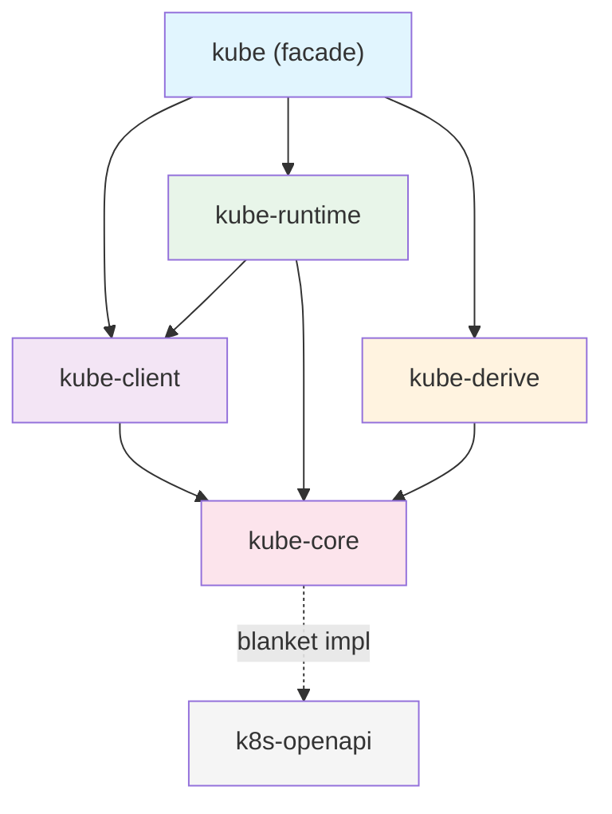

# Crate Structure

kube is not a single crate but a collection of 5 crates separated by responsibility. This section examines why they are split and how they form a layered architecture.

## Why Multiple Crates

kube's crate separation follows the **minimal dependency principle**.

- **kube-core** has no HTTP dependencies. Library crates can import just the Kubernetes types they need.
- **kube-client** handles only the network layer. It provides a Tower middleware-based HTTP client and the `Api<K>` handle.
- **kube-runtime** handles only operator abstractions. It composes watcher, reflector, and Controller to build controller loops.
- **kube-derive** is a proc-macro crate. It handles code generation for `#[derive(CustomResource)]` and similar macros.

Thanks to this separation, you can enable only what you need via feature flags, reducing compile times and binary sizes.

## Layer Diagram



The key point is that **kube-core sits at the bottom**. It defines only types and traits without any HTTP dependencies, and the remaining crates build on top of it.

## Role of Each Crate

### kube-core — Pure Types

Defines the types and traits needed to interact with the Kubernetes API without any HTTP dependencies. It corresponds to Go's `k8s.io/apimachinery`.

Key modules:

| Module | Role | Key Types |
|--------|------|-----------|
| `resource` | Resource abstraction | `Resource` trait, `ResourceExt` |
| `metadata` | Metadata | `ObjectMeta`, `TypeMeta`, `ListMeta` |
| `object` | Object wrappers | `Object<P, U>`, `ObjectList<K>` |
| `params` | API parameters | `ListParams`, `PatchParams`, `Patch` enum |
| `dynamic` | Dynamic typing | `DynamicObject`, `ApiResource` |
| `gvk` | Type information | `GroupVersionKind`, `GroupVersionResource` |
| `request` | Request assembly | `Request` (generates URL path + query, no transmission) |
| `response` | Response types | `Status`, `WatchEvent` |
| `labels` | Label selectors | `Selector`, `Expression` |
| `crd` | CRD extensions | `CustomResourceExt` |
| `error_boundary` | Deserialization guard | `DeserializeGuard` |

The `request` module is central. It assembles the URL path and query parameters for HTTP requests but never actually sends them. This separation is what allows kube-core to remain a pure type crate with no network dependencies.

### kube-client — Network Layer

Provides the HTTP client that communicates with the actual Kubernetes API server. It corresponds to Go's `client-go`.

Key components:

- **`Client`**: A [Tower](https://github.com/tower-rs/tower)-based HTTP client. It is type-erased via `Buffer<BoxService<...>>`, making Clone lightweight. The internal structure is covered in [Client Internals](./client-and-tower-stack.md).
- **`Api<K>`**: A type-safe CRUD handle. It provides Kubernetes API operations like `get()`, `list()`, `patch()`, and `delete()`. The `K: Resource` bound validates the resource type at compile time.
- **`Config`**: Loads configuration from a kubeconfig file or in-cluster environment.
- **`Discovery`**: Queries the API server at runtime for supported resources.

The `Api<K>` constructors provide compile-time validation based on resource scope:

```rust
// Namespace-scoped resource
let pods: Api<Pod> = Api::namespaced(client.clone(), "default");

// Cluster-scoped resource
let nodes: Api<Node> = Api::all(client.clone());

// Creating a Namespace with Api::namespaced() causes a compile error
// let ns: Api<Namespace> = Api::namespaced(client, "default"); // <- won't compile
```

### kube-runtime — Operator Abstractions

Provides the building blocks for implementing the controller pattern. It corresponds to Go's `controller-runtime`.

| Module | Role |
|--------|------|
| `watcher` | Watch stream with automatic reconnection and error recovery |
| `reflector` | Intercepts the watcher stream and writes to an in-memory cache (Store) |
| `controller` | Controller loop combining reflector + scheduling + concurrency control |
| `finalizer` | Helper for pre-deletion cleanup tasks |
| `scheduler` | Delay and deduplication of stream items |
| `events` | Publishing Kubernetes Event resources |
| `wait` | Condition waiting (`await_condition`) |
| `utils` | Stream utilities like `WatchStreamExt` and `predicates` |

How these modules compose together is covered in detail in the [Runtime Internals](../runtime-internals/index.md) section.

### kube-derive — Code Generation

A proc-macro crate that provides three derive macros.

| Macro | Generated Output |
|-------|-----------------|
| `CustomResource` | CRD root struct + `Resource` impl + `CustomResourceExt` impl |
| `Resource` | `Resource` trait impl for existing types |
| `KubeSchema` | `JsonSchema` impl with CEL validation rules |

The details of what `#[derive(CustomResource)]` generates are covered in [CRDs and Derive Macros](../runtime-internals/custom-resources.md).

### kube — Facade

This is the only crate users add to their `Cargo.toml`. It re-exports the 4 crates above based on feature flags.

```rust
// feature = "client" (enabled by default)
pub use kube_client::{api, client, discovery};

// feature = "config" (enabled by default)
pub use kube_client::config;

// feature = "derive"
pub use kube_derive::{CustomResource, Resource, KubeSchema};

// feature = "runtime"
pub use kube_runtime as runtime;

// always available
pub use kube_core as core;
```

## Go Ecosystem Mapping

| kube-rs | Go | Role |
|---------|-----|------|
| kube-core | `k8s.io/apimachinery` | Types, metadata, API parameters |
| kube-client | `client-go` | HTTP client, authentication, configuration |
| kube-runtime | `controller-runtime` | Controllers, watchers, caches |
| kube-derive | kubebuilder (code generation) | CRD struct generation, scaffolding |

Just as using `controller-runtime` in Go implicitly pulls in `client-go` and `apimachinery`, enabling the `runtime` feature in kube brings in kube-runtime along with kube-client and kube-core.

## Feature Flag Guide

kube's default features are `client`, `rustls-tls`, and `ring`. Combine features based on your use case.

### Combinations by Use Case

```toml title="API queries only (default)"
[dependencies]
kube = "3.0.1"
```

```toml title="Controller development"
[dependencies]
kube = { version = "3.0.1", features = ["runtime", "derive"] }
```

```toml title="Pod exec/attach/portforward"
[dependencies]
kube = { version = "3.0.1", features = ["runtime", "derive", "ws"] }
```

```toml title="Types only (no HTTP dependencies)"
[dependencies]
kube-core = "3.0.1"
```

### Full Feature List

| Feature | Default | Description |
|---------|---------|-------------|
| `client` | Yes | `Client`, `Api<K>` |
| `config` | Yes | `Config` (kubeconfig / in-cluster) |
| `rustls-tls` | Yes | Rustls TLS backend |
| `ring` | Yes | Rustls crypto provider |
| `openssl-tls` | | OpenSSL TLS backend (cannot be used with `rustls-tls`) |
| `aws-lc-rs` | | AWS Libcrypto provider (with Rustls) |
| `webpki-roots` | | WebPKI certificate roots (instead of system certificates) |
| `derive` | | `CustomResource`, `Resource`, `KubeSchema` macros |
| `runtime` | | watcher, reflector, Controller |
| `ws` | | WebSocket (exec, attach, portforward) |
| `gzip` | | Response gzip decompression |
| `jsonpatch` | | `Patch::Json` support |
| `oauth` | | OAuth authentication |
| `oidc` | | OIDC authentication |
| `socks5` | | SOCKS5 proxy |
| `http-proxy` | | HTTP proxy |
| `admission` | | Admission webhook types |
| `kubelet-debug` | | Kubelet debug interface |
| `unstable-runtime` | | Experimental runtime features |
| `unstable-client` | | Experimental client features |

## The Role of k8s-openapi

kube itself does not define built-in Kubernetes types like `Pod`, `Deployment`, or `Service`. These types are provided by a separate crate, [k8s-openapi](https://docs.rs/k8s-openapi).

kube-core provides a **blanket impl** for all k8s-openapi types:

```rust title="Blanket impl in kube-core (simplified)"
impl<K, S> Resource for K
where
    K: k8s_openapi::Metadata<Ty = ObjectMeta>,
    K: k8s_openapi::Resource<Scope = S>,
{
    type DynamicType = ();
    type Scope = S;
    // kind(), group(), version(), etc. are derived from K::KIND, K::GROUP, K::VERSION
}
```

Thanks to this blanket impl, all k8s-openapi types (`Pod`, `Service`, `Deployment`, etc.) automatically implement kube's `Resource` trait. Users do not need to write any impl themselves.

```toml title="Cargo.toml"
[dependencies]
kube = { version = "3.0.1", features = ["runtime", "derive"] }
k8s-openapi = { version = "0.27.0", features = ["latest", "schemars"] }
```

The `latest` feature in k8s-openapi activates the Kubernetes API version that matches the kube version. The `schemars` feature is required for CRD schema generation.

:::warning[Only one version feature]
You must enable only **one** version feature (`latest`, `v1_32`, etc.) for k8s-openapi. Enabling multiple simultaneously causes a compile error.
:::
