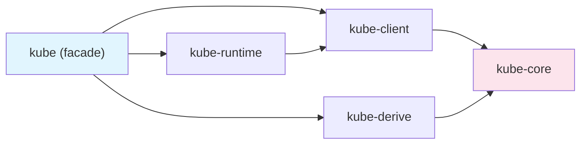

# Architecture

This section covers how kube is organized internally. It traces the division of responsibilities across 5 crates, the `Resource` trait-based type system, the HTTP client built with Tower middleware, and the full code path that a single API call traverses.

## What This Section Covers

| Document | Key Question |
|----------|-------------|
| [Crate Structure](./crate-overview.md) | Why is it split into 5 crates, and what does each one do? |
| [Resource Trait and Type System](./resource-type-system.md) | What compile-time safety guarantees does it provide? |
| [Client Internals](./client-and-tower-stack.md) | What middleware does an HTTP request pass through? |
| [Journey of a Request](./request-lifecycle.md) | What code path does a single `pods.list()` call take? |

After reading this section, you will understand why kube's design decisions were made and which layer to look at when troubleshooting issues.
