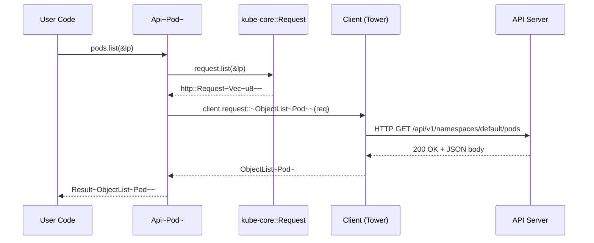
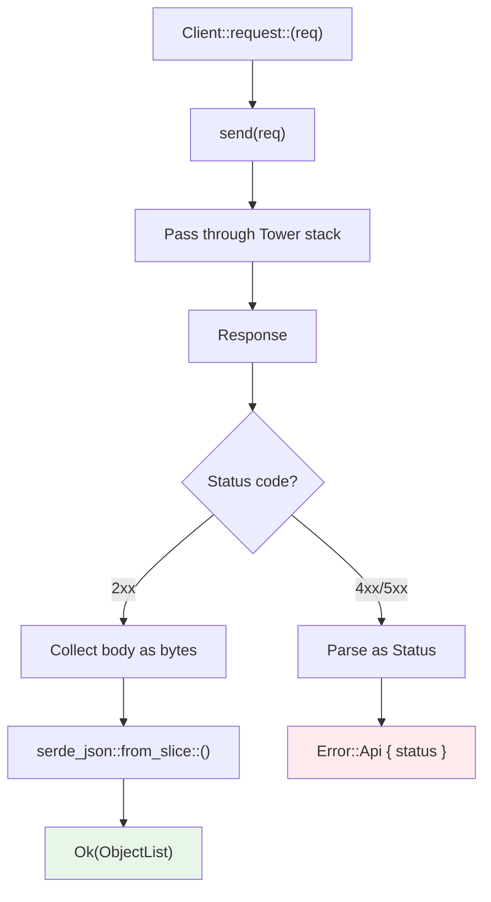

# Journey of a Request

This section traces how a single `pods.list()` call internally passes through code to reach the Kubernetes API server and how the response comes back.

## The Calling Code

```rust
let client = Client::try_default().await?;
let pods: Api<Pod> = Api::default_namespaced(client);
let list = pods.list(&ListParams::default()).await?;
```

Let's follow the full path these three lines take internally.

## Overall Flow



## Inside Api&lt;K&gt;

`Api<K>` is a thin wrapper that connects kube-core's URL builder with the Client.

```rust title="kube-client/src/api/mod.rs (simplified)"
pub struct Api<K> {
    request: kube_core::Request,   // URL path builder
    client: Client,
    namespace: Option<String>,
    _phantom: std::iter::Empty<K>, // Instead of PhantomData — guarantees Send
}
```

Internal behavior when `list()` is called:

1. `self.request.list(&lp)` — Builds an `http::Request<Vec<u8>>`.
2. The URL is assembled: `/api/v1/namespaces/{ns}/pods?limit=...&labelSelector=...`
3. An extension is added to the request (the string `"list"` for tracing purposes).
4. The actual request is sent via `self.client.request::<ObjectList<Pod>>(req).await`.

## kube-core::Request — URL Builder

`kube_core::Request` is a pure builder that holds the URL path.

```rust title="kube-core/src/request.rs (conceptual)"
pub struct Request {
    url_path: String, // e.g., "/api/v1/namespaces/default/pods"
}

impl Request {
    pub fn list(&self, lp: &ListParams) -> Result<http::Request<Vec<u8>>> {
        let url = format!("{}?{}", self.url_path, lp.as_query_string());
        http::Request::builder()
            .method("GET")
            .uri(url)
            .body(vec![])
    }
}
```

The key point is that **no network transmission occurs at all**. Each method like `list()`, `get()`, `create()`, and `watch()` simply returns an `http::Request` with the appropriate HTTP method and query parameters assembled. This separation allows kube-core to be tested without any network dependencies.

## Request Execution Through Client

The `Client::request::<T>(req)` method executes the actual request.



1. **`send(req)`**: Sends the HTTP request through the [Tower middleware stack](./client-and-tower-stack.md).
2. **Error handling (`handle_api_errors`)**: Checks the status code.
   - 4xx/5xx: Parses the response body into a `Status` struct and returns `Error::Api`.
   - 2xx: Continues with normal processing.
3. **Deserialization**: Collects the response body as bytes, then converts it with `serde_json::from_slice::<T>()`.

### Error Branches

| Error Type | Type | When It Occurs |
|------------|------|----------------|
| Network error | `Error::HyperError` | TCP connection failure, DNS resolution failure, etc. |
| HTTP error | `Error::HttpError` | HTTP protocol-level errors |
| API error | `Error::Api { status }` | 4xx/5xx returned by Kubernetes |
| Deserialization error | `Error::SerializationError` | JSON parsing failure |

The `status` field of `Error::Api` is a structured error sent by the Kubernetes API server:

```rust
let err = pods.get("nonexistent").await.unwrap_err();
if let kube::Error::Api(status) = err {
    println!("code: {}", status.code);       // 404
    println!("reason: {}", status.reason);    // "NotFound"
    println!("message: {}", status.message);  // "pods \"nonexistent\" not found"
}
```

## The Special Nature of Watch Requests

Regular requests complete with a request-response cycle, but watch requests return a **long-lived stream**.

```rust
// Regular request: done when it completes
let list = pods.list(&lp).await?;

// Watch request: infinite stream
let mut stream = pods.watch(&WatchParams::default(), "0").await?;
while let Some(event) = stream.try_next().await? {
    // Process each WatchEvent one by one
}
```

### Internal Behavior

`Client::request_events::<T>(req)` handles the watch stream:

1. `send(req)` -> `Response<Body>` (chunked transfer encoding)
2. Convert Body to `AsyncBufRead`
3. Split by lines (each line is a single JSON object)
4. Deserialize each line into `WatchEvent<T>`
5. Return `TryStream<Item = Result<WatchEvent<T>>>`

### WatchEvent

The API server sends five types of events:

```rust
pub enum WatchEvent<K> {
    Added(K),               // Resource was created
    Modified(K),            // Resource was modified
    Deleted(K),             // Resource was deleted
    Bookmark(Bookmark),     // Progress marker (updates resourceVersion)
    Error(Box<Status>),     // Error sent by the API server (e.g., 410 Gone)
}
```

`Bookmark` is not an actual resource change. It is a marker periodically sent by the API server to communicate the current `resourceVersion`. When a connection drops and reconnects, the watch can resume from this `resourceVersion`.

:::tip[raw watch vs watcher()]
`Api::watch()` is a raw watch stream. It ends when the connection drops and has no handling for `resourceVersion` expiration. In production, use `kube_runtime::watcher()`, which adds automatic reconnection and error recovery on top.

The internal workings of watcher are covered in [Watcher State Machine](../runtime-internals/watcher.md).
:::
