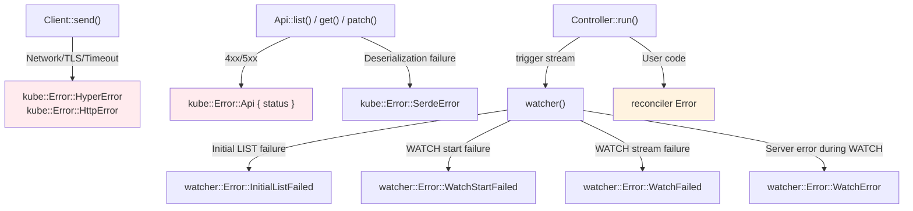

# Error Handling and Backoff

Errors in kube occur at multiple layers. This section maps out where different errors originate and how to handle them at each layer.

## Error Source Map



| Layer | Error Type | Cause |
|-------|-----------|-------|
| Client | `HyperError`, `HttpError` | Network, TLS, timeout |
| Api | `Api(Status)` | Kubernetes 4xx/5xx response |
| Api | `SerdeError` | JSON deserialization failure |
| watcher | `InitialListFailed` | Initial LIST failure |
| watcher | `WatchStartFailed` | WATCH connection failure |
| watcher | `WatchFailed` | WATCH stream failure mid-connection |
| watcher | `WatchError` | Server error during WATCH (410 Gone, etc.) |
| Controller | reconciler Error | Raised in user code |

## Watcher Errors and Backoff

Watcher errors are **soft errors** — the watcher retries on all failures (including 403s, network issues) because external circumstances may improve. They should never be **silently** discarded.

The key requirement is attaching a backoff to the watcher stream:

```rust
// ✗ Without backoff, errors cause a tight retry loop
let stream = watcher(api, wc);

// ✓ Automatic retry with exponential backoff
let stream = watcher(api, wc).default_backoff();
```

### default_backoff

Applies `ExponentialBackoff`: base 800ms, factor 2, max 30s, with jitter enabled. The backoff resets when a successful event is received.

### Custom backoff

```rust
use backon::ExponentialBuilder;

let stream = watcher(api, wc).backoff(
    ExponentialBuilder::default()
        .with_min_delay(Duration::from_millis(500))
        .with_max_delay(Duration::from_secs(30)),
);
```

## Reconciler Errors and error_policy

### Defining error types

`Controller::run` requires `std::error::Error + Send + 'static` on the error type. While modern `anyhow` (1.0.65+) satisfies these bounds, it causes ergonomic issues with the `finalizer::Error` wrapper and loses the ability to distinguish error types in `error_policy`. Define a concrete error type with `thiserror`:

```rust
#[derive(Debug, thiserror::Error)]
enum Error {
    #[error("Kubernetes API error: {0}")]
    KubeApi(#[from] kube::Error),

    #[error("Missing spec field: {0}")]
    MissingField(String),

    #[error("External service error: {0}")]
    External(String),
}
```

### error_policy

When the reconciler returns `Err`, `error_policy` is called to decide the next action:

```rust
fn error_policy(obj: Arc<MyResource>, err: &Error, ctx: Arc<Context>) -> Action {
    tracing::error!(?err, "reconcile failed");

    match err {
        // Transient error: retry
        Error::KubeApi(_) => Action::requeue(Duration::from_secs(5)),
        // Permanent error: don't retry
        Error::MissingField(_) => Action::await_change(),
    }
}
```

You can distinguish transient from permanent errors:

| Type | Examples | Handling |
|------|----------|---------|
| Transient | Network error, timeout, 429 | Requeue via `error_policy` |
| Permanent | Invalid spec, bad config | Record condition on status + `Action::await_change()` |

### Current Limitations

- `error_policy` is a **synchronous function**. It cannot perform async operations (sending metrics, updating status, etc.)
- There is no success reset callback. To implement per-key backoff, you need to wrap the reconciler ([Per-key backoff pattern](./reconciler.md#per-key-backoff-pattern))

## Client-Level Retries

By default, kube-client does not retry regular API calls. When `create()`, `patch()`, `get()`, etc. fail, they return the error as-is.

Since version 3, kube provides a built-in [`RetryPolicy`](https://docs.rs/kube/latest/kube/client/retry/struct.RetryPolicy.html) that implements Tower's retry middleware. It retries on 429, 503, and 504 with exponential backoff:

```rust
use kube::client::retry::RetryPolicy;
use tower::{ServiceBuilder, retry::RetryLayer, buffer::BufferLayer};

let service = ServiceBuilder::new()
    .layer(config.base_uri_layer())
    .option_layer(config.auth_layer()?)
    .layer(BufferLayer::new(1024))
    .layer(RetryLayer::new(RetryPolicy::default()))
    // ...
```

`RetryPolicy` specifically retries **429**, **503**, and **504** responses. It does not retry network errors or other 5xx codes.

### Retry across layers

The table below summarizes where different errors should be handled. Note that `RetryPolicy` only covers the client layer — other errors require handling at other layers:

| Error | Retryable | Where to handle |
|-------|-----------|-----------------|
| 429, 503, 504 | Yes | Client layer: `RetryPolicy` (if configured) |
| Other 5xx | Depends | Reconciler: `error_policy` or custom Tower middleware |
| Timeout / Network | Yes | Reconciler: `error_policy` requeue, or watcher: backoff |
| 4xx (400, 403, 404) | No | Fix the request or RBAC |
| 409 Conflict | Depends | SSA: field manager conflict. Non-SSA: resourceVersion conflict |

## Timeout Strategy

If you need to guard against slow API calls in your reconciler, you can wrap individual calls with `tokio::time::timeout`:

```rust
// First ? unwraps the timeout Result<T, Elapsed>
// Second ? unwraps the API Result<Pod, kube::Error>
let pod = tokio::time::timeout(
    Duration::from_secs(10),
    api.get("my-pod"),
).await??;
```

In a Controller context, stream timeouts rely internally on watcher timeouts and can be configured via stream backoff parameters and `watcher::Config`. Only individual API calls inside your reconciler typically need shorter timeouts.
