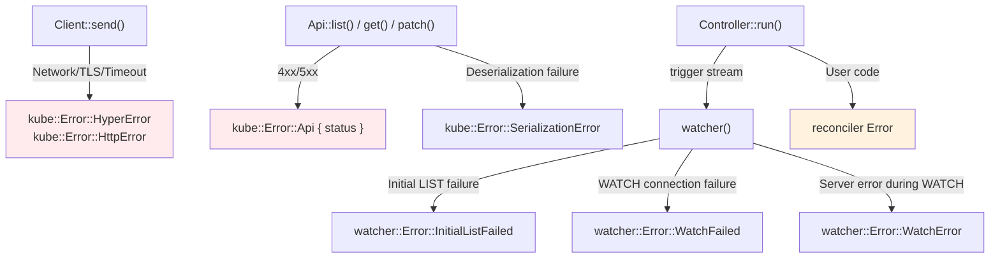

# Error Handling and Backoff

Errors in kube occur at multiple layers. This section maps out where different errors originate and how to handle them at each layer.

## Error Source Map



| Layer | Error Type | Cause |
|-------|-----------|-------|
| Client | `HyperError`, `HttpError` | Network, TLS, timeout |
| Api | `Error::Api { status }` | Kubernetes 4xx/5xx response |
| Api | `SerializationError` | JSON deserialization failure |
| watcher | `InitialListFailed` | Initial LIST failure |
| watcher | `WatchFailed` | WATCH connection failure |
| watcher | `WatchError` | Server error during WATCH (410 Gone, etc.) |
| Controller | reconciler Error | Raised in user code |

## Watcher Errors and Backoff

:::warning[You must attach a backoff]
```rust
// ✗ Stream terminates on first error → Controller stops
let stream = watcher(api, wc);

// ✓ Automatic retry with exponential backoff
let stream = watcher(api, wc).default_backoff();
```
:::

### default_backoff

Applies `ExponentialBackoff`: 800ms → 1.6s → 3.2s → ... → 30s (max). The backoff resets when a successful event is received. If no errors occur for 120 seconds, the timer also resets.

### Custom backoff

```rust
use backon::ExponentialBuilder;

let stream = watcher(api, wc).backoff(
    ExponentialBuilder::default()
        .with_min_delay(Duration::from_millis(500))
        .with_max_delay(Duration::from_secs(30)),
);
```

## Reconciler Errors and error_policy

```rust
fn error_policy(obj: Arc<MyResource>, err: &Error, ctx: Arc<Context>) -> Action {
    tracing::error!(?err, "reconcile failed");

    match err {
        // Transient error: retry
        Error::KubeApi(_) => Action::requeue(Duration::from_secs(5)),
        // Permanent error: don't retry
        Error::MissingField(_) => Action::await_change(),
    }
}
```

`Controller::run(reconcile, error_policy, ctx)`:
- When the reconciler returns `Err`, `error_policy` is called
- Schedules according to the `Action` returned by `error_policy`

### Current Limitations

- `error_policy` is a **synchronous function**. It cannot perform async operations (sending metrics, updating status, etc.)
- There is no success reset callback. To implement per-key backoff, you need to wrap the reconciler ([Per-key backoff pattern](./reconciler.md#per-key-backoff-pattern))

## Client-Level Retries

kube-client does not have built-in retries for regular API calls. When `create()`, `patch()`, `get()`, etc. fail, they return the error as-is.

To implement retries yourself, use Tower's retry middleware:

```rust
use tower::retry::Policy;

struct RetryPolicy;

impl Policy<Request<Body>, Response<Body>, Error> for RetryPolicy {
    // Only retry on 5xx, timeouts, and network errors
    // Don't retry on 4xx (the request itself is wrong)
}
```

### Retryability

| Error | Retryable | Reason |
|-------|-----------|--------|
| 5xx | Yes | Temporary server failure |
| Timeout | Yes | Temporary network issue |
| 429 Too Many Requests | Yes | Rate limit → wait and retry |
| Network error | Yes | Temporary connection failure |
| 4xx (400, 403, 404, etc.) | No | The request is wrong |
| 409 Conflict | No | SSA conflict → fix the logic |

## Timeout Strategy

As covered in [Client internals](../architecture/client-and-tower-stack.md), the default `read_timeout` is set to 295 seconds for watches, which can cause regular API calls to block for up to 5 minutes.

### Mitigation 1: Separate Clients

```rust
// Client for watchers (default 295s)
let watcher_client = Client::try_default().await?;

// Client for API calls (short timeout)
let mut config = Config::infer().await?;
config.read_timeout = Some(Duration::from_secs(15));
let api_client = Client::try_from(config)?;
```

### Mitigation 2: Wrap Individual Calls

```rust
let pod = tokio::time::timeout(
    Duration::from_secs(10),
    api.get("my-pod"),
).await??;
```

### Mitigation 3: Not a Big Issue in Controllers

The watchers managed by the Controller need long timeouts. You only need to wrap the API calls inside the reconciler with a timeout.
