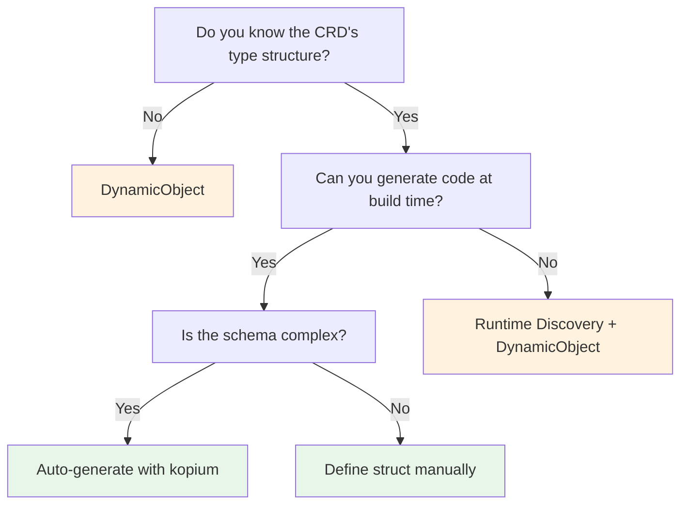

# Third-Party CRDs

There are several ways to work with CRDs you didn't create yourself, such as Istio VirtualService or Cert-Manager Certificate, in kube. Understand the trade-offs of each approach and choose the one that fits your situation.

## Which Approach Should You Choose?



See the detailed explanation of each approach below and the [comparison summary](#comparison-summary).

:::warning[Common confusion]
`#[derive(CustomResource)]` is for **defining** a CRD (generating CRD YAML, registering a new resource type in Kubernetes).

To **consume** an existing CRD, use the approaches below.

"I want to read Istio VirtualService" ≠ "I want to create a new CRD"
:::

## Approach 1: DynamicObject

The fastest way to get started without any type definitions.

```rust
use kube::core::{DynamicObject, ApiResource, GroupVersionKind};

let gvk = GroupVersionKind::gvk("networking.istio.io", "v1", "VirtualService");
let ar = ApiResource::from_gvk(&gvk);
let api = Api::<DynamicObject>::namespaced_with(client, "default", &ar);

let vs = api.get("my-virtualservice").await?;
let hosts = vs.data["spec"]["hosts"].as_array();
```

| Pros | Cons |
|------|------|
| No type definitions needed | Field access is via `serde_json::Value` |
| Zero lines of code to start | No IDE autocompletion |
| Unaffected by schema changes | Risk of runtime errors |

Suitable for prototyping or when you only need to read a few fields.

## Approach 2: Define Structs Manually

For type-safe usage, define the spec/status structs yourself.

```rust
use kube::core::{Object, NotUsed};

#[derive(Clone, Debug, Serialize, Deserialize)]
pub struct VirtualServiceSpec {
    pub hosts: Vec<String>,
    pub http: Option<Vec<HttpRoute>>,
}

#[derive(Clone, Debug, Serialize, Deserialize)]
pub struct HttpRoute {
    pub route: Vec<RouteDestination>,
}

// Wrap with Object<Spec, Status>
type VirtualService = Object<VirtualServiceSpec, NotUsed>;
```

Using `Object<P, U>` lets you access spec/status in a type-safe way while specifying the GVK at runtime via `ApiResource`. See [DynamicType Usage](../architecture/resource-type-system.md#using-dynamictype) for more details.

| Pros | Cons |
|------|------|
| Type safe | Must define the entire schema manually |
| IDE autocompletion | Manual updates when upstream schema changes |

Suitable for long-term use with stable CRDs.

## Approach 3: kopium

:::warning[Unstable project]
kopium is an experimental project, and its API and generated output may change. For production use, it is recommended to review the generated code and include it in version control.
:::

[kopium](https://github.com/kube-rs/kopium) is a tool that automatically generates Rust structs from CRD YAML.

```bash
# Generate Rust code from CRD YAML
kopium -f virtualservice-crd.yaml --schema=derived > src/virtualservice.rs
```

Generated output:

```rust
#[derive(CustomResource, Clone, Debug, Serialize, Deserialize, JsonSchema)]
#[kube(group = "networking.istio.io", version = "v1", kind = "VirtualService")]
#[kube(namespaced)]
pub struct VirtualServiceSpec {
    pub hosts: Vec<String>,
    pub http: Option<Vec<HttpRoute>>,
    // ... auto-generated from CRD schema
}
```

| Pros | Cons |
|------|------|
| No manual type definitions needed | Requires kopium tool installation |
| Accurate type generation from schema | Must manage generated code yourself |

You can call kopium from `build.rs` to automatically regenerate types at build time.

## Discovery API

You can query at runtime which resources exist in the cluster.

```rust
use kube::discovery::Discovery;

let discovery = Discovery::new(client.clone()).run().await?;

// Explore groups
for group in discovery.groups() {
    for (ar, caps) in group.recommended_resources() {
        println!("{}/{} (scope: {:?})", ar.group, ar.kind, caps.scope);
    }
}

// Convert a specific GVK → ApiResource
let (ar, caps) = discovery.resolve_gvk(&gvk)?;
let api = Api::<DynamicObject>::all_with(client, &ar);
```

Use cases:
- Check if a specific CRD is installed in the cluster
- Obtain an `ApiResource` from a GVK to determine URL path and scope
- Build tools like `kubectl api-resources`

## Controller::new_with — Dynamic Type Controller

Creating a Controller with `DynamicObject` lets you watch CRDs without defining Rust structs at compile time.

```rust
use kube::core::{DynamicObject, ApiResource, GroupVersionKind};
use kube::runtime::Controller;

let gvk = GroupVersionKind::gvk("example.com", "v1", "MyResource");
let ar = ApiResource::from_gvk(&gvk);
let api = Api::<DynamicObject>::all_with(client, &ar);

Controller::new_with(api, wc, ar)
    .run(reconcile, error_policy, ctx)
```

`new_with()` explicitly accepts a `DynamicType`, so it is used for types like `DynamicObject` where `DynamicType` is not `Default`. Combined with the Discovery API, you can determine watch targets at runtime.

## Comparison Summary

| Approach | Type Safe | Setup Cost | Maintenance | Best For |
|----------|----------|-----------|-------------|----------|
| DynamicObject | None | None | None | Prototypes, reading a few fields |
| Manual struct | Yes | High | Manual | Stable CRDs, long-term use |
| kopium | Yes | Medium | Regeneration | Complex CRDs, automation possible |
| Discovery + Dynamic | None | None | None | Determining resource types at runtime |
