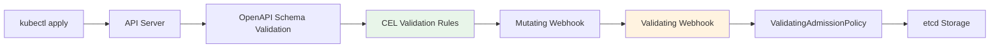
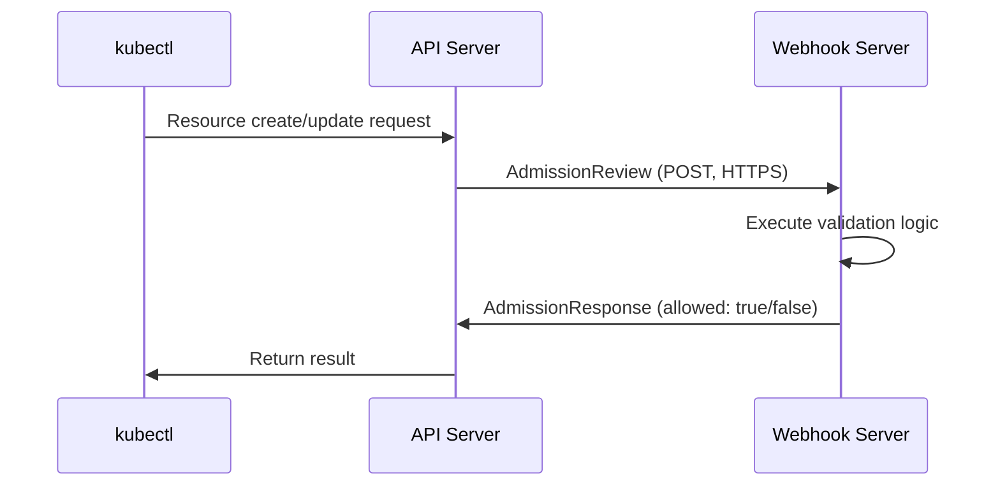
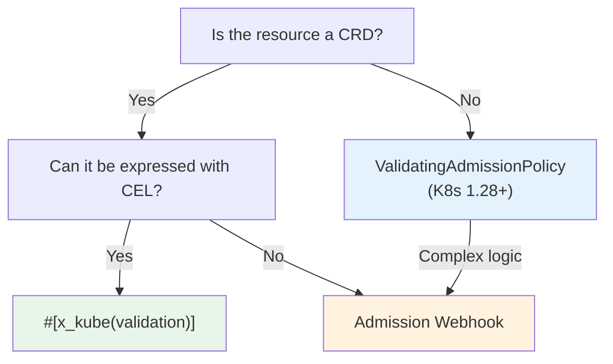

# Admission Validation

Covers the validation layer that validates Kubernetes resources before they are stored in the API server. kube-rs supports both CEL validation within CRD schemas and Admission Webhooks.

## Validation Layer Overview

A resource passes through multiple validation stages before being stored in etcd:



| Layer | Location | Pros | Cons |
|-------|----------|------|------|
| CRD Schema (CEL) | Inside API server | No external service needed, fast | CRD resources only, limited expressiveness |
| Admission Webhook | External service | Arbitrary logic, all resources | Adds availability dependency |
| ValidatingAdmissionPolicy | Inside API server | No external service needed, all resources | Requires K8s 1.28+ |
| External Framework | Policy engine | Policy management UI, auditing | Separate infrastructure |

## CEL Validation

### KubeSchema derive

`#[derive(KubeSchema)]` generates a `JsonSchema` implementation that includes CEL validation rules. It adds CEL rules on top of the basic schema generation discussed in [CRDs and Derive Macros](../runtime-internals/custom-resources.md).

```rust title="kube-derive/src/lib.rs (simplified)"
#[proc_macro_derive(KubeSchema, attributes(x_kube, schemars, validate))]
pub fn derive_schema_validation(input: proc_macro::TokenStream) -> proc_macro::TokenStream {
    cel_schema::derive_validated_schema(input.into()).into()
}
```

`KubeSchema` replaces the `JsonSchema` derive. Use it together with `CustomResource`:

```rust
use kube::CustomResource;
use kube::core::KubeSchema;
use serde::{Serialize, Deserialize};

#[derive(CustomResource, KubeSchema, Serialize, Deserialize, Clone, Debug)]
#[kube(group = "example.com", version = "v1", kind = "Document")]
#[kube(namespaced, status = "DocumentStatus")]
pub struct DocumentSpec {
    pub title: String,
    pub content: String,
    pub replicas: i32,
}
```

### x_kube validation Rules

Add CEL validation rules with the `#[x_kube(validation)]` attribute. It can be applied at both the struct level and field level.

#### Struct-level Validation

```rust
#[derive(CustomResource, KubeSchema, Serialize, Deserialize, Clone, Debug)]
#[kube(group = "example.com", version = "v1", kind = "Document")]
#[x_kube(validation = "self.spec.replicas <= 10")]
pub struct DocumentSpec {
    pub title: String,
    pub replicas: i32,
}
```

The following is added to the generated CRD schema:

```yaml
x-kubernetes-validations:
  - rule: "self.spec.replicas <= 10"
```

#### Field-level Validation

```rust
pub struct DocumentSpec {
    #[x_kube(validation = Rule::new("self != ''").message("title must not be empty"))]
    pub title: String,

    #[x_kube(validation = Rule::new("self >= 1 && self <= 100").reason("FieldValueInvalid"))]
    pub replicas: i32,
}
```

The `Rule` builder attaches messages and reasons to CEL expressions.

#### Immutable Fields (Transition Rules)

CEL rules that compare `self` and `oldSelf` act as **transition rules**. They are evaluated only on UPDATE requests:

```rust
#[derive(CustomResource, KubeSchema, Serialize, Deserialize, Clone, Debug)]
#[kube(group = "example.com", version = "v1", kind = "Document")]
#[x_kube(validation = "self.spec.storageClass == oldSelf.spec.storageClass")]
pub struct DocumentSpec {
    pub storage_class: String,
    pub content: String,
}
```

#### kube Attribute-level Validation

You can also specify top-level CEL rules using `#[kube(validation = ...)]`:

```rust
#[derive(CustomResource, KubeSchema, Serialize, Deserialize, Clone, Debug)]
#[kube(
    group = "example.com",
    version = "v1",
    kind = "Singleton",
    validation = Rule::new("self.metadata.name == 'singleton'"),
)]
pub struct SingletonSpec {
    pub config: String,
}
```

### merge_strategy

Control Server-Side Apply merge behavior with `#[x_kube(merge_strategy)]`:

```rust
pub struct DocumentSpec {
    #[x_kube(merge_strategy = "merge")]
    pub tags: Vec<String>,
}
```

This generates schema extensions such as `x-kubernetes-list-type`.

## Admission Webhook

Use Admission Webhooks when validation cannot be expressed with CEL alone (e.g., external system lookups, complex business logic).

### AdmissionReview Flow



### kube::core::admission Module

kube-core provides the types needed for Admission Webhook implementation:

```rust title="kube-core/src/admission.rs (core types)"
pub struct AdmissionReview<T: Resource> {
    pub types: TypeMeta,
    pub request: Option<AdmissionRequest<T>>,
    pub response: Option<AdmissionResponse>,
}

pub struct AdmissionRequest<T: Resource> {
    pub uid: String,
    pub kind: GroupVersionKind,
    pub operation: Operation,  // Create, Update, Delete, Connect
    pub name: String,
    pub namespace: Option<String>,
    pub object: Option<T>,
    pub old_object: Option<T>,
    pub dry_run: bool,
    // ...
}

pub struct AdmissionResponse {
    pub uid: String,
    pub allowed: bool,
    pub result: Status,
    pub patch: Option<Vec<u8>>,
    pub patch_type: Option<PatchType>,  // JsonPatch
    pub warnings: Option<Vec<String>>,
    // ...
}
```

### Webhook Server Implementation

kube itself does not include an HTTP server. Implement the webhook endpoint using `axum`, `actix-web`, `warp`, or similar:

```rust
use kube::core::admission::{AdmissionReview, AdmissionRequest, AdmissionResponse};

async fn validate_handler(
    body: axum::Json<AdmissionReview<Document>>,
) -> axum::Json<AdmissionReview<Document>> {
    let req: AdmissionRequest<Document> = body.0.request.unwrap();
    let resp = match validate(&req) {
        Ok(()) => AdmissionResponse::from(&req).allowed(true),
        Err(reason) => {
            let mut resp = AdmissionResponse::from(&req);
            resp.allowed = false;
            resp.result.message = Some(reason);
            resp
        }
    };

    axum::Json(AdmissionReview {
        types: TypeMeta::default(),
        request: None,
        response: Some(resp),
    })
}

fn validate(req: &AdmissionRequest<Document>) -> Result<(), String> {
    if let Some(doc) = &req.object {
        if doc.spec.title.is_empty() {
            return Err("title must not be empty".into());
        }
    }
    Ok(())
}
```

### End-to-End Server Setup

To actually serve the handler above, you need an HTTPS server with TLS support and Kubernetes manifests.

#### axum + rustls Server

```rust
use axum::{routing::post, Router};
use axum_server::tls_rustls::RustlsConfig;

#[tokio::main]
async fn main() -> anyhow::Result<()> {
    let tls_config = RustlsConfig::from_pem_file(
        "/certs/tls.crt",
        "/certs/tls.key",
    ).await?;

    let app = Router::new()
        .route("/validate", post(validate_handler));

    axum_server::bind_rustls("0.0.0.0:8443".parse()?, tls_config)
        .serve(app.into_make_service())
        .await?;
    Ok(())
}
```

Certificate files are mounted at `/certs/` via a cert-manager `Certificate` resource or an init container.

#### ValidatingWebhookConfiguration Manifest

```yaml
apiVersion: admissionregistration.k8s.io/v1
kind: ValidatingWebhookConfiguration
metadata:
  name: document-validator
  annotations:
    cert-manager.io/inject-ca-from: default/webhook-cert  # cert-manager automatic injection
webhooks:
  - name: validate.example.com
    admissionReviewVersions: ["v1"]
    clientConfig:
      service:
        name: webhook-server
        namespace: default
        path: /validate
        port: 443
    rules:
      - apiGroups: ["example.com"]
        apiVersions: ["v1"]
        operations: ["CREATE", "UPDATE"]
        resources: ["documents"]
    failurePolicy: Fail
    sideEffects: None
    timeoutSeconds: 5
```

`clientConfig.service` references a Service pointing to the webhook Pod. The `caBundle` is automatically injected by cert-manager's CA Injector based on the annotation.

### Certificate Management

The API server communicates with webhooks only over HTTPS. TLS certificates are required.

| Method | Description | Complexity |
|--------|-------------|-----------|
| cert-manager | Automatic issuance/renewal, CA Injector support | Low |
| Self-signed | Generate certificates in an init container | Medium |
| kube client certificates | Use the API server's CA | High |

With cert-manager, certificates are automatically managed via a `Certificate` resource, and `caBundle` injection is also automated.

### FailurePolicy

Determines the behavior when the webhook server does not respond:

```yaml title="validatingwebhookconfiguration.yaml"
webhooks:
  - name: validate.example.com
    failurePolicy: Fail     # Reject requests when webhook is down
    # failurePolicy: Ignore # Allow requests when webhook is down
    timeoutSeconds: 5
    matchPolicy: Equivalent
    sideEffects: None
```

| Policy | Behavior | When to Use |
|--------|----------|------------|
| `Fail` | Rejects resource changes when webhook is down | Security-related validation |
| `Ignore` | Allows resource changes when webhook is down | Non-critical validation |

:::warning[Danger of the Fail Policy]
With the `Fail` policy, if the webhook server goes down, all changes to the matching resources are blocked. This can even block the deployment of the controller itself, so consider [Availability](./availability.md) design alongside it.
:::

## ValidatingAdmissionPolicy

Starting with Kubernetes 1.28+, CEL-based validation can be applied to all resources, not just CRDs. It runs inside the API server without an external webhook server.

```yaml title="ValidatingAdmissionPolicy example"
apiVersion: admissionregistration.k8s.io/v1
kind: ValidatingAdmissionPolicy
metadata:
  name: require-labels
spec:
  matchConstraints:
    resourceRules:
      - apiGroups: ["apps"]
        apiVersions: ["v1"]
        operations: ["CREATE", "UPDATE"]
        resources: ["deployments"]
  validations:
    - expression: "has(object.metadata.labels) && 'team' in object.metadata.labels"
      message: "team label is required"
```

Relationship with kube-rs controllers:

- For basic CRD resource validation, `#[x_kube(validation)]` CEL is more convenient (validation co-located with code)
- ValidatingAdmissionPolicy is useful for applying organizational policies to non-CRD resources (Deployments, Services, etc.)
- Both approaches run inside the API server, so there are no external availability dependencies

## External Policy Frameworks

Use dedicated frameworks when organization-level policy management is needed.

| Framework | Policy Language | Features |
|-----------|----------------|----------|
| Kyverno | YAML (declarative) | Kubernetes-native, low learning curve |
| Kubewarden | Wasm (Rust, Go, etc.) | Write policies in Rust, OCI-based deployment |
| OPA/Gatekeeper | Rego | General-purpose policy engine, broad ecosystem |

**Kubewarden** is particularly interesting for Rust developers. You write policies in Rust, compile them to Wasm, and deploy them.

When using alongside kube-rs controllers:
- Policies also apply to child resources created by the controller
- If a policy rejects a child resource, an error occurs in the reconciler
- See [Error Handling](../patterns/error-handling-and-backoff.md) for how to handle such API errors

## Choosing a Validation Strategy



| Scenario | Recommendation |
|----------|---------------|
| CRD field value range validation | `#[x_kube(validation)]` CEL |
| CRD immutable fields | `#[x_kube(validation)]` transition rule |
| Validation requiring external system lookups | Admission Webhook |
| Organization-level policies (all resources) | ValidatingAdmissionPolicy or external framework |
| Resource mutation | Mutating Webhook |
