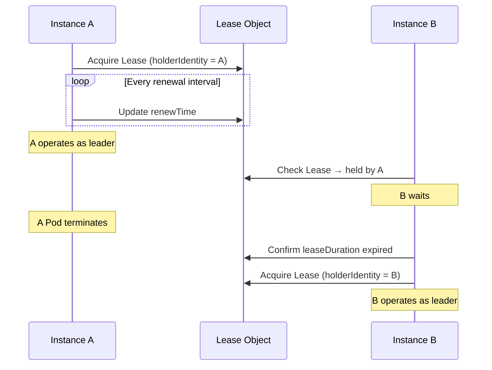

# Availability

Covers how to ensure availability for kube-based controllers. Most controllers work fine with a single instance, and when HA is needed, leader election is the solution.

## Why a Single Instance Is Sufficient

Kubernetes controllers are different from typical web servers. The watch + reconcile loop is a **queue consumer** model:

1. **Idempotent reconcile**: Following the [reconciler pattern](../patterns/reconciler.md), every reconcile is idempotent. Even after a temporary interruption and restart, it converges to the desired state
2. **Automatic watcher recovery**: When the watcher restarts, it resumes watching from the `resourceVersion`, or if unavailable, recovers the full state via a re-list
3. **Scheduler deduplication**: Even if multiple events for the same object accumulate, the [scheduler deduplicates them](../runtime-internals/controller-pipeline.md)

When a Pod restarts, there is a brief delay, but no data loss or inconsistency occurs.

### Recovery Timeline

```
t=0    Pod termination begins (SIGTERM)
t=0~30 In-progress reconciles complete (graceful shutdown)
t=30   Pod terminates
...    Deployment schedules a new Pod
t=45   New Pod starts, watcher initializes
t=46   re-list completes, processing of backlogged reconciles begins
```

The default `terminationGracePeriodSeconds: 30` on a `Deployment` is sufficient in most cases. Increase this value if you have long-running reconciles.

## Why replicas: 2 Doesn't Work

Watch-based controllers have no load balancer to route requests. If two instances run simultaneously:

| Problem | Description |
|---------|-------------|
| Duplicate reconciles | Both instances reconcile the same object concurrently |
| Conflicts | SSA field manager conflicts, optimistic concurrency (`resourceVersion`) errors |
| Resource waste | Both instances maintain identical watch streams, doubling API server load |

In particular, with `Server-Side Apply`, if two instances patch with the same `fieldManager`, unintended field ownership issues arise.

:::warning[Rolling Update Caution]
With `strategy.type: RollingUpdate` and `maxSurge: 1`, two instances briefly run simultaneously during deployment. Since most controllers are idempotent, short periods of duplicate execution are harmless, but leader election makes even this window safe.
:::

## Leader Election

A mechanism that ensures only one instance among many is active. kube-rs does not include built-in leader election, so third-party crates are used.

### Lease-based Mechanism

How leader election works using the Kubernetes `Lease` object:



Key parameters:

| Parameter | Meaning | Typical Value |
|-----------|---------|--------------|
| `leaseDuration` | Leader validity period | 15 seconds |
| `renewDeadline` | Renewal attempt deadline | 10 seconds |
| `retryPeriod` | Non-leader retry interval | 2 seconds |

### Third-Party Crates

Leader election crates available in the kube ecosystem:

| Crate | Approach | Features |
|-------|----------|----------|
| `kube-leader-election` | Lease-based | Simple API, provides renewal loop |
| `kube-coordinate` | Lease-based | kube-runtime compatible stream API |
| `kubert::lease` | Lease-based | Used by the Linkerd project |

Usage pattern:

```rust
// Conceptual usage example (API varies by crate)
let lease = LeaseManager::new(client.clone(), "my-controller", "controller-ns");

// Wait until leadership is acquired
lease.wait_for_leadership().await?;

// Run the Controller only while leader
Controller::new(api, wc)
    .shutdown_on_signal()
    .run(reconcile, error_policy, ctx)
    .for_each(|res| async move { /* ... */ })
    .await;
```

### Shutdown Coordination

It is important to safely shut down the Controller when leadership is lost:

```rust
Controller::new(api, wc)
    .graceful_shutdown_on(lease.lost_leadership())
    .run(reconcile, error_policy, ctx)
```

When you pass a leadership-lost future to `graceful_shutdown_on()`, it stops starting new reconciles upon losing leadership, waits for in-progress reconciles to complete, and then shuts down.

## Graceful Shutdown

### shutdown_on_signal

`Controller::shutdown_on_signal()` handles SIGTERM and Ctrl+C.

```rust title="kube-runtime/src/controller/mod.rs (simplified)"
pub fn shutdown_on_signal(mut self) -> Self
```

Behavior:
1. On receiving SIGTERM or SIGINT, stops starting new reconciles
2. Waits for in-progress reconciles to complete
3. Terminates immediately on receiving a second signal

```rust
Controller::new(api, wc)
    .shutdown_on_signal()
    .run(reconcile, error_policy, ctx)
    .for_each(|res| async move {
        match res {
            Ok(obj) => tracing::info!(?obj, "reconciled"),
            Err(err) => tracing::error!(%err, "reconcile failed"),
        }
    })
    .await;
```

### Custom Shutdown Trigger

Use `graceful_shutdown_on()` to set an arbitrary shutdown condition:

```rust
use tokio::sync::oneshot;

let (tx, rx) = oneshot::channel::<()>();

Controller::new(api, wc)
    .graceful_shutdown_on(async move { rx.await.ok(); })
    .run(reconcile, error_policy, ctx)
```

### Deployment Configuration

```yaml title="deployment.yaml"
spec:
  replicas: 1
  strategy:
    type: Recreate  # Prevent simultaneous execution (when not using leader election)
  template:
    spec:
      terminationGracePeriodSeconds: 60  # Sufficient shutdown time
      containers:
        - name: controller
          # ...
```

| Strategy | Without leader election | With leader election |
|----------|----------------------|---------------------|
| `Recreate` | Recommended — prevents overlap | Unnecessary |
| `RollingUpdate` | Brief overlap occurs | Safe — new instance waits |

## Elected Shards — HA + Horizontal Scaling

On large-scale clusters, a single leader may not be enough to handle the throughput. In this case, **shard the resources** so that multiple leaders each handle their own scope.

```
┌─────────────┐  ┌─────────────┐  ┌─────────────┐
│  Shard 0    │  │  Shard 1    │  │  Shard 2    │
│ ns: team-a  │  │ ns: team-b  │  │ ns: team-c  │
│ (leader)    │  │ (leader)    │  │ (leader)    │
└─────────────┘  └─────────────┘  └─────────────┘
```

Each shard:
1. Runs independent leader election with its own Lease
2. Watches only resources in its assigned scope (`Api::namespaced()` by namespace or label selector)
3. Ignores resources belonging to other shards

For detailed sharding strategies, see [Optimization — Scaling Strategies](./optimization.md#scaling-strategies).

## Availability Checklist

| Item | Verified |
|------|----------|
| Is the reconciler idempotent? | |
| Is `shutdown_on_signal()` or `graceful_shutdown_on()` configured? | |
| Is `terminationGracePeriodSeconds` sufficient? | |
| Are you not using `replicas > 1` without leader election? | |
| When using leader election, is leadership loss linked to shutdown? | |
| Is the Deployment strategy appropriate? (`Recreate` or leader election) | |
