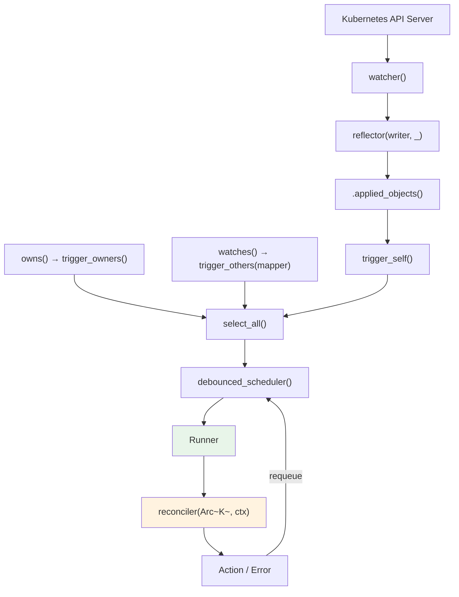
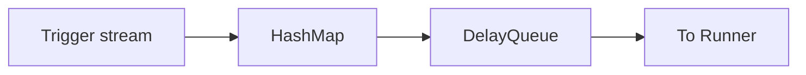
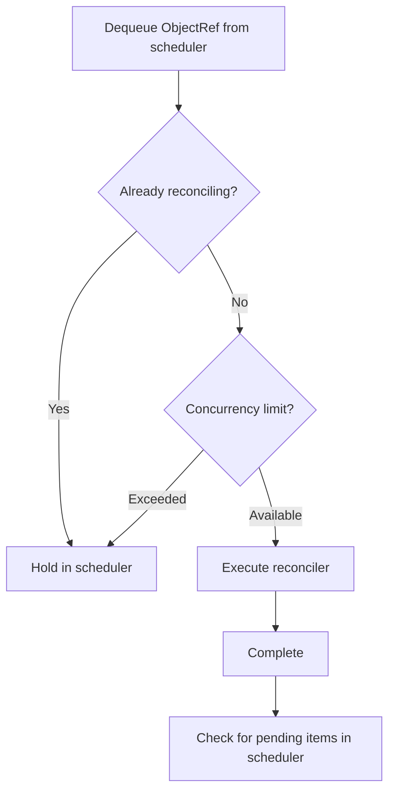

# Controller Pipeline

The Controller is the top-level abstraction that ties together watcher, reflector, scheduler, and runner into one unit. We trace the path data takes from `Controller::new()` all the way to the reconciler call.

## Complete Data Flow



Each step:

1. **watcher()** -- Watches the API server and produces an `Event<K>` stream
2. **reflector()** -- Caches Events in the Store while passing them through unchanged
3. **.applied_objects()** -- Extracts only `K` from `Event::Apply(K)` and `Event::InitApply(K)`
4. **trigger_self()** -- Converts `K` into `ReconcileRequest<K>`
5. **owns()/watches()** -- Creates additional trigger streams for related resources
6. **select_all()** -- Merges all trigger streams into one
7. **debounced_scheduler()** -- Deduplicates identical `ObjectRef`s and applies delays
8. **Runner** -- Controls concurrency and prevents concurrent reconciles of the same object
9. **reconciler** -- Executes user code
10. **Action/Error** -- Feeds back into the scheduler based on the result

## Controller Struct

```rust title="kube-runtime/src/controller/mod.rs (simplified)"
pub struct Controller<K> {
    trigger_selector: SelectAll<BoxStream<'static, Result<ReconcileRequest<K>, watcher::Error>>>,
    trigger_backoff: Box<dyn Backoff + Send>,
    reader: Store<K>,
    config: Config,
}
```

- **trigger_selector**: All trigger streams (`trigger_self` + `owns` + `watches`) merged via `SelectAll`
- **reader**: The read handle to the Store managed by the reflector. Used to retrieve `Arc<K>` in the reconciler
- **config**: Settings for debounce duration, concurrent execution limits, etc.

## Trigger System

### trigger_self -- Primary Resource Changes

When the primary resource (the type specified in `Controller::new`) changes, it generates a `ReconcileRequest` for that resource.

```rust
// Internal flow
watcher Event → .applied_objects() → trigger_self() → ReconcileRequest<K>
```

A `ReconcileRequest` contains the target resource's `ObjectRef` and the trigger reason:

```rust title="ReconcileRequest internals"
pub struct ReconcileRequest<K: Resource> {
    pub obj_ref: ObjectRef<K>,
    pub reason: ReconcileReason,
}
```

`ReconcileReason` has the following variants:

| Variant | Description |
|---------|-------------|
| `Unknown` | External trigger injected via `reconcile_on()` |
| `ObjectUpdated` | Primary resource changed |
| `RelatedObjectUpdated { obj_ref }` | Related resource changed (owns/watches) |
| `ReconcilerRequestedRetry` | Reconciler requested re-execution via `Action::requeue()` |
| `ErrorPolicyRequestedRetry` | `error_policy` requested re-execution |
| `BulkReconcile` | Full re-reconcile requested via `reconcile_all_on()` |
| `Custom { reason }` | User-defined reason (when directly injected into the queue stream) |

### trigger_owners -- Child Resource Changes

```rust
controller.owns::<ConfigMap>(api, wc)
```

1. Creates a separate watcher for ConfigMaps
2. When a ConfigMap changes, checks `metadata.ownerReferences`
3. Extracts the parent (primary resource) `ObjectRef`
4. Emits a `ReconcileRequest` for the parent

When identifying the parent from ownerReferences, only entries whose `kind` and `apiVersion` match the Controller's primary resource type are extracted.

### trigger_others -- Related Resource Changes

```rust
controller.watches::<Secret>(api, wc, |secret| {
    // Return list of ObjectRefs for related primary resources from the Secret
    let name = secret.labels().get("app")?.clone();
    let ns = secret.namespace()?;
    Some(ObjectRef::new(&name).within(&ns))
})
```

1. Creates a separate watcher for Secrets
2. When a Secret changes, calls the user-defined mapper function
3. Emits `ReconcileRequest`s for the `ObjectRef`s returned by the mapper

Use case: Secret change triggers re-reconcile of all resources that reference that Secret.

## External Event Sources -- reconcile_on

`reconcile_on()` lets you connect external triggers beyond watch events to the Controller.

```rust
use tokio::sync::mpsc;
use futures::stream::ReceiverStream;

let (tx, rx) = mpsc::channel::<ObjectRef<MyResource>>(256);

Controller::new(api, wc)
    .reconcile_on(ReceiverStream::new(rx))
    .run(reconcile, error_policy, ctx)
```

When `ObjectRef`s are sent from external webhooks, message queues, timers, etc., the corresponding resource's reconcile is triggered. The `ReconcileReason` is set to `Unknown` in this case.

### Stream-Based API

The standard `Controller::new()` creates a watcher internally, but `for_stream()` lets you inject a pre-filtered stream directly. `owns_stream()` and `watches_stream()` follow the same pattern.

```rust
// Inject an externally created watcher stream into the Controller
let (reader, writer) = reflector::store();
let stream = reflector(writer, watcher(api.clone(), wc))
    .applied_objects();

Controller::for_stream(stream, reader)
    .owns_stream::<ConfigMap>(cm_stream)
    .watches_stream::<Secret, _>(secret_stream, |secret| { /* mapper */ })
    .run(reconcile, error_policy, ctx)
```

### Combining Multiple Streams

This is an advanced pattern for consolidating events from multiple related resources into a single Controller. By combining `for_stream()` and `watches_stream()`, you can inject externally constructed streams into the Controller.

```rust
use futures::stream;
use kube::runtime::{reflector, watcher, Controller, WatchStreamExt};

// Primary resource stream
let (reader, writer) = reflector::store();
let main_stream = reflector(writer, watcher(main_api, wc.clone()))
    .applied_objects()
    .default_backoff();

// Related resource streams
let cm_stream = watcher(cm_api, wc.clone())
    .applied_objects()
    .default_backoff();

let secret_stream = watcher(secret_api, wc.clone())
    .applied_objects()
    .default_backoff();

Controller::for_stream(main_stream, reader)
    .watches_stream(cm_stream, |cm| {
        // ConfigMap -> primary resource mapping
        let name = cm.labels().get("app")?.clone();
        let ns = cm.namespace()?;
        Some(ObjectRef::new(&name).within(&ns))
    })
    .watches_stream(secret_stream, |secret| {
        // Secret -> primary resource mapping
        let name = secret.labels().get("app")?.clone();
        let ns = secret.namespace()?;
        Some(ObjectRef::new(&name).within(&ns))
    })
    .run(reconcile, error_policy, ctx)
```

This pattern manually constructs the watchers that `owns()`/`watches()` create internally. It enables fine-grained control such as stripping fields with `.modify()` or sharing a single reflector across multiple Controllers. Shared patterns are covered in [Generic Controllers](../patterns/generic-controllers.md#shared-reflector).

:::warning[Unstable feature flags]
These APIs are behind unstable feature flags:
- `reconcile_on()` → `unstable-runtime-reconcile-on`
- `for_stream()`, `owns_stream()`, `watches_stream()` → `unstable-runtime-stream-control`

```toml
kube = { version = "...", features = ["unstable-runtime-reconcile-on", "unstable-runtime-stream-control"] }
```
:::

## Scheduler -- Deduplication and Delay

`debounced_scheduler()` performs deduplication and time-based scheduling using a `DelayQueue` + `HashMap`.



How it works:

- When multiple triggers arrive for the same `ObjectRef`, only **the earliest one** is kept
- When debounce is configured, additional triggers within the configured period are ignored

```
When debounce = 1 second:
t=0.0  trigger(A) → Scheduled for execution in 1 second
t=0.3  trigger(A) → Already scheduled, ignored
t=1.0  A executes
t=1.2  trigger(A) → Scheduled again for 1 second later
```

Why debounce is needed: when the reconciler updates a status, it generates a new `resourceVersion`, which triggers a watch event, leading to an unnecessary re-reconcile. Debounce absorbs this burst. Details are covered in [Reconciler Patterns](../patterns/reconciler.md).

## Runner -- Concurrency Control

The Runner takes items from the scheduler and dispatches them to the reconciler while controlling concurrency.

Key behaviors:

1. **readiness gate**: Reconciles do not start until `Store::wait_until_ready()` completes
2. **hold_unless**: `ObjectRef`s that are already being reconciled are held back in the scheduler
3. **max_concurrent_executions**: Limits the total number of concurrent reconciles



The **hold_unless pattern** is the key. It prevents concurrent reconciles of the same object:

- Object A is reconciling, a new trigger for A arrives, held in scheduler
- A completes, A is dequeued from scheduler and runs again

This ensures reconciles for the same resource are executed in order.

## Reconcile Result Handling

The reconciler's result feeds back into the scheduler.

### On Success

```rust
async fn reconcile(obj: Arc<MyResource>, ctx: Arc<Context>) -> Result<Action, Error> {
    // ... reconcile logic ...

    // Re-check after 5 minutes
    Ok(Action::requeue(Duration::from_secs(300)))

    // Or: wait for the next watch event
    Ok(Action::await_change())
}
```

| Action | Behavior |
|--------|----------|
| `requeue(Duration)` | Schedules re-execution in the scheduler after the specified duration |
| `await_change()` | No proactive requeue; waits for the next watch event |

### On Failure

```rust
fn error_policy(
    obj: Arc<MyResource>,
    error: &Error,
    ctx: Arc<Context>,
) -> Action {
    Action::requeue(Duration::from_secs(5))
}
```

The scheduler schedules based on the `Action` returned by `error_policy`.

## Config

```rust
use kube::runtime::controller::Config;

controller.with_config(
    Config::default()
        .debounce(Duration::from_secs(1))  // Minimum interval between triggers
        .concurrency(10)                    // Maximum concurrent reconciles
)
```

| Setting | Default | Description |
|---------|---------|-------------|
| `debounce` | 0 (none) | Minimum interval between triggers. Useful for absorbing bursts |
| `concurrency` | 0 (unlimited) | Concurrent reconcile limit. 0 means unlimited |

## Shutdown

```rust
// React to SIGTERM/SIGINT
controller.shutdown_on_signal()

// Custom shutdown trigger
controller.graceful_shutdown_on(async {
    // Some condition...
})
```

Graceful shutdown behavior:
1. Stops starting new reconciles
2. Waits for in-progress reconciles to complete

Internally uses `tokio::signal`.
