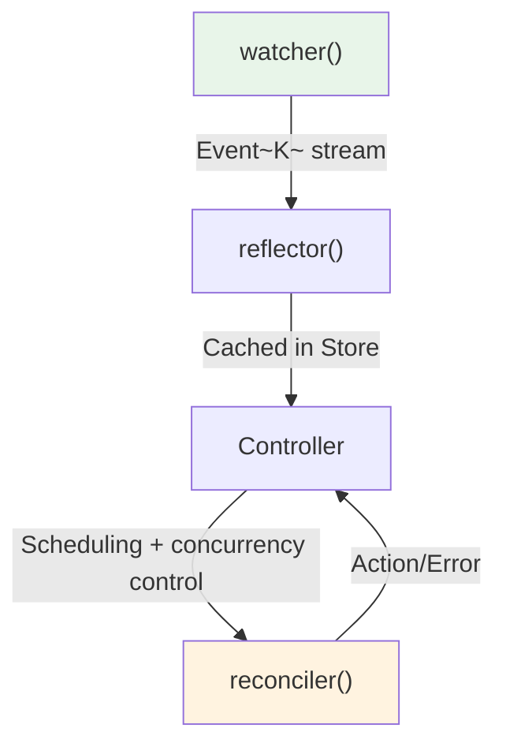

# Runtime Internals

This section covers what `kube-runtime` does under the hood. We examine the watcher's state machine, the reflector's atomic swap caching, the Controller's trigger-scheduler-runner pipeline, and the code generated by derive macros.

## What This Section Covers

| Document | Key Question |
|----------|-------------|
| [Watcher](./watcher.md) | How does the state machine work, and how does it recover from errors? |
| [Reflector and Store](./reflector-and-store.md) | How does the in-memory cache maintain consistency? |
| [Controller Pipeline](./controller-pipeline.md) | What path does data take from trigger to reconciler? |
| [CRDs and Derive Macros](./custom-resources.md) | What code does `#[derive(CustomResource)]` actually generate? |

If you have already understood kube's static structure from the [Architecture](../architecture/index.md) section, this section follows what actually happens at runtime.
