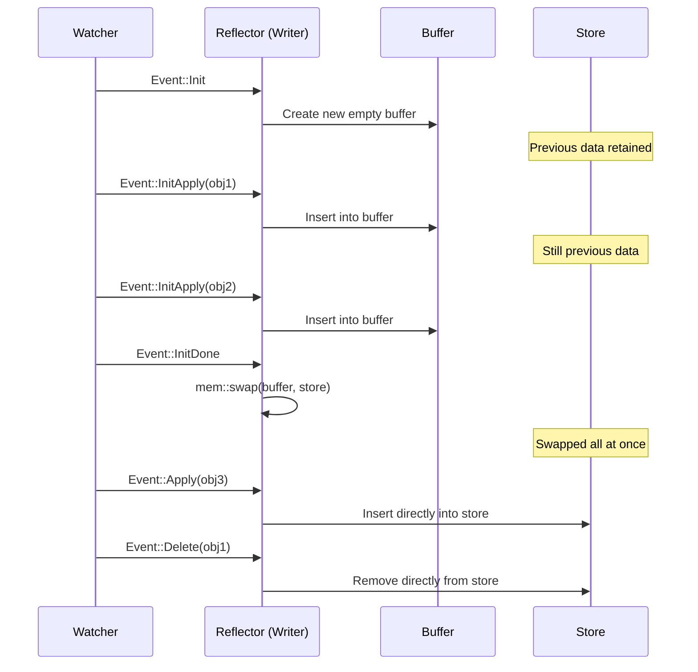

# Reflector and Store

The Reflector is a passthrough adapter on the watcher stream. It forwards events unchanged while updating an in-memory cache (Store) as a side effect.

## The reflector Function

```rust
pub fn reflector<K, W>(writer: Writer<K>, stream: W) -> impl Stream<Item = W::Item>
```

It intercepts each `Event` from the watcher stream, applies it to the `Writer` (cache update), and then passes the event through unmodified to the next stream. Stream consumers are unaware that a reflector sits in the middle.

```rust
use kube::runtime::{reflector, watcher, WatchStreamExt};

let (reader, writer) = reflector::store();
let stream = reflector(writer, watcher(api, watcher::Config::default()))
    .default_backoff()
    .applied_objects();

// Query cache via reader
// Process events via stream
```

## Store Internal Structure

```rust title="kube-runtime/src/reflector/store.rs (simplified)"
type Cache<K> = Arc<RwLock<AHashMap<ObjectRef<K>, Arc<K>>>>;

pub struct Writer<K> {
    store: Cache<K>,
    buffer: AHashMap<ObjectRef<K>, Arc<K>>,
}

pub struct Store<K> {
    store: Cache<K>,
}
```

Rationale behind the internal data structure choices:

| Component | Choice | Reason |
|-----------|--------|--------|
| `AHashMap` | Instead of `std::HashMap` | Internal cache doesn't need DoS protection, so a faster hashmap is used |
| `parking_lot::RwLock` | Instead of `std::RwLock` | Better read concurrency, no poisoning |
| `Arc<K>` | Instead of `K` | Passed to the reconciler as `Arc<K>` to avoid unnecessary cloning |

## Atomic Swap Pattern

This is the core mechanism of the reflector. The `apply_watcher_event()` method behaves differently for each event type.



How each event is handled:

| Event | Behavior | Store State |
|-------|----------|-------------|
| `Init` | Creates a new empty buffer | Previous data retained (readable) |
| `InitApply(obj)` | Inserts into buffer | Previous data retained |
| `InitDone` | `mem::swap(&mut buffer, &mut *store.write())` | **Swapped all at once** |
| `Apply(obj)` | Inserts directly into store | Immediately reflected |
| `Delete(obj)` | Removes directly from store | Immediately reflected |

The key aspects of this pattern:

- During a re-list, the Store always maintains a **consistent snapshot**. From `Init` to `InitDone`, the Store retains the previous data as-is.
- The swap at `InitDone` is a pointer exchange, making it O(1). No data copying occurs.
- After the swap, the previous buffer (= old Store data) is dropped.

## Async Nature of Store

:::warning[Most common mistake]
```rust
let (reader, writer) = reflector::store();
// ... reflector setup ...
let items = reader.state(); // <- Returns empty Vec!
```

The Store is empty when created. It only gets populated when the watcher stream is polled (= when the tokio runtime runs it).
:::

Correct usage:

```rust
// Wait until first InitDone before querying
reader.wait_until_ready().await;
let items = reader.state(); // Now data is available
```

Internally, `wait_until_ready()` uses `DelayedInit` (based on a oneshot channel). The Writer sends a signal when it processes the first `InitDone` event, and the Store's `wait_until_ready()` awaits this signal.

When using a Controller, you don't need to worry about this. The Controller internally calls `wait_until_ready()`, so the Store is already populated by the time the reconciler runs.

## Writer vs Store -- Read/Write Separation

| Role | Type | Clone | Responsibility |
|------|------|-------|---------------|
| Write | `Writer<K>` | Not cloneable | Owned by reflector, `apply_watcher_event` |
| Read | `Store<K>` | Cloneable | Shared across multiple consumers (reconciler, health check, etc.) |

Thanks to this separation, only a single Writer modifies the cache, while multiple Store handles can read concurrently. The Controller manages this separation automatically.

## Key Store Methods

```rust
// Full list of cached objects
let all: Vec<Arc<K>> = reader.state();

// Look up by specific ObjectRef
let obj: Option<Arc<K>> = reader.get(&obj_ref);

// Check readiness
let ready: bool = reader.is_ready();

// Wait until first InitDone
reader.wait_until_ready().await;
```

The `Vec<Arc<K>>` returned by `state()` is a snapshot at the time of the call. Subsequent Store updates do not affect the already-returned Vec.

## Shared/Subscriber Mode

:::tip[Requires unstable-runtime feature]
This feature requires activating the `unstable-runtime-stream-control` feature flag.
:::

In the default mode, a single reflector supports a single consumer. With shared mode, a single reflector can fan out events to multiple consumers.

### store_shared and reflect_shared

In v3.x, create a shared store with `reflector::store_shared()` and apply `.reflect_shared()` to the stream.

```rust
use kube::runtime::{reflector, watcher, WatchStreamExt};

// Create shared store (specify buffer size)
let (reader, writer) = reflector::store_shared(1024);

// Apply shared reflector to stream
let stream = watcher(api, wc)
    .default_backoff()
    .reflect_shared(writer)
    .applied_objects();

// Multiple subscribers can receive events
let subscriber1 = reader.subscribe().unwrap();
let subscriber2 = reader.subscribe().unwrap();
```

### Combining with Controller

Use `Controller::for_shared_stream()` to inject a shared stream into a Controller.

```rust
// Create Controller with shared stream
Controller::for_shared_stream(stream, reader.clone())
    .run(reconcile, error_policy, ctx)
```

When multiple Controllers watch the same resource, this can reduce watch connections to a single one. For concrete multi-Controller patterns, see [Generic Controllers -- Shared Reflector](../patterns/generic-controllers.md#shared-reflector).

Use cases:
- Delivering events from a single watcher to multiple controllers
- When you need to reduce the number of API server watch connections

Internally, it uses an `async_broadcast` channel to distribute `ObjectRef` events to multiple subscribers.
