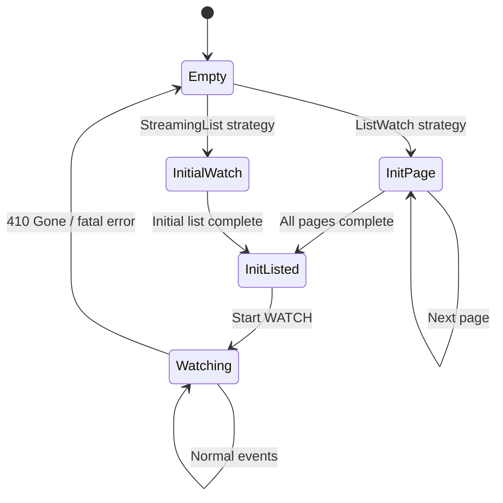

# Watcher

`Api::watch()` simply terminates when the connection drops and does not handle `resourceVersion` expiration. `watcher()` layers a **state machine** on top to provide automatic reconnection, initial list loading, and error recovery as a Stream.

## Role of the Watcher

The limitations of `Api::watch()` can be summarized as follows:

| Limitation | Description |
|-----------|-------------|
| Terminates on disconnect | Must be manually restarted |
| No `resourceVersion` expiration handling | Errors out on 410 Gone responses |
| No initial list | watch only sees changes "from now on" |

`watcher()` handles all of these automatically:

```rust
use kube::runtime::{watcher, WatchStreamExt};

let wc = watcher::Config::default();
let stream = watcher(api, wc)
    .default_backoff()    // Exponential backoff retry on errors
    .applied_objects();   // Convert Event<K> to K stream
```

## State Machine

The watcher's internals are a state machine that transitions through five states.



What each state does:

| State | Behavior | API Call |
|-------|----------|----------|
| **Empty** | Initial state or reset after error. Branches based on the configured strategy. | -- |
| **InitPage** | Paginated LIST call (`page_size=500`). Emits `Event::InitApply(obj)` for each page. Fetches the next page using `continue_token`. | `LIST ?limit=500&continue=...` |
| **InitialWatch** | Starts a WATCH with `sendInitialEvents=true`. The server sends existing objects one by one and signals completion with a Bookmark. | `WATCH ?sendInitialEvents=true` |
| **InitListed** | Initial list complete. Emits `Event::InitDone` and starts a WATCH with the last `resourceVersion`. | `WATCH ?resourceVersion=...` |
| **Watching** | Normal watch state. Added/Modified become `Event::Apply`, Deleted becomes `Event::Delete`. Returns to Empty on 410 Gone or disconnection. | -- (maintains existing connection) |

## Two Initial List Strategies

### ListWatch (Default)

The default strategy that works on all Kubernetes versions.

1. `LIST` call (`page_size=500`, same as client-go)
2. Exhaust all pages using `continue_token`
3. Start `WATCH` with the last `resourceVersion`

```rust
// Default -- uses ListWatch strategy
let wc = watcher::Config::default();
```

:::warning[Initial LIST Memory]
On large clusters, the entire resource set is loaded page by page. If the object count is high, memory usage can spike significantly during the initial LIST.
:::

### StreamingList (K8s 1.27+)

An efficient strategy available from Kubernetes 1.27 onwards.

1. `WATCH` + `sendInitialEvents=true` + `resourceVersionMatch=NotOlderThan`
2. Server sends existing objects one by one as Added events
3. Bookmark signals initial list completion

```rust
// Use StreamingList strategy
let wc = watcher::Config::default().streaming_lists();
```

Unlike LIST, objects are processed one at a time, resulting in better memory efficiency. However, it requires Kubernetes 1.27+ (WatchList feature gate).

## Event Abstraction

The watcher transforms Kubernetes `WatchEvent`s into higher-level `Event`s.

```rust
pub enum Event<K> {
    Init,          // Re-list started
    InitApply(K),  // Each object in the initial list
    InitDone,      // Initial list complete
    Apply(K),      // Added/Modified during watch
    Delete(K),     // Deleted during watch
}
```

Mapping from Kubernetes `WatchEvent`:

| WatchEvent | During initial list | During watch |
|-----------|-------------------|-------------|
| Added | `InitApply(K)` | `Apply(K)` |
| Modified | -- | `Apply(K)` |
| Deleted | -- | `Delete(K)` |
| Bookmark | Internal handling (`resourceVersion` update) | Internal handling |

The reason `Init`/`InitApply`/`InitDone` exist separately is for the [reflector's atomic swap pattern](./reflector-and-store.md). A new buffer is created at `Init`, filled with `InitApply`, and swapped in all at once at `InitDone`.

## Error Recovery and Backoff

All errors from the watcher are treated as retriable.

### default_backoff

```rust
let stream = watcher(api, wc)
    .default_backoff();  // Exponential backoff: 1s -> 2s -> 4s -> ... -> 60s (max)
```

The backoff resets upon receiving a successful event.

:::warning[Never use without backoff]
Using the watcher without backoff causes the stream to terminate on the first error. This can lead to a production incident where the entire Controller stops.

If an API server outage occurs without backoff, tight-loop retries can cause CPU/memory to spike out of control.
:::

### 410 Gone Handling

The Kubernetes API server retains `resourceVersion` history for only about 5 minutes. If the delay exceeds this, it returns a 410 Gone response.

When the watcher receives 410 Gone, it returns to the Empty state and performs a full re-list. Enabling bookmarks causes the `resourceVersion` to be periodically updated, significantly reducing the frequency of 410 responses.

## watcher::Config

```rust
let wc = watcher::Config::default()
    .labels("app=myapp")              // label selector
    .fields("status.phase=Running")   // field selector
    .timeout(300)                     // watch timeout (server-side)
    .page_size(100)                   // ListWatch page size
    .streaming_lists()                // StreamingList strategy
    .any_semantic()                   // ListSemantic::Any
    .disable_bookmarks();             // Disable bookmarks (on by default)
```

| Option | Default | Description |
|--------|---------|-------------|
| `labels` | None | Narrow watch scope with a label selector |
| `fields` | None | Field selector |
| `timeout` | 295s | Server-side watch timeout |
| `page_size` | 500 | ListWatch page size |
| `streaming_lists()` | off | Enable StreamingList strategy |
| `any_semantic()` | off | `ListSemantic::Any` -- allows cached data (faster but possibly stale) |
| `disable_bookmarks()` | -- | Disable Bookmark events (on by default; disabling increases 410 frequency) |

## Things to Know

### Watch events are not guaranteed to be delivered

`DELETE` events can be lost during network disconnections. A re-list will recover the final state, but intermediate events are permanently lost. Use [finalizers](../patterns/relations-and-finalizers.md) when deletion detection is critical.

### Memory spikes during re-list

When a re-list occurs on a large cluster, old data + JSON buffer + deserialized objects all exist in memory simultaneously. Memory usage can temporarily reach 2-3x the normal level. Using StreamingList can mitigate this.

### 410 comes quickly without bookmarks

For quiet resources with infrequent changes, the `resourceVersion` doesn't get updated and expires quickly. Bookmarks periodically update the `resourceVersion` to prevent 410 Gone. Since bookmarks are enabled by default, you don't need to worry about this unless you explicitly disable them.
