# kube

A Kubernetes client library written in Rust. It is the Rust counterpart to Go's [client-go](https://github.com/kubernetes/client-go) and is hosted as a [CNCF Sandbox](https://www.cncf.io/projects/) project.

```rust
use kube::{Api, Client};
use k8s_openapi::api::core::v1::Pod;

#[tokio::main]
async fn main() -> anyhow::Result<()> {
    let client = Client::try_default().await?;
    let pods: Api<Pod> = Api::default_namespaced(client);

    for pod in pods.list(&Default::default()).await? {
        println!("{}", pod.metadata.name.unwrap_or_default());
    }
    Ok(())
}
```

## About This Guide

This guide is for those who use kube but want a deeper understanding of how it works internally. Rather than covering basic usage, it traces through the actual code implementation to explain **why it was designed this way** and **what happens under the hood**.

### Prerequisites

- Rust fundamentals (traits, generics, async/await)
- Kubernetes basics (Pod, Deployment, CRD, watch, controller)

## Table of Contents

| Section | Description |
|---------|-------------|
| [Architecture](./architecture/index.md) | Crate structure, type system, Client internals, request flow |
| [Runtime Internals](./runtime-internals/index.md) | How watcher/reflector/Controller work |
| [Patterns](./patterns/index.md) | Correct usage patterns and common pitfalls |
| [Production](./production/index.md) | Monitoring, testing, optimization, security, availability, validation |

## Basic Setup

```toml title="Cargo.toml"
[dependencies]
kube = { version = "3.0.1", features = ["runtime", "derive"] }
k8s-openapi = { version = "0.27.0", features = ["latest", "schemars"] }
schemars = "1"
tokio = { version = "1", features = ["full"] }
serde = { version = "1", features = ["derive"] }
serde_json = "1"
anyhow = "1"
```

## Download Full Docs

The entire documentation is available as a single Markdown file.

- [kube-docs-en.md](pathname:///downloads/kube-docs-en.md) — English
- [kube-docs-ko.md](pathname:///downloads/kube-docs-ko.md) — 한국어

## References

- [kube.rs](https://kube.rs) — Official website
- [docs.rs/kube](https://docs.rs/kube) — API reference
- [GitHub](https://github.com/kube-rs/kube) — Source code


---

# Architecture

This section covers how kube is organized internally. It traces the division of responsibilities across 5 crates, the `Resource` trait-based type system, the HTTP client built with Tower middleware, and the full code path that a single API call traverses.

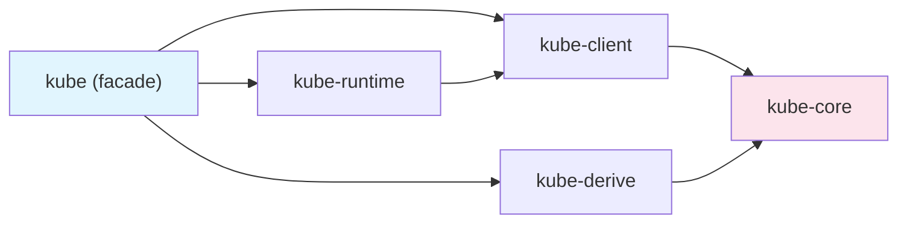

## What This Section Covers

| Document | Key Question |
|----------|-------------|
| [Crate Structure](./crate-overview.md) | Why is it split into 5 crates, and what does each one do? |
| [Resource Trait and Type System](./resource-type-system.md) | What compile-time safety guarantees does it provide? |
| [Client Internals](./client-and-tower-stack.md) | What middleware does an HTTP request pass through? |
| [Journey of a Request](./request-lifecycle.md) | What code path does a single `pods.list()` call take? |

After reading this section, you will understand why kube's design decisions were made and which layer to look at when troubleshooting issues.


---

# Crate Structure

kube is not a single crate but a collection of 5 crates separated by responsibility. This section examines why they are split and how they form a layered architecture.

## Why Multiple Crates

kube's crate separation follows the **minimal dependency principle**.

- **kube-core** has no HTTP dependencies. Library crates can import just the Kubernetes types they need.
- **kube-client** handles only the network layer. It provides a Tower middleware-based HTTP client and the `Api<K>` handle.
- **kube-runtime** handles only operator abstractions. It composes watcher, reflector, and Controller to build controller loops.
- **kube-derive** is a proc-macro crate. It handles code generation for `#[derive(CustomResource)]` and similar macros.

Thanks to this separation, you can enable only what you need via feature flags, reducing compile times and binary sizes.

## Layer Diagram

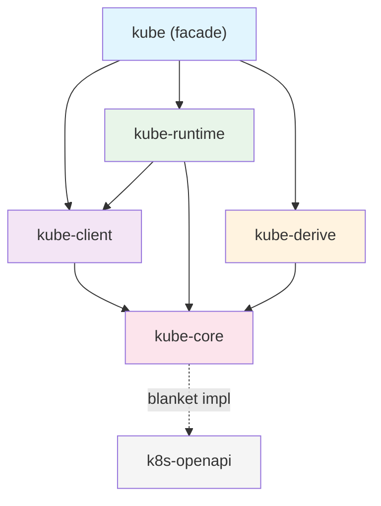

The key point is that **kube-core sits at the bottom**. It defines only types and traits without any HTTP dependencies, and the remaining crates build on top of it.

## Role of Each Crate

### kube-core — Pure Types

Defines the types and traits needed to interact with the Kubernetes API without any HTTP dependencies. It corresponds to Go's `k8s.io/apimachinery`.

Key modules:

| Module | Role | Key Types |
|--------|------|-----------|
| `resource` | Resource abstraction | `Resource` trait, `ResourceExt` |
| `metadata` | Metadata | `ObjectMeta`, `TypeMeta`, `ListMeta` |
| `object` | Object wrappers | `Object<P, U>`, `ObjectList<K>` |
| `params` | API parameters | `ListParams`, `PatchParams`, `Patch` enum |
| `dynamic` | Dynamic typing | `DynamicObject`, `ApiResource` |
| `gvk` | Type information | `GroupVersionKind`, `GroupVersionResource` |
| `request` | Request assembly | `Request` (generates URL path + query, no transmission) |
| `response` | Response types | `Status`, `WatchEvent` |
| `labels` | Label selectors | `Selector`, `Expression` |
| `crd` | CRD extensions | `CustomResourceExt` |
| `error_boundary` | Deserialization guard | `DeserializeGuard` |

The `request` module is central. It assembles the URL path and query parameters for HTTP requests but never actually sends them. This separation is what allows kube-core to remain a pure type crate with no network dependencies.

### kube-client — Network Layer

Provides the HTTP client that communicates with the actual Kubernetes API server. It corresponds to Go's `client-go`.

Key components:

- **`Client`**: A [Tower](https://github.com/tower-rs/tower)-based HTTP client. It is type-erased via `Buffer<BoxService<...>>`, making Clone lightweight. The internal structure is covered in [Client Internals](./client-and-tower-stack.md).
- **`Api<K>`**: A type-safe CRUD handle. It provides Kubernetes API operations like `get()`, `list()`, `patch()`, and `delete()`. The `K: Resource` bound validates the resource type at compile time.
- **`Config`**: Loads configuration from a kubeconfig file or in-cluster environment.
- **`Discovery`**: Queries the API server at runtime for supported resources.

The `Api<K>` constructors provide compile-time validation based on resource scope:

```rust
// Namespace-scoped resource
let pods: Api<Pod> = Api::namespaced(client.clone(), "default");

// Cluster-scoped resource
let nodes: Api<Node> = Api::all(client.clone());

// Creating a Namespace with Api::namespaced() causes a compile error
// let ns: Api<Namespace> = Api::namespaced(client, "default"); // <- won't compile
```

### kube-runtime — Operator Abstractions

Provides the building blocks for implementing the controller pattern. It corresponds to Go's `controller-runtime`.

| Module | Role |
|--------|------|
| `watcher` | Watch stream with automatic reconnection and error recovery |
| `reflector` | Intercepts the watcher stream and writes to an in-memory cache (Store) |
| `controller` | Controller loop combining reflector + scheduling + concurrency control |
| `finalizer` | Helper for pre-deletion cleanup tasks |
| `scheduler` | Delay and deduplication of stream items |
| `events` | Publishing Kubernetes Event resources |
| `wait` | Condition waiting (`await_condition`) |
| `utils` | Stream utilities like `WatchStreamExt` and `predicates` |

How these modules compose together is covered in detail in the **Runtime Internals** section.

### kube-derive — Code Generation

A proc-macro crate that provides three derive macros.

| Macro | Generated Output |
|-------|-----------------|
| `CustomResource` | CRD root struct + `Resource` impl + `CustomResourceExt` impl |
| `Resource` | `Resource` trait impl for existing types |
| `KubeSchema` | `JsonSchema` impl with CEL validation rules |

The details of what `#[derive(CustomResource)]` generates are covered in **CRDs and Derive Macros**.

### kube — Facade

This is the only crate users add to their `Cargo.toml`. It re-exports the 4 crates above based on feature flags.

```rust
// feature = "client" (enabled by default)
pub use kube_client::{api, client, discovery};

// feature = "config" (enabled by default)
pub use kube_client::config;

// feature = "derive"
pub use kube_derive::{CustomResource, Resource, KubeSchema};

// feature = "runtime"
pub use kube_runtime as runtime;

// always available
pub use kube_core as core;
```

## Go Ecosystem Mapping

| kube-rs | Go | Role |
|---------|-----|------|
| kube-core | `k8s.io/apimachinery` | Types, metadata, API parameters |
| kube-client | `client-go` | HTTP client, authentication, configuration |
| kube-runtime | `controller-runtime` | Controllers, watchers, caches |
| kube-derive | kubebuilder (code generation) | CRD struct generation, scaffolding |

Just as using `controller-runtime` in Go implicitly pulls in `client-go` and `apimachinery`, enabling the `runtime` feature in kube brings in kube-runtime along with kube-client and kube-core.

## Feature Flag Guide

kube's default features are `client`, `rustls-tls`, and `ring`. Combine features based on your use case.

### Combinations by Use Case

```toml title="API queries only (default)"
[dependencies]
kube = "3.0.1"
```

```toml title="Controller development"
[dependencies]
kube = { version = "3.0.1", features = ["runtime", "derive"] }
```

```toml title="Pod exec/attach/portforward"
[dependencies]
kube = { version = "3.0.1", features = ["runtime", "derive", "ws"] }
```

```toml title="Types only (no HTTP dependencies)"
[dependencies]
kube-core = "3.0.1"
```

### Full Feature List

| Feature | Default | Description |
|---------|---------|-------------|
| `client` | Yes | `Client`, `Api<K>` |
| `config` | Yes | `Config` (kubeconfig / in-cluster) |
| `rustls-tls` | Yes | Rustls TLS backend |
| `ring` | Yes | Rustls crypto provider |
| `openssl-tls` | | OpenSSL TLS backend (cannot be used with `rustls-tls`) |
| `aws-lc-rs` | | AWS Libcrypto provider (with Rustls) |
| `webpki-roots` | | WebPKI certificate roots (instead of system certificates) |
| `derive` | | `CustomResource`, `Resource`, `KubeSchema` macros |
| `runtime` | | watcher, reflector, Controller |
| `ws` | | WebSocket (exec, attach, portforward) |
| `gzip` | | Response gzip decompression |
| `jsonpatch` | | `Patch::Json` support |
| `oauth` | | OAuth authentication |
| `oidc` | | OIDC authentication |
| `socks5` | | SOCKS5 proxy |
| `http-proxy` | | HTTP proxy |
| `admission` | | Admission webhook types |
| `kubelet-debug` | | Kubelet debug interface |
| `unstable-runtime` | | Experimental runtime features |
| `unstable-client` | | Experimental client features |

## The Role of k8s-openapi

kube itself does not define built-in Kubernetes types like `Pod`, `Deployment`, or `Service`. These types are provided by a separate crate, [k8s-openapi](https://docs.rs/k8s-openapi).

kube-core provides a **blanket impl** for all k8s-openapi types:

```rust title="Blanket impl in kube-core (simplified)"
impl<K, S> Resource for K
where
    K: k8s_openapi::Metadata<Ty = ObjectMeta>,
    K: k8s_openapi::Resource<Scope = S>,
{
    type DynamicType = ();
    type Scope = S;
    // kind(), group(), version(), etc. are derived from K::KIND, K::GROUP, K::VERSION
}
```

Thanks to this blanket impl, all k8s-openapi types (`Pod`, `Service`, `Deployment`, etc.) automatically implement kube's `Resource` trait. Users do not need to write any impl themselves.

```toml title="Cargo.toml"
[dependencies]
kube = { version = "3.0.1", features = ["runtime", "derive"] }
k8s-openapi = { version = "0.27.0", features = ["latest", "schemars"] }
```

The `latest` feature in k8s-openapi activates the Kubernetes API version that matches the kube version. The `schemars` feature is required for CRD schema generation.

:::warning[Only one version feature]
You must enable only **one** version feature (`latest`, `v1_32`, etc.) for k8s-openapi. Enabling multiple simultaneously causes a compile error.
:::


---

# Resource Trait and Type System

At the heart of kube is the `Resource` trait. This single trait allows static types (k8s-openapi) and dynamic types (DynamicObject) to be handled through the same interface, while using Scope to prevent invalid API calls at compile time.

## Anatomy of the Resource Trait

```rust title="kube-core/src/resource.rs (simplified)"
pub trait Resource {
    type DynamicType: Send + Sync + 'static;
    type Scope;

    fn kind(dt: &Self::DynamicType) -> Cow<'_, str>;
    fn group(dt: &Self::DynamicType) -> Cow<'_, str>;
    fn version(dt: &Self::DynamicType) -> Cow<'_, str>;
    fn api_version(dt: &Self::DynamicType) -> Cow<'_, str>;
    fn plural(dt: &Self::DynamicType) -> Cow<'_, str>;
    fn url_path(dt: &Self::DynamicType, namespace: Option<&str>) -> String;

    fn meta(&self) -> &ObjectMeta;
    fn meta_mut(&mut self) -> &mut ObjectMeta;

    fn object_ref(&self, dt: &Self::DynamicType) -> ObjectReference;
    fn controller_owner_ref(&self, dt: &Self::DynamicType) -> Option<OwnerReference>;
    fn owner_ref(&self, dt: &Self::DynamicType) -> Option<OwnerReference>;
}
```

Two associated types form the core of this trait.

### DynamicType — Where Metadata Lives

`DynamicType` determines **where** the GVK (Group/Version/Kind) information for a resource comes from.

- **`()`** — Static type. The kind/group/version are embedded in the type itself at compile time. Zero runtime cost.
- **`ApiResource`** — Dynamic type. GVK information is carried at runtime.

This is why methods like `kind()`, `group()`, and `version()` take `&Self::DynamicType` as a parameter. Static types receive `()`, ignore it, and return constants, while dynamic types retrieve values from the `ApiResource`.

### Scope — Resource Scope

Expresses at the type level whether a resource belongs to a namespace or is cluster-wide.

| Scope Type | Meaning | Examples |
|-----------|---------|----------|
| `NamespaceResourceScope` | Resource scoped to a namespace | Pod, Service, ConfigMap |
| `ClusterResourceScope` | Cluster-wide resource | Node, Namespace, ClusterRole |
| `DynamicResourceScope` | Determined at runtime | DynamicObject |

## blanket impl — Automatic k8s-openapi Integration

kube-core automatically implements the `Resource` trait for all k8s-openapi types.

```rust title="kube-core/src/resource.rs (simplified)"
impl<K, S> Resource for K
where
    K: k8s_openapi::Metadata<Ty = ObjectMeta>,
    K: k8s_openapi::Resource<Scope = S>,
{
    type DynamicType = ();
    type Scope = S;

    fn kind(_: &()) -> Cow<'_, str> {
        K::KIND.into()
    }
    fn group(_: &()) -> Cow<'_, str> {
        K::GROUP.into()
    }
    fn version(_: &()) -> Cow<'_, str> {
        K::VERSION.into()
    }
    // ...
}
```

This blanket impl is the bridge connecting two crates (k8s-openapi and kube-core). All k8s-openapi types like `Pod`, `Deployment`, and `Service` automatically implement kube's `Resource`, so users never need to write their own impl.

Since `DynamicType = ()`, all metadata (`KIND`, `GROUP`, `VERSION`) comes from constants. There is zero runtime overhead.

## Scope — Compile-Time Safety

The `Api<K>` constructors check `K::Scope` to reject invalid combinations at compile time.

```rust
use k8s_openapi::api::core::v1::{Pod, Node, Namespace};

let client = Client::try_default().await?;

// Pod has NamespaceResourceScope -> Api::namespaced() is allowed
let pods: Api<Pod> = Api::namespaced(client.clone(), "default");

// Node has ClusterResourceScope -> only Api::all() is allowed
let nodes: Api<Node> = Api::all(client.clone());

// Creating a cluster-scoped resource with Api::namespaced() causes a compile error
// let ns: Api<Namespace> = Api::namespaced(client.clone(), "default");
// error: Namespace: Resource<Scope = ClusterResourceScope>
//        but expected NamespaceResourceScope
```

`Api::all()` works with any Scope. When used with a namespace-scoped resource, `Api::all()` queries resources across all namespaces.

:::tip[default_namespaced]
`Api::default_namespaced(client)` uses the default namespace inferred from the `Config`. This is the current context namespace from kubeconfig, or the namespace where the Pod is running if in-cluster.
:::

## Using DynamicType

There are three patterns for working with resource types.

### 1. Static Type — DynamicType = ()

These are k8s-openapi types or types generated by `#[derive(CustomResource)]`. This is the most common pattern.

```rust
// k8s-openapi type
let pods: Api<Pod> = Api::namespaced(client.clone(), "default");
let pod = pods.get("my-pod").await?;
println!("{}", pod.metadata.name.unwrap());

// CRD type generated via derive
let docs: Api<Document> = Api::namespaced(client, "default");
```

All GVK information is embedded in the type, so no additional arguments are needed.

### 2. Dynamic Type — DynamicType = ApiResource

Use `DynamicObject` when the type is not known at compile time. GVK information is passed at runtime via `ApiResource`.

```rust
use kube::core::{DynamicObject, ApiResource, GroupVersionKind};

let gvk = GroupVersionKind::gvk("example.com", "v1", "Document");
let ar = ApiResource::from_gvk(&gvk);
let api = Api::<DynamicObject>::namespaced_with(client, "default", &ar);

let obj = api.get("my-doc").await?;
// Field access goes through serde_json::Value
let title = obj.data["spec"]["title"].as_str();
```

:::warning[No type safety]
All field access on `DynamicObject` goes through `serde_json::Value`, so accessing a non-existent field returns `None` at runtime rather than causing a compile error.
:::

### 3. Semi-Dynamic Type — Object&lt;P, U&gt;

Use this when you know the spec/status structure but the GVK must be determined at runtime. It sits between static and dynamic types.

```rust
use kube::core::Object;

#[derive(Deserialize, Serialize, Clone, Debug)]
struct MySpec {
    replicas: i32,
}

#[derive(Deserialize, Serialize, Clone, Debug)]
struct MyStatus {
    ready: bool,
}

type MyResource = Object<MySpec, MyStatus>;
// spec and status can be accessed with type safety
// GVK is specified at runtime via ApiResource
```

This is a useful pattern when working with third-party CRDs. For more details, see **Third-Party CRDs**.

## ResourceExt — Convenience Methods

`ResourceExt` is an extension trait that provides convenience methods for any type implementing `Resource`.

```rust
use kube::ResourceExt;

let pod: Pod = api.get("my-pod").await?;

// Name and namespace
let name = pod.name_any();       // Returns name or generateName
let ns = pod.namespace();         // Option<String>

// Metadata access
let labels = pod.labels();        // &BTreeMap<String, String>
let annotations = pod.annotations();
let finalizers = pod.finalizers(); // &[String]
let owner_refs = pod.owner_references(); // &[OwnerReference]

// Identifiers
let uid = pod.uid();              // Option<String>
let rv = pod.resource_version();  // Option<String>
```

:::tip[name_any vs name_unchecked]
`name_any()` falls back to `metadata.generateName` if `metadata.name` is absent. `name_unchecked()` panics if `metadata.name` is absent. If the resource already exists on the API server (i.e., it was fetched via `get()`), using `name_unchecked()` is safe.
:::

## ObjectRef — Resource Reference

`ObjectRef<K>` is a lightweight reference that identifies a resource. It plays a central role in tracking reconcile targets within the Controller.

```rust title="kube-runtime/src/reflector/object_ref.rs (simplified)"
#[non_exhaustive]
pub struct ObjectRef<K: Lookup + ?Sized> {
    pub dyntype: K::DynamicType,
    pub name: String,
    pub namespace: Option<String>,
    pub extra: Extra, // resource_version, uid, etc.
}
```

Key characteristics:

- **Hash/Eq**: Only `name` and `namespace` are compared. `resourceVersion` and `uid` are ignored. This means different versions of the same resource are treated as the same `ObjectRef`.
- **Deduplication**: The Controller's scheduler uses `ObjectRef` as a key, merging duplicate reconcile requests for the same resource into one.
- **Type erasure**: `.erase()` converts it to `ObjectRef<DynamicObject>`. This is used when you need to collect ObjectRefs of different types into a single collection.

How `ObjectRef` is used in the Controller pipeline is covered in **Controller Pipeline**.


---

# Client Internals

`Client` is not a simple HTTP client. It is a layered architecture built from a Tower middleware stack, and cloning it is as cheap as cloning an `Arc`. Understanding its internals helps you solve issues around timeouts, authentication, and custom middleware.

## What Client Really Is

```rust title="kube-client/src/client/mod.rs (simplified)"
pub struct Client {
    inner: Buffer<Request<Body>, BoxFuture<'static, Result<Response<Body>, BoxError>>>,
    default_ns: String,
    valid_until: Option<Timestamp>,
}
```

- **`tower::Buffer`**: Wraps the `Service` in an `Arc`. `Client::clone()` is just a reference count increment, so the same Client can be freely shared across multiple `Api<K>` handles.
- **capacity 1024**: The in-flight request capacity of `Buffer`. Up to 1024 requests can be queued simultaneously.
- **`BoxFuture`**: The concrete type of the response future is erased, so the concrete types of the internal middleware stack are not exposed externally.
- **`valid_until`**: The credential expiration time. The Client must be recreated after expiration.

## Tower Middleware Stack

Requests flow from top to bottom, responses flow from bottom to top. Each layer implements the `tower::Layer` trait.

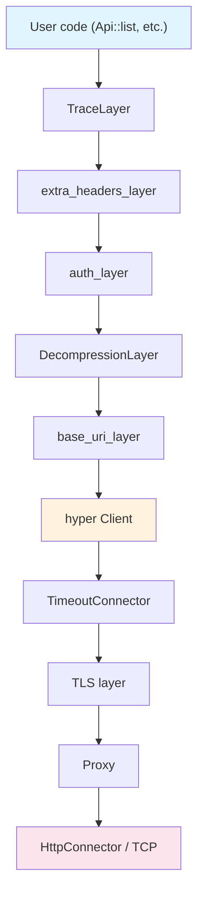

| Layer | Role |
|-------|------|
| **TraceLayer** | Creates OpenTelemetry-compatible HTTP spans. Records tracing information for requests and responses. |
| **extra_headers_layer** | Adds custom headers such as impersonation headers. |
| **auth_layer** | Handles Bearer tokens, exec-based authentication, and automatic token refresh. |
| **DecompressionLayer** | Decompresses gzip responses (requires the `gzip` feature). |
| **base_uri_layer** | Prepends the `cluster_url` prefix to all request URLs. |
| **hyper Client** | Performs the actual transport over HTTP/1.1 + HTTP/2. |
| **TimeoutConnector** | Applies separate timeouts for connect, read, and write operations. |
| **TLS layer** | Handles TLS based on the `rustls-tls` or `openssl-tls` feature. |
| **Proxy** | Routes through SOCKS5/HTTP proxies (`socks5`/`http-proxy` features). |
| **HttpConnector** | Creates TCP connections. |

## Config Inference Chain

`Client::try_default()` internally calls `Config::infer()`. It searches for configuration in the following order.

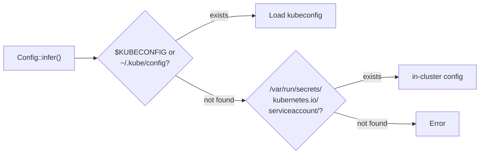

1. **kubeconfig**: The file pointed to by the `$KUBECONFIG` environment variable, or `~/.kube/config`
2. **in-cluster**: The token and CA certificate from `/var/run/secrets/kubernetes.io/serviceaccount/`
3. If neither is found, an error is returned.

### Default Timeouts

| Setting | Default | Purpose |
|---------|---------|---------|
| `connect_timeout` | 30s | TCP connection establishment |
| `read_timeout` | 295s | Waiting for a response |
| `write_timeout` | 295s | Sending a request |

:::warning[The 295-second timeout trap]
The `read_timeout` is set to 295 seconds to support watch long-polling. However, this same timeout applies to regular GET/PUT/PATCH requests as well.

During a network outage, even a simple `pods.get("name")` can block for nearly 5 minutes.

**Mitigation strategies:**

```rust
// Option 1: Apply a tokio timeout to individual calls
let pod = tokio::time::timeout(
    Duration::from_secs(10),
    pods.get("my-pod")
).await??;

// Option 2: Separate Clients by purpose
let short_cfg = Config::infer().await?;
let short_cfg = Config {
    read_timeout: Some(Duration::from_secs(30)),
    ..short_cfg
};
let api_client = Client::try_from(short_cfg)?;
// Use the default 295s Client for the watcher
```
:::

## Authentication Handling

The auth_layer handles all authentication.

| Method | Behavior |
|--------|----------|
| **Static token** | Adds an `Authorization: Bearer <token>` header. |
| **Client certificate** | Authenticates via mTLS at the TLS layer. |
| **exec plugin** | Calls an external program to obtain a token (e.g., `aws-iam-authenticator` for AWS EKS). |
| **Token refresh** | Automatically refreshes the token before it expires. |

:::warning[Credential rotation during long-running processes]
If credentials are rotated while a watcher is running for an extended period and the connection drops, the reconnection may use stale credentials and fail permanently.

Mitigation: Recreate the Client, or use exec plugin-based authentication to obtain a fresh token on every call.
:::

## Customizing Client

`ClientBuilder` allows you to customize the middleware stack.

```rust
use kube::client::ClientBuilder;

let config = Config::infer().await?;
let client = ClientBuilder::try_from(config)?
    // Custom Tower layers can be added here
    .build();
```

### Pattern: Separating Clients by Purpose

Separating a watcher Client (long timeout) from an API call Client (short timeout) is a common production pattern.

```rust
// Client for watchers — default 295s timeout
let watcher_client = Client::try_default().await?;

// Client for API calls — short timeout
let mut api_config = Config::infer().await?;
api_config.read_timeout = Some(Duration::from_secs(30));
api_config.write_timeout = Some(Duration::from_secs(30));
let api_client = Client::try_from(api_config)?;

// Use api_client in the reconciler
struct Context {
    api_client: Client,
}
```

This way, the watcher maintains its long-polling connection while API calls within the reconciler time out quickly.


---

# Journey of a Request

This section traces how a single `pods.list()` call internally passes through code to reach the Kubernetes API server and how the response comes back.

## The Calling Code

```rust
let client = Client::try_default().await?;
let pods: Api<Pod> = Api::default_namespaced(client);
let list = pods.list(&ListParams::default()).await?;
```

Let's follow the full path these three lines take internally.

## Overall Flow

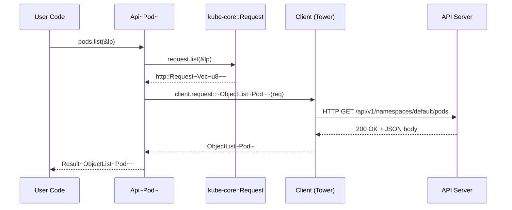

## Inside Api&lt;K&gt;

`Api<K>` is a thin handle that connects kube-core's URL builder with the Client.

```rust title="kube-client/src/api/mod.rs (simplified)"
pub struct Api<K> {
    request: kube_core::Request,   // URL path builder
    client: Client,
    namespace: Option<String>,
    _phantom: std::iter::Empty<K>, // Instead of PhantomData — guarantees Send
}
```

Internal behavior when `list()` is called:

1. `self.request.list(&lp)` — Builds an `http::Request<Vec<u8>>`.
2. The URL is assembled: `/api/v1/namespaces/{ns}/pods?limit=...&labelSelector=...`
3. An extension is added to the request (the string `"list"` for tracing purposes).
4. The actual request is sent via `self.client.request::<ObjectList<Pod>>(req).await`.

## kube-core::Request — URL Builder

`kube_core::Request` is a pure builder that holds the URL path.

```rust title="kube-core/src/request.rs (conceptual)"
pub struct Request {
    url_path: String, // e.g., "/api/v1/namespaces/default/pods"
}

impl Request {
    pub fn list(&self, lp: &ListParams) -> Result<http::Request<Vec<u8>>> {
        let url = format!("{}?{}", self.url_path, lp.as_query_string());
        http::Request::builder()
            .method("GET")
            .uri(url)
            .body(vec![])
    }
}
```

The key point is that **no network transmission occurs at all**. Each method like `list()`, `get()`, `create()`, and `watch()` simply returns an `http::Request` with the appropriate HTTP method and query parameters assembled. This separation allows kube-core to be tested without any network dependencies.

## Request Execution Through Client

The `Client::request::<T>(req)` method executes the actual request.

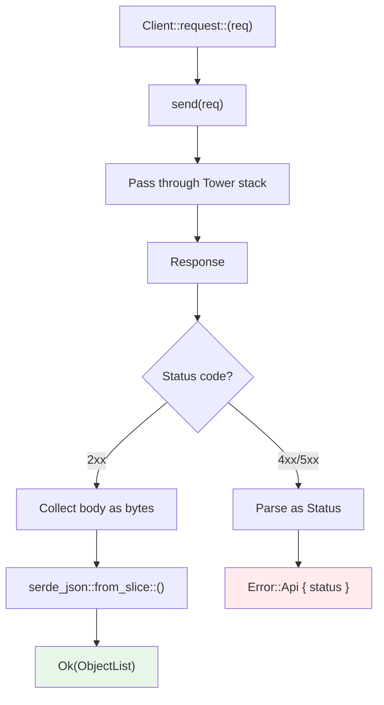

1. **`send(req)`**: Sends the HTTP request through the [Tower middleware stack](./client-and-tower-stack.md).
2. **Error handling (`handle_api_errors`)**: Checks the status code.
   - 4xx/5xx: Parses the response body into a `Status` struct and returns `Error::Api`.
   - 2xx: Continues with normal processing.
3. **Deserialization**: Collects the response body as bytes, then converts it with `serde_json::from_slice::<T>()`.

### Error Branches

| Error Type | Type | When It Occurs |
|------------|------|----------------|
| Network error | `Error::HyperError` | TCP connection failure, DNS resolution failure, etc. |
| HTTP error | `Error::HttpError` | HTTP protocol-level errors |
| API error | `Error::Api { status }` | 4xx/5xx returned by Kubernetes |
| Deserialization error | `Error::SerializationError` | JSON parsing failure |

The `status` field of `Error::Api` is a structured error sent by the Kubernetes API server:

```rust
let err = pods.get("nonexistent").await.unwrap_err();
if let kube::Error::Api(status) = err {
    println!("code: {}", status.code);       // 404
    println!("reason: {}", status.reason);    // "NotFound"
    println!("message: {}", status.message);  // "pods \"nonexistent\" not found"
}
```

## The Special Nature of Watch Requests

Regular requests complete with a request-response cycle, but watch requests return a **long-lived stream**.

```rust
// Regular request: done when it completes
let list = pods.list(&lp).await?;

// Watch request: infinite stream
let mut stream = pods.watch(&WatchParams::default(), "0").await?;
while let Some(event) = stream.try_next().await? {
    // Process each WatchEvent one by one
}
```

### Internal Behavior

`Client::request_events::<T>(req)` handles the watch stream:

1. `send(req)` -> `Response<Body>` (chunked transfer encoding)
2. Convert Body to `AsyncBufRead`
3. Split by lines (each line is a single JSON object)
4. Deserialize each line into `WatchEvent<T>`
5. Return `TryStream<Item = Result<WatchEvent<T>>>`

### WatchEvent

The API server sends five types of events:

```rust
pub enum WatchEvent<K> {
    Added(K),               // Resource was created
    Modified(K),            // Resource was modified
    Deleted(K),             // Resource was deleted
    Bookmark(Bookmark),     // Progress marker (updates resourceVersion)
    Error(Box<Status>),     // Error sent by the API server (e.g., 410 Gone)
}
```

`Bookmark` is not an actual resource change. It is a marker periodically sent by the API server to communicate the current `resourceVersion`. When a connection drops and reconnects, the watch can resume from this `resourceVersion`.

:::tip[raw watch vs watcher()]
`Api::watch()` is a raw watch stream. It ends when the connection drops and has no handling for `resourceVersion` expiration. In production, use `kube_runtime::watcher()`, which adds automatic reconnection and error recovery on top.

The internal workings of watcher are covered in **Watcher State Machine**.
:::


---

# Runtime Internals

This section covers what `kube-runtime` does under the hood. We examine the watcher's state machine, the reflector's atomic swap caching, the Controller's trigger-scheduler-runner pipeline, and the code generated by derive macros.

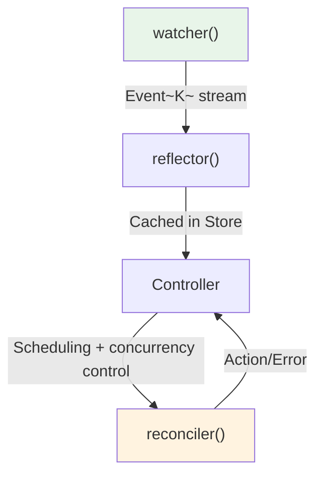

## What This Section Covers

| Document | Key Question |
|----------|-------------|
| [Watcher](./watcher.md) | How does the state machine work, and how does it recover from errors? |
| [Reflector and Store](./reflector-and-store.md) | How does the in-memory cache maintain consistency? |
| [Controller Pipeline](./controller-pipeline.md) | What path does data take from trigger to reconciler? |
| [CRDs and Derive Macros](./custom-resources.md) | What code does `#[derive(CustomResource)]` actually generate? |

If you have already understood kube's static structure from the **Architecture** section, this section follows what actually happens at runtime.


---

# Watcher

`Api::watch()` simply terminates when the connection drops and does not handle `resourceVersion` expiration. `watcher()` layers a **state machine** on top to provide automatic reconnection, initial list loading, and error recovery as a Stream.

## Role of the Watcher

The limitations of `Api::watch()` can be summarized as follows:

| Limitation | Description |
|-----------|-------------|
| Terminates on disconnect | Must be manually restarted |
| No `resourceVersion` expiration handling | Errors out on 410 Gone responses |
| No initial list | watch only sees changes "from now on" |

`watcher()` handles all of these automatically:

```rust
use kube::runtime::{watcher, WatchStreamExt};

let wc = watcher::Config::default();
let stream = watcher(api, wc)
    .default_backoff()    // Exponential backoff retry on errors
    .applied_objects();   // Convert Event<K> to K stream
```

## State Machine

The watcher's internals are a state machine that transitions through five states.

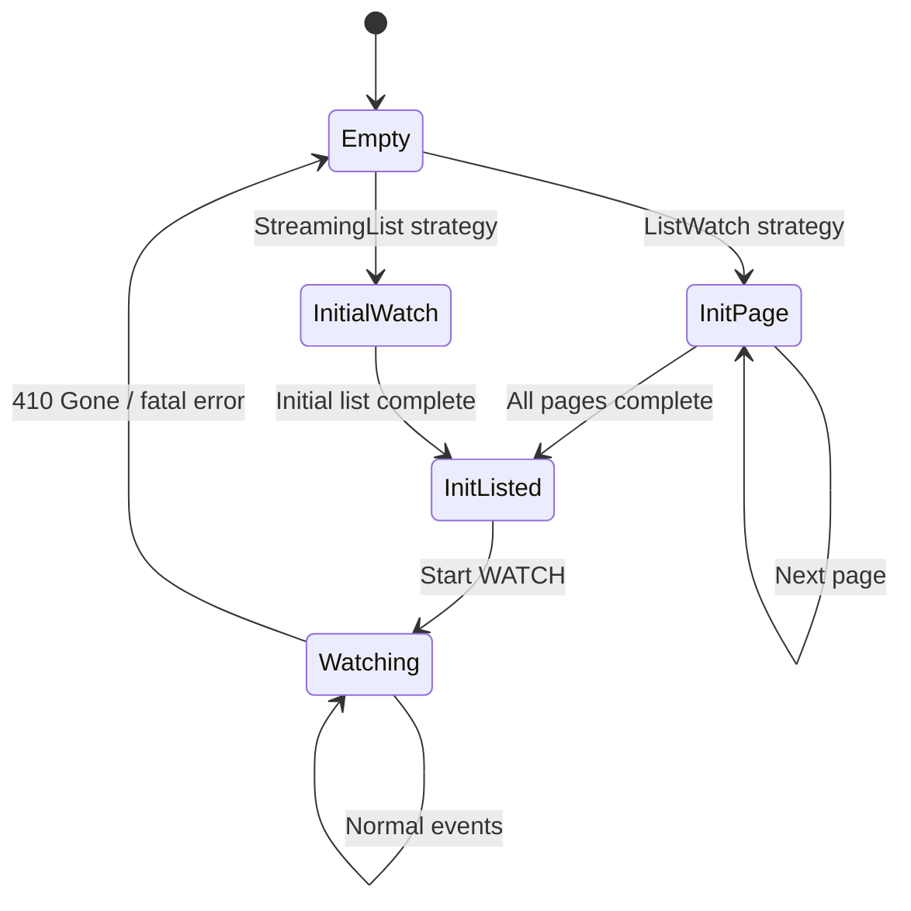

What each state does:

| State | Behavior | API Call |
|-------|----------|----------|
| **Empty** | Initial state or reset after error. Branches based on the configured strategy. | -- |
| **InitPage** | Paginated LIST call (`page_size=500`). Emits `Event::InitApply(obj)` for each page. Fetches the next page using `continue_token`. | `LIST ?limit=500&continue=...` |
| **InitialWatch** | Starts a WATCH with `sendInitialEvents=true`. The server sends existing objects one by one and signals completion with a Bookmark. | `WATCH ?sendInitialEvents=true` |
| **InitListed** | Initial list complete. Emits `Event::InitDone` and starts a WATCH with the last `resourceVersion`. | `WATCH ?resourceVersion=...` |
| **Watching** | Normal watch state. Added/Modified become `Event::Apply`, Deleted becomes `Event::Delete`. Returns to Empty on 410 Gone or disconnection. | -- (maintains existing connection) |

## Two Initial List Strategies

### ListWatch (Default)

The default strategy that works on all Kubernetes versions.

1. `LIST` call (`page_size=500`, same as client-go)
2. Exhaust all pages using `continue_token`
3. Start `WATCH` with the last `resourceVersion`

```rust
// Default -- uses ListWatch strategy
let wc = watcher::Config::default();
```

:::warning[Initial LIST Memory]
On large clusters, the entire resource set is loaded page by page. If the object count is high, memory usage can spike significantly during the initial LIST.
:::

### StreamingList (K8s 1.27+)

An efficient strategy available from Kubernetes 1.27 onwards.

1. `WATCH` + `sendInitialEvents=true` + `resourceVersionMatch=NotOlderThan`
2. Server sends existing objects one by one as Added events
3. Bookmark signals initial list completion

```rust
// Use StreamingList strategy
let wc = watcher::Config::default().streaming_lists();
```

Unlike LIST, objects are processed one at a time, resulting in better memory efficiency. However, it requires Kubernetes 1.27+ (WatchList feature gate).

## Event Abstraction

The watcher transforms Kubernetes `WatchEvent`s into higher-level `Event`s.

```rust
pub enum Event<K> {
    Init,          // Re-list started
    InitApply(K),  // Each object in the initial list
    InitDone,      // Initial list complete
    Apply(K),      // Added/Modified during watch
    Delete(K),     // Deleted during watch
}
```

Mapping from Kubernetes `WatchEvent`:

| WatchEvent | During initial list | During watch |
|-----------|-------------------|-------------|
| Added | `InitApply(K)` | `Apply(K)` |
| Modified | -- | `Apply(K)` |
| Deleted | -- | `Delete(K)` |
| Bookmark | Internal handling (`resourceVersion` update) | Internal handling |

The reason `Init`/`InitApply`/`InitDone` exist separately is for the [reflector's atomic swap pattern](./reflector-and-store.md). A new buffer is created at `Init`, filled with `InitApply`, and swapped in all at once at `InitDone`.

## Error Recovery and Backoff

All errors from the watcher are treated as retriable.

### default_backoff

```rust
let stream = watcher(api, wc)
    .default_backoff();  // Exponential backoff: 1s -> 2s -> 4s -> ... -> 60s (max)
```

The backoff resets upon receiving a successful event.

:::warning[Never use without backoff]
Using the watcher without backoff causes the stream to terminate on the first error. This can lead to a production incident where the entire Controller stops.

If an API server outage occurs without backoff, tight-loop retries can cause CPU/memory to spike out of control.
:::

### 410 Gone Handling

The Kubernetes API server retains `resourceVersion` history for only about 5 minutes. If the delay exceeds this, it returns a 410 Gone response.

When the watcher receives 410 Gone, it returns to the Empty state and performs a full re-list. Enabling bookmarks causes the `resourceVersion` to be periodically updated, significantly reducing the frequency of 410 responses.

## watcher::Config

```rust
let wc = watcher::Config::default()
    .labels("app=myapp")              // label selector
    .fields("status.phase=Running")   // field selector
    .timeout(300)                     // watch timeout (server-side)
    .page_size(100)                   // ListWatch page size
    .streaming_lists()                // StreamingList strategy
    .any_semantic()                   // ListSemantic::Any
    .disable_bookmarks();             // Disable bookmarks (on by default)
```

| Option | Default | Description |
|--------|---------|-------------|
| `labels` | None | Narrow watch scope with a label selector |
| `fields` | None | Field selector |
| `timeout` | 295s | Server-side watch timeout |
| `page_size` | 500 | ListWatch page size |
| `streaming_lists()` | off | Enable StreamingList strategy |
| `any_semantic()` | off | `ListSemantic::Any` -- allows cached data (faster but possibly stale) |
| `disable_bookmarks()` | -- | Disable Bookmark events (on by default; disabling increases 410 frequency) |

## Things to Know

### Watch events are not guaranteed to be delivered

`DELETE` events can be lost during network disconnections. A re-list will recover the final state, but intermediate events are permanently lost. Use **finalizers** when deletion detection is critical.

### Memory spikes during re-list

When a re-list occurs on a large cluster, old data + JSON buffer + deserialized objects all exist in memory simultaneously. Memory usage can temporarily reach 2-3x the normal level. Using StreamingList can mitigate this.

### 410 comes quickly without bookmarks

For quiet resources with infrequent changes, the `resourceVersion` doesn't get updated and expires quickly. Bookmarks periodically update the `resourceVersion` to prevent 410 Gone. Since bookmarks are enabled by default, you don't need to worry about this unless you explicitly disable them.


---

# Reflector and Store

The Reflector is a transparent adapter that intercepts the watcher stream and writes to an in-memory cache (Store). It passes events through unchanged while updating the cache as a side effect.

## The reflector Function

```rust
pub fn reflector<K, W>(writer: Writer<K>, stream: W) -> impl Stream<Item = W::Item>
```

It intercepts each `Event` from the watcher stream, applies it to the `Writer` (cache update), and then passes the event through unmodified to the next stream. Stream consumers are unaware that a reflector sits in the middle.

```rust
use kube::runtime::{reflector, watcher, WatchStreamExt};

let (reader, writer) = reflector::store();
let stream = reflector(writer, watcher(api, watcher::Config::default()))
    .default_backoff()
    .applied_objects();

// Query cache via reader
// Process events via stream
```

## Store Internal Structure

```rust title="kube-runtime/src/reflector/store.rs (simplified)"
type Cache<K> = Arc<RwLock<AHashMap<ObjectRef<K>, Arc<K>>>>;

pub struct Writer<K> {
    store: Cache<K>,
    buffer: AHashMap<ObjectRef<K>, Arc<K>>,
}

pub struct Store<K> {
    store: Cache<K>,
}
```

Rationale behind the internal data structure choices:

| Component | Choice | Reason |
|-----------|--------|--------|
| `AHashMap` | Instead of `std::HashMap` | Internal cache doesn't need DoS protection, so a faster hashmap is used |
| `parking_lot::RwLock` | Instead of `std::RwLock` | Better read concurrency, no poisoning |
| `Arc<K>` | Instead of `K` | Passed to the reconciler as `Arc<K>` to avoid unnecessary cloning |

## Atomic Swap Pattern

This is the core mechanism of the reflector. The `apply_watcher_event()` method behaves differently for each event type.

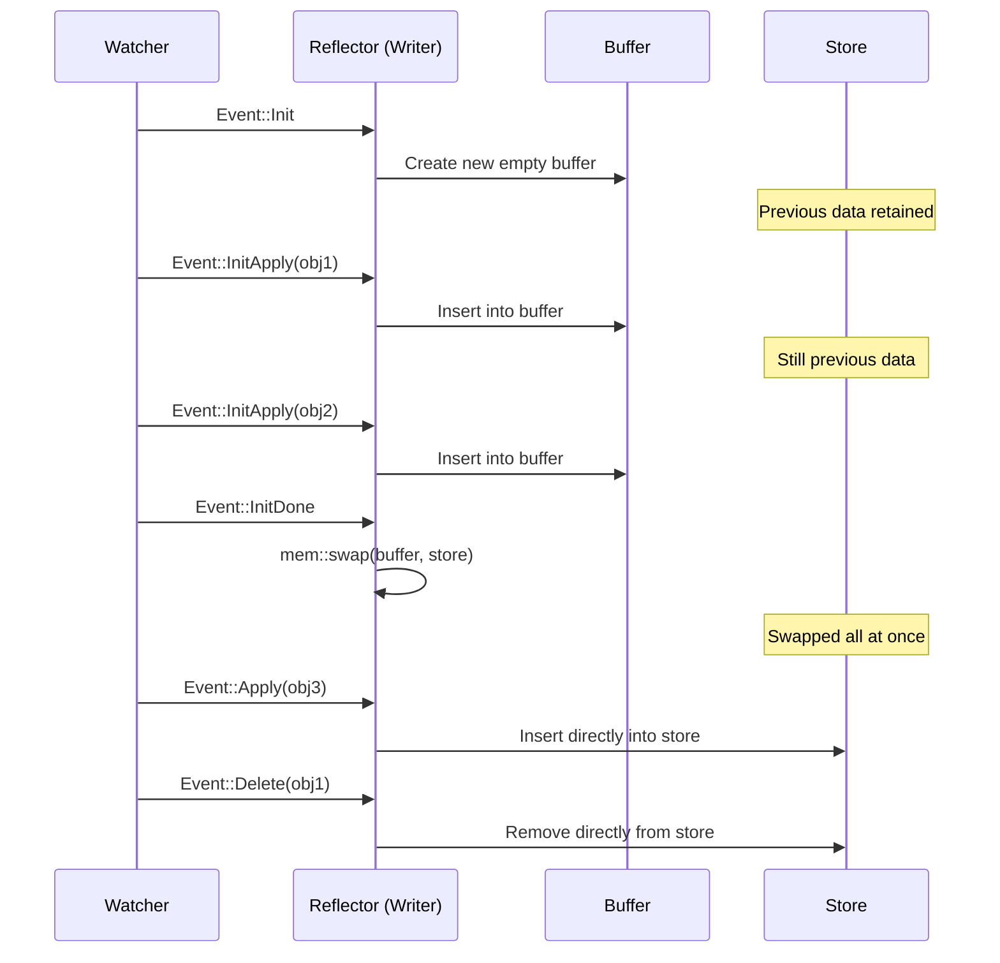

How each event is handled:

| Event | Behavior | Store State |
|-------|----------|-------------|
| `Init` | Creates a new empty buffer | Previous data retained (readable) |
| `InitApply(obj)` | Inserts into buffer | Previous data retained |
| `InitDone` | `mem::swap(&mut buffer, &mut *store.write())` | **Swapped all at once** |
| `Apply(obj)` | Inserts directly into store | Immediately reflected |
| `Delete(obj)` | Removes directly from store | Immediately reflected |

The key aspects of this pattern:

- During a re-list, the Store always maintains a **consistent snapshot**. From `Init` to `InitDone`, the Store retains the previous data as-is.
- The swap at `InitDone` is a pointer exchange, making it O(1). No data copying occurs.
- After the swap, the previous buffer (= old Store data) is dropped.

## Async Nature of Store

:::warning[Most common mistake]
```rust
let (reader, writer) = reflector::store();
// ... reflector setup ...
let items = reader.state(); // <- Returns empty Vec!
```

The Store is empty when created. It only gets populated when the watcher stream is polled (= when the tokio runtime runs it).
:::

Correct usage:

```rust
// Wait until first InitDone before querying
reader.wait_until_ready().await;
let items = reader.state(); // Now data is available
```

Internally, `wait_until_ready()` uses `DelayedInit` (based on a oneshot channel). The Writer sends a signal when it processes the first `InitDone` event, and the Store's `wait_until_ready()` awaits this signal.

When using a Controller, you don't need to worry about this. The Controller internally calls `wait_until_ready()`, so the Store is already populated by the time the reconciler runs.

## Writer vs Store -- Read/Write Separation

| Role | Type | Clone | Responsibility |
|------|------|-------|---------------|
| Write | `Writer<K>` | Not cloneable | Owned by reflector, `apply_watcher_event` |
| Read | `Store<K>` | Cloneable | Shared across multiple consumers (reconciler, health check, etc.) |

Thanks to this separation, only a single Writer modifies the cache, while multiple Store handles can read concurrently. The Controller manages this separation automatically.

## Key Store Methods

```rust
// Full list of cached objects
let all: Vec<Arc<K>> = reader.state();

// Look up by specific ObjectRef
let obj: Option<Arc<K>> = reader.get(&obj_ref);

// Check readiness
let ready: bool = reader.is_ready();

// Wait until first InitDone
reader.wait_until_ready().await;
```

The `Vec<Arc<K>>` returned by `state()` is a snapshot at the time of the call. Subsequent Store updates do not affect the already-returned Vec.

## Shared/Subscriber Mode

:::tip[Requires unstable-runtime feature]
This feature requires activating the `unstable-runtime-stream-control` feature flag.
:::

In the default mode, a single reflector supports a single consumer. With shared mode, a single reflector can fan out events to multiple consumers.

### store_shared and reflect_shared

In v3.x, create a shared store with `reflector::store_shared()` and apply `.reflect_shared()` to the stream.

```rust
use kube::runtime::{reflector, watcher, WatchStreamExt};

// Create shared store (specify buffer size)
let (reader, writer) = reflector::store_shared(1024);

// Apply shared reflector to stream
let stream = watcher(api, wc)
    .default_backoff()
    .reflect_shared(writer)
    .applied_objects();

// Multiple subscribers can receive events
let subscriber1 = reader.subscribe().unwrap();
let subscriber2 = reader.subscribe().unwrap();
```

### Combining with Controller

Use `Controller::for_shared_stream()` to inject a shared stream into a Controller.

```rust
// Create Controller with shared stream
Controller::for_shared_stream(stream, reader.clone())
    .run(reconcile, error_policy, ctx)
```

When multiple Controllers watch the same resource, this can reduce watch connections to a single one. For concrete multi-Controller patterns, see **Generic Controllers -- Shared Reflector**.

Use cases:
- Delivering events from a single watcher to multiple controllers
- When you need to reduce the number of API server watch connections

Internally, it uses an `async_broadcast` channel to distribute `ObjectRef` events to multiple subscribers.


---

# Controller Pipeline

The Controller is the top-level abstraction that ties together watcher, reflector, scheduler, and runner into one unit. We trace the path data takes from `Controller::new()` all the way to the reconciler call.

## Complete Data Flow

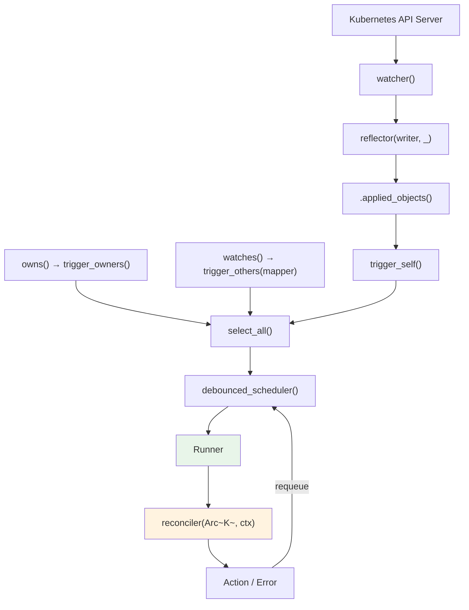

Each step:

1. **watcher()** -- Watches the API server and produces an `Event<K>` stream
2. **reflector()** -- Caches Events in the Store while passing them through unchanged
3. **.applied_objects()** -- Extracts only `K` from `Event::Apply(K)` and `Event::InitApply(K)`
4. **trigger_self()** -- Converts `K` into `ReconcileRequest<K>`
5. **owns()/watches()** -- Creates additional trigger streams for related resources
6. **select_all()** -- Merges all trigger streams into one
7. **debounced_scheduler()** -- Deduplicates identical `ObjectRef`s and applies delays
8. **Runner** -- Controls concurrency and prevents concurrent reconciles of the same object
9. **reconciler** -- Executes user code
10. **Action/Error** -- Feeds back into the scheduler based on the result

## Controller Struct

```rust title="kube-runtime/src/controller/mod.rs (simplified)"
pub struct Controller<K> {
    trigger_selector: SelectAll<BoxStream<'static, Result<ReconcileRequest<K>, watcher::Error>>>,
    trigger_backoff: Box<dyn Backoff + Send>,
    reader: Store<K>,
    config: Config,
}
```

- **trigger_selector**: All trigger streams (`trigger_self` + `owns` + `watches`) merged via `SelectAll`
- **reader**: The read handle to the Store managed by the reflector. Used to retrieve `Arc<K>` in the reconciler
- **config**: Settings for debounce duration, concurrent execution limits, etc.

## Trigger System

### trigger_self -- Primary Resource Changes

When the primary resource (the type specified in `Controller::new`) changes, it generates a `ReconcileRequest` for that resource.

```rust
// Internal flow
watcher Event → .applied_objects() → trigger_self() → ReconcileRequest<K>
```

A `ReconcileRequest` contains the target resource's `ObjectRef` and the trigger reason:

```rust title="ReconcileRequest internals"
pub struct ReconcileRequest<K: Resource> {
    pub obj_ref: ObjectRef<K>,
    pub reason: ReconcileReason,
}
```

`ReconcileReason` has the following variants:

| Variant | Description |
|---------|-------------|
| `Unknown` | External trigger injected via `reconcile_on()` |
| `ObjectUpdated` | Primary resource changed |
| `RelatedObjectUpdated { obj_ref }` | Related resource changed (owns/watches) |
| `ReconcilerRequestedRetry` | Reconciler requested re-execution via `Action::requeue()` |
| `ErrorPolicyRequestedRetry` | `error_policy` requested re-execution |
| `BulkReconcile` | Full re-reconcile requested via `reconcile_all_on()` |
| `Custom { reason }` | User-defined reason (when directly injected into the queue stream) |

### trigger_owners -- Child Resource Changes

```rust
controller.owns::<ConfigMap>(api, wc)
```

1. Creates a separate watcher for ConfigMaps
2. When a ConfigMap changes, checks `metadata.ownerReferences`
3. Extracts the parent (primary resource) `ObjectRef`
4. Emits a `ReconcileRequest` for the parent

When identifying the parent from ownerReferences, only entries whose `kind` and `apiVersion` match the Controller's primary resource type are extracted.

### trigger_others -- Related Resource Changes

```rust
controller.watches::<Secret>(api, wc, |secret| {
    // Return list of ObjectRefs for related primary resources from the Secret
    let name = secret.labels().get("app")?.clone();
    let ns = secret.namespace()?;
    Some(ObjectRef::new(&name).within(&ns))
})
```

1. Creates a separate watcher for Secrets
2. When a Secret changes, calls the user-defined mapper function
3. Emits `ReconcileRequest`s for the `ObjectRef`s returned by the mapper

Use case: Secret change triggers re-reconcile of all resources that reference that Secret.

## External Event Sources -- reconcile_on

`reconcile_on()` lets you connect external triggers beyond watch events to the Controller.

```rust
use tokio::sync::mpsc;
use futures::stream::ReceiverStream;

let (tx, rx) = mpsc::channel::<ObjectRef<MyResource>>(256);

Controller::new(api, wc)
    .reconcile_on(ReceiverStream::new(rx))
    .run(reconcile, error_policy, ctx)
```

When `ObjectRef`s are sent from external webhooks, message queues, timers, etc., the corresponding resource's reconcile is triggered. The `ReconcileReason` is set to `Unknown` in this case.

### Stream-Based API

The standard `Controller::new()` creates a watcher internally, but `for_stream()` lets you inject a pre-filtered stream directly. `owns_stream()` and `watches_stream()` follow the same pattern.

```rust
// Inject an externally created watcher stream into the Controller
let (reader, writer) = reflector::store();
let stream = reflector(writer, watcher(api.clone(), wc))
    .applied_objects();

Controller::for_stream(stream, reader)
    .owns_stream::<ConfigMap>(cm_stream)
    .watches_stream::<Secret, _>(secret_stream, |secret| { /* mapper */ })
    .run(reconcile, error_policy, ctx)
```

### Combining Multiple Streams

This is an advanced pattern for consolidating events from multiple related resources into a single Controller. By combining `for_stream()` and `watches_stream()`, you can inject externally constructed streams into the Controller.

```rust
use futures::stream;
use kube::runtime::{reflector, watcher, Controller, WatchStreamExt};

// Primary resource stream
let (reader, writer) = reflector::store();
let main_stream = reflector(writer, watcher(main_api, wc.clone()))
    .applied_objects()
    .default_backoff();

// Related resource streams
let cm_stream = watcher(cm_api, wc.clone())
    .applied_objects()
    .default_backoff();

let secret_stream = watcher(secret_api, wc.clone())
    .applied_objects()
    .default_backoff();

Controller::for_stream(main_stream, reader)
    .watches_stream(cm_stream, |cm| {
        // ConfigMap -> primary resource mapping
        let name = cm.labels().get("app")?.clone();
        let ns = cm.namespace()?;
        Some(ObjectRef::new(&name).within(&ns))
    })
    .watches_stream(secret_stream, |secret| {
        // Secret -> primary resource mapping
        let name = secret.labels().get("app")?.clone();
        let ns = secret.namespace()?;
        Some(ObjectRef::new(&name).within(&ns))
    })
    .run(reconcile, error_policy, ctx)
```

This pattern manually constructs the watchers that `owns()`/`watches()` create internally. It enables fine-grained control such as stripping fields with `.modify()` or sharing a single reflector across multiple Controllers. Shared patterns are covered in **Generic Controllers**.

:::warning[Unstable feature flags]
These APIs are behind unstable feature flags:
- `reconcile_on()` → `unstable-runtime-reconcile-on`
- `for_stream()`, `owns_stream()`, `watches_stream()` → `unstable-runtime-stream-control`

```toml
kube = { version = "...", features = ["unstable-runtime-reconcile-on", "unstable-runtime-stream-control"] }
```
:::

## Scheduler -- Deduplication and Delay

`debounced_scheduler()` performs deduplication and time-based scheduling using a `DelayQueue` + `HashMap`.

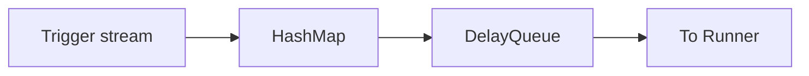

How it works:

- When multiple triggers arrive for the same `ObjectRef`, only **the earliest one** is kept
- When debounce is configured, additional triggers within the configured period are ignored

```
When debounce = 1 second:
t=0.0  trigger(A) → Scheduled for execution in 1 second
t=0.3  trigger(A) → Already scheduled, ignored
t=1.0  A executes
t=1.2  trigger(A) → Scheduled again for 1 second later
```

Why debounce is needed: when the reconciler updates a status, it generates a new `resourceVersion`, which triggers a watch event, leading to an unnecessary re-reconcile. Debounce absorbs this burst. Details are covered in **Reconciler Patterns**.

## Runner -- Concurrency Control

The Runner takes items from the scheduler and dispatches them to the reconciler while controlling concurrency.

Key behaviors:

1. **readiness gate**: Reconciles do not start until `Store::wait_until_ready()` completes
2. **hold_unless**: `ObjectRef`s that are already being reconciled are held back in the scheduler
3. **max_concurrent_executions**: Limits the total number of concurrent reconciles

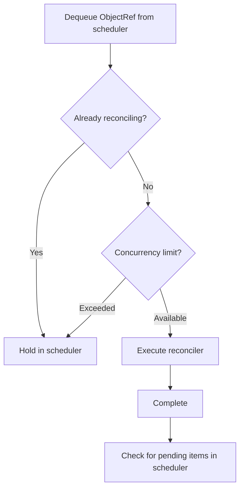

The **hold_unless pattern** is the key. It prevents concurrent reconciles of the same object:

- Object A is reconciling, a new trigger for A arrives, held in scheduler
- A completes, A is dequeued from scheduler and runs again

This ensures reconciles for the same resource are executed in order.

## Reconcile Result Handling

The reconciler's result feeds back into the scheduler.

### On Success

```rust
async fn reconcile(obj: Arc<MyResource>, ctx: Arc<Context>) -> Result<Action, Error> {
    // ... reconcile logic ...

    // Re-check after 5 minutes
    Ok(Action::requeue(Duration::from_secs(300)))

    // Or: wait for the next watch event
    Ok(Action::await_change())
}
```

| Action | Behavior |
|--------|----------|
| `requeue(Duration)` | Schedules re-execution in the scheduler after the specified duration |
| `await_change()` | No proactive requeue; waits for the next watch event |

### On Failure

```rust
fn error_policy(
    obj: Arc<MyResource>,
    error: &Error,
    ctx: Arc<Context>,
) -> Action {
    Action::requeue(Duration::from_secs(5))
}
```

The scheduler schedules based on the `Action` returned by `error_policy`.

## Config

```rust
use kube::runtime::controller::Config;

controller.with_config(
    Config::default()
        .debounce(Duration::from_secs(1))  // Minimum interval between triggers
        .concurrency(10)                    // Maximum concurrent reconciles
)
```

| Setting | Default | Description |
|---------|---------|-------------|
| `debounce` | 0 (none) | Minimum interval between triggers. Useful for absorbing bursts |
| `concurrency` | 0 (unlimited) | Concurrent reconcile limit. 0 means unlimited |

## Shutdown

```rust
// React to SIGTERM/SIGINT
controller.shutdown_on_signal()

// Custom shutdown trigger
controller.graceful_shutdown_on(async {
    // Some condition...
})
```

Graceful shutdown behavior:
1. Stops starting new reconciles
2. Waits for in-progress reconciles to complete

Internally uses `tokio::signal`.


---

# CRDs and Derive Macros

`#[derive(CustomResource)]` generates an entire Kubernetes Custom Resource Definition from a single Rust struct. Understanding what code this macro actually produces and how the schema is generated helps you debug CRD-related issues.

## Input Code

```rust
#[derive(CustomResource, Clone, Debug, Serialize, Deserialize, JsonSchema)]
#[kube(group = "example.com", version = "v1", kind = "Document")]
#[kube(namespaced, status = "DocumentStatus")]
pub struct DocumentSpec {
    pub title: String,
    pub content: String,
}

#[derive(Clone, Debug, Serialize, Deserialize, JsonSchema)]
pub struct DocumentStatus {
    pub phase: String,
}
```

All you define is `DocumentSpec` (and optionally `DocumentStatus`). The macro generates everything else.

## Generated Code

You can inspect what `#[derive(CustomResource)]` produces using `cargo expand`.

### 1. Document Struct

```rust title="Generated code (simplified)"
pub struct Document {
    pub metadata: ObjectMeta,
    pub spec: DocumentSpec,
    pub status: Option<DocumentStatus>,
}
```

The user-defined `DocumentSpec` becomes the `spec` field and `DocumentStatus` becomes the `status` field. `metadata` is always `ObjectMeta`.

### 2. Resource Trait Implementation

```rust title="Generated code (simplified)"
impl Resource for Document {
    type DynamicType = ();
    type Scope = NamespaceResourceScope; // #[kube(namespaced)]

    fn kind(_: &()) -> Cow<'_, str> { "Document".into() }
    fn group(_: &()) -> Cow<'_, str> { "example.com".into() }
    fn version(_: &()) -> Cow<'_, str> { "v1".into() }
    fn plural(_: &()) -> Cow<'_, str> { "documents".into() }
    fn meta(&self) -> &ObjectMeta { &self.metadata }
    fn meta_mut(&mut self) -> &mut ObjectMeta { &mut self.metadata }
}
```

Without `#[kube(namespaced)]`, it becomes `Scope = ClusterResourceScope`.

### 3. CustomResourceExt Implementation

```rust title="Generated code (simplified)"
impl CustomResourceExt for Document {
    fn crd() -> CustomResourceDefinition { /* Generates the full CRD structure */ }
    fn crd_name() -> &'static str { "documents.example.com" }
    fn api_resource() -> ApiResource { /* Generates ApiResource */ }
    fn shortnames() -> &'static [&'static str] { &[] }
}
```

### 4. Other Implementations

- `HasSpec for Document` -- `fn spec(&self) -> &DocumentSpec`
- `HasStatus for Document` -- `fn status(&self) -> Option<&DocumentStatus>` (when status is specified)
- `Document::new(name, spec)` -- Convenience function for creating new instances

## Schema Generation Process

CRD schema generation goes through three steps:

1. `#[derive(JsonSchema)]` (schemars) on `DocumentSpec` generates an OpenAPI v3 JSON schema
2. kube-derive inserts this schema into the CRD's `.spec.versions[].schema.openAPIV3Schema` field
3. Calling `Document::crd()` returns the completed CRD

Structure of the final CRD:

```yaml title="CRD generated by Document::crd()"
apiVersion: apiextensions.k8s.io/v1
kind: CustomResourceDefinition
metadata:
  name: documents.example.com
spec:
  group: example.com
  names:
    kind: Document
    plural: documents
    singular: document
  scope: Namespaced
  versions:
  - name: v1
    served: true
    storage: true
    schema:
      openAPIV3Schema:
        properties:
          spec:
            properties:
              title: { type: string }
              content: { type: string }
            required: [title, content]
          status:
            properties:
              phase: { type: string }
```

## Key #[kube(...)] Attributes

### Required

| Attribute | Description |
|-----------|-------------|
| `group = "example.com"` | CRD API group |
| `version = "v1"` | API version |
| `kind = "Document"` | Resource kind |

### Scope and Subresources

```rust
#[kube(namespaced)]                     // Namespace-scoped (cluster-scoped without this)
#[kube(status = "DocumentStatus")]      // Enable /status subresource
#[kube(scale = r#"{"specReplicasPath": ".spec.replicas", "statusReplicasPath": ".status.replicas"}"#)]
```

### Metadata

```rust
#[kube(shortname = "doc")]              // kubectl get doc
#[kube(category = "example")]           // kubectl get example (group lookup)
#[kube(printcolumn = r#"{"name":"Phase","type":"string","jsonPath":".status.phase"}"#)]
#[kube(selectable = ".spec.title")]     // Field selector support
```

### Schema Control

```rust
#[kube(schema = "derived")]             // Default: auto-generated from schemars
#[kube(schema = "manual")]              // Manual schema specification
#[kube(schema = "disabled")]            // Disable schema
#[kube(doc = "Document resource description")]  // CRD description
```

### CEL Validation

```rust
#[kube(validation = Rule::new("self.spec.title.size() > 0"))]
```

Performs CEL (Common Expression Language) validation on the Kubernetes server side.

### Version Management

```rust
#[kube(storage)]                        // Store this version in etcd
#[kube(served = true)]                  // Serve via API
#[kube(deprecated = "Migrate to v2")]   // Mark as deprecated
```

## Schema Pitfalls

### Untagged Enum

```rust
#[derive(Serialize, Deserialize, JsonSchema)]
#[serde(untagged)]
enum Value {
    String(String),
    Number(i64),
}
```

schemars generates an `anyOf` schema. Kubernetes may reject this because it does not recognize it as a structural schema.

**Workaround**: Use `#[schemars(schema_with = "custom_schema")]` to specify a manual schema.

### Flatten HashMap

```rust
#[derive(Serialize, Deserialize, JsonSchema)]
struct Config {
    name: String,
    #[serde(flatten)]
    extra: HashMap<String, serde_json::Value>,
}
```

schemars generates `additionalProperties`, which may not be compatible with the OpenAPI v3 schema.

### ArgoCD Drift

kube-derive generates empty `shortNames`, `categories`, etc. as defaults. The Kubernetes API server strips these empty arrays, creating a discrepancy between the CRD stored in etcd and the CRD generated by `Document::crd()`. ArgoCD detects this as a permanent drift.

:::tip[Debugging with cargo expand]
To inspect the code generated by the macro, use `cargo expand`:

```bash
cargo expand --lib | grep -A 50 "impl Resource for Document"
```
:::

## CRD Registration Pattern

A pattern for registering a CRD via Server-Side Apply and waiting until it becomes active:

```rust
use kube::runtime::wait::conditions;

let crds = Document::crd();
let crd_api: Api<CustomResourceDefinition> = Api::all(client.clone());

// Register/update CRD via SSA
let pp = PatchParams::apply("my-controller").force();
crd_api.patch("documents.example.com", &pp, &Patch::Apply(crds)).await?;

// Wait until CRD reaches Established status
let establish = conditions::is_crd_established();
let crd = tokio::time::timeout(
    Duration::from_secs(10),
    kube::runtime::wait::await_condition(crd_api, "documents.example.com", establish),
).await??;
```

## Other Derive Macros

### #[derive(Resource)]

Implements the `Resource` trait on an existing type. Useful for structs that wrap k8s-openapi types.

```rust
#[derive(Resource, Clone, Debug, Serialize, Deserialize)]
#[resource(inherit = "ConfigMap")]
struct MyConfigMap {
    metadata: ObjectMeta,
    data: Option<BTreeMap<String, String>>,
}
```

### #[derive(KubeSchema)]

Generates a `JsonSchema` implementation that includes CEL validation rules. Can be used together with `CustomResource` or standalone. For detailed CEL validation usage, see **Admission Validation -- CEL Validation**.

## Schema Overrides

When the default schema generated by schemars does not meet Kubernetes structural schema requirements, you can override the schema on a per-field basis.

### schemars(schema_with)

`#[schemars(schema_with = "function_name")]` completely replaces the schema for a specific field:

```rust
use schemars::schema::{Schema, SchemaObject, InstanceType};

fn quantity_schema(_gen: &mut schemars::SchemaGenerator) -> Schema {
    Schema::Object(SchemaObject {
        instance_type: Some(InstanceType::String.into()),
        format: Some("quantity".to_string()),
        ..Default::default()
    })
}

#[derive(CustomResource, KubeSchema, Serialize, Deserialize, Clone, Debug)]
#[kube(group = "example.com", version = "v1", kind = "MyApp")]
pub struct MyAppSpec {
    #[schemars(schema_with = "quantity_schema")]
    pub memory_limit: String,
}
```

This approach resolves the `untagged enum` and `flatten HashMap` issues discussed in [Schema Pitfalls](#schema-pitfalls).

### x-kubernetes-validations

The `x-kubernetes-validations` extension generated by `#[x_kube(validation)]` is an extension field of the OpenAPI schema:

```yaml title="Generated schema"
properties:
  title:
    type: string
    x-kubernetes-validations:
      - rule: "self != ''"
        message: "title must not be empty"
```

This extension field is evaluated by the API server's CEL engine. It operates independently of the schema's own `type`, `format`, and other fields.

## CRD Version Management

### Per-Version Modules

When serving a CRD in multiple versions, create separate modules for each version and apply `#[derive(CustomResource)]` to each:

```rust
mod v1 {
    #[derive(CustomResource, KubeSchema, Serialize, Deserialize, Clone, Debug)]
    #[kube(group = "example.com", version = "v1", kind = "Document")]
    #[kube(namespaced, status = "DocumentStatus")]
    pub struct DocumentSpec {
        pub title: String,
    }
}

mod v2 {
    #[derive(CustomResource, KubeSchema, Serialize, Deserialize, Clone, Debug)]
    #[kube(group = "example.com", version = "v2", kind = "Document")]
    #[kube(namespaced, status = "DocumentStatus")]
    pub struct DocumentSpec {
        pub title: String,
        pub category: String,  // Added in v2
    }
}
```

### merge_crds()

`merge_crds()` combines multiple single-version CRDs into one multi-version CRD:

```rust title="kube-core/src/crd.rs"
pub fn merge_crds(crds: Vec<CustomResourceDefinition>, stored_apiversion: &str)
    -> Result<CustomResourceDefinition, MergeError>
```

```rust
use kube::core::crd::merge_crds;

let merged = merge_crds(
    vec![v1::Document::crd(), v2::Document::crd()],
    "v2",  // Version to store in etcd
)?;

// Register merged CRD with the API server
crd_api.patch("documents.example.com", &pp, &Patch::Apply(merged)).await?;
```

`merge_crds()` validates the following:
- All CRDs have the same `spec.group`
- All CRDs have the same `spec.names.kind`
- All CRDs have the same `spec.scope`
- Each input CRD is single-version

Only the version specified by `stored_apiversion` is set to `storage: true`; the rest are set to `storage: false`.

:::warning[Version Conversion]
When a request comes in for a version different from the stored version, Kubernetes performs conversion. Simple field additions/removals are handled automatically by the API server, but complex conversions require a conversion webhook.
:::


---

# Patterns

This section covers correct patterns for using kube, along with mistakes that real users encounter repeatedly. It is organized based on the most frequently asked questions from GitHub Issues and Discussions.

## What This Section Covers

| Document | Key Question |
|----------|-------------|
| [Reconciler Patterns](./reconciler.md) | How do you write an idempotent reconciler and avoid infinite loops? |
| [Relations and Finalizers](./relations-and-finalizers.md) | How do owns/watches work internally, and when should you use finalizers? |
| [Server-Side Apply](./server-side-apply.md) | What is the correct way to use SSA, and what are the common pitfalls? |
| [Third-Party CRDs](./third-party-crds.md) | How do you work with CRDs you didn't create yourself? |
| [Error Handling and Backoff](./error-handling-and-backoff.md) | Where do different errors come from, and how do you configure backoff? |
| [Generic Controllers](./generic-controllers.md) | How do you build reusable reconcilers for multiple resources and run multiple Controllers? |
| [Troubleshooting](./troubleshooting.md) | How do you quickly resolve issues using symptom-based diagnosis, debugging tools, and profiling? |

If you have already understood the internals from the **Runtime Internals** section, this section covers "so how should you actually use it."


---

# Reconciler Patterns

The reconciler is the core of the **Controller pipeline**. This section covers how to correctly write a function that "observes the current state and converges toward the desired state," and what common mistakes to avoid.

## Function Signature

```rust
async fn reconcile(obj: Arc<MyResource>, ctx: Arc<Context>) -> Result<Action, Error> {
    // ...
    Ok(Action::requeue(Duration::from_secs(300)))
}
```

| Parameter | Role |
|-----------|------|
| `Arc<K>` | The object retrieved from the Store. Shares a reference without cloning. |
| `Arc<Context>` | A dependency injection container. Holds Client, metrics, configuration, etc. |
| Return `Action` | The next action on success (requeue or await_change). |
| Return `Error` | On failure, passed to error_policy. |

### Context Pattern

To keep the reconciler as close to a pure function as possible, put all external dependencies in the Context.

```rust
struct Context {
    client: Client,
    metrics: Metrics,
    config: AppConfig,
}

// Running the Controller
let ctx = Arc::new(Context { client, metrics, config });
Controller::new(api, wc)
    .run(reconcile, error_policy, ctx)
    .for_each(|res| async move {
        match res {
            Ok(o) => tracing::info!("reconciled {:?}", o),
            Err(e) => tracing::error!("reconcile error: {:?}", e),
        }
    })
    .await;
```

This allows injecting a mock Client during tests.

## Core Principle: Idempotency

**"Calling the same reconcile 100 times must produce the same result."**

The kube-rs Controller follows a **level-triggered** design:

| Approach | Question | kube-rs |
|----------|----------|---------|
| edge-triggered | Reacts to "what **changed**" | ✗ |
| level-triggered | Looks at "what the current state **is**" and converges | ✓ |

The reason the Controller intentionally hides the trigger reason: watch events can be merged, duplicated, or lost. If you depend on "why it was called," you will not behave correctly when events are missed.

`ReconcileReason` only exists in the tracing span. It is meant for logging and debugging purposes, not for branching in reconciler logic.

## Infinite Loop Patterns

### Pattern 1: Writing non-deterministic values to status

```rust
// ✗ Don't do this
status.last_updated = Utc::now();  // Different value every time
api.patch_status("name", &pp, &patch).await?;
// → New resourceVersion → watch event → re-trigger → infinite loop
```

### Pattern 2: Racing with another controller

Your controller adds an annotation to a Deployment, the Deployment controller modifies another field, and that triggers your controller again — creating a loop.

### Prevention

**1. Use only deterministic values**

Use deterministic values like hashes or generation instead of timestamps. Skip the patch if the value hasn't changed.

```rust
// ✓ Only update when the value has changed
if current_status != desired_status {
    api.patch_status("name", &pp, &patch).await?;
}
```

**2. Use predicate_filter**

```rust
use kube::runtime::{predicates, WatchStreamExt};

// Status changes don't change the generation, so they get filtered out
let stream = watcher(api, wc)
    .default_backoff()
    .applied_objects()
    .predicate_filter(predicates::generation);

Controller::for_stream(stream, reader)
```

`predicate_filter()` is a method on the `WatchStreamExt` trait. It is not a method on `Controller`, so you apply it to the stream and then inject it via `Controller::for_stream()`.

:::warning[finalizer + generation predicate]
Adding/removing a finalizer does not change the generation either. Using only `predicates::generation` will cause you to miss finalizer-related events.

```rust
// Combine two predicates
.predicate_filter(predicates::generation.combine(predicates::finalizers))
```
:::

## Action Strategies

| Action | When to Use |
|--------|------------|
| `Action::requeue(Duration)` | When you depend on external state. When periodic checks are needed. |
| `Action::await_change()` | When you only watch your own resource + owns relations. Re-runs only on watch events. |

```rust
// Check external API status every 5 minutes
Ok(Action::requeue(Duration::from_secs(300)))

// Re-run only when a watch event arrives
Ok(Action::await_change())
```

### Strategy in error_policy

```rust
fn error_policy(obj: Arc<MyResource>, err: &Error, ctx: Arc<Context>) -> Action {
    tracing::error!(?err, "reconcile failed");
    Action::requeue(Duration::from_secs(5))
}
```

A fixed interval is simple, but can put load on the API server during persistent errors. Per-key exponential backoff is safer.

## Per-key Backoff Pattern

Unlike Go's controller-runtime, kube-rs does not have built-in per-key backoff. You implement it yourself using a wrapper pattern.

```rust
use std::collections::HashMap;
use std::sync::Mutex;

struct Context {
    client: Client,
    failure_counts: Mutex<HashMap<String, u32>>,
}

async fn reconcile(obj: Arc<MyResource>, ctx: Arc<Context>) -> Result<Action, Error> {
    let key = obj.name_any();

    match reconcile_inner(&obj, &ctx).await {
        Ok(action) => {
            // Reset the counter on success
            ctx.failure_counts.lock().unwrap().remove(&key);
            Ok(action)
        }
        Err(e) => {
            // Increment the counter on failure
            let mut counts = ctx.failure_counts.lock().unwrap();
            let count = counts.entry(key).or_insert(0);
            *count += 1;
            Err(e)
        }
    }
}

fn error_policy(obj: Arc<MyResource>, err: &Error, ctx: Arc<Context>) -> Action {
    let count = ctx.failure_counts.lock().unwrap()
        .get(&obj.name_any()).copied().unwrap_or(1);
    let backoff = Duration::from_secs(2u64.pow(count.min(6))); // Max 64 seconds
    Action::requeue(backoff)
}
```

## Error Handling

### Use thiserror

`Controller::run()` requires specific trait bounds on Error, so you cannot use `anyhow::Error`. Define concrete error types with `thiserror`.

```rust
#[derive(Debug, thiserror::Error)]
enum Error {
    #[error("Kubernetes API error: {0}")]
    KubeApi(#[from] kube::Error),

    #[error("Missing spec field: {0}")]
    MissingField(String),

    #[error("External service error: {0}")]
    External(String),
}
```

### Transient vs. Permanent Errors

| Type | Examples | Handling |
|------|----------|---------|
| Transient | Network errors, timeouts, 429 | Requeue in `error_policy` |
| Permanent | Invalid spec, invalid configuration | Record condition in status + `Action::await_change()` |

```rust
// Permanent error: record in status and don't retry
if !is_valid_spec(&obj.spec) {
    update_status_condition(&api, &obj, "InvalidSpec", "Spec validation failed").await?;
    return Ok(Action::await_change());
}
```


---

# Relations and Finalizers

This section covers how a Controller detects changes across multiple resources (owns, watches) and the finalizer mechanism that guarantees cleanup operations before resource deletion. The internal trigger mechanism of owns and watches is explained in detail in the **Controller pipeline**.

## Ownership Relations — owns

```rust
controller.owns::<ConfigMap>(api, wc)
```

How it works internally:

1. Creates a separate watcher for ConfigMaps
2. When a ConfigMap changes, iterates through `metadata.ownerReferences`
3. If the parent's `kind`/`apiVersion` matches the Controller's primary resource
4. Creates a `ReconcileRequest` with the parent's `ObjectRef`

### Setting ownerReference

Set the ownerReference when creating child resources in the reconciler:

```rust
let owner_ref = obj.controller_owner_ref(&()).unwrap();
let cm = ConfigMap {
    metadata: ObjectMeta {
        name: Some("my-config".into()),
        namespace: obj.namespace(),
        owner_references: Some(vec![owner_ref]),
        ..Default::default()
    },
    data: Some(BTreeMap::from([("key".into(), "value".into())])),
    ..Default::default()
};
```

| Method | `controller` field | Purpose |
|--------|-------------------|---------|
| `controller_owner_ref()` | `true` | Single controller ownership. Used in Controllers. |
| `owner_ref()` | Not set | Multiple owners possible. |

### Automatic Garbage Collection

Resources with ownerReference set are automatically deleted by Kubernetes when the parent is deleted. You can choose between Foreground, Background, or Orphan via `propagationPolicy`.

## Watch Relations — watches

Use `watches` when the relationship cannot be expressed through ownerReference.

```rust
controller.watches::<Secret>(api, wc, |secret| {
    // Return the list of ObjectRefs for related primary resources from the Secret
    let name = secret.labels().get("app")?.clone();
    let ns = secret.namespace()?;
    Some(ObjectRef::new(&name).within(&ns))
})
```

| | owns | watches |
|---|------|---------|
| Relationship definition | Recorded in the resource's `ownerReferences` | Defined in a mapper function in code |
| Mapping | Automatic (`ownerReferences` traversal) | Manual (write a mapper function) |
| Garbage collection | Handled automatically by Kubernetes | Handle manually |
| Use case | Parent-child relationships | Reference relationships (Secret → resource) |

## Finalizer State Machine

Finalizers **guarantee** cleanup operations before resource deletion. A `Delete` watch event can be lost due to network disconnection, but with a finalizer, Kubernetes delays the deletion, ensuring cleanup operations run reliably.

```mermaid
stateDiagram-v2
    state "No finalizer\nNot deleting" as S1
    state "Finalizer present\nNot deleting" as S2
    state "Finalizer present\nDeleting" as S3
    state "No finalizer\nDeleting" as S4

    S1 --> S2 : Add finalizer via JSON Patch
    S2 --> S2 : Event::Apply - normal reconcile
    S2 --> S3 : deletionTimestamp set
    S3 --> S4 : Event::Cleanup succeeds, remove finalizer
    S4 --> [*] : Kubernetes performs actual deletion
```

Four states:

| Finalizer | Deleting? | Behavior |
|-----------|----------|----------|
| Absent | No | Adds finalizer via JSON Patch |
| Present | No | `Event::Apply` → normal reconcile |
| Present | Deleting | `Event::Cleanup` → cleanup then remove finalizer |
| Absent | Deleting | Does nothing (already cleaned up) |

When removing a finalizer, the JSON Patch includes a `Test` operation. If another process has already removed the finalizer, the Patch will fail, preventing concurrency issues.

## Usage Pattern

```rust
use kube::runtime::finalizer::{finalizer, Event};

const FINALIZER_NAME: &str = "myapp.example.com/cleanup";

async fn reconcile(obj: Arc<MyResource>, ctx: Arc<Context>) -> Result<Action, Error> {
    let api = Api::<MyResource>::namespaced(
        ctx.client.clone(),
        &obj.namespace().unwrap(),
    );

    finalizer(&api, FINALIZER_NAME, obj, |event| async {
        match event {
            Event::Apply(obj) => apply(obj, &ctx).await,
            Event::Cleanup(obj) => cleanup(obj, &ctx).await,
        }
    }).await
}

async fn apply(obj: Arc<MyResource>, ctx: &Context) -> Result<Action, Error> {
    // Normal reconcile logic
    Ok(Action::requeue(Duration::from_secs(300)))
}

async fn cleanup(obj: Arc<MyResource>, ctx: &Context) -> Result<Action, Error> {
    // Clean up external resources
    // Once this function succeeds, the finalizer is removed
    Ok(Action::await_change())
}
```

## Caveats

### The object won't be deleted if cleanup fails

The `deletionTimestamp` is set but the finalizer remains, so Kubernetes will not perform the actual deletion. The cleanup **must be designed to eventually succeed**. If it permanently fails, you can force-delete with `kubectl delete --force`, but the cleanup operations will be skipped.

### Finalizer names must be in domain format

Use a format like `"myapp.example.com/cleanup"`. Choose a unique name to avoid conflicts with finalizers from other controllers.

### Cluster-scoped parent + namespace-scoped child

When a cluster-scoped CR owns namespace-scoped children, the parent's namespace is `None` and the child's namespace is `Some("ns")`, which can cause issues with ObjectRef matching. ownerReferences can only reference resources in the same namespace or cluster-scoped resources.

### finalizer + predicate_filter interaction

Adding/removing a finalizer does not change the `generation`. Using only `predicates::generation` will cause you to miss finalizer-related events.

```rust
// ✗ May miss finalizer events
.predicate_filter(predicates::generation)

// ✓ Also detects finalizer changes
.predicate_filter(predicates::generation.combine(predicates::finalizers))
```

## Cleanup Strategy Matrix

The cleanup method varies depending on the relationship type:

| Relationship Type | How It's Set Up | How to Clean Up | Finalizer Needed? |
|-------------------|----------------|-----------------|-------------------|
| **Owned** (owns) | Set `ownerReferences` | Kubernetes automatic GC | Usually not needed |
| **Watched** (watches) | Map via mapper function | Delete directly in reconciler | Needed |
| **External** (outside cluster) | — | Call external API in cleanup | Needed |

- **Owned**: Since `ownerReferences` are set, Kubernetes automatically deletes children when the parent is deleted. A finalizer is not needed unless you also manage external resources.
- **Watched**: There is no ownership relationship, so automatic GC does not apply. You must delete related resources directly in the finalizer's `Event::Cleanup`.
- **External**: Resources outside the cluster (DNS records, cloud load balancers, etc.) are not managed by Kubernetes, so you use a finalizer to call external APIs for cleanup before deletion.


---

# Server-Side Apply

Server-Side Apply (SSA) is Kubernetes' field-ownership-based patching mechanism. Using SSA when creating/modifying resources in a reconciler enables safe, conflict-free multi-actor modifications.

## Why SSA

Limitations of traditional patching approaches:

| Approach | Limitation |
|----------|-----------|
| Merge patch | Overwrites entire arrays. Field deletion is not explicit. |
| Strategic merge patch | Only works with k8s-openapi types. Incomplete for CRDs. |
| JSON patch | Requires exact path specification. Vulnerable to race conditions. |

Advantages of SSA:

- **Field ownership**: The server records "this controller owns this field"
- **Conflict detection**: Touching another owner's field results in a 409 Conflict
- **Declarative**: You only declare "these fields should have these values" and leave everything else untouched
- Naturally fits the idempotent pattern of reconcilers

## Basic Pattern

```rust
use kube::api::{Patch, PatchParams};

let patch = Patch::Apply(serde_json::json!({
    "apiVersion": "v1",
    "kind": "ConfigMap",
    "metadata": { "name": "my-cm" },
    "data": { "key": "value" }
}));
let pp = PatchParams::apply("my-controller"); // field manager name
api.patch("my-cm", &pp, &patch).await?;
```

The `"my-controller"` in `PatchParams::apply("my-controller")` is the field manager name. Field ownership is recorded under this name. Applying again with the same field manager updates the owned fields, while leaving other field managers' fields untouched.

## Common Mistakes

### Missing apiVersion and kind

```rust
// ✗ 400 Bad Request
let patch = Patch::Apply(serde_json::json!({
    "data": { "key": "value" }
}));

// ✓ apiVersion and kind are required
let patch = Patch::Apply(serde_json::json!({
    "apiVersion": "v1",
    "kind": "ConfigMap",
    "metadata": { "name": "my-cm" },
    "data": { "key": "value" }
}));
```

Unlike merge patch, SSA requires `apiVersion` and `kind`.

### Missing field manager

```rust
// ✗ Uses default field manager → unintended ownership conflicts
let pp = PatchParams::default();

// ✓ Explicit field manager
let pp = PatchParams::apply("my-controller");
```

### Overusing force

```rust
// Caution: forcefully takes over fields owned by other field managers
let pp = PatchParams::apply("my-controller").force();
```

`force: true` forcefully takes ownership of fields from other controllers. Use it only in single-owner scenarios such as CRD registration.

### Including unnecessary fields

When serializing an entire Rust struct, fields with `Default` values are also included. SSA takes ownership of those fields, causing conflicts when another controller tries to modify them.

## Status Patching

Status is modified through the `/status` subresource.

```rust
let status_patch = serde_json::json!({
    "apiVersion": "example.com/v1",
    "kind": "MyResource",
    "status": {
        "phase": "Ready",
        "conditions": [{
            "type": "Available",
            "status": "True",
            "lastTransitionTime": "2024-01-01T00:00:00Z",
        }]
    }
});
let pp = PatchParams::apply("my-controller");
api.patch_status("name", &pp, &Patch::Apply(status_patch)).await?;
```

:::warning[Must be wrapped in the full object structure]
```rust
// ✗ Don't send just the status
serde_json::json!({ "phase": "Ready" })

// ✓ Must be wrapped with apiVersion, kind, and status structure
serde_json::json!({
    "apiVersion": "example.com/v1",
    "kind": "MyResource",
    "status": { "phase": "Ready" }
})
```

This is because the Kubernetes API expects the full object structure even at the `/status` endpoint.
:::

## Typed SSA Pattern

Using Rust types instead of `serde_json::json!()` gives you type safety and IDE autocompletion.

```rust
let cm = ConfigMap {
    metadata: ObjectMeta {
        name: Some("my-cm".into()),
        ..Default::default()
    },
    data: Some(BTreeMap::from([("key".into(), "value".into())])),
    ..Default::default()
};
let pp = PatchParams::apply("my-controller");
api.patch("my-cm", &pp, &Patch::Apply(cm)).await?;
```

k8s-openapi types already have `#[serde(skip_serializing_if = "Option::is_none")]` applied, so `None` fields are not serialized. For custom types, you need to set this yourself.

```rust
#[derive(Serialize)]
struct MyStatus {
    phase: String,
    #[serde(skip_serializing_if = "Option::is_none")]
    message: Option<String>,
}
```


---

# Third-Party CRDs

There are several ways to work with CRDs you didn't create yourself, such as Istio VirtualService or Cert-Manager Certificate, in kube. Understand the trade-offs of each approach and choose the one that fits your situation.

## Which Approach Should You Choose?

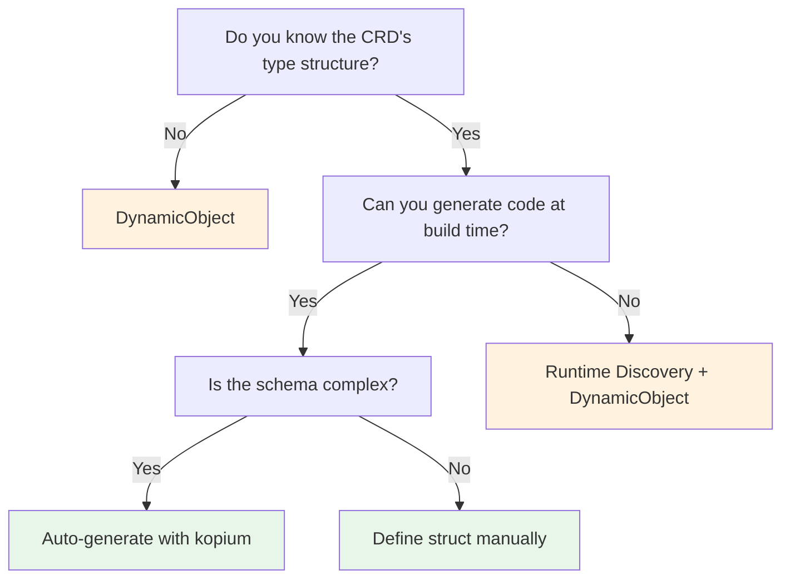

See the detailed explanation of each approach below and the [comparison summary](#comparison-summary).

:::warning[Common confusion]
`#[derive(CustomResource)]` is for **defining** a CRD (generating CRD YAML, registering a new resource type in Kubernetes).

To **consume** an existing CRD, use the approaches below.

"I want to read Istio VirtualService" ≠ "I want to create a new CRD"
:::

## Approach 1: DynamicObject

The fastest way to get started without any type definitions.

```rust
use kube::core::{DynamicObject, ApiResource, GroupVersionKind};

let gvk = GroupVersionKind::gvk("networking.istio.io", "v1", "VirtualService");
let ar = ApiResource::from_gvk(&gvk);
let api = Api::<DynamicObject>::namespaced_with(client, "default", &ar);

let vs = api.get("my-virtualservice").await?;
let hosts = vs.data["spec"]["hosts"].as_array();
```

| Pros | Cons |
|------|------|
| No type definitions needed | Field access is via `serde_json::Value` |
| Zero lines of code to start | No IDE autocompletion |
| Unaffected by schema changes | Risk of runtime errors |

Suitable for prototyping or when you only need to read a few fields.

## Approach 2: Define Structs Manually

For type-safe usage, define the spec/status structs yourself.

```rust
use kube::core::{Object, NotUsed};

#[derive(Clone, Debug, Serialize, Deserialize)]
pub struct VirtualServiceSpec {
    pub hosts: Vec<String>,
    pub http: Option<Vec<HttpRoute>>,
}

#[derive(Clone, Debug, Serialize, Deserialize)]
pub struct HttpRoute {
    pub route: Vec<RouteDestination>,
}

// Wrap with Object<Spec, Status>
type VirtualService = Object<VirtualServiceSpec, NotUsed>;
```

Using `Object<P, U>` lets you access spec/status in a type-safe way while specifying the GVK at runtime via `ApiResource`. See **DynamicType Usage** for more details.

| Pros | Cons |
|------|------|
| Type safe | Must define the entire schema manually |
| IDE autocompletion | Manual updates when upstream schema changes |

Suitable for long-term use with stable CRDs.

## Approach 3: kopium

:::warning[Unstable project]
kopium is an experimental project, and its API and generated output may change. For production use, it is recommended to review the generated code and include it in version control.
:::

[kopium](https://github.com/kube-rs/kopium) is a tool that automatically generates Rust structs from CRD YAML.

```bash
# Generate Rust code from CRD YAML
kopium -f virtualservice-crd.yaml --schema=derived > src/virtualservice.rs
```

Generated output:

```rust
#[derive(CustomResource, Clone, Debug, Serialize, Deserialize, JsonSchema)]
#[kube(group = "networking.istio.io", version = "v1", kind = "VirtualService")]
#[kube(namespaced)]
pub struct VirtualServiceSpec {
    pub hosts: Vec<String>,
    pub http: Option<Vec<HttpRoute>>,
    // ... auto-generated from CRD schema
}
```

| Pros | Cons |
|------|------|
| No manual type definitions needed | Requires kopium tool installation |
| Accurate type generation from schema | Must manage generated code yourself |

You can call kopium from `build.rs` to automatically regenerate types at build time.

## Discovery API

You can query at runtime which resources exist in the cluster.

```rust
use kube::discovery::Discovery;

let discovery = Discovery::new(client.clone()).run().await?;

// Explore groups
for group in discovery.groups() {
    for (ar, caps) in group.recommended_resources() {
        println!("{}/{} (scope: {:?})", ar.group, ar.kind, caps.scope);
    }
}

// Convert a specific GVK → ApiResource
let (ar, caps) = discovery.resolve_gvk(&gvk)?;
let api = Api::<DynamicObject>::all_with(client, &ar);
```

Use cases:
- Check if a specific CRD is installed in the cluster
- Obtain an `ApiResource` from a GVK to determine URL path and scope
- Build tools like `kubectl api-resources`

## Controller::new_with — Dynamic Type Controller

Creating a Controller with `DynamicObject` lets you watch CRDs without defining Rust structs at compile time.

```rust
use kube::core::{DynamicObject, ApiResource, GroupVersionKind};
use kube::runtime::Controller;

let gvk = GroupVersionKind::gvk("example.com", "v1", "MyResource");
let ar = ApiResource::from_gvk(&gvk);
let api = Api::<DynamicObject>::all_with(client, &ar);

Controller::new_with(api, wc, ar)
    .run(reconcile, error_policy, ctx)
```

`new_with()` explicitly accepts a `DynamicType`, so it is used for types like `DynamicObject` where `DynamicType` is not `Default`. Combined with the Discovery API, you can determine watch targets at runtime.

## Comparison Summary

| Approach | Type Safe | Setup Cost | Maintenance | Best For |
|----------|----------|-----------|-------------|----------|
| DynamicObject | None | None | None | Prototypes, reading a few fields |
| Manual struct | Yes | High | Manual | Stable CRDs, long-term use |
| kopium | Yes | Medium | Regeneration | Complex CRDs, automation possible |
| Discovery + Dynamic | None | None | None | Determining resource types at runtime |


---

# Error Handling and Backoff

Errors in kube occur at multiple layers. This section maps out where different errors originate and how to handle them at each layer.

## Error Source Map

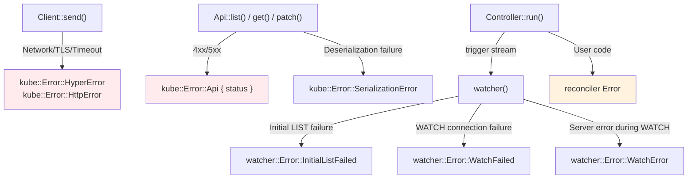

| Layer | Error Type | Cause |
|-------|-----------|-------|
| Client | `HyperError`, `HttpError` | Network, TLS, timeout |
| Api | `Error::Api { status }` | Kubernetes 4xx/5xx response |
| Api | `SerializationError` | JSON deserialization failure |
| watcher | `InitialListFailed` | Initial LIST failure |
| watcher | `WatchFailed` | WATCH connection failure |
| watcher | `WatchError` | Server error during WATCH (410 Gone, etc.) |
| Controller | reconciler Error | Raised in user code |

## Watcher Errors and Backoff

:::warning[You must attach a backoff]
```rust
// ✗ Stream terminates on first error → Controller stops
let stream = watcher(api, wc);

// ✓ Automatic retry with exponential backoff
let stream = watcher(api, wc).default_backoff();
```
:::

### default_backoff

Applies `ExponentialBackoff`: 800ms → 1.6s → 3.2s → ... → 30s (max). The backoff resets when a successful event is received. If no errors occur for 120 seconds, the timer also resets.

### Custom backoff

```rust
use backon::ExponentialBuilder;

let stream = watcher(api, wc).backoff(
    ExponentialBuilder::default()
        .with_min_delay(Duration::from_millis(500))
        .with_max_delay(Duration::from_secs(30)),
);
```

## Reconciler Errors and error_policy

```rust
fn error_policy(obj: Arc<MyResource>, err: &Error, ctx: Arc<Context>) -> Action {
    tracing::error!(?err, "reconcile failed");

    match err {
        // Transient error: retry
        Error::KubeApi(_) => Action::requeue(Duration::from_secs(5)),
        // Permanent error: don't retry
        Error::MissingField(_) => Action::await_change(),
    }
}
```

`Controller::run(reconcile, error_policy, ctx)`:
- When the reconciler returns `Err`, `error_policy` is called
- Schedules according to the `Action` returned by `error_policy`

### Current Limitations

- `error_policy` is a **synchronous function**. It cannot perform async operations (sending metrics, updating status, etc.)
- There is no success reset callback. To implement per-key backoff, you need to wrap the reconciler ([Per-key backoff pattern](./reconciler.md#per-key-backoff-pattern))

## Client-Level Retries

kube-client does not have built-in retries for regular API calls. When `create()`, `patch()`, `get()`, etc. fail, they return the error as-is.

To implement retries yourself, use Tower's retry middleware:

```rust
use tower::retry::Policy;

struct RetryPolicy;

impl Policy<Request<Body>, Response<Body>, Error> for RetryPolicy {
    // Only retry on 5xx, timeouts, and network errors
    // Don't retry on 4xx (the request itself is wrong)
}
```

### Retryability

| Error | Retryable | Reason |
|-------|-----------|--------|
| 5xx | Yes | Temporary server failure |
| Timeout | Yes | Temporary network issue |
| 429 Too Many Requests | Yes | Rate limit → wait and retry |
| Network error | Yes | Temporary connection failure |
| 4xx (400, 403, 404, etc.) | No | The request is wrong |
| 409 Conflict | No | SSA conflict → fix the logic |

## Timeout Strategy

As covered in **Client internals**, the default `read_timeout` is set to 295 seconds for watches, which can cause regular API calls to block for up to 5 minutes.

### Mitigation 1: Separate Clients

```rust
// Client for watchers (default 295s)
let watcher_client = Client::try_default().await?;

// Client for API calls (short timeout)
let mut config = Config::infer().await?;
config.read_timeout = Some(Duration::from_secs(15));
let api_client = Client::try_from(config)?;
```

### Mitigation 2: Wrap Individual Calls

```rust
let pod = tokio::time::timeout(
    Duration::from_secs(10),
    api.get("my-pod"),
).await??;
```

### Mitigation 3: Not a Big Issue in Controllers

The watchers managed by the Controller need long timeouts. You only need to wrap the API calls inside the reconciler with a timeout.


---

# Generic Controllers

This section covers patterns for reusing a single reconciler logic across multiple resource types, or handling resources whose types are determined at runtime.

## PartialObjectMeta-Based Generic Reconciler

When you only need to process metadata for any resource (label syncing, annotation-based logic, etc.), write a generic reconciler using `PartialObjectMeta<K>`.

```rust title="kube-core/src/metadata.rs (simplified)"
pub struct PartialObjectMeta<K = DynamicObject> {
    pub types: Option<TypeMeta>,
    pub metadata: ObjectMeta,
    pub _phantom: PhantomData<K>,
}
```

`PartialObjectMeta<K>` implements the `Resource` trait and uses the group, version, and kind information from `K`. It does not include the actual spec and status.

### Combining with metadata_watcher

```rust
use kube::runtime::watcher::metadata_watcher;
use kube::core::PartialObjectMeta;
use kube::runtime::Controller;

// Controller that handles PartialObjectMeta<MyResource>
let (reader, writer) = reflector::store();
let stream = reflector(writer, metadata_watcher(api, wc))
    .applied_objects();

Controller::for_stream(stream, reader)
    .run(reconcile_metadata, error_policy, ctx)
```

The reconciler receives `Arc<PartialObjectMeta<K>>`:

```rust
async fn reconcile_metadata(
    obj: Arc<PartialObjectMeta<MyResource>>,
    ctx: Arc<Context>,
) -> Result<Action, Error> {
    let name = obj.metadata.name.as_deref().unwrap_or_default();
    let labels = obj.metadata.labels.as_ref();

    // Metadata-based logic
    Ok(Action::await_change())
}
```

:::tip[Memory savings]
`PartialObjectMeta` does not deserialize spec and status, so it significantly saves memory when watching large-scale resources. See **Optimization — metadata_watcher** for details.
:::

## DynamicObject-Based Generics

Use `DynamicObject` when the type is not known at compile time, or when the type is determined by runtime configuration.

```rust title="kube-core/src/dynamic.rs (simplified)"
pub struct DynamicObject {
    pub types: Option<TypeMeta>,
    pub metadata: ObjectMeta,
    pub data: serde_json::Value,
}
```

The `Resource` trait implementation for `DynamicObject` has `DynamicType = ApiResource`. You must provide an `ApiResource` at runtime:

```rust
use kube::api::{Api, ApiResource, DynamicObject};
use kube::discovery;

// Determine resource type at runtime
let ar = ApiResource::from_gvk(&GroupVersionKind {
    group: "example.com".into(),
    version: "v1".into(),
    kind: "Document".into(),
});
let api = Api::<DynamicObject>::all_with(client.clone(), &ar);

// Or obtain from discovery
let (ar, _caps) = discovery::pinned_kind(&client, &gvk).await?;
let api = Api::<DynamicObject>::all_with(client, &ar);
```

### DynamicObject Reconciler

```rust
async fn reconcile_dynamic(
    obj: Arc<DynamicObject>,
    ctx: Arc<Context>,
) -> Result<Action, Error> {
    let name = obj.metadata.name.as_deref().unwrap_or_default();

    // Access JSON values from the data field
    let title = obj.data.get("spec")
        .and_then(|s| s.get("title"))
        .and_then(|t| t.as_str());

    // Use try_parse if you need strong typing
    // let typed: MyResource = obj.try_parse()?;

    Ok(Action::await_change())
}
```

:::warning[Type safety]
`DynamicObject` accesses data via `serde_json::Value`, so there is no compile-time validation. Use static types whenever possible, and only use `DynamicObject` when truly necessary.
:::

## Generic Controller Function

To apply the same controller logic to multiple resource types, abstract it as a generic function:

```rust
use kube::{Api, Client, Resource, ResourceExt};
use kube::runtime::{Controller, watcher, Config};
use std::fmt::Debug;

async fn run_controller<K>(
    client: Client,
    ctx: Arc<Context>,
) -> anyhow::Result<()>
where
    K: Resource<DynamicType = ()>
        + Clone + Debug
        + serde::de::DeserializeOwned
        + Send + Sync + 'static,
{
    let api = Api::<K>::all(client);
    Controller::new(api, watcher::Config::default())
        .shutdown_on_signal()
        .run(reconcile::<K>, error_policy::<K>, ctx)
        .for_each(|res| async move {
            match res {
                Ok(obj) => tracing::info!(?obj, "reconciled"),
                Err(err) => tracing::error!(%err, "reconcile failed"),
            }
        })
        .await;
    Ok(())
}

async fn reconcile<K: Resource<DynamicType = ()>>(
    obj: Arc<K>,
    ctx: Arc<Context>,
) -> Result<Action, Error> {
    let name = obj.meta().name.as_deref().unwrap_or_default();
    // Common reconcile logic
    Ok(Action::await_change())
}
```

The `K: Resource<DynamicType = ()>` bound means static types (CRDs, k8s-openapi types). To use `DynamicObject`, change the bound to `DynamicType = ApiResource` and pass the `ApiResource` accordingly.

## Running Multiple Controllers Concurrently

Running multiple Controllers in a single binary is a common pattern.

### tokio::join!

Waits until all Controllers complete. If one exits, the others continue running:

```rust
let ctrl_a = Controller::new(api_a, wc.clone())
    .shutdown_on_signal()
    .run(reconcile_a, error_policy, ctx.clone())
    .for_each(|_| async {});

let ctrl_b = Controller::new(api_b, wc.clone())
    .shutdown_on_signal()
    .run(reconcile_b, error_policy, ctx.clone())
    .for_each(|_| async {});

// Run both
tokio::join!(ctrl_a, ctrl_b);
```

### tokio::select!

Stops everything when the first Controller exits:

```rust
tokio::select! {
    _ = ctrl_a => tracing::warn!("controller A exited"),
    _ = ctrl_b => tracing::warn!("controller B exited"),
}
```

| Pattern | When one exits | When to use |
|---------|---------------|-------------|
| `join!` | Others continue running | Independent Controllers |
| `select!` | All stop | Controllers that must run together |

:::tip[With shutdown_on_signal]
Setting `shutdown_on_signal()` on each Controller causes all Controllers to shut down gracefully on SIGTERM. When used with `join!`, the process exits after all Controllers complete their graceful shutdown.
:::

## Shared Resources

### Client clone

`kube::Client` is internally wrapped in `Arc`, so `clone()` is cheap. Multiple Controllers share the same Client:

```rust
let client = Client::try_default().await?;

// clone is equivalent to Arc::clone — cheap
let api_a = Api::<ResourceA>::all(client.clone());
let api_b = Api::<ResourceB>::all(client.clone());
```

### Shared Reflector

When multiple Controllers watch the same resource, the watch connections are duplicated. A shared reflector lets multiple Controllers share a single watch:

```rust
use kube::runtime::{reflector, watcher, WatchStreamExt, Controller};

// Create a shared store
let (reader, writer) = reflector::store_shared(1024);
let stream = watcher(api, wc)
    .default_backoff()
    .reflect_shared(writer);

// Branch to each Controller via subscribers
let sub_a = reader.subscribe().unwrap();
let sub_b = reader.subscribe().unwrap();

let ctrl_a = Controller::for_shared_stream(sub_a, reader.clone())
    .run(reconcile_a, error_policy, ctx.clone())
    .for_each(|_| async {});

let ctrl_b = Controller::for_shared_stream(sub_b, reader.clone())
    .run(reconcile_b, error_policy, ctx.clone())
    .for_each(|_| async {});

// Consume the source stream + run both Controllers concurrently
tokio::join!(stream.for_each(|_| async {}), ctrl_a, ctrl_b);
```

`owns`/`watches` also support shared streams. You can use `owns_shared_stream()` to share the watch for child resources as well.

:::warning[Unstable feature]
The shared reflector API is behind the `unstable-runtime-stream-control` feature:

```toml
kube = { version = "3.0.1", features = ["unstable-runtime-stream-control"] }
```
:::

For other ways to reduce API server load, see **Optimization — API server load**.


---

# Troubleshooting

This section organizes common problems encountered during controller operation by symptom. Each item links to relevant detailed documentation.

## Symptom-Based Diagnosis Tables

### Reconciler Infinite Loop

**Symptom**: Reconcile call count increases endlessly and CPU usage is high.

| Cause | How to Verify | Solution |
|-------|--------------|----------|
| Writing non-deterministic values to status (timestamps, etc.) | Check with `RUST_LOG=kube=debug` that a patch occurs every reconcile | Use only deterministic values or skip the patch when nothing changed |
| predicate_filter not applied | Check reconcile logs to see if status-only changes also trigger | Apply `predicate_filter(predicates::generation)` |
| Racing with another controller (annotation ping-pong) | Check resourceVersion change patterns with `kubectl get -w` | Separate field ownership with SSA |

Details: [Reconciler Patterns — Infinite Loop](./reconciler.md#infinite-loop-patterns)

### Continuous Memory Growth

**Symptom**: Pod memory keeps growing over time, eventually OOMKilled.

| Cause | How to Verify | Solution |
|-------|--------------|----------|
| Re-list spikes | Check for periodic spikes in memory graph | Use `streaming_lists()`, reduce `page_size` |
| Large objects in Store cache | Check Store size with jemalloc profiling | Remove managedFields etc. with `.modify()`, use `metadata_watcher()` |
| Watch scope too broad | Check cached object count with Store's `state().len()` | Narrow scope with label/field selectors |

Details: **Optimization — Reflector optimization**, **Optimization — re-list memory spikes**

### Watch Connection Not Recovering After Disconnect

**Symptom**: Controller appears stuck, not receiving any events.

| Cause | How to Verify | Solution |
|-------|--------------|----------|
| 410 Gone + bookmarks not configured | Check logs for `WatchError` 410 | watcher auto-re-lists with `default_backoff()` |
| Credential expiration | Check logs for 401/403 errors | Verify `Config::infer()` auto-refreshes, check exec plugin configuration |
| Backoff not configured | Stream terminates on first error | Always use `.default_backoff()` |

Details: **Watcher State Machine**, [Error Handling and Backoff — Watcher errors](./error-handling-and-backoff.md#watcher-errors-and-backoff)

### API Server Throttling (429)

**Symptom**: `429 Too Many Requests` errors appear frequently in logs.

| Cause | How to Verify | Solution |
|-------|--------------|----------|
| Too many concurrent reconciles | Check active reconcile count in metrics | Set `Config::concurrency(N)` |
| Too many watch connections | Check number of `owns()`, `watches()` calls | Share watches with a shared reflector |
| Too many API calls in reconciler | Check HTTP request count in tracing spans | Leverage Store cache, parallelize with `try_join!` |

Details: **Optimization — Reconciler optimization**, **Optimization — API server load**

### Finalizer Deadlock (Permanently Terminating)

**Symptom**: Resource is permanently stuck in `Terminating` state.

| Cause | How to Verify | Solution |
|-------|--------------|----------|
| cleanup function failing | Check cleanup errors in logs | Design cleanup to eventually succeed (treat missing external resources as success) |
| predicate_filter blocking finalizer events | Check if only `predicates::generation` is used | Use `predicates::generation.combine(predicates::finalizers)` |
| Controller is down | Check Pod status | Automatically handled after controller recovery |

Emergency release: `kubectl patch <resource> -p '{"metadata":{"finalizers":null}}' --type=merge` (skips cleanup)

Details: [Relations and Finalizers — Caveats](./relations-and-finalizers.md#caveats)

### Reconciler Not Running

**Symptom**: Reconciler logs are not printed even when resources change.

| Cause | How to Verify | Solution |
|-------|--------------|----------|
| Store not yet initialized | Readiness probe failing | Verify behavior after `wait_until_ready()` |
| predicate_filter blocking all events | Check predicate logic | Adjust predicate combination or temporarily remove for testing |
| Insufficient RBAC permissions | Check logs for 403 Forbidden | Add watch/list permissions to ClusterRole |
| watcher Config selector too narrow | Verify matches with `kubectl get -l <selector>` | Adjust selector |

## Debugging Tools

### RUST_LOG Configuration

```bash
# Basic debugging: kube internals + controller logic
RUST_LOG=kube=debug,my_controller=debug

# Inspect individual watch events (very verbose)
RUST_LOG=kube=trace

# Check HTTP request level
RUST_LOG=kube=debug,tower_http=debug

# Suppress noise
RUST_LOG=kube=warn,hyper=warn,my_controller=info
```

### Using tracing Spans

Check `object.ref` and `object.reason` in the spans automatically generated by the Controller. Enabling JSON logging allows structured searching.

```bash
# Filter reconcile logs for a specific resource
cat logs.json | jq 'select(.span.object_ref | contains("my-resource-name"))'
```

Details: **Monitoring — Structured logging**

### Checking State with kubectl

```bash
# Check resource status and events
kubectl describe myresource <name>

# Track changes in real-time with watch mode
kubectl get myresource -w

# Check resourceVersion change pattern (infinite loop diagnosis)
kubectl get myresource <name> -o jsonpath='{.metadata.resourceVersion}' -w

# Check finalizer state
kubectl get myresource <name> -o jsonpath='{.metadata.finalizers}'
```

## Profiling

### Memory Profiling (jemalloc)

```toml
[dependencies]
tikv-jemallocator = { version = "0.6", features = ["profiling"] }
```

```rust
#[global_allocator]
static ALLOC: tikv_jemallocator::Jemalloc = tikv_jemallocator::Jemalloc;
```

```bash
# Enable heap profiling
MALLOC_CONF="prof:true,prof_active:true,lg_prof_interval:30" ./my-controller

# Analyze profile dumps
jeprof --svg ./my-controller jeprof.*.heap > heap.svg
```

Objects cached in the Store often account for the majority of memory. If the profile shows large `AHashMap`-related allocations, apply `.modify()` or `metadata_watcher()`.

### Async Runtime Profiling (tokio-console)

Check whether slow reconciler performance is caused by async task scheduling.

```toml
[dependencies]
console-subscriber = "0.4"
```

```rust
// Add at the top of the main function
console_subscriber::init();
```

```bash
# Connect with the tokio-console client
tokio-console http://localhost:6669
```

You can monitor per-task poll time, waker count, and wait time in real time. If a reconciler task is blocked for a long time, the cause may be synchronous operations or slow API calls inside it.


---

# Production

Covers observability, testing strategies, performance optimization, security, availability, and validation needed when deploying kube-based controllers to production.

## What This Section Covers

| Document | Key Question |
|----------|-------------|
| [Monitoring](./observability.md) | How do you set up logging, tracing, and metrics? |
| [Testing](./testing.md) | How do you structure tests from unit tests to E2E? |
| [Optimization](./optimization.md) | How do you run efficiently on large-scale clusters? |
| [Security](./security.md) | How do you configure RBAC, container security, and network policies? |
| [Availability](./availability.md) | What about single-instance operation, leader election, and graceful shutdown? |
| [Admission Validation](./admission.md) | How do you apply CEL validation, Webhooks, and policy frameworks? |


---

# Monitoring

Covers the three pillars of observability for kube-based controllers: structured logging, distributed tracing, and metrics.

## Structured Logging

kube-rs uses the `tracing` crate. Use `tracing-subscriber` to configure output format and filters.

```rust
tracing_subscriber::fmt()
    .with_env_filter("kube=info,my_controller=debug")
    .json() // structured JSON logging
    .init();
```

### Spans Automatically Added by Controller

The Controller automatically creates a tracing span for each reconcile invocation. The span includes the following information:

| Field | Content |
|-------|---------|
| `object.ref` | `ObjectRef` (includes name and namespace) |
| `object.reason` | `ReconcileReason` (object updated, reconciler requested retry, etc.) |

When you call `tracing::info!()` or similar inside the reconciler, this span context is automatically included.

### RUST_LOG Filtering

```bash
# kube internal HTTP request logging
RUST_LOG=kube=debug,my_controller=info

# individual watch event logging (very verbose)
RUST_LOG=kube=trace

# suppress HTTP-level noise
RUST_LOG=kube=info,hyper=warn,tower=warn
```

In production, it is common to set `kube=warn` or higher, and only open the controller logic at `info` or `debug`.

## Distributed Tracing

By connecting OpenTelemetry with an OTLP exporter, you can visualize reconcile invocations in distributed tracing systems (Jaeger, Tempo, etc.).

```rust
use tracing_subscriber::layer::SubscriberExt;
use opentelemetry_otlp::SpanExporter;

let tracer = opentelemetry_otlp::new_pipeline()
    .tracing()
    .with_exporter(SpanExporter::builder().with_tonic().build()?)
    .install_batch(opentelemetry_sdk::runtime::Tokio)?;

let telemetry = tracing_opentelemetry::layer().with_tracer(tracer);

tracing_subscriber::registry()
    .with(telemetry)
    .with(tracing_subscriber::fmt::layer())
    .init();
```

### Client's TraceLayer

As discussed in **Client Internal Architecture**, the `TraceLayer` sits at the top of the Tower stack. Spans are automatically added to all HTTP requests.

Information included in the span:

- HTTP method (GET, PATCH, etc.)
- URL path
- Response status code
- Request duration

These HTTP spans are linked under the reconciler span, so you can directly see which API requests were made during a single reconcile invocation in the tracing UI.

### Using the #[instrument] Macro

Applying `#[instrument]` to the reconciler lets you automatically add function arguments and custom fields to the span:

```rust
use tracing::instrument;

#[instrument(skip(ctx), fields(trace_id))]
async fn reconcile(obj: Arc<MyResource>, ctx: Arc<Context>) -> Result<Action, Error> {
    // Record the OpenTelemetry trace_id in the current span
    Span::current().record(
        "trace_id",
        &tracing::field::display(
            opentelemetry::trace::TraceContextExt::current_with_context()
        ),
    );

    // trace_id is automatically included in subsequent tracing::info!() calls
    tracing::info!("reconciling");
    // ...
    Ok(Action::requeue(Duration::from_secs(300)))
}
```

When using the JSON formatter in `tracing-subscriber`, the `trace_id` field is included in structured logs, allowing you to search for all related logs by trace_id in log systems (Loki, CloudWatch, etc.).

## Metrics

Metrics are collected by consuming the results of the Controller stream.

### Recommended Metrics

| Metric | Type | Description |
|--------|------|-------------|
| `reconcile_total` | Counter | Total reconcile count (with success/failure labels) |
| `reconcile_duration_seconds` | Histogram | Reconcile duration |
| `reconcile_errors_total` | Counter | Error count (with error type labels) |
| `reconcile_queue_depth` | Gauge | Number of items pending in the scheduler |

### Collection Pattern

```rust
let metrics = ctx.metrics.clone();
Controller::new(api, wc)
    .run(reconcile, error_policy, ctx)
    .for_each(|result| {
        let metrics = metrics.clone();
        async move {
            match result {
                Ok((obj_ref, _action)) => {
                    metrics.reconcile_success.inc();
                }
                Err(err) => {
                    metrics.reconcile_errors.inc();
                }
            }
        }
    })
    .await;
```

To measure reconcile duration, measure it directly inside the reconciler function:

```rust
async fn reconcile(obj: Arc<MyResource>, ctx: Arc<Context>) -> Result<Action, Error> {
    let start = std::time::Instant::now();
    let result = reconcile_inner(&obj, &ctx).await;
    ctx.metrics.reconcile_duration.observe(start.elapsed().as_secs_f64());
    result
}
```

### Exposing Metrics

Expose a `/metrics` endpoint via a separate HTTP server. Use the `prometheus` or `metrics` + `metrics-exporter-prometheus` crates.

```rust
use axum::{routing::get, Router};
use prometheus::TextEncoder;

async fn metrics_handler() -> String {
    let encoder = TextEncoder::new();
    let metric_families = prometheus::gather();
    encoder.encode_to_string(&metric_families).unwrap()
}

let app = Router::new().route("/metrics", get(metrics_handler));
```

## Health check

Expose the controller's readiness and liveness as Kubernetes probes.

### Readiness

As discussed in **Reflector and Store**, the Store is empty on creation and only gets populated when the watcher stream is polled. The readiness probe checks whether the Store has completed its initial list load.

```rust
let (reader, writer) = reflector::store();

// Pass the reader to the health server
let health_reader = reader.clone();
tokio::spawn(async move {
    let app = Router::new()
        .route("/readyz", get(move || async move {
            match health_reader.wait_until_ready().await {
                Ok(()) => (StatusCode::OK, "ready"),
                Err(_) => (StatusCode::SERVICE_UNAVAILABLE, "not ready"),
            }
        }));
    let listener = tokio::net::TcpListener::bind("0.0.0.0:8080").await.unwrap();
    axum::serve(listener, app).await.unwrap();
});
```

### Liveness

Checks whether the reconcile loop is alive. Track the last successful reconcile time, and consider it unhealthy if a certain duration is exceeded.

```rust
use std::sync::atomic::{AtomicI64, Ordering};

struct Context {
    client: Client,
    last_reconcile: AtomicI64, // Unix timestamp
}

async fn reconcile(obj: Arc<MyResource>, ctx: Arc<Context>) -> Result<Action, Error> {
    // reconcile logic...
    ctx.last_reconcile.store(
        jiff::Timestamp::now().as_second(),
        Ordering::Relaxed,
    );
    Ok(Action::requeue(Duration::from_secs(300)))
}
```

The liveness endpoint returns 503 if the time elapsed since the last reconcile exceeds the threshold.

### Execution Structure

Run the health server and metrics server alongside the Controller:

```rust
// health + metrics server
tokio::spawn(health_and_metrics_server(reader.clone()));

// Run the Controller
Controller::new(api, wc)
    .run(reconcile, error_policy, ctx)
    .for_each(|res| async move {
        match res {
            Ok(o) => tracing::info!("reconciled {:?}", o),
            Err(e) => tracing::error!("reconcile error: {:?}", e),
        }
    })
    .await;
```

The typical pattern is to run the HTTP server as a separate task using `tokio::spawn`, while the Controller runs on the main task.


---

# Testing

Covers how to test controllers step by step, from unit tests to E2E tests using real clusters.

## Unit Tests

By keeping the reconciler close to a pure function, you can verify logic without making API calls. The key is separating state computation logic from API calls.

```rust
// Separate the logic only
fn desired_configmap(obj: &MyResource) -> ConfigMap {
    ConfigMap {
        metadata: ObjectMeta {
            name: Some(format!("{}-config", obj.name_any())),
            namespace: obj.namespace(),
            owner_references: Some(vec![obj.controller_owner_ref(&()).unwrap()]),
            ..Default::default()
        },
        data: Some(BTreeMap::from([
            ("key".into(), obj.spec.value.clone()),
        ])),
        ..Default::default()
    }
}

#[test]
fn test_desired_configmap_name() {
    let obj = MyResource::new("test", MySpec { value: "hello".into() });
    let cm = desired_configmap(&obj);
    assert_eq!(cm.metadata.name.unwrap(), "test-config");
}

#[test]
fn test_desired_configmap_owner_ref() {
    let obj = MyResource::new("test", MySpec { value: "hello".into() });
    let cm = desired_configmap(&obj);
    let refs = cm.metadata.owner_references.unwrap();
    assert_eq!(refs.len(), 1);
    assert_eq!(refs[0].kind, "MyResource");
}
```

Use unit tests to verify state determination logic (what ConfigMap to create), error classification logic (transient vs. permanent), and condition logic (whether reconciliation is needed).

## Mock Testing — tower-test

Use `tower_test::mock::pair()` to create a fake HTTP layer and inject it into the Client. This tests API call scenarios without a real Kubernetes cluster.

### ApiServerVerifier Pattern

```rust
use tower_test::mock;
use kube::Client;
use http::{Request, Response};
use hyper::Body;

#[tokio::test]
async fn test_reconcile_creates_configmap() {
    let (mock_service, handle) = mock::pair::<Request<Body>, Response<Body>>();
    let mock_client = Client::new(mock_service, "default");

    // Task acting as the API server
    let api_server = tokio::spawn(async move {
        // First request: GET ConfigMap (404 — does not exist, so it needs to be created)
        let (request, send_response) = handle.next_request().await.unwrap();
        assert!(request.uri().path().contains("/configmaps/test-config"));
        send_response.send_response(
            Response::builder()
                .status(404)
                .body(Body::from(serde_json::to_vec(
                    &not_found_status() // test helper — creates a 404 Status object
                ).unwrap()))
                .unwrap()
        );

        // Second request: PATCH ConfigMap (creation)
        let (request, send_response) = handle.next_request().await.unwrap();
        assert_eq!(request.method(), http::Method::PATCH);
        send_response.send_response(
            Response::new(Body::from(serde_json::to_vec(
                &configmap() // test helper — creates the expected ConfigMap object
            ).unwrap()))
        );
    });

    let ctx = Arc::new(Context { client: mock_client });
    let obj = Arc::new(test_resource()); // test helper — creates a MyResource test object
    let result = reconcile(obj, ctx).await;
    assert!(result.is_ok());

    api_server.await.unwrap();
}
```

### Limitations

| Limitation | Description |
|-----------|-------------|
| Order-dependent | Request order must match exactly. Tests fail if the order changes |
| Verbose setup | Mock setup code becomes lengthy for multi-request scenarios |
| Watcher mock | Additional setup is required to mock watcher streams |

Mock tests are useful for verifying that the reconciler makes the correct API calls. However, for complex scenarios, integration tests are more suitable.

## Integration Testing — k3d

Run the controller against a real Kubernetes cluster and verify the results. [k3d](https://k3d.io) runs lightweight Kubernetes clusters locally.

### Cluster Setup

```bash
# Create a k3d cluster (no load balancer needed)
k3d cluster create test --no-lb

# Register the CRD
kubectl apply -f manifests/crd.yaml
```

### Test Code

```rust
use kube::runtime::wait::await_condition;

#[tokio::test]
#[ignore] // Run only in CI
async fn test_reconcile_creates_resources() {
    let client = Client::try_default().await.unwrap();
    let api = Api::<MyResource>::namespaced(client.clone(), "default");

    // Create the resource
    api.create(&PostParams::default(), &test_resource()).await.unwrap();

    // Wait for state convergence
    let cond = await_condition(api.clone(), "test", |obj: Option<&MyResource>| {
        obj.and_then(|o| o.status.as_ref())
           .map(|s| s.phase == "Ready")
           .unwrap_or(false)
    });
    tokio::time::timeout(Duration::from_secs(30), cond)
        .await
        .expect("timeout waiting for Ready")
        .expect("watch error");

    // Verify child resources
    let cm_api = Api::<ConfigMap>::namespaced(client, "default");
    let cm = cm_api.get("test-config").await.expect("ConfigMap not found");
    assert_eq!(cm.data.unwrap()["key"], "expected-value");

    // Cleanup
    api.delete("test", &DeleteParams::default()).await.unwrap();
}
```

`await_condition()` opens a watch stream and waits until the condition is satisfied. Wrap it with `tokio::time::timeout()` to prevent waiting indefinitely.

### CI Setup (GitHub Actions)

```yaml title=".github/workflows/integration.yml"
jobs:
  integration:
    runs-on: ubuntu-latest
    steps:
      - uses: actions/checkout@v4
      - uses: AbsaOSS/k3d-action@v2
        with:
          cluster-name: test
      - run: kubectl apply -f manifests/crd.yaml
      - run: cargo test --test integration -- --ignored
```

## E2E Testing

Build the controller as a Docker image, deploy it, and then verify its behavior. Unlike integration tests, the controller runs as a Pod rather than an in-process instance.

```bash
# 1. Build the image
docker build -t my-controller:test .

# 2. Import the image into the k3d cluster
k3d image import my-controller:test -c test

# 3. Deploy the controller
kubectl apply -f manifests/deployment.yaml

# 4. Wait for the controller to be ready
kubectl wait --for=condition=available deployment/my-controller --timeout=60s

# 5. Apply test resources
kubectl apply -f test-fixtures/

# 6. Verify state convergence
kubectl wait --for=jsonpath='.status.phase'=Ready myresource/test --timeout=60s
```

E2E tests verify items that can only be validated in a deployment environment, such as RBAC, resource limits, health probes, and graceful shutdown.

## Comparison Summary

| Stage | Speed | Required Environment | Verification Scope |
|-------|-------|---------------------|-------------------|
| Unit | Milliseconds | None | State computation logic |
| Mock | Seconds | None | API call scenarios |
| Integration | Minutes | k3d | Reconcile flow, CRD registration |
| E2E | Minutes | k3d + Docker | RBAC, deployment, full system |

The typical approach follows a pyramid structure: write the most unit tests, verify key scenarios with mock and integration tests, and run E2E tests only in the deployment pipeline.


---

# Optimization

Covers optimization methods at each layer to ensure controllers operate efficiently on large-scale clusters.

## Optimization Order

When performance issues arise, here is the priority for where to start. Listed from top to bottom in order of greatest impact with fewest side effects.

| Order | Task | Impact | Risk |
|-------|------|--------|------|
| 1 | **Diagnose** — Identify the actual bottleneck | Sets direction | None |
| 2 | **Narrow selectors** — Add label/field selectors | Reduces API server load, network, and memory simultaneously | Low |
| 3 | **predicate_filter** — Eliminate unnecessary reconciles | Reduces reconcile invocation count | Low (be careful with predicate combinations) |
| 4 | **metadata_watcher** — Skip receiving spec/status | Reduces memory usage | Medium (requires a get call if the reconciler needs the full object) |
| 5 | **Reflector cleanup** — Remove unnecessary fields with `.modify()` | Reduces Store memory | Low |
| 6 | **Reconciler tuning** — debounce, concurrency, cache utilization | Reduces API calls, controls throughput | Low |
| 7 | **Sharding** — Distribute by namespace/label | Horizontal scaling | High (increases operational complexity) |

**Step 1 (diagnosis) is the most important.** The approach differs depending on whether the problem is memory, reconcile latency, or API server throttling. Check logs with `RUST_LOG=kube=debug`, and measure reconcile count and duration using the metrics from [Monitoring](./observability.md). If memory is suspected, verify Store size with jemalloc profiling. For symptom-based diagnosis, refer to **Troubleshooting**.

## Watcher Optimization

### Narrowing the Watch Scope

Use label selectors and field selectors to let the API server do the filtering. This saves both network traffic and memory.

```rust
use kube::runtime::watcher;

let wc = watcher::Config::default()
    .labels("app=myapp")                    // label selector
    .fields("metadata.name=specific-one");  // field selector
```

### metadata_watcher

When you only need metadata and not spec or status, use `metadata_watcher()`. Since it only receives `PartialObjectMeta`, memory usage is significantly reduced.

```rust
use kube::runtime::watcher::metadata_watcher;
use kube::core::PartialObjectMeta;

let stream = metadata_watcher(api, wc).default_backoff();
```

This is particularly effective for resources with large specs (Secrets, ConfigMaps, etc.). However, if the reconciler needs the full object, a separate `get()` call is required.

### StreamingList

Using the StreamingList strategy discussed in **Watcher State Machine** can reduce the memory peak during initial list loading.

```rust
let wc = watcher::Config::default().streaming_lists();
```

Requires Kubernetes 1.27 or later. It streams the initial list via WATCH instead of LIST, so the entire list is not loaded into memory at once.

### Adjusting page_size

The default page_size is 500 (same as client-go).

| Cluster Scale | Recommendation | Reason |
|---------------|----------------|--------|
| Small (hundreds) | Larger (1000+) | Fewer API calls |
| Large (tens of thousands) | Smaller (100~300) | Reduced memory peak |

```rust
let wc = watcher::Config::default().page_size(100);
```

## Reflector Optimization

### Removing Unnecessary Fields

Removing unnecessary fields from objects cached in the **Reflector and Store** saves memory.

```rust
use kube::runtime::WatchStreamExt;

let stream = watcher(api, wc)
    .default_backoff()
    .modify(|obj| {
        // Remove managedFields — significant memory savings
        obj.managed_fields_mut().clear();
        // last-applied-configuration annotation — large annotation from pre-SSA approach
        obj.annotations_mut()
            .remove("kubectl.kubernetes.io/last-applied-configuration");
    });
```

:::warning[modify is applied before storing in the Store]
Fields removed by `modify` will also be inaccessible in the reconciler. Be careful not to remove fields that the reconciler needs.
:::

### Memory Estimation

Estimate memory based on the number of objects cached in the Store and their average size:

| Item | Calculation |
|------|-------------|
| Base usage | object count x average size |
| re-list spike | old store + new buffer + stream buffer = up to 2-3x |

You can verify actual memory usage patterns with jemalloc and `MALLOC_CONF="prof:true"` heap profiling.

## Reconciler Optimization

### Preventing Unnecessary Reconciles

As discussed in **Reconciler Patterns**, prevent self-triggering caused by status changes.

```rust
use kube::runtime::{predicates, watcher, WatchStreamExt};
use kube::runtime::utils::predicate::PredicateConfig;

// Apply predicate_filter to the watcher stream, then inject into the Controller
let (reader, writer) = reflector::store();
let stream = reflector(writer, watcher(api.clone(), wc))
    .applied_objects()
    .predicate_filter(predicates::generation, PredicateConfig::default());

Controller::for_stream(stream, reader)
```

Events where only the status changed are filtered out because the `generation` does not change. If you use finalizers, combine them with `predicates::generation.combine(predicates::finalizers)`.

:::warning[predicate_filter is a stream method]
`predicate_filter()` is a method on the `WatchStreamExt` trait, not on `Controller`. It must be used with `for_stream()`.
:::

### debounce

Absorbs duplicate triggers for the same object within a short time window.

```rust
use kube::runtime::Config;

Controller::new(api, wc)
    .with_config(Config::default().debounce(Duration::from_secs(1)))
```

This is effective in cases like Deployment updates, where multiple ReplicaSet events fire in rapid succession.

### Concurrency Limits

```rust
Controller::new(api, wc)
    .with_config(Config::default().concurrency(10))
```

| Setting | Behavior |
|---------|----------|
| 0 (default) | No limit |
| N | Maximum N concurrent reconciles |

Set an appropriate value to control API server load. Concurrent reconciles for the same object are automatically prevented by the Runner in the **Controller Pipeline**.

### Internal Reconciler Optimization

```rust
async fn reconcile(obj: Arc<MyResource>, ctx: Arc<Context>) -> Result<Action, Error> {
    // 1. Read from the Store (use cache instead of API calls)
    let related = ctx.store.get(&ObjectRef::new("related-name").within("ns"));

    // 2. Skip the patch if no changes are needed
    let current_cm = cm_api.get("my-cm").await?;
    if current_cm.data == desired_cm.data {
        // No patch needed — saves an API call
    } else {
        cm_api.patch("my-cm", &pp, &patch).await?;
    }

    // 3. Parallelize independent API calls
    let (secret, service) = tokio::try_join!(
        secret_api.get("my-secret"),
        svc_api.get("my-service"),
    )?;

    Ok(Action::requeue(Duration::from_secs(300)))
}
```

## Large-Scale Cluster Considerations

### Namespace Isolation

Watching only specific namespaces instead of the entire cluster can significantly reduce load.

```rust
// Entire cluster (high load)
let api = Api::<MyResource>::all(client.clone());

// Specific namespace only (low load)
let api = Api::<MyResource>::namespaced(client.clone(), "target-ns");
```

If you need to handle multiple namespaces, you can run separate Controller instances per namespace.

### re-list Memory Spikes

| Object Count | Average Size | Base Memory | re-list Peak |
|-------------|-------------|-------------|--------------|
| 1,000 | 10KB | 10MB | ~30MB |
| 10,000 | 10KB | 100MB | ~300MB |
| 100,000 | 10KB | 1GB | ~3GB |

Mitigation strategies:
- Reduce peak with StreamingList
- Reduce object size with `metadata_watcher()`
- Remove unnecessary fields with `.modify()`
- Narrow the scope with label selectors

### API Server Load

Each time you add `owns()` or `watches()`, a separate watch connection is created. Each watch maintains a persistent HTTP connection to the API server.

Where possible, use the shared reflector from the `unstable-runtime` feature to let multiple controllers share the same watch.

### Leader election

In HA deployments, only one instance among multiple should be active. For details on leader election mechanisms, third-party crates, and shutdown coordination, see [Availability](./availability.md).

## Scaling Strategies

Covers expansion strategies for when the throughput of a single instance is insufficient.

### Vertical Scaling

This is the first approach to try. Since reconciles are inherently parallel, increasing CPU/memory improves throughput.

| Adjustment | Effect |
|-----------|--------|
| Increase CPU request/limit | Increases reconciler concurrent execution capacity |
| Increase memory | Accommodates Store cache + re-list spikes |
| Increase `Config::concurrency(N)` | Scales the number of concurrent reconciles |

The limit of vertical scaling is the event throughput that a single watcher can handle. If the throughput of a single watch connection becomes the bottleneck, switch to sharding.

### Explicit Sharding

Distributes resources across multiple controller instances. Each instance watches only its assigned scope.

#### Namespace-based Sharding

The simplest approach. Each instance handles a different namespace:

```rust
// Determine the assigned namespace via environment variable
let ns = std::env::var("WATCH_NAMESPACE").unwrap_or("default".into());
let api = Api::<MyResource>::namespaced(client, &ns);
```

#### Label-based Sharding

A pattern used by FluxCD. Assign shard labels to resources, and each instance watches only its corresponding label:

```rust
// label selector per shard
let shard_id = std::env::var("SHARD_ID").unwrap_or("0".into());
let wc = watcher::Config::default()
    .labels(&format!("controller.example.com/shard={}", shard_id));
```

| Strategy | Pros | Cons |
|----------|------|------|
| Namespace-based | Simple implementation, natural isolation | Depends on number of namespaces |
| Label-based | Flexible distribution | Requires label management, duplicate reconciles during redistribution |

Combining leader election with each shard achieves both HA and horizontal scaling simultaneously. For details, see [Availability — Elected Shards](./availability.md#elected-shards--ha--horizontal-scaling).


---

# Security

Kubernetes controllers have the authority to create and modify cluster resources. Since the blast radius of a compromise is wide, apply least privilege and isolation from the design stage.

## Threat Model

First, understand what happens if a controller is compromised.

| Scenario | Attack Vector | Impact |
|----------|--------------|--------|
| Pod compromise | Vulnerable dependency, container escape | Access to API server via ServiceAccount token |
| RBAC over-privilege | `*` verb in ClusterRole | Full cluster resource manipulation on compromise |
| Image tampering | Registry compromise, tag reuse | Malicious code execution |
| Network exposure | Admission webhook port exposed | External access to the webhook endpoint |

Core principle: The goal is to **minimize the blast radius even if a compromise occurs**.

## RBAC Design

### ClusterRole vs Role

| Type | ClusterRole | Role |
|------|------------|------|
| Scope | Entire cluster | Specific namespace |
| Use case | CRD definitions, cluster-scoped resources | Managing resources within a namespace |
| Risk level | High — affects all namespaces | Low — affects only that namespace |

Where possible, limit scope with Role + RoleBinding. Since CRD definitions themselves are cluster-scoped, separate the CRD registration role from the runtime operational role.

### CRD Separation Strategy

```yaml title="CRD registration — executed in CI/CD pipeline"
apiVersion: rbac.authorization.k8s.io/v1
kind: ClusterRole
metadata:
  name: my-controller-crd-admin
rules:
  - apiGroups: ["apiextensions.k8s.io"]
    resources: ["customresourcedefinitions"]
    verbs: ["create", "get", "list", "patch"]
```

```yaml title="Runtime — the controller Pod's ServiceAccount"
apiVersion: rbac.authorization.k8s.io/v1
kind: ClusterRole
metadata:
  name: my-controller-runtime
rules:
  # Primary resource (CRD)
  - apiGroups: ["example.com"]
    resources: ["documents"]
    verbs: ["get", "list", "watch", "patch"]
  - apiGroups: ["example.com"]
    resources: ["documents/status"]
    verbs: ["patch"]
  # Child resources
  - apiGroups: [""]
    resources: ["configmaps"]
    verbs: ["get", "list", "watch", "create", "patch", "delete"]
  # Event recording
  - apiGroups: ["events.k8s.io"]
    resources: ["events"]
    verbs: ["create"]
```

### Principle of Least Privilege

| Rule | Description |
|------|-------------|
| Minimize verbs | Do not grant `*` to resources that only need `get`, `list`, `watch` |
| Specify resources explicitly | List exact resources instead of `resources: ["*"]` |
| Separate status | Manage the primary resource `patch` and the `status` subresource `patch` as separate rules |
| Restrict apiGroups | An empty string (`""`) means only the core API; specify only the groups you need |

:::tip[Determining Required RBAC]
Turn on audit logging to see which APIs the controller actually calls. Use `kubectl auth can-i --list --as=system:serviceaccount:ns:sa-name` to review current permissions.
:::

## Container Security

### SecurityContext

```yaml title="deployment.yaml"
spec:
  containers:
    - name: controller
      securityContext:
        runAsNonRoot: true
        runAsUser: 65534
        readOnlyRootFilesystem: true
        allowPrivilegeEscalation: false
        capabilities:
          drop: ["ALL"]
        seccompProfile:
          type: RuntimeDefault
```

Controllers do not need system privileges beyond network calls (to the API server). Drop all capabilities and run with a read-only filesystem.

### Minimal Image

Rust's static linking allows you to build extremely small images.

```dockerfile title="Dockerfile (musl static linking)"
FROM rust:1.88 AS builder
RUN rustup target add x86_64-unknown-linux-musl
WORKDIR /app
COPY . .
RUN cargo build --release --target x86_64-unknown-linux-musl

FROM scratch
COPY --from=builder /app/target/x86_64-unknown-linux-musl/release/controller /controller
# TLS root certificates (for API server connections)
COPY --from=builder /etc/ssl/certs/ca-certificates.crt /etc/ssl/certs/
USER 65534
ENTRYPOINT ["/controller"]
```

| Base Image | Size | Attack Surface |
|-----------|------|---------------|
| `ubuntu:24.04` | ~78MB | Includes shell, package manager |
| `gcr.io/distroless/static` | ~2MB | No shell, no C library |
| `scratch` | 0MB | Only the binary |

When using `scratch`, you must manually copy TLS certificates. kube's `Client` connects to the API server via TLS, so root certificates are required.

:::warning[musl and TLS Crates]
Using the `rustls` feature enables pure Rust TLS without an OpenSSL dependency. The `openssl-tls` feature requires additional configuration in musl environments.

```toml
kube = { version = "3.0.1", features = ["runtime", "derive", "rustls-tls"] }
```
:::

## NetworkPolicy

Controller Pods only need to communicate with the API server. Start with a deny-all default policy and allow only necessary egress.

```yaml title="networkpolicy.yaml"
apiVersion: networking.k8s.io/v1
kind: NetworkPolicy
metadata:
  name: controller-netpol
  namespace: controller-system
spec:
  podSelector:
    matchLabels:
      app: my-controller
  policyTypes: ["Ingress", "Egress"]
  # Ingress: default deny (allow only if using admission webhooks)
  ingress: []
  egress:
    # API server
    - to:
        - ipBlock:
            cidr: 0.0.0.0/0  # Even better if narrowed to the API server IP
      ports:
        - protocol: TCP
          port: 443
    # DNS
    - to:
        - namespaceSelector: {}
          podSelector:
            matchLabels:
              k8s-app: kube-dns
      ports:
        - protocol: UDP
          port: 53
```

If you use [Admission webhooks](./admission.md), you need to additionally allow ingress from the API server:

```yaml title="Additional ingress for webhooks"
ingress:
  - from:
      - ipBlock:
          cidr: 0.0.0.0/0  # Restrict to API server IP
    ports:
      - protocol: TCP
        port: 8443  # webhook listening port
```

## Supply Chain Security

### Dependency Auditing

```bash
# Check for known vulnerabilities
cargo audit

# Check licenses, duplicates, and banned crates
cargo deny check
```

Integrate `cargo-deny` into CI to run on every build. Specify allowed licenses and banned crates in `deny.toml`.

```toml title="deny.toml (example)"
[licenses]
allow = ["MIT", "Apache-2.0", "BSD-2-Clause", "BSD-3-Clause", "ISC"]

[bans]
deny = [
    # Use rustls instead of openssl
    { name = "openssl-sys" },
]
```

### SBOM Generation

```bash
# Generate CycloneDX BOM with cargo-cyclonedx
cargo cyclonedx --format json
```

At the container image level, use `syft` or `trivy` to generate SBOMs.

### Image Signing and Verification

```bash
# Sign the image with cosign
cosign sign --key cosign.key ghcr.io/org/controller:v1.0.0

# Verify the signature at deployment time (via Kyverno policy or admission controller)
```

Referencing images by digest (`@sha256:...`) instead of tags reduces the risk of image tampering.

## ServiceAccount Token Management

Starting with Kubernetes 1.22+, bound tokens are the default. Additional considerations:

| Setting | Reason |
|---------|--------|
| `automountServiceAccountToken: false` | Prevents token mounting on Pods that don't need it |
| `expirationSeconds: 3600` | Limits token lifetime (default 1 hour) |
| Dedicated ServiceAccount | Do not use the `default` SA |

kube's `Client::try_default()` automatically uses the mounted token, and token renewal on expiry is also automatic.

## Security Checklist

| Item | Verified |
|------|----------|
| Are there no `*` verbs or `*` resources in RBAC? | |
| Are CRD registration and runtime permissions separated? | |
| Is SecurityContext configured with `runAsNonRoot`, `readOnlyRootFilesystem`? | |
| Is capability ALL drop configured? | |
| Is unnecessary traffic blocked with NetworkPolicy? | |
| Are `cargo audit` / `cargo deny` integrated into CI? | |
| Is digest pinning applied to images? | |
| If using admission webhooks, are TLS certificates automatically renewed? | |


---

# Availability

Covers how to ensure availability for kube-based controllers. Most controllers work fine with a single instance, and when HA is needed, leader election is the solution.

## Why a Single Instance Is Sufficient

Kubernetes controllers are different from typical web servers. The watch + reconcile loop is a **queue consumer** model:

1. **Idempotent reconcile**: Following the **reconciler pattern**, every reconcile is idempotent. Even after a temporary interruption and restart, it converges to the desired state
2. **Automatic watcher recovery**: When the watcher restarts, it resumes watching from the `resourceVersion`, or if unavailable, recovers the full state via a re-list
3. **Scheduler deduplication**: Even if multiple events for the same object accumulate, the **scheduler deduplicates them**

When a Pod restarts, there is a brief delay, but no data loss or inconsistency occurs.

### Recovery Timeline

```
t=0    Pod termination begins (SIGTERM)
t=0~30 In-progress reconciles complete (graceful shutdown)
t=30   Pod terminates
...    Deployment schedules a new Pod
t=45   New Pod starts, watcher initializes
t=46   re-list completes, processing of backlogged reconciles begins
```

The default `terminationGracePeriodSeconds: 30` on a `Deployment` is sufficient in most cases. Increase this value if you have long-running reconciles.

## Why replicas: 2 Doesn't Work

Watch-based controllers have no load balancer to route requests. If two instances run simultaneously:

| Problem | Description |
|---------|-------------|
| Duplicate reconciles | Both instances reconcile the same object concurrently |
| Conflicts | SSA field manager conflicts, optimistic concurrency (`resourceVersion`) errors |
| Resource waste | Both instances maintain identical watch streams, doubling API server load |

In particular, with `Server-Side Apply`, if two instances patch with the same `fieldManager`, unintended field ownership issues arise.

:::warning[Rolling Update Caution]
With `strategy.type: RollingUpdate` and `maxSurge: 1`, two instances briefly run simultaneously during deployment. Since most controllers are idempotent, short periods of duplicate execution are harmless, but leader election makes even this window safe.
:::

## Leader Election

A mechanism that ensures only one instance among many is active. kube-rs does not include built-in leader election, so third-party crates are used.

### Lease-based Mechanism

How leader election works using the Kubernetes `Lease` object:

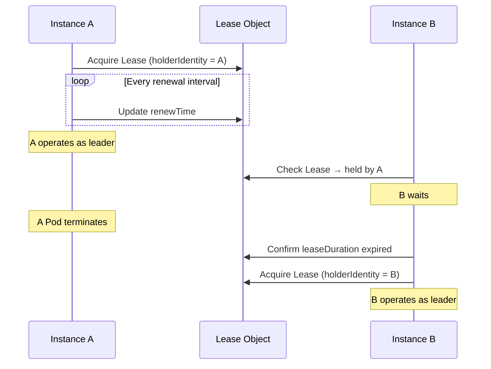

Key parameters:

| Parameter | Meaning | Typical Value |
|-----------|---------|--------------|
| `leaseDuration` | Leader validity period | 15 seconds |
| `renewDeadline` | Renewal attempt deadline | 10 seconds |
| `retryPeriod` | Non-leader retry interval | 2 seconds |

### Third-Party Crates

Leader election crates available in the kube ecosystem:

| Crate | Approach | Features |
|-------|----------|----------|
| `kube-leader-election` | Lease-based | Simple API, provides renewal loop |
| `kube-coordinate` | Lease-based | kube-runtime compatible stream API |
| `kubert::lease` | Lease-based | Used by the Linkerd project |

Usage pattern:

```rust
// Conceptual usage example (API varies by crate)
let lease = LeaseManager::new(client.clone(), "my-controller", "controller-ns");

// Wait until leadership is acquired
lease.wait_for_leadership().await?;

// Run the Controller only while leader
Controller::new(api, wc)
    .shutdown_on_signal()
    .run(reconcile, error_policy, ctx)
    .for_each(|res| async move { /* ... */ })
    .await;
```

### Shutdown Coordination

It is important to safely shut down the Controller when leadership is lost:

```rust
Controller::new(api, wc)
    .graceful_shutdown_on(lease.lost_leadership())
    .run(reconcile, error_policy, ctx)
```

When you pass a leadership-lost future to `graceful_shutdown_on()`, it stops starting new reconciles upon losing leadership, waits for in-progress reconciles to complete, and then shuts down.

## Graceful Shutdown

### shutdown_on_signal

`Controller::shutdown_on_signal()` handles SIGTERM and Ctrl+C.

```rust title="kube-runtime/src/controller/mod.rs (simplified)"
pub fn shutdown_on_signal(mut self) -> Self
```

Behavior:
1. On receiving SIGTERM or SIGINT, stops starting new reconciles
2. Waits for in-progress reconciles to complete
3. Terminates immediately on receiving a second signal

```rust
Controller::new(api, wc)
    .shutdown_on_signal()
    .run(reconcile, error_policy, ctx)
    .for_each(|res| async move {
        match res {
            Ok(obj) => tracing::info!(?obj, "reconciled"),
            Err(err) => tracing::error!(%err, "reconcile failed"),
        }
    })
    .await;
```

### Custom Shutdown Trigger

Use `graceful_shutdown_on()` to set an arbitrary shutdown condition:

```rust
use tokio::sync::oneshot;

let (tx, rx) = oneshot::channel::<()>();

Controller::new(api, wc)
    .graceful_shutdown_on(async move { rx.await.ok(); })
    .run(reconcile, error_policy, ctx)
```

### Deployment Configuration

```yaml title="deployment.yaml"
spec:
  replicas: 1
  strategy:
    type: Recreate  # Prevent simultaneous execution (when not using leader election)
  template:
    spec:
      terminationGracePeriodSeconds: 60  # Sufficient shutdown time
      containers:
        - name: controller
          # ...
```

| Strategy | Without leader election | With leader election |
|----------|----------------------|---------------------|
| `Recreate` | Recommended — prevents overlap | Unnecessary |
| `RollingUpdate` | Brief overlap occurs | Safe — new instance waits |

## Elected Shards — HA + Horizontal Scaling

On large-scale clusters, a single leader may not be enough to handle the throughput. In this case, **shard the resources** so that multiple leaders each handle their own scope.

```
┌─────────────┐  ┌─────────────┐  ┌─────────────┐
│  Shard 0    │  │  Shard 1    │  │  Shard 2    │
│ ns: team-a  │  │ ns: team-b  │  │ ns: team-c  │
│ (leader)    │  │ (leader)    │  │ (leader)    │
└─────────────┘  └─────────────┘  └─────────────┘
```

Each shard:
1. Runs independent leader election with its own Lease
2. Watches only resources in its assigned scope (`Api::namespaced()` by namespace or label selector)
3. Ignores resources belonging to other shards

For detailed sharding strategies, see [Optimization — Scaling Strategies](./optimization.md#scaling-strategies).

## Availability Checklist

| Item | Verified |
|------|----------|
| Is the reconciler idempotent? | |
| Is `shutdown_on_signal()` or `graceful_shutdown_on()` configured? | |
| Is `terminationGracePeriodSeconds` sufficient? | |
| Are you not using `replicas > 1` without leader election? | |
| When using leader election, is leadership loss linked to shutdown? | |
| Is the Deployment strategy appropriate? (`Recreate` or leader election) | |


---

# Admission Validation

Covers the validation layer that validates Kubernetes resources before they are stored in the API server. kube-rs supports both CEL validation within CRD schemas and Admission Webhooks.

## Validation Layer Overview

A resource passes through multiple validation stages before being stored in etcd:

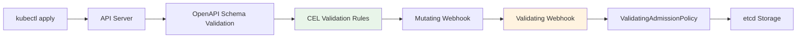

| Layer | Location | Pros | Cons |
|-------|----------|------|------|
| CRD Schema (CEL) | Inside API server | No external service needed, fast | CRD resources only, limited expressiveness |
| Admission Webhook | External service | Arbitrary logic, all resources | Adds availability dependency |
| ValidatingAdmissionPolicy | Inside API server | No external service needed, all resources | Requires K8s 1.28+ |
| External Framework | Policy engine | Policy management UI, auditing | Separate infrastructure |

## CEL Validation

### KubeSchema derive

`#[derive(KubeSchema)]` generates a `JsonSchema` implementation that includes CEL validation rules. It adds CEL rules on top of the basic schema generation discussed in **CRDs and Derive Macros**.

```rust title="kube-derive/src/lib.rs (simplified)"
#[proc_macro_derive(KubeSchema, attributes(x_kube, schemars, validate))]
pub fn derive_schema_validation(input: proc_macro::TokenStream) -> proc_macro::TokenStream {
    cel_schema::derive_validated_schema(input.into()).into()
}
```

`KubeSchema` replaces the `JsonSchema` derive. Use it together with `CustomResource`:

```rust
use kube::CustomResource;
use kube::core::KubeSchema;
use serde::{Serialize, Deserialize};

#[derive(CustomResource, KubeSchema, Serialize, Deserialize, Clone, Debug)]
#[kube(group = "example.com", version = "v1", kind = "Document")]
#[kube(namespaced, status = "DocumentStatus")]
pub struct DocumentSpec {
    pub title: String,
    pub content: String,
    pub replicas: i32,
}
```

### x_kube validation Rules

Add CEL validation rules with the `#[x_kube(validation)]` attribute. It can be applied at both the struct level and field level.

#### Struct-level Validation

```rust
#[derive(CustomResource, KubeSchema, Serialize, Deserialize, Clone, Debug)]
#[kube(group = "example.com", version = "v1", kind = "Document")]
#[x_kube(validation = "self.spec.replicas <= 10")]
pub struct DocumentSpec {
    pub title: String,
    pub replicas: i32,
}
```

The following is added to the generated CRD schema:

```yaml
x-kubernetes-validations:
  - rule: "self.spec.replicas <= 10"
```

#### Field-level Validation

```rust
pub struct DocumentSpec {
    #[x_kube(validation = Rule::new("self != ''").message("title must not be empty"))]
    pub title: String,

    #[x_kube(validation = Rule::new("self >= 1 && self <= 100").reason("FieldValueInvalid"))]
    pub replicas: i32,
}
```

The `Rule` builder attaches messages and reasons to CEL expressions.

#### Immutable Fields (Transition Rules)

CEL rules that compare `self` and `oldSelf` act as **transition rules**. They are evaluated only on UPDATE requests:

```rust
#[derive(CustomResource, KubeSchema, Serialize, Deserialize, Clone, Debug)]
#[kube(group = "example.com", version = "v1", kind = "Document")]
#[x_kube(validation = "self.spec.storageClass == oldSelf.spec.storageClass")]
pub struct DocumentSpec {
    pub storage_class: String,
    pub content: String,
}
```

#### kube Attribute-level Validation

You can also specify top-level CEL rules using `#[kube(validation = ...)]`:

```rust
#[derive(CustomResource, KubeSchema, Serialize, Deserialize, Clone, Debug)]
#[kube(
    group = "example.com",
    version = "v1",
    kind = "Singleton",
    validation = Rule::new("self.metadata.name == 'singleton'"),
)]
pub struct SingletonSpec {
    pub config: String,
}
```

### merge_strategy

Control Server-Side Apply merge behavior with `#[x_kube(merge_strategy)]`:

```rust
pub struct DocumentSpec {
    #[x_kube(merge_strategy = "merge")]
    pub tags: Vec<String>,
}
```

This generates schema extensions such as `x-kubernetes-list-type`.

## Admission Webhook

Use Admission Webhooks when validation cannot be expressed with CEL alone (e.g., external system lookups, complex business logic).

### AdmissionReview Flow

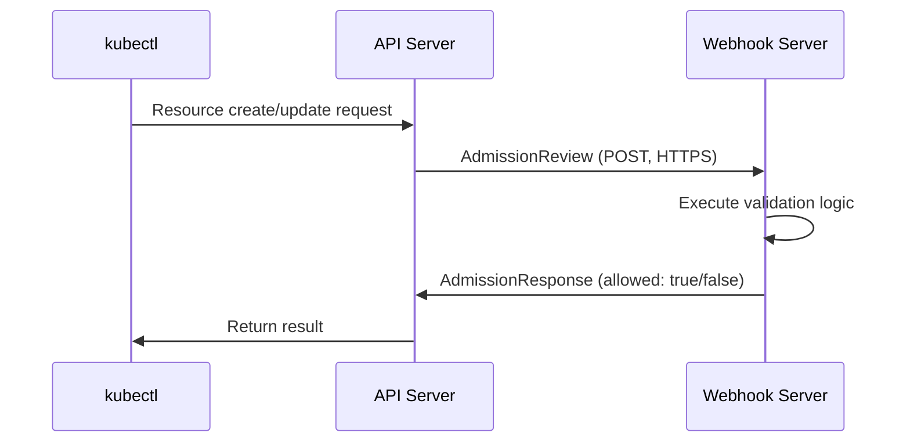

### kube::core::admission Module

kube-core provides the types needed for Admission Webhook implementation:

```rust title="kube-core/src/admission.rs (core types)"
pub struct AdmissionReview<T: Resource> {
    pub types: TypeMeta,
    pub request: Option<AdmissionRequest<T>>,
    pub response: Option<AdmissionResponse>,
}

pub struct AdmissionRequest<T: Resource> {
    pub uid: String,
    pub kind: GroupVersionKind,
    pub operation: Operation,  // Create, Update, Delete, Connect
    pub name: String,
    pub namespace: Option<String>,
    pub object: Option<T>,
    pub old_object: Option<T>,
    pub dry_run: bool,
    // ...
}

pub struct AdmissionResponse {
    pub uid: String,
    pub allowed: bool,
    pub result: Status,
    pub patch: Option<Vec<u8>>,
    pub patch_type: Option<PatchType>,  // JsonPatch
    pub warnings: Option<Vec<String>>,
    // ...
}
```

### Webhook Server Implementation

kube itself does not include an HTTP server. Implement the webhook endpoint using `axum`, `actix-web`, `warp`, or similar:

```rust
use kube::core::admission::{AdmissionReview, AdmissionRequest, AdmissionResponse};

async fn validate_handler(
    body: axum::Json<AdmissionReview<Document>>,
) -> axum::Json<AdmissionReview<Document>> {
    let req: AdmissionRequest<Document> = body.0.request.unwrap();
    let resp = match validate(&req) {
        Ok(()) => AdmissionResponse::from(&req).allowed(true),
        Err(reason) => {
            let mut resp = AdmissionResponse::from(&req);
            resp.allowed = false;
            resp.result.message = Some(reason);
            resp
        }
    };

    axum::Json(AdmissionReview {
        types: TypeMeta::default(),
        request: None,
        response: Some(resp),
    })
}

fn validate(req: &AdmissionRequest<Document>) -> Result<(), String> {
    if let Some(doc) = &req.object {
        if doc.spec.title.is_empty() {
            return Err("title must not be empty".into());
        }
    }
    Ok(())
}
```

### End-to-End Server Setup

To actually serve the handler above, you need an HTTPS server with TLS support and Kubernetes manifests.

#### axum + rustls Server

```rust
use axum::{routing::post, Router};
use axum_server::tls_rustls::RustlsConfig;

#[tokio::main]
async fn main() -> anyhow::Result<()> {
    let tls_config = RustlsConfig::from_pem_file(
        "/certs/tls.crt",
        "/certs/tls.key",
    ).await?;

    let app = Router::new()
        .route("/validate", post(validate_handler));

    axum_server::bind_rustls("0.0.0.0:8443".parse()?, tls_config)
        .serve(app.into_make_service())
        .await?;
    Ok(())
}
```

Certificate files are mounted at `/certs/` via a cert-manager `Certificate` resource or an init container.

#### ValidatingWebhookConfiguration Manifest

```yaml
apiVersion: admissionregistration.k8s.io/v1
kind: ValidatingWebhookConfiguration
metadata:
  name: document-validator
  annotations:
    cert-manager.io/inject-ca-from: default/webhook-cert  # cert-manager automatic injection
webhooks:
  - name: validate.example.com
    admissionReviewVersions: ["v1"]
    clientConfig:
      service:
        name: webhook-server
        namespace: default
        path: /validate
        port: 443
    rules:
      - apiGroups: ["example.com"]
        apiVersions: ["v1"]
        operations: ["CREATE", "UPDATE"]
        resources: ["documents"]
    failurePolicy: Fail
    sideEffects: None
    timeoutSeconds: 5
```

`clientConfig.service` references a Service pointing to the webhook Pod. The `caBundle` is automatically injected by cert-manager's CA Injector based on the annotation.

### Certificate Management

The API server communicates with webhooks only over HTTPS. TLS certificates are required.

| Method | Description | Complexity |
|--------|-------------|-----------|
| cert-manager | Automatic issuance/renewal, CA Injector support | Low |
| Self-signed | Generate certificates in an init container | Medium |
| kube client certificates | Use the API server's CA | High |

With cert-manager, certificates are automatically managed via a `Certificate` resource, and `caBundle` injection is also automated.

### FailurePolicy

Determines the behavior when the webhook server does not respond:

```yaml title="validatingwebhookconfiguration.yaml"
webhooks:
  - name: validate.example.com
    failurePolicy: Fail     # Reject requests when webhook is down
    # failurePolicy: Ignore # Allow requests when webhook is down
    timeoutSeconds: 5
    matchPolicy: Equivalent
    sideEffects: None
```

| Policy | Behavior | When to Use |
|--------|----------|------------|
| `Fail` | Rejects resource changes when webhook is down | Security-related validation |
| `Ignore` | Allows resource changes when webhook is down | Non-critical validation |

:::warning[Danger of the Fail Policy]
With the `Fail` policy, if the webhook server goes down, all changes to the matching resources are blocked. This can even block the deployment of the controller itself, so consider [Availability](./availability.md) design alongside it.
:::

## ValidatingAdmissionPolicy

Starting with Kubernetes 1.28+, CEL-based validation can be applied to all resources, not just CRDs. It runs inside the API server without an external webhook server.

```yaml title="ValidatingAdmissionPolicy example"
apiVersion: admissionregistration.k8s.io/v1
kind: ValidatingAdmissionPolicy
metadata:
  name: require-labels
spec:
  matchConstraints:
    resourceRules:
      - apiGroups: ["apps"]
        apiVersions: ["v1"]
        operations: ["CREATE", "UPDATE"]
        resources: ["deployments"]
  validations:
    - expression: "has(object.metadata.labels) && 'team' in object.metadata.labels"
      message: "team label is required"
```

Relationship with kube-rs controllers:

- For basic CRD resource validation, `#[x_kube(validation)]` CEL is more convenient (validation co-located with code)
- ValidatingAdmissionPolicy is useful for applying organizational policies to non-CRD resources (Deployments, Services, etc.)
- Both approaches run inside the API server, so there are no external availability dependencies

## External Policy Frameworks

Use dedicated frameworks when organization-level policy management is needed.

| Framework | Policy Language | Features |
|-----------|----------------|----------|
| Kyverno | YAML (declarative) | Kubernetes-native, low learning curve |
| Kubewarden | Wasm (Rust, Go, etc.) | Write policies in Rust, OCI-based deployment |
| OPA/Gatekeeper | Rego | General-purpose policy engine, broad ecosystem |

**Kubewarden** is particularly interesting for Rust developers. You write policies in Rust, compile them to Wasm, and deploy them.

When using alongside kube-rs controllers:
- Policies also apply to child resources created by the controller
- If a policy rejects a child resource, an error occurs in the reconciler
- See **Error Handling** for how to handle such API errors

## Choosing a Validation Strategy

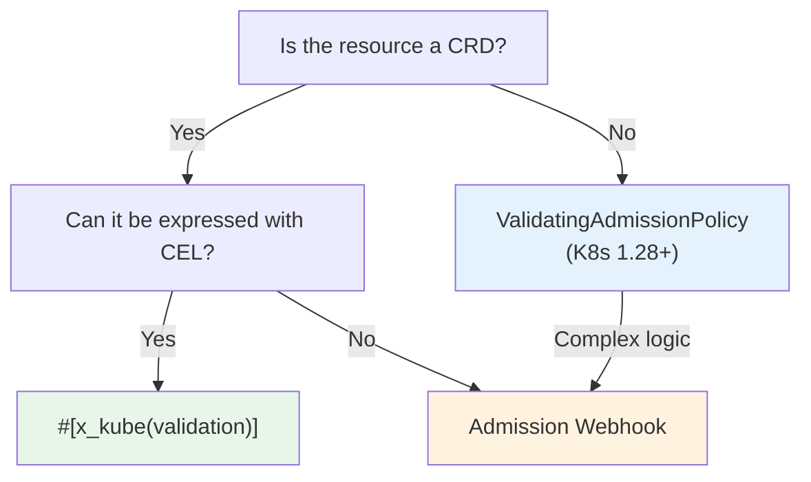

| Scenario | Recommendation |
|----------|---------------|
| CRD field value range validation | `#[x_kube(validation)]` CEL |
| CRD immutable fields | `#[x_kube(validation)]` transition rule |
| Validation requiring external system lookups | Admission Webhook |
| Organization-level policies (all resources) | ValidatingAdmissionPolicy or external framework |
| Resource mutation | Mutating Webhook |
