# kube

Rust로 작성된 Kubernetes 클라이언트 라이브러리입니다. Go의 [client-go](https://github.com/kubernetes/client-go)에 대응하며, [CNCF Sandbox](https://www.cncf.io/projects/) 프로젝트로 호스팅되고 있습니다.

```rust
use kube::{Api, Client};
use k8s_openapi::api::core::v1::Pod;

#[tokio::main]
async fn main() -> anyhow::Result<()> {
    let client = Client::try_default().await?;
    let pods: Api<Pod> = Api::default_namespaced(client);

    for pod in pods.list(&Default::default()).await? {
        println!("{}", pod.metadata.name.unwrap_or_default());
    }
    Ok(())
}
```

## 이 문서에 대해

kube를 쓰고 있지만 내부가 어떻게 돌아가는지 제대로 이해하고 싶은 분을 위한 문서입니다. 단순한 사용법이 아니라, 실제 코드 구현을 따라가며 **왜 이렇게 설계되었는지**, **내부에서 어떤 일이 벌어지는지**를 다룹니다.

### 전제 조건

- Rust 기본 문법 (trait, generic, async/await)
- Kubernetes 기본 개념 (Pod, Deployment, CRD, watch, controller)

## 목차

| 섹션 | 내용 |
|------|------|
| [Architecture](./architecture/index.md) | 크레이트 구조, 타입 시스템, Client 내부, 요청 흐름 |
| [Runtime Internals](./runtime-internals/index.md) | watcher/reflector/Controller 동작 원리 |
| [Patterns](./patterns/index.md) | 올바른 사용 패턴과 흔한 실수 |
| [Production](./production/index.md) | 모니터링, 테스트, 최적화, 보안, 가용성, 검증 |

## 기본 셋업

```toml title="Cargo.toml"
[dependencies]
kube = { version = "3.0.1", features = ["runtime", "derive"] }
k8s-openapi = { version = "0.27.0", features = ["latest", "schemars"] }
schemars = "1"
tokio = { version = "1", features = ["full"] }
serde = { version = "1", features = ["derive"] }
serde_json = "1"
anyhow = "1"
```

## 전체 문서 다운로드

전체 문서를 하나의 Markdown 파일로 받을 수 있습니다.

- [kube-docs-ko.md](pathname:///downloads/kube-docs-ko.md) — 한국어
- [kube-docs-en.md](pathname:///downloads/kube-docs-en.md) — English

## 참고

- [kube.rs](https://kube.rs) — 공식 사이트
- [docs.rs/kube](https://docs.rs/kube) — API 레퍼런스
- [GitHub](https://github.com/kube-rs/kube) — 소스 코드


---

# Architecture

kube가 내부적으로 어떻게 구성되어 있는지를 다룹니다. 5개 크레이트의 역할 분담, `Resource` trait 기반 타입 시스템, Tower 미들웨어로 구축된 HTTP 클라이언트, 그리고 하나의 API 호출이 거치는 전체 코드 경로를 추적합니다.

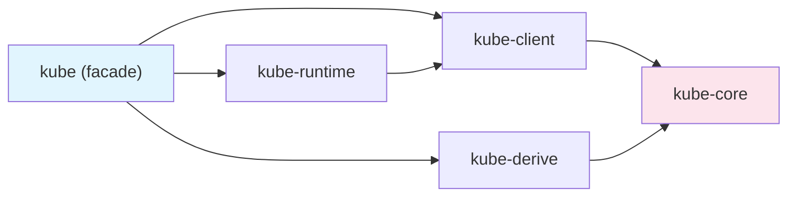

## 이 섹션에서 다루는 것

| 문서 | 핵심 질문 |
|------|----------|
| [크레이트 구조](./crate-overview.md) | 왜 5개로 나뉘었고, 각각 뭘 하는가? |
| [Resource trait과 타입 시스템](./resource-type-system.md) | 컴파일 타임에 어떤 안전성을 보장하는가? |
| [Client 내부 구조](./client-and-tower-stack.md) | HTTP 요청이 어떤 미들웨어를 거치는가? |
| [요청의 여정](./request-lifecycle.md) | `pods.list()` 한 줄이 어떤 코드 경로를 타는가? |

이 섹션을 읽고 나면 kube의 설계 결정이 왜 그렇게 되었는지, 어떤 계층에서 문제를 찾아야 하는지 감이 잡힙니다.


---

# 크레이트 구조

kube는 단일 크레이트가 아니라 역할별로 분리된 5개 크레이트의 집합입니다. 각 크레이트가 왜 분리되어 있고, 어떤 계층을 이루는지 살펴봅니다.

## 왜 여러 크레이트인가

kube의 크레이트 분리는 **최소 의존성 원칙**을 따릅니다.

- **kube-core**는 HTTP 의존성이 없습니다. 라이브러리 크레이트에서 Kubernetes 타입만 가져다 쓸 수 있습니다.
- **kube-client**는 네트워크 계층만 담당합니다. Tower 미들웨어 기반의 HTTP 클라이언트와 `Api<K>` 핸들을 제공합니다.
- **kube-runtime**은 operator 추상화만 담당합니다. watcher, reflector, Controller를 조합해 컨트롤러 루프를 구성합니다.
- **kube-derive**는 proc-macro 크레이트입니다. `#[derive(CustomResource)]` 등 코드 생성을 담당합니다.

이 분리 덕분에 feature flag로 필요한 것만 활성화할 수 있고, 컴파일 시간과 바이너리 크기를 줄일 수 있습니다.

## 계층 다이어그램

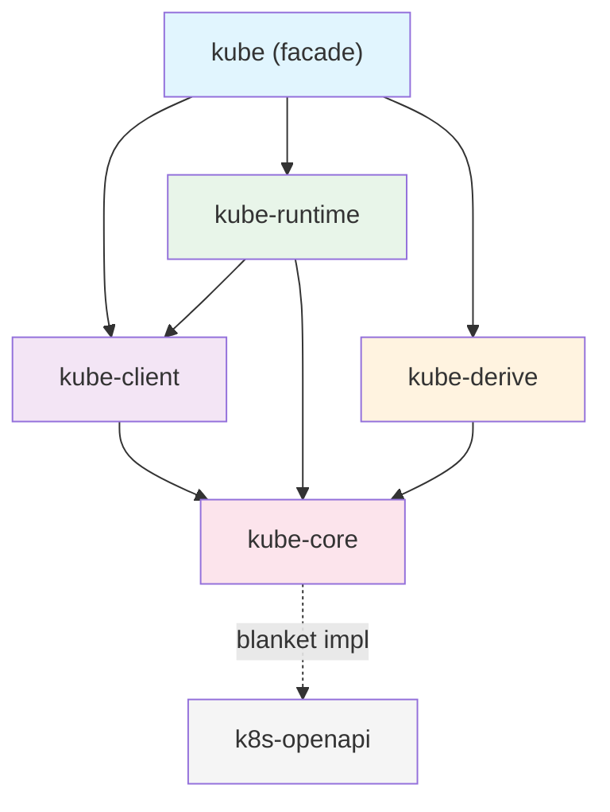

핵심은 **kube-core가 바닥**에 있다는 것입니다. HTTP 의존성 없이 타입과 trait만 정의하고, 나머지 크레이트가 이 위에 쌓입니다.

## 각 크레이트의 역할

### kube-core — 순수 타입

HTTP 의존성 없이 Kubernetes API와 상호작용하는 데 필요한 타입과 trait을 정의합니다. Go의 `k8s.io/apimachinery`에 대응합니다.

주요 모듈:

| 모듈 | 역할 | 핵심 타입 |
|------|------|-----------|
| `resource` | 리소스 추상화 | `Resource` trait, `ResourceExt` |
| `metadata` | 메타데이터 | `ObjectMeta`, `TypeMeta`, `ListMeta` |
| `object` | 객체 래퍼 | `Object<P, U>`, `ObjectList<K>` |
| `params` | API 파라미터 | `ListParams`, `PatchParams`, `Patch` enum |
| `dynamic` | 동적 타입 | `DynamicObject`, `ApiResource` |
| `gvk` | 타입 정보 | `GroupVersionKind`, `GroupVersionResource` |
| `request` | 요청 조립 | `Request` (URL path + query 생성, 전송 없음) |
| `response` | 응답 타입 | `Status`, `WatchEvent` |
| `labels` | 레이블 셀렉터 | `Selector`, `Expression` |
| `crd` | CRD 확장 | `CustomResourceExt` |
| `error_boundary` | deserialization 보호 | `DeserializeGuard` |

`request` 모듈이 중심인데, HTTP 요청의 URL path와 query parameter를 조립하되 실제로 보내지는 않습니다. 이 분리 덕분에 kube-core는 네트워크 의존성 없이 순수 타입 크레이트로 유지됩니다.

### kube-client — 네트워크 계층

실제 Kubernetes API 서버와 통신하는 HTTP 클라이언트를 제공합니다. Go의 `client-go`에 대응합니다.

주요 구성:

- **`Client`**: [Tower](https://github.com/tower-rs/tower) 기반 HTTP 클라이언트입니다. `Buffer<BoxService<...>>`로 type-erased되어 있어 Clone이 가볍습니다. 내부 구조는 [Client 내부 구조](./client-and-tower-stack.md)에서 다룹니다.
- **`Api<K>`**: 타입 안전한 CRUD 핸들입니다. `get()`, `list()`, `patch()`, `delete()` 등 Kubernetes API 작업을 제공합니다. `K: Resource` 바운드로 컴파일 타임에 리소스 타입을 검증합니다.
- **`Config`**: kubeconfig 파일 또는 in-cluster 환경에서 설정을 로드합니다.
- **`Discovery`**: 런타임에 API 서버가 지원하는 리소스를 조회합니다.

`Api<K>`의 생성자는 리소스의 스코프에 따라 컴파일 타임 검증을 제공합니다:

```rust
// Namespace 스코프 리소스
let pods: Api<Pod> = Api::namespaced(client.clone(), "default");

// Cluster 스코프 리소스
let nodes: Api<Node> = Api::all(client.clone());

// Namespace를 Api::namespaced()로 만들면 컴파일 에러
// let ns: Api<Namespace> = Api::namespaced(client, "default"); // ← 컴파일 안 됨
```

### kube-runtime — Operator 추상화

컨트롤러 패턴을 구현하는 데 필요한 빌딩 블록을 제공합니다. Go의 `controller-runtime`에 대응합니다.

| 모듈 | 역할 |
|------|------|
| `watcher` | 자동 재연결 + 에러 복구가 포함된 watch 스트림 |
| `reflector` | watcher 스트림을 가로채 인메모리 캐시(Store)에 기록 |
| `controller` | reflector + 스케줄링 + concurrency 제어를 조합한 컨트롤러 루프 |
| `finalizer` | 삭제 전 cleanup 헬퍼 |
| `scheduler` | 스트림 항목의 지연 + 중복 제거 |
| `events` | Kubernetes Event 리소스 발행 |
| `wait` | 조건 대기 (`await_condition`) |
| `utils` | `WatchStreamExt`, `predicates` 등 스트림 유틸리티 |

이 모듈들이 어떻게 조합되는지는 **Runtime Internals** 섹션에서 자세히 다룹니다.

### kube-derive — 코드 생성

proc-macro 크레이트로, 세 가지 derive 매크로를 제공합니다.

| 매크로 | 생성 결과 |
|--------|-----------|
| `CustomResource` | CRD 루트 struct + `Resource` impl + `CustomResourceExt` impl |
| `Resource` | 기존 타입에 대한 `Resource` trait impl |
| `KubeSchema` | CEL 검증 룰이 포함된 `JsonSchema` impl |

`#[derive(CustomResource)]`가 생성하는 코드의 세부 내용은 **CRD와 derive 매크로**에서 다룹니다.

### kube — facade

사용자가 `Cargo.toml`에 추가하는 유일한 크레이트입니다. feature flag에 따라 위 4개 크레이트를 re-export합니다.

```rust
// feature = "client" (기본 활성화)
pub use kube_client::{api, client, discovery};

// feature = "config" (기본 활성화)
pub use kube_client::config;

// feature = "derive"
pub use kube_derive::{CustomResource, Resource, KubeSchema};

// feature = "runtime"
pub use kube_runtime as runtime;

// 항상 사용 가능
pub use kube_core as core;
```

## Go 생태계와 대응 관계

| kube-rs | Go | 역할 |
|---------|-----|------|
| kube-core | `k8s.io/apimachinery` | 타입, 메타데이터, API 파라미터 |
| kube-client | `client-go` | HTTP 클라이언트, 인증, 설정 |
| kube-runtime | `controller-runtime` | 컨트롤러, watcher, 캐시 |
| kube-derive | kubebuilder (코드 생성) | CRD struct 생성, 스캐폴딩 |

Go에서 `controller-runtime`을 쓰면 내부적으로 `client-go`와 `apimachinery`가 따라오는 것처럼, kube에서도 `runtime` feature를 켜면 kube-runtime이 kube-client와 kube-core를 함께 가져옵니다.

## Feature flag 가이드

kube의 기본 feature는 `client`, `rustls-tls`, `ring`입니다. 용도에 따라 필요한 feature를 조합합니다.

### 용도별 조합

```toml title="API 조회만 (기본)"
[dependencies]
kube = "3.0.1"
```

```toml title="컨트롤러 개발"
[dependencies]
kube = { version = "3.0.1", features = ["runtime", "derive"] }
```

```toml title="Pod exec/attach/portforward"
[dependencies]
kube = { version = "3.0.1", features = ["runtime", "derive", "ws"] }
```

```toml title="타입만 사용 (HTTP 의존성 없음)"
[dependencies]
kube-core = "3.0.1"
```

### 전체 feature 목록

| Feature | 기본 | 설명 |
|---------|------|------|
| `client` | ✓ | `Client`, `Api<K>` |
| `config` | ✓ | `Config` (kubeconfig / in-cluster) |
| `rustls-tls` | ✓ | Rustls TLS 백엔드 |
| `ring` | ✓ | Rustls 암호화 provider |
| `openssl-tls` | | OpenSSL TLS 백엔드 (`rustls-tls`와 동시 사용 불가) |
| `aws-lc-rs` | | AWS Libcrypto provider (Rustls와 함께) |
| `webpki-roots` | | WebPKI 인증서 루트 (시스템 인증서 대신) |
| `derive` | | `CustomResource`, `Resource`, `KubeSchema` 매크로 |
| `runtime` | | watcher, reflector, Controller |
| `ws` | | WebSocket (exec, attach, portforward) |
| `gzip` | | 응답 gzip 압축 해제 |
| `jsonpatch` | | `Patch::Json` 지원 |
| `oauth` | | OAuth 인증 |
| `oidc` | | OIDC 인증 |
| `socks5` | | SOCKS5 프록시 |
| `http-proxy` | | HTTP 프록시 |
| `admission` | | Admission webhook 타입 |
| `kubelet-debug` | | kubelet 디버그 인터페이스 |
| `unstable-runtime` | | 실험적 runtime 기능 |
| `unstable-client` | | 실험적 client 기능 |

## k8s-openapi의 위치

kube 자체는 `Pod`, `Deployment`, `Service` 같은 Kubernetes 빌트인 타입을 정의하지 않습니다. 이 타입들은 별도 크레이트인 [k8s-openapi](https://docs.rs/k8s-openapi)가 제공합니다.

kube-core는 k8s-openapi 타입에 대해 **blanket impl**을 제공합니다:

```rust title="kube-core의 blanket impl (단순화)"
impl<K, S> Resource for K
where
    K: k8s_openapi::Metadata<Ty = ObjectMeta>,
    K: k8s_openapi::Resource<Scope = S>,
{
    type DynamicType = ();
    type Scope = S;
    // kind(), group(), version() 등은 K::KIND, K::GROUP, K::VERSION에서 가져옴
}
```

이 blanket impl 덕분에 k8s-openapi의 모든 타입(`Pod`, `Service`, `Deployment` 등)이 자동으로 kube의 `Resource` trait을 구현합니다. 사용자가 별도로 impl을 작성할 필요가 없습니다.

```toml title="Cargo.toml"
[dependencies]
kube = { version = "3.0.1", features = ["runtime", "derive"] }
k8s-openapi = { version = "0.27.0", features = ["latest", "schemars"] }
```

k8s-openapi의 `latest` feature는 kube 버전에 맞는 Kubernetes API 버전을 활성화합니다. `schemars` feature는 CRD 스키마 생성에 필요합니다.

:::warning[version feature는 하나만]
k8s-openapi의 version feature (`latest`, `v1_32` 등)는 **하나만** 활성화해야 합니다. 여러 개를 동시에 켜면 컴파일 에러가 발생합니다.
:::


---

# Resource trait과 타입 시스템

kube의 핵심은 `Resource` trait입니다. 이 trait 하나로 정적 타입(k8s-openapi)과 동적 타입(DynamicObject)을 동일한 인터페이스로 다루면서, Scope를 통해 컴파일 타임에 잘못된 API 호출을 방지합니다.

## Resource trait 해부

```rust title="kube-core/src/resource.rs (단순화)"
pub trait Resource {
    type DynamicType: Send + Sync + 'static;
    type Scope;

    fn kind(dt: &Self::DynamicType) -> Cow<'_, str>;
    fn group(dt: &Self::DynamicType) -> Cow<'_, str>;
    fn version(dt: &Self::DynamicType) -> Cow<'_, str>;
    fn api_version(dt: &Self::DynamicType) -> Cow<'_, str>;
    fn plural(dt: &Self::DynamicType) -> Cow<'_, str>;
    fn url_path(dt: &Self::DynamicType, namespace: Option<&str>) -> String;

    fn meta(&self) -> &ObjectMeta;
    fn meta_mut(&mut self) -> &mut ObjectMeta;

    fn object_ref(&self, dt: &Self::DynamicType) -> ObjectReference;
    fn controller_owner_ref(&self, dt: &Self::DynamicType) -> Option<OwnerReference>;
    fn owner_ref(&self, dt: &Self::DynamicType) -> Option<OwnerReference>;
}
```

이 trait에서 중요한 건 두 가지 associated type입니다.

### DynamicType — 메타데이터의 위치

`DynamicType`은 리소스의 GVK(Group/Version/Kind) 정보를 **어디에서** 가져올지 결정합니다.

- **`()`** — 정적 타입. kind/group/version이 타입 자체에 컴파일 타임에 내장됩니다. 런타임 비용이 없습니다.
- **`ApiResource`** — 동적 타입. GVK 정보를 런타임에 들고 다닙니다.

`kind()`, `group()`, `version()` 등의 메서드가 `&Self::DynamicType`을 매개변수로 받는 이유가 여기에 있습니다. 정적 타입은 `()`를 받아서 무시하고 상수를 반환하고, 동적 타입은 `ApiResource`에서 값을 꺼냅니다.

### Scope — 리소스 범위

리소스가 네임스페이스에 속하는지, 클러스터 전역인지를 타입 레벨에서 표현합니다.

| Scope 타입 | 의미 | 예시 |
|-----------|------|------|
| `NamespaceResourceScope` | 네임스페이스에 속하는 리소스 | Pod, Service, ConfigMap |
| `ClusterResourceScope` | 클러스터 전역 리소스 | Node, Namespace, ClusterRole |
| `DynamicResourceScope` | 런타임에 결정 | DynamicObject |

## blanket impl — k8s-openapi 자동 연결

kube-core는 k8s-openapi의 모든 타입에 대해 `Resource` trait을 자동으로 구현합니다.

```rust title="kube-core/src/resource.rs (단순화)"
impl<K, S> Resource for K
where
    K: k8s_openapi::Metadata<Ty = ObjectMeta>,
    K: k8s_openapi::Resource<Scope = S>,
{
    type DynamicType = ();
    type Scope = S;

    fn kind(_: &()) -> Cow<'_, str> {
        K::KIND.into()
    }
    fn group(_: &()) -> Cow<'_, str> {
        K::GROUP.into()
    }
    fn version(_: &()) -> Cow<'_, str> {
        K::VERSION.into()
    }
    // ...
}
```

이 blanket impl이 두 크레이트(k8s-openapi와 kube-core)를 연결하는 다리입니다. `Pod`, `Deployment`, `Service` 등 k8s-openapi의 모든 타입이 자동으로 kube의 `Resource`를 구현하므로, 사용자가 별도로 impl을 작성할 필요가 없습니다.

`DynamicType = ()`이기 때문에 모든 메타데이터(`KIND`, `GROUP`, `VERSION`)는 상수에서 가져옵니다. 런타임 오버헤드가 없습니다.

## Scope — 컴파일 타임 안전성

`Api<K>`의 생성자는 `K::Scope`를 검사해서 잘못된 조합을 컴파일 타임에 차단합니다.

```rust
use k8s_openapi::api::core::v1::{Pod, Node, Namespace};

let client = Client::try_default().await?;

// Pod은 NamespaceResourceScope → Api::namespaced() 사용 가능
let pods: Api<Pod> = Api::namespaced(client.clone(), "default");

// Node는 ClusterResourceScope → Api::all()만 사용 가능
let nodes: Api<Node> = Api::all(client.clone());

// 클러스터 스코프 리소스를 Api::namespaced()로 만들면 컴파일 에러
// let ns: Api<Namespace> = Api::namespaced(client.clone(), "default");
// error: Namespace: Resource<Scope = ClusterResourceScope>
//        but expected NamespaceResourceScope
```

`Api::all()`은 모든 Scope에서 사용 가능합니다. 네임스페이스 스코프 리소스에 대해 `Api::all()`을 쓰면 모든 네임스페이스의 리소스를 조회합니다.

:::tip[default_namespaced]
`Api::default_namespaced(client)`는 `Config`에서 추론된 기본 네임스페이스를 사용합니다. kubeconfig의 현재 context namespace, 또는 in-cluster라면 Pod이 실행되는 네임스페이스입니다.
:::

## DynamicType 활용

리소스 타입을 다루는 세 가지 패턴이 있습니다.

### 1. 정적 타입 — DynamicType = ()

k8s-openapi 타입이나 `#[derive(CustomResource)]`로 생성한 타입입니다. 가장 일반적인 패턴입니다.

```rust
// k8s-openapi 타입
let pods: Api<Pod> = Api::namespaced(client.clone(), "default");
let pod = pods.get("my-pod").await?;
println!("{}", pod.metadata.name.unwrap());

// derive로 생성한 CRD 타입
let docs: Api<Document> = Api::namespaced(client, "default");
```

모든 GVK 정보가 타입에 내장되어 있으므로 추가 인자가 필요 없습니다.

### 2. 동적 타입 — DynamicType = ApiResource

컴파일 타임에 타입을 모를 때 `DynamicObject`를 사용합니다. GVK 정보를 런타임에 `ApiResource`로 전달합니다.

```rust
use kube::core::{DynamicObject, ApiResource, GroupVersionKind};

let gvk = GroupVersionKind::gvk("example.com", "v1", "Document");
let ar = ApiResource::from_gvk(&gvk);
let api = Api::<DynamicObject>::namespaced_with(client, "default", &ar);

let obj = api.get("my-doc").await?;
// 필드 접근은 serde_json::Value를 통해
let title = obj.data["spec"]["title"].as_str();
```

:::warning[타입 안전성 없음]
`DynamicObject`의 필드 접근은 모두 `serde_json::Value`를 통하므로, 존재하지 않는 필드에 접근해도 컴파일 에러가 아닌 런타임에 `None`을 반환합니다.
:::

### 3. 반동적 타입 — Object&lt;P, U&gt;

spec/status 구조는 알지만 GVK는 런타임에 결정해야 할 때 사용합니다. 정적 타입과 동적 타입의 중간 지점입니다.

```rust
use kube::core::Object;

#[derive(Deserialize, Serialize, Clone, Debug)]
struct MySpec {
    replicas: i32,
}

#[derive(Deserialize, Serialize, Clone, Debug)]
struct MyStatus {
    ready: bool,
}

type MyResource = Object<MySpec, MyStatus>;
// spec과 status는 타입 안전하게 접근
// GVK는 ApiResource로 런타임에 지정
```

서드파티 CRD를 다룰 때 유용한 패턴입니다. 자세한 내용은 **서드파티 CRD**에서 다룹니다.

## ResourceExt — 편의 메서드

`ResourceExt`는 `Resource`를 구현한 모든 타입에 편의 메서드를 제공하는 extension trait입니다.

```rust
use kube::ResourceExt;

let pod: Pod = api.get("my-pod").await?;

// 이름과 네임스페이스
let name = pod.name_any();       // name 또는 generateName 반환
let ns = pod.namespace();         // Option<String>

// 메타데이터 접근
let labels = pod.labels();        // &BTreeMap<String, String>
let annotations = pod.annotations();
let finalizers = pod.finalizers(); // &[String]
let owner_refs = pod.owner_references(); // &[OwnerReference]

// 식별자
let uid = pod.uid();              // Option<String>
let rv = pod.resource_version();  // Option<String>
```

:::tip[name_any vs name_unchecked]
`name_any()`는 `metadata.name`이 없으면 `metadata.generateName`을 반환합니다. `name_unchecked()`는 `metadata.name`이 없으면 패닉합니다. 리소스가 이미 API 서버에 존재한다면(즉, `get()`으로 가져왔다면) `name_unchecked()`를 써도 안전합니다.
:::

## ObjectRef — 리소스 참조

`ObjectRef<K>`는 리소스를 식별하는 경량 참조입니다. Controller 내부에서 reconcile 대상을 추적하는 키로 사용됩니다.

```rust title="kube-runtime/src/reflector/object_ref.rs (단순화)"
#[non_exhaustive]
pub struct ObjectRef<K: Lookup + ?Sized> {
    pub dyntype: K::DynamicType,
    pub name: String,
    pub namespace: Option<String>,
    pub extra: Extra, // resource_version, uid 등
}
```

핵심 특성:

- **Hash/Eq**: `name`과 `namespace`만 비교합니다. `resourceVersion`이나 `uid`는 무시됩니다. 이 덕분에 같은 리소스의 서로 다른 버전이 같은 `ObjectRef`로 취급됩니다.
- **중복 제거**: Controller의 scheduler가 `ObjectRef`를 키로 사용해서, 같은 리소스에 대한 중복 reconcile 요청을 하나로 합칩니다.
- **타입 지우기**: `.erase()`로 `ObjectRef<DynamicObject>`로 변환할 수 있습니다. 서로 다른 타입의 ObjectRef를 한 컬렉션에 담을 때 사용합니다.

`ObjectRef`가 Controller 파이프라인에서 어떻게 활용되는지는 **Controller 파이프라인**에서 다룹니다.


---

# Client 내부 구조

`Client`는 단순한 HTTP 클라이언트가 아닙니다. Tower 미들웨어 스택으로 구성된 레이어 아키텍처이며, Clone이 `Arc` 수준으로 가볍습니다. 내부 구조를 이해하면 타임아웃, 인증, 커스텀 미들웨어 같은 문제를 해결할 수 있습니다.

## Client의 실체

```rust title="kube-client/src/client/mod.rs (단순화)"
pub struct Client {
    inner: Buffer<Request<Body>, BoxFuture<'static, Result<Response<Body>, BoxError>>>,
    default_ns: String,
    valid_until: Option<Timestamp>,
}
```

- **`tower::Buffer`**: `Service`를 `Arc`로 감쌉니다. `Client::clone()`은 참조 카운트 증가에 불과하므로, 여러 `Api<K>` 핸들에서 같은 Client를 자유롭게 공유할 수 있습니다.
- **capacity 1024**: `Buffer`의 in-flight 요청 용량입니다. 동시에 1024개까지 요청을 큐에 넣을 수 있습니다.
- **`BoxFuture`**: 응답 future의 구체 타입이 지워져 있어서 내부 미들웨어 스택의 구체 타입이 외부에 노출되지 않습니다.
- **`valid_until`**: credential 만료 시간입니다. 만료 후 Client를 재생성해야 합니다.

## Tower 미들웨어 스택

요청은 위에서 아래로, 응답은 아래에서 위로 흐릅니다. 각 레이어는 `tower::Layer` trait을 구현합니다.

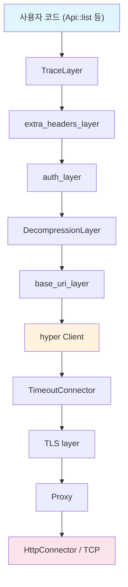

| 레이어 | 역할 |
|--------|------|
| **TraceLayer** | OpenTelemetry 호환 HTTP 스팬을 생성합니다. 요청/응답의 트레이싱 정보를 기록합니다. |
| **extra_headers_layer** | impersonation 등 커스텀 헤더를 추가합니다. |
| **auth_layer** | Bearer 토큰, exec 기반 인증, 토큰 자동 갱신을 처리합니다. |
| **DecompressionLayer** | gzip 응답을 해제합니다 (`gzip` feature 필요). |
| **base_uri_layer** | 모든 요청 URL에 `cluster_url` prefix를 추가합니다. |
| **hyper Client** | HTTP/1.1 + HTTP/2로 실제 전송합니다. |
| **TimeoutConnector** | connect/read/write 각각의 타임아웃을 적용합니다. |
| **TLS layer** | `rustls-tls` 또는 `openssl-tls` feature에 따라 TLS를 처리합니다. |
| **Proxy** | SOCKS5/HTTP 프록시를 통과합니다 (`socks5`/`http-proxy` feature). |
| **HttpConnector** | TCP 연결을 생성합니다. |

## Config 추론 체인

`Client::try_default()`는 내부적으로 `Config::infer()`를 호출합니다. 다음 순서로 설정을 탐색합니다.

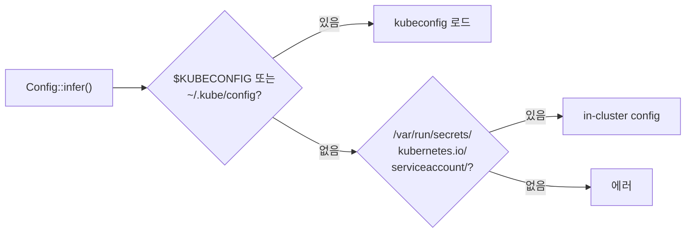

1. **kubeconfig**: `$KUBECONFIG` 환경변수가 가리키는 파일, 또는 `~/.kube/config`
2. **in-cluster**: `/var/run/secrets/kubernetes.io/serviceaccount/`의 토큰과 CA 인증서
3. 둘 다 없으면 에러를 반환합니다.

### 기본 타임아웃

| 설정 | 기본값 | 용도 |
|------|--------|------|
| `connect_timeout` | 30초 | TCP 연결 수립 |
| `read_timeout` | `None` | 응답 대기 (무제한) |
| `write_timeout` | `None` | 요청 전송 (무제한) |

:::info[타임아웃 설계 — 계층별 분리]
이전에는 `read_timeout`이 295초로 설정되어 watch long-polling과 일반 API 호출에 동일하게 적용되었습니다. 이로 인해 exec, attach, port-forward 같은 장기 연결이 유휴 295초 후 끊기는 문제가 있었습니다 ([kube#1798](https://github.com/kube-rs/kube/issues/1798)).

현재는 Go client와 동일하게 global `read_timeout`을 `None`으로 설정하고, 각 계층이 자체 타임아웃을 관리합니다:

- **watcher**: 서버 측 `timeoutSeconds` + 마진으로 idle timeout을 자체 관리. 네트워크 장애 시 자동 재연결
- **exec/attach/port-forward**: 타임아웃 없음 (무기한 유휴 가능)
- **reconciler 내 API 호출**: 필요 시 `tokio::time::timeout`으로 개별 감싸기

```rust
// reconciler 내부에서 느린 호출 방어
let pod = tokio::time::timeout(
    Duration::from_secs(10),
    pods.get("my-pod")
).await??;
```
:::

## 인증 처리

auth_layer가 모든 인증을 담당합니다.

| 방식 | 동작 |
|------|------|
| **정적 토큰** | `Authorization: Bearer <token>` 헤더를 추가합니다. |
| **클라이언트 인증서** | TLS 레이어에서 mTLS로 인증합니다. |
| **exec plugin** | 외부 프로그램을 호출해 토큰을 얻습니다 (AWS EKS의 `aws-iam-authenticator` 등). |
| **토큰 갱신** | 토큰 만료 전 자동으로 refresh합니다. |

:::warning[장시간 실행 시 credential rotation]
watcher가 장시간 실행되는 동안 credential이 rotate되고 연결이 끊기면, 재연결 시 stale credential을 사용해 영구적으로 실패할 수 있습니다.

대응: Client를 재생성하거나, exec plugin 기반 인증을 사용하면 매번 새 토큰을 발급받을 수 있습니다.
:::

## Client 커스텀

`ClientBuilder`를 사용하면 미들웨어 스택을 커스텀할 수 있습니다.

```rust
use kube::client::ClientBuilder;

let config = Config::infer().await?;
let client = ClientBuilder::try_from(config)?
    // 커스텀 Tower 레이어 추가 가능
    .build();
```

### Client 커스텀 타임아웃

global `read_timeout`이 `None`이므로 용도별 Client 분리는 더 이상 필수가 아닙니다. 필요한 경우 개별 호출에 `tokio::time::timeout`을 적용하거나, 특정 용도로 짧은 타임아웃 Client를 만들 수 있습니다.

```rust
// 기본 Client — 타임아웃 없음 (watcher, exec 등 모두 사용 가능)
let client = Client::try_default().await?;

// 특정 용도로 짧은 타임아웃이 필요한 경우
let mut config = Config::infer().await?;
config.read_timeout = Some(Duration::from_secs(30));
let short_timeout_client = Client::try_from(config)?;
```


---

# 요청의 여정

`pods.list()` 한 줄 호출이 내부적으로 어떤 코드를 거쳐 Kubernetes API 서버에 도달하고 응답이 돌아오는지 추적합니다.

## 호출 코드

```rust
let client = Client::try_default().await?;
let pods: Api<Pod> = Api::default_namespaced(client);
let list = pods.list(&ListParams::default()).await?;
```

이 세 줄이 내부에서 거치는 전체 경로를 따라갑니다.

## 전체 흐름

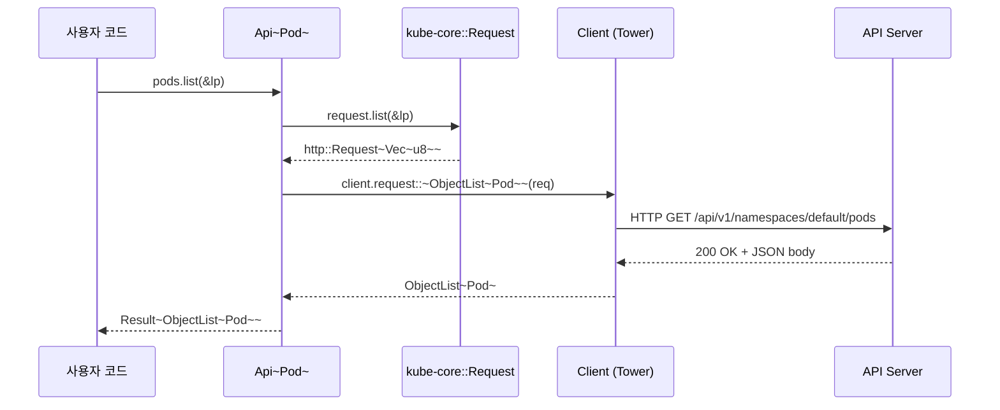

## Api&lt;K&gt; 내부

`Api<K>`는 kube-core의 URL 빌더와 Client를 연결하는 thin wrapper입니다.

```rust title="kube-client/src/api/mod.rs (단순화)"
pub struct Api<K> {
    request: kube_core::Request,   // URL path builder
    client: Client,
    namespace: Option<String>,
    _phantom: std::iter::Empty<K>, // PhantomData 대신 — Send 보장
}
```

`list()` 호출 시 내부 동작:

1. `self.request.list(&lp)` — `http::Request<Vec<u8>>`를 생성합니다.
2. URL이 조립됩니다: `/api/v1/namespaces/{ns}/pods?limit=...&labelSelector=...`
3. 요청에 extension을 추가합니다 (트레이싱용으로 `"list"` 문자열).
4. `self.client.request::<ObjectList<Pod>>(req).await`로 실제 요청을 보냅니다.

## kube-core::Request — URL 빌더

`kube_core::Request`는 URL path를 들고 있는 순수한 빌더입니다.

```rust title="kube-core/src/request.rs (개념)"
pub struct Request {
    url_path: String, // e.g., "/api/v1/namespaces/default/pods"
}

impl Request {
    pub fn list(&self, lp: &ListParams) -> Result<http::Request<Vec<u8>>> {
        let url = format!("{}?{}", self.url_path, lp.as_query_string());
        http::Request::builder()
            .method("GET")
            .uri(url)
            .body(vec![])
    }
}
```

핵심은 **네트워크 전송이 전혀 없다**는 것입니다. `list()`, `get()`, `create()`, `watch()` 등 각 메서드는 적절한 HTTP 메서드와 쿼리 파라미터를 조립한 `http::Request`만 반환합니다. 이 분리 덕분에 kube-core는 네트워크 의존성 없이 테스트할 수 있습니다.

## Client를 통한 요청 실행

`Client::request::<T>(req)` 메서드가 실제 요청을 실행합니다.

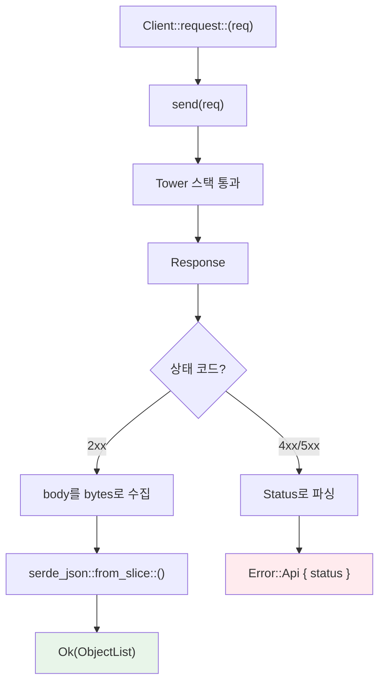

1. **`send(req)`**: [Tower 미들웨어 스택](./client-and-tower-stack.md)을 통과해 HTTP 요청을 보냅니다.
2. **에러 처리 (`handle_api_errors`)**: 상태 코드를 확인합니다.
   - 4xx/5xx: 응답 body를 `Status` struct로 파싱하고 `Error::Api`를 반환합니다.
   - 2xx: 정상 처리를 계속합니다.
3. **Deserialization**: 응답 body를 bytes로 수집한 뒤 `serde_json::from_slice::<T>()`로 변환합니다.

### 에러 분기

| 에러 종류 | 타입 | 발생 시점 |
|-----------|------|-----------|
| 네트워크 에러 | `Error::HyperError` | TCP 연결 실패, DNS 해석 실패 등 |
| HTTP 에러 | `Error::HttpError` | HTTP 프로토콜 레벨 에러 |
| API 에러 | `Error::Api { status }` | Kubernetes가 반환한 4xx/5xx |
| Deserialization 에러 | `Error::SerializationError` | JSON 파싱 실패 |

`Error::Api`의 `status` 필드는 Kubernetes API 서버가 보낸 구조화된 에러입니다:

```rust
let err = pods.get("nonexistent").await.unwrap_err();
if let kube::Error::Api(status) = err {
    println!("code: {}", status.code);       // 404
    println!("reason: {}", status.reason);    // "NotFound"
    println!("message: {}", status.message);  // "pods \"nonexistent\" not found"
}
```

## Watch 요청의 특수성

일반 요청은 요청-응답으로 완료되지만, watch 요청은 **끊기지 않는 스트림**을 반환합니다.

```rust
// 일반 요청: 완료되면 끝
let list = pods.list(&lp).await?;

// Watch 요청: 무한 스트림
let mut stream = pods.watch(&WatchParams::default(), "0").await?;
while let Some(event) = stream.try_next().await? {
    // WatchEvent를 하나씩 처리
}
```

### 내부 동작

`Client::request_events::<T>(req)`가 watch 스트림을 처리합니다:

1. `send(req)` → `Response<Body>` (chunked transfer encoding)
2. Body를 `AsyncBufRead`로 변환
3. 줄 단위로 분리 (각 줄이 하나의 JSON 객체)
4. 각 줄을 `WatchEvent<T>`로 deserialize
5. `TryStream<Item = Result<WatchEvent<T>>>`를 반환

### WatchEvent

API 서버는 다섯 가지 이벤트를 보냅니다:

```rust
pub enum WatchEvent<K> {
    Added(K),               // 리소스가 생성됨
    Modified(K),            // 리소스가 변경됨
    Deleted(K),             // 리소스가 삭제됨
    Bookmark(Bookmark),     // 진행 마커 (resourceVersion 갱신)
    Error(Box<Status>),     // API 서버가 보낸 에러 (e.g., 410 Gone)
}
```

`Bookmark`은 실제 리소스 변경이 아닙니다. API 서버가 주기적으로 현재 `resourceVersion`을 알려주는 마커입니다. 연결이 끊겼다가 재연결할 때 이 `resourceVersion`부터 watch를 재개할 수 있습니다.

:::tip[raw watch vs watcher()]
`Api::watch()`는 raw watch 스트림입니다. 연결이 끊기면 끝나고, `resourceVersion` 만료 대응도 없습니다. 실전에서는 이 위에 자동 재연결과 에러 복구를 올린 `kube_runtime::watcher()`를 사용합니다.

watcher의 내부 동작은 **Watcher state machine**에서 다룹니다.
:::


---

# Runtime Internals

`kube-runtime`이 내부에서 어떤 일을 하는지를 다룹니다. watcher의 state machine, reflector의 atomic swap 캐싱, Controller의 trigger-scheduler-runner 파이프라인, 그리고 derive 매크로가 생성하는 코드까지 살펴봅니다.

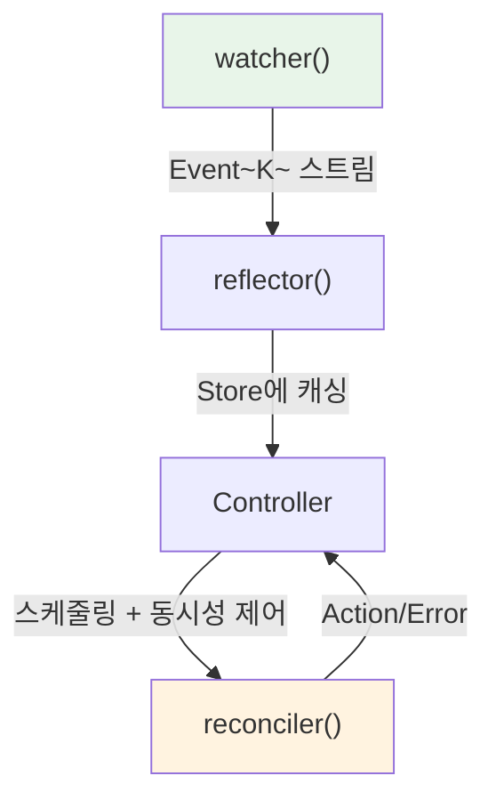

## 이 섹션에서 다루는 것

| 문서 | 핵심 질문 |
|------|----------|
| [Watcher](./watcher.md) | state machine은 어떻게 동작하고, 에러 시 어떻게 복구하는가? |
| [Reflector와 Store](./reflector-and-store.md) | 인메모리 캐시는 어떻게 일관성을 유지하는가? |
| [Controller 파이프라인](./controller-pipeline.md) | trigger에서 reconciler까지 데이터가 어떤 경로로 흐르는가? |
| [CRD와 derive 매크로](./custom-resources.md) | `#[derive(CustomResource)]`가 실제로 무슨 코드를 만드는가? |

**Architecture** 섹션에서 kube의 정적 구조를 이해했다면, 이 섹션에서는 런타임에 실제로 벌어지는 일을 따라갑니다.


---

# Watcher

`Api::watch()`는 연결이 끊기면 그대로 종료되고, `resourceVersion` 만료에도 대응하지 않습니다. `watcher()`는 이 위에 **state machine**을 올려서 자동 재연결, initial list 로드, 에러 복구를 제공하는 Stream입니다.

## watcher의 역할

`Api::watch()`의 한계를 정리하면 다음과 같습니다:

| 한계 | 설명 |
|------|------|
| 연결 끊기면 종료 | 수동으로 재시작해야 합니다 |
| `resourceVersion` 만료 대응 없음 | 410 Gone 응답을 받으면 그대로 에러 |
| initial list 없음 | watch는 "지금부터"의 변경만 봅니다 |

`watcher()`는 이 모든 것을 자동으로 처리합니다:

```rust
use kube::runtime::{watcher, WatchStreamExt};

let wc = watcher::Config::default();
let stream = watcher(api, wc)
    .default_backoff()    // 에러 시 지수 백오프로 재시도
    .applied_objects();   // Event<K> → K 스트림으로 변환
```

## State machine

watcher 내부는 다섯 가지 상태를 거치는 state machine입니다.

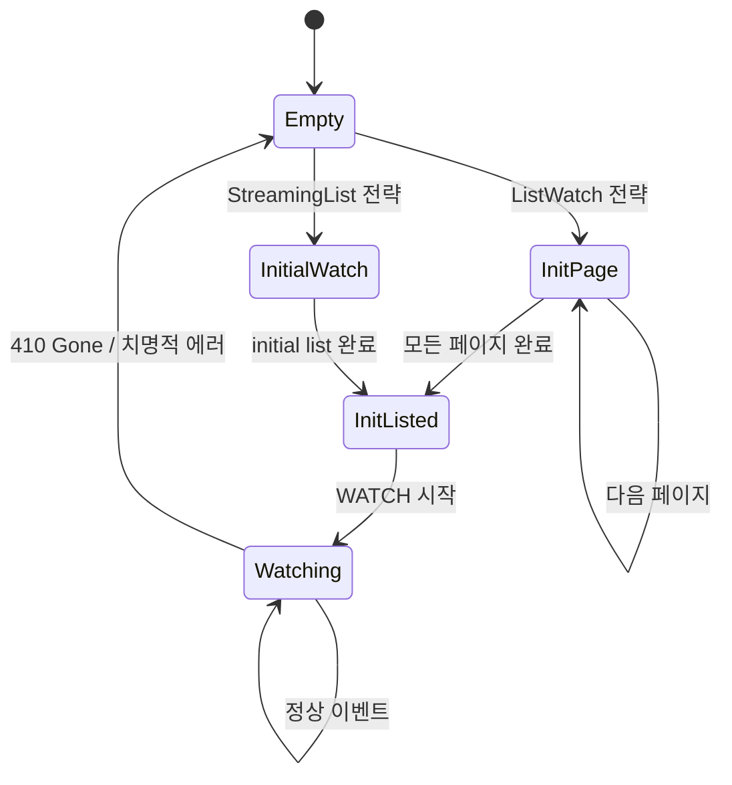

각 상태에서 하는 일:

| 상태 | 동작 | API 호출 |
|------|------|----------|
| **Empty** | 초기 상태 또는 에러 후 리셋. 설정된 전략에 따라 분기합니다. | — |
| **InitPage** | paginated LIST 호출 (`page_size=500`). 각 페이지마다 `Event::InitApply(obj)`를 발행합니다. `continue_token`으로 다음 페이지를 가져옵니다. | `LIST ?limit=500&continue=...` |
| **InitialWatch** | `sendInitialEvents=true`로 WATCH를 시작합니다. 서버가 기존 객체를 하나씩 보내고 Bookmark으로 완료를 알립니다. | `WATCH ?sendInitialEvents=true` |
| **InitListed** | initial list 완료. `Event::InitDone`을 발행하고, 마지막 `resourceVersion`으로 WATCH를 시작합니다. | `WATCH ?resourceVersion=...` |
| **Watching** | 정상 watch 상태. Added/Modified → `Event::Apply`, Deleted → `Event::Delete`. 410 Gone이나 연결 끊김 시 Empty로 복귀합니다. | — (기존 연결 유지) |

## 두 가지 initial list 전략

### ListWatch (기본)

모든 Kubernetes 버전에서 동작하는 기본 전략입니다.

1. `LIST` 호출 (`page_size=500`, client-go와 동일)
2. `continue_token`으로 모든 페이지 소진
3. 마지막 `resourceVersion`으로 `WATCH` 시작

```rust
// 기본 — ListWatch 전략 사용
let wc = watcher::Config::default();
```

:::warning[초기 LIST 메모리]
대규모 클러스터에서 전체 리소스를 페이지 단위로 로드합니다. 객체 수가 많으면 초기 LIST 시 메모리 사용량이 급증할 수 있습니다.
:::

### StreamingList (K8s 1.27+)

Kubernetes 1.27부터 사용 가능한 효율적인 전략입니다.

1. `WATCH` + `sendInitialEvents=true` + `resourceVersionMatch=NotOlderThan`
2. 서버가 기존 객체를 하나씩 Added로 전송
3. Bookmark으로 initial list 완료 신호

```rust
// StreamingList 전략 사용
let wc = watcher::Config::default().streaming_lists();
```

LIST와 달리 한 번에 하나씩 처리하므로 메모리 효율이 좋습니다. 다만 Kubernetes 1.27+ (WatchList feature gate)가 필요합니다.

## Event 추상화

watcher는 Kubernetes의 `WatchEvent`를 더 높은 수준의 `Event`로 변환합니다.

```rust
pub enum Event<K> {
    Init,          // re-list 시작
    InitApply(K),  // initial list의 각 객체
    InitDone,      // initial list 완료
    Apply(K),      // watch 중 Added/Modified
    Delete(K),     // watch 중 Deleted
}
```

Kubernetes의 `WatchEvent`와 매핑:

| WatchEvent | initial list 중 | watch 중 |
|-----------|-------------|---------|
| Added | `InitApply(K)` | `Apply(K)` |
| Modified | — | `Apply(K)` |
| Deleted | — | `Delete(K)` |
| Bookmark | 내부 처리 (`resourceVersion` 갱신) | 내부 처리 |

`Init`/`InitApply`/`InitDone`이 별도로 존재하는 이유는 [reflector의 atomic swap 패턴](./reflector-and-store.md) 때문입니다. `Init`에서 새 buffer를 만들고, `InitApply`로 채우고, `InitDone`에서 한 번에 교체합니다.

## 에러 복구와 backoff

watcher의 모든 에러는 재시도 가능으로 간주됩니다.

### default_backoff

```rust
let stream = watcher(api, wc)
    .default_backoff();  // 지수 백오프: 1s → 2s → 4s → ... → 60s (최대)
```

성공적인 이벤트를 수신하면 backoff가 리셋됩니다.

:::warning[backoff 없이 쓰면 안 됩니다]
backoff 없이 watcher를 사용하면 첫 에러에 스트림이 종료됩니다. Controller 전체가 멈추는 프로덕션 사고로 이어질 수 있습니다.

backoff 없는 상태에서 API 서버 일시 장애가 발생하면 tight-loop 재시도로 CPU/메모리가 폭주할 수도 있습니다.
:::

### 410 Gone 처리

Kubernetes API 서버는 `resourceVersion` 히스토리를 약 5분간만 유지합니다. 그 이상 지연되면 410 Gone 응답을 보냅니다.

watcher는 410 Gone을 받으면 Empty 상태로 복귀해 전체 re-list를 수행합니다. bookmarks를 활성화하면 `resourceVersion`이 주기적으로 갱신되어 410 빈도가 크게 줄어듭니다.

## watcher::Config

```rust
let wc = watcher::Config::default()
    .labels("app=myapp")              // label selector
    .fields("status.phase=Running")   // field selector
    .timeout(300)                     // watch timeout (서버 측)
    .page_size(100)                   // ListWatch 페이지 크기
    .streaming_lists()                // StreamingList 전략
    .any_semantic()                   // ListSemantic::Any
    .disable_bookmarks();             // bookmark 비활성화 (기본 on)
```

| 옵션 | 기본값 | 설명 |
|------|--------|------|
| `labels` | 없음 | label selector로 watch 범위 축소 |
| `fields` | 없음 | field selector |
| `timeout` | 295초 | 서버 측 watch timeout |
| `page_size` | 500 | ListWatch 페이지 크기 |
| `streaming_lists()` | off | StreamingList 전략 활성화 |
| `any_semantic()` | off | `ListSemantic::Any` — 캐시된 데이터 허용 (더 빠르지만 stale 가능) |
| `disable_bookmarks()` | — | Bookmark 이벤트 비활성화 (기본은 on, 끄면 410 빈도 증가) |

## 알아야 할 것들

### watch 이벤트는 전달 보장이 안 됩니다

네트워크 단절 시 `DELETE` 이벤트가 유실될 수 있습니다. re-list로 최종 상태는 복구되지만, 중간 이벤트는 영구 손실됩니다. 삭제 감지가 중요한 경우 **finalizer**를 사용합니다.

### re-list 시 메모리 스파이크

대규모 클러스터에서 re-list가 발생하면 이전 데이터 + JSON buffer + deserialization된 객체가 동시에 메모리에 존재합니다. 일시적으로 평소의 2~3배 메모리를 사용할 수 있습니다. StreamingList를 사용하면 이를 완화할 수 있습니다.

### bookmarks 없으면 410이 빨라집니다

변경이 적은 리소스(quiet resource)에서는 `resourceVersion`이 갱신되지 않아 빠르게 만료됩니다. bookmarks가 주기적으로 `resourceVersion`을 갱신해 410 Gone을 방지합니다. 기본적으로 활성화되어 있으므로 명시적으로 끄지 않는 한 걱정하지 않아도 됩니다.


---

# Reflector와 Store

Reflector는 watcher 스트림을 그대로 통과시키면서, 사이드이펙트로 인메모리 캐시(Store)를 업데이트하는 passthrough 어댑터입니다.

## reflector 함수

```rust
pub fn reflector<K, W>(writer: Writer<K>, stream: W) -> impl Stream<Item = W::Item>
```

watcher 스트림의 각 `Event`를 가로채서 `Writer`에 적용(캐시 업데이트)한 뒤, 이벤트를 변경 없이 다음 스트림으로 그대로 전달합니다. 스트림 소비자는 reflector가 중간에 있는지 모릅니다.

```rust
use kube::runtime::{reflector, watcher, WatchStreamExt};

let (reader, writer) = reflector::store();
let stream = reflector(writer, watcher(api, watcher::Config::default()))
    .default_backoff()
    .applied_objects();

// reader로 캐시 조회
// stream으로 이벤트 처리
```

## Store 내부 구조

```rust title="kube-runtime/src/reflector/store.rs (단순화)"
type Cache<K> = Arc<RwLock<AHashMap<ObjectRef<K>, Arc<K>>>>;

pub struct Writer<K> {
    store: Cache<K>,
    buffer: AHashMap<ObjectRef<K>, Arc<K>>,
}

pub struct Store<K> {
    store: Cache<K>,
}
```

내부 자료구조 선택의 이유:

| 구성요소 | 선택 | 이유 |
|---------|------|------|
| `AHashMap` | `std::HashMap` 대신 | 내부 캐시라 DoS 방어가 불필요하므로 더 빠른 해시맵 사용 |
| `parking_lot::RwLock` | `std::RwLock` 대신 | 읽기 concurrency가 더 좋고, poisoning이 없음 |
| `Arc<K>` | `K` 대신 | reconciler에 `Arc<K>`로 전달해 불필요한 클론 방지 |

## Atomic swap 패턴

reflector의 핵심 메커니즘입니다. `apply_watcher_event()` 메서드가 각 이벤트 타입에 따라 다르게 동작합니다.

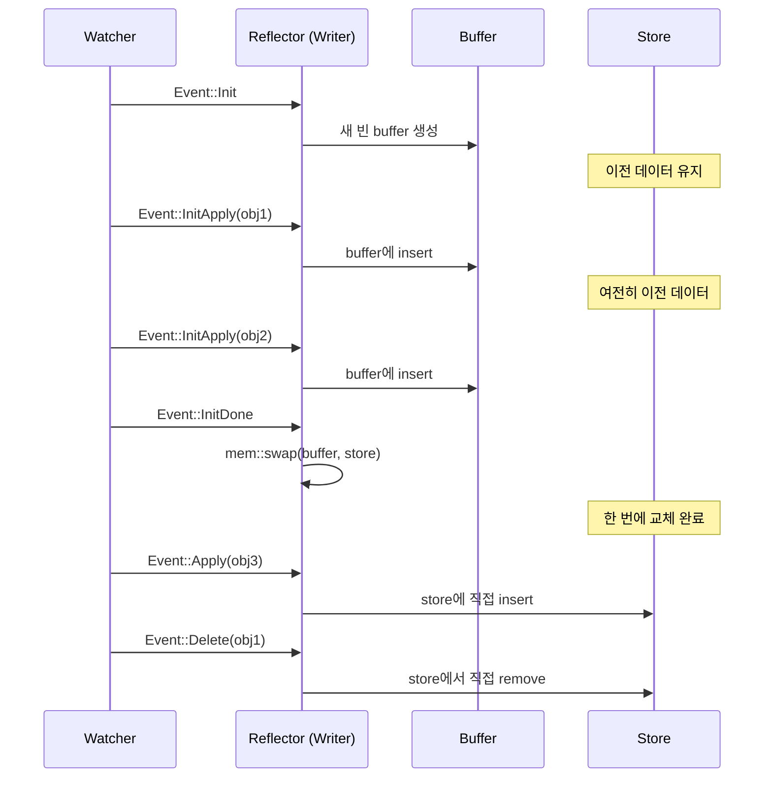

각 이벤트 처리:

| Event | 동작 | Store 상태 |
|-------|------|-----------|
| `Init` | 새 빈 buffer를 생성합니다 | 이전 데이터 유지 (읽기 가능) |
| `InitApply(obj)` | buffer에 insert합니다 | 이전 데이터 유지 |
| `InitDone` | `mem::swap(&mut buffer, &mut *store.write())` | **한 번에 교체** |
| `Apply(obj)` | store에 직접 insert합니다 | 즉시 반영 |
| `Delete(obj)` | store에서 직접 remove합니다 | 즉시 반영 |

이 패턴의 핵심:

- re-list 중에도 Store는 항상 **일관된 스냅샷**을 유지합니다. `Init`부터 `InitDone`까지 Store에는 이전 데이터가 그대로 남아 있습니다.
- `InitDone`에서의 swap은 포인터 교환이므로 O(1)입니다. 데이터 복사가 일어나지 않습니다.
- swap 후 이전 buffer(= 이전 Store 데이터)는 drop됩니다.

## Store의 비동기 특성

:::warning[가장 흔한 실수]
```rust
let (reader, writer) = reflector::store();
// ... reflector 설정 ...
let items = reader.state(); // ← 빈 Vec 반환!
```

Store는 생성 시 비어 있습니다. watcher 스트림이 poll되어야(= tokio 런타임이 실행해야) 채워집니다.
:::

올바른 사용법:

```rust
// 첫 InitDone까지 대기 후 조회
reader.wait_until_ready().await;
let items = reader.state(); // 이제 데이터가 있습니다
```

내부적으로 `wait_until_ready()`는 `DelayedInit`(oneshot channel 기반)을 사용합니다. Writer가 첫 `InitDone` 이벤트를 처리할 때 신호를 보내고, Store의 `wait_until_ready()`가 이 신호를 기다립니다.

Controller를 사용할 때는 이 문제를 신경 쓸 필요가 없습니다. Controller가 내부적으로 `wait_until_ready()`를 호출하므로, reconciler가 실행될 때는 Store가 이미 채워져 있습니다.

## Writer vs Store — 읽기/쓰기 분리

| 역할 | 타입 | Clone | 담당 |
|------|------|-------|------|
| 쓰기 | `Writer<K>` | 불가 | reflector가 소유, `apply_watcher_event` |
| 읽기 | `Store<K>` | 가능 | 여러 곳에서 공유 (reconciler, health check 등) |

이 분리 덕분에 하나의 Writer만 캐시를 수정하고, 여러 Store 핸들이 동시에 읽을 수 있습니다. Controller가 이 분리를 자동으로 관리합니다.

## 주요 Store 메서드

```rust
// 전체 캐시된 객체 목록
let all: Vec<Arc<K>> = reader.state();

// 특정 ObjectRef로 조회
let obj: Option<Arc<K>> = reader.get(&obj_ref);

// 준비 여부 확인
let ready: bool = reader.is_ready();

// 첫 InitDone까지 대기
reader.wait_until_ready().await;
```

`state()`가 반환하는 `Vec<Arc<K>>`는 호출 시점의 스냅샷입니다. 이후 Store가 업데이트되어도 이미 반환된 Vec에는 영향이 없습니다.

## Shared/Subscriber 모드

:::tip[unstable-runtime feature 필요]
이 기능은 `unstable-runtime-stream-control` feature flag를 활성화해야 사용할 수 있습니다.
:::

기본 모드에서는 하나의 reflector가 하나의 Consumer를 지원합니다. Shared 모드를 사용하면 하나의 reflector로 여러 Consumer에 이벤트를 팬아웃할 수 있습니다.

### store_shared와 reflect_shared

v3.x에서는 `reflector::store_shared()`로 shared store를 생성하고, 스트림에 `.reflect_shared()`를 적용합니다.

```rust
use kube::runtime::{reflector, watcher, WatchStreamExt};

// shared store 생성 (버퍼 크기 지정)
let (reader, writer) = reflector::store_shared(1024);

// 스트림에 shared reflector 적용
let stream = watcher(api, wc)
    .default_backoff()
    .reflect_shared(writer)
    .applied_objects();

// 여러 subscriber가 이벤트를 수신
let subscriber1 = reader.subscribe().unwrap();
let subscriber2 = reader.subscribe().unwrap();
```

### Controller와 조합

`Controller::for_shared_stream()`으로 shared 스트림을 Controller에 주입합니다.

```rust
// 공유 스트림으로 Controller 생성
Controller::for_shared_stream(stream, reader.clone())
    .run(reconcile, error_policy, ctx)
```

여러 Controller가 같은 리소스를 watch할 때 연결을 하나로 줄일 수 있습니다. 구체적인 다중 Controller 패턴은 **제네릭 컨트롤러 — 공유 Reflector**를 참고합니다.

사용 사례:
- 하나의 watcher로 여러 컨트롤러에 이벤트 전달
- API 서버 watch 연결 수를 줄여야 할 때

내부적으로 `async_broadcast` 채널을 사용해 `ObjectRef` 이벤트를 여러 subscriber에 전달합니다.


---

# Controller 파이프라인

Controller는 watcher, reflector, scheduler, runner를 하나로 엮은 최상위 추상화입니다. `Controller::new()`부터 reconciler 호출까지 데이터가 어떤 경로로 흐르는지 추적합니다.

## 전체 데이터 흐름

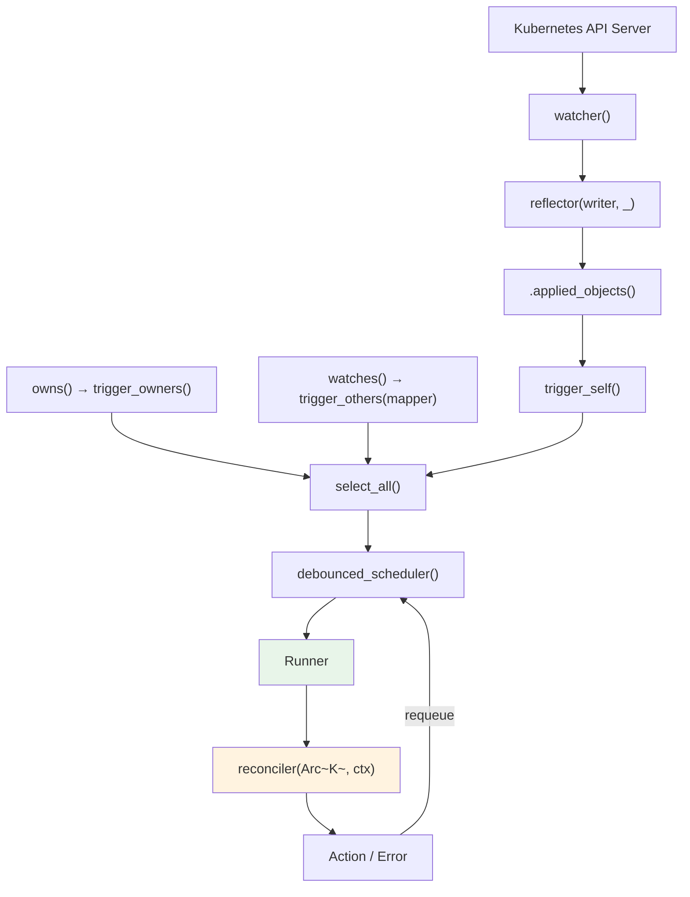

각 단계:

1. **watcher()** — API 서버에 watch 연결을 열어 `Event<K>` 스트림을 만듦
2. **reflector()** — 스트림을 통과시키면서, 각 Event를 인메모리 Store에 기록
3. **.applied_objects()** — `Event::Apply(K)`, `Event::InitApply(K)`에서 객체 `K`만 꺼냄
4. **trigger_self()** — 꺼낸 `K`를 `ReconcileRequest<K>`로 변환
5. **owns()/watches()** — 관련 리소스(자식, 참조 대상)의 변경도 trigger 스트림으로 추가
6. **select_all()** — 위 trigger 스트림들을 하나로 merge
7. **debounced_scheduler()** — 같은 `ObjectRef`가 여러 번 들어오면 하나로 합치고, debounce 지연 적용
8. **Runner** — concurrency 제한. 같은 객체는 동시에 reconcile하지 않음
9. **reconciler** — 사용자 코드 실행
10. **Action/Error** — 결과(재시도 시간, 에러)를 scheduler로 피드백

## Controller struct

```rust title="kube-runtime/src/controller/mod.rs (단순화)"
pub struct Controller<K> {
    trigger_selector: SelectAll<BoxStream<'static, Result<ReconcileRequest<K>, watcher::Error>>>,
    trigger_backoff: Box<dyn Backoff + Send>,
    reader: Store<K>,
    config: Config,
}
```

- **trigger_selector**: 모든 trigger 스트림(`trigger_self` + `owns` + `watches`)을 `SelectAll`로 합친 것입니다
- **reader**: reflector가 관리하는 Store의 읽기 핸들입니다. reconciler에서 `Arc<K>`를 꺼낼 때 사용합니다
- **config**: debounce duration, concurrency 제한 등을 설정합니다

## Trigger 시스템

### trigger_self — 주 리소스 변경

주 리소스(Controller::new에 지정한 타입)가 변경되면 해당 리소스에 대한 `ReconcileRequest`를 생성합니다.

```rust
// 내부 흐름
watcher Event → .applied_objects() → trigger_self() → ReconcileRequest<K>
```

`ReconcileRequest`는 대상 리소스의 `ObjectRef`와 trigger 이유를 담고 있습니다:

```rust title="ReconcileRequest 내부"
pub struct ReconcileRequest<K: Resource> {
    pub obj_ref: ObjectRef<K>,
    pub reason: ReconcileReason,
}
```

`ReconcileReason`에는 다음 variant가 있습니다:

| Variant | 설명 |
|---------|------|
| `Unknown` | `reconcile_on()`으로 주입된 외부 trigger |
| `ObjectUpdated` | 주 리소스가 변경됨 |
| `RelatedObjectUpdated { obj_ref }` | 관련 리소스가 변경됨 (owns/watches) |
| `ReconcilerRequestedRetry` | reconciler가 `Action::requeue()`로 재실행 요청 |
| `ErrorPolicyRequestedRetry` | `error_policy`가 재실행 요청 |
| `BulkReconcile` | `reconcile_all_on()`으로 전체 재reconcile 요청 |
| `Custom { reason }` | 사용자 정의 사유 (큐 스트림에 직접 주입 시) |

### trigger_owners — 자식 리소스 변경

```rust
controller.owns::<ConfigMap>(api, wc)
```

1. ConfigMap에 대한 별도 watcher를 생성합니다
2. ConfigMap이 변경되면 `metadata.ownerReferences`를 확인합니다
3. 부모(주 리소스)의 `ObjectRef`를 추출합니다
4. 부모에 대한 `ReconcileRequest`를 발행합니다

ownerReferences에서 부모를 식별할 때, `kind`와 `apiVersion`이 Controller의 주 리소스 타입과 일치하는 항목만 추출합니다.

### trigger_others — 관련 리소스 변경

```rust
controller.watches::<Secret>(api, wc, |secret| {
    // Secret에서 관련 주 리소스의 ObjectRef 목록 반환
    let name = secret.labels().get("app")?.clone();
    let ns = secret.namespace()?;
    Some(ObjectRef::new(&name).within(&ns))
})
```

1. Secret에 대한 별도 watcher를 생성합니다
2. Secret이 변경되면 사용자 정의 mapper 함수를 호출합니다
3. mapper가 반환한 `ObjectRef`들에 대해 `ReconcileRequest`를 발행합니다

사용 사례: Secret 변경 → 해당 Secret을 참조하는 모든 리소스를 재reconcile합니다.

## 외부 이벤트 소스 — reconcile_on

`reconcile_on()`으로 watch 이벤트 외의 외부 트리거를 Controller에 연결할 수 있습니다.

```rust
use tokio::sync::mpsc;
use futures::stream::ReceiverStream;

let (tx, rx) = mpsc::channel::<ObjectRef<MyResource>>(256);

Controller::new(api, wc)
    .reconcile_on(ReceiverStream::new(rx))
    .run(reconcile, error_policy, ctx)
```

외부 webhook, 메시지 큐, 타이머 등에서 `ObjectRef`를 보내면 해당 리소스의 reconcile이 트리거됩니다. 이때 `ReconcileReason`은 `Unknown`으로 설정됩니다.

### Stream 기반 API

기본 `Controller::new()`는 내부에서 watcher를 생성하지만, `for_stream()`을 사용하면 미리 필터링된 스트림을 직접 주입할 수 있습니다. `owns_stream()`과 `watches_stream()`도 동일한 패턴입니다.

```rust
// 외부에서 생성한 watcher 스트림을 Controller에 주입
let (reader, writer) = reflector::store();
let stream = reflector(writer, watcher(api.clone(), wc))
    .applied_objects();

Controller::for_stream(stream, reader)
    .owns_stream::<ConfigMap>(cm_stream)
    .watches_stream::<Secret, _>(secret_stream, |secret| { /* mapper */ })
    .run(reconcile, error_policy, ctx)
```

### 다중 스트림 조합

여러 관련 리소스의 이벤트를 하나의 Controller에 통합하는 고급 패턴입니다. `for_stream()`과 `watches_stream()`을 조합하면 외부에서 구성한 스트림을 Controller에 주입할 수 있습니다.

```rust
use futures::stream;
use kube::runtime::{reflector, watcher, Controller, WatchStreamExt};

// 주 리소스 스트림
let (reader, writer) = reflector::store();
let main_stream = reflector(writer, watcher(main_api, wc.clone()))
    .applied_objects()
    .default_backoff();

// 관련 리소스 스트림들
let cm_stream = watcher(cm_api, wc.clone())
    .applied_objects()
    .default_backoff();

let secret_stream = watcher(secret_api, wc.clone())
    .applied_objects()
    .default_backoff();

Controller::for_stream(main_stream, reader)
    .watches_stream(cm_stream, |cm| {
        // ConfigMap → 주 리소스 매핑
        let name = cm.labels().get("app")?.clone();
        let ns = cm.namespace()?;
        Some(ObjectRef::new(&name).within(&ns))
    })
    .watches_stream(secret_stream, |secret| {
        // Secret → 주 리소스 매핑
        let name = secret.labels().get("app")?.clone();
        let ns = secret.namespace()?;
        Some(ObjectRef::new(&name).within(&ns))
    })
    .run(reconcile, error_policy, ctx)
```

이 패턴은 `owns()`/`watches()`가 내부에서 생성하는 watcher를 외부에서 직접 구성하는 것입니다. 스트림에 `.modify()`로 필드를 제거하거나, shared reflector로 여러 Controller가 공유하는 등의 세밀한 제어가 가능합니다. **제네릭 컨트롤러**에서 공유 패턴을 다룹니다.

:::warning[Unstable feature flags]
아래 API는 unstable feature flag를 활성화해야 사용할 수 있습니다:
- `reconcile_on()` → `unstable-runtime-reconcile-on`
- `for_stream()`, `owns_stream()`, `watches_stream()` → `unstable-runtime-stream-control`

```toml
kube = { version = "...", features = ["unstable-runtime-reconcile-on", "unstable-runtime-stream-control"] }
```
:::

## Scheduler — 중복 제거와 지연

`debounced_scheduler()`는 `DelayQueue` + `HashMap`으로 중복 제거와 시간 기반 스케줄링을 수행합니다.

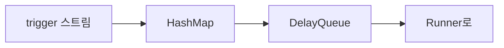

동작 방식:

- 같은 `ObjectRef`에 trigger가 여러 번 들어오면, 가장 빠른 예약 시간 하나만 남기고 나머지는 버립니다
- debounce가 설정되면, 설정된 기간 내의 추가 trigger를 무시합니다

```
debounce = 1초일 때:
t=0.0  trigger(A) → 1초 후 실행 예약
t=0.3  trigger(A) → 이미 예약됨, 무시
t=1.0  A 실행
t=1.2  trigger(A) → 다시 1초 후 예약
```

debounce가 필요한 이유: reconciler가 status를 업데이트하면 → 새 `resourceVersion` 생성 → watch 이벤트 발생 → 불필요한 재reconcile이 됩니다. debounce가 이 burst를 흡수합니다. 자세한 내용은 **Reconciler 패턴**에서 다룹니다.

## Runner — concurrency 제어

Runner는 scheduler에서 나온 항목을 실제로 reconciler에 전달하면서 concurrency를 제어합니다.

핵심 동작:

1. **readiness gate**: `Store::wait_until_ready()`가 완료될 때까지 reconcile을 시작하지 않습니다
2. **hold_unless**: 이미 reconcile 중인 `ObjectRef`는 scheduler에 남겨둡니다
3. **max_concurrent_executions**: 전체 동시 reconcile 수를 제한합니다

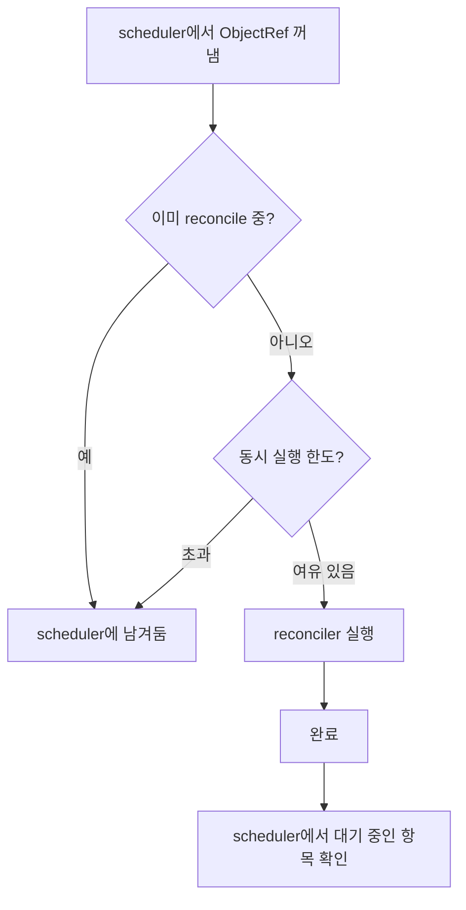

같은 객체의 동시 reconcile을 방지하는 건 **hold_unless 패턴**입니다:

- A 객체 reconcile 중 → A에 대한 새 trigger 도착 → scheduler에서 대기
- A 완료 → scheduler에서 A를 다시 꺼내 실행

이렇게 하면 같은 리소스에 대한 reconcile이 순서대로 실행됩니다.

## Reconcile 결과 처리

reconciler의 결과에 따라 scheduler에 피드백합니다.

### 성공 시

```rust
async fn reconcile(obj: Arc<MyResource>, ctx: Arc<Context>) -> Result<Action, Error> {
    // ... reconcile 로직 ...

    // 5분 후 다시 확인
    Ok(Action::requeue(Duration::from_secs(300)))

    // 또는: 다음 watch 이벤트까지 대기
    Ok(Action::await_change())
}
```

| Action | 동작 |
|--------|------|
| `requeue(Duration)` | 지정된 시간 후 scheduler에 재실행 예약 |
| `await_change()` | 능동적 requeue 없음, 다음 watch 이벤트 대기 |

### 실패 시

```rust
fn error_policy(
    obj: Arc<MyResource>,
    error: &Error,
    ctx: Arc<Context>,
) -> Action {
    Action::requeue(Duration::from_secs(5))
}
```

`error_policy`가 반환한 `Action`에 따라 scheduler에 예약합니다.

## Config

```rust
use kube::runtime::controller::Config;

controller.with_config(
    Config::default()
        .debounce(Duration::from_secs(1))  // trigger 간 최소 간격
        .concurrency(10)                    // 최대 동시 reconcile 수
)
```

| 설정 | 기본값 | 설명 |
|------|--------|------|
| `debounce` | 0 (없음) | trigger 간 최소 간격. burst 흡수에 유용합니다 |
| `concurrency` | 0 (무제한) | 동시 reconcile 수 제한. 0은 무제한입니다 |

## Shutdown

```rust
// SIGTERM/SIGINT에 반응
controller.shutdown_on_signal()

// 커스텀 shutdown trigger
controller.graceful_shutdown_on(async {
    // 어떤 조건...
})
```

graceful shutdown 동작:
1. 새 reconcile 시작을 중단합니다
2. 진행 중인 reconcile은 완료될 때까지 대기합니다

내부적으로 `tokio::signal`을 사용합니다.


---

# CRD와 derive 매크로

`#[derive(CustomResource)]`는 Rust struct 하나에서 Kubernetes Custom Resource Definition 전체를 생성합니다. 이 매크로가 실제로 어떤 코드를 만들어내는지, 스키마가 어떻게 생성되는지 이해하면 CRD 관련 문제를 디버깅할 수 있습니다.

## 입력 코드

```rust
#[derive(CustomResource, Clone, Debug, Serialize, Deserialize, JsonSchema)]
#[kube(group = "example.com", version = "v1", kind = "Document")]
#[kube(namespaced, status = "DocumentStatus")]
pub struct DocumentSpec {
    pub title: String,
    pub content: String,
}

#[derive(Clone, Debug, Serialize, Deserialize, JsonSchema)]
pub struct DocumentStatus {
    pub phase: String,
}
```

직접 작성하는 건 `DocumentSpec`(+ `DocumentStatus`는 optional)뿐이고, 나머지는 매크로가 생성합니다.

## 생성되는 코드

`#[derive(CustomResource)]`가 만들어내는 것을 `cargo expand`로 확인할 수 있습니다.

### 1. Document struct

```rust title="생성된 코드 (단순화)"
pub struct Document {
    pub metadata: ObjectMeta,
    pub spec: DocumentSpec,
    pub status: Option<DocumentStatus>,
}
```

사용자가 정의한 `DocumentSpec`이 `spec` 필드로, `DocumentStatus`가 `status` 필드로 들어갑니다. `metadata`는 항상 `ObjectMeta`입니다.

### 2. Resource trait 구현

```rust title="생성된 코드 (단순화)"
impl Resource for Document {
    type DynamicType = ();
    type Scope = NamespaceResourceScope; // #[kube(namespaced)]

    fn kind(_: &()) -> Cow<'_, str> { "Document".into() }
    fn group(_: &()) -> Cow<'_, str> { "example.com".into() }
    fn version(_: &()) -> Cow<'_, str> { "v1".into() }
    fn plural(_: &()) -> Cow<'_, str> { "documents".into() }
    fn meta(&self) -> &ObjectMeta { &self.metadata }
    fn meta_mut(&mut self) -> &mut ObjectMeta { &mut self.metadata }
}
```

`#[kube(namespaced)]`가 없으면 `Scope = ClusterResourceScope`가 됩니다.

### 3. CustomResourceExt 구현

```rust title="생성된 코드 (단순화)"
impl CustomResourceExt for Document {
    fn crd() -> CustomResourceDefinition { /* CRD 전체 구조 생성 */ }
    fn crd_name() -> &'static str { "documents.example.com" }
    fn api_resource() -> ApiResource { /* ApiResource 생성 */ }
    fn shortnames() -> &'static [&'static str] { &[] }
}
```

### 4. 기타 구현

- `HasSpec for Document` — `fn spec(&self) -> &DocumentSpec`
- `HasStatus for Document` — `fn status(&self) -> Option<&DocumentStatus>` (status 지정 시)
- `Document::new(name, spec)` — 새 인스턴스 생성 편의 함수

## 스키마 생성 과정

CRD 스키마는 세 단계를 거칩니다:

1. `DocumentSpec`의 `#[derive(JsonSchema)]` (schemars)가 OpenAPI v3 JSON 스키마를 생성합니다
2. kube-derive가 이 스키마를 CRD의 `.spec.versions[].schema.openAPIV3Schema` 필드에 삽입합니다
3. `Document::crd()`를 호출하면 완성된 CRD가 반환됩니다

최종 CRD의 구조:

```yaml title="Document::crd()가 생성하는 CRD"
apiVersion: apiextensions.k8s.io/v1
kind: CustomResourceDefinition
metadata:
  name: documents.example.com
spec:
  group: example.com
  names:
    kind: Document
    plural: documents
    singular: document
  scope: Namespaced
  versions:
  - name: v1
    served: true
    storage: true
    schema:
      openAPIV3Schema:
        properties:
          spec:
            properties:
              title: { type: string }
              content: { type: string }
            required: [title, content]
          status:
            properties:
              phase: { type: string }
```

## 주요 #[kube(...)] 어트리뷰트

### 필수

| 어트리뷰트 | 설명 |
|-----------|------|
| `group = "example.com"` | CRD의 API group |
| `version = "v1"` | API version |
| `kind = "Document"` | 리소스 kind |

### 스코프와 서브리소스

```rust
#[kube(namespaced)]                     // 네임스페이스 스코프 (없으면 클러스터)
#[kube(status = "DocumentStatus")]      // /status 서브리소스 활성화
#[kube(scale = r#"{"specReplicasPath": ".spec.replicas", "statusReplicasPath": ".status.replicas"}"#)]
```

### 메타데이터

```rust
#[kube(shortname = "doc")]              // kubectl get doc
#[kube(category = "example")]           // kubectl get example (그룹 조회)
#[kube(printcolumn = r#"{"name":"Phase","type":"string","jsonPath":".status.phase"}"#)]
#[kube(selectable = ".spec.title")]     // field selector 지원
```

### 스키마 제어

```rust
#[kube(schema = "derived")]             // 기본: schemars에서 자동 생성
#[kube(schema = "manual")]              // 수동 스키마 지정
#[kube(schema = "disabled")]            // 스키마 비활성화
#[kube(doc = "문서 리소스 설명")]          // CRD description
```

### CEL 검증

```rust
#[kube(validation = Rule::new("self.spec.title.size() > 0"))]
```

Kubernetes 서버 측에서 CEL(Common Expression Language) 검증을 수행합니다.

### 버전 관리

```rust
#[kube(storage)]                        // 이 버전을 etcd에 저장
#[kube(served = true)]                  // API에서 제공
#[kube(deprecated = "v2로 마이그레이션")]  // 사용 중단 표시
```

## 스키마 관련 함정들

### untagged enum

```rust
#[derive(Serialize, Deserialize, JsonSchema)]
#[serde(untagged)]
enum Value {
    String(String),
    Number(i64),
}
```

schemars가 `anyOf` 스키마를 생성합니다. Kubernetes가 이를 structural schema로 인정하지 않아 거부할 수 있습니다.

**대응**: `#[schemars(schema_with = "custom_schema")]`로 수동 스키마를 지정합니다.

### flatten HashMap

```rust
#[derive(Serialize, Deserialize, JsonSchema)]
struct Config {
    name: String,
    #[serde(flatten)]
    extra: HashMap<String, serde_json::Value>,
}
```

schemars가 `additionalProperties`를 생성하는데, OpenAPI v3 스키마와 호환되지 않을 수 있습니다.

### ArgoCD drift

kube-derive가 빈 `shortNames`, `categories` 등을 기본값으로 생성합니다. Kubernetes API 서버는 이런 빈 배열을 strip하므로, etcd에 저장된 CRD와 `Document::crd()`가 생성한 CRD 사이에 차이가 생깁니다. ArgoCD가 이를 영구 drift로 감지합니다.

:::tip[cargo expand로 디버깅]
매크로가 생성한 코드를 확인하려면 `cargo expand`를 사용합니다:

```bash
cargo expand --lib | grep -A 50 "impl Resource for Document"
```
:::

## CRD 등록 패턴

Server-Side Apply로 CRD를 등록하고 활성화될 때까지 대기하는 패턴입니다:

```rust
use kube::runtime::wait::conditions;

let crds = Document::crd();
let crd_api: Api<CustomResourceDefinition> = Api::all(client.clone());

// SSA로 CRD 등록/업데이트
let pp = PatchParams::apply("my-controller").force();
crd_api.patch("documents.example.com", &pp, &Patch::Apply(crds)).await?;

// CRD가 Established 상태가 될 때까지 대기
let establish = conditions::is_crd_established();
let crd = tokio::time::timeout(
    Duration::from_secs(10),
    kube::runtime::wait::await_condition(crd_api, "documents.example.com", establish),
).await??;
```

## 다른 derive 매크로

### #[derive(Resource)]

기존 타입에 `Resource` trait을 구현합니다. k8s-openapi 타입을 래핑하는 struct에 유용합니다.

```rust
#[derive(Resource, Clone, Debug, Serialize, Deserialize)]
#[resource(inherit = "ConfigMap")]
struct MyConfigMap {
    metadata: ObjectMeta,
    data: Option<BTreeMap<String, String>>,
}
```

### #[derive(KubeSchema)]

CEL 검증 룰이 포함된 `JsonSchema` 구현을 생성합니다. `CustomResource`와 함께 쓰거나 단독으로 사용할 수 있습니다. CEL 검증의 상세한 사용법은 **Admission 검증 — CEL 검증**에서 다룹니다.

## 스키마 오버라이드

schemars가 생성하는 기본 스키마가 Kubernetes의 structural schema 요구사항과 맞지 않을 때, 필드 단위로 스키마를 오버라이드합니다.

### schemars(schema_with)

`#[schemars(schema_with = "함수명")]`으로 특정 필드의 스키마를 완전히 대체합니다:

```rust
use schemars::schema::{Schema, SchemaObject, InstanceType};

fn quantity_schema(_gen: &mut schemars::SchemaGenerator) -> Schema {
    Schema::Object(SchemaObject {
        instance_type: Some(InstanceType::String.into()),
        format: Some("quantity".to_string()),
        ..Default::default()
    })
}

#[derive(CustomResource, KubeSchema, Serialize, Deserialize, Clone, Debug)]
#[kube(group = "example.com", version = "v1", kind = "MyApp")]
pub struct MyAppSpec {
    #[schemars(schema_with = "quantity_schema")]
    pub memory_limit: String,
}
```

[스키마 관련 함정들](#스키마-관련-함정들)에서 다룬 `untagged enum`이나 `flatten HashMap` 문제를 이 방법으로 해결합니다.

### x-kubernetes-validations

`#[x_kube(validation)]`이 생성하는 `x-kubernetes-validations` 확장은 OpenAPI 스키마의 확장 필드입니다:

```yaml title="생성되는 스키마"
properties:
  title:
    type: string
    x-kubernetes-validations:
      - rule: "self != ''"
        message: "title은 비어있을 수 없습니다"
```

이 확장 필드는 API 서버가 CEL 엔진으로 평가합니다. 스키마 자체의 `type`, `format` 등과는 독립적으로 동작합니다.

## CRD 버전 관리

### 버전별 모듈

CRD를 여러 버전으로 제공할 때, 버전별로 별도 모듈을 만들고 각각 `#[derive(CustomResource)]`를 적용합니다:

```rust
mod v1 {
    #[derive(CustomResource, KubeSchema, Serialize, Deserialize, Clone, Debug)]
    #[kube(group = "example.com", version = "v1", kind = "Document")]
    #[kube(namespaced, status = "DocumentStatus")]
    pub struct DocumentSpec {
        pub title: String,
    }
}

mod v2 {
    #[derive(CustomResource, KubeSchema, Serialize, Deserialize, Clone, Debug)]
    #[kube(group = "example.com", version = "v2", kind = "Document")]
    #[kube(namespaced, status = "DocumentStatus")]
    pub struct DocumentSpec {
        pub title: String,
        pub category: String,  // v2에서 추가
    }
}
```

### merge_crds()

`merge_crds()`로 여러 단일 버전 CRD를 하나의 멀티 버전 CRD로 합칩니다:

```rust title="kube-core/src/crd.rs"
pub fn merge_crds(crds: Vec<CustomResourceDefinition>, stored_apiversion: &str)
    -> Result<CustomResourceDefinition, MergeError>
```

```rust
use kube::core::crd::merge_crds;

let merged = merge_crds(
    vec![v1::Document::crd(), v2::Document::crd()],
    "v2",  // etcd에 저장할 버전
)?;

// merged CRD를 API 서버에 등록
crd_api.patch("documents.example.com", &pp, &Patch::Apply(merged)).await?;
```

`merge_crds()`는 다음을 검증합니다:
- 모든 CRD의 `spec.group`이 동일한지
- 모든 CRD의 `spec.names.kind`가 동일한지
- 모든 CRD의 `spec.scope`가 동일한지
- 각 입력 CRD가 단일 버전인지

`stored_apiversion`으로 지정한 버전만 `storage: true`로, 나머지는 `storage: false`로 설정됩니다.

:::warning[버전 간 변환]
Kubernetes는 저장된 버전과 다른 버전으로 요청이 올 때 변환(conversion)을 수행합니다. 단순한 필드 추가/제거는 API 서버가 자동 처리하지만, 복잡한 변환은 conversion webhook이 필요합니다.
:::


---

# Patterns

kube를 올바르게 사용하는 패턴과, 실제 사용자들이 반복적으로 겪는 실수를 다룹니다. GitHub Issues와 Discussions에서 가장 많이 올라온 질문들을 기반으로 정리했습니다.

## 이 섹션에서 다루는 것

| 문서 | 핵심 질문 |
|------|----------|
| [Reconciler 패턴](./reconciler.md) | idempotent reconciler를 어떻게 쓰고, 무한루프를 어떻게 피하는가? |
| [관계와 Finalizer](./relations-and-finalizers.md) | owns/watches는 내부에서 어떻게 동작하고, finalizer는 언제 쓰는가? |
| [Server-Side Apply](./server-side-apply.md) | SSA의 올바른 사용법과 흔히 빠지는 함정은? |
| [서드파티 CRD](./third-party-crds.md) | 직접 만들지 않은 CRD를 어떻게 다루는가? |
| [에러 처리와 Backoff](./error-handling-and-backoff.md) | 어디서 어떤 에러가 나오고, backoff를 어떻게 설정하는가? |
| [제네릭 컨트롤러](./generic-controllers.md) | 여러 리소스에 재사용 가능한 reconciler와 다중 Controller를 어떻게 구성하는가? |
| [트러블슈팅](./troubleshooting.md) | 증상별 진단, 디버깅 도구, 프로파일링으로 문제를 빠르게 해결하려면? |

**Runtime Internals** 섹션에서 내부 동작을 이해했다면, 이 섹션에서는 "그래서 어떻게 써야 하는가"를 다룹니다.


---

# Reconciler 패턴

Reconciler는 **Controller 파이프라인**에서 실제 비즈니스 로직이 실행되는 부분입니다. "현재 상태를 보고 원하는 상태로 수렴시키는" 함수를 어떻게 올바르게 작성하는지, 흔한 실수는 무엇인지 다룹니다.

## 함수 시그니처

```rust
async fn reconcile(obj: Arc<MyResource>, ctx: Arc<Context>) -> Result<Action, Error> {
    // ...
    Ok(Action::requeue(Duration::from_secs(300)))
}
```

| 매개변수 | 역할 |
|---------|------|
| `Arc<K>` | Store에서 꺼낸 객체입니다. clone 없이 참조를 공유합니다. |
| `Arc<Context>` | 의존성 주입 컨테이너입니다. Client, 메트릭, 설정 등을 담습니다. |
| 반환 `Action` | 성공 시 다음 행동 (requeue 또는 await_change)입니다. |
| 반환 `Error` | 실패 시 error_policy에 전달됩니다. |

### Context 패턴

reconciler의 외부 의존성(Client, 설정 등)은 전부 Context에 넣어서 관리합니다.

```rust
struct Context {
    client: Client,
    metrics: Metrics,
    config: AppConfig,
}

// Controller 실행
let ctx = Arc::new(Context { client, metrics, config });
Controller::new(api, wc)
    .run(reconcile, error_policy, ctx)
    .for_each(|res| async move {
        match res {
            Ok(o) => tracing::info!("reconciled {:?}", o),
            Err(e) => tracing::error!("reconcile error: {:?}", e),
        }
    })
    .await;
```

테스트 시 mock Client를 주입할 수 있습니다.

## 핵심 원칙: Idempotency

**"같은 reconcile을 100번 호출해도 결과가 같아야 합니다."**

kube-rs의 Controller는 **level-triggered** 설계를 따릅니다:

| 방식 | 질문 | kube-rs |
|------|------|---------|
| edge-triggered | "무엇이 **변했는가**"에 반응 | ✗ |
| level-triggered | "현재 상태가 **무엇인가**"를 보고 수렴 | ✓ |

Controller가 의도적으로 trigger reason을 숨기는 이유: watch 이벤트는 병합, 중복, 유실될 수 있습니다. "왜 호출되었는가"에 의존하면 이벤트 누락 시 올바르게 동작하지 않습니다.

`ReconcileReason`은 tracing span에만 존재합니다. 로깅과 디버깅 목적이지, reconciler 로직에서 분기하라는 의미가 아닙니다.

## 무한 루프 패턴

### 패턴 1: status에 비결정론적 값 쓰기

```rust
// ✗ 이렇게 하면 안 됩니다
status.last_updated = Utc::now();  // 매번 다른 값
api.patch_status("name", &pp, &patch).await?;
// → 새 resourceVersion → watch 이벤트 → 재trigger → 무한반복
```

### 패턴 2: 다른 컨트롤러와 경쟁

내 controller가 Deployment에 annotation을 추가하면, Deployment controller가 다른 필드를 수정하고, 그것이 다시 내 controller를 trigger하는 루프입니다.

### 방지법

**1. 결정론적 값만 사용합니다**

타임스탬프 대신 해시, generation 등 결정론적인 값을 사용합니다. 값이 같으면 patch를 건너뜁니다.

```rust
// ✓ 값이 변했을 때만 업데이트
if current_status != desired_status {
    api.patch_status("name", &pp, &patch).await?;
}
```

**2. predicate_filter를 사용합니다**

```rust
use kube::runtime::{predicates, WatchStreamExt};

// status 변경은 generation이 바뀌지 않으므로 필터링됩니다
let stream = watcher(api, wc)
    .default_backoff()
    .applied_objects()
    .predicate_filter(predicates::generation);

Controller::for_stream(stream, reader)
```

`predicate_filter()`는 `WatchStreamExt` trait의 메서드입니다. `Controller`의 메서드가 아니므로, 스트림에 적용한 후 `Controller::for_stream()`으로 주입합니다.

:::warning[finalizer + generation predicate]
finalizer 추가/제거도 generation을 변경하지 않습니다. `predicates::generation`만 사용하면 finalizer 관련 이벤트를 놓칩니다.

```rust
// 두 predicate를 조합합니다
.predicate_filter(predicates::generation.combine(predicates::finalizers))
```
:::

## Action 전략

| Action | 언제 사용 |
|--------|---------|
| `Action::requeue(Duration)` | 외부 상태에 의존할 때. 주기적으로 확인이 필요한 경우 |
| `Action::await_change()` | 자기 리소스 + owns 관계만 볼 때. watch 이벤트가 올 때만 재실행 |

```rust
// 외부 API 상태를 5분마다 확인
Ok(Action::requeue(Duration::from_secs(300)))

// watch 이벤트가 올 때만 재실행
Ok(Action::await_change())
```

### error_policy에서의 전략

```rust
fn error_policy(obj: Arc<MyResource>, err: &Error, ctx: Arc<Context>) -> Action {
    tracing::error!(?err, "reconcile failed");
    Action::requeue(Duration::from_secs(5))
}
```

고정 간격은 단순하지만, 지속적인 에러 시 API 서버에 부하를 줄 수 있습니다. per-key 지수 backoff가 더 안전합니다.

## Per-key backoff 패턴

kube-rs에는 Go controller-runtime과 달리 내장 per-key backoff가 없습니다. wrapper 패턴으로 직접 구현합니다.

```rust
use std::collections::HashMap;
use std::sync::Mutex;

struct Context {
    client: Client,
    failure_counts: Mutex<HashMap<String, u32>>,
}

async fn reconcile(obj: Arc<MyResource>, ctx: Arc<Context>) -> Result<Action, Error> {
    let key = obj.name_any();

    match reconcile_inner(&obj, &ctx).await {
        Ok(action) => {
            // 성공 시 카운터 리셋
            ctx.failure_counts.lock().unwrap().remove(&key);
            Ok(action)
        }
        Err(e) => {
            // 실패 시 카운터 증가
            let mut counts = ctx.failure_counts.lock().unwrap();
            let count = counts.entry(key).or_insert(0);
            *count += 1;
            Err(e)
        }
    }
}

fn error_policy(obj: Arc<MyResource>, err: &Error, ctx: Arc<Context>) -> Action {
    let count = ctx.failure_counts.lock().unwrap()
        .get(&obj.name_any()).copied().unwrap_or(1);
    let backoff = Duration::from_secs(2u64.pow(count.min(6))); // 최대 64초
    Action::requeue(backoff)
}
```

## 에러 처리

### thiserror를 사용합니다

`Controller::run()`이 Error에 특정 trait bound를 요구하므로, `anyhow::Error`는 사용할 수 없습니다. `thiserror`로 구체적 에러 타입을 정의합니다.

```rust
#[derive(Debug, thiserror::Error)]
enum Error {
    #[error("Kubernetes API error: {0}")]
    KubeApi(#[from] kube::Error),

    #[error("Missing spec field: {0}")]
    MissingField(String),

    #[error("External service error: {0}")]
    External(String),
}
```

### 일시적 vs 영구적 에러

| 유형 | 예시 | 처리 |
|------|------|------|
| 일시적 | 네트워크 에러, 타임아웃, 429 | `error_policy`에서 requeue |
| 영구적 | 잘못된 spec, 유효하지 않은 설정 | status에 condition 기록 + `Action::await_change()` |

```rust
// 영구적 에러: status에 기록하고 재시도하지 않음
if !is_valid_spec(&obj.spec) {
    update_status_condition(&api, &obj, "InvalidSpec", "Spec validation failed").await?;
    return Ok(Action::await_change());
}
```


---

# 관계와 Finalizer

Controller가 여러 리소스의 변경을 감지하는 방법(owns, watches)과, 리소스 삭제 전 cleanup을 보장하는 finalizer의 동작 원리를 다룹니다. owns와 watches의 내부 trigger 메커니즘은 **Controller 파이프라인**에서 자세히 설명합니다.

## 소유 관계 — owns

```rust
controller.owns::<ConfigMap>(api, wc)
```

내부 동작:

1. ConfigMap에 대한 별도 watcher를 생성합니다
2. ConfigMap이 변경되면 `metadata.ownerReferences`를 순회합니다
3. 부모의 `kind`/`apiVersion`이 Controller 주 리소스와 일치하면
4. 부모의 `ObjectRef`로 `ReconcileRequest`를 생성합니다

### ownerReference 설정

reconciler에서 자식 리소스를 생성할 때 ownerReference를 설정합니다:

```rust
let owner_ref = obj.controller_owner_ref(&()).unwrap();
let cm = ConfigMap {
    metadata: ObjectMeta {
        name: Some("my-config".into()),
        namespace: obj.namespace(),
        owner_references: Some(vec![owner_ref]),
        ..Default::default()
    },
    data: Some(BTreeMap::from([("key".into(), "value".into())])),
    ..Default::default()
};
```

| 메서드 | `controller` 필드 | 용도 |
|--------|-------------------|------|
| `controller_owner_ref()` | `true` | 하나의 컨트롤러만 소유. Controller에서 사용 |
| `owner_ref()` | 미설정 | 여러 소유자 가능 |

### 자동 GC

ownerReference가 설정된 리소스는 부모 삭제 시 Kubernetes가 자동으로 삭제합니다. `propagationPolicy`에 따라 Foreground, Background, Orphan 중 선택할 수 있습니다.

## watch 관계 — watches

ownerReference로 관계를 표현할 수 없을 때 `watches`를 사용합니다.

```rust
controller.watches::<Secret>(api, wc, |secret| {
    // Secret에서 관련 주 리소스의 ObjectRef 목록 반환
    let name = secret.labels().get("app")?.clone();
    let ns = secret.namespace()?;
    Some(ObjectRef::new(&name).within(&ns))
})
```

| | owns | watches |
|---|------|---------|
| 관계 정의 | 리소스의 `ownerReferences`에 기록 | 코드의 mapper 함수에 정의 |
| 매핑 | 자동 (`ownerReferences` 순회) | 수동 (mapper 함수 작성) |
| GC | Kubernetes가 자동 처리 | 직접 처리 |
| 사용 사례 | 부모-자식 관계 | 참조 관계 (Secret → 리소스) |

## Finalizer state machine

finalizer는 리소스 삭제 전 cleanup을 **보장**합니다. watch 이벤트의 `Delete`는 네트워크 단절로 유실될 수 있지만, finalizer가 있으면 Kubernetes가 삭제를 지연시키므로 cleanup을 확실히 실행할 수 있습니다.

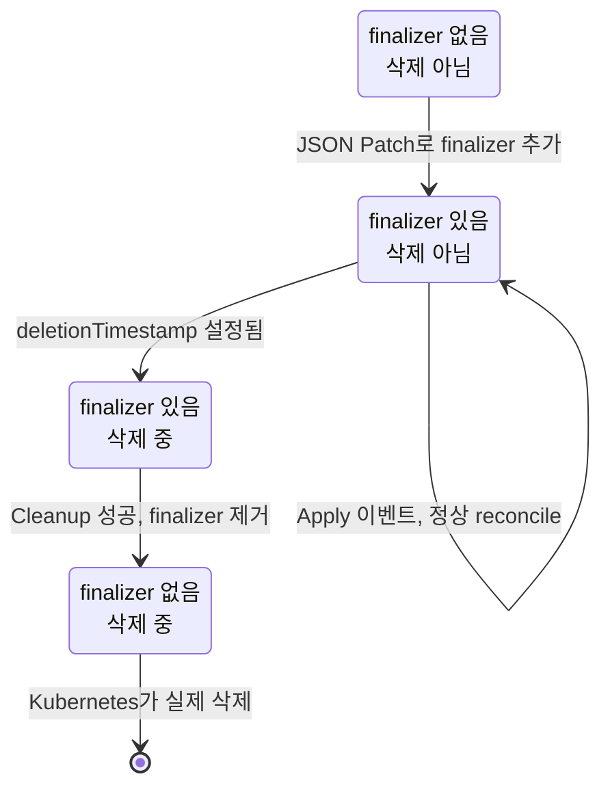

네 가지 상태:

| finalizer | 삭제 중? | 동작 |
|-----------|---------|------|
| 없음 | 아님 | JSON Patch로 finalizer를 추가합니다 |
| 있음 | 아님 | `Event::Apply` → 정상 reconcile |
| 있음 | 삭제 중 | `Event::Cleanup` → cleanup 후 finalizer 제거 |
| 없음 | 삭제 중 | 아무것도 하지 않습니다 (이미 cleanup됨) |

finalizer 제거 시 JSON Patch에 `Test` operation이 포함됩니다. 다른 프로세스가 이미 finalizer를 제거했다면 Patch가 실패해 concurrency 문제를 방지합니다.

## 사용 패턴

```rust
use kube::runtime::finalizer::{finalizer, Event};

const FINALIZER_NAME: &str = "myapp.example.com/cleanup";

async fn reconcile(obj: Arc<MyResource>, ctx: Arc<Context>) -> Result<Action, Error> {
    let api = Api::<MyResource>::namespaced(
        ctx.client.clone(),
        &obj.namespace().unwrap(),
    );

    finalizer(&api, FINALIZER_NAME, obj, |event| async {
        match event {
            Event::Apply(obj) => apply(obj, &ctx).await,
            Event::Cleanup(obj) => cleanup(obj, &ctx).await,
        }
    }).await
}

async fn apply(obj: Arc<MyResource>, ctx: &Context) -> Result<Action, Error> {
    // 정상 reconcile 로직
    Ok(Action::requeue(Duration::from_secs(300)))
}

async fn cleanup(obj: Arc<MyResource>, ctx: &Context) -> Result<Action, Error> {
    // 외부 리소스 정리
    // 이 함수가 성공하면 finalizer가 제거됩니다
    Ok(Action::await_change())
}
```

## 주의사항

### cleanup 실패 시 객체가 삭제되지 않습니다

`deletionTimestamp`는 설정되었지만 finalizer가 남아있으므로 Kubernetes가 실제 삭제를 수행하지 않습니다. cleanup은 **반드시 최종적으로 성공하도록** 설계해야 합니다. 영구적으로 실패하면 `kubectl delete --force`로 강제 삭제할 수 있지만, cleanup은 건너뛰게 됩니다.

### finalizer 이름은 도메인 형식이어야 합니다

`"myapp.example.com/cleanup"` 형식입니다. 다른 컨트롤러의 finalizer와 충돌하지 않도록 고유한 이름을 사용합니다.

### 클러스터 스코프 부모 + 네임스페이스 스코프 자식

클러스터 스코프 CR이 네임스페이스 스코프 자식을 owns할 때, 부모의 namespace가 `None`이고 자식의 namespace가 `Some("ns")`이므로 ObjectRef 매칭에 문제가 생길 수 있습니다. ownerReferences는 같은 namespace 또는 클러스터 스코프 리소스만 참조할 수 있습니다.

### finalizer + predicate_filter 상호작용

finalizer 추가/제거는 `generation`을 변경하지 않습니다. `predicates::generation`만 사용하면 finalizer 관련 이벤트를 놓칩니다.

```rust
// ✗ finalizer 이벤트를 놓칠 수 있음
.predicate_filter(predicates::generation)

// ✓ finalizer 변경도 감지
.predicate_filter(predicates::generation.combine(predicates::finalizers))
```

## cleanup 전략 매트릭스

관계 유형에 따라 cleanup 방법이 달라집니다:

| 관계 유형 | 설정 방법 | cleanup 방법 | Finalizer 필요? |
|-----------|----------|----------|----------------|
| **Owned** (owns) | `ownerReferences` 설정 | Kubernetes 자동 GC | 보통 불필요 |
| **Watched** (watches) | mapper 함수로 매핑 | reconciler에서 직접 삭제 | 필요 |
| **External** (클러스터 외부) | — | cleanup에서 외부 API 호출 | 필요 |

- **Owned**: `ownerReferences`가 있으므로 부모 삭제 시 Kubernetes가 자식을 자동 삭제합니다. 외부 리소스를 동시에 관리하지 않는 한 finalizer가 필요 없습니다.
- **Watched**: 소유 관계가 아니므로 자동 GC가 동작하지 않습니다. finalizer의 `Event::Cleanup`에서 관련 리소스를 직접 삭제해야 합니다.
- **External**: 클러스터 밖의 리소스(DNS 레코드, 클라우드 로드밸런서 등)는 Kubernetes가 관리하지 않으므로, finalizer로 삭제 전 외부 API를 호출해 cleanup합니다.


---

# Server-Side Apply

Server-Side Apply(SSA)는 Kubernetes의 필드 소유권 기반 패치 방식입니다. 여러 컨트롤러가 같은 리소스를 수정해도 필드 단위로 소유권을 나누기 때문에 충돌 없이 안전하게 동작합니다.

## 왜 SSA인가

기존 패치 방식의 한계:

| 방식 | 한계 |
|------|------|
| Merge patch | 배열 전체를 덮어씀. 필드 삭제가 명시적이지 않음 |
| Strategic merge patch | k8s-openapi 타입에만 동작. CRD에는 불완전 |
| JSON patch | 정확한 경로 지정 필요. race condition에 취약 |

SSA의 장점:

- **필드 소유권**: "이 컨트롤러가 이 필드를 소유한다"를 서버가 기록합니다
- **충돌 감지**: 다른 소유자의 필드를 건드리면 409 Conflict가 발생합니다
- **선언적**: "이 필드들이 이 값이어야 한다"만 선언하면 나머지는 건드리지 않습니다
- reconciler의 idempotent 패턴과 자연스럽게 맞습니다

## 기본 패턴

```rust
use kube::api::{Patch, PatchParams};

let patch = Patch::Apply(serde_json::json!({
    "apiVersion": "v1",
    "kind": "ConfigMap",
    "metadata": { "name": "my-cm" },
    "data": { "key": "value" }
}));
let pp = PatchParams::apply("my-controller"); // field manager 이름
api.patch("my-cm", &pp, &patch).await?;
```

`PatchParams::apply("my-controller")`의 `"my-controller"`가 field manager 이름입니다. 이 이름으로 필드 소유권이 기록됩니다. 같은 field manager로 다시 apply하면 소유 필드가 업데이트되고, 다른 field manager의 필드는 건드리지 않습니다.

## 흔한 실수들

### apiVersion과 kind 누락

```rust
// ✗ 400 Bad Request
let patch = Patch::Apply(serde_json::json!({
    "data": { "key": "value" }
}));

// ✓ apiVersion과 kind 필수
let patch = Patch::Apply(serde_json::json!({
    "apiVersion": "v1",
    "kind": "ConfigMap",
    "metadata": { "name": "my-cm" },
    "data": { "key": "value" }
}));
```

Merge patch와 달리 SSA는 `apiVersion`과 `kind`가 필수입니다.

### field manager 미지정

```rust
// ✗ field_manager가 None → API 서버가 요청을 거부합니다
let pp = PatchParams::default();

// ✓ 명시적 field manager
let pp = PatchParams::apply("my-controller");
```

SSA에서 field manager는 **필수**입니다. `field_manager`가 `None`(기본값)이면 API 서버가 에러를 반환합니다. SSA 작업에는 항상 `PatchParams::apply("my-controller")`를 사용합니다.

### force 남용

```rust
// 주의: 다른 field manager의 필드도 강제로 덮어씁니다
let pp = PatchParams::apply("my-controller").force();
```

`force: true`는 다른 컨트롤러의 소유 필드도 강제로 가져옵니다. CRD 등록 등 단일 소유자 상황에서만 사용합니다.

### 불필요한 필드 포함

Rust struct를 통째로 serialization하면 `Default` 값 필드도 포함됩니다. SSA가 해당 필드의 소유권을 가져가서, 다른 컨트롤러가 그 필드를 수정하면 충돌이 발생합니다.

## Status patching

status는 `/status` 서브리소스를 통해 수정합니다.

```rust
let status_patch = serde_json::json!({
    "apiVersion": "example.com/v1",
    "kind": "MyResource",
    "status": {
        "phase": "Ready",
        "conditions": [{
            "type": "Available",
            "status": "True",
            "lastTransitionTime": "2024-01-01T00:00:00Z",
        }]
    }
});
let pp = PatchParams::apply("my-controller");
api.patch_status("name", &pp, &Patch::Apply(status_patch)).await?;
```

:::warning[전체 객체 구조로 감싸야 합니다]
```rust
// ✗ status만 보내면 안 됩니다
serde_json::json!({ "phase": "Ready" })

// ✓ apiVersion, kind, status 구조로 감싸야 합니다
serde_json::json!({
    "apiVersion": "example.com/v1",
    "kind": "MyResource",
    "status": { "phase": "Ready" }
})
```

Kubernetes API가 `/status` 엔드포인트에서도 전체 객체 형태를 기대하기 때문입니다.
:::

## Typed SSA 패턴

`serde_json::json!()` 대신 Rust 타입을 사용하면 타입 안전성과 IDE 자동완성을 얻을 수 있습니다.

```rust
let cm = ConfigMap {
    metadata: ObjectMeta {
        name: Some("my-cm".into()),
        ..Default::default()
    },
    data: Some(BTreeMap::from([("key".into(), "value".into())])),
    ..Default::default()
};
let pp = PatchParams::apply("my-controller");
api.patch("my-cm", &pp, &Patch::Apply(cm)).await?;
```

k8s-openapi 타입은 커스텀 직렬화를 사용하여 `None` 필드를 생략합니다 (Option 필드는 값이 있을 때만 직렬화됩니다). 커스텀 타입에서는 `skip_serializing_if`를 직접 설정해야 합니다.

:::note[현재 한계: Rust에는 ApplyConfigurations가 없습니다]
Go의 client-go에는 SSA 전용으로 설계된 [ApplyConfigurations](https://pkg.go.dev/k8s.io/client-go/applyconfigurations)가 있습니다 — 모든 필드가 `Option`인 완전 optional builder 타입으로, 소유할 필드만 포함합니다. Rust에는 아직 동등한 것이 없습니다 ([kube#649](https://github.com/kube-rs/kube/issues/649)). k8s-openapi는 upstream Go struct를 그대로 반영하므로 일부 필드가 `Option`이 아닙니다 (예: `HorizontalPodAutoscalerSpec`의 `max_replicas: i32`). default struct를 직렬화하면 해당 필드도 포함되어 SSA가 소유권을 가져갑니다. `serde_json::json!()`으로 partial patch를 작성하는 것이 권장되는 우회 방법입니다.
:::

```rust
#[derive(Serialize)]
struct MyStatus {
    phase: String,
    #[serde(skip_serializing_if = "Option::is_none")]
    message: Option<String>,
}
```


---

# 서드파티 CRD

Istio VirtualService, Cert-Manager Certificate 같이 직접 만들지 않은 CRD를 kube에서 다루는 방법은 여러 가지입니다. 각 방법의 트레이드오프를 이해하고 상황에 맞게 선택합니다.

## 어떤 방법을 선택해야 하는가?

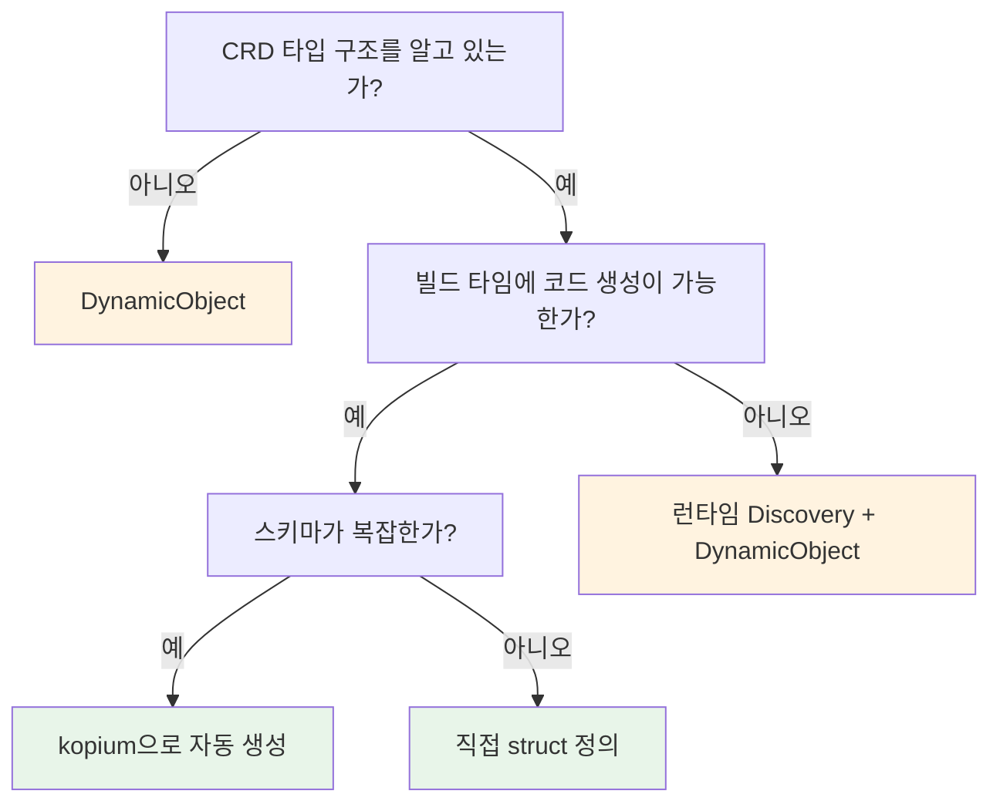

아래 각 방법의 상세 설명과 [비교 정리](#비교-정리)를 참고합니다.

:::warning[흔한 혼동]
`#[derive(CustomResource)]`는 CRD를 **정의**하는 용도입니다 (CRD YAML 생성, Kubernetes에 새 리소스 타입 등록).

이미 존재하는 CRD를 **소비**할 때는 아래 방법들을 사용합니다.

"Istio VirtualService를 읽고 싶다" ≠ "새 CRD를 만들고 싶다"
:::

## 방법 1: DynamicObject

타입 정의 없이 가장 빠르게 시작하는 방법입니다.

```rust
use kube::core::{DynamicObject, ApiResource, GroupVersionKind};

let gvk = GroupVersionKind::gvk("networking.istio.io", "v1", "VirtualService");
let ar = ApiResource::from_gvk(&gvk);
let api = Api::<DynamicObject>::namespaced_with(client, "default", &ar);

let vs = api.get("my-virtualservice").await?;
let hosts = vs.data["spec"]["hosts"].as_array();
```

| 장점 | 단점 |
|------|------|
| 타입 정의 불필요 | 필드 접근이 `serde_json::Value` |
| 코드 0줄로 시작 | IDE 자동완성 없음 |
| 스키마 변경에 영향 없음 | 런타임 에러 위험 |

프로토타이핑이나 필드 몇 개만 읽을 때 적합합니다.

## 방법 2: 직접 struct 정의

타입 안전하게 사용하려면 spec/status struct를 직접 정의합니다.

```rust
use kube::core::{Object, NotUsed};

#[derive(Clone, Debug, Serialize, Deserialize)]
pub struct VirtualServiceSpec {
    pub hosts: Vec<String>,
    pub http: Option<Vec<HttpRoute>>,
}

#[derive(Clone, Debug, Serialize, Deserialize)]
pub struct HttpRoute {
    pub route: Vec<RouteDestination>,
}

// Object<Spec, Status>로 감싸기
type VirtualService = Object<VirtualServiceSpec, NotUsed>;
```

`Object<P, U>`를 사용하면 spec/status는 타입 안전하게 접근하면서, GVK는 `ApiResource`로 런타임에 지정합니다. 자세한 내용은 **DynamicType 활용**을 참고합니다.

| 장점 | 단점 |
|------|------|
| 타입 안전 | 전체 스키마를 직접 정의해야 함 |
| IDE 자동완성 | 업스트림 스키마 변경에 수동 대응 |

안정적인 CRD를 장기적으로 사용할 때 적합합니다.

## 방법 3: kopium

:::warning[불안정 프로젝트]
kopium은 실험적 프로젝트로, API와 생성 결과가 변경될 수 있습니다. 프로덕션에서는 생성된 코드를 리뷰하고 버전 관리에 포함시키는 것을 권장합니다.
:::

[kopium](https://github.com/kube-rs/kopium)은 CRD YAML에서 Rust struct를 자동으로 생성하는 도구입니다.

```bash
# CRD YAML에서 Rust 코드 생성
kopium -f virtualservice-crd.yaml --schema=derived > src/virtualservice.rs
```

생성 결과:

```rust
#[derive(CustomResource, Clone, Debug, Serialize, Deserialize, JsonSchema)]
#[kube(group = "networking.istio.io", version = "v1", kind = "VirtualService")]
#[kube(namespaced)]
pub struct VirtualServiceSpec {
    pub hosts: Vec<String>,
    pub http: Option<Vec<HttpRoute>>,
    // ... CRD 스키마에서 자동 생성
}
```

| 장점 | 단점 |
|------|------|
| 수동 타입 정의 불필요 | kopium 도구 설치 필요 |
| 스키마에서 정확한 타입 생성 | 생성된 코드를 직접 관리해야 함 |

`build.rs`에서 kopium을 호출하면 빌드 시 자동으로 갱신할 수 있습니다.

## Discovery API

런타임에 클러스터에 어떤 리소스가 있는지 조회할 수 있습니다.

```rust
use kube::discovery::Discovery;

let discovery = Discovery::new(client.clone()).run().await?;

// 그룹 탐색
for group in discovery.groups() {
    for (ar, caps) in group.recommended_resources() {
        println!("{}/{} (scope: {:?})", ar.group, ar.kind, caps.scope);
    }
}

// 특정 GVK → ApiResource 변환
let (ar, caps) = discovery.resolve_gvk(&gvk)?;
let api = Api::<DynamicObject>::all_with(client, &ar);
```

사용 사례:
- 클러스터에 특정 CRD가 설치되어 있는지 확인
- GVK에서 `ApiResource`를 얻어 URL path와 scope를 결정
- `kubectl api-resources` 같은 도구 구현

## Controller::new_with — 동적 타입 Controller

`DynamicObject`로 Controller를 생성하면, 컴파일 시점에 Rust struct를 정의하지 않아도 CRD를 watch할 수 있습니다.

```rust
use kube::core::{DynamicObject, ApiResource, GroupVersionKind};
use kube::runtime::Controller;

let gvk = GroupVersionKind::gvk("example.com", "v1", "MyResource");
let ar = ApiResource::from_gvk(&gvk);
let api = Api::<DynamicObject>::all_with(client, &ar);

Controller::new_with(api, wc, ar)
    .run(reconcile, error_policy, ctx)
```

`new_with()`는 `DynamicType`을 명시적으로 받으므로, `DynamicObject`처럼 `DynamicType`이 `Default`가 아닌 타입에 사용합니다. Discovery API와 조합하면 런타임에 watch 대상을 결정할 수 있습니다.

## 비교 정리

| 방법 | 타입 안전 | 설정 비용 | 유지보수 | 적합한 상황 |
|------|----------|----------|---------|------------|
| DynamicObject | 없음 | 없음 | 없음 | 프로토타입, 필드 몇 개만 |
| 직접 struct | 있음 | 높음 | 수동 | 안정적 CRD, 장기 사용 |
| kopium | 있음 | 중간 | 재생성 | 복잡한 CRD, 자동화 가능 |
| Discovery + Dynamic | 없음 | 없음 | 없음 | 런타임에 리소스 타입 결정 |


---

# 에러 처리와 Backoff

kube에서 에러는 여러 계층에서 발생합니다. 어디서 어떤 에러가 나오고, 각 계층에서 어떻게 처리해야 하는지 정리합니다.

## 에러 발생 지점 맵

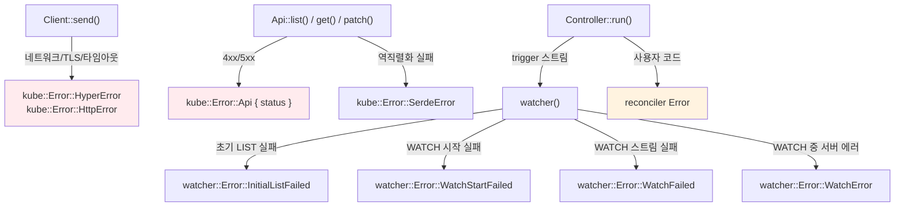

| 계층 | 에러 타입 | 원인 |
|------|----------|------|
| Client | `HyperError`, `HttpError` | 네트워크, TLS, 타임아웃 |
| Api | `Api(Status)` | Kubernetes 4xx/5xx 응답 |
| Api | `SerdeError` | JSON deserialization 실패 |
| watcher | `InitialListFailed` | 초기 LIST 실패 |
| watcher | `WatchStartFailed` | WATCH 연결 실패 |
| watcher | `WatchFailed` | WATCH 스트림 중간 실패 |
| watcher | `WatchError` | WATCH 중 서버 에러 (410 Gone 등) |
| Controller | reconciler Error | 사용자 코드에서 발생 |

## Watcher 에러와 backoff

Watcher 에러는 **soft error**입니다 — watcher는 모든 실패(403, 네트워크 문제 포함)에 대해 재시도합니다. 외부 환경이 개선되면 복구될 수 있기 때문입니다. 이런 에러를 **조용히(silently)** 무시해서는 안 됩니다.

핵심 요구사항은 watcher 스트림에 backoff를 붙이는 것입니다:

```rust
// ✗ backoff 없으면 에러 시 타이트 재시도 루프
let stream = watcher(api, wc);

// ✓ 지수 백오프로 자동 재시도
let stream = watcher(api, wc).default_backoff();
```

### default_backoff

`ExponentialBackoff`를 적용합니다: base 800ms, factor 2, max 30초, jitter 활성화. 성공적인 이벤트를 수신하면 backoff가 리셋됩니다.

### 커스텀 backoff

```rust
use backon::ExponentialBuilder;

let stream = watcher(api, wc).backoff(
    ExponentialBuilder::default()
        .with_min_delay(Duration::from_millis(500))
        .with_max_delay(Duration::from_secs(30)),
);
```

## Reconciler 에러와 error_policy

### 에러 타입 정의

`Controller::run`은 에러 타입에 `std::error::Error + Send + 'static`을 요구합니다. 최신 `anyhow` (1.0.65+)는 이 bound를 만족하지만, `finalizer::Error` 래퍼와의 호환성 문제가 있고 `error_policy`에서 에러 타입을 구분할 수 없게 됩니다. `thiserror`로 구체적인 에러 타입을 정의합니다:

```rust
#[derive(Debug, thiserror::Error)]
enum Error {
    #[error("Kubernetes API error: {0}")]
    KubeApi(#[from] kube::Error),

    #[error("Missing spec field: {0}")]
    MissingField(String),

    #[error("External service error: {0}")]
    External(String),
}
```

### error_policy

reconciler가 `Err`를 반환하면 `error_policy`가 호출되어 다음 동작을 결정합니다:

```rust
fn error_policy(obj: Arc<MyResource>, err: &Error, ctx: Arc<Context>) -> Action {
    tracing::error!(?err, "reconcile failed");

    match err {
        // 일시적 에러: 재시도
        Error::KubeApi(_) => Action::requeue(Duration::from_secs(5)),
        // 영구적 에러: 재시도하지 않음
        Error::MissingField(_) => Action::await_change(),
    }
}
```

일시적 에러와 영구적 에러를 구분할 수 있습니다:

| 유형 | 예시 | 처리 |
|------|------|------|
| 일시적 | 네트워크 에러, 타임아웃, 429 | `error_policy`에서 requeue |
| 영구적 | 잘못된 spec, 설정 오류 | status에 condition 기록 + `Action::await_change()` |

### 현재 한계

- `error_policy`는 **동기 함수**입니다. async 작업(메트릭 전송, status 업데이트 등)을 할 수 없습니다
- 성공 시 reset 콜백이 없습니다. per-key backoff를 구현하려면 reconciler를 wrapper로 감싸야 합니다 ([Per-key backoff 패턴](./reconciler.md#per-key-backoff-패턴) 참고)

## Client 레벨 재시도

기본적으로 kube-client는 일반 API 호출을 재시도하지 않습니다. `create()`, `patch()`, `get()` 등이 실패하면 그대로 에러를 반환합니다.

버전 3부터 kube는 내장 [`RetryPolicy`](https://docs.rs/kube/latest/kube/client/retry/struct.RetryPolicy.html)를 제공합니다. Tower의 retry 미들웨어를 구현하며, 429, 503, 504에 대해 지수 백오프로 재시도합니다:

```rust
use kube::client::retry::RetryPolicy;
use tower::{ServiceBuilder, retry::RetryLayer, buffer::BufferLayer};

let service = ServiceBuilder::new()
    .layer(config.base_uri_layer())
    .option_layer(config.auth_layer()?)
    .layer(BufferLayer::new(1024))
    .layer(RetryLayer::new(RetryPolicy::default()))
    // ...
```

`RetryPolicy`는 **429**, **503**, **504** 응답에 대해서만 재시도합니다. 네트워크 에러나 다른 5xx 코드는 재시도하지 않습니다.

### 계층별 재시도 전략

아래 표는 에러별 처리 위치를 정리합니다. `RetryPolicy`는 client 계층만 담당하며, 다른 에러는 다른 계층에서 처리해야 합니다:

| 에러 | 재시도 | 처리 위치 |
|------|--------|-----------|
| 429, 503, 504 | 가능 | Client 계층: `RetryPolicy` (설정 시) |
| 기타 5xx | 상황에 따라 | Reconciler: `error_policy` 또는 커스텀 Tower 미들웨어 |
| 타임아웃 / 네트워크 | 가능 | Reconciler: `error_policy` requeue, 또는 watcher: backoff |
| 4xx (400, 403, 404) | 불가 | 요청 또는 RBAC 수정 필요 |
| 409 Conflict | 상황에 따라 | SSA: field manager 충돌. Non-SSA: resourceVersion 충돌 |

## 타임아웃 전략

reconciler 내부에서 느린 API 호출을 방어하려면 `tokio::time::timeout`으로 개별 호출을 감쌉니다:

```rust
// 첫 번째 ?는 timeout Result<T, Elapsed>를 풀고
// 두 번째 ?는 API Result<Pod, kube::Error>를 풉니다
let pod = tokio::time::timeout(
    Duration::from_secs(10),
    api.get("my-pod"),
).await??;
```

Controller 컨텍스트에서 스트림 타임아웃은 watcher 내부의 타임아웃과 스트림 backoff 파라미터, `watcher::Config`에 의존합니다. 보통 reconciler 내부의 개별 API 호출만 짧은 타임아웃이 필요합니다.


---

# 제네릭 컨트롤러

하나의 reconciler 로직을 여러 리소스 타입에 재사용하거나, 런타임에 타입이 결정되는 리소스를 다루는 패턴을 다룹니다.

## PartialObjectMeta 기반 제네릭 reconciler

모든 리소스에 대해 메타데이터만 처리하는 경우(라벨 동기화, annotation 기반 로직 등), `PartialObjectMeta<K>`로 제네릭 reconciler를 작성합니다.

```rust title="kube-core/src/metadata.rs (단순화)"
pub struct PartialObjectMeta<K = DynamicObject> {
    pub types: Option<TypeMeta>,
    pub metadata: ObjectMeta,
    pub _phantom: PhantomData<K>,
}
```

`PartialObjectMeta<K>`는 `Resource` trait을 구현하며, `K`의 group, version, kind 정보를 사용합니다. 실제 spec과 status는 포함하지 않습니다.

### metadata_watcher와 조합

```rust
use kube::runtime::watcher::metadata_watcher;
use kube::core::PartialObjectMeta;
use kube::runtime::Controller;

// PartialObjectMeta<MyResource>를 다루는 Controller
let (reader, writer) = reflector::store();
let stream = reflector(writer, metadata_watcher(api, wc))
    .applied_objects();

Controller::for_stream(stream, reader)
    .run(reconcile_metadata, error_policy, ctx)
```

reconciler는 `Arc<PartialObjectMeta<K>>`를 받습니다:

```rust
async fn reconcile_metadata(
    obj: Arc<PartialObjectMeta<MyResource>>,
    ctx: Arc<Context>,
) -> Result<Action, Error> {
    let name = obj.metadata.name.as_deref().unwrap_or_default();
    let labels = obj.metadata.labels.as_ref();

    // 메타데이터 기반 로직
    Ok(Action::await_change())
}
```

:::tip[메모리 절약]
`PartialObjectMeta`는 spec과 status를 deserialization하지 않으므로, 대규모 리소스를 watch할 때 메모리를 크게 절약합니다. **최적화 — metadata_watcher**에서 자세히 다룹니다.
:::

## DynamicObject 기반 제네릭

컴파일 타임에 타입을 알 수 없거나, 런타임 설정으로 타입이 결정되는 경우 `DynamicObject`를 사용합니다.

```rust title="kube-core/src/dynamic.rs (단순화)"
pub struct DynamicObject {
    pub types: Option<TypeMeta>,
    pub metadata: ObjectMeta,
    pub data: serde_json::Value,
}
```

`DynamicObject`의 `Resource` trait 구현은 `DynamicType = ApiResource`입니다. 런타임에 `ApiResource`를 제공해야 합니다:

```rust
use kube::api::{Api, ApiResource, DynamicObject};
use kube::discovery;

// 런타임에 리소스 타입 결정
let ar = ApiResource::from_gvk(&GroupVersionKind {
    group: "example.com".into(),
    version: "v1".into(),
    kind: "Document".into(),
});
let api = Api::<DynamicObject>::all_with(client.clone(), &ar);

// 또는 discovery에서 가져오기
let (ar, _caps) = discovery::pinned_kind(&client, &gvk).await?;
let api = Api::<DynamicObject>::all_with(client, &ar);
```

### DynamicObject reconciler

```rust
async fn reconcile_dynamic(
    obj: Arc<DynamicObject>,
    ctx: Arc<Context>,
) -> Result<Action, Error> {
    let name = obj.metadata.name.as_deref().unwrap_or_default();

    // data 필드에서 JSON 값 접근
    let title = obj.data.get("spec")
        .and_then(|s| s.get("title"))
        .and_then(|t| t.as_str());

    // 강타입이 필요하면 try_parse
    // let typed: MyResource = obj.try_parse()?;

    Ok(Action::await_change())
}
```

:::warning[타입 안정성]
`DynamicObject`는 `serde_json::Value`로 데이터에 접근하므로 컴파일 타임 검증이 없습니다. 가능하면 정적 타입을 사용하고, 정말 필요한 경우에만 `DynamicObject`를 사용합니다.
:::

## 제네릭 Controller 함수

여러 리소스 타입에 같은 컨트롤러 로직을 적용하려면 제네릭 함수로 추상화합니다:

```rust
use kube::{Api, Client, Resource, ResourceExt};
use kube::runtime::{Controller, watcher, Config};
use std::fmt::Debug;

async fn run_controller<K>(
    client: Client,
    ctx: Arc<Context>,
) -> anyhow::Result<()>
where
    K: Resource<DynamicType = ()>
        + Clone + Debug
        + serde::de::DeserializeOwned
        + Send + Sync + 'static,
{
    let api = Api::<K>::all(client);
    Controller::new(api, watcher::Config::default())
        .shutdown_on_signal()
        .run(reconcile::<K>, error_policy::<K>, ctx)
        .for_each(|res| async move {
            match res {
                Ok(obj) => tracing::info!(?obj, "reconciled"),
                Err(err) => tracing::error!(%err, "reconcile failed"),
            }
        })
        .await;
    Ok(())
}

async fn reconcile<K: Resource<DynamicType = ()>>(
    obj: Arc<K>,
    ctx: Arc<Context>,
) -> Result<Action, Error> {
    let name = obj.meta().name.as_deref().unwrap_or_default();
    // 공통 reconcile 로직
    Ok(Action::await_change())
}
```

`K: Resource<DynamicType = ()>` 바운드는 정적 타입(CRD, k8s-openapi 타입)을 의미합니다. `DynamicObject`를 사용하려면 `DynamicType = ApiResource`로 바운드를 변경하고 `ApiResource`를 전달해야 합니다.

## 여러 Controller 동시 실행

하나의 바이너리에서 여러 Controller를 동시에 실행하는 것은 흔한 패턴입니다.

### tokio::join!

모든 Controller가 완료될 때까지 대기합니다. 하나가 종료되면 나머지는 계속 실행됩니다:

```rust
let ctrl_a = Controller::new(api_a, wc.clone())
    .shutdown_on_signal()
    .run(reconcile_a, error_policy, ctx.clone())
    .for_each(|_| async {});

let ctrl_b = Controller::new(api_b, wc.clone())
    .shutdown_on_signal()
    .run(reconcile_b, error_policy, ctx.clone())
    .for_each(|_| async {});

// 둘 다 실행
tokio::join!(ctrl_a, ctrl_b);
```

### tokio::select!

먼저 종료되는 Controller가 있으면 전체를 중단합니다:

```rust
tokio::select! {
    _ = ctrl_a => tracing::warn!("controller A exited"),
    _ = ctrl_b => tracing::warn!("controller B exited"),
}
```

| 패턴 | 하나 종료 시 | 사용 시점 |
|------|------------|----------|
| `join!` | 나머지 계속 실행 | 독립적인 Controller |
| `select!` | 전부 중단 | 함께 실행되어야 하는 Controller |

:::tip[shutdown_on_signal과 함께]
`shutdown_on_signal()`을 각 Controller에 설정하면 SIGTERM 시 모든 Controller가 graceful하게 종료됩니다. `join!`과 함께 사용하면 모든 Controller의 graceful shutdown이 완료된 후 프로세스가 종료됩니다.
:::

## 공유 리소스

### Client clone

`kube::Client`는 내부적으로 `Arc`로 래핑되어 있어 `clone()`이 저렴합니다. 여러 Controller가 같은 Client를 공유합니다:

```rust
let client = Client::try_default().await?;

// clone은 Arc::clone과 동일 — 저렴
let api_a = Api::<ResourceA>::all(client.clone());
let api_b = Api::<ResourceB>::all(client.clone());
```

### 공유 Reflector

여러 Controller가 같은 리소스를 watch하면 watch 연결이 중복됩니다. shared reflector로 하나의 watch를 여러 Controller가 공유할 수 있습니다:

```rust
use kube::runtime::{reflector, watcher, WatchStreamExt, Controller};

// shared store 생성
let (reader, writer) = reflector::store_shared(1024);
let stream = watcher(api, wc)
    .default_backoff()
    .reflect_shared(writer);

// subscriber로 각 Controller에 분기
let sub_a = reader.subscribe().unwrap();
let sub_b = reader.subscribe().unwrap();

let ctrl_a = Controller::for_shared_stream(sub_a, reader.clone())
    .run(reconcile_a, error_policy, ctx.clone())
    .for_each(|_| async {});

let ctrl_b = Controller::for_shared_stream(sub_b, reader.clone())
    .run(reconcile_b, error_policy, ctx.clone())
    .for_each(|_| async {});

// 원본 스트림 소비 + 두 Controller 동시 실행
tokio::join!(stream.for_each(|_| async {}), ctrl_a, ctrl_b);
```

`owns`/`watches`도 shared 스트림을 지원합니다. `owns_shared_stream()`으로 자식 리소스의 watch도 공유할 수 있습니다.

:::warning[Unstable feature]
shared reflector API를 쓰려면 `unstable-runtime-stream-control` feature flag가 필요합니다:

```toml
kube = { version = "3.0.1", features = ["unstable-runtime-stream-control"] }
```
:::

API 서버 부하를 줄이는 다른 방법은 **최적화 — API 서버 부하**를 참고합니다.


---

# 트러블슈팅

컨트롤러 운영 중 자주 발생하는 문제를 증상별로 정리합니다. 각 항목에서 관련 상세 문서로 링크합니다.

## 증상별 진단 테이블

### Reconciler 무한 루프

**증상**: reconcile 호출 횟수가 끝없이 증가하고, CPU 사용량이 높습니다.

| 원인 | 확인 방법 | 해결책 |
|------|----------|--------|
| status에 비결정론적 값 쓰기 (타임스탬프 등) | `RUST_LOG=kube=debug`로 매 reconcile마다 patch 발생 확인 | 결정론적 값만 사용하거나 변경 없으면 patch 건너뛰기 |
| predicate_filter 미적용 | reconcile 로그에서 status-only 변경도 trigger되는지 확인 | `predicate_filter(predicates::generation, Default::default())` 적용 |
| 다른 컨트롤러와 경쟁 (annotation 핑퐁) | `kubectl get -w`로 resourceVersion 변경 패턴 확인 | SSA로 필드 소유권 분리 |

자세한 내용: [Reconciler 패턴 — 무한 루프](./reconciler.md#무한-루프-패턴)

### 메모리 지속 증가

**증상**: 예상보다 높은 Pod 메모리 사용량.

| 원인 | 확인 방법 | 해결책 |
|------|----------|--------|
| 초기 list 할당 | 시작 직후 높은 기본 메모리 | `streaming_lists()` 사용, 그리고/또는 `page_size` 축소 |
| Store 캐시에 큰 객체 | jemalloc 프로파일링으로 Store 크기 확인 | `.modify()`로 managedFields 등 제거, 그리고/또는 `metadata_watcher()` |
| watch 범위가 너무 넓음 | Store의 `state().len()`으로 캐시 객체 수 확인 | label/field selector로 범위 축소 |

자세한 내용: **최적화 — Reflector 최적화**, **최적화 — re-list 메모리 스파이크**

### Watch 연결 끊김 복구 안 됨

**증상**: 컨트롤러가 이벤트를 받지 못하고 멈춘 것처럼 보입니다.

| 원인 | 확인 방법 | 해결책 |
|------|----------|--------|
| 410 Gone + bookmark 미설정 | 로그에서 `WatchError` 410 확인 | watcher가 `default_backoff()`로 자동 re-list |
| credential 만료 | 로그에서 401/403 에러 확인 | `Config::infer()`로 자동 갱신되는지 확인, exec plugin 설정 점검 |
| RBAC / NetworkPolicies | 로그에서 403 Forbidden 확인 | ClusterRole에 watch/list 권한 추가, NetworkPolicy가 API 서버 egress를 허용하는지 확인 |
| backoff 미설정 | 첫 에러에 스트림 종료 | `.default_backoff()` 반드시 사용 |

자세한 내용: **Watcher state machine**, [에러 처리와 Backoff — Watcher 에러](./error-handling-and-backoff.md#watcher-에러와-backoff)

### API 서버 Throttling (429)

**증상**: 로그에 `429 Too Many Requests` 에러가 빈번합니다.

| 원인 | 확인 방법 | 해결책 |
|------|----------|--------|
| 동시 reconcile 과다 | 메트릭에서 active reconcile 수 확인 | `Config::concurrency(N)` 설정 (기본값은 무제한) |
| watch 연결 과다 | `owns()`, `watches()` 수 확인 | shared reflector로 watch 공유 |
| reconciler 내 API 호출 과다 | tracing span에서 HTTP 요청 수 확인 | Store 캐시 활용, 가능하면 배치 처리 |

자세한 내용: **최적화 — Reconciler 최적화**, **최적화 — API 서버 부하**

### Finalizer 교착 (영구 Terminating)

**증상**: 리소스가 `Terminating` 상태에서 영구히 멈춥니다.

| 원인 | 확인 방법 | 해결책 |
|------|----------|--------|
| cleanup 함수 실패 | 로그에서 cleanup 에러 확인, `error_policy` 메트릭으로 모니터링 | cleanup이 최종적으로 성공하도록 설계 (외부 리소스 없으면 성공 처리) |
| predicate_filter가 finalizer 이벤트 차단 | `predicates::generation`만 사용 시 | `predicates::generation.combine(predicates::finalizers)`에 `Default::default()` config |
| 컨트롤러가 다운 | Pod 상태 확인 | 컨트롤러 복구 후 자동 처리됨 |

긴급 해제: `kubectl patch <resource> -p '{"metadata":{"finalizers":null}}' --type=merge` (cleanup 건너뜀)

자세한 내용: [관계와 Finalizer — 주의사항](./relations-and-finalizers.md#주의사항)

### Reconciler가 실행되지 않음

**증상**: 리소스가 변경되어도 reconciler 로그가 출력되지 않습니다.

| 원인 | 확인 방법 | 해결책 |
|------|----------|--------|
| Store가 아직 초기화되지 않음 (advanced; streams 인터페이스 사용 시) | readiness probe 실패 | `wait_until_ready()` 이후에 동작 확인 |
| predicate_filter가 모든 이벤트 차단 | predicate 로직 확인 | predicate 조합 수정 또는 일시 제거 후 테스트 |
| RBAC 권한 부족 | 로그에서 403 Forbidden 확인 | ClusterRole에 watch/list 권한 추가 |
| NetworkPolicies가 API 서버 접근 차단 | 로그에서 연결 타임아웃 확인 | NetworkPolicy가 API 서버 egress를 허용하는지 확인 |
| watcher Config의 selector가 너무 좁음 | `kubectl get -l <selector>`로 매칭 확인 | selector 수정 |

## 디버깅 도구

### RUST_LOG 설정

```bash
# 기본 디버깅: kube 내부 + 컨트롤러 로직
RUST_LOG=kube=debug,my_controller=debug

# watch 이벤트 개별 확인 (매우 상세)
RUST_LOG=kube=trace

# HTTP 요청 레벨 확인
RUST_LOG=kube=debug,tower_http=debug

# 노이즈 억제
RUST_LOG=kube=warn,hyper=warn,my_controller=info
```

### tracing span 활용

Controller가 자동 생성하는 span에서 `object.ref`와 `object.reason`을 확인합니다. JSON 로깅을 활성화하면 구조화된 검색이 가능합니다.

```bash
# 특정 리소스의 reconcile 로그만 필터
cat logs.json | jq 'select(.span."object.ref" | contains("my-resource-name"))'
```

자세한 내용: **모니터링 — 구조화된 로깅**

### kubectl로 상태 확인

```bash
# 리소스 상태와 이벤트 확인
kubectl describe myresource <name>

# watch 모드로 실시간 변경 추적
kubectl get myresource -w

# resourceVersion 변경 패턴 확인 (무한 루프 진단)
kubectl get myresource <name> -o jsonpath='{.metadata.resourceVersion}' -w

# finalizer 상태 확인
kubectl get myresource <name> -o jsonpath='{.metadata.finalizers}'
```

## 프로파일링

### 메모리 프로파일링 (jemalloc)

```toml
[dependencies]
tikv-jemallocator = { version = "*", features = ["profiling"] }
```

```rust
#[global_allocator]
static ALLOC: tikv_jemallocator::Jemalloc = tikv_jemallocator::Jemalloc;
```

```bash
# 힙 프로파일링 활성화
MALLOC_CONF="prof:true,prof_active:true,lg_prof_interval:30" ./my-controller

# 프로파일 덤프 분석
jeprof --svg ./my-controller jeprof.*.heap > heap.svg
```

Store 캐시가 주요 메모리 소비원인 경우가 많습니다. 프로파일에서 `AHashMap` 관련 할당이 크면 `.modify()`로 큰 필드를 제거하거나 `metadata_watcher()`를 적용합니다.

### 비동기 런타임 프로파일링 (tokio-console)

reconciler가 느린 원인이 async 태스크 스케줄링에 있는지 확인합니다.

```toml
[dependencies]
console-subscriber = "*"
```

```rust
// main 함수 최상단에 추가
console_subscriber::init();
```

```bash
# tokio-console 클라이언트로 연결
tokio-console http://localhost:6669
```

태스크별 poll 시간, waker 횟수, 대기 시간을 실시간으로 확인할 수 있습니다. reconciler 태스크가 오래 blocked되어 있다면 내부의 동기 연산이나 느린 API 호출이 원인일 수 있습니다.

TUI 없이 경량 런타임 메트릭만 필요하다면 [tokio-metrics](https://github.com/tokio-rs/tokio-metrics)를 사용하면 Prometheus로 export할 수 있습니다.


---

# Production

kube 기반 컨트롤러를 프로덕션에 배포할 때 필요한 관측 가능성, 테스트 전략, 성능 최적화, 보안, 가용성, 검증을 다룹니다.

## 이 섹션에서 다루는 것

| 문서 | 핵심 질문 |
|------|----------|
| [모니터링](./observability.md) | 로깅, 트레이싱, 메트릭을 어떻게 설정하는가? |
| [테스트](./testing.md) | 단위 테스트부터 E2E까지 어떻게 구성하는가? |
| [최적화](./optimization.md) | 대규모 클러스터에서 어떻게 효율적으로 동작시키는가? |
| [보안](./security.md) | RBAC, 컨테이너 보안, 네트워크 정책을 어떻게 구성하는가? |
| [가용성](./availability.md) | 단일 인스턴스 운영, leader election, graceful shutdown은? |
| [Admission 검증](./admission.md) | CEL 검증, Webhook, 정책 프레임워크를 어떻게 적용하는가? |


---

# 모니터링

kube 기반 컨트롤러의 관측 가능성을 확보하는 세 가지 축인 구조화된 로깅, 분산 트레이싱, 메트릭을 다룹니다.

## 구조화된 로깅

kube-rs는 `tracing` 크레이트를 사용합니다. `tracing-subscriber`로 출력 형식과 필터를 설정합니다.

```rust
tracing_subscriber::fmt()
    .with_env_filter("kube=info,my_controller=debug")
    .json() // 구조화된 JSON 로깅
    .init();
```

### Controller가 자동 추가하는 span

Controller는 reconcile 호출마다 tracing span을 자동으로 생성합니다. span에는 다음 정보가 포함됩니다:

| 필드 | 내용 |
|------|------|
| `object.ref` | `ObjectRef` (이름과 네임스페이스 포함) |
| `object.reason` | `ReconcileReason` (object updated, reconciler requested retry 등) |

reconciler 안에서 `tracing::info!()` 등을 호출하면 이 span 컨텍스트가 자동으로 포함됩니다.

### RUST_LOG 필터링

```bash
# kube 내부 HTTP 요청 로깅
RUST_LOG=kube=debug,my_controller=info

# watch 이벤트 개별 로깅 (매우 상세)
RUST_LOG=kube=trace

# HTTP 레벨 노이즈 억제
RUST_LOG=kube=info,hyper=warn,tower=warn
```

프로덕션에서는 `kube=warn` 이상으로 설정하고, 컨트롤러 로직만 `info` 또는 `debug`로 열어두는 것이 일반적입니다.

## 분산 트레이싱

OpenTelemetry와 OTLP exporter를 연결하면 reconcile 호출을 분산 트레이싱 시스템(Jaeger, Tempo 등)에서 시각화할 수 있습니다.

```rust
use tracing_subscriber::layer::SubscriberExt;
use opentelemetry_otlp::SpanExporter;

let tracer = opentelemetry_otlp::new_pipeline()
    .tracing()
    .with_exporter(SpanExporter::builder().with_tonic().build()?)
    .install_batch(opentelemetry_sdk::runtime::Tokio)?;

let telemetry = tracing_opentelemetry::layer().with_tracer(tracer);

tracing_subscriber::registry()
    .with(telemetry)
    .with(tracing_subscriber::fmt::layer())
    .init();
```

### Client의 TraceLayer

**Client 내부 구조**에서 다룬 것처럼, Tower 스택의 최상위에 `TraceLayer`가 있습니다. 모든 HTTP 요청에 자동으로 span이 추가됩니다.

span에 포함되는 정보:

- HTTP method (GET, PATCH 등)
- URL path
- 응답 상태 코드
- 요청 소요 시간

reconciler span 하위에 이 HTTP span들이 연결되므로, 하나의 reconcile 호출에서 어떤 API 요청이 발생했는지 트레이싱 UI에서 직접 확인할 수 있습니다.

### #[instrument] 매크로 사용

reconciler에 `#[instrument]`를 적용하면 함수 인자와 커스텀 필드를 span에 자동으로 추가할 수 있습니다:

```rust
use tracing::instrument;

#[instrument(skip(ctx), fields(trace_id))]
async fn reconcile(obj: Arc<MyResource>, ctx: Arc<Context>) -> Result<Action, Error> {
    // OpenTelemetry trace_id를 현재 span에 기록
    Span::current().record(
        "trace_id",
        &tracing::field::display(
            opentelemetry::trace::TraceContextExt::current_with_context()
        ),
    );

    // 이후 tracing::info!() 등에 trace_id가 자동 포함
    tracing::info!("reconciling");
    // ...
    Ok(Action::requeue(Duration::from_secs(300)))
}
```

`tracing-subscriber`에서 JSON 포매터를 사용하면 `trace_id` 필드가 구조화된 로그에 포함되어, 로그 시스템(Loki, CloudWatch 등)에서 trace_id로 관련 로그를 한 번에 검색할 수 있습니다.

## 메트릭

Controller 스트림의 결과를 소비하면서 메트릭을 수집합니다.

### 권장 메트릭

| 메트릭 | 타입 | 설명 |
|--------|------|------|
| `reconcile_total` | Counter | 총 reconcile 횟수 (성공/실패 라벨) |
| `reconcile_duration_seconds` | Histogram | reconcile 소요 시간 |
| `reconcile_errors_total` | Counter | 에러 횟수 (에러 타입별 라벨) |
| `reconcile_queue_depth` | Gauge | scheduler에 대기 중인 항목 수 |

### 수집 패턴

```rust
let metrics = ctx.metrics.clone();
Controller::new(api, wc)
    .run(reconcile, error_policy, ctx)
    .for_each(|result| {
        let metrics = metrics.clone();
        async move {
            match result {
                Ok((obj_ref, _action)) => {
                    metrics.reconcile_success.inc();
                }
                Err(err) => {
                    metrics.reconcile_errors.inc();
                }
            }
        }
    })
    .await;
```

reconcile 소요 시간을 측정하려면 reconciler 함수 내부에서 직접 측정합니다:

```rust
async fn reconcile(obj: Arc<MyResource>, ctx: Arc<Context>) -> Result<Action, Error> {
    let start = std::time::Instant::now();
    let result = reconcile_inner(&obj, &ctx).await;
    ctx.metrics.reconcile_duration.observe(start.elapsed().as_secs_f64());
    result
}
```

### 메트릭 노출

별도 HTTP 서버로 `/metrics` 엔드포인트를 노출합니다. `prometheus` 또는 `metrics` + `metrics-exporter-prometheus` 크레이트를 사용합니다.

```rust
use axum::{routing::get, Router};
use prometheus::TextEncoder;

async fn metrics_handler() -> String {
    let encoder = TextEncoder::new();
    let metric_families = prometheus::gather();
    encoder.encode_to_string(&metric_families).unwrap()
}

let app = Router::new().route("/metrics", get(metrics_handler));
```

## Health check

컨트롤러의 readiness와 liveness를 Kubernetes probe로 노출합니다.

### Readiness

**Reflector와 Store**에서 다룬 것처럼, Store는 생성 시 비어있고 watcher 스트림이 poll되어야 채워집니다. readiness probe는 Store가 initial list 로드를 완료했는지 확인합니다.

```rust
let (reader, writer) = reflector::store();

// reader를 health 서버에 전달
let health_reader = reader.clone();
tokio::spawn(async move {
    let app = Router::new()
        .route("/readyz", get(move || async move {
            match health_reader.wait_until_ready().await {
                Ok(()) => (StatusCode::OK, "ready"),
                Err(_) => (StatusCode::SERVICE_UNAVAILABLE, "not ready"),
            }
        }));
    let listener = tokio::net::TcpListener::bind("0.0.0.0:8080").await.unwrap();
    axum::serve(listener, app).await.unwrap();
});
```

### Liveness

reconcile 루프가 살아있는지 확인합니다. 마지막 성공 reconcile 시간을 추적하고, 일정 시간을 초과하면 unhealthy로 판단합니다.

```rust
use std::sync::atomic::{AtomicI64, Ordering};

struct Context {
    client: Client,
    last_reconcile: AtomicI64, // Unix timestamp
}

async fn reconcile(obj: Arc<MyResource>, ctx: Arc<Context>) -> Result<Action, Error> {
    // reconcile 로직...
    ctx.last_reconcile.store(
        jiff::Timestamp::now().as_second(),
        Ordering::Relaxed,
    );
    Ok(Action::requeue(Duration::from_secs(300)))
}
```

liveness 엔드포인트에서는 마지막 reconcile 이후 경과 시간이 임계값을 초과하면 503을 반환합니다.

### 실행 구조

health 서버와 메트릭 서버를 Controller와 함께 실행합니다:

```rust
// health + metrics 서버
tokio::spawn(health_and_metrics_server(reader.clone()));

// Controller 실행
Controller::new(api, wc)
    .run(reconcile, error_policy, ctx)
    .for_each(|res| async move {
        match res {
            Ok(o) => tracing::info!("reconciled {:?}", o),
            Err(e) => tracing::error!("reconcile error: {:?}", e),
        }
    })
    .await;
```

`tokio::spawn`으로 HTTP 서버를 별도 태스크로 실행하고, Controller는 메인 태스크에서 실행하는 것이 일반적인 패턴입니다.


---

# 테스트

컨트롤러를 어떻게 테스트하는지, 단위 테스트부터 실제 클러스터를 사용하는 E2E까지 단계별로 다룹니다.

## 단위 테스트

상태 계산 로직과 API 호출을 분리해두면, API 호출 없이 로직만 단위 테스트할 수 있습니다.

```rust
// 로직만 분리
fn desired_configmap(obj: &MyResource) -> ConfigMap {
    ConfigMap {
        metadata: ObjectMeta {
            name: Some(format!("{}-config", obj.name_any())),
            namespace: obj.namespace(),
            owner_references: Some(vec![obj.controller_owner_ref(&()).unwrap()]),
            ..Default::default()
        },
        data: Some(BTreeMap::from([
            ("key".into(), obj.spec.value.clone()),
        ])),
        ..Default::default()
    }
}

#[test]
fn test_desired_configmap_name() {
    let obj = MyResource::new("test", MySpec { value: "hello".into() });
    let cm = desired_configmap(&obj);
    assert_eq!(cm.metadata.name.unwrap(), "test-config");
}

#[test]
fn test_desired_configmap_owner_ref() {
    let obj = MyResource::new("test", MySpec { value: "hello".into() });
    let cm = desired_configmap(&obj);
    let refs = cm.metadata.owner_references.unwrap();
    assert_eq!(refs.len(), 1);
    assert_eq!(refs[0].kind, "MyResource");
}
```

상태 결정 로직(어떤 ConfigMap을 만들어야 하는지), 에러 분류 로직(일시적 vs 영구적), 조건 판단 로직(reconcile이 필요한지) 등을 단위 테스트로 검증합니다.

## Mock 테스트 — tower-test

`tower_test::mock::pair()`로 가짜 HTTP 레이어를 만들어 Client에 주입합니다. 실제 Kubernetes 클러스터 없이 API 호출 시나리오를 테스트합니다.

### ApiServerVerifier 패턴

```rust
use tower_test::mock;
use kube::Client;
use http::{Request, Response};
use hyper::Body;

#[tokio::test]
async fn test_reconcile_creates_configmap() {
    let (mock_service, handle) = mock::pair::<Request<Body>, Response<Body>>();
    let mock_client = Client::new(mock_service, "default");

    // API 서버 역할을 하는 태스크
    let api_server = tokio::spawn(async move {
        // 첫 번째 요청: GET ConfigMap (404 → 없으므로 생성해야 함)
        let (request, send_response) = handle.next_request().await.unwrap();
        assert!(request.uri().path().contains("/configmaps/test-config"));
        send_response.send_response(
            Response::builder()
                .status(404)
                .body(Body::from(serde_json::to_vec(
                    &not_found_status() // 테스트 헬퍼 — 404 Status 객체 생성
                ).unwrap()))
                .unwrap()
        );

        // 두 번째 요청: PATCH ConfigMap (생성)
        let (request, send_response) = handle.next_request().await.unwrap();
        assert_eq!(request.method(), http::Method::PATCH);
        send_response.send_response(
            Response::new(Body::from(serde_json::to_vec(
                &configmap() // 테스트 헬퍼 — 예상 ConfigMap 객체 생성
            ).unwrap()))
        );
    });

    let ctx = Arc::new(Context { client: mock_client });
    let obj = Arc::new(test_resource()); // 테스트 헬퍼 — MyResource 테스트 객체 생성
    let result = reconcile(obj, ctx).await;
    assert!(result.is_ok());

    api_server.await.unwrap();
}
```

### 한계

| 한계 | 설명 |
|------|------|
| 순서 의존 | 요청 순서를 정확히 맞춰야 합니다. 순서가 바뀌면 테스트가 실패합니다 |
| 설정 장황 | 다중 요청 시나리오에서 mock 설정 코드가 길어집니다 |
| watcher mock | watcher 스트림을 mock하려면 추가 설정이 필요합니다 |

mock 테스트는 reconciler가 올바른 API 호출을 하는지 검증할 때 유용합니다. 하지만 복잡한 시나리오에서는 통합 테스트가 더 적합합니다.

## 통합 테스트 — k3d

실제 Kubernetes 클러스터에서 컨트롤러를 실행하고 결과를 검증합니다. [k3d](https://k3d.io)는 가벼운 Kubernetes 클러스터를 로컬에서 실행합니다.

### 클러스터 준비

```bash
# k3d 클러스터 생성 (로드밸런서 불필요)
k3d cluster create test --no-lb

# CRD 등록
kubectl apply -f manifests/crd.yaml
```

### 테스트 코드

```rust
use kube::runtime::wait::await_condition;

#[tokio::test]
#[ignore] // CI에서만 실행
async fn test_reconcile_creates_resources() {
    let client = Client::try_default().await.unwrap();
    let api = Api::<MyResource>::namespaced(client.clone(), "default");

    // 리소스 생성
    api.create(&PostParams::default(), &test_resource()).await.unwrap();

    // 상태 수렴 대기
    let cond = await_condition(api.clone(), "test", |obj: Option<&MyResource>| {
        obj.and_then(|o| o.status.as_ref())
           .map(|s| s.phase == "Ready")
           .unwrap_or(false)
    });
    tokio::time::timeout(Duration::from_secs(30), cond)
        .await
        .expect("timeout waiting for Ready")
        .expect("watch error");

    // 자식 리소스 확인
    let cm_api = Api::<ConfigMap>::namespaced(client, "default");
    let cm = cm_api.get("test-config").await.expect("ConfigMap not found");
    assert_eq!(cm.data.unwrap()["key"], "expected-value");

    // 정리
    api.delete("test", &DeleteParams::default()).await.unwrap();
}
```

`await_condition()`은 watch 스트림을 열고 조건이 만족될 때까지 대기합니다. `tokio::time::timeout()`으로 감싸서 무한 대기를 방지합니다.

### CI 설정 (GitHub Actions)

```yaml title=".github/workflows/integration.yml"
jobs:
  integration:
    runs-on: ubuntu-latest
    steps:
      - uses: actions/checkout@v4
      - uses: AbsaOSS/k3d-action@v2
        with:
          cluster-name: test
      - run: kubectl apply -f manifests/crd.yaml
      - run: cargo test --test integration -- --ignored
```

## E2E 테스트

컨트롤러를 Docker 이미지로 빌드하고 실제로 배포한 뒤 동작을 검증합니다. 통합 테스트와 달리 컨트롤러가 프로세스 내부가 아닌 Pod로 실행됩니다.

```bash
# 1. 이미지 빌드
docker build -t my-controller:test .

# 2. k3d 클러스터에 이미지 로드
k3d image import my-controller:test -c test

# 3. 컨트롤러 배포
kubectl apply -f manifests/deployment.yaml

# 4. 컨트롤러 준비 대기
kubectl wait --for=condition=available deployment/my-controller --timeout=60s

# 5. 테스트 리소스 적용
kubectl apply -f test-fixtures/

# 6. 상태 수렴 확인
kubectl wait --for=jsonpath='.status.phase'=Ready myresource/test --timeout=60s
```

E2E 테스트는 RBAC, 리소스 제한, health probe, graceful shutdown 등 배포 환경에서만 검증 가능한 항목을 확인합니다.

## 비교 정리

| 단계 | 속도 | 필요 환경 | 검증 범위 |
|------|------|----------|----------|
| 단위 | 밀리초 | 없음 | 상태 계산 로직 |
| Mock | 초 | 없음 | API 호출 시나리오 |
| 통합 | 분 | k3d | reconcile 흐름, CRD 등록 |
| E2E | 분 | k3d + Docker | RBAC, 배포, 전체 시스템 |

단위 테스트를 가장 많이 작성하고, mock과 통합 테스트로 핵심 시나리오를 검증하며, E2E는 배포 파이프라인에서만 실행하는 피라미드 구조가 일반적입니다.


---

# 최적화

대규모 클러스터에서 컨트롤러가 효율적으로 동작하도록 각 레이어별 최적화 방법을 다룹니다.

## 최적화 순서

성능 문제가 발생했을 때 어디서부터 시작해야 하는지 우선순위입니다. 위에서 아래로, 효과가 크고 부작용이 적은 순서입니다.

| 순서 | 작업 | 효과 | 위험도 |
|------|------|------|--------|
| 1 | **진단** — 실제 병목 확인 | 방향 설정 | 없음 |
| 2 | **selector 축소** — label/field selector 추가 | API 서버 부하, 네트워크, 메모리 동시 감소 | 낮음 |
| 3 | **predicate_filter** — 불필요한 reconcile 제거 | reconcile 호출 횟수 감소 | 낮음 (predicate 조합 주의) |
| 4 | **metadata_watcher** — spec/status 수신 생략 | 메모리 사용량 감소 | 중간 (reconciler에서 전체 객체 필요 시 get 필요) |
| 5 | **reflector 정리** — `.modify()`로 불필요한 필드 제거 | Store 메모리 감소 | 낮음 |
| 6 | **reconciler 튜닝** — debounce, concurrency, 캐시 사용 | API 호출 감소, 처리량 조절 | 낮음 |
| 7 | **샤딩** — 네임스페이스/라벨 기반 분배 | 수평 확장 | 높음 (운영 복잡도 증가) |

**1단계 진단이 가장 중요합니다.** 메모리가 문제인지, reconcile 지연이 문제인지, API 서버 throttling이 문제인지에 따라 접근이 달라집니다. `RUST_LOG=kube=debug`로 로그를 확인하고, [모니터링](./observability.md)의 메트릭으로 reconcile 횟수와 소요 시간을 측정합니다. 메모리가 의심되면 jemalloc 프로파일링으로 Store 크기를 확인합니다. 증상별 진단은 **트러블슈팅**을 참고합니다.

## Watcher 최적화

### Watch 범위 축소

label selector와 field selector로 API 서버가 필터링하게 합니다. 네트워크 트래픽과 메모리를 모두 절약합니다.

```rust
use kube::runtime::watcher;

let wc = watcher::Config::default()
    .labels("app=myapp")                    // label selector
    .fields("metadata.name=specific-one");  // field selector
```

### metadata_watcher

spec과 status가 필요 없고 메타데이터만 필요한 경우 `metadata_watcher()`를 사용합니다. `PartialObjectMeta`만 수신하므로 메모리 사용량이 크게 줄어듭니다.

```rust
use kube::runtime::watcher::metadata_watcher;
use kube::core::PartialObjectMeta;

let stream = metadata_watcher(api, wc).default_backoff();
```

큰 spec을 가진 리소스(Secret, ConfigMap 등)에서 메모리 절감이 큽니다. 단, reconciler에서 전체 객체가 필요하면 별도 `get()` 호출이 필요합니다.

### StreamingList

**Watcher state machine**에서 다룬 StreamingList 전략을 사용하면 initial list 로드 시 메모리 피크를 낮출 수 있습니다.

```rust
let wc = watcher::Config::default().streaming_lists();
```

Kubernetes 1.27 이상이 필요합니다. LIST 대신 WATCH로 initial list을 스트리밍하므로 전체 목록을 한 번에 메모리에 올리지 않습니다.

### page_size 조절

기본 page_size는 500입니다 (client-go와 동일).

| 클러스터 규모 | 권장 | 이유 |
|-------------|------|------|
| 소규모 (수백 개) | 더 크게 (1000+) | API 호출 수 감소 |
| 대규모 (수만 개) | 더 작게 (100~300) | 메모리 피크 감소 |

```rust
let wc = watcher::Config::default().page_size(100);
```

## Reflector 최적화

### 불필요한 필드 제거

**Reflector와 Store**에 캐시되는 객체에서 불필요한 필드를 제거하면 메모리를 절약합니다.

```rust
use kube::runtime::WatchStreamExt;

let stream = watcher(api, wc)
    .default_backoff()
    .modify(|obj| {
        // managedFields 제거 — 상당한 메모리 절약
        obj.managed_fields_mut().clear();
        // last-applied-configuration annotation — SSA 이전 방식의 큰 annotation
        obj.annotations_mut()
            .remove("kubectl.kubernetes.io/last-applied-configuration");
    });
```

:::warning[modify는 Store에 저장되기 전에 적용됩니다]
`modify`로 제거한 필드는 reconciler에서도 접근할 수 없습니다. reconciler에서 필요한 필드는 제거하지 않도록 주의합니다.
:::

### 메모리 추정

Store에 캐시된 객체 수와 평균 크기로 메모리를 추정합니다:

| 항목 | 계산 |
|------|------|
| 기본 사용량 | 객체 수 x 평균 크기 |
| re-list 스파이크 | old store + new buffer + 스트림 버퍼 = 최대 2~3배 |

jemalloc과 `MALLOC_CONF="prof:true"`로 힙 프로파일링을 하면 실제 메모리 사용 패턴을 확인할 수 있습니다.

## Reconciler 최적화

### 불필요한 reconcile 방지

**Reconciler 패턴**에서 다룬 것처럼, status 변경으로 인한 자기 trigger를 방지합니다.

```rust
use kube::runtime::{predicates, watcher, WatchStreamExt};
use kube::runtime::utils::predicate::PredicateConfig;

// watcher 스트림에 predicate_filter를 적용한 후 Controller에 주입
let (reader, writer) = reflector::store();
let stream = reflector(writer, watcher(api.clone(), wc))
    .applied_objects()
    .predicate_filter(predicates::generation, PredicateConfig::default());

Controller::for_stream(stream, reader)
```

status만 변경된 이벤트는 `generation`이 바뀌지 않으므로 필터링됩니다. finalizer를 사용한다면 `predicates::generation.combine(predicates::finalizers)`로 조합합니다.

:::warning[predicate_filter는 스트림 메서드입니다]
`predicate_filter()`는 `Controller`의 메서드가 아니라 `WatchStreamExt` trait의 메서드입니다. `for_stream()`과 함께 사용해야 합니다.
:::

### debounce

짧은 시간 내 동일 객체에 대한 중복 trigger를 흡수합니다.

```rust
use kube::runtime::Config;

Controller::new(api, wc)
    .with_config(Config::default().debounce(Duration::from_secs(1)))
```

Deployment 업데이트 시 여러 ReplicaSet 이벤트가 연쇄적으로 발생하는 경우에 유용합니다.

### concurrency 제한

```rust
Controller::new(api, wc)
    .with_config(Config::default().concurrency(10))
```

| 설정 | 동작 |
|------|------|
| 0 (기본) | 제한 없음 |
| N | 최대 N개 동시 reconcile |

API 서버 부하를 제어하려면 적절한 값을 설정합니다. 같은 객체에 대한 동시 reconcile은 **Controller 파이프라인**에서 Runner가 자동으로 방지합니다.

### reconciler 내부 최적화

```rust
async fn reconcile(obj: Arc<MyResource>, ctx: Arc<Context>) -> Result<Action, Error> {
    // 1. Store에서 읽기 (API 호출 대신 캐시 활용)
    let related = ctx.store.get(&ObjectRef::new("related-name").within("ns"));

    // 2. 변경 필요 없으면 patch 건너뛰기
    let current_cm = cm_api.get("my-cm").await?;
    if current_cm.data == desired_cm.data {
        // patch 불필요 → API 호출 절약
    } else {
        cm_api.patch("my-cm", &pp, &patch).await?;
    }

    // 3. 독립적인 API 호출 병렬화
    let (secret, service) = tokio::try_join!(
        secret_api.get("my-secret"),
        svc_api.get("my-service"),
    )?;

    Ok(Action::requeue(Duration::from_secs(300)))
}
```

## 대규모 클러스터 고려사항

### 네임스페이스 분리

클러스터 전체 대신 특정 네임스페이스만 watch하면 부하를 크게 줄일 수 있습니다.

```rust
// 클러스터 전체 (부하 높음)
let api = Api::<MyResource>::all(client.clone());

// 특정 네임스페이스만 (부하 낮음)
let api = Api::<MyResource>::namespaced(client.clone(), "target-ns");
```

여러 네임스페이스를 처리해야 하면 네임스페이스별 Controller 인스턴스를 실행할 수 있습니다.

### re-list 메모리 스파이크

| 객체 수 | 평균 크기 | 기본 메모리 | re-list 피크 |
|---------|---------|-----------|-------------|
| 1,000 | 10KB | 10MB | ~30MB |
| 10,000 | 10KB | 100MB | ~300MB |
| 100,000 | 10KB | 1GB | ~3GB |

완화 방법:
- StreamingList로 피크 감소
- `metadata_watcher()`로 객체 크기 축소
- `.modify()`로 불필요한 필드 제거
- label selector로 대상 축소

### API 서버 부하

`owns()`와 `watches()`를 추가할 때마다 별도 watch 연결이 생깁니다. 각 watch는 API 서버와 지속적인 HTTP 연결을 유지합니다.

가능하면 `unstable-runtime` feature의 shared reflector로 여러 컨트롤러가 같은 watch를 공유할 수 있습니다.

### Leader election

HA 배포에서는 여러 인스턴스 중 하나만 active로 동작해야 합니다. leader election의 메커니즘, 서드파티 크레이트, shutdown 연계에 대한 자세한 내용은 [가용성](./availability.md)에서 다룹니다.

## 스케일링 전략

단일 인스턴스의 처리량이 부족할 때의 확장 전략을 다룹니다.

### 수직 확장

가장 먼저 시도할 방법입니다. reconcile 자체가 병렬이므로 CPU/메모리를 늘리면 throughput이 증가합니다.

| 조절 항목 | 효과 |
|----------|------|
| CPU request/limit 증가 | reconciler 동시 실행 수용량 증가 |
| 메모리 증가 | Store 캐시 + re-list 스파이크 수용 |
| `Config::concurrency(N)` 증가 | 동시 reconcile 수 확장 |

수직 확장의 한계는 watcher 하나가 처리할 수 있는 이벤트 처리량입니다. watch 연결 하나의 throughput이 병목이면 샤딩으로 전환합니다.

### 명시적 샤딩

리소스를 여러 컨트롤러 인스턴스에 분배합니다. 각 인스턴스는 담당 범위만 watch합니다.

#### 네임스페이스별 샤딩

가장 단순한 방법입니다. 각 인스턴스가 다른 네임스페이스를 담당합니다:

```rust
// 환경변수로 담당 네임스페이스 결정
let ns = std::env::var("WATCH_NAMESPACE").unwrap_or("default".into());
let api = Api::<MyResource>::namespaced(client, &ns);
```

#### 라벨 기반 샤딩

FluxCD에서 사용하는 패턴입니다. 리소스에 샤드 라벨을 부여하고, 각 인스턴스가 해당 라벨만 watch합니다:

```rust
// 샤드별 label selector
let shard_id = std::env::var("SHARD_ID").unwrap_or("0".into());
let wc = watcher::Config::default()
    .labels(&format!("controller.example.com/shard={}", shard_id));
```

| 전략 | 장점 | 단점 |
|------|------|------|
| 네임스페이스별 | 구현이 간단, 격리가 자연스러움 | 네임스페이스 수에 의존 |
| 라벨 기반 | 유연한 분배 | 라벨 관리 필요, 재분배 시 reconcile 중복 |

각 샤드에 leader election을 조합하면 HA + 수평 확장을 동시에 달성할 수 있습니다. 자세한 내용은 [가용성 — Elected Shards](./availability.md#elected-shards--ha--수평-확장)를 참고합니다.


---

# 보안

Kubernetes 컨트롤러는 클러스터 리소스를 생성하고 수정하는 권한을 가집니다. 침해 시 영향 범위가 넓으므로, 설계 단계에서부터 최소 권한과 격리를 적용합니다.

## 위협 모델

컨트롤러가 침해되면 어떤 일이 벌어지는지 먼저 이해합니다.

| 시나리오 | 공격 경로 | 영향 |
|---------|----------|------|
| Pod 침해 | 취약한 의존성, 컨테이너 탈출 | ServiceAccount 토큰으로 API 서버 접근 |
| RBAC 과잉 | ClusterRole에 `*` verb | 침해 시 클러스터 전체 리소스 조작 |
| 이미지 변조 | 레지스트리 침해, 태그 재사용 | 악성 코드 실행 |
| 네트워크 노출 | admission webhook 포트 공개 | 외부에서 webhook 엔드포인트 접근 |

핵심 원칙: **침해가 발생해도 영향 범위를 최소화**하는 것이 목표입니다.

## RBAC 설계

### ClusterRole vs Role

| 구분 | ClusterRole | Role |
|------|------------|------|
| 범위 | 클러스터 전체 | 특정 네임스페이스 |
| 용도 | CRD 정의, 클러스터 스코프 리소스 | 네임스페이스 내 리소스 관리 |
| 위험도 | 높음 — 모든 네임스페이스에 영향 | 낮음 — 해당 네임스페이스만 |

가능하면 Role + RoleBinding으로 범위를 제한합니다. CRD 정의 자체는 클러스터 스코프이므로 CRD 등록용과 런타임 운영용을 분리합니다.

### CRD 분리 전략

```yaml title="CRD 등록용 — CI/CD 파이프라인에서 실행"
apiVersion: rbac.authorization.k8s.io/v1
kind: ClusterRole
metadata:
  name: my-controller-crd-admin
rules:
  - apiGroups: ["apiextensions.k8s.io"]
    resources: ["customresourcedefinitions"]
    verbs: ["create", "get", "list", "patch"]
```

```yaml title="런타임용 — 컨트롤러 Pod의 ServiceAccount"
apiVersion: rbac.authorization.k8s.io/v1
kind: ClusterRole
metadata:
  name: my-controller-runtime
rules:
  # 주 리소스 (CRD)
  - apiGroups: ["example.com"]
    resources: ["documents"]
    verbs: ["get", "list", "watch", "patch"]
  - apiGroups: ["example.com"]
    resources: ["documents/status"]
    verbs: ["patch"]
  # 자식 리소스
  - apiGroups: [""]
    resources: ["configmaps"]
    verbs: ["get", "list", "watch", "create", "patch", "delete"]
  # 이벤트 기록
  - apiGroups: ["events.k8s.io"]
    resources: ["events"]
    verbs: ["create"]
```

### 최소 권한 원칙

| 규칙 | 설명 |
|------|------|
| verb 최소화 | `get`, `list`, `watch`만 필요한 리소스에 `*`를 주지 않습니다 |
| resource 명시 | `resources: ["*"]` 대신 정확한 리소스를 나열합니다 |
| status 분리 | 주 리소스 `patch`와 `status` 서브리소스 `patch`를 별도 rule로 관리합니다 |
| apiGroup 제한 | 빈 문자열(`""`)은 core API만, 필요한 group만 명시합니다 |

:::tip[필요한 RBAC 파악하기]
컨트롤러가 실제로 어떤 API를 호출하는지 audit log를 켜서 확인합니다. `kubectl auth can-i --list --as=system:serviceaccount:ns:sa-name`으로 현재 권한을 점검합니다.
:::

## 컨테이너 보안

### SecurityContext

```yaml title="deployment.yaml"
spec:
  containers:
    - name: controller
      securityContext:
        runAsNonRoot: true
        runAsUser: 65534
        readOnlyRootFilesystem: true
        allowPrivilegeEscalation: false
        capabilities:
          drop: ["ALL"]
        seccompProfile:
          type: RuntimeDefault
```

컨트롤러는 네트워크 호출(API 서버) 외에 시스템 권한이 필요하지 않습니다. 모든 capability를 제거하고 읽기 전용 파일시스템으로 실행합니다.

### Minimal 이미지

Rust의 정적 링킹으로 매우 작은 컨테이너 이미지를 만들 수 있습니다.

```dockerfile title="Dockerfile (musl 정적 링킹)"
FROM rust:1.88 AS builder
RUN rustup target add x86_64-unknown-linux-musl
WORKDIR /app
COPY . .
RUN cargo build --release --target x86_64-unknown-linux-musl

FROM scratch
COPY --from=builder /app/target/x86_64-unknown-linux-musl/release/controller /controller
# TLS 루트 인증서 (API 서버 연결용)
COPY --from=builder /etc/ssl/certs/ca-certificates.crt /etc/ssl/certs/
USER 65534
ENTRYPOINT ["/controller"]
```

| 베이스 이미지 | 크기 | 공격 표면 |
|-------------|------|----------|
| `ubuntu:24.04` | ~78MB | 쉘, 패키지 관리자 포함 |
| `gcr.io/distroless/static` | ~2MB | 쉘 없음, C 라이브러리 없음 |
| `scratch` | 0MB | 바이너리만 존재 |

`scratch`를 쓸 때는 TLS 인증서를 수동으로 복사해야 합니다. kube의 `Client`는 API 서버에 TLS로 연결하므로 루트 인증서가 반드시 필요합니다.

:::warning[musl과 TLS 크레이트]
`rustls` feature를 사용하면 OpenSSL 의존성 없이 순수 Rust TLS가 가능합니다. `openssl-tls` feature는 musl 환경에서 추가 설정이 필요합니다.

```toml
kube = { version = "3.0.1", features = ["runtime", "derive", "rustls-tls"] }
```
:::

## NetworkPolicy

컨트롤러 Pod는 API 서버와만 통신하면 됩니다. deny-all 기본 정책에 필요한 egress만 허용합니다.

```yaml title="networkpolicy.yaml"
apiVersion: networking.k8s.io/v1
kind: NetworkPolicy
metadata:
  name: controller-netpol
  namespace: controller-system
spec:
  podSelector:
    matchLabels:
      app: my-controller
  policyTypes: ["Ingress", "Egress"]
  # Ingress: 기본 deny (admission webhook 사용 시만 허용)
  ingress: []
  egress:
    # API 서버
    - to:
        - ipBlock:
            cidr: 0.0.0.0/0  # API 서버 IP로 좁히면 더 좋음
      ports:
        - protocol: TCP
          port: 443
    # DNS
    - to:
        - namespaceSelector: {}
          podSelector:
            matchLabels:
              k8s-app: kube-dns
      ports:
        - protocol: UDP
          port: 53
```

[Admission webhook](./admission.md)를 사용하면 API 서버에서 오는 ingress를 추가로 허용해야 합니다:

```yaml title="webhook용 ingress 추가"
ingress:
  - from:
      - ipBlock:
          cidr: 0.0.0.0/0  # API 서버 IP로 제한
    ports:
      - protocol: TCP
        port: 8443  # webhook 리스닝 포트
```

## 공급망 보안

### 의존성 감사

```bash
# 알려진 취약점 검사
cargo audit

# 라이선스 · 중복 · 금지된 크레이트 검사
cargo deny check
```

`cargo-deny`는 CI에 통합하여 매 빌드마다 실행합니다. `deny.toml`에서 허용할 라이선스와 금지할 크레이트를 지정합니다.

```toml title="deny.toml (예시)"
[licenses]
allow = ["MIT", "Apache-2.0", "BSD-2-Clause", "BSD-3-Clause", "ISC"]

[bans]
deny = [
    # openssl 대신 rustls 사용
    { name = "openssl-sys" },
]
```

### SBOM 생성

```bash
# cargo-cyclonedx로 CycloneDX BOM 생성
cargo cyclonedx --format json
```

컨테이너 이미지 레벨에서는 `syft`나 `trivy`로 SBOM을 생성합니다.

### 이미지 서명과 검증

```bash
# cosign으로 이미지 서명
cosign sign --key cosign.key ghcr.io/org/controller:v1.0.0

# 배포 시 서명 검증 (Kyverno 정책 또는 admission controller)
```

태그 대신 digest(`@sha256:...`)로 이미지를 참조하면 이미지 변조 위험을 줄일 수 있습니다.

## ServiceAccount 토큰 관리

Kubernetes 1.22+에서는 바운드 토큰이 기본입니다. 추가 주의사항:

| 설정 | 이유 |
|------|------|
| `automountServiceAccountToken: false` | 필요 없는 Pod에 토큰 마운트 방지 |
| `expirationSeconds: 3600` | 토큰 수명 제한 (기본 1시간) |
| 전용 ServiceAccount | `default` SA를 쓰지 않습니다 |

kube의 `Client::try_default()`는 마운트된 토큰을 자동으로 사용하며, 만료 시 토큰 갱신도 자동입니다.

## 보안 체크리스트

| 항목 | 확인 |
|------|------|
| RBAC에 `*` verb나 `*` resource가 없는가? | |
| CRD 등록과 런타임 권한이 분리되었는가? | |
| SecurityContext에 `runAsNonRoot`, `readOnlyRootFilesystem` 설정했는가? | |
| capability ALL drop 설정했는가? | |
| NetworkPolicy로 불필요한 트래픽을 차단했는가? | |
| `cargo audit` / `cargo deny`가 CI에 통합되었는가? | |
| 이미지에 digest 핀이 적용되었는가? | |
| admission webhook 사용 시 TLS 인증서를 자동 갱신하는가? | |


---

# 가용성

kube 기반 컨트롤러의 가용성을 확보하는 방법을 다룹니다. 대부분의 컨트롤러는 단일 인스턴스로 충분하며, HA가 필요할 때는 leader election으로 해결합니다.

## 단일 인스턴스로 충분한 이유

Kubernetes 컨트롤러는 일반적인 웹 서버와 다릅니다. watch + reconcile 루프는 **queue consumer** 모델입니다:

1. **idempotent reconcile**: **reconciler 패턴**에 따라 모든 reconcile은 멱등합니다. 일시 중단 후 재시작해도 원하는 상태에 수렴합니다
2. **watcher 자동 복구**: watcher가 재시작하면 `resourceVersion`부터 다시 watch하거나, 없으면 re-list로 전체 상태를 복구합니다
3. **scheduler 중복 제거**: 동일 객체에 대한 여러 이벤트가 쌓여도 **scheduler가 중복을 제거**합니다

Pod가 재시작되면 잠시 지연이 생기지만, 데이터 유실이나 불일치는 발생하지 않습니다.

### 복구 타임라인

```
t=0    Pod 종료 시작 (SIGTERM)
t=0~30 진행 중인 reconcile 완료 (graceful shutdown)
t=30   Pod 종료
...    Deployment가 새 Pod 스케줄링
t=45   새 Pod 시작, watcher 초기화
t=46   re-list 완료, 밀린 reconcile 처리 시작
```

`Deployment`의 기본 `terminationGracePeriodSeconds: 30`이면 대부분의 경우 충분합니다. 장시간 reconcile이 있다면 이 값을 늘립니다.

## replicas: 2는 왜 안 되는가

watch 기반 컨트롤러는 요청을 라우팅하는 로드밸런서가 없습니다. 두 인스턴스가 동시에 실행되면:

| 문제 | 설명 |
|------|------|
| 중복 reconcile | 같은 객체를 두 인스턴스가 동시에 reconcile |
| 충돌 | SSA field manager 충돌, optimistic concurrency(`resourceVersion`) 에러 |
| 리소스 낭비 | 두 인스턴스가 동일한 watch 스트림을 유지, API 서버 부하 2배 |

특히 `Server-Side Apply`에서 같은 `fieldManager`로 두 인스턴스가 patch하면 의도하지 않은 필드 소유권 문제가 발생합니다.

:::warning[Rolling update 주의]
`strategy.type: RollingUpdate`에서 `maxSurge: 1`이면 배포 중 잠시 2개가 동시 실행됩니다. 대부분의 컨트롤러는 idempotent하므로 짧은 중복 실행은 문제없지만, leader election을 사용하면 이 구간에서도 안전합니다.
:::

## Leader Election

여러 인스턴스 중 하나만 active로 동작시키는 메커니즘입니다. kube-rs에는 leader election이 내장되어 있지 않으므로 서드파티 크레이트를 사용합니다.

### Lease 기반 메커니즘

Kubernetes `Lease` 오브젝트를 이용한 leader election의 동작 원리:

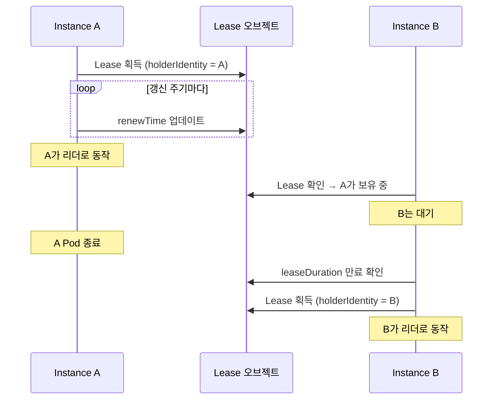

핵심 파라미터:

| 파라미터 | 의미 | 일반적인 값 |
|---------|------|-----------|
| `leaseDuration` | 리더 유효 시간 | 15초 |
| `renewDeadline` | 갱신 시도 기한 | 10초 |
| `retryPeriod` | 비리더의 재시도 간격 | 2초 |

### 서드파티 크레이트

kube 생태계에서 사용할 수 있는 leader election 크레이트:

| 크레이트 | 접근 방식 | 특징 |
|---------|----------|------|
| `kube-leader-election` | Lease 기반 | 단순한 API, 갱신 루프 제공 |
| `kube-coordinate` | Lease 기반 | kube-runtime 호환 스트림 API |
| `kubert::lease` | Lease 기반 | Linkerd 프로젝트에서 사용 |

사용 패턴:

```rust
// 개념적 사용 예시 (크레이트마다 API가 다릅니다)
let lease = LeaseManager::new(client.clone(), "my-controller", "controller-ns");

// 리더 획득까지 대기
lease.wait_for_leadership().await?;

// 리더일 때만 Controller 실행
Controller::new(api, wc)
    .shutdown_on_signal()
    .run(reconcile, error_policy, ctx)
    .for_each(|res| async move { /* ... */ })
    .await;
```

### shutdown 연계

리더십을 잃었을 때 Controller를 안전하게 종료하는 것이 중요합니다:

```rust
Controller::new(api, wc)
    .graceful_shutdown_on(lease.lost_leadership())
    .run(reconcile, error_policy, ctx)
```

`graceful_shutdown_on()`에 리더십 상실 future를 전달하면, 리더십을 잃었을 때 새 reconcile 시작을 중단하고 진행 중인 reconcile을 완료한 후 종료합니다.

## Graceful Shutdown

### shutdown_on_signal

`Controller::shutdown_on_signal()`은 SIGTERM과 Ctrl+C를 처리합니다.

```rust title="kube-runtime/src/controller/mod.rs (단순화)"
pub fn shutdown_on_signal(mut self) -> Self
```

동작:
1. SIGTERM 또는 SIGINT 수신 시 새 reconcile 시작 중단
2. 진행 중인 reconcile은 완료까지 대기
3. 두 번째 시그널 수신 시 즉시 종료

```rust
Controller::new(api, wc)
    .shutdown_on_signal()
    .run(reconcile, error_policy, ctx)
    .for_each(|res| async move {
        match res {
            Ok(obj) => tracing::info!(?obj, "reconciled"),
            Err(err) => tracing::error!(%err, "reconcile failed"),
        }
    })
    .await;
```

### 커스텀 shutdown trigger

`graceful_shutdown_on()`으로 임의의 shutdown 조건을 설정할 수 있습니다:

```rust
use tokio::sync::oneshot;

let (tx, rx) = oneshot::channel::<()>();

Controller::new(api, wc)
    .graceful_shutdown_on(async move { rx.await.ok(); })
    .run(reconcile, error_policy, ctx)
```

### Deployment 설정

```yaml title="deployment.yaml"
spec:
  replicas: 1
  strategy:
    type: Recreate  # 동시 실행 방지 (leader election 미사용 시)
  template:
    spec:
      terminationGracePeriodSeconds: 60  # 충분한 종료 시간
      containers:
        - name: controller
          # ...
```

| 전략 | leader election 없음 | leader election 있음 |
|------|--------------------|--------------------|
| `Recreate` | 권장 — 중복 방지 | 불필요 |
| `RollingUpdate` | 짧은 중복 발생 | 안전 — 새 인스턴스가 대기 |

## Elected Shards — HA + 수평 확장

대규모 클러스터에서는 단일 리더로는 처리량이 부족할 수 있습니다. 이때 **리소스를 샤딩**하여 여러 리더가 각자 담당 범위를 처리합니다.

```
┌─────────────┐  ┌─────────────┐  ┌─────────────┐
│  Shard 0    │  │  Shard 1    │  │  Shard 2    │
│ ns: team-a  │  │ ns: team-b  │  │ ns: team-c  │
│ (leader)    │  │ (leader)    │  │ (leader)    │
└─────────────┘  └─────────────┘  └─────────────┘
```

각 샤드는:
1. 자체 Lease로 독립적인 leader election 실행
2. 담당 범위의 리소스만 watch (네임스페이스별 `Api::namespaced()` 또는 label selector)
3. 다른 샤드의 리소스는 무시

샤딩 전략에 대한 자세한 내용은 [최적화 — 스케일링 전략](./optimization.md#스케일링-전략)을 참고합니다.

## 가용성 체크리스트

| 항목 | 확인 |
|------|------|
| reconciler가 idempotent한가? | |
| `shutdown_on_signal()` 또는 `graceful_shutdown_on()` 설정했는가? | |
| `terminationGracePeriodSeconds`가 충분한가? | |
| leader election 없이 `replicas > 1`을 쓰고 있지 않은가? | |
| leader election 사용 시 리더십 상실 → shutdown 연계가 되어 있는가? | |
| Deployment strategy가 적절한가? (`Recreate` 또는 leader election) | |


---

# Admission 검증

Kubernetes 리소스가 API 서버에 저장되기 전에 검증하는 계층을 다룹니다. kube-rs는 CRD 스키마 내 CEL 검증과 Admission Webhook 양쪽을 모두 지원합니다.

## 검증 계층 개요

리소스가 etcd에 저장되기까지 여러 검증 단계를 거칩니다:

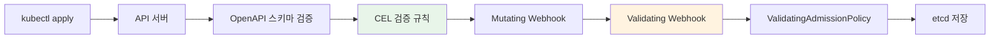

| 계층 | 위치 | 장점 | 단점 |
|------|------|------|------|
| CRD 스키마 (CEL) | API 서버 내부 | 외부 서비스 불필요, 빠름 | CRD 리소스만 가능, 표현력 제한 |
| Admission Webhook | 외부 서비스 | 임의 로직 가능, 모든 리소스 | 가용성 의존성 추가 |
| ValidatingAdmissionPolicy | API 서버 내부 | 외부 서비스 불필요, 모든 리소스 | K8s 1.28+ 필요 |
| 외부 프레임워크 | 정책 엔진 | 정책 관리 UI, 감사 | 별도 인프라 |

## CEL 검증

### KubeSchema derive

`#[derive(KubeSchema)]`는 CEL 검증 규칙이 포함된 `JsonSchema` 구현을 생성합니다. **CRD와 derive 매크로**에서 다룬 기본 스키마 생성에 CEL 규칙을 추가하는 것입니다.

```rust title="kube-derive/src/lib.rs (단순화)"
#[proc_macro_derive(KubeSchema, attributes(x_kube, schemars, validate))]
pub fn derive_schema_validation(input: proc_macro::TokenStream) -> proc_macro::TokenStream {
    cel_schema::derive_validated_schema(input.into()).into()
}
```

`KubeSchema`는 `JsonSchema` derive를 대체합니다. `CustomResource`와 함께 사용합니다:

```rust
use kube::CustomResource;
use kube::core::KubeSchema;
use serde::{Serialize, Deserialize};

#[derive(CustomResource, KubeSchema, Serialize, Deserialize, Clone, Debug)]
#[kube(group = "example.com", version = "v1", kind = "Document")]
#[kube(namespaced, status = "DocumentStatus")]
pub struct DocumentSpec {
    pub title: String,
    pub content: String,
    pub replicas: i32,
}
```

### x_kube validation 규칙

`#[x_kube(validation)]` 어트리뷰트로 CEL 검증 규칙을 추가합니다. struct 수준과 필드 수준 모두에 적용할 수 있습니다.

#### Struct 수준 검증

```rust
#[derive(CustomResource, KubeSchema, Serialize, Deserialize, Clone, Debug)]
#[kube(group = "example.com", version = "v1", kind = "Document")]
#[x_kube(validation = "self.spec.replicas <= 10")]
pub struct DocumentSpec {
    pub title: String,
    pub replicas: i32,
}
```

생성되는 CRD 스키마에 다음이 추가됩니다:

```yaml
x-kubernetes-validations:
  - rule: "self.spec.replicas <= 10"
```

#### 필드 수준 검증

```rust
pub struct DocumentSpec {
    #[x_kube(validation = Rule::new("self != ''").message("title은 비어있을 수 없습니다"))]
    pub title: String,

    #[x_kube(validation = Rule::new("self >= 1 && self <= 100").reason("FieldValueInvalid"))]
    pub replicas: i32,
}
```

`Rule` 빌더는 CEL 표현식에 메시지와 사유를 첨부합니다.

#### 불변 필드 (transition rule)

`self`와 `oldSelf`를 비교하는 CEL 규칙은 **transition rule**로 동작합니다. UPDATE 요청에서만 평가됩니다:

```rust
#[derive(CustomResource, KubeSchema, Serialize, Deserialize, Clone, Debug)]
#[kube(group = "example.com", version = "v1", kind = "Document")]
#[x_kube(validation = "self.spec.storageClass == oldSelf.spec.storageClass")]
pub struct DocumentSpec {
    pub storage_class: String,
    pub content: String,
}
```

#### kube 어트리뷰트 레벨 validation

`#[kube(validation = ...)]`으로도 최상위 CEL 규칙을 지정할 수 있습니다:

```rust
#[derive(CustomResource, KubeSchema, Serialize, Deserialize, Clone, Debug)]
#[kube(
    group = "example.com",
    version = "v1",
    kind = "Singleton",
    validation = Rule::new("self.metadata.name == 'singleton'"),
)]
pub struct SingletonSpec {
    pub config: String,
}
```

### merge_strategy

`#[x_kube(merge_strategy)]`로 Server-Side Apply의 merge 동작을 제어합니다:

```rust
pub struct DocumentSpec {
    #[x_kube(merge_strategy = "merge")]
    pub tags: Vec<String>,
}
```

이는 `x-kubernetes-list-type` 등의 스키마 확장을 생성합니다.

## Admission Webhook

CEL만으로 표현할 수 없는 검증(외부 시스템 조회, 복잡한 비즈니스 로직)이 필요할 때 Admission Webhook을 사용합니다.

### AdmissionReview 흐름

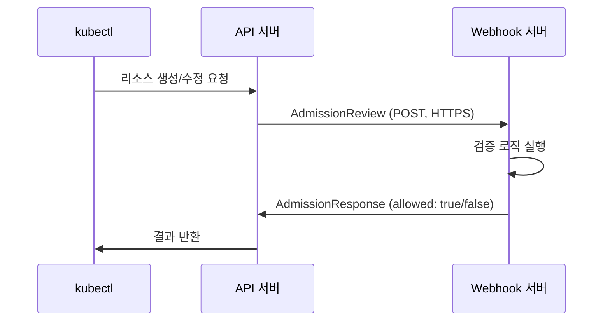

### kube::core::admission 모듈

kube-core는 Admission Webhook 구현에 필요한 타입을 제공합니다:

```rust title="kube-core/src/admission.rs (핵심 타입)"
pub struct AdmissionReview<T: Resource> {
    pub types: TypeMeta,
    pub request: Option<AdmissionRequest<T>>,
    pub response: Option<AdmissionResponse>,
}

pub struct AdmissionRequest<T: Resource> {
    pub uid: String,
    pub kind: GroupVersionKind,
    pub operation: Operation,  // Create, Update, Delete, Connect
    pub name: String,
    pub namespace: Option<String>,
    pub object: Option<T>,
    pub old_object: Option<T>,
    pub dry_run: bool,
    // ...
}

pub struct AdmissionResponse {
    pub uid: String,
    pub allowed: bool,
    pub result: Status,
    pub patch: Option<Vec<u8>>,
    pub patch_type: Option<PatchType>,  // JsonPatch
    pub warnings: Option<Vec<String>>,
    // ...
}
```

### Webhook 서버 구현

kube 자체에는 HTTP 서버가 포함되어 있지 않습니다. `axum`, `actix-web`, `warp` 등으로 webhook 엔드포인트를 구현합니다:

```rust
use kube::core::admission::{AdmissionReview, AdmissionRequest, AdmissionResponse};

async fn validate_handler(
    body: axum::Json<AdmissionReview<Document>>,
) -> axum::Json<AdmissionReview<Document>> {
    let req: AdmissionRequest<Document> = body.0.request.unwrap();
    let resp = match validate(&req) {
        Ok(()) => AdmissionResponse::from(&req).allowed(true),
        Err(reason) => {
            let mut resp = AdmissionResponse::from(&req);
            resp.allowed = false;
            resp.result.message = Some(reason);
            resp
        }
    };

    axum::Json(AdmissionReview {
        types: TypeMeta::default(),
        request: None,
        response: Some(resp),
    })
}

fn validate(req: &AdmissionRequest<Document>) -> Result<(), String> {
    if let Some(doc) = &req.object {
        if doc.spec.title.is_empty() {
            return Err("title은 비어있을 수 없습니다".into());
        }
    }
    Ok(())
}
```

### End-to-End 서버 구성

위의 handler를 실제로 서비스하려면 TLS를 지원하는 HTTP 서버와 Kubernetes 매니페스트가 필요합니다.

#### axum + rustls 서버

```rust
use axum::{routing::post, Router};
use axum_server::tls_rustls::RustlsConfig;

#[tokio::main]
async fn main() -> anyhow::Result<()> {
    let tls_config = RustlsConfig::from_pem_file(
        "/certs/tls.crt",
        "/certs/tls.key",
    ).await?;

    let app = Router::new()
        .route("/validate", post(validate_handler));

    axum_server::bind_rustls("0.0.0.0:8443".parse()?, tls_config)
        .serve(app.into_make_service())
        .await?;
    Ok(())
}
```

인증서 파일은 cert-manager `Certificate` 리소스 또는 init container에서 `/certs/` 에 마운트합니다.

#### ValidatingWebhookConfiguration 매니페스트

```yaml
apiVersion: admissionregistration.k8s.io/v1
kind: ValidatingWebhookConfiguration
metadata:
  name: document-validator
  annotations:
    cert-manager.io/inject-ca-from: default/webhook-cert  # cert-manager 자동 주입
webhooks:
  - name: validate.example.com
    admissionReviewVersions: ["v1"]
    clientConfig:
      service:
        name: webhook-server
        namespace: default
        path: /validate
        port: 443
    rules:
      - apiGroups: ["example.com"]
        apiVersions: ["v1"]
        operations: ["CREATE", "UPDATE"]
        resources: ["documents"]
    failurePolicy: Fail
    sideEffects: None
    timeoutSeconds: 5
```

`clientConfig.service`는 webhook Pod를 가리키는 Service를 참조합니다. `caBundle`은 cert-manager의 CA Injector가 annotation 기반으로 자동 주입합니다.

### 인증서 관리

API 서버는 webhook에 HTTPS로만 통신합니다. TLS 인증서가 반드시 필요합니다.

| 방법 | 설명 | 복잡도 |
|------|------|--------|
| cert-manager | 자동 발급/갱신, CA Injector 지원 | 낮음 |
| 자체 서명 | init container에서 인증서 생성 | 중간 |
| kube 클라이언트 인증서 | API 서버의 CA 사용 | 높음 |

cert-manager를 사용하면 `Certificate` 리소스로 인증서를 자동 관리하고, `caBundle` 주입도 자동화됩니다.

### FailurePolicy

webhook 서버가 응답하지 않을 때의 동작을 결정합니다:

```yaml title="validatingwebhookconfiguration.yaml"
webhooks:
  - name: validate.example.com
    failurePolicy: Fail     # webhook 장애 시 요청 거부
    # failurePolicy: Ignore # webhook 장애 시 요청 허용
    timeoutSeconds: 5
    matchPolicy: Equivalent
    sideEffects: None
```

| 정책 | 동작 | 사용 시점 |
|------|------|----------|
| `Fail` | webhook 장애 시 리소스 변경 거부 | 보안 관련 검증 |
| `Ignore` | webhook 장애 시 리소스 변경 허용 | 비핵심 검증 |

:::warning[Fail 정책의 위험]
`Fail` 정책에서 webhook 서버가 다운되면 해당 리소스의 모든 변경이 차단됩니다. 컨트롤러 자체의 배포도 차단될 수 있으므로, [가용성](./availability.md) 설계를 함께 고려합니다.
:::

## ValidatingAdmissionPolicy

Kubernetes 1.28+에서 CEL 기반 검증을 CRD가 아닌 모든 리소스에 적용할 수 있습니다. 외부 webhook 서버 없이 API 서버 내부에서 실행됩니다.

```yaml title="ValidatingAdmissionPolicy 예시"
apiVersion: admissionregistration.k8s.io/v1
kind: ValidatingAdmissionPolicy
metadata:
  name: require-labels
spec:
  matchConstraints:
    resourceRules:
      - apiGroups: ["apps"]
        apiVersions: ["v1"]
        operations: ["CREATE", "UPDATE"]
        resources: ["deployments"]
  validations:
    - expression: "has(object.metadata.labels) && 'team' in object.metadata.labels"
      message: "team 라벨이 필요합니다"
```

kube-rs 컨트롤러와의 관계:

- CRD 리소스의 기본 검증은 `#[x_kube(validation)]` CEL이 더 편리합니다 (코드와 검증이 한 곳에)
- CRD 외 리소스(Deployment, Service 등)에 조직 정책을 적용할 때 ValidatingAdmissionPolicy가 유용합니다
- 두 방식 모두 API 서버 내부에서 실행되므로 외부 가용성 의존성이 없습니다

## 외부 정책 프레임워크

조직 수준의 정책 관리가 필요할 때 전용 프레임워크를 사용합니다.

| 프레임워크 | 정책 언어 | 특징 |
|-----------|----------|------|
| Kyverno | YAML (선언적) | Kubernetes 네이티브, 학습 곡선 낮음 |
| Kubewarden | Wasm (Rust, Go 등) | Rust로 정책 작성 가능, OCI 배포 |
| OPA/Gatekeeper | Rego | 범용 정책 엔진, 넓은 생태계 |

**Kubewarden**은 Rust로 정책을 작성하고 Wasm으로 컴파일해서 배포하는 방식입니다.

kube-rs 컨트롤러와 함께 사용할 때:
- 컨트롤러가 생성하는 자식 리소스에도 정책이 적용됩니다
- 정책이 자식 리소스를 거부하면 reconciler에서 에러가 발생합니다
- **에러 처리**에서 이런 API 에러를 다루는 방법을 확인합니다

## 검증 전략 선택

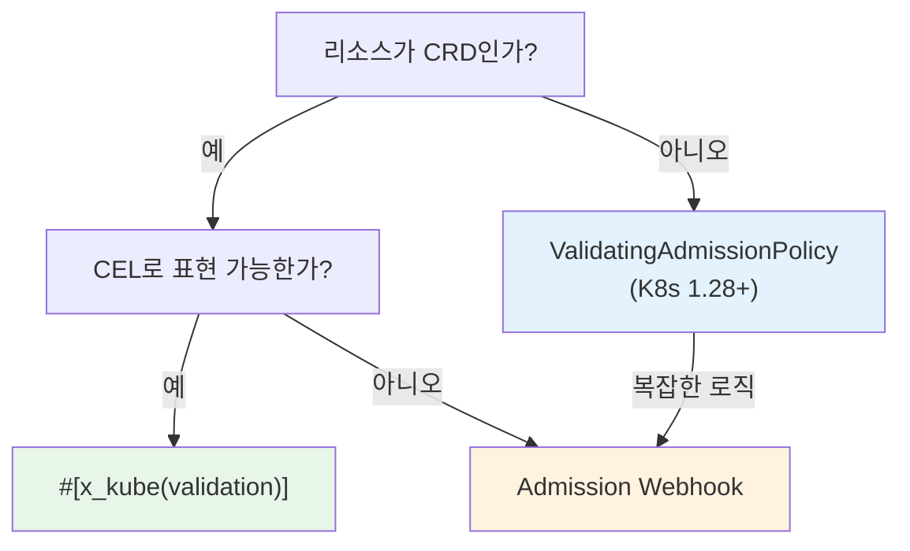

| 상황 | 권장 |
|------|------|
| CRD 필드 값 범위 검증 | `#[x_kube(validation)]` CEL |
| CRD 불변 필드 | `#[x_kube(validation)]` transition rule |
| 외부 시스템 조회가 필요한 검증 | Admission Webhook |
| 조직 수준 정책 (모든 리소스) | ValidatingAdmissionPolicy 또는 외부 프레임워크 |
| 리소스 변환 (mutation) | Mutating Webhook |
